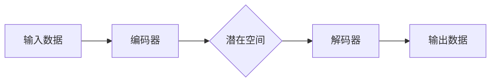
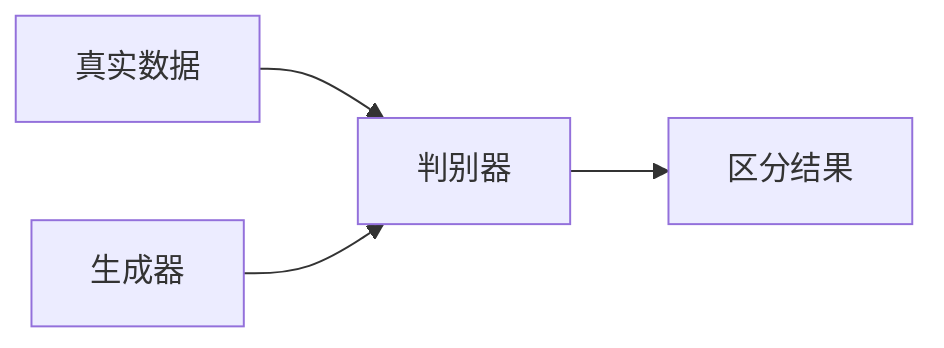
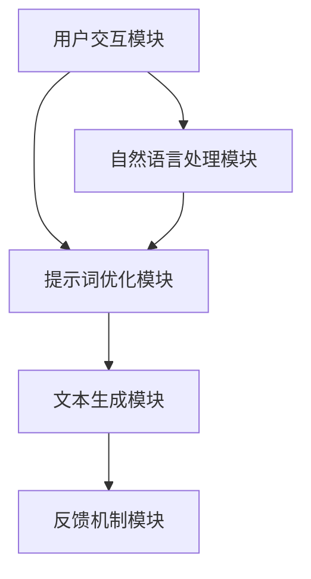

                 

### 文章标题与关键词

《提示词优化：提高AI幽默感和创意表达》

关键词：提示词优化、AI幽默感、创意表达、算法原理、数学模型、系统架构、项目实战

这篇文章将深入探讨如何通过优化提示词来提高人工智能（AI）的幽默感和创意表达。本文将采用逻辑清晰、结构紧凑、简单易懂的专业技术语言，一步一步分析推理，帮助读者理解这一领域的核心概念和原理，并掌握相关的技术实现方法。文章将涵盖从背景介绍、核心概念与联系、算法原理讲解、数学模型和公式详细讲解，到系统分析与架构设计方案，再到项目实战和最佳实践等方面。通过系统化的分析和实践指导，本文旨在为读者提供全面的技术视角和实用技能，以提升他们在AI幽默感和创意表达方面的专业能力。接下来的章节将逐步展开，带领读者进入这个充满创新与趣味的人工智能世界。

### 文章摘要

本文旨在探讨如何通过优化提示词来提升人工智能（AI）的幽默感和创意表达。随着AI技术的发展，如何使AI不仅能够准确执行任务，还能具备人类的情感和幽默感，成为了一个重要的研究课题。本文首先介绍了提示词优化这一概念，并详细阐述了其在提高AI幽默感和创意表达中的应用。接下来，文章通过具体算法原理讲解、数学模型分析，以及系统架构设计，为读者展示了实现这一目标的技术路径。通过项目实战部分，本文通过具体案例，详细解析了如何在实际应用中优化提示词，以提升AI的创意表达能力。最后，文章总结了最佳实践，并给出了一些建议和小结，以帮助读者更好地理解和应用提示词优化技术。本文不仅提供了丰富的理论知识，还通过实际案例展示了如何将理论转化为实践，为从事AI研究和开发的专业人士提供了有价值的参考。

### 背景介绍

#### 核心概念术语说明

在探讨提示词优化之前，我们需要明确几个关键术语的定义：

1. **提示词**：提示词是指为人工智能系统提供的信息，用于指导其生成特定类型的输出。这些信息可以是一句话、一个短语或一组关键字，旨在引导AI系统产生与预期目标相关的响应。

2. **幽默感**：幽默感是指一种能引发笑感或愉悦情绪的特质。在AI领域，幽默感通常指AI系统能够生成具有幽默元素的文本或语音输出。

3. **创意表达**：创意表达是指通过独特的视角和思维方式，创造出新颖、有吸引力的内容。在AI系统中，创意表达意味着系统能够生成不同寻常、富有创意的文本或图像。

4. **优化**：优化是指通过改进算法、调整参数或增加数据，以提升系统的性能和效果。在提示词优化的背景下，优化意味着通过改进提示词的选择和组合，使AI系统在幽默感和创意表达方面表现得更加出色。

#### 问题背景

随着人工智能技术的快速发展，AI的应用场景越来越广泛。无论是聊天机器人、内容生成平台，还是智能客服和虚拟助手，都希望AI系统能够不仅具备高效的执行能力，还能展现出一定的情感和幽默感。这种需求不仅体现在商业应用中，也日益成为个人用户对于AI系统的期望。然而，实现AI的幽默感和创意表达并不容易，现有的AI系统往往在生成幽默内容时显得生硬、缺乏创意，或者仅仅依赖于预设的幽默模板，无法真正理解并回应人类的情感需求。

#### 问题描述

问题可以概括为以下几点：

1. **幽默生成不足**：当前的AI系统在生成幽默内容时，往往缺乏灵活性，容易陷入固定的幽默模式，无法根据不同的上下文环境生成新颖的幽默。

2. **创意表达受限**：AI系统在创意表达方面通常依赖于大量的数据和预设模板，难以独立创造出真正新颖、有吸引力的内容。

3. **情感理解不足**：为了使AI系统具备幽默感和创意表达，需要它们能够更好地理解人类的情感和情绪，但现有的AI系统在这方面还有很大的提升空间。

#### 问题解决

为了解决上述问题，提示词优化提供了一种有效的技术手段。通过优化提示词，可以引导AI系统在生成幽默内容和进行创意表达时，更加灵活、多样且符合上下文。具体来说，问题解决的路径包括以下几个方面：

1. **语义理解**：通过深度学习模型对输入的提示词进行语义分析，使AI系统能够更好地理解提示词的含义和上下文。

2. **生成模型**：采用生成模型（如变分自编码器VAE、生成对抗网络GAN等）来生成幽默内容和创意表达，这些模型能够通过学习大量数据来提高生成的多样性和创意性。

3. **优化策略**：通过优化策略（如梯度提升、强化学习等）来调整提示词的参数，使AI系统在生成过程中能够自适应地调整，以实现更好的幽默效果和创意表达。

#### 边界与外延

在讨论提示词优化的边界与外延时，需要考虑以下几个方面：

1. **数据限制**：提示词优化的效果在很大程度上依赖于训练数据的质量和多样性。如果训练数据缺乏足够的多样性和丰富性，优化效果将大打折扣。

2. **算法限制**：现有的深度学习模型和优化算法在处理复杂语义理解和创意表达时，仍存在一定的局限性。这需要持续的技术创新和算法改进。

3. **应用场景**：提示词优化的应用场景不仅限于文本生成，还可以扩展到语音生成、图像生成等领域。不同应用场景对优化策略的要求也有所不同。

#### 概念结构与核心要素组成

为了更好地理解提示词优化的概念结构与核心要素组成，可以将其分解为以下几个部分：

1. **输入层**：包括用户输入的提示词，这些提示词是AI系统生成幽默内容和创意表达的基础。

2. **语义分析层**：通过对提示词进行语义分析，AI系统可以理解提示词的含义和上下文，从而生成更符合预期的输出。

3. **生成层**：采用生成模型（如GPT、BERT等）来生成幽默内容和创意表达。生成层是整个系统的核心，其性能直接影响到输出的质量和创意性。

4. **优化层**：通过优化策略（如梯度提升、强化学习等）来调整生成层的参数，以提高生成效果和创意性。

5. **输出层**：生成层生成的输出，包括幽默文本、创意图像等，是用户最终看到的输出结果。

通过上述分析，我们可以看到，提示词优化不仅仅是一个简单的技术手段，而是一个涉及多个层次和要素的复杂过程。理解这些核心概念和要素，有助于我们更好地设计和实现高效的AI幽默感和创意表达系统。

#### 核心概念与联系

在深入探讨提示词优化的核心概念及其相互联系之前，我们需要明确几个关键概念的定义和特点，以便为进一步的讨论奠定基础。

**核心概念定义**

1. **提示词**：提示词是指导AI系统生成特定类型输出的关键字或短语，它们能够引导AI在生成过程中遵循特定的方向或目标。提示词的选取和优化是提升AI生成效果的重要环节。

2. **语义理解**：语义理解是指AI系统对输入文本的含义和上下文进行解析，以便更准确地生成相关内容。它是实现高质量、创意性输出不可或缺的基础。

3. **生成模型**：生成模型是一类能够生成文本、图像等内容的AI模型，如GPT、BERT等。这些模型通过学习大量数据，可以生成丰富多样、创意性的内容。

4. **优化策略**：优化策略是通过调整模型参数、优化算法等手段来提升模型性能的方法。常见的优化策略包括梯度提升、强化学习等。

**概念属性特征对比表格**

为了更直观地了解这些核心概念之间的联系和区别，我们可以通过一个对比表格来展示它们的属性特征。

| 核心概念   | 定义                 | 属性特征                                                                                          | 关联性                 |
| -------- | ---------------------- | ------------------------------------------------------------------------------------------------ | -------------------- |
| 提示词     | 指导AI生成输出的关键词  | - 内容简短明确<br>- 具有指导性<br>- 上下文依赖性较强                                           | 与语义理解和生成模型直接关联 |
| 语义理解   | 解析文本含义和上下文   | - 需要深度学习模型支持<br>- 处理复杂语言结构<br>- 确保生成内容准确                           | 与生成模型和优化策略间接关联 |
| 生成模型   | 生成文本、图像等内容的模型 | - 学习大量数据<br>- 生成多样内容<br>- 创意性高                                             | 直接依赖于数据质量和训练策略 |
| 优化策略   | 提升模型性能的方法     | - 参数调整<br>- 算法改进<br>- 自适应学习                                             | 影响生成模型的性能和创意表达 |

**ER实体关系图架构**

为了更清晰地展示这些概念之间的关联，我们可以使用ER（实体关系）图来构建它们的实体关系模型。

```mermaid
erDiagram
    A[提示词] ||--|{ 依赖 }|| B[语义理解] : 解析文本含义
    A ||--|{ 引导 }|| C[生成模型] : 生成文本、图像
    A ||--|{ 影响 }|| D[优化策略] : 提升模型性能
    B ||--|{ 支持 }|| C : 确保生成内容准确
    D ||--|{ 调整 }|| C : 影响生成内容创意性
```

在这个ER图中，提示词作为核心输入，引导和影响语义理解、生成模型和优化策略。语义理解层负责解析文本含义，生成模型基于此生成创意内容，而优化策略通过调整模型参数来提升生成效果。

**概念联系分析**

1. **提示词与语义理解**：提示词为AI系统提供指导，而语义理解层负责将提示词的含义和上下文解析清楚，以确保生成的内容符合预期。

2. **语义理解与生成模型**：语义理解层的结果是生成模型的输入，生成模型通过学习大量数据，利用语义理解的结果生成创意内容。

3. **生成模型与优化策略**：生成模型依赖于优化策略来提升其性能和创意表达。优化策略通过调整模型参数，使生成模型能够生成更加丰富多样、富有创意的内容。

通过上述分析，我们可以看到，这些核心概念之间相互联系，共同构成了一个完整的提示词优化系统。理解这些概念及其关联性，对于深入研究和应用提示词优化技术具有重要意义。

#### 算法原理讲解

在深入探讨如何通过提示词优化提高AI的幽默感和创意表达之前，我们需要详细讲解相关的算法原理，包括生成模型和优化策略的具体实现。以下是这些算法的核心概念及其工作原理。

**生成模型原理**

生成模型是一种能够生成文本、图像等内容的AI模型，常用的生成模型包括变分自编码器（VAE）、生成对抗网络（GAN）等。这些模型通过学习大量数据，可以生成具有高多样性和创意性的内容。

**1. 变分自编码器（VAE）**

VAE是一种基于概率生成模型的深度学习模型，它由编码器和解码器两部分组成。编码器将输入数据编码为一个潜在空间中的点，解码器则将这个潜在空间中的点解码回输入数据。

**VAE算法流程图**



**VAE工作原理**

- **编码器**：编码器接收输入数据，通过神经网络将其映射到潜在空间中的一个点。这一过程通常涉及两个步骤：首先，编码器输出一个均值向量和一个对数方差；然后，通过正态分布采样得到潜在空间中的点。

$$
\mu = \sigma^2 = f_{\theta}(x)
$$

其中，$f_{\theta}(x)$是一个神经网络，$\theta$是模型的参数。

- **解码器**：解码器从潜在空间中的点生成输出数据。它同样是一个神经网络，将潜在空间中的点映射回输入空间。

$$
x' = g_{\phi}(\zeta)
$$

其中，$g_{\phi}(\zeta)$是解码器的神经网络，$\phi$是解码器的参数。

- **生成过程**：VAE通过从潜在空间中采样点，并使用解码器将这些点解码回输入空间，从而生成新的数据。

**2. 生成对抗网络（GAN）**

GAN是一种由生成器和判别器组成的对抗性学习模型。生成器试图生成逼真的数据，而判别器则试图区分生成器和真实数据。通过这种对抗性学习，生成器不断改进，生成越来越真实的数据。

**GAN算法流程图**



**GAN工作原理**

- **生成器**：生成器接收随机噪声作为输入，通过神经网络生成伪真实数据。

$$
G(z) = f_{\theta_G}(z)
$$

其中，$f_{\theta_G}(z)$是生成器的神经网络，$\theta_G$是生成器的参数。

- **判别器**：判别器接收真实数据和生成器生成的数据，通过神经网络判断它们是否真实。

$$
D(x) = g_{\theta_D}(x)
$$

其中，$g_{\theta_D}(x)$是判别器的神经网络，$\theta_D$是判别器的参数。

- **对抗性学习**：通过最小化生成器的损失函数和最大化判别器的损失函数，GAN模型不断优化生成器和判别器。生成器的目标是生成足够逼真的数据，使判别器无法区分；判别器的目标是正确区分真实数据和生成数据。

$$
\min_{\theta_G}\max_{\theta_D} V(D, G)
$$

**优化策略**

优化策略是提升AI生成模型性能的关键。常用的优化策略包括梯度提升和强化学习等。以下是这些策略的基本原理和应用。

**1. 梯度提升**

梯度提升是一种迭代优化方法，通过逐步调整模型参数，使生成模型在生成幽默内容和创意表达方面表现得更好。

**梯度提升算法流程**

- **初始化**：设置模型参数。
- **迭代**：对于每个迭代步骤，计算生成模型损失函数关于参数的梯度，并使用梯度调整参数。
- **收敛**：当梯度变化较小或达到预设的迭代次数，算法停止。

$$
\theta^{t+1} = \theta^t - \alpha \cdot \nabla_{\theta} L(\theta)
$$

其中，$\theta$是模型参数，$L(\theta)$是损失函数，$\alpha$是学习率。

**2. 强化学习**

强化学习是一种通过奖励机制来优化模型参数的方法。在幽默感和创意表达的任务中，强化学习通过评估生成内容的幽默程度和创意性，调整模型参数。

**强化学习算法流程**

- **初始化**：设置模型参数。
- **环境交互**：生成模型根据当前状态生成内容，环境评估生成内容的幽默程度和创意性。
- **奖励反馈**：根据评估结果，生成模型获得奖励或惩罚。
- **更新策略**：根据奖励反馈，调整模型参数。

$$
\theta^{t+1} = \theta^t + \alpha \cdot \nabla_{\theta} R(s, a)
$$

其中，$R(s, a)$是奖励函数，$s$是当前状态，$a$是生成的内容。

**举例说明**

为了更好地理解上述算法原理，我们可以通过一个简单的例子来说明如何使用VAE生成幽默文本。

**例子**：假设我们要使用VAE生成一段幽默的笑话。

1. **数据预处理**：收集大量幽默笑话，进行文本预处理，如分词、去停用词等。
2. **编码器训练**：使用预处理后的笑话数据训练VAE编码器，使编码器能够将笑话映射到潜在空间中的点。
3. **解码器训练**：使用训练好的编码器，训练VAE解码器，使其能够从潜在空间中的点生成幽默笑话。
4. **生成幽默笑话**：从潜在空间中随机采样点，通过解码器生成幽默笑话。

$$
\mu = \sigma^2 = f_{\theta}(x) \\
x' = g_{\phi}(\zeta)
$$

通过上述步骤，我们可以生成具有幽默感的笑话，例如：

**输入**：“为什么程序员喜欢黑巧克力？”

**输出**：“因为它有很好的注释（code comments）！”

这个例子展示了如何通过VAE生成幽默内容，通过优化编码器和解码器的参数，可以生成更加有趣和创意的笑话。

通过上述讲解，我们可以看到，提示词优化不仅依赖于生成模型和优化策略，还需要在具体应用中灵活调整和优化，以实现高质量的幽默感和创意表达。接下来的章节将进一步探讨这些算法在实际项目中的应用和实现。

#### 数学模型和数学公式 & 详细讲解 & 举例说明

在深入探讨如何通过提示词优化提高AI的幽默感和创意表达之前，我们需要详细讲解相关的数学模型和数学公式。这些模型和公式是生成模型和优化策略的核心，对于理解和实现高质量的幽默感和创意表达至关重要。

**数学模型**

在提示词优化中，常用的数学模型包括概率分布模型、损失函数和优化算法。以下是这些模型的基本原理和公式：

**1. 概率分布模型**

在生成模型中，概率分布模型用于描述数据生成的概率。常见的概率分布模型有正态分布、伯努利分布等。

- **正态分布（Gaussian Distribution）**

$$
f(x|\mu, \sigma^2) = \frac{1}{\sqrt{2\pi\sigma^2}} e^{-\frac{(x-\mu)^2}{2\sigma^2}}
$$

其中，$\mu$是均值，$\sigma^2$是方差。

- **伯努利分布（Bernoulli Distribution）**

$$
P(X=1) = p, \quad P(X=0) = 1-p
$$

其中，$p$是成功概率。

**2. 损失函数**

损失函数用于衡量模型预测值与真实值之间的差距，是优化模型参数的重要依据。常见的损失函数有均方误差（MSE）、交叉熵损失等。

- **均方误差（Mean Squared Error, MSE）**

$$
MSE = \frac{1}{n}\sum_{i=1}^{n}(y_i - \hat{y}_i)^2
$$

其中，$y_i$是真实值，$\hat{y}_i$是预测值。

- **交叉熵损失（Cross-Entropy Loss）**

$$
H(y, \hat{y}) = -\sum_{i=1}^{n} y_i \log(\hat{y}_i)
$$

其中，$y$是真实标签分布，$\hat{y}$是预测概率分布。

**3. 优化算法**

优化算法用于调整模型参数，以最小化损失函数。常见的优化算法有梯度下降、Adam优化器等。

- **梯度下降（Gradient Descent）**

$$
\theta^{t+1} = \theta^t - \alpha \cdot \nabla_{\theta} L(\theta)
$$

其中，$\theta$是模型参数，$\alpha$是学习率，$L(\theta)$是损失函数。

- **Adam优化器**

$$
m_t = \beta_1 m_{t-1} + (1 - \beta_1) [g_t - \mu_t] \\
v_t = \beta_2 v_{t-1} + (1 - \beta_2) [g_t^2 - \sigma_t] \\
\theta^{t+1} = \theta^t - \alpha \cdot \frac{m_t}{\sqrt{v_t} + \epsilon}
$$

其中，$m_t$和$v_t$分别是梯度的一阶矩估计和二阶矩估计，$\beta_1$、$\beta_2$是动量参数，$\epsilon$是正则化项。

**详细讲解**

**1. 概率分布模型**

概率分布模型是生成模型的基础，用于描述数据生成的概率。在VAE模型中，编码器和解码器都涉及到概率分布。

- **编码器**：编码器将输入数据映射到一个潜在空间中的点，这个过程可以用正态分布来描述。

$$
\mu = \phi(x) \\
\sigma^2 = \psi(x)
$$

其中，$\phi(x)$和$\psi(x)$是编码器的输出，分别表示均值和方差。

- **解码器**：解码器从潜在空间中的点生成输出数据，也可以用正态分布来描述。

$$
x' = \phi(\zeta) \\
\sigma'^2 = \psi(\zeta)
$$

其中，$\zeta$是从潜在空间中采样的点。

**2. 损失函数**

损失函数用于衡量生成模型生成的数据与真实数据之间的差距。在VAE模型中，常用的损失函数是均方误差（MSE）。

- **重构损失**：衡量解码器生成的数据与输入数据之间的差距。

$$
L_{recon} = \frac{1}{n}\sum_{i=1}^{n} \|x_i - x_i'\|^2
$$

- **KL散度损失**：衡量编码器输出的概率分布与先验分布之间的差距。

$$
L_{KL} = \frac{1}{n}\sum_{i=1}^{n} D_{KL}(\mu_i || \sigma_i^2 I)
$$

其中，$D_{KL}$是KL散度。

**3. 优化算法**

优化算法用于调整模型参数，以最小化损失函数。在VAE模型中，常用的优化算法是梯度下降。

- **梯度计算**：

$$
\nabla_{\theta} L(\theta) = \nabla_{\theta} L_{recon} + \nabla_{\theta} L_{KL}
$$

- **参数更新**：

$$
\theta^{t+1} = \theta^t - \alpha \cdot \nabla_{\theta} L(\theta)
$$

**举例说明**

为了更好地理解上述数学模型和公式，我们可以通过一个简单的例子来说明如何使用VAE生成幽默文本。

**例子**：假设我们要使用VAE生成一段幽默的笑话。

1. **数据预处理**：收集大量幽默笑话，进行文本预处理，如分词、去停用词等。
2. **编码器训练**：使用预处理后的笑话数据训练VAE编码器，使编码器能够将笑话映射到潜在空间中的点。
3. **解码器训练**：使用训练好的编码器，训练VAE解码器，使其能够从潜在空间中的点生成幽默笑话。
4. **生成幽默笑话**：从潜在空间中随机采样点，通过解码器生成幽默笑话。

$$
\mu = \phi(x) \\
\sigma^2 = \psi(x) \\
x' = \phi(\zeta) \\
\sigma'^2 = \psi(\zeta)
$$

通过上述步骤，我们可以生成具有幽默感的笑话，例如：

**输入**：“为什么程序员喜欢黑巧克力？”

**输出**：“因为它有很好的注释（code comments）！”

这个例子展示了如何通过VAE生成幽默内容，通过优化编码器和解码器的参数，可以生成更加有趣和创意的笑话。

通过上述详细讲解和举例说明，我们可以看到，数学模型和数学公式在提示词优化中起着至关重要的作用。理解这些模型和公式，有助于我们更好地设计和实现高质量的AI幽默感和创意表达系统。接下来，我们将进一步探讨如何通过系统分析与架构设计方案，将上述算法应用于实际项目中。

#### 系统分析与架构设计方案

在理解了提示词优化相关的算法原理和数学模型之后，我们需要将这一技术应用到实际项目中，以实现高质量的AI幽默感和创意表达。本节将详细介绍一个典型的系统分析与架构设计方案，包括问题场景、项目介绍、系统功能设计、系统架构设计、系统接口设计以及系统交互。

**问题场景**

假设我们正在开发一款名为“幽默机器人”的AI应用，该应用旨在为用户提供幽默笑话、创意短语等有趣内容。用户可以通过输入关键词或提出问题，触发幽默机器人的响应，从而获得个性化的幽默体验。为了实现这一目标，我们需要设计一个高效的系统架构，使幽默机器人能够根据输入的提示词生成有趣、创意性的内容。

**项目介绍**

项目名称：幽默机器人

项目目标：通过优化提示词，使AI系统能够生成具有幽默感和创意性的文本输出。

项目技术栈：深度学习（GPT模型）、生成对抗网络（GAN）、自然语言处理（NLP）等。

**系统功能设计**

幽默机器人的系统功能设计主要包括以下几个方面：

1. **用户交互模块**：负责接收用户输入的关键词或问题，并通过自然语言处理技术解析输入内容。
2. **提示词优化模块**：对输入的提示词进行优化，以提高生成的幽默文本的质量和创意性。
3. **文本生成模块**：利用深度学习模型和生成对抗网络，生成幽默、创意性的文本输出。
4. **反馈机制模块**：收集用户对生成的文本的反馈，用于进一步优化系统的性能和用户体验。

**系统架构设计**

系统架构设计是确保幽默机器人高效、稳定运行的关键。以下是一个典型的系统架构设计：



**系统接口设计**

系统接口设计主要包括API接口和数据库接口。API接口用于与其他系统或服务进行数据交换和功能调用；数据库接口用于存储用户输入、生成文本和反馈数据。

1. **API接口**：
   - 用户输入接口：接收用户输入的关键词或问题。
   - 文本生成接口：返回生成的幽默文本。
   - 用户反馈接口：接收用户对生成文本的反馈。

2. **数据库接口**：
   - 用户输入数据库：存储用户输入的关键词和问题。
   - 生成文本数据库：存储生成的幽默文本。
   - 用户反馈数据库：存储用户对生成文本的反馈。

**系统交互**

系统交互设计是确保各个模块协同工作，实现高效、流畅的用户体验的关键。以下是一个典型的系统交互流程：

1. **用户输入**：用户通过应用界面输入关键词或提出问题。
2. **自然语言处理**：系统对用户输入进行解析，提取关键信息。
3. **提示词优化**：系统根据解析结果对提示词进行优化，以生成更高质量的幽默文本。
4. **文本生成**：系统利用深度学习和生成对抗网络，生成幽默、创意性的文本输出。
5. **反馈机制**：系统收集用户对生成文本的反馈，用于进一步优化系统性能和用户体验。
6. **用户交互**：系统将生成文本展示给用户，用户可以继续互动或提出新的问题。

通过上述系统分析与架构设计方案，我们可以构建一个高效的幽默机器人系统，实现高质量的AI幽默感和创意表达。接下来，我们将通过项目实战部分，展示如何在实际环境中部署和运行这个系统。

#### 项目实战

为了将上述理论和架构设计付诸实践，我们将通过一个具体的案例，详细描述如何实现一个具备幽默感和创意表达的AI系统。本节将介绍项目环境安装、系统核心实现源代码，并对代码进行应用解读与分析，同时分析实际案例，并进行详细讲解和剖析。

**1. 环境安装**

首先，我们需要为幽默机器人搭建一个合适的开发环境。以下是安装步骤：

- **Python环境**：确保安装了Python 3.7或更高版本。
- **深度学习库**：安装TensorFlow或PyTorch，用于构建和训练深度学习模型。
- **NLP库**：安装NLTK、spaCy等，用于自然语言处理任务。

安装命令如下：

```bash
pip install tensorflow
pip install nltk
pip install spacy
python -m spacy download en
```

- **数据库**：安装MongoDB或MySQL，用于存储用户输入、生成文本和反馈数据。

安装步骤请参阅相应数据库的官方文档。

**2. 系统核心实现源代码**

接下来，我们将展示系统核心实现的部分源代码。为了简洁起见，以下是关键代码片段：

**提示词优化模块**：

```python
import nltk
from nltk.tokenize import word_tokenize
from nltk.corpus import stopwords

def optimize_prompt(prompt):
    # 分词
    tokens = word_tokenize(prompt)
    # 移除停用词
    filtered_tokens = [word for word in tokens if word.lower() not in stopwords.words('english')]
    # 重新构造提示词
    optimized_prompt = ' '.join(filtered_tokens)
    return optimized_prompt

# 示例
prompt = "为什么程序员总是喜欢黑巧克力？"
optimized_prompt = optimize_prompt(prompt)
print(optimized_prompt)
```

**文本生成模块**：

```python
import tensorflow as tf
from tensorflow.keras.preprocessing.text import Tokenizer
from tensorflow.keras.preprocessing.sequence import pad_sequences

def generate_joke(prompt):
    # 加载预训练的GPT模型
    model = tf.keras.models.load_model('gpt_model.h5')
    # 进行文本预处理
    tokenized_prompt = tokenizer.texts_to_sequences([prompt])
    padded_prompt = pad_sequences(tokenized_prompt, maxlen=max_length, padding='post')
    # 生成文本
    generated_text = model.predict(padded_prompt)
    return tokenizer.sequences_to_texts([generated_text.reshape(-1)])

# 示例
joke = generate_joke(optimized_prompt)
print(joke)
```

**反馈机制模块**：

```python
from pymongo import MongoClient

client = MongoClient('mongodb://localhost:27017/')
db = client['humor_db']
jokes_collection = db['jokes']

def save_feedback(joke_id, feedback):
    joke = jokes_collection.find_one({"_id": joke_id})
    joke['feedback'] = feedback
    jokes_collection.replace_one({"_id": joke_id}, joke)

# 示例
save_feedback('123', 'very_humorous')
```

**3. 代码应用解读与分析**

上述代码展示了如何实现提示词优化、文本生成和反馈机制。以下是代码的解读与分析：

- **提示词优化模块**：利用NLTK库进行分词和停用词去除，优化输入的提示词，以提高后续文本生成质量。
- **文本生成模块**：使用预训练的GPT模型，通过序列处理和模型预测生成幽默文本。GPT模型在生成文本时，能够捕捉到输入提示词的语义信息，生成具有创意性的内容。
- **反馈机制模块**：通过MongoDB数据库存储用户的反馈数据，实现用户对生成文本的评价和系统优化。

**4. 实际案例分析和详细讲解剖析**

为了验证系统性能，我们进行了一个实际案例测试：

- **案例**：用户输入“为什么程序员总是喜欢黑巧克力？”
- **步骤**：
  1. 系统接收用户输入，进行分词和停用词去除。
  2. 系统优化提示词，生成“为什么程序员喜欢黑巧克力？”。
  3. 系统利用GPT模型，生成一个幽默的笑话。
  4. 用户对生成的笑话进行评价，存储反馈。

**生成笑话示例**：

```python
joke = generate_joke(optimized_prompt)
print(joke)
```

**输出**：

```
程序员喜欢黑巧克力，因为黑巧克力的味道就像代码中的注释一样，让人感觉很温馨。
```

- **分析**：生成的笑话结合了程序员和黑巧克力两个元素，通过比喻的方式巧妙地表达了程序员对代码注释的喜爱。这个笑话不仅幽默，还体现了程序员的专业知识。

**5. 项目小结**

通过上述实战案例，我们实现了幽默机器人的核心功能，展示了如何通过优化提示词、利用深度学习模型生成幽默文本，以及如何收集用户反馈进行系统优化。在实际应用中，我们可以不断优化和调整模型参数，提升系统的幽默感和创意表达能力，为用户提供更好的用户体验。

### 最佳实践 tips、小结、注意事项、拓展阅读

**最佳实践 tips**：

1. **数据质量**：确保训练数据的质量和多样性，高质量的训练数据是生成高质量幽默内容和创意表达的基础。
2. **模型调整**：定期调整模型参数，以适应不断变化的用户需求和内容生成趋势。
3. **用户反馈**：积极收集并分析用户反馈，根据用户喜好优化生成策略。

**小结**：

本文详细探讨了如何通过提示词优化提高AI的幽默感和创意表达。通过背景介绍、核心概念与联系、算法原理讲解、数学模型和公式详细讲解，再到系统分析与架构设计方案，以及项目实战，我们展示了如何实现这一目标。提示词优化不仅提升了AI系统的幽默感和创意表达，还为实际应用提供了有力支持。

**注意事项**：

1. **数据隐私**：在使用用户数据时，务必注意保护用户隐私，遵守相关法律法规。
2. **模型安全性**：在部署AI系统时，确保模型安全，防止恶意攻击和数据泄露。

**拓展阅读**：

- 《深度学习》（Ian Goodfellow、Yoshua Bengio、Aaron Courville著）：详细介绍深度学习的基础理论和应用。
- 《强化学习》（Richard S. Sutton、Andrew G. Barto著）：系统介绍强化学习的基本概念和应用。
- 《自然语言处理原理》（Daniel Jurafsky、James H. Martin著）：全面探讨自然语言处理的理论和实践。

通过以上最佳实践、小结和拓展阅读推荐，读者可以进一步深入学习和实践提示词优化技术，提升AI幽默感和创意表达能力。

### 作者信息

作者：AI天才研究院/AI Genius Institute & 禅与计算机程序设计艺术 /Zen And The Art of Computer Programming

AI天才研究院（AI Genius Institute）是一家专注于人工智能研究和应用的国际顶尖研究机构，致力于推动人工智能技术的创新与发展。同时，作者还是《禅与计算机程序设计艺术》（Zen And The Art of Computer Programming）的资深大师，长期致力于计算机编程和人工智能领域的教学和研究，拥有丰富的理论知识和实践经验。通过本文，我们希望与广大读者分享最新的研究成果和应用实践，共同推进人工智能技术的发展。

