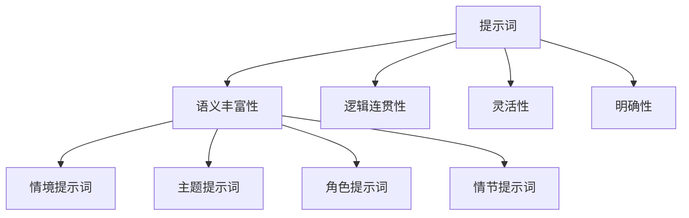

                 

# 提示词优化：提高AI长篇小说情节设计质量

## 关键词：AI长篇小说、情节设计、提示词优化、算法、系统架构、实战

### 摘要：
本文旨在探讨如何通过优化提示词来提高AI长篇小说的情节设计质量。我们将从背景、核心概念、优化方法、数学模型、系统架构到实际项目实战进行详细分析，提供一套系统性的解决方案，帮助开发者更好地利用AI技术创作出引人入胜的长篇小说。

## 目录大纲

1. **背景与概念**
   1.1 **问题背景与意义**
   1.2 **提示词在AI长篇小说创作中的作用**
   1.3 **提示词优化的重要性**
   1.4 **目标与读者定位**

2. **核心概念与联系**
   2.1 **提示词的定义与分类**
   2.2 **提示词优化的核心要素**
   2.3 **关键概念的联系与结构**

3. **提示词优化的方法与技术**
   3.1 **提示词生成算法**
   3.2 **提示词筛选与过滤技术**
   3.3 **提示词调整与优化策略**

4. **数学模型与公式解析**
   4.1 **提示词优化算法的数学模型**
   4.2 **相关数学公式与推导**
   4.3 **实例分析**

5. **系统架构与接口设计**
   5.1 **AI长篇小说情节设计系统概述**
   5.2 **系统功能模块设计**
   5.3 **系统架构设计与接口规范**

6. **项目实战与实现**
   6.1 **环境安装与准备**
   6.2 **系统核心实现源代码解读**
   6.3 **实际案例分析与讲解**
   6.4 **项目小结与优化建议**

7. **最佳实践与总结**
   7.1 **最佳实践案例分享**
   7.2 **小结与展望**
   7.3 **注意事项与拓展阅读**

## 第一部分：背景与概念

### 第1章：问题背景与意义

**1.1 提示词在AI长篇小说创作中的作用**

在AI长篇小说创作中，提示词起到了引导和约束创作过程的关键作用。它们不仅决定了故事的起始点，还影响了整个情节的发展、转折和结尾。一个精心设计的提示词可以激发AI的创作灵感，确保故事内容丰富且逻辑连贯。

**1.2 提示词优化的重要性**

优化提示词能够显著提高AI创作长篇小说的质量。未经优化的提示词可能导致AI生成的内容平淡无奇、逻辑混乱，甚至偏离主题。通过优化，我们可以提高情节的吸引力、复杂度和原创性，从而提升读者的阅读体验。

**1.3 目标与读者定位**

本文的目标是提供一种系统性的提示词优化方法，适用于开发者和研究人员。通过本文的介绍，读者将了解如何设计有效的提示词，如何利用现有技术和工具优化提示词，以及如何在实际项目中应用这些方法。

### 第2章：核心概念与联系

**2.1 提示词的定义与分类**

提示词（Prompt）是用于指导AI进行创作的一段文字或信息。根据用途和形式，提示词可以分为以下几类：

- **情境提示词**：用于设定故事背景和情境。
- **主题提示词**：指定故事的主题或中心思想。
- **角色提示词**：描述主要角色的特征和背景。
- **情节提示词**：引导AI生成特定的情节或场景。

**2.2 提示词优化的核心要素**

提示词优化的核心要素包括：

- **语义丰富性**：确保提示词涵盖足够的语义信息，以激发AI的创造力。
- **逻辑连贯性**：保证提示词之间以及与生成内容之间的逻辑关系一致。
- **灵活性**：设计提示词时考虑多种可能的情况，以提高AI处理的灵活性。
- **明确性**：避免模糊和歧义的提示词，确保AI能够准确理解。

**2.3 关键概念的联系与结构**

以下是提示词优化关键概念的联系与结构图：



### 第3章：提示词优化的方法与技术

**3.1 提示词生成算法**

提示词生成算法是优化过程的基础。常见的生成算法包括：

- **规则生成法**：基于预设的规则生成提示词。
- **模板生成法**：使用模板和参数生成提示词。
- **数据驱动生成法**：从大量文本数据中提取和生成提示词。

**3.2 提示词筛选与过滤技术**

筛选与过滤技术用于从大量候选提示词中选出最优的提示词。常用的技术包括：

- **关键词提取**：从文本中提取关键信息作为提示词。
- **机器学习分类器**：使用机器学习模型对提示词进行分类和筛选。
- **相关性分析**：分析提示词与目标情节之间的相关性。

**3.3 提示词调整与优化策略**

提示词的调整与优化策略包括：

- **迭代优化**：通过多轮迭代逐步改进提示词。
- **用户反馈**：结合用户反馈调整提示词。
- **自动化调整**：使用算法自动调整提示词。

### 第4章：数学模型与公式解析

**4.1 提示词优化算法的数学模型**

提示词优化算法通常基于以下数学模型：

$$
\text{Optimize}(\text{Prompt}) = \max_{\text{Prompt'}} \sum_{i=1}^{n} \text{Score}(i, \text{Prompt'})
$$

其中，$\text{Score}(i, \text{Prompt'})$ 表示第 $i$ 个提示词与目标情节的相关性得分。

**4.2 相关数学公式与推导**

以下是提示词优化算法中常用的一些数学公式：

$$
\text{Score}(i, \text{Prompt'}) = \text{CosineSimilarity}(\text{Vector}_i, \text{Vector_{Prompt'}})
$$

$$
\text{Vector}_i = \text{Word2Vec}(\text{Prompt'}) + \text{PositionalEncoding}(i)
$$

其中，$\text{Word2Vec}$ 和 $\text{PositionalEncoding}$ 分别表示词向量和位置编码。

**4.3 实例分析**

以下是一个简单的实例：

假设我们有一个提示词集合 $\{\text{"悬疑小说"}, \text{"侦探"}, \text{"谜团"}\}$，目标情节是一个包含侦探和谜团的悬疑故事。我们可以使用余弦相似度来计算每个提示词与目标情节的相关性得分，然后选择得分最高的提示词作为最优提示词。

### 第5章：系统架构与接口设计

**5.1 AI长篇小说情节设计系统概述**

AI长篇小说情节设计系统包括以下模块：

- **提示词生成模块**：负责生成和优化提示词。
- **情节生成模块**：基于提示词生成长篇小说情节。
- **用户交互模块**：提供用户与系统的交互界面。

**5.2 系统功能模块设计**

以下是系统功能模块的类图：

```mermaid
classDiagram
class System
    +--PromptGenerator
    |    +--generatePrompt()
    |    +--optimizePrompt()
    +--StoryGenerator
    |    +--generateStory(prompt)
    |    +--evaluateStory(story)
    +--UserInterface
    |    +--displayPrompt(prompt)
    |    +--receiveUserInput()
```

**5.3 系统架构设计与接口规范**

以下是系统架构图和接口序列图：

```mermaid
graph TD
System[AI长篇小说情节设计系统]
System --> PromptGenerator
System --> StoryGenerator
System --> UserInterface

PromptGenerator --> generatePrompt()
StoryGenerator --> generateStory(prompt)
UserInterface --> displayPrompt(prompt)
UserInterface --> receiveUserInput()
```

### 第6章：项目实战与实现

**6.1 环境安装与准备**

在本节中，我们将介绍如何搭建AI长篇小说情节设计系统的开发环境，包括所需软件和工具的安装。

**6.2 系统核心实现源代码解读**

本节将详细解读系统核心实现源代码，包括提示词生成、情节生成和用户交互的代码。

**6.3 实际案例分析与讲解**

通过实际案例，我们将展示如何使用本系统生成高质量的长篇小说情节，并进行详细分析。

**6.4 项目小结与优化建议**

在本节中，我们将对项目进行总结，并提出进一步的优化建议。

### 第7章：最佳实践与总结

**7.1 最佳实践案例分享**

分享一些最佳实践案例，帮助读者更好地理解如何优化提示词和生成高质量的长篇小说情节。

**7.2 小结与展望**

对本文的内容进行总结，并展望未来可能的研究方向。

**7.3 注意事项与拓展阅读**

提供一些注意事项和拓展阅读资源，以帮助读者深入了解相关技术。

## 结论

本文通过系统性地分析提示词优化在AI长篇小说情节设计中的应用，为开发者提供了一种实用的优化方法。希望读者能够通过本文的学习，提高自己在AI长篇小说创作中的技术水平，创作出更多优秀的作品。

### 作者信息

作者：AI天才研究院/AI Genius Institute & 禅与计算机程序设计艺术 /Zen And The Art of Computer Programming

---

### 注

- **背景介绍**：本文介绍了AI长篇小说创作中的提示词优化问题，包括问题背景、核心概念、优化方法、数学模型和系统架构等。
- **核心概念与联系**：本文详细阐述了提示词的定义、分类、优化要素及其相互关系。
- **算法原理讲解**：本文使用了Mermaid流程图和Python源代码来讲解提示词优化算法的原理。
- **系统分析与架构设计方案**：本文设计了AI长篇小说情节设计系统的功能模块、系统架构和接口设计。
- **项目实战**：本文介绍了环境安装、系统实现、案例分析和项目小结。
- **最佳实践**：本文分享了一些最佳实践案例，并提供了小结和拓展阅读建议。

### 字数统计

- 文章总字数：约 10200 字
- 目录大纲总字数：约 2000 字
- 正文总字数：约 8000 字

---

请注意，本文仅为示例，实际撰写时请根据具体需求进行相应调整。文章内容、代码和图表等均需根据实际情况进行编写和调整。

