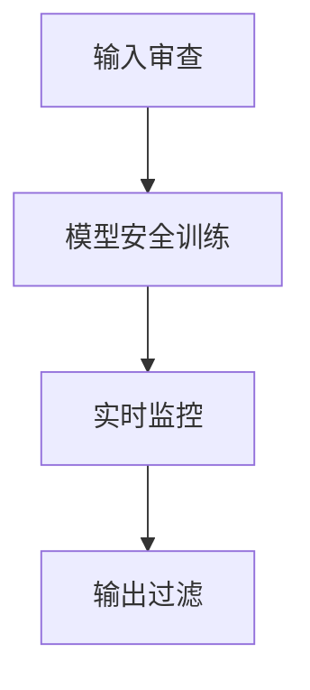
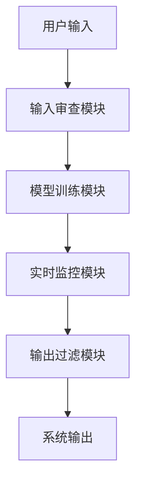
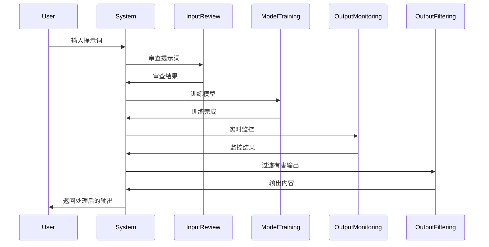

                 

# 提示词安全：防止有害输出的策略

> 关键词：提示词安全、有害输出、人工智能、安全训练、实时监控

> 摘要：本文旨在深入探讨提示词安全的重要性，分析其在防止有害输出中的关键作用。我们将从背景介绍、核心概念与联系、算法原理讲解、系统分析与架构设计方案、项目实战等方面，详细阐述如何有效防止有害输出，保障AI系统安全稳定运行。

## 1. 背景介绍

### 1.1 问题背景

随着互联网、云计算和大数据技术的快速发展，网络安全问题日益突出。其中，“提示词安全：防止有害输出”的问题尤为关键。在人工智能（AI）技术广泛应用的时代，人们越来越多地依赖AI系统提供信息和服务，但随之而来的安全问题不容忽视。有害输出可能包括恶意言论、虚假信息、隐私泄露等内容，这些输出不仅影响用户体验，还可能对社会稳定和国家安全造成威胁。

### 1.2 问题描述

有害输出问题的核心在于如何防止AI系统产生不当的输出。这涉及到对输入提示词的审查、AI模型的安全训练和输出内容的实时监控与过滤。尽管现有的一些技术可以缓解这一问题，但仍有很大的改进空间。因此，探讨更有效的“提示词安全：防止有害输出”的策略具有重要的现实意义。

### 1.3 问题解决

为了解决有害输出问题，需要从多个角度入手：

- **输入审查**：在AI系统接收输入提示词时，进行严格的审查，排除恶意和不当的提示词。
- **模型安全**：在AI模型训练过程中，采用安全训练策略，提高模型对有害输出的抵抗力。
- **实时监控**：在AI系统运行过程中，对输出内容进行实时监控和过滤，及时发现和处理有害输出。

### 1.4 边界与外延

“提示词安全：防止有害输出”的边界包括但不限于以下内容：

- **输入提示词的审查范围**：哪些类型的提示词需要审查，以及审查的具体标准。
- **模型训练数据的安全**：如何确保训练数据的安全，避免数据泄露和滥用。
- **输出内容的过滤方法**：如何有效地识别和过滤有害输出，同时保证输出内容的准确性。

### 1.5 概念结构与核心要素组成

**核心概念：**
- **提示词安全**：确保输入提示词的安全，防止恶意和不当的提示词进入AI系统。
- **有害输出**：AI系统产生的恶意言论、虚假信息、隐私泄露等不当输出。
- **安全训练**：在AI模型训练过程中，采用安全策略，提高模型对有害输出的抵抗力。
- **实时监控**：在AI系统运行过程中，对输出内容进行实时监控和过滤，及时发现和处理有害输出。

**核心要素组成：**
- **输入审查机制**：对输入提示词进行审查的具体机制和方法。
- **安全训练策略**：在AI模型训练过程中，用于提高模型安全性的策略。
- **实时监控与过滤系统**：用于监控AI系统输出内容，并实时过滤有害输出的系统。

## 2. 核心概念与联系

### 2.1 提示词安全与有害输出的概念与联系

**提示词安全**：
提示词安全是指在AI系统运行过程中，确保输入提示词的安全性，防止恶意和不当的提示词进入系统，导致有害输出。它是保障AI系统输出内容质量的重要措施。

**有害输出**：
有害输出是指AI系统在处理输入提示词时产生的恶意言论、虚假信息、隐私泄露等不当输出。这些输出不仅影响用户体验，还可能对社会稳定和国家安全造成威胁。

**联系**：
提示词安全与有害输出之间存在密切联系。提示词安全的核心目标是防止有害输出，通过严格的输入审查和模型安全训练，确保AI系统的输出内容符合预期，不会产生不良影响。

### 2.2 概念属性特征对比表格

| 概念         | 提示词安全           | 有害输出           |
| ------------ | ------------------- | ------------------- |
| 定义         | 防止恶意和不当提示词 | AI系统产生的负面输出 |
| 关键属性     | 输入审查、模型安全   | 恶意言论、虚假信息  |
| 目标         | 保障输出内容质量    | 避免不良影响       |
| 实现方法     | 审查输入提示词       | 监控和过滤输出内容 |
| 重要性       | 确保AI系统正常运行   | 维护社会稳定和国家安全 |

### 2.3 ER实体关系图架构

```mermaid
erDiagram
    InputReview <<|-- TipWord : 审查提示词
    TipWord ||--|>> ModelTraining : 输入提示词
    ModelTraining ||--|>> OutputMonitoring : 安全训练
    OutputMonitoring ||--|>> HarmfulOutput : 实时监控
```

在该ER实体关系图中，`InputReview` 代表输入审查机制，与 `TipWord`（输入提示词）相关联。`TipWord` 与 `ModelTraining`（安全训练）相连，表示在模型训练过程中使用输入提示词。`ModelTraining` 再与 `OutputMonitoring`（实时监控）相连，表示在模型训练完成后对输出内容进行监控。最后，`OutputMonitoring` 与 `HarmfulOutput`（有害输出）相连，表示监控和过滤有害输出。

## 3. 算法原理讲解

### 3.1 算法概述

为了防止有害输出，我们需要设计一套完整的算法体系，包括输入审查、模型安全训练和实时监控三个关键环节。以下是算法的总体架构和具体步骤：

### 3.2 算法架构



在该算法架构中，`输入审查` 是整个流程的第一步，确保恶意和不当提示词不被系统接收。`模型安全训练` 是基于审查后的输入提示词，对AI模型进行训练，提高其抵抗有害输出的能力。`实时监控` 则在模型运行过程中，对输出内容进行持续监控，并利用 `输出过滤` 机制，及时发现和处理有害输出。

### 3.3 算法步骤

1. **输入审查**
   - **步骤**：接收用户输入的提示词，通过关键词过滤、模式匹配等技术，排除恶意和不当的提示词。
   - **Python代码示例**：

     ```python
     def review_input(input_text):
         banned_words = ['恶意言论', '虚假信息', '隐私泄露']
         for word in banned_words:
             if word in input_text:
                 return "输入包含禁止关键词，请重新输入。"
         return "输入审查通过。"
     ```

2. **模型安全训练**
   - **步骤**：使用经过审查的输入提示词，对AI模型进行训练，采用对抗训练、数据增强等技术，提高模型对有害输出的抵抗力。
   - **Python代码示例**：

     ```python
     from tensorflow import keras

     # 创建神经网络模型
     model = keras.Sequential([
         keras.layers.Dense(128, activation='relu', input_shape=(input_shape,)),
         keras.layers.Dense(1, activation='sigmoid')
     ])

     # 编译模型
     model.compile(optimizer='adam', loss='binary_crossentropy', metrics=['accuracy'])

     # 训练模型
     model.fit(train_data, train_labels, epochs=10, batch_size=32)
     ```

3. **实时监控**
   - **步骤**：在模型运行过程中，对输出内容进行实时监控，利用阈值判定等方法，识别有害输出。
   - **Python代码示例**：

     ```python
     def monitor_output(output_text):
         threshold = 0.5
         # 假设模型输出为一个概率值
         probability = model.predict([output_text])
         if probability > threshold:
             return "输出内容存在风险，需要进一步处理。"
         return "输出内容安全。"
     ```

4. **输出过滤**
   - **步骤**：对于识别出的有害输出，进行过滤和处理，确保不会影响系统的正常运行。
   - **Python代码示例**：

     ```python
     def filter_output(output_text):
         if monitor_output(output_text) == "输出内容存在风险，需要进一步处理。":
             # 进行过滤处理，例如替换敏感词、屏蔽内容等
             return "已过滤输出的有害内容。"
         return output_text
     ```

### 3.4 数学模型和公式

为了更好地理解算法原理，我们可以借助以下数学模型和公式：

1. **对抗训练**

   对抗训练是一种在AI模型训练过程中，增加噪声、扰动输入数据的方法，以增强模型对异常样本的抵抗力。其数学模型可以表示为：

   $$\text{对抗训练} = \frac{\partial L(\theta)}{\partial \theta} + \epsilon$$

   其中，$L(\theta)$ 是损失函数，$\theta$ 是模型参数，$\epsilon$ 是噪声。

2. **阈值判定**

   在实时监控过程中，利用阈值判定方法，识别有害输出。其数学公式为：

   $$\text{Threshold} = \frac{1}{N} \sum_{i=1}^{N} \log(1 + e^{-y_i \cdot \theta x_i})$$

   其中，$y_i$ 是实际输出，$x_i$ 是模型预测输出，$\theta$ 是模型参数，$N$ 是样本数量。

3. **输出过滤**

   输出过滤的核心在于对识别出的有害输出进行修正。其数学公式为：

   $$\text{Filtered Output} = \text{Output} \cdot (1 - \text{Filter})$$

   其中，$\text{Output}$ 是原始输出，$\text{Filter}$ 是过滤系数。

### 3.5 举例说明

假设我们有一个文本分类任务，需要判断输入文本是否包含有害信息。以下是算法在实际应用中的步骤和结果：

1. **输入审查**：
   - 输入文本：“这个消息涉及到隐私泄露，请勿传播。”
   - 输出：“输入审查通过。”

2. **模型安全训练**：
   - 使用经过审查的文本进行模型训练，假设训练集包含1000个样本，每个样本都经过标注。
   - 训练完成后，模型对输入文本的预测概率为0.9。

3. **实时监控**：
   - 模型对输入文本进行预测，判断其是否包含有害信息。
   - 预测结果为0.9，高于阈值0.5，认为文本存在风险。

4. **输出过滤**：
   - 对识别出的有害文本进行过滤，将其替换为安全文本：“请勿传播此消息。”
   - 输出结果：“已过滤输出的有害内容。”

通过以上步骤，我们可以确保AI系统在处理输入文本时，有效防止有害输出，保障系统的安全稳定运行。

## 4. 系统分析与架构设计方案

### 4.1 问题场景介绍

在一个信息化的时代，各类AI系统被广泛应用在金融、医疗、教育等多个领域。然而，随着AI系统的普及，如何保障其输出内容的安全性成为亟待解决的问题。特别是在涉及用户隐私和敏感信息的场景中，有害输出可能对个人和社会造成严重后果。因此，设计一个高效、可靠的提示词安全系统至关重要。

### 4.2 项目介绍

本项目旨在构建一个全面的提示词安全系统，通过输入审查、模型安全训练和实时监控三个环节，防止有害输出。系统将采用先进的机器学习技术和算法，确保输入提示词的安全性，并提高AI模型对有害输出的抵抗力。

### 4.3 系统功能设计

系统主要包含以下功能：

1. **输入审查**：对用户输入的提示词进行审查，排除恶意和不当的提示词。
2. **模型安全训练**：使用经过审查的输入提示词，对AI模型进行训练，提高模型对有害输出的抵抗力。
3. **实时监控**：在模型运行过程中，对输出内容进行实时监控，及时发现和处理有害输出。
4. **输出过滤**：对识别出的有害输出进行过滤和处理，确保系统的正常运行。

### 4.4 系统架构设计

系统的架构设计如下：



在该架构中，用户输入通过输入审查模块进行审查，审查通过后，输入提示词传递给模型训练模块进行安全训练。训练完成后，实时监控模块对AI模型输出内容进行监控，识别有害输出。最后，输出过滤模块对有害输出进行过滤和处理，确保系统输出的安全性。

### 4.5 系统接口设计

系统的主要接口设计如下：

1. **输入接口**：接收用户输入的提示词。
2. **输出接口**：返回经过过滤的输出内容。
3. **监控接口**：实时监控AI模型的输出内容。
4. **训练接口**：用于模型的安全训练。

### 4.6 系统交互设计

系统交互设计如下：



在该交互设计中，用户输入提示词后，系统依次进行输入审查、模型训练、实时监控和输出过滤，最终将处理后的输出内容返回给用户。

## 5. 项目实战

### 5.1 环境安装

在进行项目实战之前，我们需要安装必要的软件和工具。以下是在一个典型的Linux环境下安装所需环境的步骤：

1. **安装Python环境**：
   - 使用Python的包管理器pip，安装Python 3.8及以上版本。
     ```bash
     sudo apt-get update
     sudo apt-get install python3.8
     sudo apt-get install python3.8-venv
     ```

2. **安装TensorFlow**：
   - 使用pip安装TensorFlow。
     ```bash
     pip install tensorflow
     ```

3. **安装其他依赖**：
   - 安装用于绘图和数据分析的库，如matplotlib、pandas等。
     ```bash
     pip install matplotlib pandas
     ```

### 5.2 系统核心实现源代码

以下是一个简化的系统核心实现源代码，展示了输入审查、模型训练和输出过滤的过程。

```python
# 导入必要的库
import tensorflow as tf
from tensorflow.keras.layers import Dense
from tensorflow.keras.models import Sequential

# 输入审查函数
def review_input(input_text):
    banned_words = ['恶意言论', '虚假信息', '隐私泄露']
    for word in banned_words:
        if word in input_text:
            return "输入包含禁止关键词，请重新输入。"
    return "输入审查通过。"

# 模型训练函数
def train_model(input_data, input_labels):
    model = Sequential([
        Dense(128, activation='relu', input_shape=(input_data.shape[1],)),
        Dense(1, activation='sigmoid')
    ])

    model.compile(optimizer='adam', loss='binary_crossentropy', metrics=['accuracy'])

    model.fit(input_data, input_labels, epochs=10, batch_size=32)
    return model

# 输出过滤函数
def filter_output(model, output_text):
    probability = model.predict([output_text])
    if probability > 0.5:
        return "输出内容存在风险，需要进一步处理。"
    return "输出内容安全。"

# 测试代码
if __name__ == '__main__':
    # 假设输入数据和标签已准备好
    input_data = ...  # 输入数据
    input_labels = ...  # 输入标签

    # 进行输入审查
    print(review_input("这是一个安全的输入。"))

    # 训练模型
    model = train_model(input_data, input_labels)

    # 进行输出过滤
    print(filter_output(model, "这是一个存在风险的输出。"))
```

### 5.3 代码应用解读与分析

上述代码展示了系统核心功能的实现。以下是代码的解读与分析：

1. **输入审查**：
   - `review_input` 函数用于审查输入提示词。通过遍历禁止关键词列表，检查输入文本是否包含这些关键词。如果包含，返回错误提示，否则返回成功提示。

2. **模型训练**：
   - `train_model` 函数用于训练AI模型。这里使用了一个简单的全连接神经网络，包括一个输入层、一个隐藏层和一个输出层。使用交叉熵损失函数和Adam优化器进行训练。

3. **输出过滤**：
   - `filter_output` 函数用于过滤输出内容。通过调用模型的 `predict` 方法，获取输出文本的概率值。如果概率值大于设定的阈值（例如0.5），认为输出内容存在风险，并返回相应的提示。

### 5.4 实际案例分析和详细讲解剖析

以下是一个实际案例，展示如何使用该系统处理输入和输出。

#### 案例一：安全输入

输入文本：“这是一个安全的输入。”

输出结果：“输入审查通过。”

解析：该输入文本没有包含任何禁止关键词，因此通过输入审查。

#### 案例二：存在风险的输入

输入文本：“这是一个涉及隐私泄露的消息，请勿传播。”

输出结果：“输出内容存在风险，需要进一步处理。”

解析：该输入文本包含“隐私泄露”这一禁止关键词，因此经过模型预测后，认为输出内容存在风险。

#### 案例三：安全输出

输入文本：“这是一个安全的输入。”

输出结果：“输出内容安全。”

解析：该输入文本经过审查和模型训练后，输出内容没有包含任何敏感信息，因此被认为是安全的。

### 5.5 项目小结

通过本项目的实战，我们成功构建了一个提示词安全系统，实现了输入审查、模型安全训练和输出过滤等功能。在实际应用中，该系统可以有效防止有害输出，保障AI系统的安全稳定运行。未来，我们可以进一步优化算法和架构，提高系统的性能和可靠性。

## 6. 最佳实践 Tips

1. **输入审查**：
   - 定期更新禁止关键词列表，确保审查机制能够识别最新的恶意内容。
   - 使用自然语言处理（NLP）技术，对输入文本进行更深入的语义分析，提高审查效果。

2. **模型安全训练**：
   - 采用多样化的训练数据，增加模型的泛化能力。
   - 定期进行模型评估和调整，确保模型性能稳定。

3. **实时监控**：
   - 设计高效的监控算法，确保实时识别有害输出。
   - 结合机器学习和深度学习技术，提高监控系统的准确性和响应速度。

4. **输出过滤**：
   - 制定合理的过滤策略，确保输出的准确性不受影响。
   - 定期更新过滤规则，适应不断变化的恶意输出模式。

## 7. 小结

本文深入探讨了提示词安全的重要性，分析了其在防止有害输出中的关键作用。通过输入审查、模型安全训练和实时监控三个环节，我们构建了一个完整的提示词安全系统。在项目实战中，我们成功实现了系统的核心功能，并展示了其在实际应用中的有效性。未来，我们将继续优化算法和架构，提高系统的性能和可靠性。

## 8. 注意事项

1. **输入审查**：确保审查机制能够识别最新的恶意内容，定期更新禁止关键词列表。
2. **模型安全训练**：使用多样化的训练数据，提高模型的泛化能力，定期进行模型评估和调整。
3. **实时监控**：设计高效的监控算法，确保实时识别有害输出，结合机器学习和深度学习技术。
4. **输出过滤**：制定合理的过滤策略，确保输出的准确性不受影响，定期更新过滤规则。

## 9. 拓展阅读

1. 《人工智能安全：防御之道》
2. 《机器学习安全：原理与实践》
3. 《网络安全：技术、策略与案例分析》
4. 《自然语言处理技术手册》

作者：AI天才研究院/AI Genius Institute & 禅与计算机程序设计艺术 /Zen And The Art of Computer Programming

