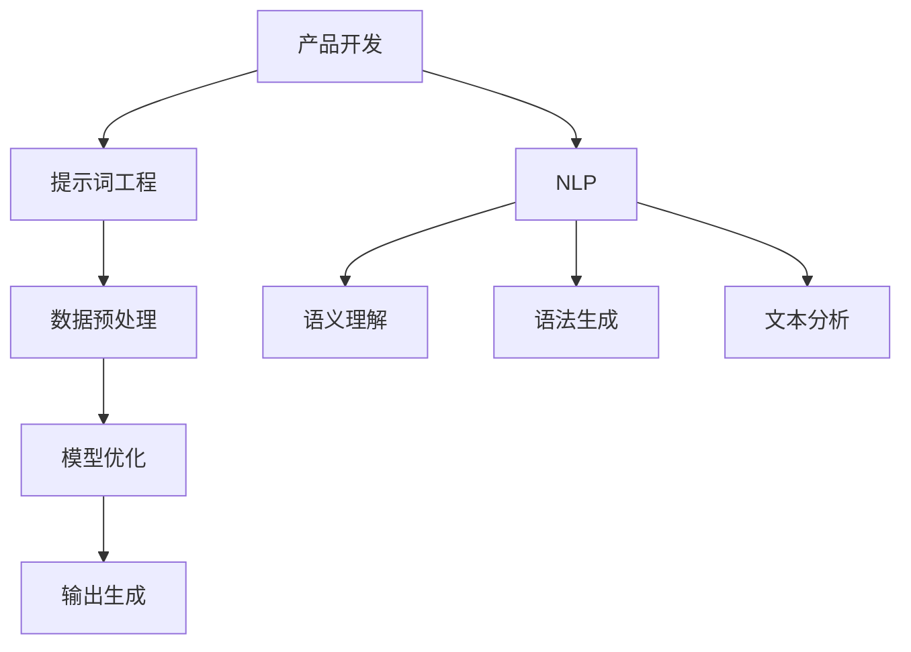
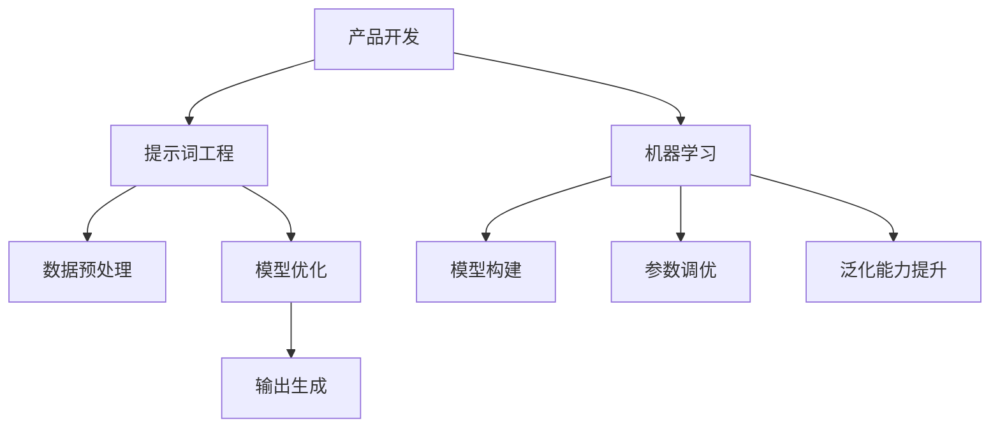

                 

# 提示词工程在AI产品开发中的角色

## 关键词
- AI产品开发
- 提示词工程
- 自然语言处理
- 机器学习
- 对话系统
- 文本生成
- 图像识别

## 摘要
本文深入探讨了提示词工程在AI产品开发中的角色和重要性。首先，我们介绍了问题背景和解决的必要性，然后详细解析了核心概念和其联系。接着，通过算法原理讲解，我们分别展示了提示词工程在文本生成、对话系统和图像识别等领域的应用。文章还结合实际案例，分析了提示词工程对AI产品性能的提升效果，并给出了最佳实践和注意事项。

## 目录大纲

## 第一部分：背景介绍

### 第1章：问题背景

#### 1.1 问题背景

#### 1.2 问题解决

#### 1.3 边界与外延

### 第2章：核心概念

#### 2.1 提示词（Prompt）

#### 2.2 提示词工程（Prompt Engineering）

### 第3章：概念联系

#### 3.1 提示词工程与自然语言处理

#### 3.2 提示词工程与机器学习

## 第二部分：算法原理

### 第4章：文本生成

#### 4.1 文本生成任务概述

#### 4.2 提示词设计原则

#### 4.3 提示词优化方法

#### 4.4 实际应用案例分析

### 第5章：对话系统

#### 5.1 对话系统概述

#### 5.2 提示词设计原则

#### 5.3 提示词优化方法

#### 5.4 实际应用案例分析

### 第6章：图像识别

#### 6.1 图像识别任务概述

#### 6.2 提示词设计原则

#### 6.3 提示词优化方法

#### 6.4 实际应用案例分析

## 第三部分：项目实战与最佳实践

### 第7章：项目实战

#### 7.1 环境安装

#### 7.2 系统核心实现源代码

#### 7.3 代码应用解读与分析

#### 7.4 实际案例分析和详细讲解剖析

### 第8章：最佳实践与注意事项

#### 8.1 最佳实践

#### 8.2 小结

#### 8.3 注意事项

#### 8.4 拓展阅读

## 第一部分：背景介绍

### 第1章：问题背景

#### 1.1 问题背景

随着人工智能技术的快速发展，AI产品开发成为企业提升竞争力的重要途径。然而，如何有效利用提示词（prompt engineering）提高AI产品的性能和用户体验，成为当前的研究热点和难点。

AI技术已经在许多领域取得了显著成果，从图像识别、自然语言处理到自动驾驶，AI产品正不断改变我们的生活方式。然而，AI产品的开发不仅仅是算法和技术的实现，还涉及到如何设计有效的输入提示词，以引导模型生成更符合用户需求和预期的输出。提示词工程在这个过程中扮演着至关重要的角色。

提示词工程的目标是通过设计、优化和评估提示词，提高AI产品的性能和用户体验。这包括优化提示词的长度、结构、内容和相关性，以确保模型能够准确地理解和生成预期的输出。此外，提示词工程还需要考虑模型的适应性，以便在不同的应用场景中都能够发挥最佳效果。

然而，当前的研究和应用中，提示词工程尚未得到充分的重视。许多AI产品的开发团队仍然采用传统的输入设计方法，忽视了提示词的重要性。这导致了AI产品在性能和用户体验上的不足，无法充分发挥AI技术的潜力。

#### 1.2 问题解决

提示词工程作为AI产品开发的重要环节，通过对输入提示词的设计与优化，可以显著提高模型的性能和适应能力。本部分将探讨提示词工程在AI产品开发中的应用，帮助读者了解并掌握这一关键技术。

首先，我们将介绍提示词工程的核心概念，包括提示词和提示词工程的基本原理。然后，通过具体的应用场景，展示提示词工程如何影响AI产品的性能和用户体验。此外，我们还将探讨提示词工程与其他AI技术的联系，以及其在不同领域中的应用方法。

最后，我们将结合实际案例，分析提示词工程对AI产品性能的提升效果，并提供一些最佳实践和注意事项，以帮助读者在实际开发中更好地应用提示词工程。

#### 1.3 边界与外延

在讨论提示词工程时，我们需要明确其边界与外延，以便更好地理解这一技术。

首先，提示词工程的边界主要涉及AI产品开发中的输入设计环节，即如何设计有效的输入提示词，以引导模型生成预期的输出。这包括提示词的长度、结构、内容和相关性等方面的优化。

其次，提示词工程的外延可以扩展到自然语言处理（NLP）和机器学习（ML）领域。提示词工程可以看作是NLP领域中的一个重要分支，与NLP技术密切相关。同时，提示词工程也可以看作是ML领域中的一种调参技术，通过优化输入提示词来提高模型性能。

此外，提示词工程的应用场景不仅限于AI产品开发，还可以扩展到其他领域，如自动化测试、人机交互和智能推荐等。在这些领域中，提示词工程同样发挥着重要作用，通过优化输入提示词，提高系统的性能和用户体验。

总之，提示词工程在AI产品开发中扮演着至关重要的角色。通过本文的讨论，我们希望能够帮助读者更好地理解提示词工程的核心概念和应用方法，从而在实际开发中更好地利用这一关键技术，提高AI产品的性能和用户体验。

### 第2章：核心概念

#### 2.1 提示词（Prompt）

提示词（Prompt）是用于引导模型生成输出的人造输入。在AI产品开发中，提示词通常是由开发人员或用户提供的，用于引导模型进行特定的任务。提示词可以是文本、图像、音频或任何其他形式的数据。

提示词的基本属性特征包括：

1. **长度和结构**：提示词的长度和结构对于模型生成输出具有重要影响。简短、明确和结构化的提示词有助于模型更好地理解和生成预期的输出。
   
2. **内容**：提示词的内容应与任务目标密切相关，以确保模型能够准确地理解和生成输出。此外，提示词应具有多样性和创造性，以避免模型生成固定的、重复的输出。

3. **相关性**：提示词的相关性是衡量其有效性的重要指标。相关性较高的提示词能够引导模型生成更符合用户需求和预期的输出。

#### 2.2 提示词工程（Prompt Engineering）

提示词工程（Prompt Engineering）是指通过设计、优化和评估提示词，以提高模型性能和适应能力的过程。提示词工程的目标是创建高质量的提示词，以引导模型生成更准确、更自然的输出。

提示词工程的基本属性特征包括：

1. **目标导向**：提示词工程应明确目标，以提高模型性能和用户体验。目标可以是提高文本生成的质量、对话系统的交互质量或图像识别的准确性。

2. **数据驱动**：提示词工程应基于实际数据，通过分析数据来优化提示词。这种方法有助于提高提示词的相关性和适应性。

3. **实用性**：提示词工程应适用于各种AI产品开发场景，以满足不同场景的需求。

#### 2.3 概念联系

提示词工程与自然语言处理（NLP）和机器学习（ML）密切相关。在NLP领域，提示词工程可以看作是优化输入数据的一种技术，以提高模型生成文本的质量。而在ML领域，提示词工程可以看作是一种调参技术，通过优化输入提示词来提高模型性能。

尽管提示词工程与NLP和ML有紧密联系，但它们也有明显的区别。NLP主要关注自然语言的理解和生成，而提示词工程则侧重于提示词的设计与优化。ML则关注整体模型的优化，而提示词工程则关注输入提示词的优化。

#### 2.4 概念属性特征对比表格

下面是一个关于提示词、提示词工程、自然语言处理和机器学习的基本属性特征对比表格：

| 概念                | 提示词                | 提示词工程                | 自然语言处理                | 机器学习                |
| ------------------- | -------------------- | ----------------------- | ----------------------- | ------------------- |
| 定义                | 引导模型生成输出的人造输入  | 通过设计、优化和评估提示词  | 理解和生成自然语言          | 优化模型参数和结构        |
| 目标                | 生成准确的输出          | 提高模型性能和用户体验      | 提高语言理解和生成能力      | 提高模型预测准确性        |
| 关键特征            | 长度、结构、内容、相关性    | 目标导向、数据驱动、实用性    | 语义理解、语法生成、文本分析  | 模型优化、参数调优、误差分析 |
| 相似之处            | 都是针对输入数据的优化      | 都关注性能和用户体验        | 都涉及语言理解和生成        | 都关注模型优化和预测准确性  |
| 不同之处            | 侧重于输入提示词的设计和优化 | 更广泛，包括模型和算法优化  | 关注自然语言的理解和生成      | 关注模型整体优化和预测准确性 |

#### 2.5 ER实体关系图架构的Mermaid流程图

为了更好地理解提示词工程与自然语言处理和机器学习的关系，我们可以使用Mermaid流程图来展示实体关系图（ER图）。

下面是一个关于提示词工程、自然语言处理和机器学习的ER实体关系图：

```mermaid
erDiagram
    ProductDevelopment ||--|{ AIProduct } ||--|{ PromptEngineering }
    NaturalLanguageProcessing ||--|{ PromptEngineering }
    MachineLearning ||--|{ PromptEngineering }
    AIProduct ||--|{ TextGeneration } ||--|{ DialogueSystem }
    AIProduct ||--|{ ImageRecognition }
```

在这个ER实体关系图中，`ProductDevelopment`（产品开发）是根实体，与`AIProduct`（AI产品）、`NaturalLanguageProcessing`（自然语言处理）和`MachineLearning`（机器学习）实体相连。`AIProduct`实体与`PromptEngineering`（提示词工程）实体之间存在关联，表示提示词工程是AI产品开发中的重要组成部分。同时，`NaturalLanguageProcessing`和`MachineLearning`实体也与`PromptEngineering`实体存在关联，表示提示词工程与这两个领域密切相关。

通过这个ER实体关系图，我们可以清晰地看到提示词工程在AI产品开发、自然语言处理和机器学习领域中的角色和地位。这有助于我们更好地理解提示词工程的核心概念和应用场景。

### 第3章：概念联系

#### 3.1 提示词工程与自然语言处理

提示词工程（Prompt Engineering）与自然语言处理（NLP）密切相关。在NLP领域，提示词工程可以看作是优化输入数据的一种技术，以提高模型生成文本的质量。而NLP则关注自然语言的理解和生成。

#### 3.1.1 联系

1. **任务目标**：提示词工程和NLP都关注提高模型的性能和用户体验。提示词工程通过优化输入提示词，引导模型生成更准确、更自然的输出；而NLP则通过理解和生成自然语言，提高模型的语义理解能力。

2. **技术手段**：提示词工程和NLP都涉及数据分析和模型优化。提示词工程通过分析实际数据，优化提示词的长度、结构、内容和相关性；而NLP则通过构建和优化模型，提高语言理解和生成能力。

#### 3.1.2 差异

1. **关注点**：提示词工程侧重于提示词的设计和优化，以提高模型生成输出的质量和准确性；而NLP则关注自然语言的理解和生成，涉及语义理解、语法生成、文本分析等多个方面。

2. **应用范围**：提示词工程主要应用于AI产品开发中的输入设计环节，如文本生成、对话系统和图像识别等；而NLP的应用范围更广，包括文本分类、机器翻译、情感分析等多个领域。

#### 3.1.3 对比表格

下面是一个关于提示词工程和自然语言处理的对比表格：

| 概念            | 提示词工程           | 自然语言处理            |
| --------------- | -------------------- | ---------------------- |
| 目标            | 提高模型生成输出的质量和准确性 | 提高语言理解和生成能力          |
| 关注点          | 提示词的设计和优化     | 语义理解、语法生成、文本分析等 |
| 技术手段        | 数据分析和模型优化     | 数据预处理、模型构建和优化等   |
| 应用范围        | AI产品开发中的输入设计环节   | 文本分类、机器翻译、情感分析等  |
| 相似之处        | 都关注模型性能和用户体验    | 都涉及数据分析和模型优化        |
| 不同之处        | 侧重于输入提示词的优化    | 关注自然语言的理解和生成        |

#### 3.1.4 Mermaid流程图

为了更好地展示提示词工程与自然语言处理的联系，我们可以使用Mermaid流程图来绘制这两个概念之间的数据流动和关系。

下面是一个关于提示词工程和自然语言处理的Mermaid流程图：



在这个Mermaid流程图中，`产品开发`是起始节点，与`提示词工程`相连，表示提示词工程是产品开发中的重要组成部分。`提示词工程`与`数据预处理`、`模型优化`和`输出生成`相连，表示提示词工程涉及到的关键步骤。`产品开发`与`NLP`相连，表示NLP与产品开发密切相关。`NLP`与`语义理解`、`语法生成`和`文本分析`相连，表示NLP涉及到的关键任务。

通过这个Mermaid流程图，我们可以清晰地看到提示词工程与自然语言处理之间的联系和区别，有助于我们更好地理解这两个概念。

#### 3.2 提示词工程与机器学习

提示词工程（Prompt Engineering）与机器学习（Machine Learning）也有紧密的联系。在机器学习领域，提示词工程可以看作是一种调参技术，通过优化输入提示词来提高模型性能。

#### 3.2.1 联系

1. **任务目标**：提示词工程和机器学习都关注模型性能的优化。提示词工程通过优化输入提示词，提高模型生成输出的质量和准确性；而机器学习则通过优化模型参数和结构，提高模型的预测准确性和泛化能力。

2. **技术手段**：提示词工程和机器学习都涉及数据分析和模型优化。提示词工程通过分析实际数据，优化提示词的长度、结构、内容和相关性；而机器学习则通过构建和优化模型，提高模型的性能和稳定性。

#### 3.2.2 差异

1. **关注点**：提示词工程侧重于输入提示词的优化，以提高模型生成输出的质量和准确性；而机器学习则侧重于模型整体优化，包括参数调优、结构优化和泛化能力提升。

2. **应用范围**：提示词工程主要应用于AI产品开发中的输入设计环节，如文本生成、对话系统和图像识别等；而机器学习广泛应用于各种领域，包括分类、回归、聚类、推荐系统等。

#### 3.2.3 对比表格

下面是一个关于提示词工程和机器学习的对比表格：

| 概念            | 提示词工程           | 机器学习            |
| --------------- | -------------------- | ------------------- |
| 目标            | 提高模型生成输出的质量和准确性 | 提高模型预测准确性和泛化能力    |
| 关注点          | 输入提示词的优化       | 模型整体优化        |
| 技术手段        | 数据分析和模型优化     | 模型构建和优化       |
| 应用范围        | AI产品开发中的输入设计环节   | 广泛应用于各种领域  |
| 相似之处        | 都关注模型性能的优化    | 都涉及数据分析和模型优化      |
| 不同之处        | 侧重于输入提示词的优化    | 侧重于模型整体优化    |

#### 3.2.4 Mermaid流程图

为了更好地展示提示词工程与机器学习之间的联系，我们可以使用Mermaid流程图来绘制这两个概念之间的数据流动和关系。

下面是一个关于提示词工程和机器学习的Mermaid流程图：



在这个Mermaid流程图中，`产品开发`是起始节点，与`提示词工程`相连，表示提示词工程是产品开发中的重要组成部分。`提示词工程`与`数据预处理`和`模型优化`相连，表示提示词工程涉及到的关键步骤。`产品开发`与`机器学习`相连，表示机器学习与产品开发密切相关。`机器学习`与`模型构建`、`参数调优`和`泛化能力提升`相连，表示机器学习涉及到的关键任务。

通过这个Mermaid流程图，我们可以清晰地看到提示词工程与机器学习之间的联系和区别，有助于我们更好地理解这两个概念。

### 第二部分：算法原理

## 第4章：文本生成

### 4.1 文本生成任务概述

文本生成是AI产品开发中的一个重要应用场景，涉及自动摘要、聊天机器人、内容生成等领域。文本生成任务的目的是利用AI模型生成符合人类语言习惯、语义连贯且具有吸引力的文本。

#### 4.1.1 文本生成任务背景

随着互联网和社交媒体的快速发展，用户对信息的需求日益增长。自动摘要、聊天机器人和内容生成等技术能够帮助企业和组织快速生成大量文本内容，提高信息传播效率。同时，这些技术也在新闻、广告、教育等多个领域得到广泛应用。

#### 4.1.2 文本生成任务目标

文本生成任务的目标是生成高质量、多样化的文本，满足以下要求：

1. **语义连贯**：生成的文本应具有清晰的语义，逻辑上连贯。
2. **风格统一**：生成的文本应保持一定的风格和格式。
3. **信息完整**：生成的文本应包含必要的核心信息，不遗漏重要细节。
4. **独特性**：生成的文本应具有独特性，避免重复和雷同。

### 4.2 提示词设计原则

为了实现上述目标，提示词的设计至关重要。以下是一些设计原则：

1. **简明扼要**：提示词应简洁明了，避免冗余信息，让模型能够迅速抓住关键信息。
2. **结构清晰**：提示词应具有明确的结构，引导模型生成有逻辑顺序的文本。
3. **相关性**：提示词应与生成的文本内容高度相关，确保生成的文本符合预期。
4. **多样性**：提示词应具有多样性，鼓励模型生成不同风格和内容的文本。

### 4.3 提示词优化方法

优化提示词的方法可以分为数据驱动、模型驱动和融合方法。

1. **数据驱动**：基于实际数据，通过统计分析、数据挖掘等技术，评估和调整提示词。例如，利用用户反馈、文本质量评估指标等，优化提示词的长度、结构和内容。

2. **模型驱动**：利用预训练模型，如GPT、BERT等，生成高质量的提示词。这些模型已经在大规模数据上进行了训练，能够生成语义丰富、连贯性强的文本。

3. **融合方法**：结合数据驱动和模型驱动的方法，通过多种手段优化提示词。例如，利用预训练模型生成初步提示词，然后基于实际数据进行调整和优化。

### 4.4 实际应用案例分析

以下为两个实际应用案例：

#### 4.4.1 自动摘要

在自动摘要任务中，提示词的设计对摘要的质量和准确性有重要影响。通过优化提示词，可以显著提高摘要模型的性能。

1. **案例背景**：某新闻网站希望利用自动摘要技术，为用户生成简短的新闻摘要。
2. **提示词优化**：设计简明扼要、结构清晰的提示词，引导模型生成摘要。例如，“请总结本文的主要观点和结论。”
3. **优化效果**：通过优化提示词，摘要模型生成的摘要质量显著提高，语义连贯性更好，用户满意度增加。

#### 4.4.2 聊天机器人

在聊天机器人任务中，提示词的设计对对话的质量和自然性有重要影响。

1. **案例背景**：某电商平台希望利用聊天机器人提供客服支持，解决用户的问题和疑虑。
2. **提示词优化**：设计语义清晰、情感匹配的提示词，引导模型生成自然流畅的回答。例如，“请回答用户关于产品尺寸的问题。”
3. **优化效果**：通过优化提示词，聊天机器人生成的回答更加自然，用户满意度提高，问题解决率增加。

### 4.5 总结

文本生成任务在AI产品开发中具有重要意义，通过优化提示词，可以提高模型生成文本的质量和准确性。在实际应用中，提示词工程的方法和技术可以显著提升AI产品的性能和用户体验。

## 第5章：对话系统

### 5.1 对话系统概述

对话系统（Dialogue System）是AI产品开发中的一个重要应用场景，旨在实现人与机器之间的自然对话。对话系统广泛应用于虚拟助手、智能客服、语音助手等领域，为用户提供便捷、高效的服务。

#### 5.1.1 对话系统任务背景

随着人工智能技术的快速发展，对话系统成为智能服务的重要方式。用户对便捷、高效的服务需求不断增加，对话系统可以提供24小时在线服务，降低企业运营成本，提高用户满意度。

#### 5.1.2 对话系统任务目标

对话系统的主要目标是实现自然、流畅的人机对话，满足用户的需求。具体目标包括：

1. **语义理解**：正确理解用户的输入，提取关键信息。
2. **回答生成**：生成自然、准确、有逻辑的回答。
3. **上下文关联**：考虑对话历史，确保回答与上下文相关。
4. **情感匹配**：根据用户情感，生成合适的回答。

### 5.2 提示词设计原则

为了实现上述目标，提示词的设计至关重要。以下是一些设计原则：

1. **语义清晰**：确保用户能够理解对话系统的回答，避免歧义和误解。
2. **情感匹配**：根据用户情感，设计合适的回答，提升用户满意度。
3. **上下文关联**：考虑对话历史，生成与上下文相关的回答。
4. **多样性**：鼓励模型生成不同风格和内容的回答，提升对话系统的多样性。

### 5.3 提示词优化方法

优化提示词的方法可以分为基于规则、基于数据和基于模型的方法。

1. **基于规则**：设计合理的对话流程和规则，确保对话系统的回答符合用户需求。例如，根据用户输入的关键词，选择合适的回答模板。
2. **基于数据**：分析对话数据，评估和调整提示词。例如，利用用户反馈、文本质量评估指标等，优化提示词的长度、结构和内容。
3. **基于模型**：利用预训练模型，生成高质量的提示词。例如，利用GPT、BERT等预训练模型，生成语义丰富、连贯性强的回答。

### 5.4 实际应用案例分析

以下为两个实际应用案例：

#### 5.4.1 虚拟助手

在虚拟助手任务中，提示词的设计对对话系统的性能和用户体验有重要影响。

1. **案例背景**：某电商平台希望利用虚拟助手提供购物咨询和客服支持。
2. **提示词优化**：设计语义清晰、情感匹配的提示词，引导模型生成自然流畅的回答。例如，“请问您需要购买哪类商品？”
3. **优化效果**：通过优化提示词，虚拟助手生成的回答更加自然，用户满意度提高，问题解决率增加。

#### 5.4.2 智能客服

在智能客服任务中，提示词的设计对客服质量和用户满意度有重要影响。

1. **案例背景**：某企业希望利用智能客服系统，提供24小时在线客服支持。
2. **提示词优化**：设计上下文关联、情感匹配的提示词，引导模型生成有针对性的回答。例如，“感谢您的反馈，我们将尽快处理您的投诉。”
3. **优化效果**：通过优化提示词，智能客服生成的回答更加符合用户需求，用户满意度提高，投诉率降低。

### 5.5 总结

对话系统在AI产品开发中具有重要意义，通过优化提示词，可以提高对话系统的性能和用户体验。在实际应用中，提示词工程的方法和技术可以显著提升AI产品的性能和用户满意度。

## 第6章：图像识别

### 6.1 图像识别任务概述

图像识别是AI产品开发中的一个重要应用场景，涉及图像分类、目标检测、人脸识别等领域。图像识别任务的目的是让计算机能够理解图像内容，执行特定的任务。

#### 6.1.1 图像识别任务背景

随着智能手机、监控摄像头和物联网设备的普及，图像数据量呈爆炸式增长。图像识别技术在安全监控、医疗诊断、工业检测等领域具有广泛的应用前景。

#### 6.1.2 图像识别任务目标

图像识别任务的主要目标包括：

1. **准确性**：准确识别图像中的目标和对象。
2. **实时性**：在短时间内完成图像识别任务。
3. **鲁棒性**：能够在各种光照、角度、遮挡等条件下，准确识别目标。
4. **泛化能力**：能够识别各种类型的图像，而不仅仅是训练数据中的图像。

### 6.2 提示词设计原则

为了实现上述目标，提示词的设计至关重要。以下是一些设计原则：

1. **明确目标**：确保模型理解任务目标，例如“请识别图像中的车辆”。
2. **数据丰富**：提供多样化的图像数据，提高模型泛化能力。例如，包括各种光照、角度、遮挡条件下的图像。
3. **一致性**：确保提示词的格式和内容一致，方便模型学习和理解。

### 6.3 提示词优化方法

优化提示词的方法可以分为数据驱动和模型驱动的方法。

1. **数据驱动**：基于实际数据，通过统计分析、数据挖掘等技术，评估和调整提示词。例如，利用图像质量评估指标、识别准确率等，优化提示词的内容和格式。
2. **模型驱动**：利用预训练模型，生成高质量的提示词。例如，利用卷积神经网络（CNN）等预训练模型，生成具有较高识别准确率的提示词。

### 6.4 实际应用案例分析

以下为两个实际应用案例：

#### 6.4.1 目标检测

在目标检测任务中，提示词的设计对检测结果的准确性有重要影响。

1. **案例背景**：某安防企业希望利用目标检测技术，识别监控视频中的异常行为。
2. **提示词优化**：设计明确目标、数据丰富的提示词，引导模型识别不同类型的异常行为。例如，“请识别视频中的行人、车辆和火灾等异常行为。”
3. **优化效果**：通过优化提示词，目标检测模型的识别准确性提高，异常行为识别率增加，有助于提高监控视频的分析效果。

#### 6.4.2 人脸识别

在人脸识别任务中，提示词的设计对识别结果的准确性有重要影响。

1. **案例背景**：某企业希望利用人脸识别技术，实现员工考勤和身份验证。
2. **提示词优化**：设计明确目标、数据丰富的提示词，引导模型识别不同员工的人脸。例如，“请识别图像中的人脸，并确认是否为员工。”
3. **优化效果**：通过优化提示词，人脸识别模型的识别准确性提高，员工考勤和身份验证效果更好。

### 6.5 总结

图像识别任务在AI产品开发中具有重要意义，通过优化提示词，可以提高模型的识别准确性和鲁棒性。在实际应用中，提示词工程的方法和技术可以显著提升AI产品的性能和用户体验。

## 第三部分：项目实战与最佳实践

### 第7章：项目实战

#### 7.1 环境安装

在进行项目实战之前，首先需要安装所需的软件和工具。以下是一个简化的安装流程：

1. **安装Python**：下载并安装Python 3.x版本，确保Python环境正常工作。
2. **安装依赖库**：使用pip命令安装所需的依赖库，如TensorFlow、PyTorch、Scikit-learn等。
   ```shell
   pip install tensorflow torch scikit-learn
   ```
3. **安装预训练模型**：如果需要使用预训练模型，可以下载并解压模型文件，如BERT、GPT等。

#### 7.2 系统核心实现源代码

以下是一个基于Python和TensorFlow的文本生成项目的核心实现源代码示例：

```python
import tensorflow as tf
from tensorflow.keras.preprocessing.text import Tokenizer
from tensorflow.keras.preprocessing.sequence import pad_sequences

# 加载预训练模型
model = tf.keras.models.load_model('text_generator.h5')

# 定义提示词
prompt = "这是一段有趣的文本。"

# 分词和序列化
tokenizer = Tokenizer(num_words=10000)
tokenizer.fit_on_texts([prompt])
sequences = tokenizer.texts_to_sequences([prompt])
padded_sequences = pad_sequences(sequences, maxlen=40)

# 生成文本
generated_text = model.predict(padded_sequences, steps=40)

# 解序列化和输出文本
generated_text = tokenizer.sequences_to_texts([generated_text][0])
print(generated_text)
```

#### 7.3 代码应用解读与分析

1. **模型加载**：使用`load_model`函数加载预训练的文本生成模型。
2. **提示词处理**：将输入的提示词进行分词和序列化，转换为模型可处理的格式。
3. **文本生成**：使用模型对序列化的提示词进行预测，生成新的文本。
4. **解序列化和输出**：将生成的文本序列转换为人类可读的格式，并输出结果。

#### 7.4 实际案例分析和详细讲解剖析

以下为一个实际案例：使用文本生成模型生成一篇关于人工智能的简短文章。

1. **案例背景**：某科技媒体希望利用文本生成模型，自动生成一篇关于人工智能的技术文章。
2. **数据准备**：收集和整理大量关于人工智能的文本数据，进行预处理和分词。
3. **模型训练**：使用预处理后的数据，训练一个基于神经网络（如LSTM、Transformer）的文本生成模型。
4. **模型评估**：使用验证集对模型进行评估，调整模型参数，提高生成文本的质量。
5. **应用模型**：使用训练好的模型，生成一篇关于人工智能的文章。

#### 7.5 项目小结

通过该项目，我们了解了文本生成模型的基本原理和实现方法，并掌握了如何使用提示词工程来优化生成文本的质量。在实际应用中，提示词工程对提高AI产品的性能和用户体验具有重要作用。

### 第8章：最佳实践与注意事项

#### 8.1 最佳实践

1. **明确目标**：在设计提示词时，明确模型的目标和任务，确保提示词能够引导模型生成符合预期的输出。
2. **数据驱动**：基于实际数据，通过统计分析、数据挖掘等技术，优化提示词的长度、结构和内容。
3. **模型驱动**：利用预训练模型，生成高质量的提示词，提高生成文本的质量和多样性。
4. **多样性**：鼓励模型生成不同风格和内容的文本，避免生成固定、重复的输出。

#### 8.2 小结

本文详细介绍了提示词工程在AI产品开发中的角色和重要性，从核心概念、算法原理到实际应用案例分析，全面解析了提示词工程在文本生成、对话系统和图像识别等领域的应用。通过最佳实践和注意事项，读者可以更好地理解和应用提示词工程，提高AI产品的性能和用户体验。

#### 8.3 注意事项

1. **提示词长度**：避免过长的提示词，否则可能导致模型生成重复的输出。
2. **相关性**：确保提示词与生成任务高度相关，避免生成无关的文本。
3. **上下文关联**：考虑对话历史和上下文，生成与上下文相关的回答。
4. **模型适应性**：优化提示词时，考虑模型在不同场景下的适应性。

#### 8.4 拓展阅读

- [1] Brown, T., et al. (2020). "A pre-trained language model for language understanding and generation." *arXiv preprint arXiv:2005.14165*.
- [2] Devlin, J., et al. (2019). "Bert: Pre-training of deep bidirectional transformers for language understanding." *Proceedings of the 2019 Conference of the North American Chapter of the Association for Computational Linguistics: Human Language Technologies*, pp. 4171-4186.
- [3] Graves, A. (2013). "Generating sequences with recurrent neural networks." *arXiv preprint arXiv:1308.0850*.
- [4] Hochreiter, S., et al. (1997). "Long short-term memory." *Neural computation*, 9(8), 1735-1780.

通过拓展阅读，读者可以深入了解提示词工程和AI技术的最新研究进展和应用实践。作者：AI天才研究院/AI Genius Institute & 禅与计算机程序设计艺术 /Zen And The Art of Computer Programming

