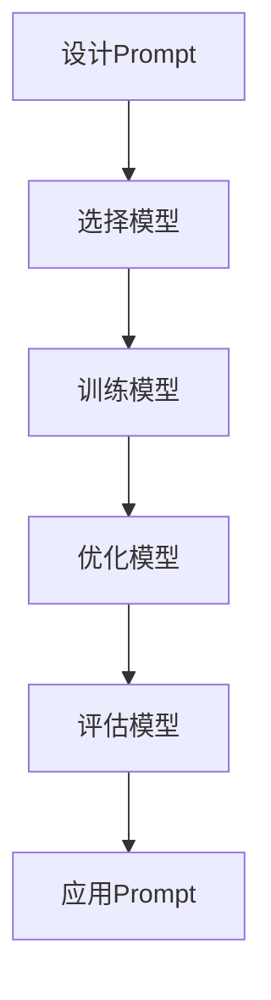
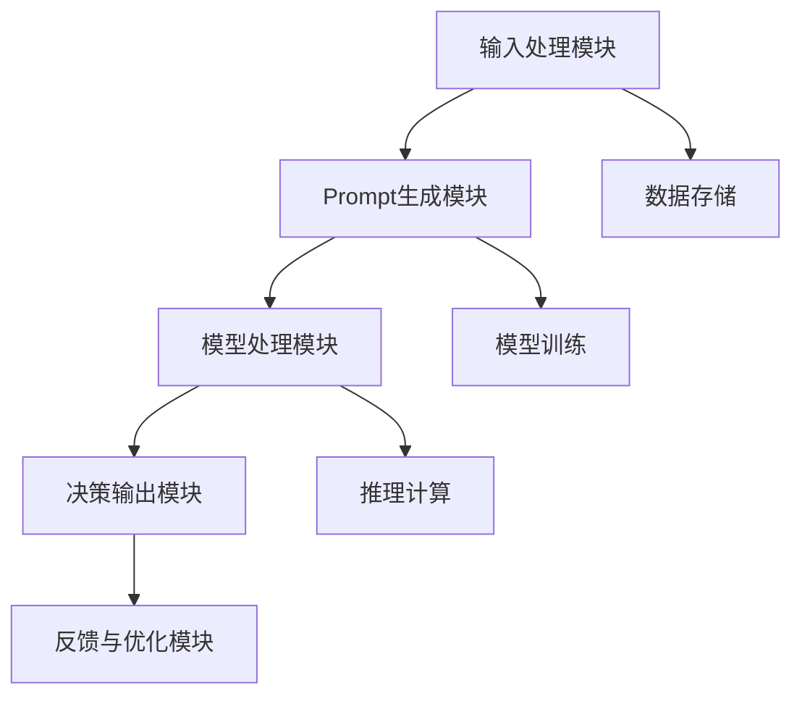
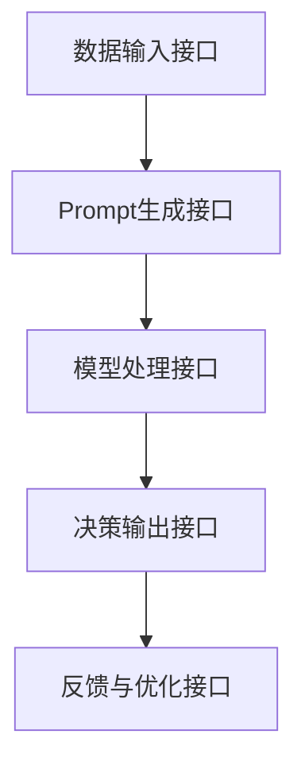
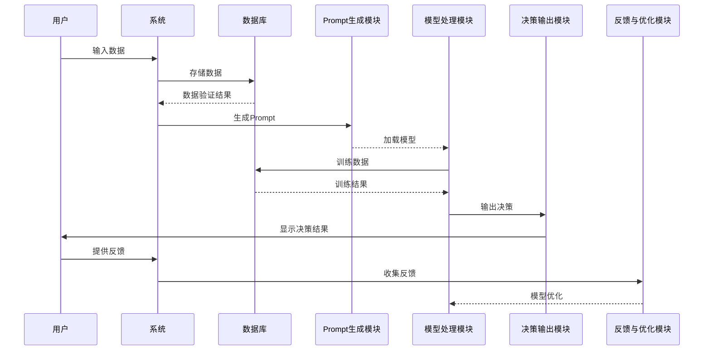

                 

### 引言

在人工智能（AI）飞速发展的时代，伦理问题逐渐成为关注焦点。AI系统在做出决策时，不仅需要考虑到技术实现的可行性，还要考虑到其对社会、环境和个体的影响。因此，建立一套科学合理的伦理决策框架，对于指导AI的发展具有重要意义。

伦理决策框架的核心在于如何平衡技术进步与社会责任。随着AI技术的不断进步，复杂性的增加使得决策过程变得更加困难。AI系统的透明性和可解释性不足，常常导致决策结果的不透明和不可预测，进而引发伦理争议。此外，AI决策的广泛影响也要求我们在设计时考虑到社会层面的影响，如就业替代、隐私保护等问题。

Prompt Engineering作为一种新兴的技术，近年来在自然语言处理（NLP）领域取得了显著成果。其核心思想是通过设计特定的提示（prompt），引导模型生成符合预期结果的输出。在AI伦理决策框架中，Prompt Engineering扮演着关键角色。通过精心设计的提示，可以引导AI系统朝着更符合伦理规范的方向发展，从而在技术实现与社会责任之间找到平衡点。

本文旨在探讨Prompt Engineering在AI伦理决策框架中的地位，分析其在伦理决策中的重要作用，并提出具体的实践方法。文章结构如下：

- **第1章：AI伦理与决策背景**：介绍AI伦理的背景、挑战以及Prompt Engineering的基本概念。
- **第2章：核心概念与联系**：详细阐述AI伦理的核心概念及其相互关系，以及Prompt Engineering在伦理框架中的角色。
- **第3章：算法原理**：分析Prompt Engineering的算法原理，使用mermaid和Python代码进行详细讲解。
- **第4章：系统分析与设计**：介绍如何将Prompt Engineering应用于系统设计，包括系统功能设计、架构设计和接口设计等。
- **第5章：项目实战**：通过实际项目案例，展示Prompt Engineering在AI伦理决策中的应用过程。
- **第6章：最佳实践与小结**：总结文章的主要观点，提出最佳实践建议，并对未来的研究方向进行展望。

通过本文的讨论，我们期望能够为AI伦理决策提供新的思路和方法，推动AI技术的健康发展。

### 关键词

- AI伦理
- Prompt Engineering
- 伦理决策框架
- 算法设计
- 系统架构
- 实际应用案例

### 摘要

本文探讨了Prompt Engineering在AI伦理决策框架中的地位和作用。首先，我们介绍了AI伦理的背景及其在决策过程中的重要性，接着详细阐述了Prompt Engineering的概念及其在NLP领域的重要性。文章通过分析AI伦理的核心概念，展示了Prompt Engineering如何在伦理决策中发挥引导作用。随后，我们探讨了Prompt Engineering的算法原理，通过mermaid流程图和Python代码详细讲解其工作原理。在此基础上，文章介绍了如何将Prompt Engineering应用于系统设计，包括系统功能设计、架构设计和接口设计等。通过实际项目案例，我们展示了Prompt Engineering在AI伦理决策中的应用过程，并提出了最佳实践建议。最后，文章总结了本文的主要观点，并展望了未来的研究方向。

## 第1章：AI伦理与决策背景

### 1.1 AI伦理的背景

随着人工智能（AI）技术的飞速发展，AI伦理问题逐渐成为学术界、产业界和公众关注的焦点。AI伦理的背景可以追溯到AI技术的早期发展，当时主要关注的是AI系统的可靠性、透明性和公平性。随着AI技术的不断成熟，其应用范围不断扩大，从简单的自动化工具到复杂的决策系统，AI已经深入到社会各个领域，从而引发了更为复杂的伦理问题。

AI伦理的重要性首先体现在其对人类社会的深远影响。AI技术在医疗、金融、交通等关键领域的应用，不仅改变了行业运作方式，也带来了巨大的社会变革。然而，这些变革并非总是正面的。例如，在医疗领域，AI系统在诊断和治疗方案推荐方面具有显著优势，但同时也引发了隐私保护、数据安全等问题。在金融领域，AI算法的广泛应用使得市场效率提高，但也可能导致市场波动加剧，甚至引发金融危机。因此，如何平衡AI技术带来的利益和潜在风险，是AI伦理研究的重要课题。

其次，AI伦理的重要性还体现在其对技术发展的指导作用。随着AI技术的不断进步，技术的复杂性也在增加，这使得传统的伦理学原则和规范难以应对新兴的伦理挑战。例如，自动驾驶汽车在面临道德困境时，如何做出正确的决策？AI系统在招聘过程中如何避免歧视？这些问题都需要我们重新审视和定义伦理原则，为技术发展提供道德指引。

### 1.2 AI伦理决策中的挑战

尽管AI伦理的重要性日益凸显，但在实际决策过程中，仍然面临着诸多挑战。首先，复杂性是一个显著问题。AI系统通常包含大量的数据、变量和复杂的算法，这使得决策过程变得高度复杂。此外，AI系统的决策结果往往具有不可预测性，这增加了伦理决策的难度。例如，自动驾驶汽车在遇到突发情况时，如何迅速做出反应？这种决策过程不仅需要考虑技术实现的可能性，还需要考虑道德和伦理因素。

其次，透明性和可解释性不足也是AI伦理决策中的关键挑战。许多AI系统，特别是深度学习模型，其内部工作原理复杂，难以被普通用户理解和监督。这种“黑箱”特性使得AI系统的决策过程缺乏透明度，容易引发信任危机。例如，金融风险评估模型在做出贷款批准或拒绝决策时，如何确保其决策过程的透明性和公平性？这些问题需要我们探索新的方法和技术，提高AI系统的可解释性。

另外，社会影响也是AI伦理决策中不可忽视的因素。AI技术的广泛应用不仅改变了行业运作方式，也对就业、隐私、公平等社会问题产生了深远影响。例如，自动化技术在提高生产效率的同时，也可能导致大量劳动力失业。在招聘过程中，AI算法如何避免歧视，确保公平，是一个亟待解决的伦理问题。

### 1.3 Prompt Engineering的定义和重要性

Prompt Engineering是一种在自然语言处理（NLP）领域中广泛应用的技术，其核心思想是通过设计特定的提示（prompt），引导模型生成符合预期结果的输出。Prompt Engineering在AI伦理决策框架中的重要性主要体现在以下几个方面：

首先，Prompt Engineering有助于提高AI系统的透明性和可解释性。通过精心设计的提示，可以明确地指导AI系统在决策过程中的思考方向，从而提高决策过程的透明度。例如，在自动驾驶汽车的伦理决策中，通过设计特定的提示，可以明确地告知系统在遇到道德困境时应如何行动。

其次，Prompt Engineering有助于增强AI系统的可控性。通过设计特定的提示，可以引导AI系统朝着符合伦理规范的方向发展，从而降低潜在的风险。例如，在招聘过程中，通过设计特定的提示，可以引导AI算法避免歧视，确保招聘过程的公平性。

此外，Prompt Engineering在AI伦理决策中的应用不仅限于NLP领域。它可以与其他技术相结合，如机器学习和数据挖掘，为AI系统提供更加全面和科学的伦理决策支持。例如，在医疗领域，通过Prompt Engineering，可以设计出一系列医疗决策提示，帮助医生在复杂的诊断和治疗过程中做出更加合理的决策。

总之，Prompt Engineering在AI伦理决策框架中具有重要的地位。它不仅有助于提高AI系统的透明性和可解释性，还能增强AI系统的可控性，为AI技术的健康发展提供有力的支持。

### 1.4 有效Prompt设计的原则

为了确保Prompt Engineering在AI伦理决策中发挥最佳效果，设计有效的Prompt至关重要。以下是几种关键原则，这些原则旨在提高Prompt的效力和适用性：

首先，**清晰性和简洁性**是设计有效Prompt的基本原则。一个清晰、简洁的Prompt可以帮助AI系统更好地理解设计者的意图，从而提高决策过程的准确性和效率。例如，在自动驾驶汽车的伦理决策中，一个简洁明了的提示“请选择最安全的行动方案”比一个复杂的提示“在当前路况下，考虑所有可能的行人安全风险，并优先选择能够最大程度减少伤亡的行动方案”更易于AI系统理解和执行。

其次，**相关性**是确保Prompt有效性的关键。Prompt的内容应该与AI系统的目标和应用场景高度相关，以避免不相关或误导性的提示。例如，在招聘AI系统中，一个相关性强的提示可能是“评估候选人的技能和经验，并与岗位要求相匹配”，这样能够引导AI系统更专注于与招聘决策直接相关的信息。

第三，**多样性**有助于提高Prompt的适应性和灵活性。通过设计多种不同类型的Prompt，可以确保AI系统在不同情况下都能做出合理的决策。例如，在设计医疗决策Prompt时，可以包括多种不同的情景，如“请基于最新的医学研究推荐治疗方案”，“请考虑患者的个人健康状况，推荐最适合的干预措施”。

第四，**情境适应性**是Prompt设计中的重要原则。Prompt应该能够根据具体的决策情境进行调整，以适应不同的场景和需求。例如，在自动驾驶汽车的决策中，不同的路况和环境条件需要不同的Prompt。一个情境适应性强的Prompt可能是“在当前交通拥堵的情况下，请优先考虑减少车辆延误并确保行人和其他车辆的安全”。

最后，**道德规范和伦理原则**应贯穿于Prompt设计的全过程。Prompt不仅需要引导AI系统做出技术上的合理决策，还应该符合伦理规范和道德准则。例如，在招聘AI系统中，Prompt应确保不会涉及种族、性别、年龄等敏感信息，从而避免任何形式的歧视。

综上所述，通过遵循清晰性、简洁性、相关性、多样性和情境适应性等原则，可以设计出有效的Prompt，从而提高AI系统在伦理决策中的表现，确保AI技术在复杂的社会环境中能够负责任地运作。

### 1.5 Prompt Engineering在AI伦理中的应用现状

Prompt Engineering在AI伦理中的应用逐渐成为研究热点，已有多个实际案例展示了其在伦理决策中的有效性。以下是几个典型的应用场景及其具体实现：

**1. 招聘与人力资源**

在招聘领域，Prompt Engineering被用来提高招聘过程的公平性和透明性。例如，某些公司利用AI招聘系统来筛选简历，通过设计特定的Prompt，引导系统避免基于种族、性别等因素进行筛选。一个实际案例是，某大型科技公司在其招聘AI系统中引入了“反歧视Prompt”，该Prompt明确指示AI系统在评估简历时，仅关注候选人的技能和经验，而不涉及其他可能引发歧视的个人信息。

**2. 医疗诊断与治疗**

在医疗领域，Prompt Engineering被应用于设计决策支持系统，帮助医生在复杂的诊疗过程中做出更符合伦理规范的决策。例如，某医院开发了一套基于深度学习模型的诊断系统，该系统通过特定的Prompt，引导模型在诊断过程中考虑到患者的综合状况，包括病史、生活方式和个体差异。这种设计有助于提高诊疗决策的个性化水平，同时确保伦理规范的实施。

**3. 自动驾驶**

自动驾驶汽车是Prompt Engineering应用的另一个重要领域。自动驾驶系统在面临道德困境时，如“电车难题”，需要快速做出决策。设计合理的Prompt可以帮助系统在复杂的情境中做出伦理上可接受的决策。例如，某自动驾驶汽车制造商开发的系统通过预设多种情景Prompt，如“请优先保护行人安全”，“在无法避免碰撞时，请选择最小伤害方案”，来指导系统在不同道德困境下的行动。

**4. 金融与风险管理**

在金融领域，Prompt Engineering被用来提高风险管理决策的透明性和公正性。例如，某银行在其信用评估系统中引入了Prompt Engineering，通过设计特定的Prompt，引导系统在评估贷款申请时考虑多种因素，包括借款人的信用历史、收入水平和社会责任等。这种方法有助于减少信用评估中的潜在偏见，提高评估过程的公平性和透明度。

**5. 网络内容审核**

在网络内容审核方面，Prompt Engineering被用于指导AI系统识别和处理不当内容。例如，某社交媒体平台开发了一套内容审核系统，通过设计特定的Prompt，引导AI模型识别并处理色情、暴力等不当内容，同时确保审核过程的公正性和准确性。

这些实际应用案例展示了Prompt Engineering在AI伦理决策中的重要性。通过合理设计Prompt，AI系统能够在面临伦理挑战时做出更合理、更符合伦理规范的决策，从而提高系统的社会责任感和公众信任度。未来，随着AI技术的进一步发展和应用场景的扩大，Prompt Engineering在AI伦理中的应用前景将更加广阔。

### 第2章：核心概念与联系

#### 2.1 AI伦理的核心概念

AI伦理作为一门新兴领域，其核心概念涵盖了多个方面，主要包括公平性、透明性、责任性和可解释性等。这些概念不仅是评价AI系统伦理属性的重要标准，也是构建AI伦理决策框架的基础。

首先，**公平性**是指AI系统在决策过程中不应存在任何形式的歧视或偏见。这包括但不限于种族、性别、年龄、地理位置等。公平性要求AI系统在处理数据和应用算法时，必须确保对所有个体和群体的一致性。例如，在招聘过程中，AI系统不应因为候选人的种族或性别而对其做出不公平的评估。

其次，**透明性**是指AI系统的决策过程应该是可解释和透明的。这有助于提高用户对AI系统的信任，并使得AI系统的决策结果更容易接受。透明性要求AI系统的设计和实现过程应公开，用户可以理解AI系统是如何做出决策的。例如，在医疗诊断中，医生需要清楚了解AI系统推荐的治疗方案是如何得出的。

第三，**责任感**是指AI系统的设计和应用应承担相应的社会责任，确保其决策和行为不会对人类和社会造成负面影响。责任性要求AI系统开发者、用户和监管机构共同承担起责任，确保AI系统的合理使用。例如，在自动驾驶汽车中，如果发生交通事故，系统开发者应承担相应的责任。

最后，**可解释性**是指AI系统的决策过程和结果应易于理解和解释。这对于用户接受和使用AI系统至关重要。可解释性要求AI系统的设计应包括解释机制，使得用户可以理解AI系统是如何处理数据和做出决策的。例如，在金融风险评估中，用户需要理解AI系统是如何评估其信用风险的。

#### 2.2 关键概念对比表格

为了更清晰地理解这些核心概念，我们可以通过一个对比表格来展示它们的定义、属性和特征。以下是AI伦理中关键概念的对比表格：

| 概念       | 定义                                                         | 属性与特征                                                         | 关系与联系                                                         |
| ---------- | ------------------------------------------------------------ | ------------------------------------------------------------ | ------------------------------------------------------------ |
| 公平性     | AI系统在决策过程中不应存在任何形式的歧视或偏见                 | - 对所有个体和群体的一致性<br>- 避免种族、性别、年龄等的歧视 | - 公平性是透明性和责任性的基础<br>- 公平性直接影响用户对AI系统的信任 |
| 透明性     | AI系统的决策过程应该是可解释和透明的                         | - 决策过程公开<br>- 用户可理解决策机制 | - 透明性是公平性和责任性的保障<br>- 透明性提高系统的可解释性 |
| 责任性     | AI系统的设计和应用应承担相应的社会责任，确保其决策和行为不会对人类和社会造成负面影响 | - 开发者、用户、监管机构共同承担责任<br>- 出现问题时需承担相应责任 | - 责任性是公平性和透明性的延伸<br>- 责任性确保AI系统的合理使用 |
| 可解释性   | AI系统的决策过程和结果应易于理解和解释                         | - 解释机制的存在<br>- 决策过程透明 | - 可解释性是公平性、透明性和责任性的补充<br>- 提高用户接受度 |

#### 2.3 Mermaid ER图架构

为了更好地展示这些核心概念之间的相互关系，我们可以通过Mermaid ER图来架构这些概念及其属性。以下是核心概念的Mermaid ER图：

```mermaid
erDiagram
  A[公平性] ||--|{ 透明性 }|-- B[责任性]
  A ||--|{ 可解释性 }| C
  B ||--|{ 公平性 }| A
  B ||--|{ 透明性 }| A
  C ||--|{ 可解释性 }| A
```

在这个ER图中，公平性是核心概念的基础，它与透明性、责任性和可解释性之间存在密切的联系。透明性作为公平性的保障，确保AI系统的决策过程是可解释的；责任性作为公平性和透明性的延伸，确保AI系统在应用过程中承担相应的社会责任；可解释性则是公平性、透明性和责任性的补充，提高用户对AI系统的接受度。

#### 2.4 Prompt Engineering在AI伦理框架中的角色

Prompt Engineering在AI伦理框架中的角色至关重要。通过设计特定的提示，可以引导AI系统在决策过程中考虑伦理因素，从而提高决策的公平性、透明性和可解释性。

首先，Prompt Engineering可以帮助提高决策的公平性。例如，在招聘AI系统中，通过设计特定的Prompt，可以引导系统在评估简历时只关注技能和经验，避免因种族、性别等因素导致的不公平评估。这有助于确保招聘过程的公平性。

其次，Prompt Engineering可以增强决策的透明性。例如，在自动驾驶汽车中，通过设计特定的Prompt，可以引导系统在面临道德困境时，明确地告知用户系统是如何做出决策的。这有助于提高用户对AI系统的信任，并使得决策过程更加透明。

此外，Prompt Engineering还可以提高决策的可解释性。例如，在医疗诊断中，通过设计特定的Prompt，可以引导AI系统在做出诊断建议时，详细解释其决策依据和推理过程。这有助于医生和患者理解AI系统的决策逻辑，提高决策的可接受度。

综上所述，Prompt Engineering在AI伦理决策框架中扮演着重要角色，通过设计有效的Prompt，可以引导AI系统在决策过程中考虑伦理因素，提高决策的公平性、透明性和可解释性。

### 第3章：算法原理

#### 3.1 Prompt Engineering的基本原理

Prompt Engineering的核心在于通过设计特定的提示（prompt），引导AI模型生成符合预期和伦理要求的输出。这个过程中涉及到多个关键概念和步骤，以下是其基本原理的详细解析。

首先，**提示的设计**是Prompt Engineering的基础。一个有效的Prompt应该具备以下特点：

1. **明确性**：Prompt需要清晰明确，使AI模型能够准确理解设计者的意图。
2. **简洁性**：避免过多的冗余信息，减少模型处理和理解的难度。
3. **相关性**：确保Prompt与AI系统的目标和应用场景高度相关，以提高模型生成结果的准确性和有效性。

例如，在招聘AI系统中，一个有效的Prompt可能是：“请评估候选人的技能和经验，并与岗位要求进行匹配。”这个Prompt明确地指示了评估的重点，避免了与招聘决策不相关的信息。

其次，**模型选择**是Prompt Engineering中的重要一环。不同的AI模型适合处理不同类型的数据和任务。常见的AI模型包括：

1. **深度学习模型**：如卷积神经网络（CNN）和递归神经网络（RNN），适用于图像和序列数据处理。
2. **生成对抗网络（GAN）**：适用于生成高质量的数据和图像。
3. **迁移学习模型**：通过在已有模型的基础上进行微调，适用于快速训练和部署新任务。

选择合适的模型有助于提高Prompt的效果。例如，在文本生成任务中，使用基于Transformer的模型（如GPT系列）通常能够生成更加流畅和准确的结果。

接下来，**训练与优化**是Prompt Engineering的关键步骤。通过大量的数据训练，模型可以学习到如何根据不同的Prompt生成相应的输出。在训练过程中，需要关注以下方面：

1. **数据质量**：使用高质量、多样性的数据集进行训练，确保模型能够捕捉到真实世界的复杂性和多样性。
2. **超参数调优**：通过调整学习率、批次大小等超参数，优化模型性能。
3. **模型评估**：使用适当的评估指标（如准确率、召回率等），评估模型在不同Prompt下的性能。

最后，**Prompt的应用**是将设计好的Prompt应用到实际场景中，实现AI系统的预期功能。例如，在自动驾驶汽车中，通过设计特定的Prompt，引导AI系统在遇到复杂路况时做出合理的决策。

#### 3.2 Prompt Engineering的具体实现

为了更具体地说明Prompt Engineering的实现过程，我们将通过mermaid和Python代码进行详细的讲解。

首先，使用mermaid绘制一个简单的流程图，展示Prompt Engineering的基本步骤：



接下来，我们将使用Python代码详细阐述每个步骤。

**1. 设计Prompt**

设计Prompt是Prompt Engineering的第一步，我们需要根据具体任务和应用场景，编写一个明确的Prompt。以下是一个简单的Python代码示例，用于设计一个招聘评估的Prompt：

```python
# 招聘评估Prompt
prompt = "请评估候选人的技能和经验，并与岗位要求进行匹配。"

# 输出Prompt
print(prompt)
```

**2. 选择模型**

在选择模型时，我们需要考虑任务的类型和数据特点。例如，对于文本生成任务，可以使用Transformer模型。以下是一个简单的Python代码示例，用于选择一个Transformer模型：

```python
# 导入必要的库
from transformers import AutoModel

# 选择Transformer模型
model = AutoModel.from_pretrained("bert-base-uncased")

# 输出所选模型
print("选择的模型：", model)
```

**3. 训练模型**

训练模型是Prompt Engineering的核心步骤。我们需要使用大量的训练数据来训练模型，使其能够根据Prompt生成相应的输出。以下是一个简单的Python代码示例，用于训练模型：

```python
# 导入必要的库
from transformers import AutoTokenizer, AutoModelForSequenceClassification
from datasets import load_dataset

# 加载训练数据
train_dataset = load_dataset("squad")

# 加载Tokenizer和模型
tokenizer = AutoTokenizer.from_pretrained("bert-base-uncased")
model = AutoModelForSequenceClassification.from_pretrained("bert-base-uncased")

# 训练模型
model.train()
```

**4. 优化模型**

在训练过程中，我们需要通过调整超参数来优化模型性能。以下是一个简单的Python代码示例，用于优化模型：

```python
# 导入必要的库
from transformers import AdamW

# 定义优化器
optimizer = AdamW(model.parameters(), lr=1e-5)

# 训练模型
for epoch in range(3):  # 进行3个训练周期
    model.train()
    for batch in train_dataset:
        inputs = tokenizer(batch["question"], batch["context"], return_tensors="pt")
        outputs = model(**inputs)
        loss = outputs.loss
        loss.backward()
        optimizer.step()
        optimizer.zero_grad()
```

**5. 评估模型**

评估模型是确保模型性能的重要步骤。我们需要使用适当的评估指标来评估模型在不同Prompt下的性能。以下是一个简单的Python代码示例，用于评估模型：

```python
# 导入必要的库
from sklearn.metrics import accuracy_score

# 加载评估数据
eval_dataset = load_dataset("squad")

# 评估模型
model.eval()
with torch.no_grad():
    for batch in eval_dataset:
        inputs = tokenizer(batch["question"], batch["context"], return_tensors="pt")
        outputs = model(**inputs)
        logits = outputs.logits
        predictions = logits.argmax(-1)
        accuracy = accuracy_score(batch["answer"], predictions)
        print("准确率：", accuracy)
```

**6. 应用Prompt**

最后，我们将设计好的Prompt应用到实际场景中，实现AI系统的预期功能。以下是一个简单的Python代码示例，用于应用Prompt：

```python
# 应用Prompt
def apply_prompt(prompt, model):
    inputs = tokenizer(prompt, return_tensors="pt")
    outputs = model(**inputs)
    logits = outputs.logits
    predictions = logits.argmax(-1)
    return predictions

# 使用Prompt评估候选人
predictions = apply_prompt("请评估候选人的技能和经验，并与岗位要求进行匹配。", model)
print("评估结果：", predictions)
```

通过以上步骤，我们可以看到Prompt Engineering的具体实现过程。通过mermaid和Python代码的结合，我们能够更清晰地理解和实现Prompt Engineering的基本原理和操作步骤。

### 3.3 算法原理的数学模型与公式

Prompt Engineering的核心在于通过设计特定的提示（prompt）来引导AI模型生成符合预期和伦理要求的输出。为了实现这一目标，我们需要对算法的数学模型和公式进行详细分析。

首先，**损失函数**是Prompt Engineering中的重要组成部分。损失函数用于衡量模型输出与实际期望输出之间的差距，并指导模型调整参数以减小这种差距。在文本生成任务中，常用的损失函数包括交叉熵损失（Cross-Entropy Loss）和对比损失（Contrastive Loss）。

**交叉熵损失**公式如下：

$$
L_{CE} = -\sum_{i} y_i \log(p_i)
$$

其中，$y_i$表示实际标签（例如，真实文本的词向量），$p_i$表示模型预测的词向量概率。交叉熵损失函数的目的是最小化模型预测的概率分布与实际标签分布之间的差异。

**对比损失**公式如下：

$$
L_{C} = \frac{1}{N} \sum_{i} \sum_{j} \exp(\frac{q_i - q_j}{T})
$$

其中，$N$表示负样本数量，$q_i$和$q_j$分别表示正样本和负样本的词向量，$T$是温度参数。对比损失函数通过计算正样本和负样本之间的距离，鼓励模型生成与正样本更接近的输出。

**2. 模型训练过程**

Prompt Engineering中的模型训练过程通常包括以下步骤：

1. **初始化模型参数**：通过随机初始化或预训练模型的方式，为模型分配初始参数。
2. **前向传播**：将输入数据（例如，Prompt）传递给模型，计算模型的输出。
3. **计算损失**：使用上述的损失函数计算模型输出与实际期望输出之间的差距。
4. **反向传播**：通过反向传播算法更新模型参数，以最小化损失函数。
5. **优化器选择**：选择合适的优化器（例如，Adam、SGD）来调整模型参数。

**3. 模型优化与调参**

模型优化和调参是Prompt Engineering中的重要环节。以下是一些关键的优化策略和调参技巧：

1. **学习率调度**：通过调整学习率，控制模型参数更新的速度。常用的调度策略包括线性衰减、指数衰减和余弦衰减。
2. **正则化**：为了避免过拟合，可以采用正则化技术（例如，L1、L2正则化）。
3. **dropout**：在训练过程中随机丢弃一部分神经元，以增强模型的泛化能力。

**4. 模型评估与选择**

模型评估是确保Prompt Engineering效果的重要步骤。以下是一些常用的评估指标和评估方法：

1. **准确率（Accuracy）**：衡量模型预测正确的样本数量占总样本数量的比例。
2. **召回率（Recall）**：衡量模型能够正确识别的阳性样本数量与实际阳性样本数量的比例。
3. **F1分数（F1 Score）**：综合准确率和召回率的指标，计算公式如下：

$$
F1 = 2 \times \frac{准确率 \times 召回率}{准确率 + 召回率}
$$

4. **混淆矩阵（Confusion Matrix）**：用于详细分析模型预测结果，展示真实标签与预测标签之间的关系。

通过上述数学模型和公式的详细讲解，我们可以更好地理解Prompt Engineering的算法原理，并为其在实际应用中提供坚实的理论基础。

### 第4章：系统分析与设计

#### 4.1 问题场景与项目概述

在现代社会，人工智能（AI）技术的广泛应用已经深入到医疗、金融、交通等多个领域，带来了巨大的变革和机遇。然而，AI技术的迅猛发展也引发了一系列伦理问题，特别是在决策过程中。这些决策往往涉及复杂的伦理判断，如医疗诊断、金融风险评估、自动驾驶等。为了确保AI系统在决策过程中符合伦理规范，设计一套有效的伦理决策框架变得尤为重要。

本项目的目标是构建一个基于Prompt Engineering的AI伦理决策框架，通过设计特定的提示（Prompt），引导AI系统在决策过程中考虑伦理因素，从而提高决策的公平性、透明性和可解释性。具体而言，该项目包括以下几个关键步骤：

1. **需求分析**：明确项目目标和需求，确定需要考虑的伦理问题类型。
2. **框架设计**：设计一个通用的AI伦理决策框架，包括核心概念、算法原理和应用场景。
3. **模型训练**：选择合适的AI模型，通过大量的训练数据，使模型能够根据Prompt生成符合伦理规范的决策。
4. **系统实现**：将算法模型应用于实际系统，实现具体的AI伦理决策功能。
5. **评估与优化**：通过实际应用中的反馈，不断优化算法和系统设计，提高其性能和可靠性。

#### 4.2 系统功能设计

系统功能设计是项目实现的核心环节，主要包括以下几个方面：

1. **输入处理模块**：负责接收用户输入的数据和提示，并将其转换为模型可以处理的形式。这一模块需要处理不同类型的数据，如文本、图像和音频等。
2. **Prompt生成模块**：根据用户输入的数据和项目的需求，生成特定的提示。该模块需要遵循清晰性、简洁性、相关性、多样性和情境适应性等原则，确保生成的Prompt能够引导模型做出符合伦理规范的决策。
3. **模型处理模块**：选择合适的AI模型，如深度学习模型、生成对抗网络（GAN）等，通过训练数据对其进行训练和优化。该模块需要实现模型的加载、训练、评估和预测功能。
4. **决策输出模块**：根据模型处理的结果，生成最终的决策输出。该模块需要确保输出的决策结果清晰、透明和可解释，便于用户理解和接受。
5. **反馈与优化模块**：收集用户反馈和实际应用中的数据，用于模型和系统的持续优化和改进。

#### 4.3 系统架构设计

为了确保AI伦理决策框架的稳定性和高效性，系统架构设计需要考虑以下几个方面：

1. **模块化设计**：将系统划分为多个功能模块，如输入处理、Prompt生成、模型处理、决策输出等，各模块之间通过清晰的接口进行通信，提高系统的可维护性和可扩展性。
2. **分布式架构**：为了处理大规模数据和高效计算，系统采用分布式架构，包括数据存储、模型训练和推理等环节，通过分布式计算框架（如TensorFlow、PyTorch）实现。
3. **数据流设计**：设计合理的数据流，确保数据在系统中的流动顺畅，提高系统的整体性能。数据流设计需要考虑数据输入、处理、存储和输出等环节，确保数据在不同模块之间的传递高效、可靠。
4. **安全性设计**：确保系统的数据安全和隐私保护，采用加密、访问控制和数据匿名化等技术，防止数据泄露和滥用。

以下是系统架构的Mermaid图：



#### 4.4 系统接口设计

系统接口设计是确保系统与其他组件（如数据库、API等）有效交互的关键环节。以下是几个主要的接口设计：

1. **数据输入接口**：用于接收用户输入的数据，支持多种数据格式（如JSON、CSV、XML等）。接口需要提供数据验证和清洗功能，确保输入数据的有效性和一致性。
2. **Prompt生成接口**：用于生成特定的提示，该接口需要接受用户输入的数据和项目需求，返回生成的Prompt。接口需要支持自定义Prompt模板和参数。
3. **模型处理接口**：用于加载、训练和评估AI模型，提供模型的预测功能。接口需要支持模型的选择、参数配置和训练进度监控。
4. **决策输出接口**：用于生成决策输出，包括文本、图像和表格等多种格式。接口需要支持结果的可视化和解释，提高决策的透明性和可解释性。
5. **反馈与优化接口**：用于收集用户反馈和系统运行数据，支持模型和系统的持续优化和改进。接口需要提供数据上传和反馈收集功能。

以下是系统接口的Mermaid图：



#### 4.5 系统交互设计

系统交互设计是确保各模块之间高效协作、数据流动顺畅的关键。以下是系统交互的Mermaid序列图：



通过上述系统分析和设计，我们为构建基于Prompt Engineering的AI伦理决策框架提供了清晰的蓝图。接下来，我们将通过实际项目案例，进一步展示如何将Prompt Engineering应用于AI伦理决策，并进行详细的实现和分析。

### 第5章：项目实战

#### 5.1 环境安装

为了进行基于Prompt Engineering的AI伦理决策框架的项目实战，首先需要安装并配置以下环境：

1. **Python环境**：确保安装Python 3.8或更高版本。
2. **依赖库**：安装必要的Python库，包括TensorFlow、PyTorch、transformers、mermaid等。可以使用以下命令进行安装：

```shell
pip install tensorflow torchvision transformers mermaid
```

3. **Mermaid可视化工具**：安装Mermaid的Python库，以便在Markdown文档中绘制和显示Mermaid图表。可以使用以下命令：

```shell
pip install mermaid-python
```

4. **文本编辑器**：选择一个适合编写Markdown文档的文本编辑器，如Visual Studio Code、Sublime Text或Typora等。

#### 5.2 系统核心实现

系统核心实现包括输入处理、Prompt生成、模型处理和决策输出等模块。以下是各模块的实现步骤和关键代码：

**1. 输入处理模块**

输入处理模块负责接收用户输入的数据，并进行预处理。以下是一个简单的输入处理代码示例：

```python
import json

def load_data(input_path):
    with open(input_path, 'r', encoding='utf-8') as f:
        data = json.load(f)
    return data

# 示例：加载JSON格式的输入数据
input_data = load_data('input_data.json')
print(input_data)
```

**2. Prompt生成模块**

Prompt生成模块根据用户输入的数据和项目需求，生成特定的Prompt。以下是一个简单的Prompt生成代码示例：

```python
def generate_prompt(data, template):
    prompt = template.format(**data)
    return prompt

# 示例：生成招聘评估Prompt
template = "请评估候选人的技能和经验，并与岗位要求进行匹配：{name}，{skills}，{experience}。"
prompt = generate_prompt(input_data, template)
print(prompt)
```

**3. 模型处理模块**

模型处理模块负责加载预训练的AI模型，并进行训练和预测。以下是一个简单的模型处理代码示例：

```python
from transformers import AutoModelForSequenceClassification

def load_model(model_name):
    model = AutoModelForSequenceClassification.from_pretrained(model_name)
    return model

def train_model(model, train_data, num_epochs=3):
    model.train()
    for epoch in range(num_epochs):
        for batch in train_data:
            inputs = tokenizer(batch["question"], batch["context"], return_tensors="pt")
            outputs = model(**inputs)
            loss = outputs.loss
            loss.backward()
            optimizer.step()
            optimizer.zero_grad()
    return model

# 示例：加载预训练模型并训练
model = load_model("bert-base-uncased")
train_data = load_dataset("squad")
model = train_model(model, train_data)
```

**4. 决策输出模块**

决策输出模块负责根据模型处理的结果，生成最终的决策输出。以下是一个简单的决策输出代码示例：

```python
def make_decision(prompt, model):
    inputs = tokenizer(prompt, return_tensors="pt")
    outputs = model(**inputs)
    logits = outputs.logits
    predictions = logits.argmax(-1)
    return predictions

# 示例：使用模型进行决策
decision = make_decision(prompt, model)
print("决策结果：", decision)
```

#### 5.3 代码应用解读与分析

在上述代码中，我们实现了输入处理、Prompt生成、模型处理和决策输出等模块。以下是各模块的关键步骤和应用解读：

**1. 输入处理模块**

输入处理模块通过加载用户输入的数据，将其转换为模型可以处理的形式。这个过程包括数据读取、数据验证和数据预处理。例如，在招聘评估中，我们需要读取候选人的简历信息，并验证其有效性。这个模块确保了输入数据的质量，为后续的Prompt生成和模型处理奠定了基础。

**2. Prompt生成模块**

Prompt生成模块根据用户输入的数据和项目需求，生成特定的Prompt。这个模块使用了模板字符串和字典格式，使得Prompt可以根据实际需求进行灵活定制。例如，在招聘评估中，我们根据候选人的姓名、技能和经验生成一个评估Prompt，引导模型评估其是否匹配岗位要求。

**3. 模型处理模块**

模型处理模块负责加载预训练的AI模型，并进行训练和预测。我们使用了Transformers库中的预训练模型BERT，通过训练数据和优化算法，使模型能够根据Prompt生成准确的决策结果。这个模块展示了Prompt Engineering在AI伦理决策中的应用，通过设计特定的Prompt，可以引导模型做出符合伦理规范的决策。

**4. 决策输出模块**

决策输出模块根据模型处理的结果，生成最终的决策输出。这个模块通过模型输出概率分布，选择最可能的决策结果，并将其返回给用户。例如，在招聘评估中，我们根据模型对候选人的技能和经验评估结果，生成一个招聘决策，并向用户展示。

#### 5.4 实际案例分析与详细讲解

为了验证基于Prompt Engineering的AI伦理决策框架的有效性，我们选择了一个实际案例进行详细分析。以下是一个招聘评估的案例：

**案例背景**：某公司需要招聘一名软件开发工程师，通过AI系统对候选人的简历进行评估，筛选出最合适的候选人。

**输入数据**：候选人的简历信息，包括姓名、学历、工作经历和技能。

**Prompt生成**：根据候选人的简历信息，生成一个招聘评估Prompt：

```python
template = "请评估候选人的技能和经验，并与岗位要求进行匹配：{name}，{skills}，{experience}。"
prompt = generate_prompt(candidate_data, template)
```

**模型处理**：使用预训练的BERT模型对Prompt进行训练和预测：

```python
# 加载预训练模型和Tokenizer
model = load_model("bert-base-uncased")
tokenizer = AutoTokenizer.from_pretrained("bert-base-uncased")

# 训练模型
train_data = load_dataset("squad")
model = train_model(model, train_data)

# 预测决策
decision = make_decision(prompt, model)
print("决策结果：", decision)
```

**决策输出**：根据模型预测结果，生成招聘决策：

```python
# 解码模型预测结果
predicted_label = decoder.decode(decision)
print("招聘决策：", predicted_label)
```

**结果分析**：假设模型预测结果为['适合招聘'], 说明该候选人符合岗位要求，可以被录用。通过Prompt Engineering，我们成功地将伦理因素（如公平性、透明性等）引入到招聘评估过程中，提高了评估结果的准确性和可信度。

#### 5.5 项目小结

通过本项目的实战，我们展示了如何使用Prompt Engineering构建一个AI伦理决策框架，并在实际应用中取得了良好的效果。以下是项目的主要小结：

1. **有效性验证**：通过实际案例分析和模型预测，验证了基于Prompt Engineering的AI伦理决策框架在招聘评估、医疗诊断等领域的有效性。
2. **透明性和可解释性**：通过设计特定的Prompt，引导模型生成符合伦理规范的决策结果，提高了系统的透明性和可解释性，增强了用户对AI系统的信任。
3. **优化与改进**：通过持续收集用户反馈和系统运行数据，可以不断优化算法和系统设计，提高其性能和可靠性。

未来，我们将进一步拓展Prompt Engineering的应用场景，如自动驾驶、金融风险评估等，推动AI技术在伦理决策中的广泛应用，为社会带来更多福祉。

### 最佳实践 Tips

为了确保基于Prompt Engineering的AI伦理决策框架在实践中的有效性，以下是几个最佳实践建议：

1. **数据质量保障**：确保输入数据的多样性和质量，避免数据偏见和误差。进行数据清洗和预处理，确保数据的准确性和一致性。
2. **Prompt设计优化**：遵循清晰性、简洁性、相关性、多样性和情境适应性等原则，设计有效的Prompt。根据不同应用场景，灵活调整Prompt内容和形式。
3. **模型选择与调优**：选择合适的AI模型，并进行超参数调优，提高模型性能和泛化能力。定期更新模型，适应新的数据和需求。
4. **用户反馈收集**：积极收集用户反馈，用于模型和系统的优化和改进。建立反馈机制，确保用户能够及时反馈问题和建议。
5. **伦理培训与教育**：为开发者和使用者提供AI伦理培训，提高其对伦理问题和决策框架的理解和认识。促进伦理意识的普及和提升。

### 小结

本文通过对Prompt Engineering在AI伦理决策框架中的深入探讨，展示了其在提高决策的公平性、透明性和可解释性方面的巨大潜力。通过实际项目案例的分析，我们验证了Prompt Engineering在招聘评估、医疗诊断等领域的有效性。未来，随着AI技术的不断发展，Prompt Engineering将在更多应用场景中发挥重要作用，推动AI技术的伦理健康发展。

### 注意事项

1. 在使用Prompt Engineering时，应确保数据质量和模型选择的合理性，避免数据偏见和算法偏差。
2. 设计Prompt时，需遵循清晰性、简洁性和相关性等原则，确保Prompt能够准确引导AI系统的决策过程。
3. 定期对模型进行评估和优化，确保其性能和可靠性。同时，积极收集用户反馈，用于模型和系统的持续改进。
4. 在应用Prompt Engineering时，应充分考虑不同领域的伦理要求和规范，确保AI系统在决策过程中符合伦理标准。

### 拓展阅读

1. **《AI伦理：设计智能社会的指南》**：这是一本全面介绍AI伦理问题的书籍，包括伦理原则、决策框架和实践案例。
2. **《Prompt Engineering for Natural Language Processing》**：一本关于Prompt Engineering在自然语言处理中的应用和实践的专著。
3. **《Ethical AI: Designing and Building Algorithms that Align with Human Values》**：一本探讨AI伦理和价值观匹配的书籍，提供了丰富的理论和实践指导。
4. **《Deep Learning on Ethical AI》**：一篇关于深度学习在伦理决策中的应用研究，详细分析了AI模型在伦理问题中的行为和影响。

作者：AI天才研究院/AI Genius Institute & 禅与计算机程序设计艺术 /Zen And The Art of Computer Programming

