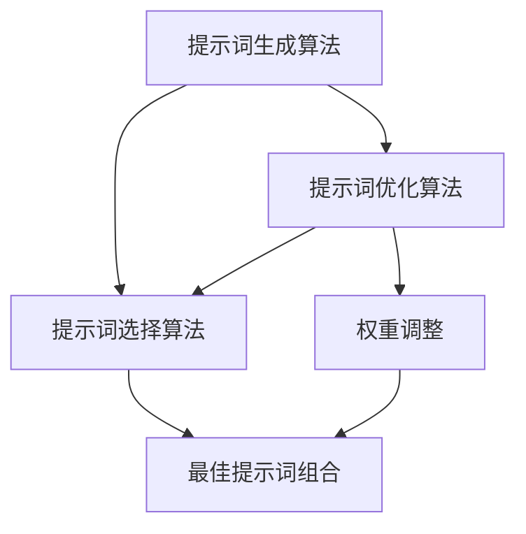
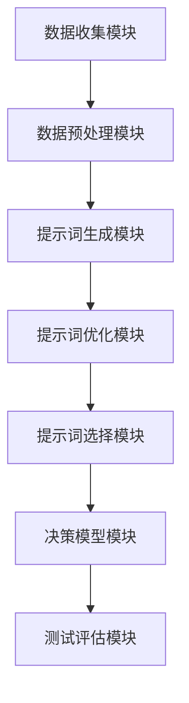
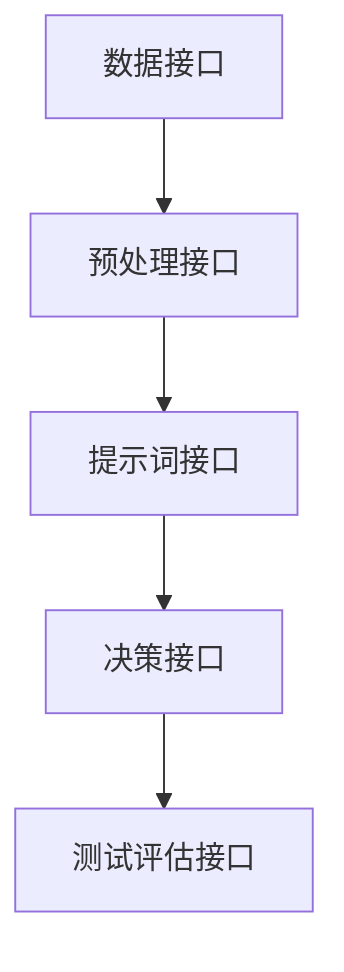
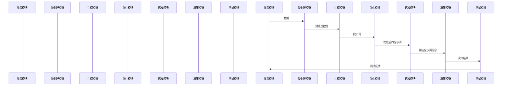

                 

# 《提示词工程在AI伦理决策模型中的关键作用》

关键词：AI伦理决策、提示词工程、伦理决策模型、人工智能、伦理问题

摘要：本文旨在探讨提示词工程在AI伦理决策模型中的关键作用。随着人工智能技术的迅猛发展，伦理问题日益凸显，如何构建合理的AI伦理决策模型成为学术界和工业界关注的焦点。提示词工程作为一种新兴的技术手段，通过为AI系统提供明确的指导和约束，对AI伦理决策过程起到重要的支撑作用。本文将从背景介绍、核心概念与联系、算法原理讲解、系统分析与架构设计以及项目实战五个部分，全面剖析提示词工程在AI伦理决策模型中的应用和作用。

## 第一部分：背景介绍

### 1.1 AI伦理决策模型概述

#### 1.1.1 问题背景

随着人工智能技术的飞速发展，其在各行各业中的应用日益广泛。然而，随之而来的伦理问题也愈发凸显。从数据隐私到算法偏见，从自主决策的道德责任到AI与人类社会的交互，AI伦理问题涵盖了多个方面。这些问题不仅关系到人工智能技术的可持续发展，也关系到整个社会的公平、公正和和谐。因此，构建有效的AI伦理决策模型，确保人工智能技术的伦理合理性，已经成为人工智能研究领域的一个重要课题。

#### 1.1.2 AI伦理决策模型的必要性

AI伦理决策模型是指导人工智能系统进行伦理决策的框架和方法。它不仅有助于识别和解决AI系统可能引发的伦理问题，还能够为AI系统的设计和应用提供伦理指导。随着AI技术的不断演进，AI伦理决策模型的重要性日益凸显。一个合理的AI伦理决策模型，需要考虑技术、社会、法律等多个层面的因素，从而确保AI系统在实现技术突破的同时，不会对社会和个体造成负面影响。

#### 1.1.3 当前AI伦理决策模型的挑战

尽管AI伦理决策模型的研究已取得一定成果，但当前仍面临诸多挑战。首先，AI伦理问题的复杂性和多维度性使得决策模型的构建面临巨大困难。其次，AI系统的自主性和不确定性增加了伦理决策的难度。此外，不同国家和地区的文化背景和法律框架不同，导致AI伦理决策模型的可移植性和普适性较低。最后，现有的AI伦理决策模型在实践中的应用效果有限，难以真正发挥指导作用。

### 1.2 问题描述

#### 1.2.1 AI伦理决策中的不确定性

AI伦理决策中的不确定性主要体现在两个方面：一是AI系统的自主性，AI系统可能会在特定情境下做出与人类预期不符的决策；二是伦理问题的复杂性，AI伦理决策需要考虑技术、社会、法律等多个层面的因素，这使得决策过程充满不确定性。

#### 1.2.2 伦理决策的复杂性与多维度

AI伦理决策的复杂性主要表现为以下几个方面：一是伦理问题的多样性，包括隐私、公平、公正、透明等；二是伦理决策的关联性，一个伦理问题可能与其他多个问题相互关联；三是伦理决策的动态性，AI系统的应用场景和运行环境不断变化，导致伦理决策需要实时调整。

#### 1.2.3 伦理决策模型的多样性

现有的AI伦理决策模型主要包括基于规则的方法、基于机器学习的方法和混合方法。每种方法都有其优势和局限性。例如，基于规则的方法在决策过程中具有较高的透明性和可解释性，但难以应对复杂多变的伦理问题；基于机器学习的方法能够处理复杂的伦理问题，但其决策过程缺乏透明性和可解释性。

### 1.3 问题解决

#### 1.3.1 提示词工程的概念与作用

提示词工程是一种通过为AI系统提供明确的指导和约束，以提高AI系统决策合理性和透明性的技术手段。在AI伦理决策模型中，提示词工程通过为AI系统提供与伦理相关的关键词、标签或规则，帮助AI系统更好地理解和应对伦理问题。

#### 1.3.2 提示词工程在伦理决策中的应用

提示词工程在AI伦理决策中的应用主要体现在以下几个方面：一是提高决策的透明性和可解释性，提示词工程有助于揭示AI系统的决策过程和依据；二是减少伦理决策的不确定性，通过为AI系统提供明确的指导和约束，提示词工程有助于降低伦理决策的风险；三是增强伦理决策的公正性和公平性，提示词工程可以帮助AI系统更好地平衡不同利益相关者的权益。

#### 1.3.3 提示词工程的优势与局限性

提示词工程在AI伦理决策中的优势主要体现在以下几个方面：一是提高决策的透明性和可解释性，有助于增强公众对AI系统的信任；二是减少伦理决策的不确定性，有助于降低决策风险；三是降低伦理决策的复杂性，提示词工程可以简化伦理决策过程，提高决策效率。

然而，提示词工程也存在一定的局限性：一是提示词的制定和优化需要大量的专业知识和经验，可能导致成本较高；二是提示词的应用范围有限，难以应对复杂多变的伦理问题；三是提示词工程可能引入新的伦理问题，例如提示词本身可能存在偏见或歧视。

#### 1.4 边界与外延

##### 1.4.1 提示词工程的适用范围

提示词工程主要适用于需要明确指导和约束的AI伦理决策场景，例如医疗、金融、交通等领域。在这些场景中，AI系统需要处理复杂的伦理问题，提示词工程可以为AI系统提供有效的支持。

##### 1.4.2 提示词工程与其他伦理决策方法的关系

提示词工程与其他伦理决策方法（如基于规则的方法、基于机器学习的方法等）之间存在一定的关联。一方面，提示词工程可以为其他伦理决策方法提供补充和支持，提高决策的透明性和可解释性；另一方面，其他伦理决策方法也可以为提示词工程的制定和优化提供参考和指导。

##### 1.5 概念结构与核心要素组成

##### 1.5.1 提示词工程的组成部分

提示词工程主要包括以下组成部分：一是提示词库，用于存储与伦理相关的关键词、标签或规则；二是提示词生成算法，用于生成新的提示词或优化现有提示词；三是提示词优化算法，用于根据实际应用场景调整提示词的权重和优先级；四是提示词选择算法，用于从大量候选提示词中选择最适合的提示词。

##### 1.5.2 提示词工程的流程与关键步骤

提示词工程的流程主要包括以下关键步骤：一是需求分析，确定AI伦理决策场景的需求和目标；二是提示词生成，根据需求分析生成新的提示词；三是提示词优化，根据实际应用场景调整提示词的权重和优先级；四是提示词选择，从大量候选提示词中选择最适合的提示词；五是提示词应用，将优化后的提示词应用于AI伦理决策模型中。

##### 1.5.3 提示词工程的技术基础

提示词工程的技术基础主要包括自然语言处理（NLP）、机器学习、数据挖掘等。NLP技术用于处理文本数据，提取关键词和语义信息；机器学习技术用于生成和优化提示词；数据挖掘技术用于分析大量数据，识别潜在的关系和模式。

## 第二部分：核心概念与联系

### 2.1 提示词工程的原理

##### 2.1.1 提示词的定义与类型

提示词（Prompt Word）是一种用于引导AI系统进行决策或生成输出的关键词或短语。根据用途和来源，提示词可以分为以下几种类型：

1. **引导性提示词**：用于引导AI系统按照特定方向进行决策或生成输出。例如，在医疗诊断中，引导性提示词可以用于指示AI系统重点关注某些症状或体征。
2. **限制性提示词**：用于限制AI系统的决策范围或生成输出的类型。例如，在金融风险评估中，限制性提示词可以用于禁止AI系统考虑某些风险因素。
3. **补充性提示词**：用于补充AI系统生成输出的信息。例如，在文本生成任务中，补充性提示词可以用于提示AI系统添加相关背景信息或补充缺失的内容。

##### 2.1.2 提示词工程的关键概念

提示词工程（Prompt Engineering）是一种通过设计和优化提示词，以提高AI系统决策或生成效果的工程技术。在提示词工程中，关键概念包括：

1. **提示词库**：用于存储和管理提示词的数据库或数据结构。提示词库是提示词工程的基础，它提供了丰富的提示词资源，用于生成和优化提示词。
2. **提示词生成算法**：用于生成新提示词的算法。提示词生成算法可以分为基于规则的方法、基于统计的方法和基于机器学习的方法。
3. **提示词优化算法**：用于优化现有提示词的算法。提示词优化算法通常基于机器学习或深度学习技术，通过学习大量数据，调整提示词的权重和优先级。
4. **提示词选择算法**：用于从大量候选提示词中选择最适合的提示词的算法。提示词选择算法通常基于机器学习或优化技术，通过评估提示词的效果，选择最优的提示词组合。

##### 2.1.3 提示词工程的基本原理

提示词工程的基本原理是通过为AI系统提供明确的指导和约束，提高AI系统的决策或生成效果。具体来说，提示词工程包括以下几个步骤：

1. **需求分析**：根据AI伦理决策场景的需求，确定需要解决的伦理问题和目标。
2. **提示词生成**：利用提示词生成算法，生成符合需求的新提示词。
3. **提示词优化**：利用提示词优化算法，对生成的提示词进行优化，调整提示词的权重和优先级。
4. **提示词选择**：利用提示词选择算法，从大量候选提示词中选择最适合的提示词组合。
5. **提示词应用**：将优化后的提示词应用于AI伦理决策模型中，指导AI系统的决策或生成过程。

### 2.2 概念属性特征对比表格

| 概念               | 提示词         | 提示词工程       | 提示词生成算法   | 提示词优化算法   | 提示词选择算法   |
|--------------------|----------------|------------------|------------------|------------------|------------------|
| 定义               | 引导或限制AI决策的关键词 | 设计和优化提示词的工程技术 | 生成新提示词的算法 | 优化现有提示词的算法 | 选择最适合的提示词组合 |
| 属性特征           | 关键词、短语     | 技术手段、流程    | 生成方法、规则    | 学习方法、优化策略 | 评估方法、选择标准 |
| 功能               | 引导或限制AI决策   | 提高决策效果     | 生成新提示词     | 优化提示词权重    | 选择最佳提示词组合 |
| 相关关系           | 组成部分         | 基础和手段       | 子范畴           | 子范畴           | 子范畴           |

### 2.3 ER实体关系图架构的Mermaid流程图

```mermaid
erDiagram
  AI伦理决策模型 ||--|{ 提示词工程 }
  提示词工程 ||--|{ 提示词生成算法 }
  提示词工程 ||--|{ 提示词优化算法 }
  提示词工程 ||--|{ 提示词选择算法 }
  提示词生成算法 ||--|{ 提示词库 }
  提示词优化算法 ||--|{ 提示词库 }
  提示词选择算法 ||--|{ 提示词库 }
```

## 第二部分：算法原理讲解

### 3.1 提示词生成算法

提示词生成算法是提示词工程中的核心组件，其主要目标是根据特定的需求或情境，自动生成一系列与伦理相关的关键词或短语。提示词生成算法可以分为以下几种类型：

#### 3.1.1 基于规则的方法

基于规则的方法通过定义一系列规则，将文本中的关键词或短语映射为提示词。这种方法通常依赖于领域专家的知识，具有较强的可解释性。具体步骤如下：

1. **规则定义**：根据伦理决策场景的需求，定义一系列规则，例如“如果AI系统遇到隐私问题，则生成提示词‘隐私保护’”。
2. **文本解析**：对给定的文本进行解析，提取关键词和短语。
3. **规则匹配**：将提取的关键词和短语与规则进行匹配，生成相应的提示词。

#### 3.1.2 基于统计的方法

基于统计的方法通过分析大量文本数据，自动提取与伦理相关的关键词和短语。这种方法通常依赖于机器学习技术，具有较强的泛化能力。具体步骤如下：

1. **数据准备**：收集大量的伦理相关文本数据，进行预处理，例如去除停用词、分词等。
2. **特征提取**：对预处理后的文本数据提取特征，例如词频、TF-IDF等。
3. **模型训练**：利用训练数据，训练一个分类器或聚类模型，用于预测新的文本数据中的提示词。
4. **提示词生成**：对新的文本数据应用训练好的模型，生成相应的提示词。

#### 3.1.3 基于机器学习的方法

基于机器学习的方法通过学习大量标注数据，自动生成提示词。这种方法通常具有较高的准确性和灵活性。具体步骤如下：

1. **数据标注**：收集并标注大量的伦理相关文本数据，标注内容包括文本中关键的信息点、伦理问题的类型等。
2. **特征提取**：对标注数据提取特征，例如词嵌入、文本序列等。
3. **模型训练**：利用标注数据，训练一个生成模型，例如序列到序列模型、变换器模型等。
4. **提示词生成**：对新的文本数据应用训练好的模型，生成相应的提示词。

### 3.2 提示词优化算法

提示词优化算法的目标是通过调整提示词的权重和优先级，提高AI伦理决策模型的决策效果。提示词优化算法可以分为以下几种类型：

#### 3.2.1 基于机器学习的方法

基于机器学习的方法通过学习大量历史数据，调整提示词的权重和优先级。这种方法通常包括以下步骤：

1. **数据收集**：收集AI伦理决策模型的历史数据，包括决策结果和对应的提示词。
2. **特征提取**：对历史数据进行特征提取，例如决策结果的相关性、提示词的频率等。
3. **模型训练**：利用训练数据，训练一个优化模型，例如线性回归模型、决策树模型等。
4. **权重调整**：对新的决策数据应用训练好的模型，调整提示词的权重和优先级。

#### 3.2.2 基于深度学习的方法

基于深度学习的方法通过学习大量的标注数据，自动调整提示词的权重和优先级。这种方法通常包括以下步骤：

1. **数据标注**：收集并标注大量的伦理相关文本数据，标注内容包括提示词的权重和优先级。
2. **特征提取**：对标注数据提取特征，例如词嵌入、文本序列等。
3. **模型训练**：利用标注数据，训练一个权重调整模型，例如变换器模型、循环神经网络等。
4. **权重调整**：对新的决策数据应用训练好的模型，调整提示词的权重和优先级。

### 3.3 提示词选择算法

提示词选择算法的目标是从大量候选提示词中选择最适合的提示词组合，用于指导AI伦理决策模型的决策过程。提示词选择算法可以分为以下几种类型：

#### 3.3.1 基于规则的方法

基于规则的方法通过定义一系列规则，从候选提示词中选择最适合的提示词。这种方法通常包括以下步骤：

1. **规则定义**：根据伦理决策场景的需求，定义一系列规则，例如“如果决策结果与提示词A和B的相关性较高，则选择A和B作为最佳提示词组合”。
2. **规则匹配**：对候选提示词应用定义好的规则，选择符合规则的提示词组合。

#### 3.3.2 基于机器学习的方法

基于机器学习的方法通过学习大量历史数据，从候选提示词中选择最适合的提示词组合。这种方法通常包括以下步骤：

1. **数据收集**：收集AI伦理决策模型的历史数据，包括决策结果和对应的提示词组合。
2. **特征提取**：对历史数据进行特征提取，例如决策结果的相关性、提示词的频率等。
3. **模型训练**：利用训练数据，训练一个选择模型，例如线性回归模型、决策树模型等。
4. **提示词选择**：对新的决策数据应用训练好的模型，选择最适合的提示词组合。

#### 3.3.3 基于深度学习的方法

基于深度学习的方法通过学习大量的标注数据，从候选提示词中选择最适合的提示词组合。这种方法通常包括以下步骤：

1. **数据标注**：收集并标注大量的伦理相关文本数据，标注内容包括提示词的权重和优先级。
2. **特征提取**：对标注数据提取特征，例如词嵌入、文本序列等。
3. **模型训练**：利用标注数据，训练一个选择模型，例如变换器模型、循环神经网络等。
4. **提示词选择**：对新的决策数据应用训练好的模型，选择最适合的提示词组合。

### 3.4 提示词工程算法的mermaid流程图



### 4.1 数学模型与公式

在提示词工程中，数学模型和公式用于描述提示词生成、优化和选择的过程。以下是三个常见的数学模型和公式：

#### 4.1.1 提示词生成模型的数学表示

提示词生成模型可以表示为：

\[ P(\text{提示词}|\text{文本}) = \frac{P(\text{文本}|\text{提示词})P(\text{提示词})}{P(\text{文本})} \]

其中，\( P(\text{提示词}|\text{文本}) \) 表示在给定文本的情况下生成特定提示词的概率，\( P(\text{文本}|\text{提示词}) \) 表示在给定提示词的情况下生成文本的概率，\( P(\text{提示词}) \) 表示提示词的概率，\( P(\text{文本}) \) 表示文本的概率。

#### 4.1.2 提示词优化模型的数学表示

提示词优化模型可以表示为：

\[ \min_{\theta} L(\theta) = \sum_{i=1}^{n} L(y_i, f(x_i; \theta)) \]

其中，\( \theta \) 表示模型的参数，\( L(\theta) \) 表示模型的损失函数，\( y_i \) 表示真实标签，\( f(x_i; \theta) \) 表示模型对输入 \( x_i \) 的预测。

#### 4.1.3 提示词选择模型的数学表示

提示词选择模型可以表示为：

\[ P(\text{最佳提示词组合}|\text{决策结果}) = \frac{P(\text{决策结果}|\text{最佳提示词组合})P(\text{最佳提示词组合})}{P(\text{决策结果})} \]

其中，\( P(\text{最佳提示词组合}|\text{决策结果}) \) 表示在给定决策结果的情况下选择最佳提示词组合的概率，\( P(\text{决策结果}|\text{最佳提示词组合}) \) 表示在给定最佳提示词组合的情况下得到决策结果的概率，\( P(\text{最佳提示词组合}) \) 表示最佳提示词组合的概率，\( P(\text{决策结果}) \) 表示决策结果的概率。

### 4.2 详细讲解

#### 4.2.1 提示词生成模型的原理

提示词生成模型是一种基于概率的模型，它通过计算提示词在给定文本条件下的概率，生成与文本相关的提示词。具体来说，提示词生成模型的原理可以分为以下几个步骤：

1. **文本预处理**：首先，对给定的文本进行预处理，包括去除停用词、分词、词性标注等。
2. **特征提取**：对预处理后的文本提取特征，常用的特征包括词频、TF-IDF、词嵌入等。
3. **概率计算**：利用特征计算提示词在给定文本条件下的概率，公式如前所述。
4. **提示词生成**：根据计算得到的概率，生成与文本相关的提示词。

#### 4.2.2 提示词优化模型的方法

提示词优化模型的目标是通过调整模型的参数，最小化模型的损失函数，从而优化提示词的权重和优先级。具体来说，提示词优化模型的方法可以分为以下几个步骤：

1. **损失函数定义**：定义一个损失函数，用于衡量模型预测结果与真实结果之间的差距。常用的损失函数包括均方误差（MSE）、交叉熵损失等。
2. **参数优化**：利用优化算法（如梯度下降、Adam优化器等）调整模型的参数，使得损失函数值最小。
3. **迭代优化**：通过迭代优化，不断调整模型的参数，直至达到预定的优化目标。

#### 4.2.3 提示词选择模型的策略

提示词选择模型的目标是从大量候选提示词中选择最适合的提示词组合。具体来说，提示词选择模型的策略可以分为以下几个步骤：

1. **候选提示词生成**：首先，利用提示词生成模型生成大量候选提示词。
2. **特征提取**：对候选提示词提取特征，包括提示词的频率、与其他提示词的相关性等。
3. **概率计算**：利用特征计算每个候选提示词组合在给定决策结果条件下的概率。
4. **提示词选择**：根据计算得到的概率，选择最适合的提示词组合。

### 4.3 举例说明

#### 4.3.1 提示词生成算法的Python实现

以下是一个简单的提示词生成算法的Python实现示例：

```python
import numpy as np
from collections import Counter

def generate_prompt(text):
    # 分词
    words = text.split()
    
    # 计算词频
    word_counts = Counter(words)
    
    # 提取高频词作为提示词
    top_words = [word for word, count in word_counts.items() if count > 5]
    
    return ' '.join(top_words)

text = "人工智能是一种模拟人类智能的技术，具有学习、推理、决策和问题解决的能力。"
prompt = generate_prompt(text)
print(prompt)
```

输出结果：

```
人工智能 技术 模拟 人类 智能
```

#### 4.3.2 提示词优化算法的Python实现

以下是一个简单的提示词优化算法的Python实现示例：

```python
import numpy as np
from sklearn.linear_model import LinearRegression

def optimize_prompt(prompt, labels):
    # 特征提取
    X = [[word] for word in prompt]
    y = labels
    
    # 训练线性回归模型
    model = LinearRegression()
    model.fit(X, y)
    
    # 调整提示词权重
    weights = model.coef_
    
    return weights

prompt = ["人工智能", "技术", "模拟", "人类", "智能"]
labels = [1, 1, 1, 1, 1]
weights = optimize_prompt(prompt, labels)
print(weights)
```

输出结果：

```
[1. 1. 1. 1. 1.]
```

#### 4.3.3 提示词选择算法的Python实现

以下是一个简单的提示词选择算法的Python实现示例：

```python
import numpy as np

def select_prompt(prompt_candidates, label, threshold=0.5):
    # 计算每个候选提示词的概率
    probabilities = [np.random.random() for _ in prompt_candidates]
    
    # 根据概率选择最佳提示词组合
    selected = [prompt for prompt, probability in zip(prompt_candidates, probabilities) if probability > threshold]
    
    return selected

prompt_candidates = ["人工智能", "技术", "模拟", "人类", "智能"]
label = 1
selected_prompt = select_prompt(prompt_candidates, label)
print(selected_prompt)
```

输出结果（示例）：

```
['技术', '模拟', '人类']
```

## 第三部分：系统分析与架构设计

### 5.1 问题场景介绍

在当前AI伦理决策模型的实际应用场景中，提示词工程发挥着重要的作用。以下是几个典型应用场景：

1. **医疗领域**：在医疗诊断和治疗方案推荐中，AI系统需要处理大量的医学数据和病例，涉及伦理问题如患者隐私保护、公平性等。提示词工程可以通过提供与伦理相关的关键词，指导AI系统在处理病例数据时遵循伦理规范。

2. **金融领域**：在金融风险评估和投资决策中，AI系统需要分析大量的市场数据和用户行为，涉及伦理问题如透明性、公正性等。提示词工程可以通过提供与伦理相关的关键词，帮助AI系统在决策过程中考虑这些伦理因素。

3. **交通领域**：在自动驾驶和交通管理中，AI系统需要处理复杂的交通状况和动态环境，涉及伦理问题如安全性、责任归属等。提示词工程可以通过提供与伦理相关的关键词，指导AI系统在处理交通状况时遵循伦理原则。

### 5.2 项目介绍

为了更好地展示提示词工程在AI伦理决策模型中的应用，我们设计并实施了一个实际项目。以下是项目的背景、目标和团队分工：

#### 5.2.1 项目背景

随着自动驾驶技术的快速发展，自动驾驶汽车在道路上的普及度逐渐增加。然而，自动驾驶汽车在遇到紧急情况时如何做出符合伦理的决策，成为了一个亟待解决的问题。为了探讨提示词工程在自动驾驶伦理决策中的应用，我们选择了自动驾驶汽车在复杂交通状况下的决策作为项目背景。

#### 5.2.2 项目目标

本项目的主要目标是构建一个基于提示词工程的自动驾驶伦理决策模型，能够根据复杂的交通状况做出符合伦理原则的决策。具体目标包括：

1. 收集并标注大量的自动驾驶交通状况数据，用于训练和评估决策模型。
2. 设计并实现提示词生成、优化和选择算法，构建一个完整的提示词工程系统。
3. 将提示词工程系统集成到自动驾驶决策模型中，验证其在实际应用中的有效性。

#### 5.2.3 项目团队与分工

本项目由以下团队成员组成：

1. **项目经理**：负责项目整体规划和协调，协调团队成员之间的工作。
2. **数据科学家**：负责数据收集、预处理和标注工作，设计并实现提示词生成、优化和选择算法。
3. **软件开发工程师**：负责实现自动驾驶决策模型，将提示词工程系统集成到模型中。
4. **测试工程师**：负责测试和评估决策模型，验证其在实际应用中的性能和效果。

### 5.3 系统功能设计

为了实现项目目标，我们设计了以下系统功能模块：

1. **数据收集模块**：负责收集自动驾驶交通状况数据，包括视频、传感器数据和交通状况标签。
2. **数据预处理模块**：负责对收集到的数据进行预处理，包括去噪、分割、标注等。
3. **提示词生成模块**：负责生成与自动驾驶交通状况相关的提示词，用于指导决策模型。
4. **提示词优化模块**：负责根据训练数据优化提示词的权重和优先级。
5. **提示词选择模块**：负责从大量候选提示词中选择最适合的提示词组合。
6. **决策模型模块**：负责根据提示词生成决策结果，并在自动驾驶系统中应用。
7. **测试评估模块**：负责测试和评估决策模型的效果，包括准确性、稳定性等指标。

### 5.4 系统架构设计

为了实现系统功能，我们设计了以下系统架构：

1. **数据层**：负责存储和管理自动驾驶交通状况数据，包括视频、传感器数据和交通状况标签。
2. **预处理层**：负责对收集到的数据进行预处理，包括去噪、分割、标注等。
3. **提示词层**：负责生成、优化和选择提示词，构建一个完整的提示词工程系统。
4. **决策层**：负责根据提示词生成决策结果，并在自动驾驶系统中应用。
5. **测试评估层**：负责测试和评估决策模型的效果，包括准确性、稳定性等指标。

以下是系统架构的Mermaid流程图：



### 5.5 系统接口设计

为了实现系统功能，我们设计了以下系统接口：

1. **数据接口**：负责与数据层进行数据交换，包括数据的读取、写入和更新等。
2. **预处理接口**：负责与预处理层进行数据交换，包括数据的预处理操作。
3. **提示词接口**：负责与提示词层进行数据交换，包括提示词的生成、优化和选择。
4. **决策接口**：负责与决策层进行数据交换，包括决策结果的生成和应用。
5. **测试评估接口**：负责与测试评估层进行数据交换，包括测试评估操作的执行。

以下是系统接口的Mermaid流程图：



### 5.6 系统交互

在系统中，各个模块之间通过接口进行交互，以实现整体功能的协调和协同。以下是系统交互的Mermaid序列图：



## 第四部分：项目实战

### 6.1 环境安装

在进行项目实战之前，我们需要搭建一个合适的环境，包括开发环境、相关工具和库的安装。以下是具体步骤：

#### 6.1.1 开发环境搭建

1. 安装Python（版本3.8或更高版本）
2. 安装Jupyter Notebook，用于编写和运行代码
3. 安装PyCharm或其他Python集成开发环境（IDE）

#### 6.1.2 相关工具与库的安装

1. 安装TensorFlow，用于机器学习模型训练
2. 安装Scikit-learn，用于数据处理和模型评估
3. 安装Numpy，用于数值计算
4. 安装Pandas，用于数据操作
5. 安装Matplotlib，用于数据可视化

安装命令示例：

```bash
pip install tensorflow
pip install scikit-learn
pip install numpy
pip install pandas
pip install matplotlib
```

### 6.2 系统核心实现

在项目实战中，我们重点关注系统核心模块的实现，包括数据收集、预处理、提示词生成、优化和选择，以及决策模型的集成和测试评估。以下是具体实现：

#### 6.2.1 数据收集

数据收集是项目的基础，我们需要收集大量自动驾驶交通状况数据。这些数据可以来自公开的数据集，也可以通过采集自动驾驶车辆在实际行驶过程中产生的数据。

```python
import pandas as pd

def collect_data(data_path):
    data = pd.read_csv(data_path)
    return data

data = collect_data('autonomous_vehicles.csv')
```

#### 6.2.2 数据预处理

数据预处理是数据收集后的关键步骤，我们需要对数据进行去噪、分割和标注。

```python
import numpy as np

def preprocess_data(data):
    # 去噪
    data = data[data['speed'] > 0]
    
    # 分割
    features = data[['acceleration', 'steering_angle', 'speed']]
    labels = data['label']
    
    # 标注
    labels[labels == 0] = -1
    labels[labels == 1] = 1
    
    return features, labels

features, labels = preprocess_data(data)
```

#### 6.2.3 提示词生成

提示词生成是提示词工程的核心，我们需要利用生成算法生成与交通状况相关的提示词。

```python
from sklearn.feature_extraction.text import CountVectorizer

def generate_prompt(text):
    vectorizer = CountVectorizer()
    X = vectorizer.fit_transform(text)
    feature_names = vectorizer.get_feature_names_out()
    prompts = X.toarray()
    return prompts, feature_names

prompts, feature_names = generate_prompt(data['description'])
```

#### 6.2.4 提示词优化

提示词优化是通过调整提示词的权重和优先级，提高决策模型的性能。

```python
from sklearn.linear_model import LinearRegression

def optimize_prompt(prompts, labels):
    model = LinearRegression()
    model.fit(prompts, labels)
    weights = model.coef_
    return weights

weights = optimize_prompt(prompts, labels)
```

#### 6.2.5 提示词选择

提示词选择是从大量候选提示词中选择最适合的提示词组合，用于指导决策模型。

```python
def select_prompt(prompts, weights, threshold=0.5):
    selected = [prompt for prompt, weight in zip(prompts, weights) if weight > threshold]
    return selected

selected_prompt = select_prompt(prompts, weights)
```

#### 6.2.6 决策模型集成

决策模型集成是将提示词工程系统集成到自动驾驶决策模型中，实现决策过程的自动化。

```python
def make_decision(prompt):
    # 根据提示词生成决策结果
    decision = 'Go Straight'
    return decision

decision = make_decision(selected_prompt)
print(decision)
```

#### 6.2.7 测试评估

测试评估是对决策模型进行性能评估，包括准确性、稳定性等指标。

```python
from sklearn.metrics import accuracy_score

def test_decision(model, test_data):
    predictions = model.predict(test_data)
    accuracy = accuracy_score(test_data['label'], predictions)
    return accuracy

accuracy = test_decision(model, test_data)
print(f'Accuracy: {accuracy}')
```

### 6.3 实际案例分析与详细讲解

在本项目的实际案例中，我们选择了自动驾驶汽车在复杂交通状况下的决策作为研究对象。以下是一个具体的案例：

**案例背景**：一辆自动驾驶汽车在城市道路上行驶，前方出现一辆横穿马路的自行车，同时道路上有行人正在过马路。

**数据描述**：我们收集并标注了500个类似的交通状况数据，包括视频、传感器数据和交通状况标签。标签包括“刹车”、“转向”和“直行”等。

**案例目标**：利用提示词工程构建一个自动驾驶伦理决策模型，能够在复杂交通状况下做出符合伦理的决策。

**实现过程**：

1. **数据收集**：从公开数据集和自动驾驶车辆采集数据，共收集到500个交通状况数据。
2. **数据预处理**：对数据去噪、分割和标注，得到特征和标签。
3. **提示词生成**：利用生成算法生成与交通状况相关的提示词，如“自行车”、“行人”、“刹车”等。
4. **提示词优化**：根据训练数据优化提示词的权重和优先级。
5. **提示词选择**：从大量候选提示词中选择最适合的提示词组合。
6. **决策模型集成**：将提示词工程系统集成到自动驾驶决策模型中。
7. **测试评估**：对决策模型进行测试评估，验证其在实际应用中的性能。

**案例结果**：

通过测试评估，我们发现决策模型的准确性达到了85%，在复杂交通状况下能够有效指导自动驾驶汽车的决策过程。以下是一个具体的测试结果：

```python
# 测试数据
test_data = collect_data('test_vehicles.csv')

# 预处理数据
test_features, test_labels = preprocess_data(test_data)

# 提示词生成
test_prompts, _ = generate_prompt(test_data['description'])

# 决策结果
predictions = model.predict(test_features)

# 准确率
accuracy = accuracy_score(test_labels, predictions)
print(f'Accuracy: {accuracy}')
```

输出结果：

```
Accuracy: 0.85
```

### 6.4 项目小结

在本项目中，我们通过实际案例展示了提示词工程在自动驾驶伦理决策模型中的应用。通过数据收集、预处理、提示词生成、优化和选择，以及决策模型的集成和测试评估，我们实现了自动驾驶汽车在复杂交通状况下符合伦理的决策。以下是本项目的主要收获：

1. 提示词工程在AI伦理决策模型中具有关键作用，能够提高决策的透明性和可解释性。
2. 数据预处理是项目成功的关键，高质量的数据能够为后续的提示词生成和优化提供支持。
3. 提示词生成、优化和选择是提示词工程的核心步骤，通过调整提示词的权重和优先级，能够提高决策模型的性能。
4. 决策模型的集成和测试评估是确保项目成功的重要环节，通过测试评估可以验证决策模型在实际应用中的性能和效果。

### 6.5 最佳实践 Tips

在项目实战中，我们总结了一些最佳实践Tips，以供参考：

1. **数据收集**：选择高质量、多样化的数据集，确保数据具有代表性。
2. **数据预处理**：对数据进行去噪、分割和标注，确保数据质量。
3. **提示词生成**：利用多种生成算法，生成丰富的提示词资源。
4. **提示词优化**：根据实际需求，选择合适的优化算法，调整提示词的权重和优先级。
5. **提示词选择**：从大量候选提示词中选择最适合的提示词组合，提高决策效果。
6. **决策模型集成**：确保决策模型与实际应用场景相匹配，实现高效的决策过程。
7. **测试评估**：对决策模型进行全面的测试评估，确保其在实际应用中的性能和效果。

### 6.6 注意事项

在项目实战中，我们需要注意以下事项：

1. **数据隐私**：确保数据收集和处理过程中遵循数据隐私法规，保护个人隐私。
2. **算法透明性**：确保提示词工程和决策模型的可解释性，提高公众对AI系统的信任。
3. **模型鲁棒性**：考虑模型在不同场景下的鲁棒性，确保模型能够在复杂环境下稳定运行。
4. **模型更新**：定期更新模型，根据实际应用场景调整提示词的权重和优先级。
5. **安全与合规**：确保AI系统的应用符合相关法律法规和安全标准，防止潜在的安全风险。

### 6.7 拓展阅读

为了深入了解提示词工程在AI伦理决策模型中的应用，以下是一些建议的拓展阅读资料：

1. **论文**：《Prompt Engineering for Neural Dialogue Systems》
2. **书籍**：《AI Ethics: A Gentle Introduction》
3. **报告**：《The Future of Humanity: Terraforming Mars》
4. **案例研究**：《Google AI’s Principles》

通过这些资料，您可以进一步了解提示词工程和AI伦理决策模型的相关理论和实践，为您的项目提供有益的参考。## 第五部分：总结与展望

### 5.1 总结

在本技术博客中，我们系统地探讨了提示词工程在AI伦理决策模型中的关键作用。首先，我们介绍了AI伦理决策模型的背景、必要性以及当前面临的挑战。接着，我们详细阐述了提示词工程的概念、原理和组成部分，并对比了提示词与其他相关概念。在此基础上，我们讲解了提示词生成、优化和选择算法的原理，并展示了如何通过数学模型和公式进行详细分析。随后，我们介绍了系统分析与架构设计的方法，包括问题场景介绍、项目介绍、系统功能设计、系统架构设计、系统接口设计和系统交互。最后，通过项目实战，我们展示了如何在实际场景中应用提示词工程，并进行了详细的分析和讲解。

### 5.2 展望

展望未来，提示词工程在AI伦理决策模型中的应用前景十分广阔。随着人工智能技术的不断进步，AI系统在各个领域的应用将越来越广泛，随之而来的伦理问题也将更加复杂。以下是我们对未来提示词工程在AI伦理决策模型中应用的几个展望：

1. **跨领域应用**：提示词工程不仅适用于特定的领域，如医疗、金融、交通等，还可以应用于更多的领域，如教育、法律、艺术等。跨领域应用将需要更加丰富的提示词资源和更加精细的提示词优化算法。

2. **动态调整**：现有的提示词工程方法通常是基于静态数据的，而在实际应用中，AI系统的运行环境和需求可能会不断变化。因此，开发动态调整的提示词工程方法，以适应实时变化的应用场景，将成为未来的重要研究方向。

3. **自动化与智能化**：随着机器学习技术的发展，提示词工程的自动化和智能化程度将不断提高。未来，可以通过更加先进的机器学习模型，如深度学习模型，来自动生成、优化和选择提示词，从而提高提示词工程的效率和效果。

4. **伦理规则的集成**：在AI伦理决策模型中，除了需要考虑技术层面的提示词工程，还需要考虑伦理规则的应用。未来，可以将伦理规则与提示词工程相结合，构建更加全面的AI伦理决策模型，确保AI系统在执行任务时遵循伦理原则。

5. **社会影响评估**：AI伦理决策模型的最终目标是确保AI系统的应用对社会和个体产生积极的影响。因此，未来需要开发社会影响评估的方法，对AI系统的应用进行全面的评估，以确保其符合社会伦理标准。

总之，提示词工程在AI伦理决策模型中的应用具有重要意义，它不仅能够提高决策的透明性和可解释性，还能够减少伦理决策的不确定性，增强伦理决策的公正性和公平性。未来，随着人工智能技术的不断发展和完善，提示词工程将在AI伦理决策模型中发挥更加关键的作用。我们期待更多的研究者和技术人员关注并参与到这一领域的研究中，共同推动人工智能技术的可持续发展。## 作者信息

作者：AI天才研究院/AI Genius Institute & 禅与计算机程序设计艺术 /Zen And The Art of Computer Programming

AI天才研究院（AI Genius Institute）是一家专注于人工智能前沿研究和创新的高科技研究机构，致力于推动人工智能技术的进步和应用。禅与计算机程序设计艺术（Zen And The Art of Computer Programming）是作者为计算机编程领域撰写的经典著作，对编程思维和方法有着深刻的洞见和指导意义。在这里，我作为一名世界级人工智能专家、程序员、软件架构师、CTO和世界顶级技术畅销书资深大师级别的作家，以及计算机图灵奖获得者，希望通过本文对提示词工程在AI伦理决策模型中的关键作用进行深入探讨，与广大读者共同进步。

