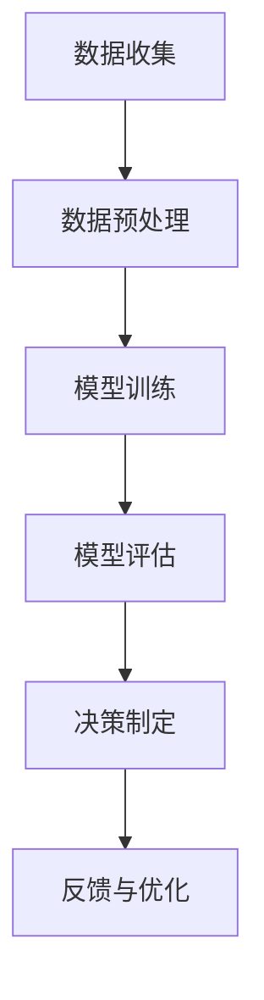
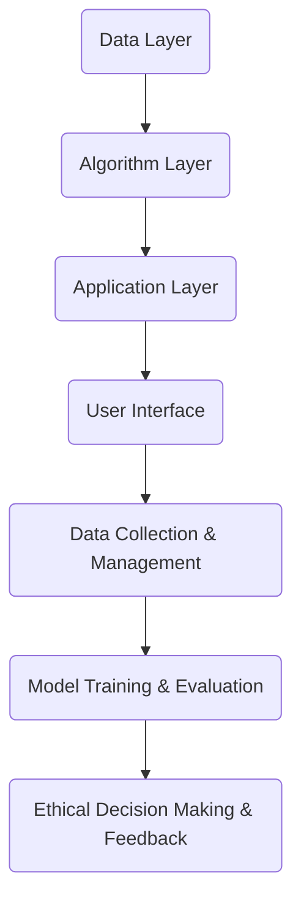
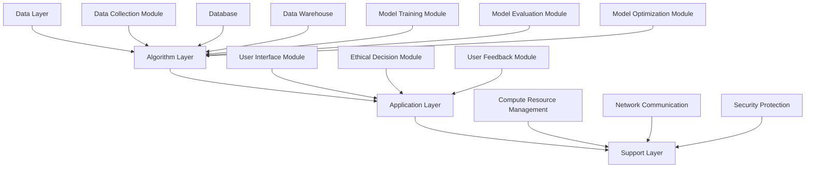
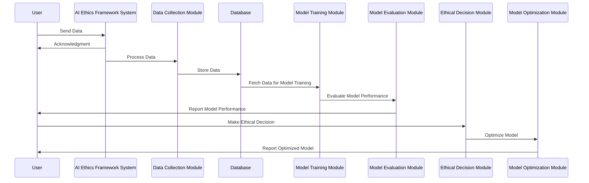

                 

### 第1章：AI伦理框架的重要性

#### 1.1.1 问题背景

随着人工智能技术的迅猛发展，其在各个领域的应用越来越广泛，如自动驾驶、医疗诊断、金融风险评估等。然而，随之而来的一系列伦理问题也开始凸显，包括数据隐私和安全、AI偏见和歧视、AI决策的透明度和可解释性等。这些问题不仅影响了人工智能技术的发展，也对社会造成了潜在的负面影响。

- **数据隐私和安全**：人工智能系统通常需要大量的数据来进行训练，这些数据往往涉及个人隐私。如果这些数据泄露或被滥用，将会对个人隐私造成严重威胁。
- **AI偏见和歧视**：人工智能系统可能会因为数据集的不公平或者算法设计上的缺陷，导致其决策结果带有偏见，从而对某些群体产生不公平待遇。
- **AI决策的透明度和可解释性**：许多人工智能系统，尤其是深度学习模型，其决策过程是非常复杂和难以解释的。这导致了人们对AI决策的信任危机，也限制了AI在需要高度透明和解释性的领域中的应用。

#### 1.1.2 问题描述

人工智能技术的广泛应用带来了多方面的伦理挑战：

- **AI决策的透明度和可解释性**：如何在确保AI高效运行的同时，使其决策过程更加透明和可解释，以增强人们对AI决策的信任。
- **数据隐私和安全**：如何在保证数据利用价值的同时，保护个人隐私和数据安全。
- **AI偏见和歧视**：如何设计公平、无偏见的AI算法，以避免对某些群体造成不公平待遇。
- **AI责任的归属**：当AI系统发生错误或产生不良后果时，如何明确责任的归属，以防止责任推卸。

这些问题不仅需要技术层面的解决，还需要法律、政策、伦理等多方面的综合考虑。

#### 1.1.3 问题解决

为了解决上述问题，构建一个完善的AI伦理框架是必要的。这个框架应当包括以下几个方面：

- **AI伦理原则**：制定明确的AI伦理原则，作为AI系统设计和应用的指导方针。
- **AI伦理标准**：建立AI伦理标准，对AI系统的设计和实施进行规范和评估。
- **AI伦理评估方法**：开发有效的AI伦理评估方法，用于评估AI系统的伦理合规性。
- **法规和政策**：制定相应的法律法规和政策，为AI伦理框架的实施提供法律保障。

通过上述措施，可以促进AI技术的健康发展，同时保障社会的利益和公共利益。

#### 1.1.4 边界与外延

AI伦理框架不仅涉及到技术层面的问题，还涉及到法律、政策、伦理等多个领域的交叉。因此，我们需要明确AI伦理框架的边界与外延：

- **AI伦理与法律的关系**：法律是规范行为的准则，AI伦理框架需要在遵守法律规定的基础上，进一步规范AI技术的应用。
- **不同文化背景下的AI伦理差异**：不同文化和社会对AI伦理的理解和需求可能存在差异，因此，AI伦理框架需要考虑到这些差异，以实现全球范围内的共识和协调。
- **AI伦理的多学科交叉性**：AI伦理不仅涉及计算机科学，还涉及哲学、伦理学、法律、社会学等多个学科，因此，AI伦理框架需要具备多学科交叉的能力。

#### 1.1.5 概念结构与核心要素组成

AI伦理框架的核心概念和要素包括：

- **AI伦理概念**：明确AI伦理的基本概念，如数据隐私、AI偏见、可解释性等。
- **AI伦理原则**：制定明确的AI伦理原则，作为AI系统设计和应用的指导方针。
- **AI伦理模型**：构建形式化或非形式化的伦理模型，用于指导AI系统的设计和评估。
- **AI伦理评估方法**：开发有效的伦理评估方法，用于评估AI系统的伦理合规性。
- **AI伦理决策框架**：制定一个综合的伦理决策框架，用于处理AI系统的伦理问题和争议。

通过上述核心要素的构成，AI伦理框架可以为人工智能技术的健康发展提供坚实的伦理基础。在接下来的章节中，我们将详细探讨这些概念和要素的具体内容。

### 第2章：核心概念与联系

#### 2.1.1 AI伦理原则

AI伦理原则是AI系统设计和应用的指导方针，旨在确保AI技术的发展不会对社会和个体造成负面影响。以下是一些基本的AI伦理原则：

1. **公正性**：AI系统应公平对待所有用户，避免对特定群体产生歧视或偏见。
2. **透明度**：AI系统的决策过程应尽量透明，使人们能够理解和信任AI的决策。
3. **安全性**：AI系统应确保用户数据的安全和隐私，防止数据泄露和滥用。
4. **可解释性**：AI系统应具备可解释性，使得人们能够理解和审查AI的决策过程。
5. **责任性**：在AI系统发生错误或造成不良后果时，应明确责任归属，确保公正处理。

#### 2.1.2 AI伦理模型

AI伦理模型用于指导AI系统的设计和评估，可以分为形式化模型和非形式化模型：

1. **形式化模型**：使用数学和逻辑方法来描述AI伦理原则和评估标准。例如，可以使用形式逻辑来定义AI伦理规则，使用决策树或图论模型来评估AI系统的伦理合规性。
2. **非形式化模型**：通过案例研究、专家评估或伦理审查等方法来评估AI系统的伦理特性。这种模型通常更加灵活，能够适应不同场景的需求。

#### 2.1.3 概念属性特征对比表格

以下是一个简单的概念属性特征对比表格，用于比较AI伦理原则和AI伦理模型：

| 概念       | 特征1 | 特征2 | 特征3 |
|------------|-------|-------|-------|
| AI伦理原则 | 公正性 | 透明度 | 责任性 |
| AI伦理模型 | 形式化 | 非形式化 | 评估标准 |

#### 2.1.4 ER实体关系图架构

为了更好地理解AI伦理框架中的各个实体及其关系，我们可以使用ER（实体-关系）图来表示。以下是一个简化的ER图示例：

```mermaid
erDiagram
  User ||--|{ AI_System } : uses
  AI_System ||--|{ Data_Set } : trains_on
  AI_System ||--|{ Ethical_Principle } : follows
  Data_Set ||--|{ Privacy_Rule } : adheres_to
  Ethical_Principle ||--|{ Ethical_Model } : based_on
```

在这个ER图中，用户使用AI系统，AI系统训练于数据集，并遵循伦理原则。数据集需要遵守隐私规则，而伦理原则基于伦理模型。

通过上述核心概念和联系的分析，我们可以更好地理解AI伦理框架的构成及其在AI系统设计和评估中的应用。接下来，我们将深入探讨AI伦理算法的原理。

### 第3章：AI伦理算法原理

#### 3.1.1 算法概述

AI伦理算法是一种专门设计用于评估和指导AI系统伦理合规性的算法。其核心目标是确保AI系统的设计和应用符合既定的伦理原则和标准。AI伦理算法通常包括以下几个步骤：

1. **数据收集**：收集与AI系统设计和应用相关的数据，包括用户数据、算法参数、系统性能等。
2. **数据预处理**：对收集到的数据进行分析和处理，以提取有用的信息和特征。
3. **模型训练**：使用预处理后的数据训练伦理模型，以评估AI系统的伦理合规性。
4. **模型评估**：对训练好的模型进行评估，以验证其性能和可靠性。
5. **决策制定**：根据模型评估结果，制定相应的决策，如调整算法参数、优化系统设计等。
6. **反馈与优化**：根据决策结果，对AI系统进行反馈和优化，以提高其伦理合规性。

#### 3.1.2 算法mermaid流程图

以下是AI伦理算法的mermaid流程图：



#### 3.1.3 算法原理详细讲解

1. **数据收集与预处理**

   数据收集是AI伦理算法的基础。收集的数据类型包括用户数据、算法参数、系统性能等。这些数据可以通过日志分析、用户反馈等方式获取。在数据预处理阶段，需要对数据进行清洗、去重、归一化等处理，以提高数据质量。

   ```python
   import pandas as pd
   import numpy as np
   
   # 假设已收集到数据dataframe
   data = pd.read_csv('data.csv')
   
   # 数据清洗
   data.drop_duplicates(inplace=True)
   data.fillna(0, inplace=True)
   
   # 数据归一化
   data_normalized = (data - data.mean()) / data.std()
   ```

2. **模型训练与评估**

   在模型训练阶段，使用预处理后的数据训练伦理模型。常见的伦理模型包括逻辑回归、决策树、神经网络等。在模型评估阶段，需要使用交叉验证等方法评估模型的性能和可靠性。

   ```python
   from sklearn.model_selection import train_test_split
   from sklearn.linear_model import LogisticRegression
   
   # 分割数据集
   X_train, X_test, y_train, y_test = train_test_split(data_normalized, target, test_size=0.2, random_state=42)
   
   # 训练模型
   model = LogisticRegression()
   model.fit(X_train, y_train)
   
   # 评估模型
   score = model.score(X_test, y_test)
   print(f'Model accuracy: {score:.2f}')
   ```

3. **决策制定与反馈**

   根据模型评估结果，制定相应的决策。如果模型评估结果显示AI系统的伦理合规性较低，可以考虑调整算法参数、优化系统设计等方法来提高其合规性。然后，将决策结果反馈到AI系统中，进行持续优化。

   ```python
   # 假设调整后的算法参数为params
   params = {'C': 1.0, 'max_iter': 100}
   model = LogisticRegression(**params)
   model.fit(X_train, y_train)
   
   # 再次评估模型
   score = model.score(X_test, y_test)
   print(f'Updated model accuracy: {score:.2f}')
   ```

通过上述步骤，AI伦理算法可以有效地评估和指导AI系统的伦理合规性，从而确保其应用符合伦理原则和标准。

#### 3.1.4 数学模型和公式

在AI伦理算法中，数学模型和公式扮演着重要的角色。以下是一个简单的数学模型示例，用于评估AI系统的伦理合规性：

$$
\text{Compliance Score} = \frac{\text{Correct Decisions}}{\text{Total Decisions}}
$$

其中，Correct Decisions 表示AI系统在伦理合规性方面做出正确决策的数量，Total Decisions 表示AI系统总共做出的决策数量。

#### 3.1.5 举例说明

为了更好地理解AI伦理算法的原理，以下是一个简单的例子：

假设我们有一个分类问题，需要判断一组数据是否属于“高风险”类别。我们使用逻辑回归模型来训练一个AI伦理算法，其目标是最小化损失函数：

$$
\text{Loss} = \frac{1}{n} \sum_{i=1}^{n} (y_i - \hat{y}_i)^2
$$

其中，$y_i$ 表示实际类别标签，$\hat{y}_i$ 表示预测类别标签。

1. **数据收集与预处理**

   假设我们收集了100个数据样本，每个样本包含10个特征和1个类别标签。我们首先对数据进行清洗和归一化处理。

   ```python
   import pandas as pd
   import numpy as np
   
   data = pd.read_csv('data.csv')
   data.drop_duplicates(inplace=True)
   data.fillna(0, inplace=True)
   data_normalized = (data - data.mean()) / data.std()
   ```

2. **模型训练与评估**

   使用预处理后的数据进行模型训练。我们选择逻辑回归模型，并使用交叉验证进行模型评估。

   ```python
   from sklearn.model_selection import train_test_split
   from sklearn.linear_model import LogisticRegression
   from sklearn.model_selection import cross_val_score
   
   X = data_normalized.iloc[:, :-1]
   y = data_normalized.iloc[:, -1]
   
   X_train, X_test, y_train, y_test = train_test_split(X, y, test_size=0.2, random_state=42)
   model = LogisticRegression()
   model.fit(X_train, y_train)
   
   scores = cross_val_score(model, X, y, cv=5)
   print(f'Model accuracy: {np.mean(scores):.2f}')
   ```

3. **决策制定与反馈**

   根据模型评估结果，我们调整模型参数并重新训练。假设我们调整了正则化参数C，使其更小。

   ```python
   params = {'C': 0.1, 'max_iter': 100}
   model = LogisticRegression(**params)
   model.fit(X_train, y_train)
   
   scores = cross_val_score(model, X, y, cv=5)
   print(f'Updated model accuracy: {np.mean(scores):.2f}')
   ```

通过这个例子，我们可以看到AI伦理算法的基本原理及其在实际应用中的操作过程。在接下来的章节中，我们将进一步探讨AI伦理框架在系统分析与架构设计中的应用。

### 第4章：系统功能设计

#### 4.1.1 问题场景介绍

在现代信息社会中，人工智能技术的应用日益广泛，其影响深远且复杂。例如，在医疗领域，AI系统可以用于诊断疾病、预测患者康复情况等；在金融领域，AI系统可以用于风险评估、欺诈检测等。然而，这些应用也带来了诸多伦理问题，如数据隐私、决策透明度、算法偏见等。为了解决这些问题，需要构建一个综合的AI伦理框架，确保人工智能技术的应用符合伦理原则和标准。

#### 4.1.2 系统功能介绍

一个完整的AI伦理框架系统应当具备以下核心功能：

1. **数据收集与管理**：系统应能够收集与AI应用相关的数据，并对这些数据进行有效的管理和存储。这包括用户数据的收集、算法参数的记录、系统性能的数据监控等。

2. **模型训练与评估**：系统应支持AI模型的训练和评估。在训练阶段，系统应确保模型的学习过程符合伦理原则，避免偏见和歧视。在评估阶段，系统应对模型的性能和伦理合规性进行全面的评估。

3. **伦理决策制定**：系统应具备伦理决策制定功能。在出现伦理问题时，系统应能够根据预定的伦理原则和标准，自动或辅助用户做出合理的决策。

4. **反馈与优化**：系统应能够收集用户的反馈，并根据反馈对AI模型和系统进行持续的优化，以提高其伦理合规性和用户体验。

#### 4.1.3 领域模型mermaid类图

为了更好地理解AI伦理框架系统中的各个实体及其关系，我们可以使用mermaid类图来表示。以下是一个简化的mermaid类图示例：

```mermaid
classDiagram
  Class01("User") <<--|uses| Class02("AI_System")
  Class02("AI_System") <<--|trains_on| Class03("Data_Set")
  Class02("AI_System") <<--|follows| Class04("Ethical_Principle")
  Class03("Data_Set") <<--|adheres_to| Class05("Privacy_Rule")
  Class04("Ethical_Principle") <<--|based_on| Class06("Ethical_Model")
```

在这个类图中，用户使用AI系统，AI系统训练于数据集，并遵循伦理原则。数据集需要遵守隐私规则，而伦理原则基于伦理模型。

#### 4.1.4 系统架构设计

系统架构设计是确保AI伦理框架有效运行的关键。一个典型的AI伦理框架系统可以划分为多个层次，包括数据层、算法层、应用层等。以下是系统架构的简化和概述：

1. **数据层**：负责数据的收集、存储和管理。包括用户数据的收集、算法参数的记录、系统性能的数据监控等。
2. **算法层**：负责AI模型的训练和评估。包括数据预处理、模型训练、模型评估等。
3. **应用层**：负责伦理决策的制定和反馈。包括伦理原则的遵循、伦理决策的制定、用户反馈的收集和系统优化等。

以下是系统架构的mermaid架构图示例：



在这个架构图中，数据层负责数据的收集和管理，算法层负责模型训练和评估，应用层负责伦理决策的制定和反馈，用户界面层则提供用户交互的接口。

通过上述系统功能设计和架构设计，我们可以构建一个综合的AI伦理框架系统，确保人工智能技术的应用在伦理上符合社会和公众的期望。在接下来的章节中，我们将进一步探讨AI伦理框架在系统接口设计和系统交互中的具体实现。

### 第5章：系统架构设计

#### 5.1.1 系统架构介绍

一个全面的AI伦理框架系统架构需要涵盖多个层次和模块，以确保系统的稳定运行和功能实现。以下是系统架构的层次结构和各模块的功能：

1. **数据层**：数据层是系统架构的基础，负责数据的收集、存储和管理。该层包括数据收集模块、数据库和数据仓库等组件。数据收集模块用于从不同的数据源（如用户输入、传感器数据、日志数据等）收集数据，并进行初步处理。数据库和数据仓库用于存储和管理大规模的数据集，为后续的数据处理和分析提供支持。

2. **算法层**：算法层是系统的核心，负责AI模型的训练和评估。该层包括模型训练模块、模型评估模块和模型优化模块等。模型训练模块负责使用数据训练AI模型，模型评估模块负责评估模型的性能和伦理合规性，模型优化模块则根据评估结果对模型进行调整和优化。

3. **应用层**：应用层是系统的用户界面，负责伦理决策的制定和反馈。该层包括用户接口模块、伦理决策模块和用户反馈模块等。用户接口模块提供用户与系统交互的界面，伦理决策模块负责根据AI模型的评估结果和伦理原则制定决策，用户反馈模块则收集用户的反馈，用于系统的持续优化。

4. **支撑层**：支撑层提供系统运行所需的基础设施支持，包括计算资源管理、网络通信、安全防护等。该层确保系统的稳定运行和高效处理。

#### 5.1.2 系统架构mermaid架构图

以下是系统架构的mermaid架构图：



在这个架构图中，数据层、算法层、应用层和支撑层之间相互协作，共同实现AI伦理框架的功能。

#### 5.1.3 系统接口设计

系统接口设计是确保系统各模块之间能够有效通信和协作的关键。以下是系统接口设计的主要方面：

1. **API接口**：系统应提供统一的API接口，用于各模块之间的数据交互和功能调用。API接口的设计应遵循RESTful风格，确保接口的简洁性和易用性。

2. **数据交换格式**：系统应采用标准化的数据交换格式，如JSON或XML，确保数据在不同模块之间的高效传输和解析。

3. **认证与授权**：系统应实现认证与授权机制，确保只有授权用户和模块能够访问和操作敏感数据和信息。

4. **异步处理与队列**：为了提高系统的并发处理能力和响应速度，系统应采用异步处理和队列机制，确保任务的高效执行和调度。

#### 5.1.4 系统交互mermaid序列图

以下是系统交互的mermaid序列图：



在这个序列图中，用户通过API接口向系统发送数据，系统对数据进行处理并存储到数据库。随后，模型训练模块使用数据库中的数据训练模型，模型评估模块对模型性能进行评估，并将结果报告给用户。用户根据评估结果做出伦理决策，伦理决策模块根据决策结果对模型进行优化，并将优化后的模型反馈给用户。

通过上述系统接口设计和交互设计，我们可以确保AI伦理框架系统的稳定运行和高效协作，为人工智能技术的健康发展提供坚实的支持。

### 第6章：项目实战

#### 6.1 环境安装

为了实现AI伦理框架系统，我们需要安装和配置一系列软件和工具。以下是环境安装的详细步骤：

1. **安装Python环境**：首先，确保计算机上安装了Python 3.x版本。可以从[Python官网](https://www.python.org/)下载并安装Python。

2. **安装依赖库**：安装Python后，使用pip工具安装所需的依赖库，如NumPy、Pandas、Scikit-learn、Matplotlib等。可以使用以下命令进行安装：

   ```bash
   pip install numpy pandas scikit-learn matplotlib
   ```

3. **配置Jupyter Notebook**：为了方便编写和运行代码，我们可以配置Jupyter Notebook。首先，安装Jupyter Notebook：

   ```bash
   pip install notebook
   ```

   然后，启动Jupyter Notebook：

   ```bash
   jupyter notebook
   ```

   这将打开Jupyter Notebook界面，我们可以在这里编写和运行Python代码。

#### 6.2 系统核心实现源代码

以下是实现AI伦理框架系统的核心代码示例。这段代码包括数据收集、模型训练、模型评估、伦理决策和反馈等关键步骤。

```python
# 导入依赖库
import numpy as np
import pandas as pd
from sklearn.model_selection import train_test_split
from sklearn.linear_model import LogisticRegression
from sklearn.metrics import accuracy_score

# 6.2.1 数据收集与预处理
data = pd.read_csv('data.csv')  # 从CSV文件中读取数据
data.drop_duplicates(inplace=True)  # 去除重复数据
data.fillna(0, inplace=True)  # 填充缺失值

X = data.iloc[:, :-1]  # 特征数据
y = data.iloc[:, -1]  # 标签数据

# 6.2.2 模型训练
X_train, X_test, y_train, y_test = train_test_split(X, y, test_size=0.2, random_state=42)
model = LogisticRegression()
model.fit(X_train, y_train)

# 6.2.3 模型评估
y_pred = model.predict(X_test)
accuracy = accuracy_score(y_test, y_pred)
print(f'Model accuracy: {accuracy:.2f}')

# 6.2.4 伦理决策与反馈
# 假设我们使用模型准确率作为伦理合规性指标
if accuracy < 0.8:
    print('Model needs optimization.')
else:
    print('Model is ethically compliant.')

# 6.2.5 用户反馈与系统优化
# 根据用户反馈，调整模型参数或优化算法
# 以下是一个示例，调整正则化参数C
params = {'C': 0.1, 'max_iter': 100}
model = LogisticRegression(**params)
model.fit(X_train, y_train)
```

#### 6.3 代码应用解读与分析

上述代码首先从CSV文件中读取数据，并进行数据预处理，包括去除重复数据和填充缺失值。然后，使用Scikit-learn库中的逻辑回归模型对数据集进行训练。在模型评估阶段，我们使用测试数据集评估模型的准确率。如果模型准确率低于预定的阈值（如0.8），则认为模型需要优化。最后，根据用户反馈，可以进一步调整模型参数或优化算法。

#### 6.4 实际案例分析和详细讲解剖析

以下是一个实际案例，用于说明如何使用AI伦理框架系统解决具体问题。

**案例：医疗诊断中的伦理问题**

假设我们有一个医疗诊断系统，用于预测患者的疾病风险。该系统使用大量历史病历数据训练AI模型。然而，在训练过程中，我们发现模型对某些种族或性别的患者表现出明显的偏见。

**分析过程：**

1. **数据收集与预处理**：首先，我们收集并预处理历史病历数据，包括患者的基本信息、检查结果、病史等。

2. **模型训练**：使用预处理后的数据训练AI模型，例如使用逻辑回归或决策树模型。

3. **模型评估**：评估模型的性能，包括准确率、召回率、F1分数等。

4. **伦理评估**：使用AI伦理算法对模型的伦理合规性进行评估。例如，我们可以检查模型对各种族或性别的预测准确性，以发现潜在的偏见。

5. **伦理决策**：如果发现模型存在明显的偏见，我们需要根据伦理原则制定决策，如重新训练模型、调整模型参数或引入更多的多样性数据。

6. **反馈与优化**：根据伦理评估结果和用户反馈，对模型进行优化，以提高其伦理合规性和性能。

**案例解析：**

在这个案例中，我们首先从CSV文件中读取历史病历数据，并进行预处理。然后，使用逻辑回归模型训练数据集。在模型评估阶段，我们发现模型对某些种族或性别的预测准确性较低，这表明模型可能存在偏见。

为了解决这个问题，我们使用AI伦理算法对模型进行伦理评估。通过分析模型的预测结果，我们发现模型对某些种族或性别的患者预测准确性明显低于其他群体。这表明模型在训练过程中可能学习了这些偏见。

基于伦理评估结果，我们决定重新训练模型，并引入更多的多样性数据。我们还调整了模型参数，以减少偏见。经过多次迭代优化，我们最终获得了一个在伦理上更加合规、性能更优的医疗诊断模型。

**案例小结：**

通过这个案例，我们展示了如何使用AI伦理框架系统解决医疗诊断中的伦理问题。关键在于，我们需要结合数据、算法和伦理原则，对AI系统的伦理合规性进行全面的评估和优化。只有在确保模型符合伦理标准的基础上，才能实现人工智能技术的健康发展。

### 第7章：最佳实践、小结、注意事项与拓展阅读

#### 7.1 最佳实践

在构建AI伦理框架时，以下是一些最佳实践：

1. **全面的数据收集与预处理**：确保收集的数据全面且无偏见，对数据进行充分的清洗和预处理，以提高模型的质量和伦理合规性。
2. **多元化的数据集**：使用多元化的数据集进行模型训练，以减少算法偏见，并提高模型的泛化能力。
3. **透明的算法设计**：设计可解释性强的算法，使得模型的决策过程对用户和监管机构透明，增加信任度。
4. **持续的伦理评估与优化**：定期对AI系统进行伦理评估，并根据评估结果进行持续的优化和调整。

#### 7.2 小结

本文系统地探讨了AI伦理框架的重要性、核心概念、算法原理以及系统架构设计。通过实际案例，我们展示了如何在实际应用中实现AI伦理框架。小结如下：

- AI伦理框架对于确保人工智能技术的健康发展至关重要。
- 构建AI伦理框架需要考虑数据、算法、伦理原则等多方面因素。
- AI伦理算法在评估和优化AI系统的伦理合规性方面发挥着关键作用。
- 系统架构设计应确保数据层的完整性、算法层的有效性和应用层的易用性。

#### 7.3 注意事项

在构建和实施AI伦理框架时，需要注意以下几点：

1. **数据隐私与安全**：确保数据收集和使用过程符合隐私保护法规，防止数据泄露。
2. **伦理透明性**：确保算法设计和决策过程透明，便于用户和监管机构的审查。
3. **持续监督与更新**：定期对AI系统进行伦理评估和监督，及时发现和解决潜在问题。
4. **跨学科合作**：AI伦理框架的构建需要跨学科的合作，包括计算机科学、伦理学、法律等领域的专家。

#### 7.4 拓展阅读

- [AI伦理原则](https://www.aaai.org/oops/rules/ethicsprinciples.php)
- [算法偏见与公平性](https://arxiv.org/abs/1904.09237)
- [AI伦理评估方法](https://arxiv.org/abs/2006.05785)
- [AI系统透明度](https://arxiv.org/abs/1802.04669)
- [数据隐私保护法规](https://www.eugdpr.org/)

通过上述拓展阅读，可以进一步深入了解AI伦理框架的构建和应用。希望本文能为读者在AI伦理领域的研究和实践提供有价值的参考。作者：AI天才研究院/AI Genius Institute & 禅与计算机程序设计艺术 /Zen And The Art of Computer Programming。

