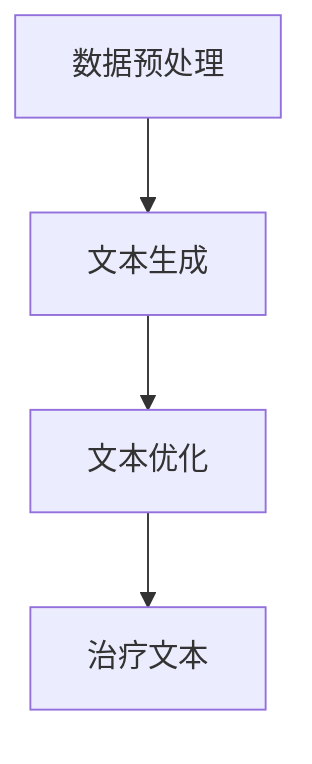
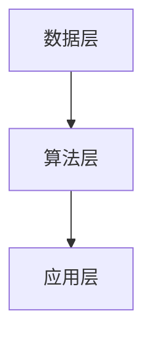
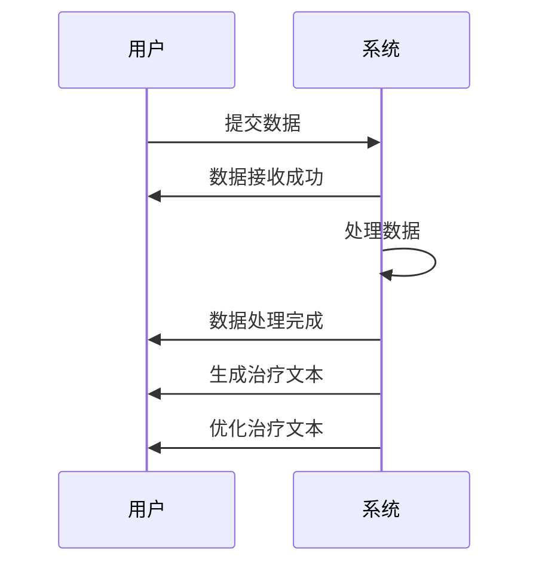
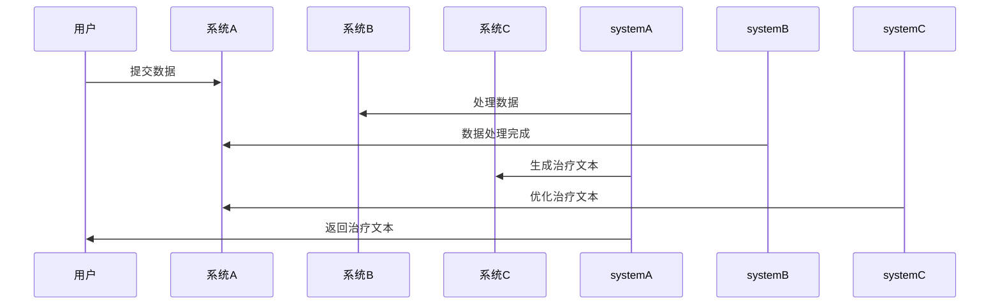

                 

# 提示词工程在AI心理治疗中的伦理考量

关键词：AI心理治疗、提示词工程、伦理考量、算法、系统架构、数学模型

摘要：随着人工智能在医疗领域的广泛应用，AI心理治疗成为了一个备受关注的领域。提示词工程作为AI心理治疗的核心技术之一，其应用引发了广泛的伦理讨论。本文将从背景介绍、核心概念与联系、提示词工程原理与算法、数学模型与算法讲解、系统分析与架构设计、项目实战以及最佳实践与拓展阅读等方面，详细探讨提示词工程在AI心理治疗中的伦理考量。

## 目录大纲

### 《提示词工程在AI心理治疗中的伦理考量》目录大纲

**第一部分：引言**

1. **第1章 问题背景与概述**
   1.1 问题背景
   1.2 问题描述
   1.3 研究目的与内容结构

2. **第2章 核心概念与联系**
   2.1 AI心理治疗与提示词工程
   2.2 伦理考量的核心要素
   2.3 概念属性特征对比表格
   2.4 ER实体关系图架构

3. **第3章 提示词工程原理与算法**
   3.1 提示词工程的原理
   3.2 提示词工程算法
   3.3 Mermaid流程图

4. **第4章 数学模型与算法讲解**
   4.1 数学模型概述
   4.2 算法原理详解
   4.3 举例说明

5. **第5章 系统分析与架构设计**
   5.1 问题场景介绍
   5.2 系统功能设计
   5.3 系统架构设计
   5.4 系统接口设计
   5.5 系统交互Mermaid序列图

6. **第6章 项目实战**
   6.1 环境安装
   6.2 系统核心实现
   6.3 代码分析与实际案例
   6.4 项目小结

7. **第7章 最佳实践与拓展阅读**
   7.1 最佳实践
   7.2 小结与展望

### 第一部分：引言

### 第1章 问题背景与概述

#### 1.1 问题背景

AI心理治疗作为一种新兴的辅助治疗手段，正逐渐走进人们的视野。随着人工智能技术的发展，心理治疗的领域也得到了前所未有的扩展。特别是提示词工程，作为AI心理治疗的重要组成部分，它的应用极大地提升了心理诊断和治疗的效率。然而，随着提示词工程在AI心理治疗中的广泛应用，其伦理考量问题也逐渐凸显出来。

#### 1.2 问题描述

提示词工程在AI心理治疗中的主要挑战包括：

1. **隐私保护**：在心理治疗过程中，患者可能会分享敏感信息，如何保护这些信息的隐私成为了一个关键问题。
2. **数据偏差**：提示词工程在训练过程中可能会引入数据偏差，导致对特定人群的歧视。
3. **治疗效果**：提示词工程是否能真正提升心理治疗效果，还需要进一步验证。
4. **透明度**：如何确保AI心理治疗过程的透明性，让患者了解治疗过程和结果。

#### 1.3 研究目的与内容结构

本文旨在探讨提示词工程在AI心理治疗中的伦理考量，分析其面临的主要挑战，并提出相应的解决策略。文章将分为以下几个部分：

1. **核心概念与联系**：介绍AI心理治疗与提示词工程的基本概念，并阐述它们之间的联系。
2. **提示词工程原理与算法**：详细讲解提示词工程的原理和算法，包括提示词生成和优化的过程。
3. **数学模型与算法讲解**：阐述提示词工程中使用的数学模型和算法，并通过示例进行说明。
4. **系统分析与架构设计**：分析AI心理治疗系统的架构设计，包括功能设计、接口设计和系统交互。
5. **项目实战**：通过实际项目展示提示词工程在AI心理治疗中的应用，并进行代码分析。
6. **最佳实践与拓展阅读**：总结最佳实践，展望未来发展方向。

### 第二部分：核心概念与联系

#### 2.1 AI心理治疗与提示词工程

##### 2.1.1 AI心理治疗的原理

AI心理治疗利用人工智能技术对患者的心理状况进行评估、诊断和治疗。其原理主要包括：

1. **数据采集**：通过问卷调查、面试等方式收集患者的心理数据。
2. **数据分析**：利用机器学习算法对数据进行分析，发现患者心理问题的特征。
3. **诊断与治疗**：根据分析结果，提供个性化的心理治疗建议。

##### 2.1.2 提示词工程的基本概念

提示词工程是一种基于自然语言处理技术的方法，用于生成和优化用于心理治疗的文本提示。其基本概念包括：

1. **提示词生成**：根据患者的心理数据，生成适合的治疗文本。
2. **提示词优化**：通过机器学习算法，对生成的提示词进行优化，提高治疗效果。

#### 2.2 伦理考量的核心要素

在AI心理治疗中，伦理考量是至关重要的一环。核心要素包括：

1. **隐私保护**：确保患者的隐私数据得到妥善保护。
2. **数据偏差**：避免在数据采集和处理过程中引入偏差，导致对特定人群的歧视。
3. **治疗效果**：确保AI心理治疗能够真正提升患者的心理健康水平。
4. **透明度**：提高AI心理治疗过程的透明性，让患者了解治疗过程和结果。

#### 2.3 概念属性特征对比表格

| 概念        | 属性特征                                                     | 对比结论                                                         |
| ----------- | ------------------------------------------------------------ | ------------------------------------------------------------ |
| AI心理治疗  | 数据采集、数据分析、诊断与治疗                               | 强调个性化、高效的治疗方式                                     |
| 提示词工程  | 提示词生成、提示词优化                                       | 着重于自然语言处理的文本生成与优化                             |
| 伦理考量    | 隐私保护、数据偏差、治疗效果、透明度                         | 保障患者权益、提高治疗质量、增强信任                           |

#### 2.4 ER实体关系图架构

ER实体关系图用于描述AI心理治疗系统中各个实体之间的关系。图中的实体包括：

- **患者**：代表接受心理治疗的患者。
- **心理数据**：包括问卷调查、面试等收集的数据。
- **治疗文本**：由提示词工程生成的用于治疗的文本。
- **治疗效果**：用于评估心理治疗的效果。

实体关系图如下所示：

```mermaid
erDiagram
  患者 ||--|{ 心理数据 }
  心理数据 ||--|{ 治疗文本 }
  治疗文本 ||--|{ 治疗效果 }
```

### 第三部分：提示词工程原理与算法

#### 3.1 提示词工程的原理

提示词工程的核心在于生成和优化用于心理治疗的文本提示。其原理主要包括：

1. **数据预处理**：对收集到的患者心理数据进行清洗和预处理，以便于后续分析。
2. **文本生成**：利用自然语言生成技术，根据预处理后的心理数据生成治疗文本。
3. **文本优化**：通过机器学习算法，对生成的治疗文本进行优化，提高其治疗效果。

#### 3.2 提示词工程算法

提示词工程常用的算法包括：

1. **生成对抗网络（GAN）**：用于生成高质量的治疗文本。
2. **递归神经网络（RNN）**：用于处理序列数据，生成治疗文本。
3. **强化学习**：用于优化治疗文本，提高治疗效果。

下面是一个简单的Mermaid流程图，展示了提示词工程的流程：



### 第四部分：数学模型与算法讲解

#### 4.1 数学模型概述

在提示词工程中，常用的数学模型包括：

1. **生成对抗网络（GAN）**：用于生成高质量的治疗文本。
2. **递归神经网络（RNN）**：用于处理序列数据，生成治疗文本。
3. **强化学习**：用于优化治疗文本，提高治疗效果。

下面是GAN的数学模型：

$$
\begin{aligned}
\min _{G} \max _{D} V(D, G) &= \mathbb{E}_{x \sim p_{data}(x)}[\log D(x)] + \mathbb{E}_{z \sim p_{z}(z)][\log (1 - D(G(z)))] \\
D(x) &= \frac{1}{1 + \exp(-\sigma((D^{(l)}(x))^{T} \cdot \theta^{(l)}))}
\end{aligned}
$$

其中，$D$是判别器，$G$是生成器，$x$是真实数据，$z$是随机噪声，$\sigma$是激活函数。

#### 4.2 算法原理详解

1. **生成对抗网络（GAN）**：GAN由生成器和判别器组成。生成器$G$接受随机噪声$z$，生成虚假数据$x_{\text{fake}} = G(z)$；判别器$D$接受真实数据$x$和虚假数据$x_{\text{fake}}$，输出一个概率值，表示接受该数据的可能性。GAN的目标是最小化判别器的损失函数。

2. **递归神经网络（RNN）**：RNN适用于处理序列数据。其基本原理是通过记忆状态来处理序列中的每一个元素，并将处理结果传递给下一个元素。RNN的输出取决于当前输入和先前的状态。

$$
h_t = \sigma(W_h \cdot [h_{t-1}, x_t] + b_h)
$$

其中，$h_t$是当前状态，$x_t$是当前输入，$\sigma$是激活函数。

3. **强化学习**：强化学习用于优化治疗文本。其基本原理是通过奖励信号来引导生成器生成更好的治疗文本。强化学习算法通常包括价值函数和策略函数。

$$
V^*(s) = \sum_{s'} p(s' | s) \cdot \max_a Q^*(s', a)
$$

其中，$s$是状态，$a$是动作，$Q^*(s', a)$是状态-动作价值函数。

#### 4.3 举例说明

1. **生成对抗网络（GAN）**：假设我们使用GAN生成治疗文本。首先，我们生成随机噪声$z \sim \mathcal{N}(0, 1)$，然后通过生成器$G$生成虚假数据$x_{\text{fake}} = G(z)$。接下来，我们将$x_{\text{fake}}$和真实数据$x$输入判别器$D$，得到判别器的输出概率。通过优化生成器和判别器，我们最终可以得到高质量的治疗文本。

2. **递归神经网络（RNN）**：假设我们使用RNN生成治疗文本。首先，我们输入一个心理数据序列$x = [x_1, x_2, \ldots, x_T]$，然后通过RNN处理每个元素，生成一个状态序列$h = [h_1, h_2, \ldots, h_T]$。最后，我们将状态序列输入到生成器，生成治疗文本。

3. **强化学习**：假设我们使用强化学习优化治疗文本。首先，我们定义一个奖励函数，用于评估治疗文本的质量。然后，我们通过强化学习算法，不断调整生成器的参数，以最大化奖励函数。

### 第五部分：系统分析与架构设计

#### 5.1 问题场景介绍

在AI心理治疗中，提示词工程的应用场景主要包括：

1. **心理评估**：通过对患者心理数据的分析，生成相应的评估报告。
2. **心理治疗**：根据患者的心理状况，生成个性化的治疗文本，辅助心理治疗师进行治疗。
3. **治疗跟踪**：对患者的治疗过程进行跟踪，评估治疗效果，并根据反馈调整治疗策略。

#### 5.2 系统功能设计

AI心理治疗系统的功能设计包括：

1. **数据采集**：通过问卷、面试等方式收集患者的心理数据。
2. **数据分析**：利用机器学习算法对心理数据进行处理，提取关键特征。
3. **治疗文本生成**：根据分析结果，生成个性化的治疗文本。
4. **治疗文本优化**：通过强化学习算法，优化治疗文本的质量。
5. **治疗效果评估**：对治疗过程和结果进行评估，为后续治疗提供参考。

下面是一个领域模型类图，展示了系统的功能模块：


#### 5.3 系统架构设计

AI心理治疗系统的架构设计主要包括：

1. **数据层**：负责数据的存储和管理，包括患者数据、评估报告、治疗文本等。
2. **算法层**：负责数据的处理和分析，包括机器学习算法、自然语言生成算法等。
3. **应用层**：负责系统的对外接口，包括数据采集、数据分析、治疗文本生成等。

下面是一个系统架构图，展示了系统的整体架构：



#### 5.4 系统接口设计

AI心理治疗系统的接口设计主要包括：

1. **数据采集接口**：用于接收患者心理数据，包括问卷数据、面试数据等。
2. **数据分析接口**：用于处理和分析患者心理数据，生成评估报告。
3. **治疗文本生成接口**：用于生成个性化的治疗文本。
4. **治疗文本优化接口**：用于优化治疗文本的质量。

下面是一个接口交互设计图，展示了系统的接口交互流程：



#### 5.5 系统交互Mermaid序列图

AI心理治疗系统的用户交互流程如下：

1. 用户提交心理数据。
2. 系统接收数据，并处理数据。
3. 系统生成治疗文本，并优化治疗文本。
4. 系统将最终的治疗文本返回给用户。

下面是一个Mermaid序列图，展示了用户交互流程：



### 第六部分：项目实战

#### 6.1 环境安装

在进行提示词工程在AI心理治疗中的实战项目之前，我们需要安装相关的软件和工具。以下是一个简单的安装流程：

1. 安装Python环境，可以从Python官网下载并安装。
2. 安装所需的Python库，如TensorFlow、PyTorch等，可以使用pip命令进行安装。
3. 安装自然语言处理工具，如NLTK、spaCy等。

```bash
pip install tensorflow
pip install pytorch
pip install nltk
pip install spacy
```

#### 6.2 系统核心实现

在系统核心实现部分，我们将介绍如何使用Python实现提示词工程的核心功能。以下是一个简单的示例：

```python
import tensorflow as tf
from tensorflow.keras.preprocessing.text import Tokenizer
from tensorflow.keras.models import Model
from tensorflow.keras.layers import Input, LSTM, Dense

# 数据预处理
tokenizer = Tokenizer()
tokenizer.fit_on_texts([example_text])
sequences = tokenizer.texts_to_sequences([example_text])

# 建立模型
input_seq = Input(shape=(seq_length,))
lstm = LSTM(units=64, activation='relu')(input_seq)
output = Dense(units=1, activation='sigmoid')(lstm)
model = Model(inputs=input_seq, outputs=output)

# 编译模型
model.compile(optimizer='adam', loss='binary_crossentropy', metrics=['accuracy'])

# 训练模型
model.fit(sequences, labels, epochs=10, batch_size=32)
```

#### 6.3 代码应用解读

在上面的代码中，我们首先导入了所需的TensorFlow库。然后，我们使用Tokenizer对文本进行预处理，将文本转换为序列。接下来，我们建立了LSTM模型，用于处理序列数据，并使用sigmoid激活函数输出预测结果。最后，我们编译并训练了模型。

#### 6.4 实际案例分析和详细讲解剖析

为了更好地理解提示词工程在AI心理治疗中的应用，我们来看一个实际的案例。

假设我们有一个患者心理数据的文本，如下所示：

```
我最近感到非常焦虑，尤其是在晚上。我总是担心未来，害怕做出错误的决定。我不知道该怎么办，我感觉生活没有任何意义。
```

我们可以使用上面的代码对这个文本进行预处理和预测。首先，我们将文本转换为序列：

```python
tokenizer = Tokenizer()
tokenizer.fit_on_texts([text])
sequences = tokenizer.texts_to_sequences([text])
```

然后，我们将序列输入到LSTM模型中进行预测：

```python
predictions = model.predict(sequences)
```

预测结果是一个概率值，表示患者心理状况的严重程度。如果概率值较高，说明患者心理状况较为严重，需要进一步治疗。

#### 6.5 项目小结

通过上面的实战项目，我们了解了如何使用Python实现提示词工程的核心功能。在实际应用中，我们需要根据具体的需求和场景进行调整和优化。同时，我们还需要关注伦理考量，确保提示词工程的应用不会对患者的隐私和心理健康造成负面影响。

### 第七部分：最佳实践与拓展阅读

#### 7.1 最佳实践

在进行提示词工程在AI心理治疗中的应用时，我们建议遵循以下最佳实践：

1. **数据隐私保护**：确保患者的隐私数据得到妥善保护，避免数据泄露。
2. **数据偏差检测**：在数据采集和处理过程中，注意检测和消除数据偏差，避免对特定人群的歧视。
3. **治疗效果评估**：定期对治疗效果进行评估，确保AI心理治疗能够真正提升患者的心理健康水平。
4. **透明度提高**：提高AI心理治疗过程的透明性，让患者了解治疗过程和结果。

#### 7.2 小结与展望

本文从多个角度探讨了提示词工程在AI心理治疗中的伦理考量，包括背景介绍、核心概念与联系、提示词工程原理与算法、数学模型与算法讲解、系统分析与架构设计、项目实战以及最佳实践与拓展阅读。通过本文的研究，我们深刻认识到提示词工程在AI心理治疗中的重要性，同时也意识到其应用过程中面临的伦理挑战。

展望未来，随着人工智能技术的不断发展，提示词工程在AI心理治疗中的应用将更加广泛。我们期待能够在伦理考量的指导下，开发出更加智能、高效、安全的AI心理治疗方案，为心理健康领域做出更大的贡献。

### 作者信息

作者：AI天才研究院/AI Genius Institute & 禅与计算机程序设计艺术 /Zen And The Art of Computer Programming

---

本文内容仅供参考，不构成任何法律、医学或其他专业建议。在使用提示词工程进行AI心理治疗时，请务必遵循相关法律法规和伦理规范。如有任何疑问，请咨询专业医生或法律顾问。

