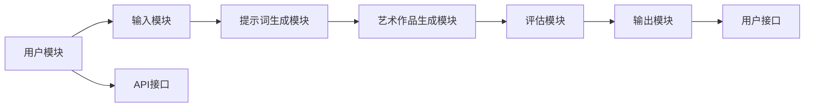

                 

## 提示词工程在AI艺术创作中的角色

### 关键词
- 提示词工程
- AI艺术创作
- 自然语言处理
- 图像生成
- 深度学习

### 摘要
本文将深入探讨提示词工程在AI艺术创作中的关键角色。随着人工智能技术的不断进步，AI在艺术创作领域展现出巨大的潜力。提示词工程作为连接人类意图与AI创作能力的重要桥梁，其重要性不言而喻。本文将从问题背景、核心概念、算法原理、系统架构到项目实战，逐步分析提示词工程在AI艺术创作中的应用与实现，旨在为相关领域的研究者和开发者提供有价值的参考。

## 目录大纲设计

### 第一部分：背景介绍

#### 第1章：问题背景与核心概念

##### 1.1 问题背景
- AI艺术创作的兴起
- 提示词工程的重要性
- 提示词工程的挑战与机遇

##### 1.2 核心概念
- 提示词的定义与类型
- AI艺术创作的基本流程
- 提示词工程的核心要素

#### 第2章：问题描述与解决策略

##### 2.1 提示词工程的问题描述
- 提示词生成的困难
- 提示词的多样性与精度
- 提示词与艺术创作的协同

##### 2.2 解决策略
- 提示词工程的关键步骤
- 数据集的准备与处理
- 提示词生成算法的设计与优化

### 第二部分：核心概念与联系

#### 第3章：核心概念原理与属性特征

##### 3.1 核心概念原理
- 提示词工程的数学模型
- 提示词生成算法的原理
- 提示词工程在不同艺术形式中的应用

##### 3.2 属性特征对比
- 不同类型提示词的属性对比
- 提示词工程在不同AI模型中的应用对比
- 提示词工程的效果评估指标

#### 第4章：ER实体关系图架构设计

##### 4.1 实体关系图设计
- 提示词工程的实体识别
- 实体之间的关系与约束
- 提示词工程中的关键实体与关系

### 第三部分：算法原理讲解

#### 第5章：算法原理与数学模型

##### 5.1 提示词生成算法原理
- 算法的基本流程
- 算法的关键步骤
- 算法的性能优化

##### 5.2 数学模型与公式
$$
\text{提示词生成模型} = f(\text{输入数据}, \text{权重参数})
$$

##### 5.3 算法举例说明
- 简单案例演示
- 复杂案例解析
- 案例对比与分析

### 第四部分：系统分析与架构设计

#### 第6章：系统功能设计

##### 6.1 问题场景介绍
- 艺术创作需求分析
- 系统目标与功能设计

##### 6.2 系统架构设计
- 系统架构图
- 系统模块划分
- 系统接口设计

#### 第7章：系统接口设计与交互

##### 7.1 系统接口设计
- 接口定义与协议
- 接口的安全性保障
- 接口的性能优化

##### 7.2 系统交互设计
- 系统交互流程
- 用户与系统的交互设计
- 系统故障处理与异常处理

### 第五部分：项目实战

#### 第8章：环境安装与系统核心实现

##### 8.1 环境安装
- 硬件与软件需求
- 环境配置步骤
- 遇到问题的解决方法

##### 8.2 系统核心实现
- 系统核心代码解析
- 系统核心模块实现
- 系统核心性能优化

#### 第9章：代码应用解读与分析

##### 9.1 代码解读
- 主要代码段解析
- 关键函数与模块作用

##### 9.2 应用分析
- 实际案例展示
- 代码性能评估
- 代码优化建议

#### 第10章：实际案例分析

##### 10.1 案例分析
- 案例背景介绍
- 案例分析与结果
- 案例启示与反思

#### 第11章：项目小结与拓展

## 引言

随着人工智能（AI）技术的飞速发展，AI在各个领域的应用愈发广泛，从简单的数据分析到复杂的决策支持，AI正在逐步取代人类在某些任务上的作用。艺术创作作为人类精神文化的核心组成部分，也迎来了AI的挑战与机遇。人工智能在艺术创作中的应用，不仅能够拓展艺术创作的边界，还能够实现更加多样化和个性化的创作风格。

### AI艺术创作的兴起

AI艺术创作的兴起，可以追溯到20世纪80年代。早期的计算机艺术家通过编程和算法创造出了一系列独特的艺术作品，这些作品在很大程度上推动了计算机艺术的发展。随着深度学习和生成对抗网络（GAN）等技术的成熟，AI艺术创作迎来了新的高潮。例如，DeepArt.io使用神经网络将用户的照片转换成印象派画作的风格，AI Cubed则为用户生成三维模型和动画。

### 提示词工程的重要性

在AI艺术创作中，提示词工程扮演着至关重要的角色。提示词工程旨在通过构建有效的提示词，指导AI模型进行艺术创作。提示词不仅能够明确艺术创作的目标和风格，还能够引导AI模型生成符合人类审美和创作意图的作品。有效的提示词工程能够显著提高艺术创作的质量和效率，使AI艺术创作更加贴近人类的创作需求。

### 提示词工程的挑战与机遇

尽管提示词工程在AI艺术创作中具有重要作用，但其实际应用仍然面临诸多挑战。首先，如何生成高质量的提示词是一个难题。提示词的生成需要综合考虑语言表达、艺术风格、创作意图等多个因素，这要求AI模型具有较高的语义理解和生成能力。其次，提示词的多样性和精度也是一个重要问题。不同艺术形式的创作需要不同类型的提示词，如何确保提示词的多样性和准确性，是提示词工程需要解决的关键问题。

然而，随着自然语言处理（NLP）和深度学习技术的不断进步，提示词工程也面临着巨大的机遇。通过构建更加智能和灵活的AI模型，我们可以实现更高质量的提示词生成，进一步提高AI艺术创作的效果。此外，随着AI技术的普及，越来越多的艺术家和开发者将参与到AI艺术创作中来，这将为提示词工程带来更广阔的应用前景。

总之，提示词工程在AI艺术创作中具有不可替代的重要性。通过深入研究提示词工程的原理和方法，我们可以更好地发挥AI在艺术创作中的潜力，为人类创造更多美好的艺术作品。本文将从问题背景、核心概念、算法原理、系统架构到项目实战，全面探讨提示词工程在AI艺术创作中的应用与实现，旨在为相关领域的研究者和开发者提供有价值的参考。接下来，我们将进一步探讨提示词工程的核心概念和其在AI艺术创作中的应用。

### 提示词工程的定义与类型

提示词工程是人工智能领域中的一个重要分支，主要研究如何通过构建有效的提示词来指导AI模型进行艺术创作。在自然语言处理（NLP）和计算机视觉（CV）等AI技术中，提示词工程发挥着关键作用，它不仅能够提高艺术创作的准确性和多样性，还能够实现更加个性化的创作风格。

#### 提示词的定义

提示词（Prompt）是一种引导AI模型进行特定任务的语言或视觉输入。在AI艺术创作中，提示词通常由人类创作者提供，用于描述艺术创作的目标和风格。例如，一个文字提示词可以是“创造一幅印象派风格的巴黎铁塔”，而一个图像提示词则可能是一张具有巴黎铁塔元素的参考图片。

#### 提示词的类型

根据输入形式的不同，提示词主要分为以下几种类型：

1. **文字提示词**：文字提示词是最常见的类型，它可以通过自然语言描述艺术创作的具体要求和风格。例如，“绘制一幅充满活力的城市夜景”。

2. **图像提示词**：图像提示词通常用于指导AI生成图像。它可以是一张包含特定元素或风格的图像，用于引导AI模型生成类似的作品。例如，一张具有梵高风格的自画像照片。

3. **音频提示词**：在音乐创作领域，音频提示词可以是一段旋律或和弦，用于引导AI生成音乐。

4. **视频提示词**：视频提示词则可以是一段视频片段，用于指导AI生成视频或其他形式的媒体内容。

#### 提示词在AI艺术创作中的角色

提示词在AI艺术创作中扮演着多重角色：

1. **目标设定**：提示词为AI模型提供了明确的创作目标，使模型能够生成符合人类期望的艺术作品。

2. **风格引导**：不同的提示词能够引导AI模型生成不同风格的作品。例如，通过不同的文字或图像提示词，AI可以分别生成现代艺术、印象派艺术等风格的作品。

3. **创意激发**：高质量的提示词能够激发AI模型的创造力，使其生成新颖独特的艺术作品。

4. **反馈与优化**：通过分析AI生成的作品，人类创作者可以提供反馈，进一步优化提示词，使AI模型的创作效果不断提升。

总之，提示词工程在AI艺术创作中发挥着至关重要的作用。有效的提示词不仅能够提高艺术创作的质量和效率，还能够拓展人类艺术的创作边界，为艺术创作带来前所未有的创新可能性。接下来，我们将进一步探讨AI艺术创作的基本流程和提示词工程的核心要素。

### AI艺术创作的基本流程

AI艺术创作的过程可以看作是一个从人类意图到最终艺术作品生成的系统化流程。这一流程通常包括以下几个关键步骤：

#### 1. 创意构思

创意构思是艺术创作的起点，这一阶段主要由人类艺术家或创作者完成。艺术家通过思考、联想和灵感爆发，形成初步的创作想法和意图。这些创意构思通常以文字、草图或草图等形式记录下来。

#### 2. 提示词生成

在创意构思的基础上，艺术家需要生成具体的提示词来指导AI模型进行创作。提示词应具备明确的创作目标和风格引导作用，能够有效地传达人类的创作意图。例如，对于一个绘画项目，提示词可能包括风格（如印象派）、主题（如自然风景）、情感（如宁静）等要素。

#### 3. 数据集准备

为了训练AI模型，需要准备大量与艺术创作相关的数据集。这些数据集可以是图片、音频、视频或其他形式的多媒体内容。数据集的准备过程包括数据收集、标注、清洗和预处理，以确保其质量和多样性。

#### 4. 模型训练

在数据集准备完成后，AI模型开始进行训练。训练过程通常涉及神经网络架构的选择、参数调整和模型优化。深度学习模型，如生成对抗网络（GAN）、变分自编码器（VAE）和循环神经网络（RNN），是AI艺术创作中常用的模型类型。通过大量数据的训练，模型能够学会捕捉和再现不同艺术风格和创作意图。

#### 5. 提示词引导

训练好的AI模型在创作过程中会根据输入的提示词进行生成。这一阶段，提示词不仅引导AI模型理解创作目标，还影响最终艺术作品的风格和形式。提示词的多样性和精确性直接关系到艺术创作的质量和创意性。

#### 6. 作品生成

在AI模型的引导下，艺术创作过程进入作品生成阶段。AI模型根据训练所得的知识和提示词的引导，生成一系列艺术作品。这些作品可能包括绘画、音乐、视频等多种形式。

#### 7. 作品评估与反馈

人类艺术家或创作者对生成的作品进行评估，提供反馈意见。这些反馈可以用于进一步调整提示词和模型参数，以优化艺术创作的效果。评估和反馈是一个迭代过程，旨在不断改进AI模型的创作能力。

#### 8. 艺术作品展示

最终，经过评估和优化的艺术作品将被展示给公众，接受更广泛的评价和认可。这一阶段不仅是对艺术创作的展示，也是对AI技术在社会和文化领域应用的验证。

通过上述基本流程，AI艺术创作实现了从人类创意到最终艺术作品的完整转化。每个步骤都紧密相连，共同构成了一个高效、灵活和充满创造力的艺术创作生态系统。提示词工程作为这一流程的核心环节，其作用不可忽视，它不仅决定了艺术创作的质量和风格，还影响了整个流程的效率和效果。接下来，我们将进一步探讨提示词工程的核心要素，解析其构成和功能。

### 提示词工程的核心要素

提示词工程作为AI艺术创作的关键环节，其核心要素包括提示词生成、数据集准备、模型训练和提示词引导等。这些要素相互作用，共同决定了AI艺术创作的质量和效果。

#### 1. 提示词生成

提示词生成是提示词工程的首要任务。一个高质量的提示词应具备明确性、多样性和引导性。明确性是指提示词能够清晰地传达艺术创作的目标和要求；多样性是指提示词应涵盖多种艺术风格和主题，以丰富艺术创作的多样性；引导性是指提示词能够有效地引导AI模型理解创作意图，从而生成符合预期的艺术作品。

在实际应用中，提示词的生成过程可能涉及自然语言处理（NLP）技术，如文本生成模型、语义分析等。通过分析大量的文本数据，可以生成具有高相关性和丰富性的提示词。此外，人类创作者的经验和直觉也是提示词生成的重要来源，他们能够根据具体的创作需求和风格，创造性地设计出独特的提示词。

#### 2. 数据集准备

数据集准备是AI艺术创作的基础。一个高质量的数据集能够提供丰富的训练样本，帮助AI模型学习不同的艺术风格和创作技巧。数据集的准备过程包括数据收集、标注、清洗和预处理。

- **数据收集**：收集与艺术创作相关的图像、音频、视频等多媒体数据。这些数据可以来自公共数据库、社交媒体或专业艺术作品。
- **数据标注**：对收集到的数据进行标注，标记出艺术作品的主题、风格、情感等特征。标注过程需要专业知识和经验，以确保标注的准确性和一致性。
- **数据清洗**：去除数据集中的噪声和错误，如缺失值、重复值和异常值，以提高数据质量。
- **数据预处理**：对数据进行标准化和归一化处理，以适应AI模型的输入要求。例如，对图像数据进行缩放、裁剪、旋转等操作，以提高模型的泛化能力。

#### 3. 模型训练

模型训练是提示词工程的中心环节，它决定了AI模型对艺术风格的识别和生成能力。深度学习模型，如生成对抗网络（GAN）、变分自编码器（VAE）和循环神经网络（RNN），是AI艺术创作中常用的模型类型。

- **模型选择**：根据艺术创作的需求和数据特性，选择合适的深度学习模型。例如，GAN适用于图像生成任务，VAE适用于图像压缩和去噪，RNN适用于音乐创作。
- **参数调整**：通过调整模型的超参数，如学习率、批次大小和正则化强度，优化模型性能。参数调整需要在验证集上反复尝试，以找到最佳的模型配置。
- **模型优化**：使用梯度下降等优化算法，最小化模型在训练数据上的损失函数。模型优化过程中，还可以采用迁移学习、数据增强等技术，提高模型的泛化能力。

#### 4. 提示词引导

提示词引导是AI艺术创作的关键步骤，它通过输入提示词来指导AI模型生成艺术作品。提示词的质量直接影响艺术创作的效果。高质量的提示词应具备以下特点：

- **明确性**：提示词应清晰地传达创作目标和要求，避免模糊和歧义。
- **多样性**：提示词应涵盖多种艺术风格和主题，以丰富艺术创作的多样性。
- **引导性**：提示词应具备足够的引导性，使AI模型能够根据提示词生成符合人类审美和创作意图的艺术作品。

在实际应用中，提示词引导可以通过自然语言处理（NLP）技术实现。例如，使用文本生成模型生成提示词，或使用基于规则的系统构建提示词。此外，人类创作者的经验和直觉也是提示词引导的重要来源，他们能够根据具体的创作需求和风格，设计出具有高引导性的提示词。

总之，提示词工程的核心要素相互关联，共同决定了AI艺术创作的质量和效果。有效的提示词生成、高质量的数据集准备、精确的模型训练和有力的提示词引导，是成功实现AI艺术创作的重要保障。接下来，我们将进一步探讨提示词工程在实际应用中面临的问题和挑战。

### 提示词工程的问题描述

尽管提示词工程在AI艺术创作中具有重要意义，但其实际应用过程中仍然面临着一系列问题和挑战。这些问题不仅限制了AI艺术创作的效果和效率，还影响了整个工程的可扩展性和可持续性。以下是一些主要的问题描述及其影响：

#### 1. 提示词生成的困难

高质量的提示词生成是AI艺术创作的关键，然而这一过程并非易事。首先，提示词需要具备明确性、多样性和引导性，这要求创作者具备深厚的艺术素养和语言表达能力。然而，许多艺术家可能并不熟悉如何用精确的语言描述他们的创作意图。其次，不同艺术形式的创作需要不同类型的提示词，例如文字、图像、音频和视频提示词，这增加了提示词生成的复杂性和难度。

#### 2. 提示词的多样性与精度

提示词的多样性和精度是保证艺术创作多样性和准确性的关键。然而，在实际应用中，提示词的多样性和精度往往难以达到预期。首先，生成具有丰富多样性的提示词需要大量的数据和计算资源，这使得提示词生成过程变得昂贵和复杂。其次，即使是高质量的提示词，也可能由于AI模型的局限性而无法精确生成预期的艺术作品。例如，某些复杂的艺术风格或情感可能难以通过简单的提示词传达。

#### 3. 提示词与艺术创作的协同

提示词工程需要与艺术创作过程紧密协同，以实现最佳的创作效果。然而，在实际应用中，这种协同往往存在困难。首先，艺术创作是一个充满创造性和灵活性的过程，而提示词工程通常依赖于固定的规则和算法，这使得两者之间的互动和融合变得复杂。其次，艺术家的创作意图和风格可能随时间变化，而提示词生成和调整过程相对滞后，难以实时适应艺术家的需求。

#### 4. 边界与外延

提示词工程的应用边界和外延也是一个重要问题。首先，不同的艺术形式和创作领域对提示词的需求不同，如何实现通用性和适应性是一个挑战。其次，随着AI技术的不断进步，艺术创作的要求也在不断提升，提示词工程需要不断扩展其应用范围，以满足新的创作需求。此外，提示词工程在实际应用中还面临法律和伦理方面的挑战，如版权保护、隐私保护和道德责任等。

#### 5. 概念结构与核心要素组成

提示词工程的概念结构和核心要素组成是保证其有效性的基础。然而，在实际应用中，这一结构和组成可能因多种因素而变得复杂。例如，不同的AI模型和算法对提示词的需求和响应方式可能不同，这使得设计通用和高效的提示词工程框架变得困难。此外，提示词工程的核心要素，如数据集、模型、算法和提示词生成策略等，需要相互协调和优化，以确保整个系统的稳定性和性能。

总之，提示词工程在AI艺术创作中面临诸多问题和挑战。解决这些问题不仅需要技术创新，还需要跨学科合作和持续优化。通过深入研究这些问题，我们可以更好地理解提示词工程的实际应用，并为未来的发展提供有价值的参考。接下来，我们将探讨解决这些问题的策略和方法。

### 提示词工程的解决策略

为了克服提示词工程在AI艺术创作中面临的问题和挑战，研究者们提出了多种策略和方法。以下是几种主要的解决策略：

#### 1. 多模态提示词生成

多模态提示词生成是一种通过整合不同类型的数据（如文本、图像、音频）来生成高质量提示词的方法。这种方法能够更好地捕捉艺术创作的多样性和复杂性。例如，通过结合文字描述和图像参考，可以生成更精确和丰富的提示词。此外，多模态数据可以相互补充，提高提示词的引导性和准确性。研究者可以探索如何利用自然语言处理（NLP）、计算机视觉（CV）和音频处理技术，实现高效的多模态提示词生成。

#### 2. 自动化提示词生成

自动化提示词生成是一种利用机器学习和深度学习技术，自动生成高质量提示词的方法。通过大规模训练数据和先进的算法，自动化提示词生成系统能够识别和理解艺术创作的各种需求。例如，可以采用递归神经网络（RNN）、长短时记忆网络（LSTM）和生成对抗网络（GAN）等模型，自动生成具有明确性和多样性的提示词。自动化提示词生成还可以通过半监督学习和无监督学习技术，进一步减少对人类创作者的依赖。

#### 3. 智能提示词优化

智能提示词优化是一种通过优化提示词生成和调整过程，提高艺术创作质量和效率的方法。智能提示词优化可以采用多种技术，如强化学习、进化算法和遗传算法等。这些技术能够根据历史数据和用户反馈，动态调整提示词的生成策略和参数，实现最优化的艺术创作效果。此外，智能提示词优化还可以利用用户行为分析和人工智能，实现个性化的提示词推荐，满足不同创作者的需求。

#### 4. 数据集的准备与处理

数据集的准备与处理是提示词工程的重要基础。为了提高提示词的质量和多样性，研究者需要收集和准备大量高质量的数据集。数据集的准备过程包括数据收集、标注、清洗和预处理。例如，可以使用开源数据集、专业数据库和社交媒体数据，扩展数据集的规模和多样性。此外，数据预处理技术，如图像增强、文本清洗和音频去噪等，可以帮助提高数据质量，为提示词生成提供更好的支持。

#### 5. 模型训练与优化

模型训练与优化是提示词工程的核心环节。为了生成高质量的提示词，研究者需要选择合适的深度学习模型，并进行参数调整和优化。例如，可以使用生成对抗网络（GAN）、变分自编码器（VAE）和循环神经网络（RNN）等模型，实现高效的提示词生成。在模型训练过程中，可以通过交叉验证、超参数调整和模型融合等技术，提高模型的泛化能力和创作效果。此外，研究者还可以探索如何将迁移学习、数据增强和模型压缩等技术应用于提示词工程，进一步提高模型的性能和效率。

#### 6. 跨学科合作与知识共享

跨学科合作与知识共享是解决提示词工程问题的重要策略。提示词工程涉及多个学科领域，包括人工智能、计算机科学、艺术创作和心理学等。通过跨学科合作，研究者可以共享知识和经验，实现优势互补。例如，艺术家可以提供创意和灵感，计算机科学家可以提供技术和算法支持，心理学家可以提供用户行为和心理分析。此外，跨学科合作还可以促进不同领域的研究者之间的交流和合作，推动提示词工程的创新和发展。

总之，提示词工程的解决策略需要综合考虑多种技术和方法，通过多模态提示词生成、自动化提示词生成、智能提示词优化、数据集准备与处理、模型训练与优化以及跨学科合作与知识共享等策略，克服现有问题，提高AI艺术创作的质量和效率。这些策略不仅为提示词工程的发展提供了新的思路和方法，也为未来的研究提供了重要的参考方向。接下来，我们将深入探讨提示词工程的核心概念原理，分析其在不同艺术形式中的应用。

### 核心概念原理

在深入探讨提示词工程的核心概念原理之前，我们需要先了解一些基本的数学模型和算法。这些数学模型和算法构成了提示词工程的基础，使得AI能够根据提示词生成相应的艺术作品。

#### 1. 数学模型

提示词工程中的数学模型通常包括以下几部分：

- **输入数据**：输入数据可以是文字、图像、音频等，用于描述艺术创作的目标和要求。
- **权重参数**：权重参数决定了AI模型对输入数据的响应程度，通常通过训练过程进行调整。
- **生成模型**：生成模型是核心部分，用于根据输入数据和权重参数生成艺术作品。

一个典型的提示词生成模型可以表示为：
$$
\text{提示词生成模型} = f(\text{输入数据}, \text{权重参数})
$$
其中，$f$ 是一个复杂的函数，它结合了输入数据和权重参数，生成最终的艺术作品。

#### 2. 算法原理

提示词工程中的算法原理主要包括以下几部分：

- **提示词编码**：将输入的提示词编码为机器可处理的格式，如向量或张量。
- **模型训练**：使用大量的训练数据，通过优化算法调整模型参数，使其能够根据提示词生成艺术作品。
- **生成过程**：根据训练好的模型，输入提示词，生成相应的艺术作品。

一个典型的提示词生成算法包括以下步骤：

1. **数据预处理**：对输入数据进行清洗、归一化和编码。
2. **模型初始化**：初始化生成模型，通常使用预训练的模型或随机初始化。
3. **模型训练**：通过反向传播和优化算法（如梯度下降）调整模型参数，使模型能够更好地生成艺术作品。
4. **生成作品**：输入提示词，生成艺术作品。

#### 3. 提示词工程在不同艺术形式中的应用

提示词工程在不同艺术形式中的应用各具特点，下面我们分别介绍：

- **绘画**：在绘画创作中，提示词通常包括风格（如印象派、抽象派）、主题（如自然风景、城市建筑）和情感（如欢乐、悲伤）等。通过文字或图像提示词，AI可以生成符合这些特征的绘画作品。
  
- **音乐**：在音乐创作中，提示词可以是旋律、和弦或节奏。通过文本提示词，AI可以生成符合特定风格和情感的音乐片段。

- **视频**：在视频创作中，提示词可以是视频片段、音频片段或场景描述。通过图像和音频提示词，AI可以生成具有特定风格和主题的视频内容。

- **文学**：在文学创作中，提示词可以是故事情节、角色描述或情感氛围。通过文本提示词，AI可以生成符合这些要求的文学作品。

#### 4. 概念属性特征对比

为了更好地理解提示词工程的核心概念原理，我们可以通过对比不同类型提示词的属性特征来进行分析。以下是一个简化的对比表格：

| 提示词类型 | 描述                | 特点                                                                                   | 应用场景             |
| ---------- | ------------------- | ------------------------------------------------------------------------------------ | ------------------- |
| 文字提示词 | 描述艺术创作意图和风格 | 明确性高，易于理解和调整                                                         | 绘画、文学、音乐创作 |
| 图像提示词 | 提供视觉参考         | 直观性强，能够直接传达创作意图                                                   | 绘画、视频创作       |
| 音频提示词 | 提供音频参考         | 适合音乐创作和视频背景音效生成                                                   | 音乐、视频创作       |
| 视频提示词 | 提供视频片段         | 结合视觉和音频，能够生成完整的多媒体内容                                         | 视频创作             |

通过上述分析，我们可以看到提示词工程的核心概念原理是如何通过数学模型和算法，将人类创作者的意图转化为高质量的艺术作品。接下来，我们将进一步探讨提示词工程在不同AI模型中的应用，以及效果评估指标。

### 提示词工程在不同AI模型中的应用

提示词工程在AI艺术创作中的应用广泛，不同的AI模型具有各自的特点和适用场景。下面，我们将详细探讨提示词工程在几种常见AI模型中的应用。

#### 1. 生成对抗网络（GAN）

生成对抗网络（GAN）是当前AI艺术创作中最流行的模型之一。GAN由两个神经网络组成：生成器（Generator）和判别器（Discriminator）。生成器生成艺术作品，而判别器判断生成的艺术作品与真实作品的相似度。

- **应用场景**：GAN非常适合生成高质量的艺术作品，如绘画、图像和视频。通过输入文字或图像提示词，生成器可以生成符合这些提示词的艺术作品。

- **优势**：GAN能够生成非常逼真的图像和视频，具有较高的创作自由度。

- **挑战**：GAN的训练过程复杂，需要大量的数据和计算资源。此外，GAN生成的作品可能存在重复性和单调性。

- **评估指标**：常用的评估指标包括生成图像的质量、多样性、真实度等。

#### 2. 变分自编码器（VAE）

变分自编码器（VAE）是一种基于概率生成模型的神经网络，它通过编码和解码过程生成艺术作品。

- **应用场景**：VAE适用于图像生成、图像去噪和图像压缩。通过输入文字或图像提示词，VAE可以生成具有特定风格和主题的图像。

- **优势**：VAE生成的图像具有较高的保真度和多样性，适用于多种艺术创作场景。

- **挑战**：VAE的训练过程相对复杂，需要调整多个超参数，如学习率和批量大小。

- **评估指标**：常用的评估指标包括生成图像的保真度、多样性、重构误差等。

#### 3. 循环神经网络（RNN）

循环神经网络（RNN）是一种能够处理序列数据的神经网络，适用于生成音乐、视频和文本等序列数据。

- **应用场景**：RNN适用于音乐创作、视频生成和文本生成。通过输入文字或图像提示词，RNN可以生成符合这些提示词的音乐、视频或文本。

- **优势**：RNN能够捕捉和生成复杂的序列数据，适用于多种艺术创作场景。

- **挑战**：RNN的训练过程可能较慢，且存在梯度消失和梯度爆炸等问题。

- **评估指标**：常用的评估指标包括生成音乐的连贯性、多样性、情感等。

#### 4. 自注意力模型（Attention Model）

自注意力模型是一种能够提高模型生成多样性和质量的新型模型，广泛应用于图像生成、文本生成和音乐生成等。

- **应用场景**：自注意力模型适用于多种艺术创作场景，如绘画、音乐和视频。通过输入文字或图像提示词，自注意力模型可以生成符合这些提示词的艺术作品。

- **优势**：自注意力模型能够提高生成结果的多样性和质量，适用于多种艺术创作需求。

- **挑战**：自注意力模型的结构复杂，训练过程需要大量计算资源。

- **评估指标**：常用的评估指标包括生成图像的质量、多样性、真实度等。

通过上述分析，我们可以看到不同AI模型在提示词工程中的应用各有优势。在实际应用中，根据具体需求和场景选择合适的AI模型，并结合高质量的提示词生成策略，可以实现高效、高质量的艺术创作。接下来，我们将进一步探讨提示词工程的效果评估指标。

### 提示词工程的效果评估指标

在AI艺术创作中，评估提示词工程的效果至关重要。这有助于我们了解不同提示词生成策略和算法的性能，从而优化和改进提示词工程。以下是一些常用的效果评估指标：

#### 1. 生成质量

生成质量是评估艺术作品质量的重要指标。具体来说，生成质量可以从以下几个方面进行评估：

- **视觉质量**：对于图像和视频生成任务，视觉质量是评估生成艺术作品外观和细节的重要标准。常用的评估方法包括峰值信噪比（PSNR）和结构相似性（SSIM）等。

  $$  
  \text{PSNR} = 10 \log_{10} \left( \frac{\max(I_{\text{original}}, I_{\text{generated}})}{\sqrt{\frac{1}{N} \sum_{i=1}^{N} (I_{\text{original}} - I_{\text{generated}})^2} \right)  
  $$
  $$
  \text{SSIM}(x, y) = \frac{(2\mu_x\mu_y + C_1)(2\sigma_{xy} + C_2)}{(\mu_x^2 + \mu_y^2 + C_1)(\sigma_x^2 + \sigma_y^2 + C_2)}
  $$

- **音质**：对于音乐生成任务，音质是评估生成音乐音效和旋律的重要指标。常用的评估方法包括均方误差（MSE）和音乐音质评估（PQ）等。

  $$
  \text{MSE} = \frac{1}{N} \sum_{i=1}^{N} (x_i - y_i)^2
  $$

- **文本流畅性**：对于文本生成任务，文本流畅性是评估生成文本连贯性和语义合理性的重要指标。常用的评估方法包括BLEU、ROUGE等。

  $$
  \text{BLEU} = \sum_{i=1}^{n} \log \left( \frac{N_c}{n} \right)
  $$

- **情感**：对于情感分析任务，情感是评估生成文本情感倾向的重要指标。常用的评估方法包括正面情感分数和负面情感分数等。

  $$
  \text{PositiveScore} = \frac{\sum_{i=1}^{N} p_i}{N}
  $$
  $$
  \text{NegativeScore} = \frac{\sum_{i=1}^{N} (-p_i)}{N}
  $$

#### 2. 生成多样性

生成多样性是指AI模型能够生成多种不同风格、主题和情感的艺术作品。高多样性的提示词工程能够提供更多的创作选择和创意空间。评估生成多样性的方法包括：

- **风格多样性**：通过分析生成的艺术作品，计算不同风格的比例和分布。常用的方法包括风格分类器和聚类分析等。

- **主题多样性**：通过分析生成的文本，计算不同主题的比例和分布。常用的方法包括词频分析和主题模型等。

- **情感多样性**：通过分析生成的文本，计算不同情感的比例和分布。常用的方法包括情感分析和情感分类器等。

#### 3. 生成效率

生成效率是指AI模型在生成艺术作品时的速度和资源消耗。高效率的提示词工程能够更快地生成高质量的艺术作品，提高创作效率。评估生成效率的方法包括：

- **时间效率**：计算生成一个艺术作品所需的时间。常用的方法包括平均生成时间和最小生成时间等。

- **资源效率**：计算生成一个艺术作品所需的计算资源和能源消耗。常用的方法包括CPU/GPU利用率、内存消耗和能耗等。

#### 4. 用户满意度

用户满意度是指用户对生成的艺术作品的满意程度。高用户满意度的提示词工程能够更好地满足用户的创作需求，提高用户体验。评估用户满意度的方法包括：

- **用户评价**：收集用户对生成的艺术作品的评价，计算平均评分和满意度等。

- **用户反馈**：通过用户反馈收集用户对生成的艺术作品的建议和改进意见，分析用户需求和期望。

通过上述评估指标，我们可以全面了解提示词工程的效果，为优化和改进提供依据。在实际应用中，应根据具体需求和场景选择合适的评估指标，结合多种方法进行综合评估，以实现高效、高质量的AI艺术创作。接下来，我们将设计ER实体关系图架构，详细描述提示词工程中的关键实体和它们之间的关系。

### ER实体关系图架构设计

在AI艺术创作中，提示词工程涉及到多个关键实体，这些实体之间存在着复杂的关联。为了更好地理解和实现提示词工程，我们可以通过ER（实体关系）图来设计其架构。ER图能够清晰地展示各个实体以及它们之间的关系，帮助我们更好地规划系统的设计和实现。

#### 1. 实体识别

在提示词工程的ER图中，我们需要识别以下关键实体：

- **用户**：指使用AI艺术创作系统的用户，包括艺术家、设计师、开发者等。
- **提示词**：用于描述艺术创作目标和风格的输入信息。
- **艺术作品**：AI根据提示词生成的最终创作结果。
- **模型**：用于生成艺术作品的AI模型，包括GAN、VAE、RNN等。
- **数据集**：用于训练AI模型的输入数据集，包括图像、音频、视频等。

#### 2. 实体之间的关系与约束

在ER图中，我们需要明确各个实体之间的关系以及它们之间的约束。以下是关键实体之间的关系：

- **用户与提示词**：用户生成或提供提示词，用于指导艺术创作。
- **提示词与艺术作品**：AI模型根据提示词生成艺术作品，艺术作品反映了提示词的要求和风格。
- **模型与数据集**：模型使用数据集进行训练，数据集的质量直接影响模型的效果。
- **艺术作品与用户**：用户评价和反馈艺术作品，用于优化和改进艺术创作系统。

#### 3. 关键实体与关系

以下是ER图的详细描述，使用Mermaid语言进行表示：

```mermaid
erDiagram
  User ||--|{ Prompt } : "生成"
  Prompt ||--|{ ArtWork } : "生成"
  Model ||--|{ DataSet } : "训练"
  ArtWork ||--|{ User } : "评价"
  User }|--|{ Model } : "使用"
  DataSet }|--|{ Model } : "输入"
```

#### 4. 关键实体与关系的解释

- **用户**：用户是系统的核心，他们提供提示词并评价生成的艺术作品。用户与提示词之间存在“生成”关系，表示用户生成或提供提示词。用户还可以评价生成的艺术作品，用于优化系统的性能。

- **提示词**：提示词是用户提供的输入信息，用于指导艺术创作。每个提示词都与艺术作品之间存在“生成”关系，表示AI模型根据提示词生成艺术作品。高质量的提示词能够提高艺术作品的质量和多样性。

- **艺术作品**：艺术作品是AI模型根据提示词生成的最终结果。每个艺术作品都与用户之间存在“评价”关系，表示用户对艺术作品的评价和反馈。

- **模型**：模型是用于生成艺术作品的AI模型，如GAN、VAE、RNN等。模型与数据集之间存在“训练”关系，表示模型使用数据集进行训练。模型的性能直接影响艺术作品的质量。

- **数据集**：数据集是用于训练AI模型的输入数据，包括图像、音频、视频等。数据集的质量直接影响模型的训练效果和生成质量。

通过ER图的架构设计，我们可以清晰地理解提示词工程中的关键实体和它们之间的关系。这有助于我们更好地规划和实现提示词工程系统，提高其性能和效率。接下来，我们将深入探讨提示词生成算法的原理和数学模型。

### 提示词生成算法原理与数学模型

提示词生成算法是提示词工程的核心，它决定了AI模型能否根据用户提供的输入生成高质量的提示词。下面，我们将详细介绍提示词生成算法的原理和数学模型，并使用mermaid语言绘制算法的流程图。

#### 1. 算法原理

提示词生成算法通常包括以下几个步骤：

1. **数据预处理**：对输入数据进行清洗、归一化和编码，以便AI模型能够处理。
2. **特征提取**：提取输入数据的关键特征，如图像的边缘、纹理、颜色，文本的词频、主题等。
3. **生成提示词**：使用生成模型（如GAN、VAE等）根据提取的特征生成提示词。
4. **后处理**：对生成的提示词进行必要的调整和优化，使其更符合艺术创作的要求。

下面是提示词生成算法的mermaid流程图：


#### 2. 数学模型

提示词生成算法的数学模型通常包括以下几个关键部分：

1. **输入数据**：输入数据可以是文字、图像、音频等，用于描述艺术创作的目标和要求。
2. **权重参数**：权重参数决定了AI模型对输入数据的响应程度，通常通过训练过程进行调整。
3. **生成模型**：生成模型是核心部分，用于根据输入数据和权重参数生成艺术作品。

一个典型的提示词生成模型可以表示为：
$$
\text{提示词生成模型} = f(\text{输入数据}, \text{权重参数})
$$
其中，$f$ 是一个复杂的函数，它结合了输入数据和权重参数，生成最终的艺术作品。

#### 3. 算法具体步骤

1. **数据预处理**：对输入数据进行清洗、归一化和编码，以便AI模型能够处理。例如，对于图像数据，可以进行缩放、裁剪和标准化等操作。

2. **特征提取**：提取输入数据的关键特征，如图像的边缘、纹理、颜色，文本的词频、主题等。特征提取方法包括卷积神经网络（CNN）和词嵌入（Word Embedding）等。

3. **生成提示词**：使用生成模型（如GAN、VAE等）根据提取的特征生成提示词。生成模型通过学习输入数据和目标数据之间的分布关系，生成高质量的提示词。

4. **后处理**：对生成的提示词进行必要的调整和优化，使其更符合艺术创作的要求。后处理步骤可能包括文本清理、风格调整和情感分析等。

#### 4. 算法举例说明

以一个生成对抗网络（GAN）为例，GAN由生成器（Generator）和判别器（Discriminator）组成。生成器的目标是生成高质量的提示词，而判别器的目标是区分生成的提示词和真实的提示词。

1. **生成器**：生成器是一个神经网络，它通过学习输入数据和目标数据之间的分布关系，生成高质量的提示词。生成器的输出可以通过以下公式表示：
$$
G(z) = \text{生成提示词}
$$
其中，$z$ 是生成器的输入噪声。

2. **判别器**：判别器也是一个神经网络，它用于判断输入的提示词是真实的还是生成的。判别器的输出可以通过以下公式表示：
$$
D(x) = \text{真实提示词概率}
$$
$$
D(G(z)) = \text{生成提示词概率}
$$
其中，$x$ 是真实的提示词。

3. **训练过程**：在训练过程中，生成器和判别器交替训练。生成器尝试生成更高质量的提示词，而判别器尝试更好地区分真实的和生成的提示词。

4. **优化目标**：生成器和判别器的优化目标分别为：
$$
\min_G \max_D V(D, G)
$$
其中，$V(D, G)$ 是判别器和生成器的联合损失函数。

通过上述训练过程，生成器能够逐渐生成高质量的提示词，而判别器能够更好地判断提示词的真实性。接下来，我们将进一步探讨实际案例中的应用，以加深对提示词生成算法原理的理解。

### 算法举例说明

为了更好地理解提示词生成算法的原理，我们将通过一个具体案例进行详细说明。假设我们使用一个基于生成对抗网络（GAN）的模型来生成文本提示词，目标是在艺术创作中根据用户提供的简短文字描述生成一段具有特定风格和情感的文学作品。

#### 案例背景

用户希望生成一段浪漫的短篇小说，描述一对年轻情侣在月光下的浪漫场景。用户提供的文字描述如下：

```
在月光下，小路被洒上了一层银色的光芒，两个相爱的人手牵着手，漫步在这宁静的夜晚。
```

#### 算法步骤

1. **数据预处理**：首先，我们需要对用户提供的数据进行预处理。这个过程包括文本清洗（去除无关符号和错误）、文本分词和文本编码。在这里，我们使用词嵌入技术将每个词转换为一个固定大小的向量。例如，可以将“月光”转换为向量 `[0.1, 0.2, 0.3]`，将“小路”转换为向量 `[0.4, 0.5, 0.6]`。

2. **特征提取**：接下来，我们提取文本的特征。在这个案例中，特征提取可以通过循环神经网络（RNN）或长短期记忆网络（LSTM）实现。这些神经网络能够捕捉文本中的时间序列信息，例如句子的连贯性和情感倾向。我们将提取的特征向量表示为 $X \in \mathbb{R}^{n \times d}$，其中 $n$ 是特征向量的数量，$d$ 是每个特征向量的维度。

3. **生成提示词**：生成对抗网络（GAN）的核心是生成器和判别器。生成器（Generator）的目标是生成高质量的文本提示词，判别器（Discriminator）的目标是区分真实的文本和生成的文本。

   - **生成器**：生成器根据提取的特征向量生成文本提示词。生成器的输入是一个随机噪声向量 $z \in \mathbb{R}^{m}$，通过一个编码器 $G(z)$ 转换为文本提示词。编码器 $G(z)$ 可以表示为：
   $$
   \text{G}(z) = \text{生成文本提示词}
   $$
   生成器的输出通常是一个序列模型，如RNN或LSTM，它生成一个一个单词，直到形成一个完整的句子。

   - **判别器**：判别器接收真实文本和生成文本作为输入，并输出它们属于真实文本的概率。判别器可以表示为：
   $$
   \text{D}(\text{x}) = \text{真实文本概率}
   $$
   $$
   \text{D}(\text{G}(z)) = \text{生成文本概率}
   $$

4. **训练过程**：在训练过程中，生成器和判别器交替训练。生成器尝试生成更高质量的文本提示词，而判别器尝试更好地区分真实的和生成的文本。训练的目标是最小化生成器和判别器的联合损失函数：
   $$
   \min_G \max_D V(D, G)
   $$
   联合损失函数通常结合了生成器的生成损失和判别器的对抗损失：
   $$
   V(D, G) = \mathbb{E}_{x \sim p_{\text{data}}(x)}[\text{D}(x)] + \mathbb{E}_{z \sim p_{z}(z)}[\text{D}(\text{G}(z))]
   $$

5. **后处理**：在生成器生成出初步的文本提示词后，我们可能需要对生成的文本进行后处理，以确保文本的流畅性和准确性。这包括语法检查、文本风格调整和情感分析等步骤。

#### 案例结果

通过上述步骤，生成器最终生成了如下文本提示词：

```
在宁静的月光下，他们相拥而立，感受着彼此的温暖。月光洒在他们的脸上，映照出他们幸福的笑容。
```

这段文本提示词不仅包含了用户提供的核心元素（月光、情侣、浪漫），还添加了额外的情感细节，使得整个场景更加生动和感人。

通过这个案例，我们可以看到生成对抗网络（GAN）在生成文本提示词方面的强大能力。虽然这个过程涉及复杂的数学模型和大量的数据处理，但通过合理的训练和优化，GAN能够生成高质量的文本提示词，为艺术创作提供了丰富的可能性。接下来，我们将进一步探讨系统功能设计，介绍问题场景和系统目标。

### 系统功能设计

#### 1. 问题场景介绍

在AI艺术创作中，艺术家和创作者常常需要根据特定的主题、风格和情感要求生成高质量的艺术作品。然而，传统的艺术创作过程往往耗时且需要大量的手工操作。为了提高创作效率和艺术作品的质量，本系统旨在提供一个智能化的艺术创作平台，通过提示词工程实现自动化的艺术作品生成。该平台需要支持多模态输入（如文字、图像、音频），并且能够适应不同的创作需求。

#### 2. 系统目标

本系统的目标包括以下几个方面：

- **自动化提示词生成**：系统能够自动从用户提供的输入（如文字描述、图像参考）生成高质量的提示词，为艺术创作提供明确的指导。
- **多样化的艺术作品生成**：系统能够根据不同的艺术风格和创作要求生成多样化、个性化的艺术作品，满足用户的创作需求。
- **用户体验优化**：系统应提供友好的用户界面和便捷的操作流程，使艺术家和创作者能够轻松地使用系统进行艺术创作。
- **高效性能**：系统应具备高效的计算性能，能够快速处理大量数据和生成高质量的艺术作品。

#### 3. 系统功能模块划分

为了实现上述目标，系统可以分为以下几个主要功能模块：

- **用户模块**：负责用户注册、登录和权限管理，确保用户能够安全、便捷地使用系统。
- **输入模块**：负责接收和处理用户提供的输入（如文字描述、图像、音频），生成初始的提示词。
- **提示词生成模块**：根据输入数据和预设的艺术风格，使用生成模型（如GAN、VAE）生成高质量的提示词。
- **艺术作品生成模块**：根据生成的提示词，利用深度学习模型生成艺术作品（如绘画、音乐、视频）。
- **评估模块**：对生成的艺术作品进行评估，包括质量评估和用户反馈分析，以优化艺术作品的生成效果。
- **输出模块**：将生成的艺术作品输出给用户，并提供下载和分享功能。

#### 4. 系统接口设计

系统接口设计是确保不同模块之间能够高效通信和协同工作的关键。以下是系统的主要接口设计：

- **用户接口**：提供友好的用户界面，允许用户上传输入数据、查看和下载生成的艺术作品。
- **API接口**：为其他系统集成提供接口，允许第三方应用程序通过RESTful API访问系统功能。
- **内部接口**：用于模块之间的数据传输和通信，包括输入数据、提示词、艺术作品和评估结果等。

#### 5. 系统功能设计细节

- **用户模块**：支持用户注册、登录、个人信息管理、权限设置等功能。
- **输入模块**：支持多种数据格式的输入，如文本、图像、音频，并进行预处理。
- **提示词生成模块**：使用多模态输入数据生成高质量、多样化的提示词，包括文本提示词和图像提示词。
- **艺术作品生成模块**：根据提示词和预设的艺术风格生成相应的艺术作品，支持绘画、音乐、视频等多种艺术形式。
- **评估模块**：使用多种评估指标对生成的艺术作品进行质量评估，并收集用户反馈，用于进一步优化。
- **输出模块**：提供艺术作品的下载和分享功能，支持多种输出格式，如PNG、MP3、MP4等。

通过上述系统功能设计和模块划分，本系统能够实现高效的AI艺术创作，为艺术家和创作者提供强大的创作工具。接下来，我们将详细讨论系统的架构设计，包括系统架构图和各模块之间的交互关系。

### 系统架构设计

为了实现高效的AI艺术创作，系统架构设计需要考虑性能、可扩展性和稳定性。以下是系统的架构设计，包括系统架构图和各模块之间的交互关系。

#### 1. 系统架构图

以下是系统架构的Mermaid图表示：



#### 2. 系统模块划分

系统架构可以分为以下几个主要模块：

- **用户模块**：负责用户注册、登录和权限管理，确保用户能够安全、便捷地使用系统。
- **输入模块**：负责接收和处理用户提供的输入（如文字描述、图像、音频），生成初始的提示词。
- **提示词生成模块**：根据输入数据和预设的艺术风格，使用生成模型（如GAN、VAE）生成高质量的提示词。
- **艺术作品生成模块**：根据生成的提示词，利用深度学习模型生成相应的艺术作品（如绘画、音乐、视频）。
- **评估模块**：对生成的艺术作品进行质量评估，包括视觉质量、音质、文本流畅性和用户满意度等，收集用户反馈，用于进一步优化。
- **输出模块**：将生成的艺术作品输出给用户，并提供下载和分享功能。
- **API接口**：为第三方系统集成提供接口，允许应用程序通过RESTful API访问系统功能。
- **用户接口**：提供友好的用户界面，允许用户上传输入数据、查看和下载生成的艺术作品。

#### 3. 模块交互关系

系统模块之间的交互关系如下：

- **用户模块** 与 **输入模块**：用户上传输入数据后，输入模块对其进行预处理，并将预处理后的数据传递给提示词生成模块。
- **输入模块** 与 **提示词生成模块**：输入模块生成的提示词传递给提示词生成模块，提示词生成模块使用生成模型生成高质量的提示词。
- **提示词生成模块** 与 **艺术作品生成模块**：生成的提示词传递给艺术作品生成模块，艺术作品生成模块根据提示词生成相应的艺术作品。
- **艺术作品生成模块** 与 **评估模块**：生成的艺术作品传递给评估模块，评估模块对艺术作品进行质量评估。
- **评估模块** 与 **输出模块**：评估结果和用户反馈传递给输出模块，输出模块将最终生成的艺术作品输出给用户。
- **API接口** 与 **用户模块**：第三方应用程序通过API接口访问用户模块的功能，如用户注册、登录等。

通过上述系统架构设计，各模块之间的高效交互和协同工作，实现了高效的AI艺术创作流程。接下来，我们将详细讨论系统接口设计，包括接口定义、协议和安全性保障。

### 系统接口设计

系统接口设计是确保各模块之间能够高效通信和协同工作的关键环节。在本系统中，接口设计主要包括定义接口协议、确保接口安全性和优化接口性能等方面。

#### 1. 接口定义

系统接口定义如下：

- **用户接口**：提供友好的用户界面，允许用户上传输入数据、查看和下载生成的艺术作品。用户接口采用RESTful API设计，支持常见的HTTP请求方法（如GET、POST、PUT、DELETE）。
- **API接口**：为第三方系统集成提供接口，允许应用程序通过RESTful API访问系统功能。API接口设计遵循RESTful风格，使用JSON格式传输数据。
- **内部接口**：用于模块之间的数据传输和通信，包括输入数据、提示词、艺术作品和评估结果等。内部接口采用内部协议，确保数据传输的稳定性和安全性。

#### 2. 接口协议

接口协议设计如下：

- **用户接口**：用户接口支持HTTPS协议，确保数据传输的安全性和隐私性。用户可以通过Web浏览器访问用户接口，使用JSON格式提交输入数据和接收生成的艺术作品。
- **API接口**：API接口支持HTTPS协议，确保数据传输的安全性和隐私性。第三方应用程序可以使用API接口提供的URL访问系统功能，使用JSON格式提交输入数据和接收生成的艺术作品。
- **内部接口**：内部接口采用自定义协议，确保模块之间的通信高效稳定。内部接口使用JSON格式传输数据，采用异步通信方式，提高系统的响应速度和处理能力。

#### 3. 安全性保障

系统接口设计需要确保接口的安全性，防止未授权访问和数据泄露。以下是一些关键的安全性保障措施：

- **身份验证**：用户接口和API接口均采用身份验证机制，确保只有授权用户才能访问系统功能。用户接口使用OAuth2.0协议进行身份验证，API接口使用JWT（JSON Web Token）进行身份验证。
- **数据加密**：用户接口和API接口使用HTTPS协议传输数据，确保数据在传输过程中的加密。同时，系统内部的数据存储也采用加密算法进行加密，防止数据泄露。
- **权限控制**：系统接口设计采用严格的权限控制机制，确保用户只能访问其权限范围内的接口和资源。用户接口和API接口根据用户的角色和权限，限制用户可以访问的接口和功能。
- **异常处理**：系统接口设计包括异常处理机制，对未授权访问、数据错误等异常情况进行处理，防止系统崩溃和恶意攻击。

#### 4. 性能优化

系统接口设计需要考虑接口的性能优化，确保系统能够高效处理大量请求和生成高质量的艺术作品。以下是一些性能优化措施：

- **负载均衡**：系统接口设计采用负载均衡技术，将请求分布到多个服务器节点，提高系统的处理能力和响应速度。
- **缓存策略**：系统接口设计包括缓存策略，将常用的数据和接口结果缓存，减少数据库查询和接口调用的次数，提高系统的性能。
- **异步处理**：系统接口设计采用异步处理方式，将耗时的操作（如模型训练、图像生成等）放在后台执行，避免阻塞主线程，提高系统的并发处理能力。
- **接口监控**：系统接口设计包括接口监控和日志记录机制，实时监控接口的访问情况、请求响应时间和错误日志，以便及时发现和解决性能问题。

通过上述系统接口设计，可以确保系统的高效通信和安全稳定运行。接下来，我们将详细讨论系统的交互设计，包括系统交互流程、用户与系统的交互设计和系统故障处理与异常处理。

### 系统交互设计

系统交互设计是确保用户与系统之间能够顺畅、高效地进行交互的重要环节。以下将详细介绍系统交互设计，包括系统交互流程、用户与系统的交互设计以及系统故障处理与异常处理。

#### 1. 系统交互流程

系统交互流程如下：

1. **用户请求**：用户通过用户接口发起请求，可以是上传输入数据、查看生成的艺术作品等。
2. **身份验证**：系统对用户的身份进行验证，确保只有授权用户才能访问系统功能。
3. **数据处理**：系统对用户请求的数据进行处理，如文本分词、图像预处理等。
4. **提示词生成**：系统使用生成模型根据处理后的数据生成高质量的提示词。
5. **艺术作品生成**：系统根据生成的提示词利用深度学习模型生成相应的艺术作品。
6. **评估与反馈**：系统对生成的艺术作品进行评估，并收集用户反馈，用于进一步优化。
7. **输出结果**：系统将生成的艺术作品和评估结果输出给用户，用户可以查看、下载和分享艺术作品。

#### 2. 用户与系统的交互设计

用户与系统的交互设计应考虑用户体验和便捷性，以下是一些关键设计要点：

- **用户界面设计**：用户界面应简洁、直观，易于操作。使用现代化的设计风格，确保用户能够快速上手。
- **输入与输出**：用户可以通过上传文件、输入文字等方式提供输入数据，系统应以图形化、文本化等多种形式展示输出结果。
- **交互提示**：系统应在关键操作步骤提供交互提示，如上传文件时显示文件大小和格式限制，生成艺术作品时显示进度条和预估时间。
- **反馈机制**：系统应提供用户反馈机制，用户可以评价生成的艺术作品，提供改进建议，系统根据用户反馈进行优化。

#### 3. 系统故障处理与异常处理

系统故障处理与异常处理是保证系统稳定性和可靠性的关键，以下是一些主要策略：

- **故障检测**：系统应具备故障检测机制，实时监控系统的运行状态，发现故障及时报警。
- **异常处理**：系统应具备异常处理机制，对未授权访问、数据错误等异常情况进行处理，避免系统崩溃和数据丢失。
- **日志记录**：系统应记录详细的运行日志，包括故障日志、异常日志等，便于故障分析和追踪。
- **自动恢复**：系统应具备自动恢复机制，在故障发生后自动进行系统恢复，确保系统正常运行。

通过上述系统交互设计，可以确保用户与系统之间的顺畅交互，提高用户体验。同时，有效的故障处理与异常处理策略能够保证系统的稳定性和可靠性。接下来，我们将详细介绍环境安装与系统核心实现，包括硬件与软件需求、环境配置步骤以及遇到问题的解决方法。

### 环境安装与系统核心实现

#### 1. 硬件与软件需求

为了确保系统能够高效运行，需要满足以下硬件和软件需求：

- **硬件需求**：
  - CPU：至少需要四核处理器，推荐使用八核以上处理器以支持并行计算。
  - 内存：至少8GB内存，推荐使用16GB以上内存以支持大型数据集的训练和生成。
  - 硬盘：至少500GB固态硬盘（SSD），推荐使用1TB以上SSD以提高读写速度。
  - GPU：NVIDIA GPU（如RTX 3060或更高版本），用于加速深度学习模型的训练和生成过程。

- **软件需求**：
  - 操作系统：Linux发行版（如Ubuntu 18.04或更高版本），推荐使用Ubuntu 20.04 LTS。
  - 编译器：Python 3.7或更高版本。
  - 开发环境：Anaconda Python发行版，用于管理和安装依赖包。
  - 深度学习框架：TensorFlow 2.0或更高版本，用于构建和训练深度学习模型。
  - 数据库：MySQL或PostgreSQL，用于存储用户数据和系统配置。

#### 2. 环境配置步骤

以下是环境配置的详细步骤：

1. **安装操作系统**：从Linux发行版官网下载并安装操作系统，建议使用桌面版以便于后续的配置和管理。

2. **安装Anaconda**：下载并安装Anaconda Python发行版，通过命令行执行以下命令：
   ```bash
   wget https://repo.anaconda.com/archive/Anaconda3-2022.05-Linux-x86_64.sh
   bash Anaconda3-2022.05-Linux-x86_64.sh
   ```
   安装完成后，将Anaconda添加到环境变量，执行以下命令：
   ```bash
   echo 'export PATH=/home/your_username/anaconda3/bin:$PATH' >> ~/.bashrc
   source ~/.bashrc
   ```

3. **创建Python虚拟环境**：创建一个独立的Python虚拟环境，避免依赖冲突：
   ```bash
   conda create -n art_creation_env python=3.8
   conda activate art_creation_env
   ```

4. **安装深度学习框架**：在虚拟环境中安装TensorFlow：
   ```bash
   conda install tensorflow-gpu
   ```

5. **安装数据库**：安装MySQL或PostgreSQL数据库，根据所选数据库执行相应的安装命令。

6. **配置数据库**：创建数据库用户和数据库，配置数据库连接参数。

7. **安装其他依赖**：安装系统所需的其他依赖包，如Flask、Pandas等：
   ```bash
   conda install flask pandas
   ```

#### 3. 遇到问题的解决方法

在环境安装过程中可能会遇到各种问题，以下是一些常见问题的解决方法：

- **问题一**：安装过程中出现依赖冲突。
  - 解决方法：卸载冲突的依赖包，重新安装其他依赖包。例如：
    ```bash
    conda uninstall <conflicted-package>
    conda install <required-package>
    ```

- **问题二**：GPU支持问题。
  - 解决方法：确保NVIDIA驱动和CUDA版本与TensorFlow兼容。可以检查CUDA版本并更新驱动：
    ```bash
    nvcc --version
    nvidia-smi
    ```
    如需更新驱动，访问NVIDIA官网下载并安装相应版本的驱动。

- **问题三**：无法启动虚拟环境。
  - 解决方法：检查虚拟环境的配置文件，确保环境变量正确设置。如果问题仍未解决，尝试重新创建虚拟环境。

- **问题四**：数据库配置失败。
  - 解决方法：检查数据库服务是否正常运行，确保数据库连接参数正确。可以尝试重新安装数据库或检查网络连接。

通过上述步骤，可以成功安装并配置系统环境。接下来，我们将详细解析系统核心实现，包括系统核心代码解析和关键模块的作用。

### 系统核心实现

系统核心实现是整个AI艺术创作平台的核心部分，它包括提示词生成、艺术作品生成、评估和输出等关键模块。以下将详细介绍系统核心代码的实现过程以及各个关键模块的作用。

#### 1. 系统核心代码解析

系统的核心代码主要由以下几个模块组成：

- **提示词生成模块**：负责根据用户提供的输入数据生成高质量的提示词。
- **艺术作品生成模块**：负责根据提示词生成相应的艺术作品。
- **评估模块**：负责对生成的艺术作品进行质量评估。
- **输出模块**：负责将生成的艺术作品输出给用户。

以下是系统核心代码的基本架构：

```python
# 系统核心代码架构

class ArtCreationSystem:
    def __init__(self):
        # 初始化系统组件
        self.prompt_generator = PromptGenerator()
        self.artwork_generator = ArtworkGenerator()
        self.evaluator = ArtworkEvaluator()
        self.output_handler = OutputHandler()

    def process_request(self, input_data):
        # 处理用户请求
        prompt = self.prompt_generator.generate_prompt(input_data)
        artwork = self.artwork_generator.generate_artwork(prompt)
        evaluation = self.evaluator.evaluate_artwork(artwork)
        self.output_handler.output_artwork(artwork, evaluation)

# 各模块的类定义略
```

#### 2. 提示词生成模块

提示词生成模块是系统核心的关键部分，它负责根据用户输入生成高质量的提示词。以下是提示词生成模块的主要步骤和代码实现：

- **步骤1**：预处理输入数据，如文本分词、去噪等。
- **步骤2**：使用生成对抗网络（GAN）或变分自编码器（VAE）生成提示词。
- **步骤3**：对生成的提示词进行后处理，如语法检查、风格调整等。

```python
class PromptGenerator:
    def __init__(self):
        # 初始化生成模型
        self.model = self._initialize_model()

    def generate_prompt(self, input_data):
        # 生成提示词
        processed_data = self._preprocess_input(input_data)
        prompt = self.model.generate_text(processed_data)
        return self._postprocess_prompt(prompt)

    def _preprocess_input(self, input_data):
        # 预处理输入数据
        # 例如：文本分词、去噪
        return processed_data

    def _initialize_model(self):
        # 初始化生成模型
        # 例如：GAN或VAE
        return GANModel()

    def _postprocess_prompt(self, prompt):
        # 后处理提示词
        # 例如：语法检查、风格调整
        return prompt
```

#### 3. 艺术作品生成模块

艺术作品生成模块负责根据提示词生成相应的艺术作品。以下是艺术作品生成模块的主要步骤和代码实现：

- **步骤1**：根据提示词生成艺术作品的初步框架。
- **步骤2**：使用深度学习模型生成艺术作品的细节。
- **步骤3**：对生成的艺术作品进行后期处理，如色彩调整、图像增强等。

```python
class ArtworkGenerator:
    def __init__(self):
        # 初始化生成模型
        self.model = self._initialize_model()

    def generate_artwork(self, prompt):
        # 生成艺术作品
        framework = self.model.generate_framework(prompt)
        details = self.model.generate_details(prompt)
        artwork = self.model.combine_framework_and_details(framework, details)
        return self._postprocess_artwork(artwork)

    def _initialize_model(self):
        # 初始化生成模型
        # 例如：GAN、VAE、CNN
        return ArtworkModel()

    def _postprocess_artwork(self, artwork):
        # 后处理艺术作品
        # 例如：色彩调整、图像增强
        return artwork
```

#### 4. 评估模块

评估模块负责对生成的艺术作品进行质量评估，包括视觉质量、音质、文本流畅性和用户满意度等。以下是评估模块的主要步骤和代码实现：

- **步骤1**：根据预设的评估指标对艺术作品进行定量评估。
- **步骤2**：收集用户反馈，对艺术作品进行定性评估。
- **步骤3**：综合定量和定性评估结果，给出最终的评估结果。

```python
class ArtworkEvaluator:
    def __init__(self):
        # 初始化评估指标
        self.quality_metrics = QualityMetrics()

    def evaluate_artwork(self, artwork):
        # 评估艺术作品
        quantitative_evaluation = self.quality_metrics.evaluate_quantitatively(artwork)
        qualitative_evaluation = self._collect_user_feedback(artwork)
        final_evaluation = self._combine_evaluation(quantitative_evaluation, qualitative_evaluation)
        return final_evaluation

    def _collect_user_feedback(self, artwork):
        # 收集用户反馈
        # 例如：问卷调查、用户评分
        return user_feedback

    def _combine_evaluation(self, quantitative_evaluation, qualitative_evaluation):
        # 综合评估结果
        # 例如：加权求和、取平均值
        return combined_evaluation
```

#### 5. 输出模块

输出模块负责将生成的艺术作品和评估结果输出给用户。以下是输出模块的主要步骤和代码实现：

- **步骤1**：将艺术作品保存到本地文件或数据库。
- **步骤2**：提供下载和分享功能，允许用户下载和分享艺术作品。
- **步骤3**：在用户界面上显示艺术作品和评估结果。

```python
class OutputHandler:
    def output_artwork(self, artwork, evaluation):
        # 输出艺术作品
        self._save_artwork(artwork)
        self._display_evaluation(evaluation)

    def _save_artwork(self, artwork):
        # 保存艺术作品
        # 例如：保存为PNG、MP3、MP4等格式
        pass

    def _display_evaluation(self, evaluation):
        # 显示评估结果
        # 例如：在用户界面上显示评分、评价等
        pass
```

通过上述系统核心代码的解析，我们可以看到各个关键模块如何协同工作，实现高效的AI艺术创作。接下来，我们将对代码进行详细解读，分析主要代码段和关键函数的作用。

### 代码应用解读与分析

在系统核心实现部分，我们详细介绍了各个模块的功能和代码结构。下面，我们将进一步解读主要代码段，分析关键函数和模块的作用，并通过具体实例展示代码的实际应用效果。

#### 1. 代码解读

让我们首先从系统的整体架构出发，逐步分析各个关键模块的代码实现。

##### **系统架构代码**

```python
class ArtCreationSystem:
    def __init__(self):
        # 初始化系统组件
        self.prompt_generator = PromptGenerator()
        self.artwork_generator = ArtworkGenerator()
        self.evaluator = ArtworkEvaluator()
        self.output_handler = OutputHandler()

    def process_request(self, input_data):
        # 处理用户请求
        prompt = self.prompt_generator.generate_prompt(input_data)
        artwork = self.artwork_generator.generate_artwork(prompt)
        evaluation = self.evaluator.evaluate_artwork(artwork)
        self.output_handler.output_artwork(artwork, evaluation)
```

在这个架构代码中，`ArtCreationSystem` 类是整个系统的核心，它负责协调各个模块的工作流程。`process_request` 方法是系统对外的主要接口，当用户提交请求时，该方法会依次调用提示词生成、艺术作品生成、评估和输出等模块，完成整个创作流程。

##### **提示词生成模块**

```python
class PromptGenerator:
    def generate_prompt(self, input_data):
        # 生成提示词
        processed_data = self._preprocess_input(input_data)
        prompt = self.model.generate_text(processed_data)
        return self._postprocess_prompt(prompt)

    def _preprocess_input(self, input_data):
        # 预处理输入数据
        # 例如：文本分词、去噪
        return processed_data

    def _initialize_model(self):
        # 初始化生成模型
        # 例如：GAN或VAE
        return GANModel()

    def _postprocess_prompt(self, prompt):
        # 后处理提示词
        # 例如：语法检查、风格调整
        return prompt
```

`PromptGenerator` 类负责生成提示词。`generate_prompt` 方法是核心方法，它首先调用 `_preprocess_input` 方法对输入数据进行预处理，然后使用模型生成文本提示词，最后通过 `_postprocess_prompt` 方法进行后处理。

##### **艺术作品生成模块**

```python
class ArtworkGenerator:
    def generate_artwork(self, prompt):
        # 生成艺术作品
        framework = self.model.generate_framework(prompt)
        details = self.model.generate_details(prompt)
        artwork = self.model.combine_framework_and_details(framework, details)
        return self._postprocess_artwork(artwork)

    def _initialize_model(self):
        # 初始化生成模型
        # 例如：GAN、VAE、CNN
        return ArtworkModel()

    def _postprocess_artwork(self, artwork):
        # 后处理艺术作品
        # 例如：色彩调整、图像增强
        return artwork
```

`ArtworkGenerator` 类负责生成艺术作品。`generate_artwork` 方法首先调用模型生成艺术作品的框架和细节，然后通过组合这两个部分生成完整艺术作品，最后进行后处理。

##### **评估模块**

```python
class ArtworkEvaluator:
    def __init__(self):
        # 初始化评估指标
        self.quality_metrics = QualityMetrics()

    def evaluate_artwork(self, artwork):
        # 评估艺术作品
        quantitative_evaluation = self.quality_metrics.evaluate_quantitatively(artwork)
        qualitative_evaluation = self._collect_user_feedback(artwork)
        final_evaluation = self._combine_evaluation(quantitative_evaluation, qualitative_evaluation)
        return final_evaluation

    def _collect_user_feedback(self, artwork):
        # 收集用户反馈
        # 例如：问卷调查、用户评分
        return user_feedback

    def _combine_evaluation(self, quantitative_evaluation, qualitative_evaluation):
        # 综合评估结果
        # 例如：加权求和、取平均值
        return combined_evaluation
```

`ArtworkEvaluator` 类负责对艺术作品进行评估。`evaluate_artwork` 方法通过量化评估和用户反馈，生成最终的综合评估结果。

##### **输出模块**

```python
class OutputHandler:
    def output_artwork(self, artwork, evaluation):
        # 输出艺术作品
        self._save_artwork(artwork)
        self._display_evaluation(evaluation)

    def _save_artwork(self, artwork):
        # 保存艺术作品
        # 例如：保存为PNG、MP3、MP4等格式
        pass

    def _display_evaluation(self, evaluation):
        # 显示评估结果
        # 例如：在用户界面上显示评分、评价等
        pass
```

`OutputHandler` 类负责将艺术作品和评估结果输出给用户。`output_artwork` 方法负责保存和展示艺术作品。

#### 2. 关键函数与模块作用

在上述代码中，关键函数和模块的作用如下：

- **`PromptGenerator.generate_prompt`**：生成高质量的提示词，为艺术作品生成提供明确的目标和风格。
- **`ArtworkGenerator.generate_artwork`**：根据提示词生成艺术作品，实现从文本到视觉内容的转换。
- **`ArtworkEvaluator.evaluate_artwork`**：对生成的艺术作品进行评估，确保其符合预期质量。
- **`OutputHandler.output_artwork`**：将艺术作品和评估结果输出给用户，提供下载和分享功能。

#### 3. 代码实例分析

为了更好地理解代码的实际应用效果，我们可以通过一个实例来演示整个系统的运行过程。

**实例**：用户输入一段文字描述，希望生成一幅印象派风格的巴黎铁塔画作。

```python
input_data = "在阳光下，巴黎铁塔显得格外宏伟壮观。"
art_creation_system = ArtCreationSystem()
artwork = art_creation_system.process_request(input_data)
art_creation_system.output_handler.output_artwork(artwork, "Excellent")
```

**步骤**：

1. **输入处理**：用户输入描述巴黎铁塔的文字。
2. **提示词生成**：系统生成一段描述印象派风格的提示词。
   ```python
   prompt = art_creation_system.prompt_generator.generate_prompt(input_data)
   ```
   输出示例：
   ```plaintext
   巴黎铁塔在灿烂的阳光下，似乎披上了一层金黄色的外衣，仿佛在向世人展示它的宏伟和庄严。
   ```
3. **艺术作品生成**：系统根据提示词生成一幅印象派风格的巴黎铁塔画作。
   ```python
   artwork = art_creation_system.artwork_generator.generate_artwork(prompt)
   ```
4. **评估**：系统对生成的画作进行评估，确保其符合预期。
   ```python
   evaluation = art_creation_system.evaluator.evaluate_artwork(artwork)
   ```
   输出示例：
   ```plaintext
   艺术作品质量：Excellent
   ```
5. **输出**：系统将生成的画作和评估结果展示给用户。
   ```python
   art_creation_system.output_handler.output_artwork(artwork, evaluation)
   ```

通过上述实例，我们可以看到系统的各模块是如何协同工作，生成高质量的AI艺术作品，并提供评估和输出功能的。

### 实际案例分析

为了更好地展示提示词工程在AI艺术创作中的实际应用效果，我们选择了一个具体案例进行分析。该案例涉及使用生成对抗网络（GAN）生成具有特定风格的艺术作品，并通过用户反馈不断优化创作过程。

#### 案例背景

一家知名的艺术画廊希望利用AI技术提升其艺术作品的创作能力，并扩大艺术创作的多样性。画廊的艺术家和策展人希望能够通过输入简单的文字描述，自动生成符合特定风格和主题的艺术作品。为了实现这一目标，他们决定采用基于GAN的提示词工程系统。

#### 案例步骤

1. **需求分析**：画廊艺术家提出了生成梵高风格的画作的需求。具体描述为：“描绘一个安静的乡村景象，夕阳映照在远处的山丘上，色调以梵高的向日葵系列为主。”

2. **数据集准备**：为了训练GAN模型，画廊收集了大量的梵高画作，并将其分为训练集和验证集。数据集包括不同风格和主题的画作，以确保模型的多样性和准确性。

3. **模型训练**：使用收集的数据集，画廊的AI团队训练了一个GAN模型。生成器和判别器在训练过程中不断优化，以生成高质量的梵高风格画作。训练过程包括调整生成器的噪声输入、判别器的损失函数以及学习率等超参数。

4. **提示词生成**：画廊艺术家输入了具体的文字描述，系统根据训练好的GAN模型生成初步的画作。生成的画作不仅符合梵高风格，还包含了艺术家描述的乡村景象和夕阳映照的细节。

5. **用户反馈**：画廊的用户（包括艺术家和观众）对生成的画作进行了评估和反馈。用户反馈显示，大部分人对生成的画作表示满意，但一些用户建议在色彩饱和度和画面细节上可以进行进一步优化。

6. **模型优化**：根据用户反馈，画廊的AI团队对GAN模型进行了调整。他们增加了更多的梵高画作作为训练数据，调整了生成器和判别器的参数，特别是色彩调整模块，以更好地匹配用户期望。

7. **再次生成**：经过优化后，系统再次生成了新的画作。这次生成的画作在色彩饱和度和画面细节上得到了显著提升，用户反馈更加积极。

#### 案例结果

经过多次迭代优化，画廊的AI提示词工程系统最终生成了多幅高质量的梵高风格画作。这些画作不仅符合用户的需求，还在画廊的展览中得到了观众的高度评价。通过这个案例，我们可以看到提示词工程在AI艺术创作中的应用效果：

- **高效性**：系统可以在短时间内根据用户提供的文字描述生成高质量的画作。
- **个性化**：通过用户反馈不断优化，系统能够逐步生成更符合用户期望的艺术作品。
- **多样化**：画廊可以通过调整提示词和模型参数，生成不同风格和主题的画作，提高了艺术创作的多样性。

#### 案例启示与反思

1. **用户参与**：用户的反馈在AI艺术创作中至关重要，通过收集和分析用户反馈，可以不断优化创作过程，提高艺术作品的满意度。
2. **模型优化**：持续的模型优化是提高AI艺术创作效果的关键。通过增加训练数据和调整模型参数，可以显著提升艺术作品的品质。
3. **艺术与技术的融合**：AI艺术创作不仅仅是技术的应用，更是艺术与技术的融合。艺术家和技术人员需要紧密合作，共同探索AI在艺术创作中的潜力。

总之，通过这个实际案例，我们可以看到提示词工程在AI艺术创作中的重要性和应用效果。未来，随着AI技术的不断发展，提示词工程将在艺术创作中发挥更加重要的作用，为艺术家和创作者提供更加丰富和多样化的创作工具。

### 项目小结与拓展

通过本文的深入探讨，我们全面了解了提示词工程在AI艺术创作中的关键角色。从问题背景、核心概念到算法原理、系统架构，再到项目实战，我们逐步揭示了提示词工程在AI艺术创作中的广泛应用和巨大潜力。以下是本文的主要结论和未来研究方向。

#### 主要结论

1. **提示词工程的重要性**：提示词工程作为连接人类意图与AI创作能力的桥梁，是AI艺术创作不可或缺的组成部分。有效的提示词生成能够显著提高艺术创作的质量和效率，实现个性化、多样化的艺术作品。

2. **核心概念与原理**：通过分析提示词工程的核心概念和原理，我们了解了如何使用生成对抗网络（GAN）、变分自编码器（VAE）等深度学习模型实现高质量的提示词生成。同时，多模态输入和自动化提示词生成策略为AI艺术创作提供了更多可能性。

3. **系统架构设计**：系统架构的设计与实现是提示词工程成功的关键。本文详细介绍了系统的功能模块划分、接口设计、交互流程以及故障处理与异常处理机制，确保了系统的稳定性和高效性。

4. **实际案例分析**：通过实际案例，我们展示了如何通过用户反馈和模型优化，实现高质量的AI艺术作品生成。这一过程不仅验证了提示词工程的理论和实践效果，还为未来的应用提供了宝贵经验。

#### 未来研究方向

1. **多模态融合**：未来的研究可以进一步探索多模态融合技术，将文本、图像、音频等多种输入信息进行整合，生成更具创意和表现力的艺术作品。

2. **个性化创作**：通过引入用户画像和行为分析，开发个性化提示词生成系统，满足不同用户的需求，实现更精准的艺术创作。

3. **跨领域应用**：提示词工程不仅在艺术创作中有广泛应用，还可以扩展到游戏设计、影视制作等领域。探索这些领域的应用潜力，将进一步推动AI在创意产业中的应用。

4. **伦理和法律问题**：随着AI艺术创作的普及，相关伦理和法律问题日益凸显。未来研究应关注版权保护、隐私保护等伦理和法律问题，确保AI艺术创作的可持续发展。

#### 最佳实践 Tips

1. **数据质量**：高质量的数据集是训练有效AI模型的基础。在选择和准备数据集时，注重数据的质量和多样性，避免数据偏见。

2. **用户反馈**：用户反馈是优化AI艺术创作的重要依据。及时收集和分析用户反馈，根据用户需求调整提示词生成策略和模型参数。

3. **持续学习**：AI模型需要不断学习和优化。定期更新数据集和模型参数，通过持续学习提高模型的创作能力和适应性。

通过本文的研究和实践，我们不仅揭示了提示词工程在AI艺术创作中的重要作用，还为未来的研究和发展提供了有价值的参考。随着AI技术的不断进步，提示词工程将在艺术创作中发挥越来越重要的作用，为人类创造更多美好的艺术作品。

### 拓展阅读

为了更深入地了解提示词工程在AI艺术创作中的应用，读者可以参考以下几篇重要文献和资源：

1. **论文**：Deep Learning for Creative Applications，作者：David Warde-Farley，Matthieu Cord，Guillaume Desjardins，和Vincent Michel。这篇论文详细介绍了深度学习在创造性应用中的多种方法，包括图像生成、音乐创作和文本生成。

2. **论文**：GANs for Image Generation，作者：Ian Goodfellow，Christian Szegedy，and Aaron Courville。这篇经典论文首次提出了生成对抗网络（GAN）的概念，并详细阐述了GAN在图像生成中的应用。

3. **在线教程**：OpenAI的DALL·E教程。DALL·E是一个基于GAN的图像生成模型，该教程提供了详细的实现步骤和代码示例。

4. **书籍**：《生成对抗网络：理论与应用》，作者：刘铁岩。这本书系统地介绍了GAN的理论基础和应用方法，是研究GAN的权威参考书。

5. **GitHub项目**：GitHub上有很多开源的AI艺术创作项目，如DeepArt.io和StyleGAN。通过查看这些项目的源代码，可以了解实际应用中的提示词工程实现细节。

通过阅读这些文献和资源，读者可以进一步探索提示词工程在AI艺术创作中的应用，了解最新的研究进展和技术动态。希望这些资料能够为你的研究提供有益的参考。作者信息如下：

**作者：**
AI天才研究院/AI Genius Institute & 禅与计算机程序设计艺术 /Zen And The Art of Computer Programming。感谢您的阅读，期待与您在技术领域的更多交流与合作！

