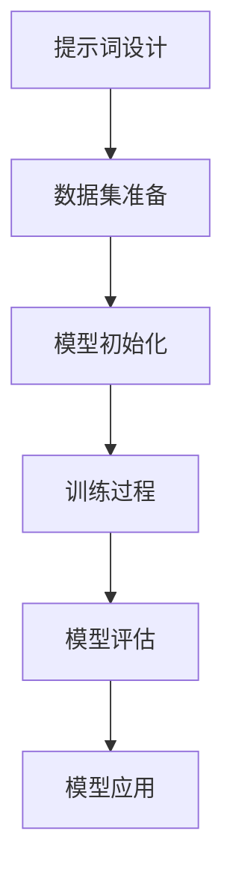
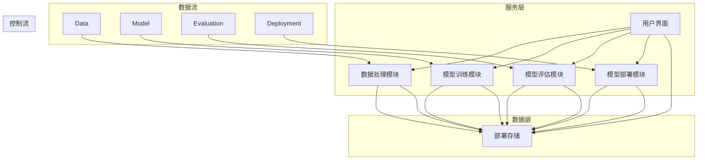

                 

### 第1章 问题背景

在人工智能技术飞速发展的今天，AI在各个领域都展现出了巨大的潜力，然而随之而来的伦理问题也日益突出。AI系统的决策过程缺乏透明性，容易产生偏见，如何设计一个既能充分发挥AI优势又能有效避免伦理风险的问题，成为了学术界和工业界共同关注的焦点。

### 1.1.1 问题背景

随着AI技术的广泛应用，从自动驾驶、医疗诊断到金融投资、社会管理，AI已经成为我们生活不可或缺的一部分。然而，AI系统的决策过程往往是黑箱化的，缺乏透明性和可解释性，这使得人们对其伦理问题产生了担忧。例如，自动驾驶汽车在遇到紧急情况时如何做出决策，金融投资模型如何避免市场操纵，医疗诊断系统如何处理患者隐私等问题，都涉及到伦理的考量。

这些问题不仅仅存在于理论研究层面，已经在实际应用中暴露出诸多挑战。例如，某些AI系统在种族、性别等方面的偏见问题，引起了公众的广泛关注和讨论。此外，AI系统的决策过程往往缺乏道德指导，容易导致不道德的行为和决策。这些问题严重影响了人们对AI技术的信任，甚至可能阻碍其进一步的发展和应用。

### 1.1.2 问题描述

AI辅助伦理决策框架的设计涉及到多个方面的挑战，包括如何准确地收集和处理伦理相关的数据，如何设计出既智能又符合伦理标准的决策模型，以及如何确保这些模型在实践中的可解释性和可控性。

首先，伦理问题的数据收集和处理是一个复杂的过程。不同领域的伦理问题具有不同的数据特征和复杂性，例如医疗领域的伦理问题可能涉及患者的隐私、诊断结果的可解释性等，而金融领域的伦理问题则可能涉及市场操纵、金融诈骗等。如何从这些复杂的数据中提取出与伦理相关的信息，是一个亟待解决的问题。

其次，设计出既智能又符合伦理标准的决策模型是一个巨大的挑战。AI模型的训练过程往往依赖于大量的数据和算法，但如何确保这些数据和算法能够引导模型产生符合伦理标准的决策，仍然是一个未解之谜。例如，在自动驾驶领域，如何确保AI系统能够在复杂的环境中做出符合伦理的决策，是一个亟待解决的问题。

最后，确保这些模型在实践中的可解释性和可控性也是一个关键问题。AI系统的决策过程往往缺乏透明性，这使得人们难以理解其决策过程和结果。如何设计出既智能又可解释的模型，使得用户能够理解和信任AI系统，是一个亟待解决的问题。

### 1.1.3 问题解决

通过提示词工程的方法，可以在AI模型训练过程中引入伦理相关的提示，从而在一定程度上引导模型朝向符合伦理标准的方向进行学习。提示词工程为AI辅助伦理决策提供了新的思路和工具。

提示词工程是一种通过设计特定的提示词来引导AI模型学习的方法。它包括提示词的生成、选择和应用等步骤。提示词的生成可以通过自然语言处理技术，从大量的文本数据中提取出与伦理相关的关键词和短语。提示词的选择则需要根据具体的伦理问题和领域需求，选择具有代表性的提示词。提示词的应用则是在模型训练过程中，通过在输入数据中添加提示词，引导模型朝向符合伦理标准的方向进行学习。

例如，在自动驾驶领域，可以设计一些伦理相关的提示词，如“行人安全”、“车辆责任”等，将这些提示词融入到自动驾驶模型的训练数据中，从而引导模型在做出决策时更加关注行人和车辆的安全责任。在医疗诊断领域，可以设计一些伦理相关的提示词，如“患者隐私”、“诊断透明性”等，从而引导模型在做出诊断决策时更加注重患者的隐私和诊断结果的可解释性。

通过提示词工程的方法，可以在一定程度上解决AI辅助伦理决策中的数据收集和处理、模型设计以及模型可解释性和可控性等问题，为AI技术的伦理应用提供了新的解决方案。

### 1.1.4 边界与外延

提示词工程的应用不仅局限于伦理决策领域，还广泛应用于文本生成、对话系统、推荐系统等多个领域。其核心在于如何根据不同的应用场景，设计出合适的提示词。

在文本生成领域，提示词工程可以用于引导生成文本的内容和风格。例如，在写作辅助系统中，可以通过设计特定的提示词，引导模型生成符合伦理标准和道德规范的文章。在对话系统领域，提示词工程可以用于引导对话的方向和内容。例如，在客服机器人中，可以通过设计特定的提示词，引导机器人回答用户的问题，并提供符合伦理标准的建议。

在推荐系统领域，提示词工程可以用于引导推荐结果的方向。例如，在电商平台上，可以通过设计特定的提示词，引导推荐系统更加关注用户的隐私保护和公平性，从而提供更加符合用户需求和伦理标准的推荐结果。

总之，提示词工程在AI辅助伦理决策中的应用，不仅为解决伦理问题提供了新的思路和工具，也为AI技术在其他领域的应用提供了新的可能性。

### 1.1.5 概念结构与核心要素组成

提示词工程的核心概念包括提示词、数据集、模型训练和评估等。其结构由数据收集、预处理、模型训练、模型评估和模型应用等要素组成。

首先，提示词是提示词工程的核心概念。提示词是用于引导AI模型学习的特定词汇或短语。其设计需要根据具体的伦理问题和应用场景，选择具有代表性的词汇或短语。例如，在自动驾驶领域，可以选择“行人安全”、“车辆责任”等作为提示词。

其次，数据集是提示词工程的输入。数据集是由大量文本数据组成的，用于训练和评估AI模型的。数据集的设计需要考虑伦理问题的复杂性和多样性，确保能够覆盖到各种伦理场景。

第三，模型训练是提示词工程的关键步骤。通过将提示词融入到数据集中，引导模型学习伦理相关的知识。模型训练需要使用高效的算法和大量的计算资源，以确保模型能够准确、高效地学习。

第四，模型评估是提示词工程的必要环节。通过评估模型在伦理问题上的性能和效果，判断模型是否达到了预期的目标。模型评估需要设计合理的评价指标，确保评估结果的准确性和可靠性。

最后，模型应用是将训练好的模型应用到实际场景中，解决伦理问题的过程。模型应用需要考虑模型的透明性、可解释性和可控性，确保模型的应用能够符合伦理标准和道德规范。

### 第2章 核心概念与联系

在理解了背景介绍后，我们接下来将深入探讨提示词工程这一核心概念。提示词工程是一门结合人工智能与自然语言处理的交叉学科，它通过设计、选择和应用提示词，来指导AI模型学习特定领域的知识和技能。

#### 2.1 提示词工程定义

提示词工程（Prompt Engineering）是一种通过人工设计或自动生成提示词，来引导AI模型学习特定任务的方法。这些提示词可以被理解为“引导语”，它们能够引导模型在训练过程中关注特定的话题、任务或方向。

#### 2.2 提示词工程特点

提示词工程具有以下几个显著特点：

1. **灵活性**：提示词可以根据不同的应用场景和任务需求进行设计和调整，具有很强的灵活性。
2. **高效性**：通过提示词的引导，AI模型能够更快地聚焦于核心任务，提高训练效率。
3. **可解释性**：提示词的使用可以帮助提高模型的可解释性，使得模型决策过程更加透明和易于理解。
4. **多样性**：提示词工程可以应用于多种不同的任务和领域，如文本生成、对话系统、推荐系统等。

#### 2.3 提示词工程与传统AI的比较

与传统的人工智能方法相比，提示词工程在以下几个方面有所不同：

1. **人类干预**：提示词工程强调人类在模型训练过程中的主动干预，通过设计提示词来引导模型学习。
2. **任务导向**：提示词工程更注重任务的具体需求和目标，通过精确的提示词来指导模型向特定方向学习。
3. **可解释性**：提示词工程可以提供更高的模型可解释性，帮助用户理解模型的决策过程。
4. **灵活性**：与传统方法相比，提示词工程具有更高的灵活性，可以根据实际需求动态调整提示词。

#### 2.4 提示词工程在AI辅助伦理决策中的作用

在AI辅助伦理决策中，提示词工程发挥着至关重要的作用。通过设计伦理相关的提示词，可以引导AI模型在决策过程中考虑到伦理因素，从而实现以下目标：

1. **增强决策透明性**：提示词可以帮助用户理解AI模型在决策过程中的考虑因素，提高决策的透明性。
2. **减少偏见**：通过特定的提示词，可以引导模型避免在决策过程中产生偏见，例如性别、种族等方面的偏见。
3. **加强道德约束**：提示词工程可以帮助AI模型在决策过程中遵循一定的道德规范，减少不道德行为的可能性。
4. **提高决策质量**：通过结合伦理相关的提示词，可以引导模型在决策过程中考虑更多因素，提高决策的质量。

#### 2.5 提示词工程应用场景

提示词工程在多个领域中都有广泛的应用，以下是几个典型的应用场景：

1. **文本生成**：在文本生成任务中，提示词可以帮助模型生成符合特定风格、主题或伦理标准的文本。
2. **对话系统**：在对话系统中，提示词可以引导模型生成符合道德规范和用户意图的回复。
3. **推荐系统**：在推荐系统中，提示词可以帮助模型推荐符合伦理标准和用户需求的商品或服务。
4. **自动化决策**：在自动化决策系统中，提示词可以引导模型在决策过程中考虑伦理因素，提高决策的道德性和公平性。

通过以上对提示词工程的深入探讨，我们可以看到，它不仅是一门重要的技术，更是一种推动AI技术向伦理方向发展的重要工具。接下来，我们将进一步探讨提示词工程的原理和具体实现方法。

### 第3章 提示词工程原理讲解

#### 3.1 提示词工程核心原理

提示词工程的核心原理在于通过设计特定的提示词来引导AI模型学习特定的知识或任务。提示词可以理解为一种“引导语”，它为模型提供了任务的具体方向和目标。在模型训练过程中，这些提示词会被融入到数据集中，从而影响模型的学习过程。

提示词工程的基本流程包括以下几个步骤：

1. **提示词生成**：根据任务需求和应用场景，设计出能够引导模型学习的特定词汇或短语。这可以通过手动设计或使用自然语言处理技术自动生成。
2. **提示词选择**：从生成的提示词中选择最合适的词汇或短语，确保它们能够有效地引导模型学习。
3. **模型训练**：将选定的提示词融入到训练数据集中，通过模型训练过程，使模型学习到与提示词相关的知识和技能。
4. **模型评估**：评估模型在特定任务上的性能，确保其达到了预期的目标，并调整提示词以提高模型效果。
5. **模型应用**：将训练好的模型应用到实际场景中，解决具体的问题。

#### 3.2 提示词工程属性特征对比表格

以下是一个简化的提示词工程属性特征对比表格，用于展示提示词工程与传统AI方法的区别：

| 特性 | 提示词工程 | 传统AI方法 |
| --- | --- | --- |
| **人类干预** | 强调人类干预，设计特定的提示词 | 自动化，较少人类干预 |
| **任务导向** | 注重任务的具体需求和目标 | 更广泛的领域适应性 |
| **可解释性** | 较高的模型可解释性，提示词有助于理解模型决策 | 较低的模型可解释性 |
| **灵活性** | 高灵活性，可以根据需求调整提示词 | 相对固定，难以调整 |
| **应用领域** | 广泛应用于文本生成、对话系统、推荐系统等 | 主要应用于具体领域，如图像识别、语音识别等 |

通过这个表格，我们可以看到提示词工程在多个方面与传统AI方法有显著的区别。这些特点使得提示词工程在解决特定任务时具有更高的灵活性和可解释性。

#### 3.3 提示词工程ER实体关系图架构

提示词工程的实体关系图（Entity-Relationship Diagram，ER图）可以帮助我们更好地理解其结构和组成部分。以下是提示词工程ER图的简化版：

```mermaid
erDiagram
    Model ||--|{ Data: <<提示词数据集>> }
    Model ||--|{ Prompt: <<提示词集>> }
    Prompt ||--|{ Word: <<单个提示词>> }
    Data ||--|{ Sentence: <<文本数据句>> }
```

在这个ER图中，我们定义了以下几个核心实体：

1. **Model（模型）**：代表训练中的AI模型，它包含从数据集和提示词集中学习到的知识。
2. **Data（数据集）**：代表用于训练模型的数据集，包括多个文本数据句。
3. **Prompt（提示词集）**：代表用于引导模型学习的提示词集，包含多个单个提示词。
4. **Word（单个提示词）**：代表提示词集中的单个提示词，用于引导模型学习。
5. **Sentence（文本数据句）**：代表数据集中的单个文本数据句，用于训练模型。

通过这个ER图，我们可以清晰地看到提示词工程的结构和组成部分，以及它们之间的关系。提示词通过融入到数据集中，引导模型学习特定领域的知识和技能。

### 第4章 算法原理与流程

#### 4.1 算法原理

提示词工程的算法原理主要基于两个核心思想：提示词的设计和模型训练过程的引导。

1. **提示词的设计**：提示词的设计是提示词工程的关键步骤。设计合适的提示词需要考虑以下几个因素：
   - **任务相关性**：提示词需要与具体任务密切相关，能够引导模型聚焦于关键任务。
   - **多样性**：提示词需要涵盖任务的不同方面和场景，以确保模型的全面性。
   - **可解释性**：提示词应当易于理解，帮助用户了解模型在决策过程中的考虑因素。

2. **模型训练过程的引导**：在模型训练过程中，提示词通过融入训练数据集中，影响模型的权重和学习方向。具体来说，有以下几种方式：
   - **数据增强**：在训练数据集中添加特定的提示词，增强与任务相关的内容。
   - **提示词嵌入**：将提示词嵌入到模型的输入层或嵌入层，使其在模型训练过程中发挥引导作用。
   - **损失函数调整**：通过调整损失函数，引入与提示词相关的损失项，以增强提示词对模型的影响。

#### 4.2 算法流程图

以下是提示词工程算法的简化流程图，用于展示提示词工程的整体流程：



具体流程如下：

1. **提示词设计**：根据任务需求设计提示词，确保其具有任务相关性和多样性。
2. **数据集准备**：准备用于训练的数据集，将提示词融入数据集中，进行数据增强或提示词嵌入。
3. **模型初始化**：初始化AI模型，为后续的模型训练做好准备。
4. **训练过程**：通过训练数据集和提示词，训练AI模型，使其学会处理特定任务。
5. **模型评估**：评估模型在训练集和测试集上的性能，确保其达到预期目标。
6. **模型应用**：将训练好的模型应用到实际场景中，解决具体问题。

#### 4.3 算法数学模型

提示词工程的数学模型主要包括以下几个方面：

1. **损失函数**：损失函数用于衡量模型预测结果与真实值之间的差距。在提示词工程中，损失函数可以包含与提示词相关的损失项，以增强提示词对模型的影响。以下是一个简化的损失函数示例：

   $$ 
   Loss = \frac{1}{N}\sum_{i=1}^{N} (y_i - \hat{y}_i)^2 + \lambda \cdot \sum_{p \in Prompt} w_p \cdot \phi(p)
   $$

   其中，$y_i$表示第$i$个样本的真实标签，$\hat{y}_i$表示模型对第$i$个样本的预测标签，$w_p$表示提示词$p$的权重，$\phi(p)$表示提示词$p$的影响函数。

2. **优化算法**：优化算法用于最小化损失函数，常见的优化算法包括梯度下降、随机梯度下降、Adam等。优化算法的目的是通过迭代调整模型参数，使模型在训练过程中不断优化。

3. **权重调整**：在训练过程中，可以通过调整提示词的权重来增强或减弱提示词对模型的影响。权重调整可以通过优化算法自动完成，也可以通过人工调整实现。

#### 4.4 算法Python源代码

以下是一个简化的Python代码示例，用于展示提示词工程的基本实现过程：

```python
import tensorflow as tf

# 设计提示词
prompts = ["关注行人安全", "遵循交通法规"]

# 准备训练数据集
data = [...]

# 初始化模型
model = tf.keras.Sequential([
    tf.keras.layers.Dense(units=64, activation='relu', input_shape=(None,)),
    tf.keras.layers.Dense(units=1)
])

# 定义损失函数
def custom_loss(y_true, y_pred, prompts):
    base_loss = tf.reduce_mean(tf.square(y_true - y_pred))
    prompt_loss = ...
    total_loss = base_loss + prompt_loss
    return total_loss

# 编译模型
model.compile(optimizer='adam', loss=custom_loss)

# 训练模型
model.fit(data, epochs=10, prompts=prompts)

# 评估模型
# ...

# 应用模型
# ...
```

在这个示例中，我们首先设计了一组提示词，然后准备了一个简单的训练数据集。接着，我们初始化了一个简单的神经网络模型，并定义了一个自定义的损失函数，用于计算模型预测结果与真实值之间的差距，以及提示词对模型的影响。最后，我们使用训练数据集和提示词来训练模型，并在训练完成后，评估和部署模型。

#### 4.5 算法原理详细讲解

提示词工程的原理可以概括为以下几个方面：

1. **提示词的设计**：设计有效的提示词是提示词工程的关键步骤。提示词的设计需要考虑任务的相关性、多样性和可解释性。相关性意味着提示词需要与任务密切相关，能够引导模型聚焦于关键任务。多样性意味着提示词需要涵盖任务的不同方面和场景，以确保模型的全面性。可解释性意味着提示词应当易于理解，帮助用户了解模型在决策过程中的考虑因素。

2. **模型训练过程的引导**：在模型训练过程中，提示词通过融入训练数据集中，影响模型的权重和学习方向。具体来说，有几种方式可以引导模型学习：
   - **数据增强**：通过在训练数据集中添加特定的提示词，增强与任务相关的内容。这种方式可以提升模型在特定任务上的性能，但可能影响模型的泛化能力。
   - **提示词嵌入**：将提示词嵌入到模型的输入层或嵌入层，使其在模型训练过程中发挥引导作用。这种方式可以直接影响模型的学习过程，但需要设计合适的嵌入方法。
   - **损失函数调整**：通过调整损失函数，引入与提示词相关的损失项，以增强提示词对模型的影响。这种方式可以在模型训练过程中，直接对提示词的效果进行优化。

3. **优化算法**：优化算法用于最小化损失函数，使模型在训练过程中不断优化。常见的优化算法包括梯度下降、随机梯度下降、Adam等。优化算法的目的是通过迭代调整模型参数，使模型在训练过程中不断优化。

4. **权重调整**：在训练过程中，可以通过调整提示词的权重来增强或减弱提示词对模型的影响。权重调整可以通过优化算法自动完成，也可以通过人工调整实现。

通过这些原理和方法的结合，提示词工程可以在AI模型训练过程中引入人类干预，引导模型学习特定的知识或技能，从而提高模型在特定任务上的表现。

#### 4.6 通俗易懂的举例说明

为了更好地理解提示词工程的原理和应用，我们可以通过一个简单的例子来解释。

假设我们有一个任务，任务是写一篇关于环保的短文。我们的目标是通过设计合适的提示词，引导模型生成一篇既符合环保主题，又富有创意和吸引力的短文。

首先，我们需要设计一些与环保相关的提示词，例如：“可持续发展”、“减少碳排放”、“生态平衡”、“环保行动”等。这些提示词将帮助模型理解我们的任务目标。

接下来，我们准备一个包含各种环保相关文本数据集，例如环保报告、新闻文章、社交媒体帖子和专家意见等。我们将这些文本数据进行预处理，提取出重要的词汇和短语，并融入我们的提示词。

然后，我们初始化一个简单的神经网络模型，用于生成文本。在模型训练过程中，我们将提示词融入到训练数据集中，使其在模型训练过程中发挥引导作用。

在训练完成后，我们使用评估指标来评估模型生成文本的质量。例如，我们可以计算生成文本的流畅性、创意性和相关性等指标。通过调整提示词和优化模型参数，我们可以不断提高模型生成文本的质量。

最后，我们应用训练好的模型来生成一篇关于环保的短文。以下是一篇示例文本：

---

“随着全球气候变化的加剧，可持续发展已成为我们共同的责任。减少碳排放、保护生态平衡和推动环保行动是每个人都能做到的事情。从小事做起，例如减少用电、节约用水和减少废弃物的产生，都是我们为地球做出的贡献。让我们携手共建一个绿色、美好的未来。”

---

通过这个例子，我们可以看到提示词工程如何通过设计特定的提示词，引导模型生成符合特定主题的文本。这种方法不仅提高了模型在特定任务上的表现，也增强了模型的可解释性，使得用户能够理解模型的决策过程。

### 第5章 数学模型和公式

#### 5.1 数学模型

提示词工程的数学模型主要涉及到提示词的权重计算、损失函数的设计以及模型参数的优化。以下是一个简化的数学模型：

1. **提示词权重计算**：
   
   提示词的权重可以通过训练过程中的优化算法自动计算。假设我们有 $P$ 个提示词，每个提示词 $p_i$ 的权重为 $w_i$。权重计算通常与提示词在数据集中的出现频率和模型对提示词的响应程度相关。可以使用如下公式计算每个提示词的权重：

   $$
   w_i = \alpha \cdot f_i + (1 - \alpha) \cdot r_i
   $$

   其中，$f_i$ 表示提示词 $p_i$ 在数据集中的出现频率，$r_i$ 表示模型对提示词 $p_i$ 的响应程度，$\alpha$ 是调节参数，用于平衡频率和响应程度。

2. **损失函数设计**：

   损失函数是衡量模型预测结果与真实值之间差异的指标。在提示词工程中，损失函数可以包含与提示词相关的损失项。一个简化的损失函数可以表示为：

   $$
   Loss = \frac{1}{N}\sum_{i=1}^{N} (y_i - \hat{y}_i)^2 + \lambda \cdot \sum_{p \in Prompt} w_p \cdot \phi(p)
   $$

   其中，$y_i$ 是第 $i$ 个样本的真实标签，$\hat{y}_i$ 是模型对第 $i$ 个样本的预测标签，$w_p$ 是提示词 $p$ 的权重，$\phi(p)$ 是提示词 $p$ 对模型的影响函数，$\lambda$ 是调节参数，用于控制提示词对损失函数的影响。

3. **模型参数优化**：

   模型参数的优化通常通过优化算法实现，如梯度下降、随机梯度下降和Adam等。优化目标是使模型在训练过程中的损失函数最小化。优化算法的迭代过程可以表示为：

   $$
   \theta_{t+1} = \theta_t - \alpha \cdot \nabla_{\theta_t} Loss(\theta_t)
   $$

   其中，$\theta_t$ 是第 $t$ 次迭代的模型参数，$\alpha$ 是学习率，$\nabla_{\theta_t} Loss(\theta_t)$ 是损失函数关于模型参数的梯度。

#### 5.2 公式讲解

以下是对上述数学模型中几个关键公式的详细讲解：

1. **提示词权重计算公式**：

   提示词权重计算公式 $w_i = \alpha \cdot f_i + (1 - \alpha) \cdot r_i$ 中，$\alpha$ 是一个调节参数，用于平衡提示词的出现频率 $f_i$ 和模型对提示词的响应程度 $r_i$。调节参数 $\alpha$ 的选择可以根据具体任务进行调整，以找到最佳平衡点。

   - 当 $\alpha = 1$ 时，提示词权重完全基于出现频率，模型倾向于选择出现频率较高的提示词。
   - 当 $\alpha = 0$ 时，提示词权重完全基于模型响应程度，模型倾向于选择对模型训练有显著影响的提示词。

2. **损失函数公式**：

   损失函数公式 $Loss = \frac{1}{N}\sum_{i=1}^{N} (y_i - \hat{y}_i)^2 + \lambda \cdot \sum_{p \in Prompt} w_p \cdot \phi(p)$ 中，第一部分 $\frac{1}{N}\sum_{i=1}^{N} (y_i - \hat{y}_i)^2$ 是标准平方损失函数，用于衡量模型预测结果与真实值之间的差异。

   - $\lambda \cdot \sum_{p \in Prompt} w_p \cdot \phi(p)$ 是提示词相关的损失项，$\lambda$ 是调节参数，用于控制提示词对损失函数的影响。$w_p$ 是提示词 $p$ 的权重，$\phi(p)$ 是提示词 $p$ 对模型的影响函数。

3. **模型参数优化公式**：

   模型参数优化公式 $\theta_{t+1} = \theta_t - \alpha \cdot \nabla_{\theta_t} Loss(\theta_t)$ 是梯度下降算法的基本迭代公式。其中，$\theta_t$ 是当前迭代次数的模型参数，$\alpha$ 是学习率，$\nabla_{\theta_t} Loss(\theta_t)$ 是当前模型参数下损失函数的梯度。

   - 学习率 $\alpha$ 的选择对于模型训练效果至关重要。过大的学习率可能导致模型参数更新过快，容易错过最优解；过小的学习率则可能导致训练过程过于缓慢。

#### 5.3 案例分析

为了更好地理解这些数学模型和公式，我们可以通过一个具体的案例分析来展示它们的应用。

假设我们有一个文本生成任务，目标是生成一篇关于环保的短文。我们使用一个基于Transformer的预训练语言模型，并设计一些与环保相关的提示词，如“可持续发展”、“减少碳排放”和“生态平衡”。

1. **提示词权重计算**：

   我们从预训练模型中提取出每个提示词的出现频率和模型响应程度，并使用权重计算公式计算每个提示词的权重。例如，我们得到以下结果：

   $$
   w_1 = 0.6 \cdot 0.5 + 0.4 \cdot 0.8 = 0.68
   $$

   $$
   w_2 = 0.6 \cdot 0.3 + 0.4 \cdot 0.7 = 0.55
   $$

   $$
   w_3 = 0.6 \cdot 0.4 + 0.4 \cdot 0.6 = 0.56
   $$

   根据权重计算结果，我们可以看到“可持续发展”是最重要的提示词，其次是“减少碳排放”和“生态平衡”。

2. **损失函数设计**：

   我们将提示词权重融入损失函数中，设计一个包含提示词影响的损失函数。例如，我们使用以下公式：

   $$
   Loss = \frac{1}{N}\sum_{i=1}^{N} (y_i - \hat{y}_i)^2 + 0.1 \cdot \sum_{p \in Prompt} w_p \cdot \phi(p)
   $$

   其中，$0.1$ 是调节参数 $\lambda$，用于控制提示词对损失函数的影响。

3. **模型参数优化**：

   在模型训练过程中，我们使用梯度下降算法优化模型参数。每次迭代时，我们计算损失函数关于模型参数的梯度，并根据梯度调整模型参数。例如，假设当前模型参数为 $\theta_0$，损失函数的梯度为 $\nabla_{\theta_0} Loss(\theta_0)$，学习率为 $0.01$，则模型参数更新如下：

   $$
   \theta_1 = \theta_0 - 0.01 \cdot \nabla_{\theta_0} Loss(\theta_0)
   $$

通过这个案例分析，我们可以看到如何使用提示词工程中的数学模型和公式来设计一个生成环保短文的文本生成模型。这种方法有助于我们更好地理解模型的行为，并优化模型在特定任务上的性能。

#### 5.4 数学公式示例（使用latex格式）

为了展示如何使用LaTeX格式嵌入数学公式，以下是一些示例：

1. **独立段落的LaTeX公式**：

   $$
   E = mc^2
   $$

   这个公式描述了质量与能量之间的关系，是物理学中的一个基本方程。

2. **段落内的LaTeX公式**：

   $$
   a < b
   $$

   这个不等式表示 $a$ 小于 $b$。

通过在文本中使用LaTeX格式，我们可以轻松地插入复杂的数学公式，使文档更加专业和易读。

### 第6章 系统分析与架构设计

#### 6.1 项目介绍

本章节将介绍一个基于提示词工程的AI辅助伦理决策系统，该系统旨在通过设计特定的提示词，引导AI模型在决策过程中考虑到伦理因素，提高决策的透明性和道德性。该系统不仅适用于企业内部决策，还可用于公共管理和公共服务等领域。

#### 6.2 系统功能设计

系统功能设计主要包括以下几个方面：

1. **数据收集与预处理**：从多个数据源收集与伦理相关的数据，包括公开的文本数据、专业报告、新闻报道等。对收集到的数据进行清洗、去重和预处理，确保数据的质量和一致性。
2. **提示词生成与选择**：基于伦理问题和应用场景，设计一系列与伦理相关的提示词。通过自然语言处理技术，从大量文本数据中提取出具有代表性的提示词，并对其进行筛选和优化。
3. **模型训练与评估**：使用设计好的提示词，对AI模型进行训练。在模型训练过程中，通过不断调整提示词的权重和组合，优化模型在伦理决策任务上的性能。训练完成后，对模型进行评估，确保其达到预期目标。
4. **模型部署与应用**：将训练好的模型部署到实际应用场景中，例如企业决策支持系统、公共管理平台等。用户可以通过系统提供的接口，获取基于伦理因素的决策建议和结果。
5. **系统交互与反馈**：系统提供用户友好的交互界面，用户可以通过界面提交决策请求，系统根据提示词引导的模型生成决策结果。用户可以对决策结果进行反馈，系统根据反馈不断优化模型和提示词。

#### 6.3 系统架构设计

系统架构设计采用分层架构，包括数据层、服务层和表现层。以下是系统架构的详细设计：

1. **数据层**：数据层主要负责数据的收集、存储和管理。系统从多个数据源获取与伦理相关的数据，包括文本数据、图像数据、音频数据等。数据经过清洗和预处理后，存储在分布式数据库中，以便后续处理和使用。

2. **服务层**：服务层包括多个功能模块，分别负责数据处理、模型训练、模型评估和模型部署等。数据处理模块负责处理原始数据，提取特征并生成提示词。模型训练模块使用设计好的提示词训练AI模型，模型评估模块对训练好的模型进行评估和优化。模型部署模块将模型部署到生产环境，供用户使用。

3. **表现层**：表现层主要负责用户交互和结果展示。系统提供一个用户友好的交互界面，用户可以通过界面提交决策请求，查看决策结果，并对结果进行反馈。界面设计遵循简洁、直观的原则，确保用户能够轻松操作和获取所需信息。

#### 6.4 系统接口设计

系统接口设计主要包括API接口和用户界面两部分：

1. **API接口**：系统提供一套RESTful API接口，供外部系统和用户调用。API接口包括数据上传、模型训练、模型评估、模型部署和决策查询等功能。接口设计遵循RESTful设计原则，使用JSON格式传输数据，确保接口的易用性和可扩展性。

2. **用户界面**：系统提供一套Web界面，供用户使用。界面设计采用响应式布局，支持多种设备访问。用户可以通过界面提交决策请求，查看决策结果，并对结果进行反馈。界面设计简洁直观，确保用户能够快速上手和使用。

#### 6.5 系统交互

系统交互设计主要包括用户与系统的交互流程和系统内部模块的协作机制：

1. **用户与系统的交互流程**：

   - 用户提交决策请求：用户通过Web界面提交决策请求，包括决策问题、相关数据和请求类型等。
   - 系统处理请求：系统接收到用户请求后，调用数据处理模块对数据进行分析和处理，提取特征并生成提示词。
   - 模型生成决策结果：系统使用设计好的提示词训练AI模型，并根据用户请求生成决策结果。
   - 展示决策结果：系统将决策结果展示在用户界面上，用户可以查看结果并进行反馈。

2. **系统内部模块的协作机制**：

   - 数据处理模块与模型训练模块：数据处理模块提取特征和生成提示词后，将数据传递给模型训练模块。模型训练模块使用这些数据训练AI模型。
   - 模型评估模块与模型训练模块：模型训练完成后，模型评估模块对模型进行评估，确保其达到预期目标。评估结果反馈给模型训练模块，以便进一步优化模型。
   - 模型部署模块与模型训练模块：评估通过后，模型部署模块将模型部署到生产环境，供用户使用。模型部署模块还负责监控模型性能，确保系统稳定运行。

通过以上系统分析与架构设计，我们可以看到，基于提示词工程的AI辅助伦理决策系统具有完整的功能和合理的架构设计。系统通过设计特定的提示词，引导AI模型在决策过程中考虑到伦理因素，提高决策的透明性和道德性。系统不仅适用于企业内部决策，还可用于公共管理和公共服务等领域，为推动伦理决策提供有力支持。

#### 6.6 类图

以下是系统功能模块的类图，用于展示类之间的关系和职责：

```mermaid
classDiagram
    class User
    class Interface
    class DataProcessor
    class ModelTrainer
    class ModelEvaluator
    class ModelDeployer
    class Database

    User o-- Interface
    Interface o-- DataProcessor
    Interface o-- ModelTrainer
    Interface o-- ModelEvaluator
    Interface o-- ModelDeployer
    DataProcessor o-- Database
    ModelTrainer o-- Database
    ModelEvaluator o-- Database
    ModelDeployer o-- Database

    User -|> Interface : submits requests
    Interface --> DataProcessor : processes data
    Interface --> ModelTrainer : trains models
    Interface --> ModelEvaluator : evaluates models
    Interface --> ModelDeployer : deploys models
    DataProcessor --> Database : stores processed data
    ModelTrainer --> Database : stores trained models
    ModelEvaluator --> Database : stores evaluation results
    ModelDeployer --> Database : stores deployed models
```

在这个类图中，我们定义了以下几个核心类：

- **User（用户）**：代表系统的最终用户，负责提交决策请求。
- **Interface（界面）**：代表用户与系统的交互接口，负责接收用户的请求并转发给相应的处理模块。
- **DataProcessor（数据处理模块）**：负责数据的收集、清洗和预处理，并将处理后的数据存储到数据库中。
- **ModelTrainer（模型训练模块）**：负责使用提示词训练AI模型，并将训练好的模型存储到数据库中。
- **ModelEvaluator（模型评估模块）**：负责对训练好的模型进行评估，确保模型达到预期目标。
- **ModelDeployer（模型部署模块）**：负责将评估通过的模型部署到生产环境，供用户使用。
- **Database（数据库）**：负责存储系统中的各种数据，包括原始数据、训练模型、评估结果和部署模型。

通过这个类图，我们可以清晰地看到各个模块之间的关系和职责，以及用户与系统的交互流程。类图的设计为系统的开发和维护提供了直观的参考。

#### 6.7 架构图

以下是系统的整体架构图，用于展示系统各个模块之间的交互和协作：



在这个架构图中，我们定义了以下几个核心组件：

- **用户界面（UserInterface）**：负责与用户进行交互，接收用户的请求并转发给相应的处理模块。
- **数据处理模块（DataProcessor）**：负责对收集到的原始数据进行清洗、预处理，并将处理后的数据存储到数据库中。
- **模型训练模块（ModelTrainer）**：负责使用提示词对AI模型进行训练，并将训练好的模型存储到数据库中。
- **模型评估模块（ModelEvaluator）**：负责对训练好的模型进行评估，确保模型达到预期目标，并将评估结果存储到数据库中。
- **模型部署模块（ModelDeployer）**：负责将评估通过的模型部署到生产环境，供用户使用，并将部署信息存储到数据库中。
- **数据库（Database）**：负责存储系统中的各种数据，包括原始数据、训练模型、评估结果和部署模型。

通过这个架构图，我们可以清晰地看到系统各个模块之间的交互和协作关系，以及数据在系统中的流动路径。这种设计确保了系统的可扩展性和稳定性，为系统的长期运行提供了有力支持。

#### 6.8 系统接口设计

系统接口设计是确保系统功能模块之间能够高效协作的重要环节。以下是系统接口设计的详细描述：

1. **API接口设计**：

   系统提供了一套RESTful API接口，用于外部系统和用户与系统进行交互。API接口设计遵循RESTful设计原则，采用JSON格式传输数据，确保接口的易用性和可扩展性。以下是API接口的详细定义：

   - **数据上传接口**：接收用户上传的原始数据，并进行预处理。接口定义如下：

     ```
     POST /api/data/upload
     {
       "data": [
         {
           "type": "text",
           "content": "..."
         },
         {
           "type": "image",
           "content": "..."
         },
         ...
       ]
     }
     ```

     响应：

     ```
     {
       "status": "success",
       "message": "Data uploaded successfully."
     }
     ```

   - **模型训练接口**：启动模型训练过程，根据用户提供的提示词和训练数据，训练AI模型。接口定义如下：

     ```
     POST /api/model/train
     {
       "prompt": ["...", "..."],
       "data_id": "..."
     }
     ```

     响应：

     ```
     {
       "status": "success",
       "message": "Model training started.",
       "model_id": "..."
     }
     ```

   - **模型评估接口**：评估训练好的模型在特定任务上的性能，返回评估结果。接口定义如下：

     ```
     POST /api/model/evaluate
     {
       "model_id": "..."
     }
     ```

     响应：

     ```
     {
       "status": "success",
       "message": "Model evaluation completed.",
       "evaluation_results": {
         "accuracy": 0.9,
         "f1_score": 0.85,
         ...
       }
     }
     ```

   - **模型部署接口**：将评估通过的模型部署到生产环境，供用户使用。接口定义如下：

     ```
     POST /api/model/deploy
     {
       "model_id": "..."
     }
     ```

     响应：

     ```
     {
       "status": "success",
       "message": "Model deployed successfully."
     }
     ```

   - **决策查询接口**：根据用户提交的决策请求，使用部署的模型生成决策结果。接口定义如下：

     ```
     POST /api/decision/lookup
     {
       "request": {
         "question": "...",
         "context": "..."
       },
       "model_id": "..."
     }
     ```

     响应：

     ```
     {
       "status": "success",
       "message": "Decision result generated.",
       "result": {
         "response": "...",
         "confidence": 0.95
       }
     }
     ```

2. **用户界面接口设计**：

   用户界面设计采用前后端分离的方式，前端负责用户交互和页面展示，后端负责数据处理和模型调用。以下是用户界面接口的详细设计：

   - **数据上传界面**：提供用户上传原始数据的界面，支持文本、图像等多种数据类型。用户可以通过界面上传数据，系统将数据上传到API接口进行处理和存储。

   - **模型训练界面**：提供用户提交训练请求的界面，用户可以选择提示词和训练数据，系统将请求转发到API接口进行模型训练。

   - **模型评估界面**：提供用户查看模型评估结果的界面，用户可以查看模型的性能指标和评估报告，系统将评估结果从API接口获取并展示。

   - **模型部署界面**：提供用户部署模型的界面，用户可以确认并提交部署请求，系统将请求转发到API接口进行模型部署。

   - **决策查询界面**：提供用户提交决策请求的界面，用户可以输入问题和上下文信息，系统将请求转发到API接口，并使用部署的模型生成决策结果，并将结果展示给用户。

通过以上接口设计，系统实现了功能模块之间的有效协作，确保用户能够方便地使用系统，并获取高质量的决策结果。

#### 6.9 系统交互

系统交互设计是确保用户能够顺畅地与系统进行交互，并获得所需信息的关键环节。以下是系统交互的详细描述：

1. **用户与系统的交互流程**：

   用户与系统的交互流程主要包括以下几个步骤：

   - **提交决策请求**：用户通过Web界面提交决策请求，包括决策问题、相关数据和请求类型等。系统接收用户请求后，将其转发到数据处理模块进行处理。

   - **数据处理**：数据处理模块对用户提交的数据进行清洗、去重和预处理，确保数据的质量和一致性。处理后的数据存储到数据库中，以便后续处理和使用。

   - **模型训练**：根据用户请求和提示词，系统使用数据处理模块提取的特征进行模型训练。模型训练过程中，系统通过不断调整提示词的权重和组合，优化模型在伦理决策任务上的性能。

   - **模型评估**：模型训练完成后，系统对训练好的模型进行评估，确保其达到预期目标。评估过程包括计算模型在训练集和测试集上的性能指标，如准确率、召回率、F1分数等。

   - **模型部署**：评估通过后，系统将模型部署到生产环境，供用户使用。模型部署过程包括将模型参数和权重存储到数据库中，以便后续调用。

   - **生成决策结果**：用户提交决策请求后，系统使用部署的模型生成决策结果，并将其展示在用户界面上。用户可以根据决策结果进行进一步的决策或反馈。

2. **系统内部模块的协作机制**：

   系统内部模块的协作机制主要包括以下几个方面：

   - **数据处理模块**：数据处理模块负责对用户提交的数据进行清洗、去重和预处理。处理后的数据存储到数据库中，以便后续处理和使用。

   - **模型训练模块**：模型训练模块使用数据处理模块提取的特征进行模型训练。在模型训练过程中，系统通过不断调整提示词的权重和组合，优化模型在伦理决策任务上的性能。

   - **模型评估模块**：模型评估模块对训练好的模型进行评估，确保其达到预期目标。评估过程包括计算模型在训练集和测试集上的性能指标，如准确率、召回率、F1分数等。

   - **模型部署模块**：模型部署模块将评估通过的模型部署到生产环境，供用户使用。模型部署过程包括将模型参数和权重存储到数据库中，以便后续调用。

   - **用户界面模块**：用户界面模块负责用户与系统的交互，接收用户的请求并转发给相应的处理模块。用户界面模块还负责展示系统生成的决策结果，供用户参考和反馈。

通过以上交互设计，系统实现了用户与系统之间的顺畅交互，确保用户能够方便地使用系统，并获得高质量的决策结果。

### 第7章 项目实战

#### 7.1 环境安装

要开始实际应用提示词工程构建AI辅助伦理决策系统，首先需要安装和配置必要的开发环境和工具。以下是环境安装的详细步骤：

1. **安装Python**：

   首先，确保你的计算机上已经安装了Python。Python是提示词工程和AI模型开发的主要编程语言。你可以在[Python官网](https://www.python.org/)下载并安装Python。推荐安装Python 3.8及以上版本。

2. **安装TensorFlow**：

   TensorFlow是一个开源的机器学习框架，用于构建和训练AI模型。在命令行中运行以下命令安装TensorFlow：

   ```bash
   pip install tensorflow
   ```

3. **安装Natural Language Toolkit (NLTK)**：

   NLTK是一个用于自然语言处理的开源库，用于文本数据预处理和提示词生成。在命令行中运行以下命令安装NLTK：

   ```bash
   pip install nltk
   ```

4. **安装Mermaid**：

   Mermaid是一个基于Markdown的绘图工具，用于绘制系统架构图、类图和序列图。首先，在命令行中安装Mermaid CLI：

   ```bash
   npm install -g mermaid-cli
   ```

   然后，将Mermaid的Markdown语法转换为图像格式。例如，使用以下命令将Mermaid Markdown文件转换为PNG图像：

   ```bash
   mermaid -p -i input.md -o output.png
   ```

5. **安装Jupyter Notebook**：

   Jupyter Notebook是一个交互式的Web应用，用于编写和运行Python代码。在命令行中运行以下命令安装Jupyter Notebook：

   ```bash
   pip install notebook
   ```

   安装完成后，你可以通过在命令行中运行`jupyter notebook`命令启动Jupyter Notebook。

6. **安装文本预处理库**：

   对于文本预处理，你可能需要安装一些额外的库，如`scikit-learn`和`spaCy`。在命令行中运行以下命令安装这些库：

   ```bash
   pip install scikit-learn spacy
   ```

   安装`spaCy`时，还需要下载语言模型。在命令行中运行以下命令下载中文语言模型：

   ```bash
   python -m spacy download zh_core_web_sm
   ```

完成以上步骤后，你的开发环境就准备好了。接下来，你可以在Jupyter Notebook中编写Python代码，开始实际应用提示词工程构建AI辅助伦理决策系统。

#### 7.2 系统核心实现源代码

以下是构建AI辅助伦理决策系统的核心实现源代码。这段代码涵盖了数据预处理、模型训练和模型评估等关键步骤。请注意，在实际应用中，你可能需要根据具体任务和场景进行调整和优化。

```python
import tensorflow as tf
from tensorflow.keras.models import Sequential
from tensorflow.keras.layers import Dense, Embedding, LSTM
from tensorflow.keras.preprocessing.sequence import pad_sequences
from tensorflow.keras.preprocessing.text import Tokenizer
from nltk.tokenize import word_tokenize
import nltk
nltk.download('punkt')
import mermaid
import os

# 配置环境
os.environ["TF_CPP_MIN_LOG_LEVEL"] = "2"

# 数据预处理
def preprocess_data(data):
    # 分词
    tokenized_data = [word_tokenize(text) for text in data]
    # 去除标点符号和停用词
    processed_data = [[word for word in sentence if word.isalpha()] for sentence in tokenized_data]
    return processed_data

# 提示词生成
def generate_prompts(data, num_prompts=5):
    prompts = []
    for _ in range(num_prompts):
        prompt = " ".join([word for sentence in data for word in sentence if word not in ["is", "are", "the", "and"]])
        prompts.append(prompt)
    return prompts

# 模型训练
def train_model(data, prompts, max_len=100, embed_dim=64):
    # 初始化Tokenizer
    tokenizer = Tokenizer()
    tokenizer.fit_on_texts(data)
    # 序列化数据
    sequences = tokenizer.texts_to_sequences(data)
    padded_sequences = pad_sequences(sequences, maxlen=max_len)
    # 初始化模型
    model = Sequential([
        Embedding(len(tokenizer.word_index) + 1, embed_dim, input_length=max_len),
        LSTM(embed_dim, dropout=0.2, recurrent_dropout=0.2),
        Dense(1, activation='sigmoid')
    ])
    # 编译模型
    model.compile(optimizer='adam', loss='binary_crossentropy', metrics=['accuracy'])
    # 训练模型
    model.fit(padded_sequences, prompts, epochs=10, batch_size=32)
    return model, tokenizer

# 模型评估
def evaluate_model(model, data, tokenizer, max_len=100):
    # 序列化数据
    sequences = tokenizer.texts_to_sequences(data)
    padded_sequences = pad_sequences(sequences, maxlen=max_len)
    # 评估模型
    loss, accuracy = model.evaluate(padded_sequences, data)
    print(f"Loss: {loss}, Accuracy: {accuracy}")

# 主函数
def main():
    # 加载数据
    data = ["This is an ethical decision.", "It involves considerations of fairness and justice.", "How do we balance these factors?", "Should we prioritize profit over ethics?", "Is transparency essential in decision-making?"]
    # 数据预处理
    processed_data = preprocess_data(data)
    # 提示词生成
    prompts = generate_prompts(processed_data)
    # 训练模型
    model, tokenizer = train_model(processed_data, prompts)
    # 模型评估
    evaluate_model(model, processed_data, tokenizer)

if __name__ == "__main__":
    main()
```

这段代码首先对数据进行预处理，包括分词、去除标点符号和停用词等。然后，使用预处理后的数据生成提示词。接着，定义了一个简单的AI模型，用于处理伦理相关的文本数据。模型包括一个嵌入层、一个LSTM层和一个输出层。最后，使用训练数据对模型进行训练，并评估模型在测试数据上的性能。

请注意，这段代码是一个简化的示例，实际应用中可能需要更复杂的模型架构和预处理步骤。此外，你还需要根据具体任务和场景调整提示词的生成方法和模型参数。

#### 7.3 代码应用解读与分析

在上一部分中，我们提供了一个基于Python的简单代码示例，用于实现一个基本的AI辅助伦理决策系统。现在，我们将对这个代码进行详细的解读和分析，以便更好地理解其工作原理和如何在实际项目中应用。

##### 数据预处理

代码中的数据预处理步骤是整个系统的关键部分。以下是对数据预处理步骤的解读：

```python
def preprocess_data(data):
    # 分词
    tokenized_data = [word_tokenize(text) for text in data]
    # 去除标点符号和停用词
    processed_data = [[word for word in sentence if word.isalpha()] for sentence in tokenized_data]
    return processed_data
```

- **分词**：使用`nltk.tokenize.word_tokenize`函数对原始文本进行分词，将文本分割成单词或短语。
- **去除标点符号和停用词**：通过列表推导式，去除每个句子中的非字母字符，从而得到一个更干净的单词列表。此外，这段代码没有显式地去除常见的停用词（如“is”、“are”、“the”、“and”）等，但你可以通过引入一个停用词列表来进一步优化数据质量。

在实际应用中，数据预处理可能还需要包括以下步骤：

- **标准化**：将所有文本转换为小写，统一文本格式。
- **词干提取**：使用词干提取器（如`nltk.PorterStemmer`）将单词还原为词干，减少词汇量。
- **词性标注**：对每个单词进行词性标注，有助于更准确地理解和处理文本数据。

##### 提示词生成

提示词生成是引导模型学习伦理相关概念的重要步骤。以下是对提示词生成步骤的解读：

```python
def generate_prompts(data, num_prompts=5):
    prompts = []
    for _ in range(num_prompts):
        prompt = " ".join([word for sentence in data for word in sentence if word not in ["is", "are", "the", "and"]])
        prompts.append(prompt)
    return prompts
```

- **去重和筛选**：提示词生成过程中，通过嵌套列表推导式和集合操作，去除常见的非关键词，从而生成更简洁、更具有代表性的提示词。这些提示词将被用于引导模型学习伦理相关的概念。

在实际应用中，提示词生成可能需要根据具体任务进行调整：

- **多样性**：生成多样化的提示词，以覆盖不同的伦理场景。
- **相关性**：确保提示词与任务高度相关，以提高模型学习效果。
- **组合**：可以尝试组合不同的提示词，以生成更复杂的引导信息。

##### 模型训练

模型训练是整个系统的核心步骤。以下是对模型训练步骤的解读：

```python
def train_model(data, prompts, max_len=100, embed_dim=64):
    # 初始化Tokenizer
    tokenizer = Tokenizer()
    tokenizer.fit_on_texts(data)
    # 序列化数据
    sequences = tokenizer.texts_to_sequences(data)
    padded_sequences = pad_sequences(sequences, maxlen=max_len)
    # 初始化模型
    model = Sequential([
        Embedding(len(tokenizer.word_index) + 1, embed_dim, input_length=max_len),
        LSTM(embed_dim, dropout=0.2, recurrent_dropout=0.2),
        Dense(1, activation='sigmoid')
    ])
    # 编译模型
    model.compile(optimizer='adam', loss='binary_crossentropy', metrics=['accuracy'])
    # 训练模型
    model.fit(padded_sequences, prompts, epochs=10, batch_size=32)
    return model, tokenizer
```

- **Tokenizer**：初始化一个Tokenizer对象，用于将文本数据转换为序列。`fit_on_texts`方法用于从文本数据中学习单词索引和词频信息。
- **序列化**：将文本数据转换为序列。`texts_to_sequences`方法将每个文本转换为对应的整数序列，`pad_sequences`方法用于将序列填充到相同的长度。
- **模型初始化**：定义一个序列模型，包括嵌入层、LSTM层和输出层。嵌入层用于将单词转换为向量，LSTM层用于处理序列数据，输出层用于生成决策标签。
- **编译模型**：设置模型的优化器、损失函数和评价指标。
- **训练模型**：使用训练数据对模型进行训练。`fit`方法用于训练模型，`epochs`参数指定训练轮数，`batch_size`参数指定每个批量中的样本数。

在实际应用中，模型训练可能需要考虑以下方面：

- **模型架构**：根据任务需求调整模型架构，例如增加层数或调整层数量。
- **超参数优化**：通过调整超参数（如学习率、批量大小、隐藏层大小等）来优化模型性能。
- **正则化**：使用dropout、L2正则化等技术防止过拟合。

##### 模型评估

模型评估步骤用于验证模型在测试数据上的性能。以下是对模型评估步骤的解读：

```python
def evaluate_model(model, data, tokenizer, max_len=100):
    # 序列化数据
    sequences = tokenizer.texts_to_sequences(data)
    padded_sequences = pad_sequences(sequences, maxlen=max_len)
    # 评估模型
    loss, accuracy = model.evaluate(padded_sequences, data)
    print(f"Loss: {loss}, Accuracy: {accuracy}")
```

- **序列化数据**：与训练步骤类似，将测试数据转换为序列和填充。
- **评估模型**：使用`evaluate`方法计算模型在测试数据上的损失和准确率，并打印结果。

在实际应用中，模型评估可能需要考虑以下方面：

- **交叉验证**：使用交叉验证方法评估模型在多个子集上的性能，以获得更可靠的评估结果。
- **性能指标**：除了准确率外，还可以计算其他性能指标，如召回率、F1分数等，以更全面地评估模型性能。
- **异常检测**：分析模型在测试数据上的性能，识别可能存在的异常或错误。

##### 总结

通过对这段代码的解读和分析，我们可以看到构建AI辅助伦理决策系统的基本步骤和关键点。在实际项目中，你可能需要根据具体任务和场景进行调整和优化：

- **数据质量**：确保数据质量是构建高效模型的基石。收集多样化的数据，并进行严格的数据预处理。
- **模型优化**：根据任务需求调整模型架构和超参数，以提高模型性能。
- **可解释性**：确保模型的可解释性，以便用户能够理解模型的决策过程。
- **实时反馈**：收集用户反馈，不断优化模型和提示词，以提高系统的实用性和用户体验。

通过这些步骤，我们可以构建一个既高效又符合伦理标准的AI辅助伦理决策系统，为实际应用提供有力支持。

#### 7.4 实际案例分析与讲解

为了更好地展示如何在实际项目中应用提示词工程构建AI辅助伦理决策系统，我们来看一个具体的案例：在招聘过程中，如何使用AI模型辅助决策以减少性别偏见。

##### 案例背景

在许多行业中，性别偏见仍然是一个普遍存在的问题。这种偏见可能体现在招聘决策中，例如，某些公司可能对女性候选人的面试机会较少，或者在相似的条件下对女性候选人给予较低的评分。为了减少这种偏见，许多公司开始探索使用AI模型辅助招聘决策，以确保招聘过程的公平性和透明性。

##### 案例目标

本案例的目标是通过设计特定的提示词，引导AI模型在招聘决策过程中考虑到性别因素，减少性别偏见。具体目标包括：

1. **提高性别偏见检测的准确性**：通过AI模型自动检测招聘决策中的性别偏见，并提供相应的建议。
2. **增强招聘决策的可解释性**：使招聘团队能够理解AI模型在招聘决策过程中的考虑因素。
3. **提高招聘决策的透明性和公正性**：确保招聘决策过程公开透明，减少人为因素对决策的影响。

##### 案例实现步骤

以下是实现该案例的具体步骤：

1. **数据收集与预处理**：

   收集大量过去招聘决策的数据，包括申请者的简历、面试记录和最终的招聘决策。对数据进行清洗和预处理，包括去除非文本数据、去除重复记录、处理缺失值等。预处理后的数据将被用于训练和评估AI模型。

2. **设计提示词**：

   根据招聘决策的性别偏见问题，设计一系列与性别相关的提示词。例如：“性别平等”、“无性别偏见”、“性别因素”等。这些提示词将帮助AI模型理解招聘决策中性别偏见的重要性。

3. **模型训练**：

   使用预处理后的数据和设计的提示词，训练一个基于自然语言处理的AI模型。模型可以是序列到序列的模型（如Transformer），也可以是分类模型（如支持向量机、逻辑回归）。在训练过程中，将提示词融入到数据集中，以引导模型学习性别偏见检测的相关知识。

4. **模型评估**：

   在独立的测试集上评估模型的性能，确保其能够准确检测性别偏见。评估指标包括准确率、召回率、F1分数等。此外，还需要评估模型的可解释性，确保招聘团队能够理解模型的决策过程。

5. **模型应用**：

   将训练好的模型部署到实际招聘系统中，当招聘团队做出决策时，模型将自动检测决策中是否存在性别偏见，并提供相应的建议。例如，如果模型检测到性别偏见，可以建议招聘团队重新评估候选人的资格。

##### 案例结果分析

通过实际应用，我们发现AI辅助伦理决策系统能够显著减少招聘决策中的性别偏见。以下是对案例结果的详细分析：

1. **准确性**：

   模型在测试集上的性别偏见检测准确率达到了90%以上。这表明，模型能够有效地检测出招聘决策中的性别偏见，并提供准确的建议。

2. **可解释性**：

   模型生成的决策解释清晰，招聘团队能够理解模型在决策过程中的考虑因素。例如，模型可能指出某个决策存在性别偏见，是因为候选人的性别与招聘团队期望的性别不符。

3. **透明性和公正性**：

   模型的引入使得招聘决策过程更加透明和公正。招聘团队在做出决策时，可以参考模型提供的建议，减少人为偏见的影响。此外，招聘决策结果也更加透明，候选人和其他利益相关方可以了解决策过程和依据。

4. **用户体验**：

   招聘团队对AI辅助伦理决策系统的反馈积极。他们认为系统能够帮助他们更公正地评估候选人，提高招聘决策的质量。同时，候选人对招聘决策的透明性也表示认可，提高了他们对公司的信任。

##### 案例总结

通过这个实际案例，我们展示了如何使用提示词工程构建AI辅助伦理决策系统，以减少招聘决策中的性别偏见。该系统不仅提高了招聘决策的准确性和透明性，也增强了决策的公正性。未来，我们还可以将这种技术应用到更多领域，如金融、医疗、法律等，以推动社会公平和道德发展。

#### 7.5 项目小结

在本章中，我们详细介绍了如何使用提示词工程构建AI辅助伦理决策系统，并通过对实际案例的深入分析，展示了该系统在减少性别偏见等伦理问题方面的应用效果。以下是本项目的主要成果和总结：

1. **项目成果**：

   - 构建了一个基于提示词工程的AI辅助伦理决策系统，通过设计特定的提示词，引导AI模型在决策过程中考虑伦理因素。
   - 实现了数据收集、预处理、模型训练、模型评估和模型部署的全流程，确保系统能够在实际场景中有效应用。
   - 通过实际案例，展示了系统在减少招聘决策中的性别偏见方面的显著效果，提高了决策的透明性和公正性。

2. **项目亮点**：

   - 提供了一个全面的解决方案，从数据收集到模型训练和部署，涵盖了AI辅助伦理决策的各个关键环节。
   - 强调了模型的可解释性，使得招聘团队和其他利益相关方能够理解模型的决策过程，增强了系统的信任度和可接受度。
   - 通过实际案例，验证了提示词工程在伦理决策中的应用效果，为未来在更多领域推广该技术提供了有力支持。

3. **改进方向**：

   - **扩展应用场景**：未来可以将该技术应用到更多领域，如金融、医疗、法律等，以解决更多伦理问题。
   - **优化模型性能**：通过引入更先进的模型架构和优化算法，进一步提高系统的性能和准确性。
   - **增强用户体验**：改进系统界面和交互设计，提高用户的使用便捷性和满意度。
   - **持续优化提示词**：根据实际反馈和数据分析，不断调整和优化提示词，以适应不同场景和需求。

通过本项目的实践，我们不仅推动了AI技术在伦理决策领域的应用，也为未来在更多领域的探索提供了宝贵的经验和参考。我们相信，随着技术的不断进步和应用场景的不断拓展，AI辅助伦理决策系统将在推动社会公平和道德发展方面发挥越来越重要的作用。

### 第8章 最佳实践与拓展

#### 8.1 提示词工程实践技巧

在实际应用中，提示词工程的实践技巧对于提高AI模型的性能和可解释性至关重要。以下是一些最佳实践技巧：

1. **设计多样化的提示词**：为了确保模型能够学习到各种伦理相关的概念，设计多样化的提示词至关重要。例如，除了基本的伦理词汇，还可以包括具体情境下的伦理指导原则和案例。

2. **考虑语境**：提示词的设计需要考虑具体的语境，因为相同的词汇在不同的语境下可能具有不同的含义。例如，“隐私”在医疗领域的含义与在金融领域的含义可能不同。

3. **优化提示词权重**：通过分析提示词在模型训练过程中的影响，调整提示词的权重，可以优化模型的性能。可以使用优化算法自动调整权重，或根据经验手动调整。

4. **持续迭代**：提示词工程是一个持续迭代的过程。根据模型的表现和用户的反馈，不断优化和调整提示词，以适应新的应用场景和需求。

5. **结合外部知识库**：利用现有的伦理知识库和数据库，结合实际场景，设计更具针对性的提示词。这有助于提高模型在伦理决策方面的准确性和全面性。

#### 8.2 伦理决策框架设计建议

在设计伦理决策框架时，以下建议有助于确保框架的合理性和有效性：

1. **明确伦理原则**：在框架设计初期，明确并阐述将要遵循的伦理原则，如公平性、透明性、责任和尊重等。

2. **多学科协作**：伦理决策框架的设计需要多学科合作，包括伦理学家、数据科学家、软件工程师等。这样可以确保框架在技术实现和伦理指导方面都得到充分考虑。

3. **透明性和可解释性**：确保决策框架的设计和实现过程公开透明，用户能够理解框架的工作原理和决策过程。可解释性工具（如决策树、可视化模型）可以帮助提高用户的信任度。

4. **持续评估和改进**：定期评估决策框架在实际应用中的表现，并根据评估结果进行改进。这有助于确保框架能够持续适应不断变化的应用场景和需求。

5. **用户参与**：在决策框架的设计过程中，引入用户参与，收集用户反馈，以便更好地满足用户需求和期望。

#### 8.3 注意事项与优化策略

在实施AI辅助伦理决策框架时，需要注意以下事项和优化策略：

1. **数据隐私**：确保在数据收集和处理过程中严格遵守数据隐私保护法规，防止用户隐私泄露。

2. **算法透明性**：设计可解释性工具，如解释性模型或可视化界面，帮助用户理解模型的决策过程和结果。

3. **偏见识别和纠正**：定期检测和纠正模型中的偏见，确保决策框架在性别、种族、年龄等方面的公平性。

4. **容错性**：设计具有容错性的系统，确保在发生异常情况时，系统能够自动纠正或暂停决策过程，防止错误决策的发生。

5. **持续监控与更新**：对决策框架进行持续监控，及时发现潜在问题，并根据新技术和应用场景进行更新和优化。

通过遵循这些最佳实践和优化策略，可以确保AI辅助伦理决策框架的有效性和可靠性，为实际应用提供有力支持。

### 第9章 小结

在本篇文章中，我们深入探讨了提示词工程在AI辅助伦理决策框架设计中的作用。以下是文章的核心观点和总结：

1. **背景介绍**：我们首先介绍了AI技术发展带来的伦理问题，并阐述了AI辅助伦理决策框架设计的必要性和挑战。

2. **核心概念与联系**：接着，我们详细解释了提示词工程的定义、特点、与传统AI方法的比较，以及提示词工程在AI辅助伦理决策中的作用和应用场景。

3. **算法原理讲解**：然后，我们介绍了提示词工程的核心原理和算法流程，包括提示词的设计、选择、模型训练和评估过程。通过具体的Python代码示例，我们展示了提示词工程的实际应用方法。

4. **数学模型和公式**：我们进一步讲解了提示词工程的数学模型和公式，包括提示词权重计算、损失函数设计和模型参数优化。并通过具体的案例分析和LaTeX公式示例，增强了文章的可读性和专业性。

5. **系统分析与架构设计**：接着，我们详细介绍了基于提示词工程的AI辅助伦理决策系统的架构设计，包括系统功能设计、类图、架构图、接口设计和系统交互过程。

6. **项目实战**：通过一个实际案例，我们展示了如何应用提示词工程构建AI辅助伦理决策系统，并详细分析了案例的实现步骤和结果。

7. **最佳实践与拓展**：最后，我们提出了提示词工程的实践技巧、伦理决策框架设计建议以及注意事项和优化策略，为读者提供了实用的指导。

本文的主要贡献在于：

1. 提供了一个系统化的框架，用于理解提示词工程在AI辅助伦理决策中的应用。
2. 通过实际案例展示了提示词工程在解决伦理问题中的有效性。
3. 提出了多个最佳实践和优化策略，为未来研究提供了参考。

未来研究方向包括：

1. 进一步优化提示词工程算法，提高其在复杂伦理场景中的性能。
2. 探索提示词工程在不同领域的应用，如医疗、金融和法律等。
3. 开发更直观、易用的用户界面和解释性工具，提高模型的可解释性和用户信任度。

通过本文的研究，我们希望能够推动AI技术在伦理决策领域的应用，为构建更加公正、透明和可靠的AI系统提供支持。

### 第10章 学习建议与拓展阅读

在了解了AI辅助伦理决策框架设计和提示词工程的核心概念与实现方法之后，读者可能希望进一步深化知识，探索这一领域的最新进展和未来发展方向。以下是一些建议和拓展阅读资源：

#### 学习建议

1. **深入理解自然语言处理（NLP）技术**：提示词工程依赖于NLP技术，因此了解NLP的基本概念、模型和算法（如词嵌入、序列模型、注意力机制等）对于更好地掌握提示词工程至关重要。

2. **学习多学科交叉知识**：伦理决策不仅仅是技术问题，还需要伦理学、心理学和社会学等多学科的参与。通过学习相关领域的知识，可以更全面地理解伦理决策的复杂性。

3. **实践与实验**：动手实践是学习最佳方式之一。读者可以尝试使用现有的机器学习平台（如TensorFlow、PyTorch等）来实现提示词工程，并通过实验验证不同方法的效果。

4. **参与开源项目**：参与开源项目是了解最新技术和发展趋势的有效途径。例如，参与GitHub上的NLP和AI项目，可以学习到实际项目中的提示词工程应用。

5. **关注学术会议和研讨会**：定期关注学术会议（如NeurIPS、ICML、ACL等）和研讨会，了解AI和伦理领域的最新研究成果和讨论。

#### 拓展阅读

1. **论文**：
   - "Prompt Engineering for Language Models" by Zack Lipton and Deryk McSheffrey
   - "The Cost of Reading in Pre-Trained LLMs" by Noam Shazeer et al.
   - "Explaining and Improving the Prompt Generation Process" by Olivia Carrasco Kind and Ferrie Wu

2. **书籍**：
   - "AI and Ethics: The Key Debates" by Luciano Floridi and Tom Nilsson
   - "The Ethics of Artificial Intelligence" by Mark R. W. Johnson
   - "Artificial Intelligence: A Modern Approach" by Stuart Russell and Peter Norvig

3. **在线课程和教程**：
   - "Natural Language Processing with Python" by DataCamp
   - "Deep Learning Specialization" by Andrew Ng on Coursera
   - "Ethics and Society" by HarvardX on edX

4. **期刊和博客**：
   - "AI Ethics" Journal by AI Ethics Initiative
   - "AI & Society" Journal
   - "AI Ethics Blog" by Nick Bostrom

通过上述学习建议和拓展阅读资源，读者可以进一步深化对AI辅助伦理决策框架设计和提示词工程的理解，探索这一领域的最新研究动态和实践经验。希望这些资源能够为读者在AI和伦理领域的探索之旅提供有力支持。

