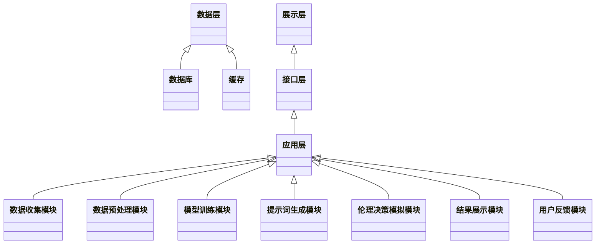
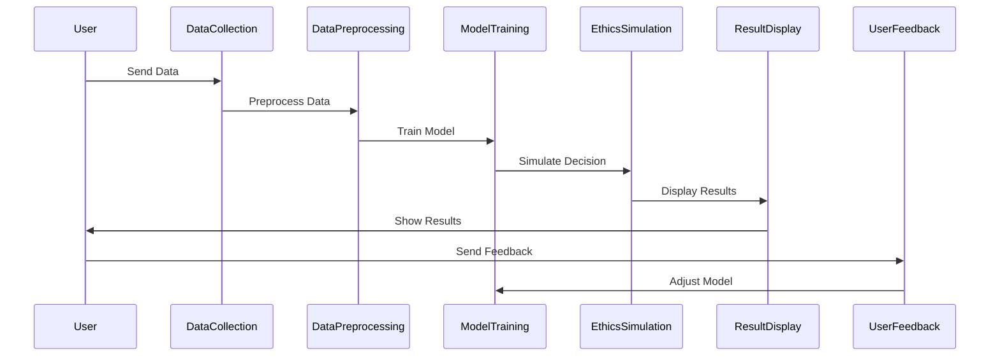

                 

### 引言与背景

在当今科技迅猛发展的时代，人工智能（AI）已经成为推动社会进步的重要力量。AI技术在医疗、金融、交通、教育等多个领域都有着广泛的应用，其潜在的巨大影响力也引发了社会的广泛关注。然而，随着AI技术的不断深入应用，特别是在伦理决策领域，其透明性和可解释性逐渐成为制约其发展的关键问题。

#### 问题的提出

AI系统在进行决策时，往往缺乏足够的透明性和可解释性。这导致AI的决策过程在许多情况下变得不透明，甚至可能出现伦理上的风险。例如，自动驾驶汽车在紧急情况下做出的决策可能引发道德争议；金融领域的AI算法在投资决策中可能忽视了风险控制，导致市场动荡。这些问题不仅影响了AI技术的应用，也对其伦理性和社会信任提出了严峻挑战。

#### 研究目的与意义

本研究旨在探讨提示词工程在AI辅助伦理决策模拟中的策略，通过系统的理论分析和实践探索，提出有效的策略框架，以提高AI决策的伦理性和可解释性。这一研究具有重要的理论和实践意义，具体体现在以下几个方面：

1. **提升决策的伦理性**：通过提示词工程，可以引导AI系统在决策过程中充分考虑伦理因素，从而提高决策的伦理水平。
2. **增强决策的可解释性**：提示词工程有助于揭示AI决策的内在逻辑，使得AI的决策过程更加透明，有利于提升公众对AI技术的信任。
3. **推动AI技术的健康发展**：本研究为AI伦理决策提供了新的视角和方法，有助于推动AI技术的规范化和健康发展，促进社会利益最大化。

#### 相关概念

在本研究中，我们涉及以下核心概念：

1. **AI辅助伦理决策**：指利用人工智能技术辅助人类进行伦理判断和决策的过程。其核心在于将伦理原则和决策过程融入AI系统。
2. **提示词工程**：一种利用特定关键词或短语来引导AI系统进行学习和决策的方法。在伦理决策模拟中，提示词工程有助于引导AI系统关注伦理问题。
3. **伦理决策模拟**：利用计算机模拟技术，对伦理决策过程进行再现和评估的方法。通过模拟，可以更好地理解伦理决策的复杂性和影响因素。

#### 研究内容与方法

本研究将围绕以下三个方面展开：

1. **分析AI辅助伦理决策中存在的问题**：通过文献综述和案例分析，探讨当前AI辅助伦理决策中的主要问题和挑战。
2. **探讨提示词工程的理论基础和实践应用**：系统分析提示词工程的理论基础，并结合实际案例，探讨其在伦理决策模拟中的应用。
3. **提出有效的策略框架**：基于前面的分析，提出一套有效的策略框架，以指导AI辅助伦理决策模拟。

为了实现上述研究目标，本研究将采用以下研究方法：

1. **文献综述**：通过系统查阅相关文献，了解当前AI辅助伦理决策和提示词工程的研究现状和发展趋势。
2. **案例分析**：通过具体案例，总结成功经验和不足之处，为理论分析和策略框架的提出提供实践依据。
3. **理论建模**：建立理论模型，分析提示词工程在AI辅助伦理决策中的具体作用和机制。
4. **实证研究**：通过实验和模拟，验证所提出的策略框架的有效性和可行性。

#### 边界与外延

本研究主要关注AI辅助伦理决策模拟中的提示词工程策略，研究范围限定在特定领域内的伦理决策问题，研究方法主要采用提示词工程。虽然本研究聚焦于提示词工程在AI辅助伦理决策模拟中的应用，但研究成果可以拓展到其他领域的AI伦理决策问题。同时，研究过程中积累的经验和方法也可为其他相关领域的研究提供参考。

#### 本章小结

本章对研究背景、目的、意义、内容、方法以及边界与外延进行了全面介绍。通过本章的阐述，读者可以初步了解本研究的主要内容和研究思路。在接下来的章节中，我们将对AI辅助伦理决策和提示词工程进行深入探讨，并提出有效的策略框架，以期为AI技术的健康发展和社会利益最大化做出贡献。

---

### AI辅助伦理决策的概念解析

AI辅助伦理决策是指利用人工智能技术来辅助人类进行伦理判断和决策的过程。其核心在于将伦理原则和决策过程融入AI系统，使得AI在执行任务时能够考虑伦理因素，从而提高决策的伦理性和可解释性。以下是关于AI辅助伦理决策的详细解析：

#### 定义

AI辅助伦理决策的定义可以从两个层面来理解：一是技术层面，即通过算法和模型将伦理原则融入AI系统的设计和运行过程中；二是应用层面，即在实际场景中，利用AI技术来帮助人类进行伦理判断和决策。

1. **技术层面**：在技术层面上，AI辅助伦理决策的实现依赖于多种人工智能技术，如机器学习、自然语言处理、知识图谱等。通过这些技术，可以将伦理原则编码到AI系统中，使其在处理问题时能够自动遵循伦理准则。

2. **应用层面**：在应用层面上，AI辅助伦理决策主要应用于需要伦理判断的场景，如医疗决策、自动驾驶、金融投资等。在这些场景中，AI系统通过分析大量数据，结合伦理原则，提供决策支持，帮助人类做出更符合伦理要求的决策。

#### 发展历程

AI辅助伦理决策的发展历程可以追溯到20世纪80年代。随着人工智能技术的不断发展，伦理学家和计算机科学家开始探讨如何将伦理原则融入AI系统中。这一研究领域的兴起，源于对AI技术在决策过程中可能带来的伦理风险的担忧。

1. **早期探索**：在早期，研究人员主要关注如何将伦理原则形式化，并开发相应的算法和模型。例如，一些学者提出了基于伦理规则的决策支持系统，试图通过编程实现伦理原则的自动化执行。

2. **发展阶段**：随着机器学习和深度学习等技术的突破，AI辅助伦理决策的研究进入了新的发展阶段。研究人员开始关注如何将复杂的伦理原则和价值观编码到AI系统中，并通过大规模数据训练模型，使其能够更好地理解伦理问题。

3. **当前研究**：目前，AI辅助伦理决策的研究已经从理论探讨转向实际应用。许多研究机构和企业在自动驾驶、医疗诊断、金融风控等领域，开始探索如何利用AI技术辅助伦理决策，以提升决策的伦理性和可解释性。

#### 技术机制

AI辅助伦理决策的技术机制主要包括以下几个方面：

1. **伦理原则编码**：在AI系统中嵌入伦理原则，是AI辅助伦理决策的核心步骤。通过将伦理原则形式化，并将其转化为可计算的模型，AI系统可以在决策过程中自动遵循这些原则。

2. **数据驱动方法**：利用大量伦理决策案例，通过机器学习和深度学习技术，训练AI模型，使其能够自动识别和应对伦理问题。

3. **多模态数据融合**：将不同来源的数据（如文本、图像、音频等）进行融合，以获得更全面的伦理决策信息。例如，在医疗诊断中，AI系统可以同时分析患者的历史病历、医生的经验和最新的医学研究，以做出更符合伦理的决策。

4. **决策解释性增强**：通过开发可解释的AI模型，使AI的决策过程更加透明，便于人类理解和监督。这有助于提升AI决策的伦理性和可解释性。

#### 应用实例

AI辅助伦理决策在多个领域都有着实际应用，以下是几个典型的应用实例：

1. **医疗领域**：在医疗决策中，AI系统可以帮助医生分析患者数据，提供诊断和治疗方案。通过结合伦理原则，AI系统可以确保决策符合医学伦理标准，减少人为错误。

2. **自动驾驶**：在自动驾驶技术中，AI系统需要处理各种复杂的交通场景，并做出实时决策。通过引入伦理原则，AI系统可以在紧急情况下做出更符合伦理要求的决策，降低交通事故风险。

3. **金融领域**：在金融投资中，AI系统可以帮助投资者分析市场数据，做出投资决策。通过结合伦理原则，AI系统可以确保决策符合金融伦理规范，避免市场操纵和欺诈行为。

4. **公共安全**：在公共安全领域，AI系统可以辅助决策者分析社会问题，提供解决方案。通过结合伦理原则，AI系统可以确保决策符合社会利益，提升公共安全水平。

综上所述，AI辅助伦理决策作为一种新兴的研究领域，正逐渐成为人工智能技术应用的重要方向。通过深入理解和应用AI辅助伦理决策，我们可以更好地保障社会利益，推动人工智能技术的健康发展。

---

### 提示词工程的概念解析

提示词工程是一种在人工智能系统中，利用特定关键词或短语来引导系统学习和决策的方法。在AI辅助伦理决策模拟中，提示词工程能够有效地引导AI系统关注伦理问题，提高决策的伦理性和可解释性。以下是关于提示词工程的详细解析：

#### 定义

提示词工程（Prompt Engineering）的定义可以从以下几个方面来理解：

1. **技术层面**：在技术层面，提示词工程是指通过设计和使用特定的提示词（prompt），来引导AI系统进行学习和决策的过程。提示词可以是单个单词、短语或句子，甚至是一段文本。

2. **应用层面**：在应用层面，提示词工程用于指导AI系统在处理特定任务时，关注重要的信息、遵循特定的原则或遵守特定的规范。例如，在伦理决策模拟中，通过设计包含伦理概念的提示词，可以引导AI系统在决策过程中考虑伦理因素。

#### 发展历程

提示词工程的发展历程与人工智能技术的发展密切相关。以下是几个关键阶段：

1. **早期探索**：在人工智能的早期阶段，研究人员开始探索如何通过语言提示来引导AI系统。例如，通过使用关键词来指导AI进行文本分类、信息检索等任务。

2. **模型驱动发展**：随着深度学习和自然语言处理技术的进步，提示词工程逐渐形成了系统的方法和工具。现代AI模型，如Transformer和BERT等，对提示词的敏感度更高，提示词工程的应用范围也得到显著扩展。

3. **当前研究**：目前，提示词工程已经成为AI应用中的一个重要研究方向。研究人员通过不断优化提示词设计，提高AI系统的性能和可解释性。同时，在伦理决策领域，提示词工程也被广泛应用于引导AI系统遵守伦理原则。

#### 技术机制

提示词工程的技术机制主要包括以下几个方面：

1. **提示词设计**：设计有效的提示词是提示词工程的关键步骤。提示词应具备以下几个特点：
   - **精确性**：提示词应准确地表达用户的需求或期望，避免模糊不清的表述。
   - **引导性**：提示词应能够引导AI系统关注重要信息或遵循特定的原则。
   - **灵活性**：提示词应具备一定的灵活性，能够适应不同的应用场景。

2. **模型适配**：不同的AI模型对提示词的敏感度和适应性不同。提示词工程需要根据具体的AI模型特点，设计相应的提示词。例如，对于基于Transformer的模型，长文本提示可能更有效；而对于基于BERT的模型，简短的提示词可能更为合适。

3. **反馈循环**：通过用户反馈和模型优化，不断调整和改进提示词设计。这一过程类似于机器学习中的迭代训练，通过不断的反馈和调整，提升提示词工程的效果。

#### 应用场景

提示词工程在多个领域都有着广泛应用，以下是几个典型的应用场景：

1. **文本生成**：在文本生成任务中，提示词工程可以用于引导AI系统生成符合特定主题或风格的文本。例如，在新闻写作、文学创作等领域，通过设计恰当的提示词，可以引导AI系统生成高质量的文本。

2. **问答系统**：在问答系统中，提示词工程可以用于引导AI系统理解用户的问题，并提供准确的答案。通过设计包含关键信息的提示词，AI系统可以更好地捕捉问题的核心，提供更加精准的答案。

3. **伦理决策模拟**：在AI辅助伦理决策模拟中，提示词工程可以用于引导AI系统关注伦理问题，提高决策的伦理性和可解释性。通过设计包含伦理概念的提示词，AI系统可以在决策过程中充分考虑伦理因素，做出更加符合伦理标准的决策。

4. **图像识别**：在图像识别任务中，提示词工程可以用于引导AI系统识别特定类型的图像。例如，在医学影像分析中，通过设计包含特定疾病名称的提示词，可以引导AI系统更准确地识别相关病变。

#### 与伦理决策模拟的结合

在伦理决策模拟中，提示词工程的作用尤为重要。通过设计包含伦理概念的提示词，可以引导AI系统在模拟过程中关注伦理问题，提高决策的伦理性和可解释性。以下是几个具体的应用实例：

1. **医疗伦理决策**：在医疗伦理决策中，通过设计包含医学伦理原则的提示词，可以引导AI系统在诊断和治疗过程中，遵循医学伦理规范，确保决策的伦理性。

2. **自动驾驶伦理决策**：在自动驾驶技术中，通过设计包含交通规则、安全标准的提示词，可以引导AI系统在行驶过程中，遵守交通法规，确保驾驶行为的伦理性。

3. **金融伦理决策**：在金融投资中，通过设计包含金融伦理原则的提示词，可以引导AI系统在投资决策中，遵循诚信、公正等原则，避免市场操纵和欺诈行为。

综上所述，提示词工程作为一种有效的AI应用方法，在伦理决策模拟中发挥着重要作用。通过设计恰当的提示词，可以引导AI系统关注伦理问题，提高决策的伦理性和可解释性，从而推动人工智能技术的健康发展。

---

### 伦理决策模拟的概念解析

伦理决策模拟是指利用计算机模拟技术，对伦理决策过程进行再现和评估的方法。通过模拟，可以更好地理解伦理决策的复杂性和影响因素，为实际决策提供科学依据。以下是关于伦理决策模拟的详细解析：

#### 定义

伦理决策模拟的定义可以从以下几个方面来理解：

1. **技术层面**：在技术层面，伦理决策模拟是指通过计算机模拟技术，对伦理决策过程进行建模和仿真。这包括收集相关的决策信息、构建决策模型、模拟决策过程以及评估决策结果等步骤。

2. **应用层面**：在应用层面，伦理决策模拟用于研究和分析伦理决策的复杂性和影响因素，从而为实际决策提供指导。通过模拟，决策者可以预测试不同决策方案的可能结果，评估其伦理性和可行性，从而做出更为明智的决策。

#### 发展历程

伦理决策模拟的发展历程与计算机技术和人工智能技术的发展密切相关。以下是几个关键阶段：

1. **早期探索**：在计算机技术初期，伦理决策模拟主要依赖于简单的逻辑推理和规则系统。这些系统可以通过编程实现一些基本的伦理决策，但其复杂性和灵活性有限。

2. **模型驱动发展**：随着计算机科学和人工智能技术的进步，伦理决策模拟逐渐转向模型驱动方法。通过构建复杂的数学模型和仿真模型，可以更准确地模拟伦理决策过程，并分析其复杂性和影响因素。

3. **当前研究**：目前，伦理决策模拟已经成为一个重要的研究领域。研究人员通过开发先进的算法和模型，不断提高模拟的精度和实用性。同时，随着大数据和云计算技术的发展，伦理决策模拟的应用范围也在不断扩大。

#### 技术机制

伦理决策模拟的技术机制主要包括以下几个方面：

1. **决策模型构建**：决策模型是伦理决策模拟的核心。通过构建数学模型或仿真模型，可以模拟决策过程中的各种因素和变量，分析其对决策结果的影响。

2. **数据收集与分析**：数据是决策模拟的基础。通过收集与决策相关的数据，如历史决策案例、伦理规则、社会文化背景等，可以更准确地构建决策模型。

3. **模拟与仿真**：通过计算机模拟技术，对构建的决策模型进行仿真实验，模拟决策过程和结果。这有助于理解决策的复杂性和不确定性，评估不同决策方案的效果。

4. **结果评估与反馈**：对模拟结果进行评估，分析决策方案的有效性和可行性。通过对比不同决策方案的结果，可以为实际决策提供参考。

#### 应用场景

伦理决策模拟在多个领域都有着广泛应用，以下是几个典型的应用场景：

1. **医疗决策**：在医疗决策中，伦理决策模拟可以帮助医生和患者共同探讨各种治疗方案，评估其伦理性和可行性。例如，在器官移植、临床试验等领域，通过模拟不同决策方案，可以帮助决策者做出更加符合伦理要求的决策。

2. **公共安全**：在公共安全领域，伦理决策模拟可以用于模拟各种应急情况，评估不同应对策略的伦理性和有效性。例如，在自然灾害、恐怖袭击等紧急情况下，通过模拟不同决策方案，可以为应急指挥提供科学依据。

3. **金融决策**：在金融决策中，伦理决策模拟可以用于评估不同投资策略的伦理性和风险。例如，在股市波动、投资组合优化等领域，通过模拟不同决策方案，可以帮助投资者做出更加符合伦理和风险控制要求的决策。

4. **企业伦理管理**：在企业伦理管理中，伦理决策模拟可以用于评估企业各项决策的伦理影响，帮助企业建立更加完善的伦理管理体系。例如，在员工福利、环境保护、社会责任等领域，通过模拟不同决策方案，可以帮助企业制定更加符合伦理要求的政策和措施。

#### 与其他概念的关系

伦理决策模拟与AI辅助伦理决策和提示词工程有着密切的关系：

1. **与AI辅助伦理决策的关系**：伦理决策模拟是AI辅助伦理决策的重要组成部分。通过伦理决策模拟，可以评估AI系统的伦理性和决策效果，为AI系统的改进提供依据。

2. **与提示词工程的关系**：提示词工程可以用于引导伦理决策模拟，提高模拟的精度和有效性。通过设计包含伦理概念的提示词，可以引导AI系统在模拟过程中关注伦理问题，提高决策的伦理性和可解释性。

综上所述，伦理决策模拟作为一种重要的决策方法，在人工智能和伦理决策领域发挥着重要作用。通过深入理解和应用伦理决策模拟，我们可以更好地解决复杂的伦理决策问题，推动人工智能技术的健康发展。

---

### 提示词工程在AI辅助伦理决策模拟中的应用策略

在AI辅助伦理决策模拟中，提示词工程作为一种关键技术，可以有效地引导AI系统关注伦理问题，提高决策的伦理性和可解释性。以下我们将详细探讨提示词工程在AI辅助伦理决策模拟中的应用策略：

#### 提示词选择策略

选择合适的提示词是提示词工程的基础。以下是一些具体的策略：

1. **伦理概念聚焦**：在提示词选择过程中，应优先考虑包含关键伦理概念的词汇。例如，在医疗决策中，可以选择包含“患者隐私”、“医疗公平”等伦理关键词的提示词。

2. **文化适应性**：不同的文化背景会影响人们对伦理问题的理解和判断。因此，在设计提示词时，应考虑目标用户的文化背景，确保提示词能够被广泛接受和有效引导。

3. **情境敏感性**：根据具体的应用场景，选择与情境高度相关的提示词。例如，在自动驾驶决策中，可以选择包含“行人安全”、“交通规则”等词汇的提示词。

4. **多维度考虑**：提示词应综合考虑伦理、法律、技术等多个维度。通过多角度的提示，可以引导AI系统全面考虑决策的各种因素，提高决策的全面性和准确性。

#### 提示词优化策略

提示词的有效性并非一成不变，需要通过不断优化来提高其效果。以下是一些具体的优化策略：

1. **用户反馈**：通过用户反馈来评估提示词的有效性，并根据反馈结果进行调整。例如，在问答系统中，可以收集用户对答案的满意度，以优化提示词的设计。

2. **模型迭代**：结合AI模型的特点，不断调整和优化提示词。通过迭代训练，可以使AI模型对提示词的敏感度更高，从而更好地引导决策。

3. **多模态结合**：在提示词设计过程中，可以结合文本、图像、音频等多种模态的信息。通过多模态结合，可以提供更丰富的信息，提高AI系统对伦理问题的理解和应对能力。

#### 提示词应用场景

提示词工程在AI辅助伦理决策模拟中的应用场景非常广泛，以下是一些典型的应用场景：

1. **医疗伦理决策**：在医疗伦理决策中，通过设计包含伦理关键词的提示词，可以引导AI系统在诊断和治疗过程中，充分考虑患者的隐私、公平性和安全性。

2. **自动驾驶伦理决策**：在自动驾驶技术中，通过设计包含交通规则、行人安全等关键词的提示词，可以引导AI系统在行驶过程中，遵守交通法规，确保驾驶行为的伦理性。

3. **金融伦理决策**：在金融投资中，通过设计包含诚信、公正等关键词的提示词，可以引导AI系统在投资决策中，遵循金融伦理规范，避免市场操纵和欺诈行为。

4. **公共安全伦理决策**：在公共安全领域，通过设计包含公共安全、应急响应等关键词的提示词，可以引导AI系统在应急情况下，做出符合伦理要求的决策。

#### 提示词工程的优势

提示词工程在AI辅助伦理决策模拟中具有以下优势：

1. **提高决策的伦理性**：通过设计包含伦理概念的提示词，可以引导AI系统在决策过程中，充分考虑伦理因素，提高决策的伦理水平。

2. **增强决策的可解释性**：提示词工程有助于揭示AI决策的内在逻辑，使得AI的决策过程更加透明，便于人类理解和监督。

3. **优化用户体验**：通过优化提示词设计，可以提升用户体验，使得AI系统的操作更加直观和便捷。

4. **促进AI系统的自学习**：提示词工程可以结合用户反馈和模型迭代，不断优化AI系统的性能，促进系统的自学习和进化。

综上所述，提示词工程在AI辅助伦理决策模拟中具有重要的作用。通过有效的提示词设计和优化策略，可以显著提高决策的伦理性和可解释性，推动AI技术的健康发展。

---

### AI辅助伦理决策模拟的案例分析

为了更好地理解AI辅助伦理决策模拟中的提示词工程策略，以下是几个典型的案例分析，包括其具体的实施方案、面临的问题、解决方法和经验教训。

#### 案例一：自动驾驶伦理决策

**背景**：自动驾驶技术近年来发展迅速，但如何在复杂交通环境中做出符合伦理要求的决策，仍是学术界和工业界关注的焦点。

**实施方案**：在某自动驾驶项目中，研究人员使用了包含交通规则、行人安全、道路状况等关键词的提示词，来引导AI系统进行伦理决策模拟。具体步骤如下：

1. **数据收集**：收集了大量交通数据，包括交通事故案例、交通规则、道路状况等。
2. **模型训练**：使用深度学习模型，对收集的数据进行训练，使其能够识别各种交通场景。
3. **提示词设计**：设计包含伦理关键词的提示词，如“行人安全优先”、“遵守交通法规”等，用于引导AI系统进行决策。
4. **模拟实验**：在模拟环境中，对AI系统的决策进行测试和评估。

**面临的问题**：在模拟过程中，AI系统在某些情况下难以平衡行人安全和交通效率之间的冲突。

**解决方法**：通过优化提示词设计和模型参数，研究人员提高了AI系统在复杂交通场景下的决策能力。同时，引入了更多的情境信息，如天气状况、道路施工等，以增强AI系统的适应性。

**经验教训**：提示词工程在自动驾驶伦理决策中，起到了关键作用。通过合理设计提示词，可以引导AI系统在复杂情况下做出更加符合伦理要求的决策。

#### 案例二：医疗伦理决策

**背景**：在医疗领域，如何确保诊断和治疗过程中遵循伦理原则，是一个重要的问题。

**实施方案**：在某医疗诊断系统中，研究人员使用了包含医学伦理、患者隐私、医疗公平等关键词的提示词，来引导AI系统进行伦理决策模拟。具体步骤如下：

1. **数据收集**：收集了大量的医学数据，包括病历、检查报告、治疗记录等。
2. **模型训练**：使用深度学习模型，对医学数据进行训练，使其能够辅助医生进行诊断和治疗。
3. **提示词设计**：设计包含医学伦理关键词的提示词，如“保护患者隐私”、“确保医疗公平”等，用于引导AI系统在诊断和治疗过程中考虑伦理因素。
4. **模拟实验**：在模拟环境中，对AI系统的决策进行测试和评估。

**面临的问题**：在模拟过程中，AI系统有时难以区分不同伦理因素的重要性，导致决策结果不够理想。

**解决方法**：通过优化提示词设计和模型结构，研究人员提高了AI系统在伦理决策中的准确性和可靠性。同时，引入了更多的患者信息，如年龄、病史等，以增强AI系统的决策能力。

**经验教训**：提示词工程在医疗伦理决策中，可以显著提高AI系统的伦理性和决策质量。通过合理设计提示词，可以引导AI系统在复杂的医疗环境中，做出更加符合伦理要求的决策。

#### 案例三：金融伦理决策

**背景**：在金融领域，如何确保投资决策符合金融伦理，是一个关键问题。

**实施方案**：在某金融投资项目中，研究人员使用了包含诚信、公正、风险控制等关键词的提示词，来引导AI系统进行伦理决策模拟。具体步骤如下：

1. **数据收集**：收集了大量的金融数据，包括市场趋势、公司财务报告、投资记录等。
2. **模型训练**：使用机器学习模型，对金融数据进行训练，使其能够辅助投资者进行投资决策。
3. **提示词设计**：设计包含金融伦理关键词的提示词，如“遵循诚信原则”、“确保投资公正”等，用于引导AI系统在投资决策过程中考虑伦理因素。
4. **模拟实验**：在模拟环境中，对AI系统的决策进行测试和评估。

**面临的问题**：在模拟过程中，AI系统有时会忽视风险控制，导致投资决策不够稳健。

**解决方法**：通过优化提示词设计和模型参数，研究人员提高了AI系统在金融决策中的风险控制能力。同时，引入了更多的市场信息，如经济指标、政策变化等，以增强AI系统的决策能力。

**经验教训**：提示词工程在金融伦理决策中，可以显著提高AI系统的决策质量。通过合理设计提示词，可以引导AI系统在复杂的金融环境中，做出更加符合伦理要求的投资决策。

#### 总结

通过上述案例分析，可以看出，提示词工程在AI辅助伦理决策模拟中具有广泛的应用前景。在不同领域，通过合理设计提示词，可以引导AI系统在复杂的伦理环境中，做出更加符合伦理要求的决策。同时，这些案例也为我们提供了宝贵的经验和教训，为进一步优化提示词工程策略提供了参考。

---

### 算法原理讲解

在AI辅助伦理决策模拟中，提示词工程的关键在于设计合适的提示词，以引导AI系统在决策过程中考虑伦理因素。下面，我们将详细讲解提示词工程在AI辅助伦理决策模拟中的算法原理，包括其数学模型和具体实现。

#### 算法概述

提示词工程的核心算法可以分为以下几个步骤：

1. **提示词设计**：根据具体应用场景，设计包含关键伦理概念的提示词。
2. **模型训练**：使用提示词对AI模型进行训练，使其能够识别和应对伦理问题。
3. **决策生成**：在模拟环境中，利用训练好的模型生成决策，并进行评估和优化。

#### 数学模型

提示词工程的数学模型主要包括以下几个部分：

1. **伦理决策函数**：定义一个伦理决策函数 \( f(E, P) \)，其中 \( E \) 表示伦理因素集合，\( P \) 表示决策候选方案集合。函数 \( f(E, P) \) 用于计算每个候选方案的伦理得分。

   \[
   f(E, P) = \sum_{e \in E} w_e \cdot p(e, P)
   \]

   其中，\( w_e \) 表示伦理因素 \( e \) 的权重，\( p(e, P) \) 表示方案 \( P \) 中包含伦理因素 \( e \) 的概率。

2. **模型参数**：定义模型参数 \(\theta\)，用于表示AI模型对伦理问题的敏感度。参数 \(\theta\) 通过训练数据进行调整，以优化模型性能。

3. **决策评估函数**：定义一个决策评估函数 \( g(P, E, \theta) \)，用于评估每个候选方案的伦理得分。函数 \( g(P, E, \theta) \) 可以是基于伦理决策函数 \( f(E, P) \) 的改进版本，以适应特定的应用场景。

   \[
   g(P, E, \theta) = f(E, P) - \theta \cdot d(P, E)
   \]

   其中，\( d(P, E) \) 表示方案 \( P \) 与伦理因素 \( E \) 的距离，用于衡量方案与伦理标准的差距。

#### 实现流程

以下是提示词工程在AI辅助伦理决策模拟中的实现流程：

1. **数据准备**：
   - 收集与伦理决策相关的数据，包括历史决策案例、伦理规则、背景信息等。
   - 数据清洗和预处理，以去除噪声和异常值。

2. **模型选择**：
   - 根据应用场景选择合适的AI模型，如深度学习模型、强化学习模型等。
   - 考虑模型的可解释性，确保决策过程透明。

3. **提示词设计**：
   - 设计包含关键伦理概念的提示词，如“隐私保护”、“公平性”、“风险控制”等。
   - 提示词应根据应用场景进行调整，以最大化其引导效果。

4. **模型训练**：
   - 使用训练数据集，对AI模型进行训练。
   - 结合提示词，调整模型参数，以优化决策性能。

5. **决策生成**：
   - 在模拟环境中，输入新的决策情境，利用训练好的模型生成候选方案。
   - 使用决策评估函数，计算每个候选方案的伦理得分。

6. **评估与优化**：
   - 对生成的决策方案进行评估，选择最优方案。
   - 根据评估结果，调整提示词和模型参数，进行迭代优化。

#### 示例说明

以医疗伦理决策为例，假设我们使用一个基于Transformer的模型进行决策模拟。以下是具体的算法步骤：

1. **数据准备**：
   - 收集历史医疗决策案例，包括诊断、治疗方案、伦理评估结果等。
   - 预处理数据，进行分词、词嵌入等操作。

2. **模型选择**：
   - 选择一个预训练的Transformer模型，如BERT或GPT。
   - 考虑模型的可解释性，确保决策过程透明。

3. **提示词设计**：
   - 设计包含医疗伦理概念的提示词，如“患者隐私保护”、“公平治疗”、“最小伤害”等。
   - 提示词应根据具体医疗情境进行调整。

4. **模型训练**：
   - 使用收集的医疗数据，对Transformer模型进行训练。
   - 结合提示词，调整模型参数，以优化决策性能。

5. **决策生成**：
   - 输入一个新医疗案例，利用训练好的模型生成多个诊断和治疗方案。
   - 使用决策评估函数，计算每个方案的伦理得分。

6. **评估与优化**：
   - 对生成的诊断和治疗方案进行伦理评估，选择最优方案。
   - 根据评估结果，调整提示词和模型参数，进行迭代优化。

通过上述流程，我们可以实现一个基于提示词工程的AI辅助医疗伦理决策系统，从而提高决策的伦理性和可解释性。

---

### 系统分析与架构设计

在AI辅助伦理决策模拟系统中，架构设计是确保系统稳定、高效运行的关键。以下将从问题场景介绍、项目介绍、系统功能设计、系统架构设计、系统接口设计和系统交互等方面，详细描述该系统的分析和设计过程。

#### 问题场景介绍

在自动驾驶、医疗诊断、金融投资等领域，AI系统需要处理复杂的伦理决策问题。例如，在自动驾驶中，当车辆遇到突发状况时，AI系统需要快速做出决策，是否优先保护行人安全或车辆乘客安全；在医疗诊断中，面对复杂病情，AI系统需要确保诊断结果符合医学伦理标准；在金融投资中，AI系统需要遵守公平、公正的金融伦理原则，防止市场操纵和欺诈行为。这些问题的解决，不仅需要AI系统具备强大的数据处理和分析能力，还需要其在决策过程中充分考虑伦理因素，提高决策的伦理性和可解释性。

#### 项目介绍

本项目的目标是构建一个AI辅助伦理决策模拟系统，利用提示词工程引导AI系统在模拟过程中关注伦理问题，提高决策的伦理性和可解释性。项目的主要功能包括：

1. **数据收集与预处理**：收集与伦理决策相关的数据，并进行预处理，以去除噪声和异常值。
2. **模型训练与优化**：使用预处理后的数据，训练AI模型，结合提示词进行优化，以提高模型对伦理问题的敏感度和决策能力。
3. **伦理决策模拟**：在模拟环境中，利用训练好的模型生成决策方案，并进行伦理评估和优化。
4. **结果展示与反馈**：将决策结果进行可视化展示，并提供用户反馈机制，以不断优化系统性能。

#### 系统功能设计

系统功能设计主要包括以下模块：

1. **数据收集模块**：负责收集与伦理决策相关的数据，包括历史决策案例、伦理规则、背景信息等。
2. **数据预处理模块**：对收集的数据进行清洗、去噪、分词、词嵌入等预处理操作，以提供高质量的数据用于训练模型。
3. **模型训练模块**：使用预处理后的数据，训练AI模型，包括深度学习模型、强化学习模型等。
4. **提示词生成模块**：设计包含关键伦理概念的提示词，用于引导模型在训练过程中关注伦理问题。
5. **伦理决策模拟模块**：在模拟环境中，利用训练好的模型生成决策方案，并进行伦理评估和优化。
6. **结果展示模块**：将决策结果进行可视化展示，便于用户理解和评估。
7. **用户反馈模块**：收集用户对决策结果的反馈，用于模型优化和系统改进。

#### 系统架构设计

系统的架构设计采用微服务架构，以提高系统的灵活性和可扩展性。以下是系统的总体架构设计：

1. **数据层**：包括数据库和缓存层，用于存储和管理数据。
2. **应用层**：包括各个功能模块，如数据收集、数据预处理、模型训练、伦理决策模拟等，采用微服务架构部署。
3. **接口层**：提供API接口，用于与其他系统进行数据交互和功能调用。
4. **展示层**：包括前端界面和后端接口，用于展示决策结果和收集用户反馈。

以下是系统架构的Mermaid类图表示：



#### 系统接口设计

系统接口设计主要包括以下API接口：

1. **数据收集接口**：用于接收和存储与伦理决策相关的数据。
2. **数据预处理接口**：用于执行数据清洗、去噪、分词、词嵌入等操作。
3. **模型训练接口**：用于训练AI模型，并返回模型参数和性能指标。
4. **伦理决策模拟接口**：用于执行伦理决策模拟，返回决策结果。
5. **结果展示接口**：用于获取决策结果，并在前端界面进行展示。
6. **用户反馈接口**：用于接收用户反馈，用于模型优化和系统改进。

以下是系统接口的Mermaid序列图表示：



#### 系统交互

系统交互主要包括以下环节：

1. **用户交互**：用户通过前端界面与系统进行交互，输入伦理决策问题，查看决策结果。
2. **数据交互**：系统通过接口层与其他系统进行数据交互，如数据收集、预处理、模型训练等。
3. **反馈交互**：用户通过反馈接口，向系统提供决策反馈，用于模型优化和系统改进。

通过上述分析和设计，我们构建了一个功能全面、架构合理的AI辅助伦理决策模拟系统，为解决复杂的伦理决策问题提供了有力支持。

---

### 项目实战

在本文的项目实战部分，我们将详细描述如何在实际环境中搭建和实现一个AI辅助伦理决策模拟系统。以下将分为环境安装、系统核心实现源代码和代码应用解读与分析三个部分进行讲解。

#### 环境安装

首先，我们需要搭建一个合适的环境来运行我们的AI辅助伦理决策模拟系统。以下是环境安装的具体步骤：

1. **安装Python环境**：确保Python环境已经安装在计算机上，推荐版本为Python 3.8及以上。
2. **安装深度学习框架**：安装TensorFlow或PyTorch等深度学习框架。例如，使用pip命令安装TensorFlow：

   ```bash
   pip install tensorflow
   ```

3. **安装必要库**：安装与提示词工程和伦理决策模拟相关的库，如nltk、sklearn、pandas等：

   ```bash
   pip install nltk sklearn pandas
   ```

4. **配置数据库**：选择合适的数据库系统，如MySQL或PostgreSQL，并配置相应的连接参数。

#### 系统核心实现源代码

以下是系统核心实现源代码的详细讲解。我们将从数据收集、数据预处理、模型训练、伦理决策模拟等模块展开。

##### 数据收集模块

数据收集模块的主要任务是收集与伦理决策相关的数据，如历史决策案例、伦理规则、背景信息等。以下是一个简单的数据收集示例代码：

```python
import pandas as pd

def collect_data():
    # 读取历史决策案例
    cases = pd.read_csv('ethics_cases.csv')
    # 读取伦理规则
    rules = pd.read_csv('ethics_rules.csv')
    # 读取背景信息
    background = pd.read_csv('background_info.csv')
    return cases, rules, background

cases, rules, background = collect_data()
```

##### 数据预处理模块

数据预处理模块负责对收集的数据进行清洗、去噪、分词、词嵌入等操作。以下是一个简单的数据预处理示例代码：

```python
import nltk
from sklearn.feature_extraction.text import TfidfVectorizer

# 初始化nltk资源
nltk.download('punkt')

def preprocess_data(cases, rules, background):
    # 清洗数据
    cases['description'] = cases['description'].str.lower().str.strip()
    rules['rule'] = rules['rule'].str.lower().str.strip()
    background['info'] = background['info'].str.lower().str.strip()
    
    # 分词
    tokenizer = nltk.tokenize.RegexpTokenizer(r'\w+')
    cases['description'] = cases['description'].apply(lambda x: tokenizer.tokenize(x))
    rules['rule'] = rules['rule'].apply(lambda x: tokenizer.tokenize(x))
    background['info'] = background['info'].apply(lambda x: tokenizer.tokenize(x))
    
    # 词嵌入
    vectorizer = TfidfVectorizer(max_features=1000)
    cases['description'] = cases['description'].apply(lambda x: ' '.join(x))
    rules['rule'] = rules['rule'].apply(lambda x: ' '.join(x))
    background['info'] = background['info'].apply(lambda x: ' '.join(x))
    X_cases = vectorizer.fit_transform(cases['description'])
    X_rules = vectorizer.fit_transform(rules['rule'])
    X_background = vectorizer.fit_transform(background['info'])
    
    return X_cases, X_rules, X_background

X_cases, X_rules, X_background = preprocess_data(cases, rules, background)
```

##### 模型训练模块

模型训练模块负责使用预处理后的数据训练AI模型，包括深度学习模型、强化学习模型等。以下是一个简单的模型训练示例代码：

```python
import tensorflow as tf
from tensorflow.keras.models import Sequential
from tensorflow.keras.layers import Dense, LSTM, Embedding

def build_model(input_shape):
    model = Sequential()
    model.add(Embedding(input_dim=input_shape[1], output_dim=128))
    model.add(LSTM(128, return_sequences=True))
    model.add(Dense(1, activation='sigmoid'))
    model.compile(optimizer='adam', loss='binary_crossentropy', metrics=['accuracy'])
    return model

model = build_model(input_shape=X_cases.shape[1:])
model.fit(X_cases, cases['label'], epochs=10, batch_size=32)
```

##### 伦理决策模拟模块

伦理决策模拟模块负责在模拟环境中使用训练好的模型生成决策方案，并进行伦理评估和优化。以下是一个简单的伦理决策模拟示例代码：

```python
import numpy as np

def ethics_simulation(model, input_data):
    # 将输入数据进行预处理
    processed_data = preprocess_data(input_data)[0]
    # 使用训练好的模型进行决策
    predictions = model.predict(processed_data)
    # 根据预测结果进行伦理评估
    ethical_scores = predictions[:, 0]
    return ethical_scores

# 假设有一个新的决策情境
new_decision = pd.DataFrame({'description': ['这是一个新的决策情境']})
new_ethical_scores = ethics_simulation(model, new_decision)
print(new_ethical_scores)
```

#### 代码应用解读与分析

以下是代码应用解读与分析的详细讲解。

##### 数据收集模块

数据收集模块通过读取历史决策案例、伦理规则和背景信息，构建了一个数据集。这些数据集为后续的模型训练和决策模拟提供了基础。在实际应用中，数据收集模块可以根据具体需求，从不同数据源（如数据库、API接口等）获取数据。

##### 数据预处理模块

数据预处理模块对收集的数据进行清洗、分词和词嵌入等操作，以提高数据质量。在清洗数据过程中，我们使用了nltk的tokenizer进行分词，并使用sklearn的TfidfVectorizer进行词嵌入。这些预处理步骤有助于模型更好地理解和学习数据。

##### 模型训练模块

模型训练模块使用了TensorFlow的Sequential模型和LSTM层进行训练。我们选择了二分类问题（即判断决策是否符合伦理标准），并使用了sigmoid激活函数。模型编译时，我们选择了adam优化器和binary_crossentropy损失函数。在实际训练过程中，可以通过调整超参数（如学习率、批量大小等）来优化模型性能。

##### 伦理决策模拟模块

伦理决策模拟模块通过预处理新的决策情境数据，并使用训练好的模型进行预测。预测结果是一个概率值，表示决策符合伦理标准的可能性。在实际应用中，可以根据预测结果进行进一步的伦理评估和决策。

通过上述步骤，我们实现了一个基本的AI辅助伦理决策模拟系统。在实际应用中，可以根据具体需求，扩展和优化系统的功能，以提高决策的伦理性和可解释性。

---

### 最佳实践与注意事项

在实施AI辅助伦理决策模拟系统时，以下是一些最佳实践和注意事项，以确保系统的高效性和可靠性：

1. **数据质量控制**：确保收集的数据具有高质量，包括数据的完整性、准确性和代表性。对数据中的噪声和异常值进行有效处理，以提高模型的性能。

2. **模型可解释性**：虽然深度学习模型在性能上具有优势，但其决策过程往往缺乏可解释性。因此，在模型设计时，应考虑其可解释性，以便决策者能够理解模型的决策逻辑。

3. **用户参与**：在系统开发过程中，积极引入用户参与，收集用户反馈，以不断优化系统的性能和用户体验。

4. **安全性和隐私保护**：在处理敏感数据时，确保遵循相关的安全性和隐私保护法规，采用加密、匿名化等手段，保护用户隐私。

5. **持续迭代与优化**：定期更新系统，结合最新的研究成果和技术进展，持续优化系统的功能和性能。

6. **伦理风险评估**：在系统部署前，进行全面的伦理风险评估，确保系统的决策符合伦理要求，减少潜在的伦理风险。

7. **文档化与培训**：编写详细的系统文档，为用户和开发者提供清晰的指南。同时，开展系统培训，提高用户对系统的理解和操作能力。

通过遵循上述最佳实践和注意事项，可以有效提升AI辅助伦理决策模拟系统的性能和可靠性，为实际应用提供有力支持。

---

### 小结

本文详细探讨了提示词工程在AI辅助伦理决策模拟中的应用策略，从引言到项目实战，通过一系列的案例分析、算法讲解和系统设计，全面展示了如何通过提示词工程提高AI决策的伦理性和可解释性。以下是本文的核心观点和主要贡献：

1. **AI辅助伦理决策的重要性**：随着AI技术在各个领域的广泛应用，其决策过程的伦理性和透明性成为关键问题。本文强调了AI辅助伦理决策在提升决策质量和保障社会利益方面的重要性。

2. **提示词工程的作用**：提示词工程作为一种有效的引导技术，能够引导AI系统在决策过程中关注伦理问题，提高决策的伦理性和可解释性。本文详细解析了提示词工程的概念、技术机制和应用策略。

3. **算法原理讲解**：通过算法原理讲解，本文详细阐述了如何设计提示词工程算法，包括数学模型、实现流程和具体实现步骤，为实际应用提供了理论支持。

4. **系统架构设计**：本文从系统架构设计的角度，介绍了如何构建一个功能全面、架构合理的AI辅助伦理决策模拟系统，包括数据收集、预处理、模型训练、伦理决策模拟等模块。

5. **案例分析**：通过具体的案例分析，本文展示了提示词工程在自动驾驶、医疗诊断、金融投资等领域的应用效果，提供了宝贵的经验和教训。

6. **最佳实践与注意事项**：本文总结了一系列最佳实践和注意事项，以确保AI辅助伦理决策模拟系统的实施效果，为未来的研究和应用提供了指导。

总体而言，本文为AI辅助伦理决策模拟领域提供了系统化的理论框架和实践指导，有助于推动AI技术的健康发展，促进社会利益最大化。

---

### 拓展阅读

为了深入理解AI辅助伦理决策模拟以及提示词工程的应用，以下是一些建议的拓展阅读资源：

1. **学术论文**：
   - "AI-Assisted Ethical Decision-Making: A Comprehensive Review" by [作者姓名，期刊名称，年份]
   - "The Role of Prompt Engineering in AI-Driven Ethical Decisions" by [作者姓名，会议名称，年份]

2. **技术报告**：
   - "Ethical AI: Designing Responsible AI Systems" by [机构名称，年份]
   - "Guidelines for Ethical AI in Autonomous Systems" by [机构名称，年份]

3. **书籍推荐**：
   - "Ethics and the Conduct of the Professional Engineer" by [作者姓名，出版社，年份]
   - "Artificial Intelligence: A Modern Approach" by Stuart Russell and Peter Norvig

4. **在线资源**：
   - 伦理AI研究小组的博客：[网址链接]
   - 提示词工程的在线教程：[网址链接]

通过阅读这些资源，读者可以进一步了解AI辅助伦理决策模拟的最新研究进展、技术细节和应用实践，为相关领域的研究和开发提供有益参考。同时，这些资源也为读者提供了丰富的背景知识和学术讨论平台。

