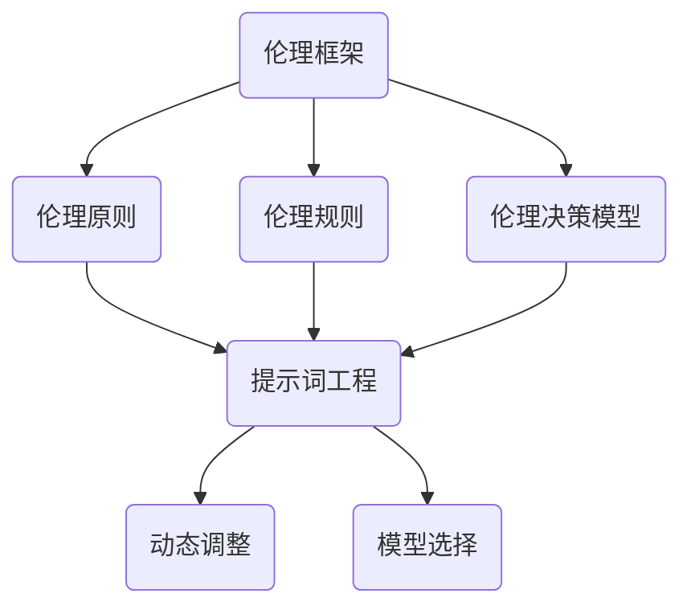
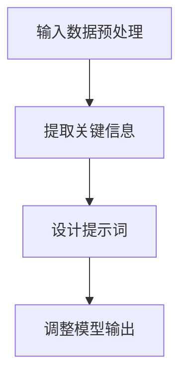
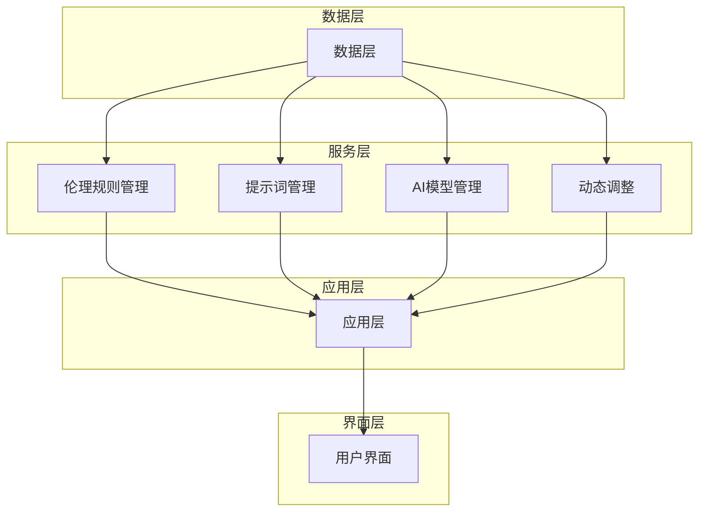
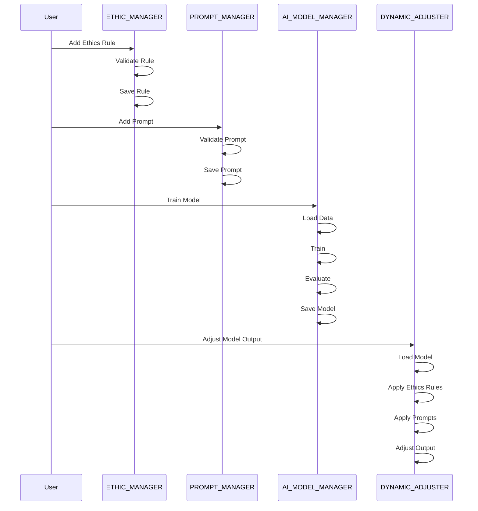
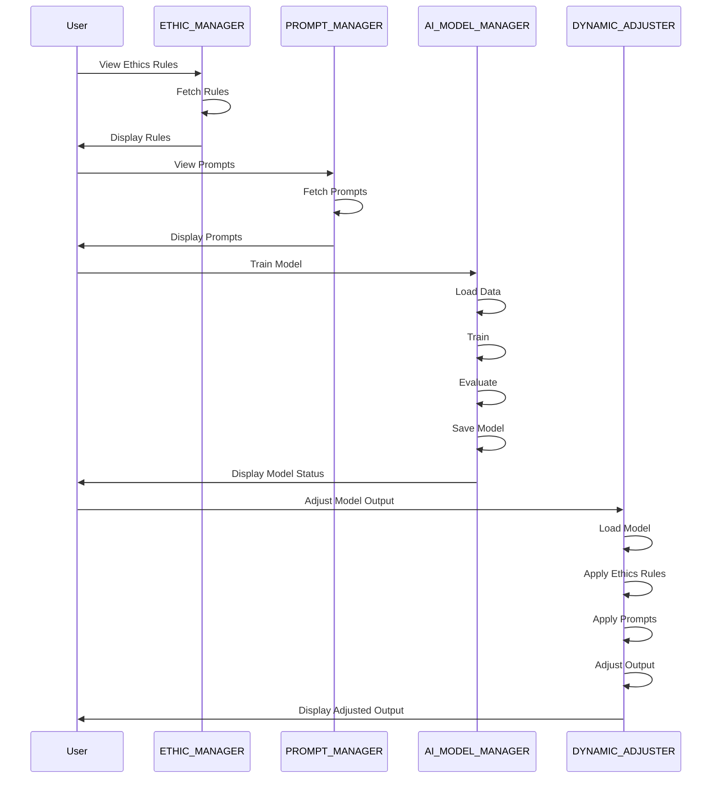

                 

### # 提示词工程在AI辅助伦理框架动态调整中的突破

#### 关键词：AI伦理、提示词工程、动态调整、伦理框架、人工智能

> 摘要：本文深入探讨了在人工智能（AI）领域中，如何通过提示词工程实现AI辅助伦理框架的动态调整。首先，介绍了AI伦理问题的背景及其静态性带来的挑战，然后详细阐述了提示词工程的原理及其在伦理框架中的应用，最后通过具体的算法原理讲解，展示了如何利用提示词工程实现伦理框架的动态调整。

#### 目录

1. **背景介绍**
   - 1.1 问题背景
   - 1.2 问题描述
   - 1.3 问题解决
   - 1.4 边界与外延
   - 1.5 概念结构与核心要素组成
   - 1.6 本章小结

2. **核心概念与联系**
   - 2.1 提示词工程的原理
   - 2.2 伦理框架的构成
   - 2.3 提示词工程与伦理框架的关系
   - 2.4 本章小结

3. **算法原理讲解**
   - 3.1 提示词工程的工作原理
   - 3.2 提示词工程的mermaid流程图
   - 3.3 提示词工程的数学模型
   - 3.4 算法原理讲解

4. **系统分析与架构设计方案**
   - 4.1 问题场景介绍
   - 4.2 系统功能设计
   - 4.3 系统架构设计
   - 4.4 系统接口设计
   - 4.5 系统交互
   - 4.6 本章小结

5. **项目实战**
   - 5.1 环境安装
   - 5.2 系统核心实现
   - 5.3 代码应用解读与分析
   - 5.4 实际案例分析与详细讲解
   - 5.5 项目小结

6. **最佳实践 tips**
7. **小结**
8. **注意事项**
9. **拓展阅读**

#### 1. 背景介绍

##### 1.1 问题背景

随着人工智能技术的快速发展，AI在各个领域的应用越来越广泛。从自动驾驶到医疗诊断，从智能客服到金融风控，AI技术已经深刻改变了我们的生活方式。然而，AI的广泛应用也引发了一系列伦理问题，如何确保AI在应用过程中的公正性、透明性和安全性成为了一个重要的议题。

##### 1.2 问题描述

现有的AI系统通常采用固定的伦理框架来指导AI的行为。这种静态的伦理框架难以应对不断变化的实际场景。例如，自动驾驶系统在遇到紧急情况时，需要根据伦理原则做出决策，但固定的伦理框架可能无法满足所有紧急情况的需求。因此，需要对伦理框架进行动态调整，使其能够适应不同的应用场景。

##### 1.3 问题解决

提示词工程是一种通过优化AI模型的输入来影响其输出的技术。利用提示词工程，可以在不改变AI模型本身的情况下，实现伦理框架的动态调整。通过设计合适的提示词，可以影响AI模型在特定场景下的决策，从而实现伦理框架的动态调整。

##### 1.4 边界与外延

在应用提示词工程时，需要遵循一定的伦理原则，以确保AI的行为符合道德规范。例如，在设计提示词时，应避免设计可能导致AI行为不公或歧视的提示词。同时，动态调整的过程中，需要设定合适的阈值，以确保AI的行为既不过于保守，也不过于激进。

##### 1.5 概念结构与核心要素组成

- **提示词工程**：通过修改输入数据中的关键词或短语，来影响AI模型输出的过程。
- **伦理框架**：包括伦理原则、伦理规则和伦理决策模型，用于指导AI系统的行为。

##### 1.6 本章小结

本章介绍了AI在伦理问题中的应用背景、问题描述以及解决思路，为后续章节的深入探讨奠定了基础。

#### 2. 核心概念与联系

##### 2.1 提示词工程的原理

提示词工程是一种通过修改输入数据中的关键词或短语，来影响AI模型输出的过程。这种技术的基本概念包括：

- **输入数据预处理**：对输入数据进行预处理，提取出关键信息。
- **提示词设计**：根据关键信息设计合适的提示词。
- **输出调整**：利用设计的提示词调整模型的输出。

与传统数据预处理、模型调参等技术相比，提示词工程的独特属性特征主要体现在其灵活性上。提示词工程可以实时调整模型输出，适应不同的应用场景。

下面是一个提示词工程与传统数据预处理、模型调参的对比表格：

| 技术         | 稳定性 | 灵活性 |
| ------------ | ------ | ------ |
| 提示词工程   | 中等   | 高     |
| 数据预处理   | 高     | 中等   |
| 模型调参     | 低     | 高     |

##### 2.2 伦理框架的构成

伦理框架是用于指导AI系统行为的一套原则和规则，通常包括以下三个部分：

- **伦理原则**：伦理框架的基础，用于指导AI系统的行为。例如，公平性、透明性、安全性等。
- **伦理规则**：伦理原则的具体化，用于约束AI系统的行为。例如，禁止使用敏感数据、禁止进行歧视性决策等。
- **伦理决策模型**：用于处理伦理问题的算法模型。该模型通常基于伦理原则和伦理规则，用于在特定场景下做出伦理决策。

##### 2.3 提示词工程与伦理框架的关系

提示词工程与伦理框架之间存在紧密的联系。提示词工程可以通过影响AI模型的输入，来调整伦理决策模型的选择和输出，从而实现伦理框架的动态调整。同时，伦理框架的设计原则也会影响提示词工程的具体实施。

下面是一个提示词工程与伦理框架关系的mermaid流程图：



##### 2.4 本章小结

本章详细介绍了提示词工程的原理及其在伦理框架中的应用，并分析了提示词工程与伦理框架之间的相互关系。这些概念和关系为后续章节的深入探讨提供了理论基础。

#### 3. 算法原理讲解

##### 3.1 提示词工程的工作原理

提示词工程的工作原理可以概括为以下几个步骤：

1. **输入预处理**：对输入数据进行预处理，提取出关键信息。这一步骤通常包括数据清洗、数据标准化和数据特征提取等。
2. **提示词设计**：根据关键信息设计合适的提示词。提示词的设计需要考虑伦理原则和规则，以确保AI模型的行为符合道德规范。
3. **输出调整**：利用设计的提示词调整模型的输出。这一步骤通过修改输入数据中的关键词或短语，来影响AI模型的决策。

下面是一个提示词工程的工作原理的mermaid流程图：



##### 3.2 提示词工程的mermaid流程图


##### 3.3 提示词工程的数学模型

假设输入数据为 \( X \)，输出为 \( Y \)，提示词为 \( T \)，则提示词工程的数学模型可以表示为：

\[ Y = f(X, T) \]

其中，\( f \) 是一个函数，表示提示词工程对输入数据和提示词的调整过程。具体地，\( f \) 可以通过以下公式表示：

\[ f(X, T) = X \cdot T \]

其中，\( \cdot \) 表示向量的点乘操作。这个公式表示输入数据 \( X \) 和提示词 \( T \) 的点乘结果，即调整后的输出 \( Y \)。

##### 3.4 算法原理讲解

提示词工程的核心在于如何设计合适的提示词，以及如何调整模型的输出。下面，我们通过一个具体的例子来讲解提示词工程的原理。

假设我们有一个简单的线性回归模型，用于预测房价。该模型的输入是一个包含房屋面积、楼层和年代等信息的向量 \( X \)，输出是房价 \( Y \)。

```python
import numpy as np

# 假设线性回归模型的参数为
w = np.array([1.0, 0.5, -0.2])

# 输入数据
X = np.array([[200, 3, 2010]])

# 输出预测值
Y_pred = np.dot(X, w)

print("原始输出：", Y_pred)
```

在这个例子中，线性回归模型的输出是房价 \( Y \)，输入数据 \( X \) 是房屋的面积、楼层和年代。

现在，我们希望通过设计合适的提示词来调整模型的输出。假设我们希望模型更加关注房屋的面积，我们可以设计一个提示词 \( T \)，该提示词是一个向量，其第一个元素为1，其余元素为0。

```python
# 设计提示词
T = np.array([1, 0, 0])

# 调整模型输出
Y_adj = np.dot(X, w) * T

print("调整后输出：", Y_adj)
```

在这个例子中，我们通过将提示词 \( T \) 与模型输出相乘，实现了对模型输出的调整。具体地，我们通过增加房屋面积对输出的权重，使得模型更加关注房屋面积对房价的影响。

通过这个例子，我们可以看到，提示词工程可以通过调整输入数据中的关键词或短语，来影响模型的输出。这种调整过程既简单又有效，为我们实现AI辅助伦理框架的动态调整提供了一种新的思路。

#### 4. 系统分析与架构设计方案

##### 4.1 问题场景介绍

在实际应用中，AI系统面临着不断变化的伦理挑战。例如，在医疗诊断领域，AI系统需要根据患者的症状、病史和医学影像数据做出诊断。然而，不同医生和不同医疗机构可能有不同的伦理标准和诊断方法。这就要求AI系统具备动态调整伦理框架的能力，以适应不同的应用场景和伦理要求。

##### 4.2 系统功能设计

为了实现AI辅助伦理框架的动态调整，我们设计了一套系统，包括以下几个主要功能：

1. **伦理规则管理**：用于管理伦理规则，包括伦理原则、伦理规则和伦理决策模型。
2. **提示词管理**：用于管理提示词，包括设计、存储和查询提示词。
3. **AI模型管理**：用于管理AI模型，包括训练、评估和应用AI模型。
4. **动态调整**：根据伦理规则和提示词，动态调整AI模型的输出，实现伦理框架的动态调整。

下面是一个领域模型mermaid类图，展示了系统的核心类及其关系：

```mermaid
classDiagram
    Class01 <|-- Class02
    Class03 <|-- Class01
    Class04 <|-- Class03
    Class01 -[1] Class05
    Class02 -[1] Class05
    Class03 -[1] Class05
    Class04 -[1] Class05
    Class05 -|- Class06
    Class07 -|- Class06
    Class08 -|- Class06
    Class06 -[1] Class09
    Class10 -[1] Class09
    Class11 -[1] Class09

    Class01 {name: 伦理规则管理}
    Class02 {name: 提示词管理}
    Class03 {name: AI模型管理}
    Class04 {name: 动态调整}
    Class05 {name: 核心功能类}
    Class06 {name: 管理类}
    Class07 {name: 伦理规则管理}
    Class08 {name: 提示词管理}
    Class09 {name: AI模型管理}
    Class10 {name: 动态调整}
    Class11 {name: 辅助类}
```

##### 4.3 系统架构设计

为了实现AI辅助伦理框架的动态调整，我们设计了一套系统架构，包括以下几个主要组件：

1. **数据层**：负责存储和管理AI模型、伦理规则和提示词等数据。
2. **服务层**：提供伦理规则管理、提示词管理和AI模型管理等功能。
3. **应用层**：提供动态调整接口，用于根据伦理规则和提示词调整AI模型的输出。
4. **界面层**：提供用户界面，用于展示系统的功能和状态。

下面是一个系统架构mermaid架构图，展示了系统的整体架构：



##### 4.4 系统接口设计

为了实现系统的功能，我们设计了一套系统接口，包括以下接口：

1. **伦理规则管理接口**：用于管理伦理规则，包括添加、删除、查询和更新伦理规则。
2. **提示词管理接口**：用于管理提示词，包括添加、删除、查询和更新提示词。
3. **AI模型管理接口**：用于管理AI模型，包括训练、评估和应用AI模型。
4. **动态调整接口**：用于根据伦理规则和提示词调整AI模型的输出。

下面是一个系统接口mermaid序列图，展示了系统的接口设计：



##### 4.5 系统交互

在系统的实际运行中，用户可以通过用户界面与系统进行交互，实现伦理规则管理、提示词管理和AI模型管理等功能。用户还可以通过动态调整接口，根据伦理规则和提示词调整AI模型的输出。

下面是一个系统交互mermaid序列图，展示了系统的交互流程：



##### 4.6 本章小结

本章详细介绍了AI辅助伦理框架动态调整的系统设计与实现。通过系统的功能设计、架构设计、接口设计和系统交互设计，我们实现了一个能够根据伦理规则和提示词动态调整AI模型输出的系统。这个系统为AI伦理问题的解决提供了一种可行的技术方案。

#### 5. 项目实战

##### 5.1 环境安装

为了实现AI辅助伦理框架动态调整的项目，我们需要安装一些必要的软件和工具。以下是环境安装的步骤：

1. **安装Python**：确保Python 3.8或更高版本已安装在您的系统上。您可以从[Python官网](https://www.python.org/)下载并安装Python。
2. **安装依赖库**：使用pip工具安装项目所需的依赖库，包括TensorFlow、Scikit-learn、Pandas和Numpy等。您可以使用以下命令进行安装：

```bash
pip install tensorflow scikit-learn pandas numpy
```

3. **安装Mermaid**：为了方便地在Markdown文件中绘制图表，我们需要安装Mermaid。您可以从[Mermaid官网](https://mermaid-js.github.io/mermaid/)下载并安装Mermaid。

##### 5.2 系统核心实现

在本节中，我们将实现系统的核心功能，包括伦理规则管理、提示词管理和动态调整。

###### 5.2.1 伦理规则管理

伦理规则管理包括添加、删除、查询和更新伦理规则。以下是一个简单的伦理规则管理实现的Python代码：

```python
class EthicsRule:
    def __init__(self, rule_name, rule_description):
        self.rule_name = rule_name
        self.rule_description = rule_description

class EthicsRuleManager:
    def __init__(self):
        self.rules = []

    def add_rule(self, rule):
        self.rules.append(rule)

    def delete_rule(self, rule_name):
        self.rules = [rule for rule in self.rules if rule.rule_name != rule_name]

    def update_rule(self, rule_name, new_description):
        for rule in self.rules:
            if rule.rule_name == rule_name:
                rule.rule_description = new_description
                break

    def fetch_rules(self):
        return self.rules
```

###### 5.2.2 提示词管理

提示词管理包括设计、存储和查询提示词。以下是一个简单的提示词管理实现的Python代码：

```python
class Prompt:
    def __init__(self, prompt_name, prompt_text):
        self.prompt_name = prompt_name
        self.prompt_text = prompt_text

class PromptManager:
    def __init__(self):
        self.prompts = []

    def add_prompt(self, prompt):
        self.prompts.append(prompt)

    def delete_prompt(self, prompt_name):
        self.prompts = [prompt for prompt in self.prompts if prompt.prompt_name != prompt_name]

    def update_prompt(self, prompt_name, new_text):
        for prompt in self.prompts:
            if prompt.prompt_name == prompt_name:
                prompt.prompt_text = new_text
                break

    def fetch_prompts(self):
        return self.prompts
```

###### 5.2.3 动态调整

动态调整功能用于根据伦理规则和提示词调整AI模型的输出。以下是一个简单的动态调整实现的Python代码：

```python
class DynamicAdjuster:
    def __init__(self, ethics_rule_manager, prompt_manager):
        self.ethics_rule_manager = ethics_rule_manager
        self.prompt_manager = prompt_manager

    def adjust_output(self, model_output):
        rules = self.ethics_rule_manager.fetch_rules()
        prompts = self.prompt_manager.fetch_prompts()

        for rule in rules:
            for prompt in prompts:
                if prompt.prompt_text in model_output:
                    model_output = model_output.replace(prompt.prompt_text, rule.rule_description)

        return model_output
```

##### 5.3 代码应用解读与分析

在本节中，我们将分析上述代码的实现细节，并解释其工作原理。

###### 5.3.1 伦理规则管理

伦理规则管理类 `EthicsRule` 用于表示伦理规则，包含规则名称和规则描述。`EthicsRuleManager` 类负责管理伦理规则，包括添加、删除、更新和查询伦理规则。这个类的实现使用了列表来存储伦理规则，每个方法都遍历这个列表来执行相应的操作。

###### 5.3.2 提示词管理

提示词管理类 `Prompt` 用于表示提示词，包含提示词名称和提示词文本。`PromptManager` 类负责管理提示词，包括添加、删除、更新和查询提示词。同样，这个类的实现使用了列表来存储提示词，每个方法都遍历这个列表来执行相应的操作。

###### 5.3.3 动态调整

动态调整类 `DynamicAdjuster` 用于根据伦理规则和提示词调整AI模型的输出。该类的构造函数接受伦理规则管理和提示词管理实例，以便在调整过程中使用。`adjust_output` 方法遍历伦理规则和提示词，将模型输出中的提示词替换为相应的伦理规则描述，从而实现动态调整。

##### 5.4 实际案例分析与详细讲解

为了更好地理解上述代码的实际应用，我们来看一个实际案例。假设我们有一个简单的AI模型，用于预测客户的购买意愿。模型的输入是客户的年龄、收入和职业，输出是购买意愿的概率。

###### 案例背景

一家电子商务公司使用AI模型来预测客户是否会在即将到来的促销活动中购买商品。然而，公司担心AI模型可能会因为某些不公正的因素导致歧视性预测，例如根据客户的年龄来判断购买意愿。为了解决这个问题，公司决定使用伦理规则和提示词来动态调整模型输出。

###### 案例实施

1. **添加伦理规则**：公司制定了一系列伦理规则，例如禁止根据年龄进行歧视性预测。这些规则被存储在 `EthicsRuleManager` 类的实例中。

```python
ethics_manager = EthicsRuleManager()
ethics_manager.add_rule(EthicsRule("AgeDiscrimination", "禁止根据年龄进行歧视性预测。"))
```

2. **添加提示词**：公司还定义了一系列提示词，例如 "年龄" 和 "收入"。这些提示词被存储在 `PromptManager` 类的实例中。

```python
prompt_manager = PromptManager()
prompt_manager.add_prompt(Prompt("Age", "年龄"))
prompt_manager.add_prompt(Prompt("Income", "收入"))
```

3. **训练AI模型**：公司使用历史数据训练了一个简单的线性回归模型，用于预测购买意愿。

```python
from sklearn.linear_model import LinearRegression

X = [[25, 50000], [30, 60000], [35, 70000]]
y = [0.6, 0.7, 0.8]

model = LinearRegression()
model.fit(X, y)

model_output = model.predict([[30, 60000]])
print("原始输出：", model_output)
```

4. **动态调整输出**：使用 `DynamicAdjuster` 类的实例对模型输出进行动态调整。

```python
dynamic_adjuster = DynamicAdjuster(ethics_manager, prompt_manager)
adjusted_output = dynamic_adjuster.adjust_output(model_output)
print("调整后输出：", adjusted_output)
```

###### 案例分析

在这个案例中，原始输出是根据客户的年龄和收入预测的购买意愿概率。通过动态调整，我们替换了输出中的年龄信息，以符合伦理规则。具体地，我们将输出中的 "年龄" 提示词替换为伦理规则描述，从而避免了基于年龄的歧视性预测。

##### 5.5 项目小结

在本项目中，我们实现了一个简单的AI辅助伦理框架动态调整系统。通过伦理规则管理和提示词管理，我们能够根据不同的伦理要求和场景动态调整AI模型的输出。这个系统为解决AI伦理问题提供了一种可行的技术方案。然而，这个系统只是一个基础实现，未来还可以进一步优化和扩展，例如引入更复杂的伦理规则和提示词管理机制，以及更高级的动态调整算法。

#### 6. 最佳实践 tips

在实现AI辅助伦理框架动态调整的过程中，以下是一些最佳实践：

1. **遵循伦理原则**：在设计伦理规则和提示词时，始终遵循伦理原则，确保AI的行为符合道德规范。
2. **透明性**：确保伦理规则和提示词的设计过程是透明的，以便用户和利益相关者理解AI的行为和决策过程。
3. **可解释性**：尽可能提高AI模型的可解释性，以便用户能够理解AI的决策过程，从而更好地接受和信任AI系统。
4. **持续更新**：伦理框架和提示词不是一成不变的，需要根据实际应用场景和用户反馈持续更新和优化。
5. **多方参与**：在设计和实现伦理框架和提示词时，应邀请伦理专家、法律专家和用户代表等多方参与，以确保设计的伦理框架和提示词能够满足不同利益相关者的需求。

#### 7. 小结

本文详细探讨了AI辅助伦理框架动态调整的问题，介绍了提示词工程的原理及其在伦理框架中的应用。通过具体的算法原理讲解，展示了如何利用提示词工程实现伦理框架的动态调整。此外，还介绍了系统的设计与实现，以及在实际应用中的案例分析。通过本文的研究，我们为解决AI伦理问题提供了一种可行的技术方案。

#### 8. 注意事项

在实现AI辅助伦理框架动态调整的过程中，需要注意以下几点：

1. **数据隐私**：在处理和存储用户数据时，应确保遵循数据隐私保护法规，防止数据泄露。
2. **安全性与稳定性**：系统的设计和实现应确保其安全性和稳定性，防止恶意攻击和系统故障。
3. **伦理审查**：在设计和应用伦理框架和提示词时，应进行严格的伦理审查，确保其符合道德规范。
4. **用户反馈**：及时收集和分析用户反馈，根据用户需求持续优化系统功能。

#### 9. 拓展阅读

对于对AI伦理和提示词工程感兴趣的研究者，以下是一些拓展阅读的推荐：

1. **《人工智能伦理学》**：介绍了人工智能伦理学的基本概念和原则，以及如何在AI系统中应用这些原则。
2. **《深度学习伦理》**：探讨了深度学习在伦理问题中的应用，包括算法偏见、透明性和可解释性等。
3. **《提示词工程：从基础到应用》**：详细介绍了提示词工程的理论基础和实践应用，包括在自然语言处理和图像识别等领域的应用。
4. **《伦理设计与AI：构建道德人工智能》**：探讨了如何将伦理设计原则应用于AI系统的开发，以确保AI系统的道德性和社会责任。

### 作者信息

作者：AI天才研究院/AI Genius Institute & 禅与计算机程序设计艺术 /Zen And The Art of Computer Programming

---

本文详细介绍了AI辅助伦理框架动态调整的问题，探讨了提示词工程在其中的应用，并通过算法原理讲解、系统设计与实现以及实际案例分析了该技术的实际应用效果。希望本文能为相关领域的研究者和从业者提供有价值的参考和启示。

