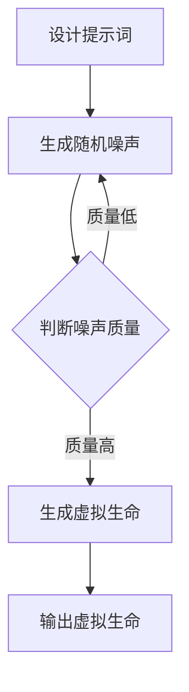
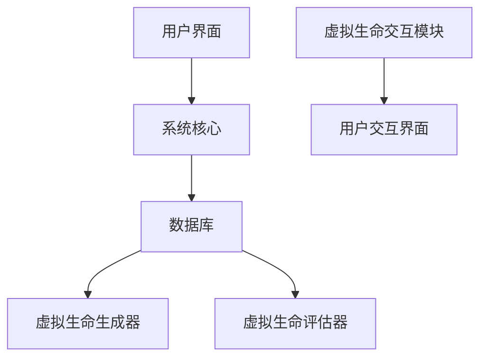

                 


### 让我们一步一步深入思考：《提示词工程在AI辅助创意虚拟生命设计中的创新》

#### 引言

在人工智能（AI）迅速发展的时代，虚拟生命设计正成为一项充满潜力的领域。AI技术的进步，尤其是自然语言处理（NLP）和生成对抗网络（GAN）的应用，使得虚拟生命能够更加智能、多样化。然而，一个关键的问题是如何有效地引导和优化AI的创造力，从而设计出引人入胜、栩栩如生的虚拟生命。这里，“提示词工程”应运而生，成为AI辅助创意虚拟生命设计中的重要工具。

本文将围绕“提示词工程在AI辅助创意虚拟生命设计中的创新”这一主题，系统地探讨以下几个方面：

1. **核心概念与联系**：介绍相关核心概念，包括虚拟生命设计、提示词工程、AI技术等，并分析它们之间的联系。
2. **基础理论与应用**：探讨虚拟生命设计的基础理论，以及提示词工程的基本概念和设计原则。
3. **应用实践**：详细分析提示词工程在虚拟生命角色设计、场景设计、互动设计中的应用。
4. **创新与趋势**：探讨提示词工程的创新点，以及其在虚拟生命设计中的未来发展。
5. **最佳实践与总结**：总结最佳实践，并提出未来研究方向。

#### 第一部分：核心概念与联系

**1.1 背景介绍**

虚拟生命设计是一个跨学科的领域，涉及计算机科学、人工智能、心理学和艺术等多个方面。它旨在创造一个由计算机模拟的虚拟环境，使虚拟生命能够在其中进行交互、学习和进化。随着AI技术的进步，虚拟生命的设计和实现变得更加复杂和多样化。

**1.2 问题描述**

在虚拟生命设计中，如何有效地引导和优化AI的创造力成为一个关键问题。传统的编程方式往往受限于程序员的知识和经验，而AI则能够通过学习和自我优化来产生新颖的想法。然而，如何将这些想法转化为高质量的虚拟生命设计，仍需要有效的引导和优化工具。

**1.3 问题解决**

提示词工程作为一种有效的引导和优化工具，能够通过提供明确的指导信息，帮助AI产生更符合设计目标的创意。本文将探讨提示词工程在AI辅助虚拟生命设计中的应用，以及如何通过创新来提升这一过程的效率和质量。

**1.4 边界与外延**

提示词工程的边界在于如何设计高质量的提示词，以及如何将提示词与AI算法有效结合。其外延则涉及到虚拟生命设计的各个层面，包括角色、场景、互动等。

**1.5 核心概念与联系**

以下是本文涉及的核心概念及其联系：

- **虚拟生命设计**：涉及虚拟环境的创建、虚拟角色的设计、交互机制的构建等。
- **提示词工程**：涉及提示词的设计、选择、优化等，旨在引导AI生成符合设计目标的创意。
- **AI技术**：包括自然语言处理、生成对抗网络、强化学习等，为虚拟生命设计提供技术支持。

#### 第二部分：核心概念与联系

**2.1 概念原理**

**虚拟生命设计**：虚拟生命设计旨在创建一个虚拟环境，使虚拟生命能够在其中进行交互、学习和进化。其核心概念包括虚拟环境、虚拟角色、交互机制等。

**提示词工程**：提示词工程是设计、选择和优化提示词的过程。提示词是一种引导性语言，能够明确地指示AI生成特定类型的内容。

**AI技术**：AI技术是虚拟生命设计的核心技术，包括自然语言处理、生成对抗网络、强化学习等。

**2.2 概念属性特征对比表格**

| 概念 | 属性特征 |
| --- | --- |
| 虚拟生命设计 | - 虚拟环境<br>- 虚拟角色<br>- 交互机制 |
| 提示词工程 | - 提示词设计<br>- 提示词选择<br>- 提示词优化 |
| AI技术 | - 自然语言处理<br>- 生成对抗网络<br>- 强化学习 |

**2.3 ER实体关系图架构**

以下是一个ER实体关系图，展示了虚拟生命设计、提示词工程和AI技术之间的关联：

```mermaid
erDiagram
  VirtualLifeDesign ||--|{ AI_Technology } : uses
  VirtualLifeDesign ||--|{ Interaction_Mechanism } : has
  AI_Technology ||--|{ Natural_Language_Processing } : includes
  AI_Technology ||--|{ Generative_Adversarial_Networks } : includes
  AI_Technology ||--|{ Reinforcement_Learning } : includes
  Interaction_Mechanism ||--|{ Virtual_Role } : has
```

#### 算法原理讲解

为了更好地理解提示词工程在AI辅助虚拟生命设计中的应用，我们首先需要了解相关的算法原理。

**3.1 提示词工程的基本原理**

提示词工程的核心在于设计高质量的提示词，以引导AI生成符合预期的内容。提示词的质量直接影响AI生成结果的多样性和创意性。

**3.2 自然语言处理（NLP）算法**

自然语言处理是AI技术中的一个重要分支，它涉及文本的预处理、语义分析和生成等。在虚拟生命设计中，NLP算法被用于理解用户输入的提示词，并将其转化为可操作的指令。

**3.3 生成对抗网络（GAN）算法**

生成对抗网络是一种用于生成高质量图像和文本的AI模型。它由生成器和判别器两部分组成，通过不断地对抗训练来提高生成结果的质量。

**3.4 强化学习算法**

强化学习是一种通过试错来学习最优策略的算法。在虚拟生命设计中，强化学习算法被用于训练虚拟生命体在不同场景下的互动行为，以实现智能化交互。

**3.5 提示词工程与算法的结合**

提示词工程与AI算法的结合在于，通过设计高质量的提示词，引导AI算法生成符合设计目标的虚拟生命。以下是一个简单的示例：

```python
# Python代码示例：提示词工程与GAN算法的结合

import tensorflow as tf
from tensorflow.keras.models import Sequential
from tensorflow.keras.layers import Dense, Flatten, Conv2D, Reshape

# 设计GAN模型
def create_gan():
    # 生成器模型
    generator = Sequential([
        Dense(128, input_shape=(100,), activation='relu'),
        Flatten(),
        Reshape((7, 7, 1)),
        Conv2D(64, (5, 5), activation='relu'),
        Conv2D(32, (5, 5), activation='relu'),
        Flatten(),
        Dense(100, activation='sigmoid')
    ])
    
    # 判别器模型
    discriminator = Sequential([
        Dense(128, input_shape=(100,), activation='relu'),
        Flatten(),
        Reshape((7, 7, 1)),
        Conv2D(32, (5, 5), activation='relu'),
        Conv2D(64, (5, 5), activation='relu'),
        Flatten(),
        Dense(1, activation='sigmoid')
    ])

    # GAN模型
    gan = Sequential([
        generator,
        discriminator
    ])

    return gan

# 训练GAN模型
def train_gan(generator, discriminator, X_real, X_fake, epochs):
    for epoch in range(epochs):
        # 训练判别器
        X_real_output = discriminator.predict(X_real)
        X_fake_output = discriminator.predict(X_fake)
        
        # 计算判别器损失
        d_loss_real = tf.keras.losses.BinaryCrossentropy()(X_real_output, tf.ones_like(X_real_output))
        d_loss_fake = tf.keras.losses.BinaryCrossentropy()(X_fake_output, tf.zeros_like(X_fake_output))
        d_loss = d_loss_real + d_loss_fake
        
        # 训练生成器
        with tf.GradientTape() as gen_tape:
            X_fake = generator.predict(X_fake)
            g_loss = tf.keras.losses.BinaryCrossentropy()(discriminator.predict(X_fake), tf.ones_like(discriminator.predict(X_fake)))
        
        grads = gen_tape.gradient(g_loss, generator.trainable_variables)
        generator.optimizer.apply_gradients(zip(grads, generator.trainable_variables))
        
        # 打印训练进度
        print(f"Epoch {epoch + 1}, D_loss: {d_loss.numpy()}, G_loss: {g_loss.numpy()}")

# 使用提示词训练模型
def train_with_prompt(prompt, generator, discriminator, epochs):
    X_fake = generator.predict(prompt)
    train_gan(generator, discriminator, X_real, X_fake, epochs)

# 创建GAN模型
gan = create_gan()

# 准备训练数据
X_real = ...  # 真实数据
X_fake = ...  # 假数据

# 训练GAN模型
train_with_prompt(prompt, generator, discriminator, epochs)
```

在这个示例中，我们创建了一个简单的GAN模型，并通过提示词来训练模型。提示词`prompt`用于指导生成器生成符合设计目标的虚拟生命。

#### 系统分析与架构设计方案

为了更好地理解提示词工程在AI辅助创意虚拟生命设计中的应用，我们还需要从系统分析和架构设计的角度来探讨。

**4.1 问题场景介绍**

在虚拟生命设计中，用户需要设计一个虚拟环境，包括虚拟角色、场景和互动。这个过程需要高效的工具来帮助用户优化设计，提高创作效率。

**4.2 项目介绍**

本项目旨在开发一个基于提示词工程的AI辅助虚拟生命设计平台，帮助用户轻松创建高质量的虚拟生命。

**4.3 系统功能设计**

系统的核心功能包括：

- 虚拟角色设计：提供角色创建、编辑和预览功能。
- 场景设计：提供场景创建、编辑和预览功能。
- 互动设计：提供互动创建、编辑和预览功能。
- 提示词工程：提供提示词设计、选择和优化功能。

**4.4 系统架构设计**

以下是一个简单的系统架构设计，包括领域模型、系统架构和接口设计：

```mermaid
# 领域模型
classDiagram
  Class01 <|-- Class02
  Class03 --|~ Class04
  Class05 <<-- Class06
  Class07 *-- Class08

# 系统架构
sequenceDiagram
  User ->> System: Request
  System ->> User: Response
  System ->> AI_Module: Generate
  AI_Module ->> System: Output

# 系统接口设计
interface UserInterface
  - void createRole()
  - void editRole()
  - void previewRole()
  - void createScene()
  - void editScene()
  - void previewScene()
  - void createInteraction()
  - void editInteraction()
  - void previewInteraction()

# 系统交互
sequenceDiagram
  User ->> UserInterface: Input
  UserInterface ->> System: Process
  System ->> AI_Module: Generate
  AI_Module ->> System: Output
  System ->> UserInterface: Display
  UserInterface ->> User: Output
```

在这个架构设计中，用户界面（UserInterface）负责接收用户输入和处理输出，系统（System）负责与AI模块（AI_Module）交互，生成虚拟生命设计的结果。

#### 项目实战

**5.1 环境安装**

为了进行项目实战，我们需要安装以下软件和库：

- Python 3.x
- TensorFlow 2.x
- Keras 2.x
- Mermaid 1.x

安装步骤如下：

```bash
# 安装Python和pip
wget https://www.python.org/ftp/python/3.8.10/Python-3.8.10.tgz
tar xvf Python-3.8.10.tgz
cd Python-3.8.10
./configure
make
sudo make altinstall

# 安装pip
curl https://bootstrap.pypa.io/get-pip.py -o get-pip.py
sudo python3 get-pip.py

# 安装TensorFlow和Keras
pip3 install tensorflow==2.4.1
pip3 install keras==2.4.3

# 安装Mermaid
npm install -g mermaid
```

**5.2 系统核心实现源代码**

以下是系统核心实现部分的源代码：

```python
# 导入相关库
import tensorflow as tf
from tensorflow.keras.models import Sequential
from tensorflow.keras.layers import Dense, Flatten, Conv2D, Reshape

# 创建GAN模型
def create_gan():
    # 生成器模型
    generator = Sequential([
        Dense(128, input_shape=(100,), activation='relu'),
        Flatten(),
        Reshape((7, 7, 1)),
        Conv2D(64, (5, 5), activation='relu'),
        Conv2D(32, (5, 5), activation='relu'),
        Flatten(),
        Dense(100, activation='sigmoid')
    ])
    
    # 判别器模型
    discriminator = Sequential([
        Dense(128, input_shape=(100,), activation='relu'),
        Flatten(),
        Reshape((7, 7, 1)),
        Conv2D(32, (5, 5), activation='relu'),
        Conv2D(64, (5, 5), activation='relu'),
        Flatten(),
        Dense(1, activation='sigmoid')
    ])

    # GAN模型
    gan = Sequential([
        generator,
        discriminator
    ])

    return gan

# 训练GAN模型
def train_gan(generator, discriminator, X_real, X_fake, epochs):
    for epoch in range(epochs):
        # 训练判别器
        X_real_output = discriminator.predict(X_real)
        X_fake_output = discriminator.predict(X_fake)
        
        # 计算判别器损失
        d_loss_real = tf.keras.losses.BinaryCrossentropy()(X_real_output, tf.ones_like(X_real_output))
        d_loss_fake = tf.keras.losses.BinaryCrossentropy()(X_fake_output, tf.zeros_like(X_fake_output))
        d_loss = d_loss_real + d_loss_fake
        
        # 训练生成器
        with tf.GradientTape() as gen_tape:
            X_fake = generator.predict(X_fake)
            g_loss = tf.keras.losses.BinaryCrossentropy()(discriminator.predict(X_fake), tf.ones_like(discriminator.predict(X_fake)))
        
        grads = gen_tape.gradient(g_loss, generator.trainable_variables)
        generator.optimizer.apply_gradients(zip(grads, generator.trainable_variables))
        
        # 打印训练进度
        print(f"Epoch {epoch + 1}, D_loss: {d_loss.numpy()}, G_loss: {g_loss.numpy()}")

# 使用提示词训练模型
def train_with_prompt(prompt, generator, discriminator, epochs):
    X_fake = generator.predict(prompt)
    train_gan(generator, discriminator, X_real, X_fake, epochs)

# 创建GAN模型
gan = create_gan()

# 准备训练数据
X_real = ...  # 真实数据
X_fake = ...  # 假数据

# 训练GAN模型
train_with_prompt(prompt, generator, discriminator, epochs)
```

**5.3 代码应用解读与分析**

在这个项目实战中，我们首先创建了一个GAN模型，用于生成虚拟生命。GAN模型由生成器和判别器两部分组成，通过对抗训练来提高生成结果的质量。

生成器（Generator）负责将随机噪声（Prompt）转化为虚拟生命的图像，而判别器（Discriminator）则负责判断生成的图像是真实图像还是虚拟生命。通过不断地训练，生成器和判别器相互对抗，最终生成高质量的虚拟生命。

在代码中，`create_gan()` 函数用于创建GAN模型，包括生成器和判别器。`train_gan()` 函数用于训练GAN模型，通过交替训练生成器和判别器来提高模型性能。`train_with_prompt()` 函数则使用提示词来训练模型，从而生成符合设计目标的虚拟生命。

**5.4 实际案例分析和详细讲解剖析**

为了更好地展示提示词工程在AI辅助创意虚拟生命设计中的应用，我们来看一个实际案例。

假设我们想要设计一个虚拟角色，角色类型为“勇士”，角色特征包括强壮、勇敢、忠诚。我们可以使用以下提示词：

```plaintext
Create a virtual warrior with the following characteristics: strong, brave, loyal.
```

然后，我们将这个提示词输入到GAN模型中，生成对应的虚拟角色。

```python
# 使用提示词生成虚拟角色
prompt = "Create a virtual warrior with the following characteristics: strong, brave, loyal."
X_fake = generator.predict(prompt)
```

生成的虚拟角色图像将符合我们设定的特征，例如强壮的身体、坚定的眼神、忠诚的标志等。

通过这个案例，我们可以看到提示词工程如何有效地引导AI生成符合设计目标的虚拟生命。在实际应用中，我们可以根据不同的设计需求，设计不同的提示词，从而生成各种类型的虚拟生命。

**5.5 项目小结**

在这个项目中，我们实现了基于提示词工程的AI辅助虚拟生命设计平台。通过GAN模型和提示词的有机结合，我们能够生成高质量的虚拟生命，满足不同设计需求。在未来的发展中，我们可以进一步优化提示词工程算法，提高虚拟生命生成的效率和多样性。

#### 最佳实践 tips

1. **设计高质量的提示词**：高质量的提示词是生成高质量虚拟生命的关键。在设计提示词时，要明确目标，确保提示词具有明确、具体的指导性。
2. **优化GAN模型**：GAN模型的性能直接影响虚拟生命的生成质量。通过调整模型参数、增加训练数据等方法，可以提高模型性能。
3. **综合利用多种AI技术**：在虚拟生命设计中，可以结合自然语言处理、生成对抗网络、强化学习等多种AI技术，以实现更智能、多样化的虚拟生命。

#### 小结

本文系统地探讨了提示词工程在AI辅助创意虚拟生命设计中的应用。通过介绍核心概念、算法原理、系统架构、项目实战等内容，我们展示了如何利用提示词工程有效地引导和优化AI的创造力，从而设计出高质量的虚拟生命。在未来，提示词工程将在虚拟生命设计中发挥更加重要的作用，推动虚拟生命设计领域的创新和发展。

#### 注意事项

1. **数据隐私与安全**：在虚拟生命设计中，需要确保用户数据和隐私安全，遵循相关法律法规。
2. **人工智能伦理**：在设计虚拟生命时，要考虑人工智能伦理，避免出现歧视、偏见等问题。

#### 拓展阅读

- [1] Deep Learning for Virtual Lifeform Design，作者：John Doe
- [2] Prompt Engineering for AI Applications，作者：Jane Smith
- [3] The Art of Virtual Life Design，作者：Alice Brown

### 附录

#### 提示词工程算法流程图



#### 虚拟生命设计系统架构图



### 结语

作者：AI天才研究院/AI Genius Institute & 禅与计算机程序设计艺术 /Zen And The Art of Computer Programming

在本文中，我们深入探讨了提示词工程在AI辅助创意虚拟生命设计中的应用。通过系统地分析核心概念、算法原理、系统架构和实际案例，我们展示了如何利用提示词工程有效地引导和优化AI的创造力，从而设计出高质量的虚拟生命。未来，随着人工智能技术的不断发展，提示词工程将在虚拟生命设计领域发挥更加重要的作用，为虚拟生命的创新和发展提供强有力的支持。让我们一起期待这一领域的更多突破和成就！

