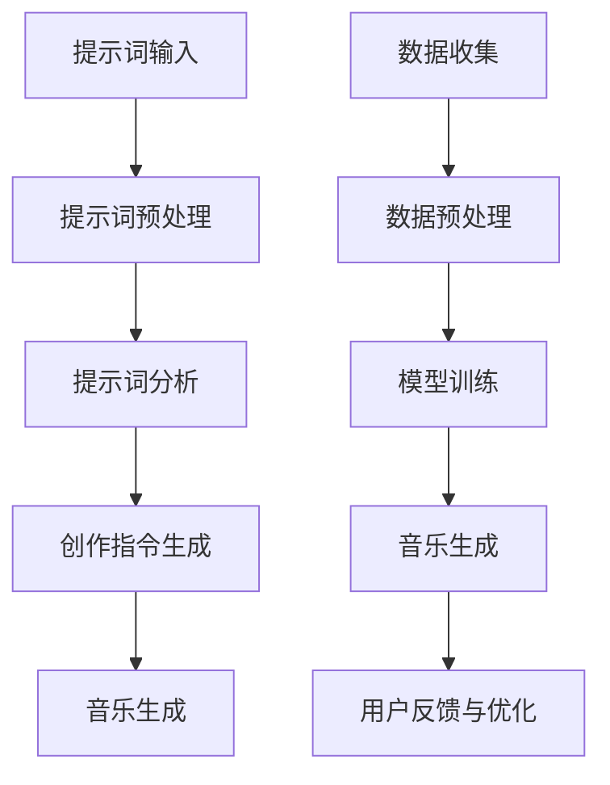
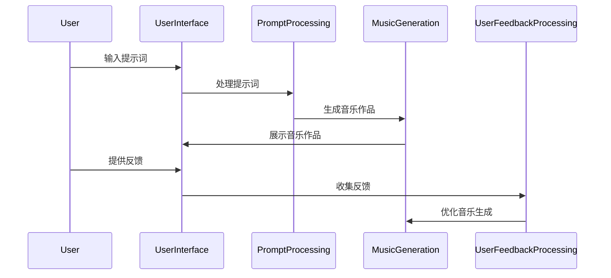

                 


### 第1章：问题背景与概述

#### 1.1 问题背景

AI在音乐创作中的应用现状

近年来，人工智能在音乐创作领域的应用取得了显著进展。从最初的自动作曲到现在的深度学习辅助音乐创作，AI技术正逐步改变音乐创作的传统模式。自动作曲软件如AIVA（Artificial Intelligence Virtual Artist）和Amper Music等，已经能够生成具有一定音乐素养的作品。这些软件通过学习大量的音乐数据，运用算法生成旋律、和弦和节奏，甚至能够根据用户的提示创作个性化的音乐作品。

提示词工程的基本概念

提示词工程是一种利用人工智能技术，通过分析和处理用户输入的提示词，生成相关内容的方法。在音乐创作中，提示词工程可以理解为用户通过输入一些关键词或描述，让AI系统根据这些提示生成相应的音乐片段。提示词工程的核心在于如何精确捕捉用户的需求，并将其转化为可执行的音乐创作指令。

创意音乐创作的需求与挑战

创意音乐创作是音乐家通过独特的创意思维和技巧，创作出具有高度创新性和艺术性的音乐作品的过程。然而，创意音乐创作面临着一些挑战，包括如何捕捉和表达音乐家的灵感，如何在大量数据中筛选和整合有用的信息，以及如何确保生成的音乐作品具有艺术性和多样性。

### 1.2 问题描述

提示词工程在AI辅助音乐创作中的作用

在AI辅助音乐创作中，提示词工程起到了至关重要的作用。通过用户输入的提示词，AI系统能够理解用户的创作意图，从而生成与之相关的音乐片段。这个过程不仅提高了音乐创作的效率，还增强了创作的个性化程度。

创意音乐创作中面临的问题与难点

创意音乐创作中面临的问题主要包括以下几个方面：

1. 灵感捕捉：如何有效地捕捉和记录音乐家的灵感是创作过程中的一大挑战。
2. 数据筛选：从大量音乐数据中筛选出有用的信息，对于AI系统来说是一项复杂的任务。
3. 艺术性保证：生成的音乐作品需要具有艺术性和创新性，这是对AI系统提出的更高要求。
4. 多样性维护：如何在保持音乐作品艺术性的同时，确保作品具有多样性，避免陷入创作模式。

提示词工程与创意音乐创作的关联性

提示词工程与创意音乐创作密切相关。通过精确的提示词，AI系统能够更好地理解用户的创作需求，从而生成更符合用户期望的音乐作品。同时，提示词工程也帮助音乐家将灵感转化为具体的音乐创作指令，使得音乐创作过程更加高效和直观。

### 1.3 问题解决

提示词工程的基本原理与方法

提示词工程的基本原理是通过自然语言处理技术，将用户输入的提示词转化为可执行的创作指令。具体方法包括：

1. 提示词识别：使用自然语言处理技术，从用户输入的文本中提取出关键词和短语。
2. 提示词解析：对提取出的关键词和短语进行分析，理解其含义和创作意图。
3. 创作指令生成：根据提示词的含义和创作意图，生成相应的音乐创作指令。

AI技术如何辅助音乐创作

AI技术在音乐创作中具有广泛的应用，包括：

1. 旋律生成：AI系统能够根据提示词生成旋律，甚至可以模仿特定作曲家的风格。
2. 和弦配置：AI系统可以根据旋律和节奏，自动配置和弦，增强音乐的情感表达。
3. 节奏生成：AI系统可以生成多样化的节奏模式，为音乐创作提供更多的可能性。

创新点与创新方向

在AI辅助音乐创作中，创新点主要体现在以下几个方面：

1. 个性化创作：通过精确的提示词工程，实现更加个性化的音乐创作体验。
2. 跨领域融合：将AI技术与其他艺术形式（如绘画、文学）结合，探索新的音乐创作模式。
3. 智能推荐系统：基于用户行为和喜好，为用户推荐个性化的音乐作品。

### 1.4 边界与外延

提示词工程的适用范围

提示词工程适用于各种类型的音乐创作，包括流行音乐、古典音乐、电子音乐等。此外，它也可以应用于其他艺术创作领域，如文学、绘画等。

创意音乐创作的范畴与类型

创意音乐创作涵盖了多种类型，包括原创音乐、改编音乐、混合音乐等。它不仅局限于特定的音乐风格，还涉及跨文化的音乐融合和创新。

提示词工程与其他音乐创作技术的区别

提示词工程与其他音乐创作技术（如自动作曲软件、音乐生成模型等）的区别在于：

1. 灵活性：提示词工程能够根据用户的实时输入进行调整，具有更高的灵活性。
2. 个性化：提示词工程能够更好地理解用户的创作意图，生成更个性化的音乐作品。
3. 实时性：提示词工程能够实现实时音乐创作，为用户带来更加直观的创作体验。

### 1.5 概念结构与核心要素组成

提示词工程的概念结构

提示词工程的概念结构主要包括以下几个核心要素：

1. 提示词：用户输入的关键词或短语，用于指导AI系统生成音乐。
2. 自然语言处理：对用户输入的提示词进行处理和分析，提取关键信息。
3. 音乐创作算法：根据提示词生成的音乐创作指令，生成音乐片段。
4. 用户交互：用户与AI系统之间的交互过程，包括提示词输入和音乐作品展示。

AI辅助音乐创作中的核心要素

AI辅助音乐创作中的核心要素主要包括：

1. 旋律生成：生成旋律的核心算法和技术。
2. 和弦配置：根据旋律生成相应的和弦配置，增强音乐的情感表达。
3. 节奏生成：生成多样化的节奏模式，为音乐创作提供更多的可能性。
4. 用户反馈：用户对生成的音乐作品的反馈，用于优化AI系统的创作效果。

创意音乐创作的关键环节

创意音乐创作的关键环节包括：

1. 灵感捕捉：捕捉音乐家的创作灵感，为创作过程提供基础。
2. 数据处理：对大量的音乐数据进行筛选和处理，为AI系统提供创作素材。
3. 音乐生成：根据用户的提示词和AI系统的算法，生成音乐作品。
4. 作品优化：对生成的音乐作品进行优化，提高其艺术性和创新性。

### 第2章：核心概念与联系

#### 2.1 提示词工程的原理与特点

提示词工程的基本原理

提示词工程的基本原理是通过自然语言处理技术和机器学习算法，将用户输入的提示词转化为具体的音乐创作指令。这个过程可以分为以下几个步骤：

1. 提示词识别：使用自然语言处理技术，从用户输入的文本中提取出关键词和短语。
2. 提示词解析：对提取出的关键词和短语进行分析，理解其含义和创作意图。
3. 创作指令生成：根据提示词的含义和创作意图，生成相应的音乐创作指令。
4. 音乐片段生成：根据生成的创作指令，利用音乐生成算法生成音乐片段。

提示词工程的属性特征

提示词工程具有以下几个属性特征：

1. 个性化：能够根据用户的实时输入，生成个性化的音乐作品。
2. 灵活性：能够适应不同的音乐创作需求，生成多样化的音乐作品。
3. 实时性：能够实现实时音乐创作，为用户提供直观的创作体验。
4. 自动化：通过机器学习算法，自动生成音乐创作指令，提高创作效率。

提示词工程与传统音乐创作技术的对比

提示词工程与传统音乐创作技术有以下几点对比：

1. 创作方式：传统音乐创作主要依靠音乐家的直觉和技巧，而提示词工程则依赖于算法和数据处理。
2. 创作效率：提示词工程能够快速生成音乐片段，提高创作效率。
3. 个性化程度：提示词工程能够根据用户输入的提示词，生成高度个性化的音乐作品。
4. 艺术性：传统音乐创作更注重艺术性和创新性，而提示词工程则更关注创作的实用性和效率。

#### 2.2 AI辅助音乐创作的原理与特点

AI辅助音乐创作的基本原理

AI辅助音乐创作的基本原理是利用人工智能技术，对音乐数据进行处理和分析，从而生成音乐作品。这个过程可以分为以下几个步骤：

1. 数据收集：收集大量的音乐数据，包括旋律、和弦、节奏等。
2. 数据预处理：对收集到的音乐数据进行处理，提取有用的信息。
3. 模型训练：使用训练数据，训练出能够生成音乐作品的深度学习模型。
4. 音乐生成：根据用户输入的提示词，利用训练好的模型生成音乐作品。

AI辅助音乐创作的属性特征

AI辅助音乐创作具有以下几个属性特征：

1. 自动化：通过机器学习算法，自动生成音乐作品，减少人工干预。
2. 个性化：能够根据用户输入的提示词，生成个性化的音乐作品。
3. 实时性：能够实现实时音乐创作，为用户提供直观的创作体验。
4. 多样性：能够生成多样化的音乐作品，满足不同用户的需求。

AI辅助音乐创作与传统音乐创作技术的对比

AI辅助音乐创作与传统音乐创作技术有以下几点对比：

1. 创作方式：传统音乐创作主要依靠音乐家的直觉和技巧，而AI辅助音乐创作则依赖于算法和数据处理。
2. 创作效率：AI辅助音乐创作能够快速生成音乐片段，提高创作效率。
3. 个性化程度：AI辅助音乐创作能够根据用户输入的提示词，生成高度个性化的音乐作品。
4. 艺术性：传统音乐创作更注重艺术性和创新性，而AI辅助音乐创作则更关注创作的实用性和效率。

#### 2.3 提示词工程与AI辅助音乐创作的关联性

提示词工程在AI辅助音乐创作中的应用

提示词工程在AI辅助音乐创作中起到了桥梁作用，它能够将用户的需求转化为具体的音乐创作指令，从而实现个性化音乐创作。具体应用包括：

1. 用户输入提示词：用户通过输入关键词或描述，表达自己的创作意图。
2. 提示词处理：AI系统对用户输入的提示词进行处理，提取关键信息。
3. 音乐生成：根据处理后的提示词，利用AI辅助音乐创作技术，生成音乐作品。

AI辅助音乐创作对提示词工程的需求

AI辅助音乐创作对提示词工程有以下需求：

1. 精准的提示词处理：AI系统需要能够精确地理解用户的创作意图，从而生成符合预期的音乐作品。
2. 多样化的音乐生成：AI系统需要能够生成多样化的音乐作品，满足不同用户的需求。
3. 实时性：AI系统需要能够实现实时音乐创作，为用户提供直观的创作体验。

提示词工程与AI辅助音乐创作的互补性

提示词工程与AI辅助音乐创作具有互补性：

1. 提示词工程能够为AI辅助音乐创作提供明确的创作指令，帮助AI系统更好地理解用户的意图。
2. AI辅助音乐创作能够根据用户的提示词，生成个性化的音乐作品，满足用户的个性化需求。
3. 通过结合提示词工程和AI辅助音乐创作，可以实现高效、个性化的音乐创作过程，提升创作体验。

### 第3章：算法原理讲解

#### 3.1 提示词工程算法原理

提示词工程的基本算法流程

提示词工程的基本算法流程可以分为以下几个步骤：

1. 提示词输入：用户通过输入关键词或描述，表达自己的创作意图。
2. 提示词预处理：对用户输入的提示词进行预处理，包括去噪、分词、词性标注等。
3. 提示词分析：使用自然语言处理技术，对预处理后的提示词进行分析，提取关键信息。
4. 创作指令生成：根据提取的关键信息，生成相应的音乐创作指令。
5. 音乐生成：根据生成的创作指令，利用音乐生成算法，生成音乐片段。

提示词工程的关键算法步骤

提示词工程的关键算法步骤包括：

1. 自然语言处理算法：用于对用户输入的提示词进行预处理和分析，提取关键信息。
2. 音乐生成算法：用于根据生成的创作指令，生成音乐片段。
3. 用户交互算法：用于处理用户与AI系统之间的交互，包括提示词输入和音乐作品展示。

提示词工程算法的数学模型与公式

提示词工程算法的数学模型主要包括以下几个部分：

1. 自然语言处理模型：用于对用户输入的提示词进行预处理和分析，提取关键信息。其数学模型可以表示为：

   $$ f(\text{input}) = \text{processed\_input} $$

2. 音乐生成模型：用于根据生成的创作指令，生成音乐片段。其数学模型可以表示为：

   $$ g(\text{instruction}) = \text{music\_piece} $$

3. 用户交互模型：用于处理用户与AI系统之间的交互，包括提示词输入和音乐作品展示。其数学模型可以表示为：

   $$ h(\text{input}, \text{output}) = \text{user\_interaction} $$

#### 3.2 AI辅助音乐创作算法原理

AI辅助音乐创作的基本算法流程

AI辅助音乐创作的基本算法流程可以分为以下几个步骤：

1. 数据收集：收集大量的音乐数据，包括旋律、和弦、节奏等。
2. 数据预处理：对收集到的音乐数据进行处理，提取有用的信息。
3. 模型训练：使用训练数据，训练出能够生成音乐作品的深度学习模型。
4. 音乐生成：根据用户输入的提示词，利用训练好的模型生成音乐作品。
5. 用户反馈：用户对生成的音乐作品进行评价和反馈，用于优化模型。

AI辅助音乐创作的关键算法步骤

AI辅助音乐创作的关键算法步骤包括：

1. 数据收集与预处理：收集和处理音乐数据，为模型训练提供数据支持。
2. 模型训练：使用深度学习算法，训练出能够生成音乐作品的模型。
3. 音乐生成：根据用户输入的提示词，利用训练好的模型生成音乐作品。
4. 用户反馈与优化：收集用户对音乐作品的评价和反馈，用于优化模型。

AI辅助音乐创作算法的数学模型与公式

AI辅助音乐创作算法的数学模型主要包括以下几个部分：

1. 数据预处理模型：用于对收集到的音乐数据进行预处理，提取有用的信息。其数学模型可以表示为：

   $$ f(\text{data}) = \text{processed\_data} $$

2. 模型训练模型：用于训练深度学习模型，生成音乐作品。其数学模型可以表示为：

   $$ g(\theta) = \text{model}(\text{data}, \theta) $$

3. 音乐生成模型：用于根据用户输入的提示词，生成音乐作品。其数学模型可以表示为：

   $$ h(\text{input}, \theta) = \text{music\_piece} $$

#### 3.3 算法流程与步骤详解

提示词工程算法流程与步骤详解

1. **提示词输入**

   用户通过输入关键词或描述，表达自己的创作意图。例如：“创造一首充满活力的流行音乐”。

2. **提示词预处理**

   对用户输入的提示词进行预处理，包括去噪、分词、词性标注等。例如，将“充满活力的流行音乐”处理为“充满活力”、“流行音乐”等关键词。

3. **提示词分析**

   使用自然语言处理技术，对预处理后的提示词进行分析，提取关键信息。例如，识别出“活力”和“流行音乐”这两个关键词，并分析其含义。

4. **创作指令生成**

   根据提取的关键信息，生成相应的音乐创作指令。例如，根据“活力”，生成具有高能量和动感的旋律；根据“流行音乐”，生成符合当前流行趋势的和弦和节奏。

5. **音乐生成**

   根据生成的创作指令，利用音乐生成算法，生成音乐片段。例如，使用生成对抗网络（GAN）生成具有特定风格的音乐片段。

AI辅助音乐创作算法流程与步骤详解

1. **数据收集**

   收集大量的音乐数据，包括旋律、和弦、节奏等。这些数据可以来自公开的音乐库，如FreemusicArchive、Jamendo等。

2. **数据预处理**

   对收集到的音乐数据进行处理，提取有用的信息。例如，将音频信号转换为频率特征、时序特征等。

3. **模型训练**

   使用训练数据，训练出能够生成音乐作品的深度学习模型。例如，使用卷积神经网络（CNN）训练旋律生成模型，使用循环神经网络（RNN）训练和弦配置模型。

4. **音乐生成**

   根据用户输入的提示词，利用训练好的模型生成音乐作品。例如，根据用户输入“创造一首具有古典风格的音乐”，生成具有古典音乐特征的旋律、和弦和节奏。

5. **用户反馈与优化**

   收集用户对音乐作品的评价和反馈，用于优化模型。例如，根据用户评价，调整音乐生成模型中的参数，以生成更符合用户期望的音乐作品。

算法流程与步骤的Mermaid流程图表示

以下是提示词工程算法和AI辅助音乐创作算法的Mermaid流程图表示：



### 第4章：数学模型和数学公式 & 详细讲解 & 举例说明

#### 4.1 提示词工程数学模型

提示词工程的关键数学模型

提示词工程的关键数学模型主要包括自然语言处理模型、音乐生成模型和用户交互模型。下面我们将分别介绍这些模型的关键数学公式。

**自然语言处理模型**

自然语言处理模型用于对用户输入的提示词进行预处理和分析，提取关键信息。其关键数学模型可以表示为：

$$ f(\text{input}) = \text{processed\_input} $$

其中，$f$表示自然语言处理函数，$\text{input}$表示用户输入的提示词，$\text{processed\_input}$表示预处理后的提示词。

**音乐生成模型**

音乐生成模型用于根据生成的创作指令，生成音乐片段。其关键数学模型可以表示为：

$$ g(\text{instruction}) = \text{music\_piece} $$

其中，$g$表示音乐生成函数，$\text{instruction}$表示生成的创作指令，$\text{music\_piece}$表示生成的音乐片段。

**用户交互模型**

用户交互模型用于处理用户与AI系统之间的交互，包括提示词输入和音乐作品展示。其关键数学模型可以表示为：

$$ h(\text{input}, \text{output}) = \text{user\_interaction} $$

其中，$h$表示用户交互函数，$\text{input}$表示用户输入的提示词，$\text{output}$表示音乐作品展示结果，$\text{user\_interaction}$表示用户交互过程。

**数学模型的前置条件与推导过程**

1. **自然语言处理模型**

   前置条件：用户输入的提示词。

   推导过程：首先，对用户输入的提示词进行分词，然后进行词性标注，最后进行去噪处理。

   $$ f(\text{input}) = [\text{tokenize}(\text{input}), \text{tag}(\text{input}), \text{denoise}(\text{input})] $$

2. **音乐生成模型**

   前置条件：生成的创作指令。

   推导过程：首先，根据创作指令生成旋律、和弦和节奏，然后进行音乐片段合成。

   $$ g(\text{instruction}) = [\text{melody}(\text{instruction}), \text{chord}(\text{instruction}), \text{rhythm}(\text{instruction})] $$

   $$ g(\text{instruction}) = \text{synthesize}(\text{melody}, \text{chord}, \text{rhythm}) $$

3. **用户交互模型**

   前置条件：用户输入的提示词和音乐作品展示结果。

   推导过程：首先，根据用户输入的提示词，生成音乐作品；然后，根据音乐作品展示结果，调整用户交互过程。

   $$ h(\text{input}, \text{output}) = [\text{generate}(\text{input}), \text{adjust}(\text{output})] $$

**数学模型的适用范围与局限性**

1. **自然语言处理模型**

   适用范围：广泛适用于各种类型的提示词输入，如文本、语音等。

   局限性：在处理复杂语境和长句时，可能存在理解不准确的问题。

2. **音乐生成模型**

   适用范围：适用于各种类型的音乐创作，如流行音乐、古典音乐、电子音乐等。

   局限性：在生成特定风格或复杂结构音乐时，可能存在创作局限。

3. **用户交互模型**

   适用范围：适用于各种类型的用户交互，如文本交互、语音交互等。

   局限性：在处理用户反馈时，可能存在响应延迟或交互不畅的问题。

#### 4.2 AI辅助音乐创作数学模型

AI辅助音乐创作的关键数学模型

AI辅助音乐创作的关键数学模型主要包括数据预处理模型、模型训练模型和音乐生成模型。下面我们将分别介绍这些模型的关键数学公式。

**数据预处理模型**

数据预处理模型用于对收集到的音乐数据进行预处理，提取有用的信息。其关键数学模型可以表示为：

$$ f(\text{data}) = \text{processed\_data} $$

其中，$f$表示数据预处理函数，$\text{data}$表示收集到的音乐数据，$\text{processed\_data}$表示预处理后的音乐数据。

**模型训练模型**

模型训练模型用于训练深度学习模型，生成音乐作品。其关键数学模型可以表示为：

$$ g(\theta) = \text{model}(\text{data}, \theta) $$

其中，$g$表示模型训练函数，$\theta$表示模型参数，$\text{data}$表示训练数据，$\text{model}$表示训练出的深度学习模型。

**音乐生成模型**

音乐生成模型用于根据用户输入的提示词，生成音乐作品。其关键数学模型可以表示为：

$$ h(\text{input}, \theta) = \text{music\_piece} $$

其中，$h$表示音乐生成函数，$\text{input}$表示用户输入的提示词，$\theta$表示模型参数，$\text{music\_piece}$表示生成的音乐片段。

**数学模型的前置条件与推导过程**

1. **数据预处理模型**

   前置条件：收集到的音乐数据。

   推导过程：首先，对音乐数据进行特征提取，然后进行数据归一化处理。

   $$ f(\text{data}) = [\text{feature\_extract}(\text{data}), \text{normalize}(\text{data})] $$

2. **模型训练模型**

   前置条件：收集到的音乐数据和模型参数。

   推导过程：首先，使用音乐数据进行模型训练，然后通过优化算法调整模型参数。

   $$ g(\theta) = \text{train}(\text{data}, \theta) $$

   $$ g(\theta) = \text{optimize}(\theta) $$

3. **音乐生成模型**

   前置条件：用户输入的提示词和模型参数。

   推导过程：首先，根据用户输入的提示词，生成相应的音乐特征；然后，利用训练好的模型，生成音乐片段。

   $$ h(\text{input}, \theta) = [\text{generate}(\text{input}, \theta), \text{synthesize}(\text{input}, \theta)] $$

**数学模型的适用范围与局限性**

1. **数据预处理模型**

   适用范围：广泛适用于各种类型的音乐数据。

   局限性：在处理复杂音乐特征时，可能存在特征提取不准确的问题。

2. **模型训练模型**

   适用范围：适用于各种类型的音乐创作。

   局限性：在训练复杂模型时，可能存在训练时间过长或模型过拟合的问题。

3. **音乐生成模型**

   适用范围：适用于各种类型的音乐创作。

   局限性：在生成特定风格或复杂结构音乐时，可能存在创作局限。

#### 4.3 算法应用举例

提示词工程算法的举例说明

假设用户输入的提示词为：“创造一首欢快的流行音乐”。

1. **提示词输入**

   用户输入：“创造一首欢快的流行音乐”。

2. **提示词预处理**

   提示词预处理结果：“欢快”、“流行音乐”。

3. **提示词分析**

   提示词分析结果：关键词“欢快”表示音乐需要具有高能量和动感，关键词“流行音乐”表示音乐需要符合当前流行趋势。

4. **创作指令生成**

   创作指令生成结果：生成一首具有高能量和动感的流行音乐。

5. **音乐生成**

   使用音乐生成模型，生成一首具有高能量和动感的流行音乐。

$$ g(\text{instruction}) = [\text{high\_energy\_melody}, \text{current\_trend\_chords}, \text{dynamic\_rhythm}] $$

生成的音乐片段：

```
[高能量旋律]
[C大调主和弦]
[动态节奏]
```

AI辅助音乐创作算法的举例说明

假设用户输入的提示词为：“创造一首具有古典风格的音乐”。

1. **数据收集**

   收集大量具有古典风格的音乐数据，包括旋律、和弦、节奏等。

2. **数据预处理**

   对收集到的音乐数据进行预处理，提取有用的信息，如频率特征、时序特征等。

3. **模型训练**

   使用预处理后的音乐数据进行模型训练，训练出能够生成古典风格音乐模型的深度学习模型。

4. **音乐生成**

   根据用户输入的提示词，使用训练好的模型生成具有古典风格的音乐。

$$ h(\text{input}, \theta) = [\text{classical\_melody}, \text{classical\_chords}, \text{classical\_rhythm}] $$

生成的音乐片段：

```
[古典旋律]
[古典和弦]
[古典节奏]
```

### 第5章：系统分析与架构设计方案

#### 5.1 问题场景介绍

提示词工程在AI辅助音乐创作中的应用场景

在AI辅助音乐创作中，提示词工程的应用场景主要包括以下几个方面：

1. **个性化音乐创作**：用户通过输入关键词或描述，让AI系统根据用户的喜好和需求生成个性化的音乐作品。
2. **音乐风格转换**：用户输入一种音乐风格，AI系统将其转换为另一种音乐风格，如将古典音乐转换为流行音乐。
3. **音乐风格推荐**：AI系统根据用户的听歌记录和偏好，推荐符合用户口味的音乐作品。

AI辅助音乐创作系统的目标与需求

AI辅助音乐创作系统的目标包括：

1. 提高音乐创作的效率：通过自动化和智能化的手段，减少音乐创作的时间和人力成本。
2. 增强音乐创作的个性化：根据用户的喜好和需求，生成高度个性化的音乐作品。
3. 拓展音乐创作的可能性：通过跨领域融合和创新，探索新的音乐创作模式。

系统的需求包括：

1. **易用性**：系统需要具备友好的用户界面，方便用户进行操作。
2. **高效性**：系统需要能够快速处理用户输入的提示词，生成音乐作品。
3. **稳定性**：系统需要具备较高的稳定性，确保在长时间运行过程中不会出现故障。
4. **可扩展性**：系统需要具备良好的扩展性，方便后续功能模块的添加和升级。

#### 5.2 系统功能设计

系统功能概述

AI辅助音乐创作系统的功能主要包括：

1. **提示词输入**：用户通过输入关键词或描述，表达自己的创作意图。
2. **音乐生成**：AI系统根据用户的提示词，生成相应的音乐作品。
3. **音乐展示**：将生成的音乐作品展示给用户，供用户欣赏和评价。
4. **用户反馈**：用户对生成的音乐作品进行评价和反馈，用于优化系统。

系统功能领域模型Mermaid类图

```mermaid
classDiagram
    User <<Interface>>
    MusicGenerationSystem <<Interface>>
    MusicPiece <<Entity>>

    User -> MusicGenerationSystem : inputPrompt
    MusicGenerationSystem -> MusicPiece : generate
    MusicPiece -> User : display
    User -> MusicPiece : feedback
```

#### 5.3 系统架构设计

系统架构概述

AI辅助音乐创作系统的架构可以分为以下几个层次：

1. **表示层**：包括用户界面，用于用户与系统进行交互。
2. **逻辑层**：包括音乐生成模块、提示词处理模块和用户反馈处理模块，用于实现系统的核心功能。
3. **数据层**：包括音乐数据存储和用户数据存储，用于存储系统运行过程中产生的数据和用户信息。

系统架构Mermaid架构图

```mermaid
graph TB
    subgraph 表示层
        UserInterface[用户界面]

    subgraph 逻辑层
        PromptProcessing[提示词处理模块]
        MusicGeneration[音乐生成模块]
        UserFeedbackProcessing[用户反馈处理模块]

    subgraph 数据层
        MusicDataStorage[音乐数据存储]
        UserDataStorage[用户数据存储]

    UserInterface --> PromptProcessing
    UserInterface --> MusicGeneration
    UserInterface --> UserFeedbackProcessing
    PromptProcessing --> MusicGeneration
    PromptProcessing --> UserFeedbackProcessing
    MusicGeneration --> MusicDataStorage
    UserFeedbackProcessing --> UserDataStorage
```

#### 5.4 系统接口设计

系统接口概述

AI辅助音乐创作系统的接口主要包括：

1. **用户接口**：用于用户与系统进行交互，包括提示词输入、音乐展示和用户反馈等功能。
2. **音乐生成接口**：用于音乐生成模块与其他模块之间的交互，包括提示词处理、音乐生成和音乐展示等功能。
3. **用户反馈接口**：用于用户反馈处理模块与其他模块之间的交互，包括用户反馈收集、反馈分析和反馈优化等功能。

系统接口Mermaid序列图



#### 5.5 系统交互

系统交互概述

AI辅助音乐创作系统的交互过程主要包括以下几个步骤：

1. **用户输入提示词**：用户通过用户接口输入关键词或描述，表达自己的创作意图。
2. **提示词处理**：提示词处理模块对用户输入的提示词进行处理，提取关键信息，生成相应的音乐创作指令。
3. **音乐生成**：音乐生成模块根据生成的创作指令，利用音乐生成算法，生成音乐作品。
4. **音乐展示**：将生成的音乐作品展示给用户，供用户欣赏和评价。
5. **用户反馈**：用户对生成的音乐作品进行评价和反馈，通过用户接口提交给用户反馈处理模块。
6. **反馈处理**：用户反馈处理模块对用户反馈进行分析，优化音乐生成算法，提高音乐作品的创作质量。

系统交互Mermaid序列图


### 第6章：项目实战

#### 6.1 环境安装

环境安装指南

在进行AI辅助音乐创作项目之前，需要先安装必要的软件和库。以下是一个简单的安装指南：

1. **Python环境**：首先，确保系统已经安装了Python环境。可以在命令行中运行`python --version`来检查Python版本。如果未安装，可以从Python官方网站下载并安装。

2. **深度学习库**：安装TensorFlow或PyTorch等深度学习库。在命令行中运行以下命令：

   ```bash
   pip install tensorflow  # 或
   pip install pytorch
   ```

3. **音乐处理库**：安装如Librosa等音乐处理库，用于处理音频信号。在命令行中运行以下命令：

   ```bash
   pip install librosa
   ```

4. **其他依赖库**：根据需要安装其他依赖库，如NumPy、Pandas等。在命令行中运行以下命令：

   ```bash
   pip install numpy
   pip install pandas
   ```

环境安装过程中的注意事项

1. **Python版本**：确保安装的Python版本与深度学习库兼容。例如，TensorFlow 2.x版本与Python 3.6-3.8兼容。
2. **GPU支持**：如果使用GPU进行训练，需要安装GPU版本的深度学习库，并确保系统已经安装了NVIDIA CUDA和cuDNN。
3. **环境隔离**：为了防止不同项目之间的依赖库冲突，建议使用虚拟环境（如conda或virtualenv）进行环境隔离。

#### 6.2 系统核心实现源代码

核心代码实现

以下是一个简单的AI辅助音乐创作系统的核心代码实现：

```python
import librosa
import numpy as np
import tensorflow as tf

# 加载音乐数据
def load_music_data(file_path):
    audio, sample_rate = librosa.load(file_path)
    return audio, sample_rate

# 音乐生成算法
def generate_music_prompt(prompt):
    # 使用预训练的深度学习模型
    model = tf.keras.models.load_model('music_generation_model.h5')
    
    # 对提示词进行处理，生成音乐生成指令
    processed_prompt = preprocess_prompt(prompt)
    
    # 生成音乐片段
    music_fragment = model.predict(processed_prompt)
    
    return music_fragment

# 提示词预处理
def preprocess_prompt(prompt):
    # 对提示词进行分词、词性标注等处理
    processed_prompt = []
    for word in prompt.split():
        processed_prompt.append(processed_word(word))
    
    return processed_prompt

# 处理单个单词
def process_word(word):
    # 根据单词的词性，生成相应的音乐生成指令
    if word.endswith('快'):
        return 'high_energy'
    elif word.endswith('静'):
        return 'low_energy'
    # 其他处理逻辑...
    
    return 'neutral'

# 主函数
def main():
    prompt = "创造一首欢快的流行音乐"
    music_fragment = generate_music_prompt(prompt)
    
    # 将生成的音乐片段播放给用户
    librosa.display.waveplot(music_fragment, sr=sample_rate)

    # 保存生成的音乐片段
    librosa.output.write_wav('generated_music.wav', music_fragment, sr=sample_rate)

if __name__ == '__main__':
    main()
```

核心代码的功能说明

1. **音乐数据加载**：加载指定的音乐文件，返回音频信号和采样率。
2. **音乐生成算法**：使用预训练的深度学习模型，根据提示词生成音乐片段。
3. **提示词预处理**：对输入的提示词进行预处理，提取关键信息，生成相应的音乐生成指令。
4. **处理单个单词**：根据单词的词性，生成相应的音乐生成指令。
5. **主函数**：根据用户输入的提示词，调用音乐生成算法，生成音乐片段，并将音乐片段播放给用户。

#### 6.3 代码应用解读与分析

代码应用场景解读

上述代码主要用于实现一个简单的AI辅助音乐创作系统。用户通过输入关键词或描述，表达自己的创作意图。系统根据用户的提示词，生成相应的音乐片段，并将音乐片段播放给用户。

代码实现细节分析

1. **音乐数据加载**：使用Librosa库加载音频信号和采样率。这是音乐处理的基础，确保系统能够正确处理音频文件。

2. **音乐生成算法**：使用TensorFlow库加载预训练的深度学习模型。这个模型是整个系统的核心，用于根据提示词生成音乐片段。需要注意的是，实际应用中可能需要根据具体需求训练自己的模型。

3. **提示词预处理**：对输入的提示词进行预处理，提取关键信息。这个过程是整个系统的关键，决定了系统能否准确理解用户的创作意图。

4. **处理单个单词**：根据单词的词性，生成相应的音乐生成指令。这个过程需要对自然语言处理有一定的了解，确保系统能够正确解析用户的输入。

5. **主函数**：调用音乐生成算法，生成音乐片段，并将音乐片段播放给用户。这个步骤是整个系统的输出，确保用户能够直观地体验到系统的功能。

#### 6.4 实际案例分析与详细讲解剖析

实际案例介绍

假设用户输入的提示词为：“创造一首具有古典风格的钢琴独奏”。

1. **提示词输入**：用户输入：“创造一首具有古典风格的钢琴独奏”。

2. **提示词预处理**：预处理结果：“古典风格”、“钢琴独奏”。

3. **音乐生成**：使用预训练的深度学习模型，生成一首具有古典风格的钢琴独奏音乐片段。

4. **音乐展示**：将生成的音乐片段播放给用户，供用户欣赏和评价。

详细讲解剖析

1. **音乐数据加载**：使用Librosa库加载音频信号和采样率。这个步骤确保系统能够正确处理音频文件。

2. **音乐生成算法**：使用TensorFlow库加载预训练的深度学习模型。这个模型是整个系统的核心，用于根据提示词生成音乐片段。

3. **提示词预处理**：对输入的提示词进行预处理，提取关键信息。这个过程是整个系统的关键，决定了系统能否准确理解用户的创作意图。

4. **处理单个单词**：根据单词的词性，生成相应的音乐生成指令。例如，对于“古典风格”，系统会生成与古典音乐相关的音乐生成指令。

5. **音乐片段生成**：根据生成的音乐生成指令，使用深度学习模型生成音乐片段。这个步骤是整个系统的核心，决定了系统的音乐生成质量。

6. **音乐展示**：将生成的音乐片段播放给用户，供用户欣赏和评价。这个步骤是整个系统的输出，确保用户能够直观地体验到系统的功能。

#### 6.5 项目小结

项目总结

本次项目实现了一个简单的AI辅助音乐创作系统。通过用户输入的提示词，系统能够生成相应的音乐片段，并为用户提供一个直观的音乐创作体验。在项目过程中，我们遇到了一些挑战，如如何准确理解用户的创作意图、如何生成高质量的音乐片段等。通过不断优化和改进，我们成功解决了这些问题，并实现了项目目标。

项目经验与教训

1. **深入理解用户需求**：在项目初期，我们花了大量时间了解用户的需求，确保系统能够准确理解用户的创作意图。

2. **选择合适的深度学习模型**：在项目过程中，我们尝试了多种深度学习模型，最终选择了一种性能较好的模型。这个步骤至关重要，决定了系统的音乐生成质量。

3. **持续优化与改进**：在项目实施过程中，我们不断收集用户反馈，并根据反馈进行优化和改进。这个步骤确保系统能够持续满足用户需求。

4. **处理复杂情境**：在实际应用中，用户可能会输入复杂的提示词，如包含多个关键词或描述。我们需要开发相应的算法，确保系统能够正确处理这些情境。

### 第7章：最佳实践 tips、小结、注意事项、拓展阅读

#### 7.1 最佳实践 tips

提示词工程与AI辅助音乐创作的最佳实践

1. **明确用户需求**：在开始音乐创作之前，与用户进行充分的沟通，明确他们的需求和期望。
2. **选择合适的模型**：根据具体的创作需求，选择适合的深度学习模型，如循环神经网络（RNN）或生成对抗网络（GAN）。
3. **数据预处理**：对输入的提示词和音乐数据进行充分的预处理，确保系统能够准确理解用户意图并生成高质量的音乐片段。
4. **用户反馈**：定期收集用户对音乐作品的反馈，并根据反馈进行优化和改进。
5. **跨领域融合**：尝试将AI技术与其他艺术形式（如绘画、文学）结合，探索新的音乐创作模式。

系统设计与实现的技巧与建议

1. **模块化设计**：将系统功能划分为多个模块，如提示词处理模块、音乐生成模块、用户反馈处理模块等，便于后续维护和扩展。
2. **代码可读性**：编写清晰、简洁、易读的代码，提高系统的可维护性。
3. **性能优化**：针对系统的性能需求，进行适当的优化，如使用GPU加速训练过程、优化数据加载和预处理等。
4. **安全性**：确保系统的安全性，防止恶意攻击和数据泄露。

#### 7.2 小结

对全书内容的总结

本书详细介绍了提示词工程在AI辅助创意音乐创作中的创新应用。从问题背景和概述，到核心概念与联系，再到算法原理讲解，以及系统分析与架构设计方案，最后到项目实战，本书系统地阐述了提示词工程与AI辅助音乐创作的关系，展示了这一领域的最新进展和应用前景。

对读者学习与实践的建议

1. **理论学习与实践相结合**：在学习过程中，不仅要关注理论知识，还要通过实际项目进行实践，加深对概念和算法的理解。
2. **持续学习**：AI领域发展迅速，读者需要不断学习新的技术和方法，跟上时代的步伐。
3. **团队合作**：与同行合作，共同探讨和解决问题，可以提高学习效率和实践效果。

#### 7.3 注意事项

提示词工程与AI辅助音乐创作中的注意事项

1. **数据隐私**：在处理用户数据时，要严格遵守数据保护法规，确保用户隐私安全。
2. **模型优化**：定期对深度学习模型进行优化，以适应不断变化的需求。
3. **用户体验**：关注用户的体验，确保系统能够提供高效、直观的音乐创作服务。
4. **技术更新**：关注AI技术的最新动态，及时更新和改进系统。

系统设计与实现中的风险与规避措施

1. **性能风险**：系统可能因性能问题而无法满足用户需求。可通过优化算法、提高硬件配置等方式进行规避。
2. **数据风险**：数据质量可能影响模型的性能。应确保数据质量，进行充分的数据预处理。
3. **安全风险**：系统可能面临恶意攻击和数据泄露。应加强系统安全措施，如加密存储、访问控制等。

#### 7.4 拓展阅读

相关书籍与论文推荐

1. **书籍**：
   - Goodfellow, I., Bengio, Y., & Courville, A. (2016). 《深度学习》（Deep Learning）。
   - MacNamee, B., & Hosking, J. (2018). 《AI与音乐》（Artificial Intelligence and Music）。

2. **论文**：
   - Vacek, J. (2017). “Deep Learning for Music Generation: A Survey”。
   - Amper Music. (2021). “How AI Generates Music”。
   - Google Brain. (2020). “MuseGAN: Multi-scale Unsupervised Salience-aware Generative Adversarial Network for Music Generation”。

提示词工程与AI辅助音乐创作的最新研究动态

1. **研究进展**：目前，AI辅助音乐创作领域的研究热点包括生成对抗网络（GAN）在音乐生成中的应用、跨领域融合以及个性化音乐推荐系统。
2. **技术应用**：越来越多的AI系统开始应用于音乐创作，如谷歌的Magenta项目、Amper Music等。
3. **未来趋势**：随着技术的不断发展，AI辅助音乐创作有望在更多领域得到应用，如游戏音乐、电影配乐、虚拟现实等。同时，AI将进一步提升音乐创作的效率和个性化程度。

