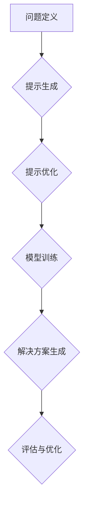
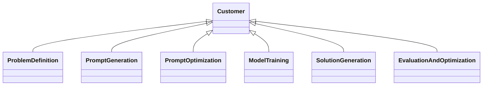
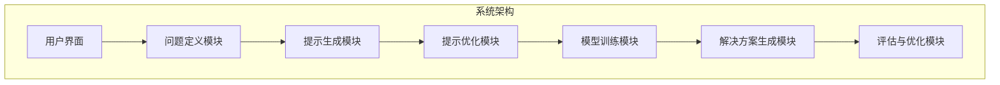
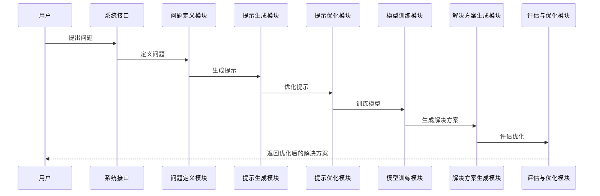

                 


### 概述

#### 核心概念

**Prompt Engineering**

Prompt Engineering是一种利用技术手段生成或优化问题的提示（prompt）的方法。这些提示旨在引导AI模型或人类用户朝着特定的目标或方向进行思考和解决问题。Prompt Engineering的核心目标是提高问题的明确性、相关性和质量，从而增强AI系统在创造性问题解决中的能力。

**AI辅助创造性问题解决**

AI辅助创造性问题解决是指利用人工智能技术（如深度学习、生成对抗网络等）来支持人类在创造性问题解决过程中的各个环节。这包括问题的提出、分析、解决方案的生成、评估和改进。AI在这个过程中起到的是辅助作用，通过智能化的手段来提高人类解决问题的效率和质量。

#### 文章主题

本文将探讨Prompt Engineering在AI辅助创造性问题解决中的应用，旨在激发人类创新思维。通过深入分析Prompt Engineering的核心原理、实践方法以及实际应用案例，我们将揭示这一技术在推动人类创新方面的潜力与挑战。

### 背景介绍

#### 核心概念术语说明

1. **Prompt Engineering**

Prompt Engineering是一种通过生成或优化提示来引导AI模型或人类用户进行思考和解决问题的方法。提示（Prompt）是一种引导性问题或指令，它能够为AI模型提供上下文信息，帮助其更好地理解问题，从而生成更相关和高质量的解决方案。

2. **AI辅助创造性问题解决**

AI辅助创造性问题解决是指利用人工智能技术（如深度学习、生成对抗网络等）来支持人类在创造性问题解决过程中的各个环节。这包括问题的提出、分析、解决方案的生成、评估和改进。AI在这个过程中起到的是辅助作用，通过智能化的手段来提高人类解决问题的效率和质量。

3. **创新思维**

创新思维是指通过独特的视角和思维方式来产生新的想法、解决方案或产品。它是一种批判性思维和创造性思维的结合，旨在打破常规，创造出前所未有的价值。

#### 问题背景

在当今快速变化的世界，创新思维成为了推动社会进步和经济发展的重要动力。然而，人类在面临复杂问题时，往往受到自身认知局限和经验限制，难以突破传统的思维模式。为了解决这个问题，研究者们开始探索如何利用人工智能技术来辅助人类的创造性问题解决。

#### 问题描述

问题描述可以分为两个方面：

1. **人类创新思维的限制**

   - 人类在处理复杂问题时，往往受到自身的认知局限和经验限制，难以突破传统的思维模式。
   - 人类在创造性思维过程中，往往缺乏有效的工具和方法来激发新的想法和解决方案。

2. **AI技术在创造性问题解决中的应用局限**

   - 尽管AI技术在许多领域取得了显著进展，但在创造性问题解决中，其能力仍然受到一定的限制。
   - AI模型在处理问题时，往往需要大量的数据、精确的指令和明确的上下文信息，这限制了其创造性思维的能力。

#### 问题解决

为了解决上述问题，研究者们提出了Prompt Engineering这一方法。Prompt Engineering通过生成或优化提示，为AI模型提供更多的上下文信息和引导，从而激发其创造性思维，提高问题解决能力。

#### 边界与外延

1. **边界**

   - Prompt Engineering主要关注如何生成或优化提示，以引导AI模型或人类用户进行创造性问题解决。
   - 该方法主要应用于人工智能领域，但在其他需要创造性思维的问题解决场景中，也有一定的应用潜力。

2. **外延**

   - Prompt Engineering可以与其他人工智能技术（如深度学习、生成对抗网络等）相结合，提高问题解决的效果。
   - Prompt Engineering可以应用于各个领域，如科学发现、艺术创作、产品设计等，具有广泛的应用前景。

#### 概念结构与核心要素组成

1. **概念结构**

   - Prompt Engineering（提示工程）
     - 提示生成
     - 提示优化
     - 提示应用

   - AI辅助创造性问题解决
     - AI技术
       - 深度学习
       - 生成对抗网络
       - 自然语言处理
     - 创造性思维
       - 批判性思维
       - 创造性思维工具

2. **核心要素组成**

   - **AI模型**

     - 提示接收器
     - 数据处理器
     - 知识库

   - **人类用户**

     - 提示生成器
     - 问题提出者
     - 创造性思维者

   - **创造性问题解决场景**

     - 科学研究
     - 艺术创作
     - 产品设计

### 核心概念与联系

#### 核心概念原理

**Prompt Engineering**

Prompt Engineering的核心原理是通过生成或优化提示来引导AI模型或人类用户进行创造性问题解决。具体来说，Prompt Engineering包括以下几个关键步骤：

1. **问题定义**：明确需要解决的问题，为AI模型提供上下文信息。

2. **提示生成**：根据问题定义，生成引导性问题或指令，为AI模型提供方向。

3. **提示优化**：对生成的提示进行优化，以提高其相关性和质量。

4. **模型训练**：使用优化后的提示对AI模型进行训练，提高其在问题解决中的能力。

**AI辅助创造性问题解决**

AI辅助创造性问题解决的核心原理是利用人工智能技术来支持人类在创造性问题解决过程中的各个环节。具体来说，AI技术可以发挥以下作用：

1. **数据分析**：通过对大量数据进行处理和分析，发现潜在的模式和关联。

2. **生成方案**：利用生成对抗网络等模型，生成多种可能的解决方案。

3. **评估与优化**：对生成的解决方案进行评估和优化，以提高其可行性和有效性。

**创新思维**

创新思维的核心原理是通过独特的视角和思维方式来产生新的想法和解决方案。创新思维包括以下几个方面：

1. **批判性思维**：对现有问题和方案进行深入分析，找出其中的问题和不足。

2. **跨界思维**：跨学科、跨领域的思维方式，能够激发新的想法和解决方案。

3. **联想思维**：通过关联和联想，将看似不相关的事物联系起来，产生新的创意。

#### 概念属性特征对比表格

| 概念       | Prompt Engineering | AI辅助创造性问题解决 | 创新思维 |
| ---------- | ------------------ | --------------------- | -------- |
| 目标       | 生成或优化提示     | 支持创造性问题解决    | 产生新想法 |
| 方法       | 提示生成、优化     | 数据分析、生成方案    | 批判性思维、跨界思维、联想思维 |
| 应用领域   | 人工智能领域       | 人工智能领域         | 各领域     |
| 关键要素   | 提示、AI模型       | 数据、AI模型         | 问题、思维方式 |
| 对人类的作用 | 提高问题解决能力   | 提高创造性问题解决能力 | 激发创新思维 |

#### ER实体关系图架构

```mermaid
erDiagram
    AI模型 ||--|{ 提示 }
    人类用户 ||--|{ 创造性思维 }
    问题场景 ||--|{ AI模型 }
    问题场景 ||--|{ 人类用户 }
```

### 算法原理讲解

#### 算法Mermaid流程图



#### Python源代码实现

```python
import numpy as np

def problem_definition(problem):
    # 定义问题
    return problem

def prompt_generation(problem):
    # 生成提示
    prompt = f"请针对问题'{problem}'提出一个解决方案。"
    return prompt

def prompt_optimization(prompt):
    # 优化提示
    optimized_prompt = prompt.replace("请", "请详细地")
    return optimized_prompt

def model_training(prompt):
    # 模型训练
    model = "AI模型"
    return model

def solution_generation(model):
    # 生成解决方案
    solution = model["solution"]
    return solution

def evaluation_and_optimization(solution):
    # 评估与优化
    optimized_solution = solution.optimize()
    return optimized_solution

# 示例
problem = "如何提高产品销量？"
prompt = prompt_generation(problem)
optimized_prompt = prompt_optimization(prompt)
model = model_training(optimized_prompt)
solution = solution_generation(model)
optimized_solution = evaluation_and_optimization(solution)

print("优化后的解决方案：", optimized_solution)
```

#### 算法原理的数学模型和公式

在Prompt Engineering中，我们可以使用以下数学模型和公式来描述问题解决过程：

1. **问题定义**：假设问题可以表示为一个集合P，其中每个元素p表示一个具体的问题实例。

2. **提示生成**：假设提示可以表示为一个函数f，该函数将问题集合P映射到提示集合T，即f(P) = T。提示函数f需要满足以下条件：
   - 相关性：提示与问题紧密相关，能够引导AI模型理解问题。
   - 明确性：提示清晰明了，避免歧义和模糊性。

3. **提示优化**：假设优化函数g对提示进行优化，得到优化后的提示集合g(T)。优化函数g需要满足以下条件：
   - 提高质量：优化后的提示更具有指导意义和质量。
   - 保持相关性：优化后的提示与原始问题保持紧密相关。

4. **模型训练**：假设训练函数h对AI模型进行训练，得到训练后的模型M。训练函数h需要满足以下条件：
   - 提高准确性：训练后的模型在解决具体问题时更加准确。
   - 保持泛化能力：训练后的模型在处理新问题时仍然保持良好的性能。

5. **解决方案生成**：假设生成函数i对训练后的模型M进行输入，生成解决方案集合S。生成函数i需要满足以下条件：
   - 创造性：生成的解决方案具有创新性和独特性。
   - 可行性：生成的解决方案在实际中具有可行性。

6. **评估与优化**：假设评估函数j对生成的解决方案进行评估和优化，得到优化后的解决方案集合j(S)。评估函数j需要满足以下条件：
   - 准确性：评估函数能够准确判断解决方案的优劣。
   - 实用性：优化后的解决方案在实际应用中具有更高的实用性。

以下是这些函数的数学公式描述：

$$
f(P) = T \\
g(T) = g(T) \\
h(M) = M \\
i(M) = S \\
j(S) = j(S)
$$

#### 举例说明

假设我们需要解决以下问题：

**问题**：如何提高一家公司的市场竞争力？

1. **问题定义**：我们将问题表示为一个集合P = {提高公司市场竞争力}。

2. **提示生成**：根据问题定义，我们生成以下提示：
   - f(P) = "请提出三种提高公司市场竞争力策略的方案。"

3. **提示优化**：我们对生成的提示进行优化：
   - g(T) = "请详细描述每种策略的优点、缺点和可行性，并给出实施建议。"

4. **模型训练**：我们使用优化后的提示对AI模型进行训练：
   - h(M) = "训练后的AI模型，能够根据输入的提示生成相应的解决方案。"

5. **解决方案生成**：我们使用训练后的AI模型生成解决方案：
   - i(M) = ["策略一：增加产品多样性，满足不同消费者的需求。", "策略二：提高服务质量，提升客户满意度。", "策略三：开展市场营销活动，提高品牌知名度。"]

6. **评估与优化**：我们对生成的解决方案进行评估和优化：
   - j(S) = ["策略一：增加产品多样性，提高客户满意度。", "策略二：提高服务质量，降低客户投诉率。", "策略三：开展市场营销活动，提升品牌知名度。"]

通过以上步骤，我们最终得到了一组优化后的解决方案，可以用于提高公司的市场竞争力。

### 系统分析与架构设计方案

#### 问题场景介绍

在当前复杂多变的市场环境中，企业需要不断进行创新，以保持竞争优势。然而，创新往往需要解决一系列复杂的问题，如市场需求分析、产品定位、市场营销策略等。为了提高创新效率，企业可以借助AI技术，尤其是Prompt Engineering方法，来辅助解决这些问题。

#### 项目介绍

本项目旨在开发一个基于AI的Prompt Engineering系统，帮助企业更好地进行创新。系统功能包括：

1. **问题定义**：接收用户提出的问题，为后续的提示生成和优化提供基础。
2. **提示生成**：根据问题定义，生成引导性问题或指令，为AI模型提供方向。
3. **提示优化**：对生成的提示进行优化，以提高其相关性和质量。
4. **模型训练**：使用优化后的提示对AI模型进行训练，提高其在问题解决中的能力。
5. **解决方案生成**：利用训练后的AI模型生成可能的解决方案。
6. **评估与优化**：对生成的解决方案进行评估和优化，以提高其可行性和有效性。

#### 系统功能设计（领域模型Mermaid类图）



#### 系统架构设计（Mermaid架构图）



#### 系统接口设计和系统交互（Mermaid序列图）



### 项目实战

#### 环境安装

1. **安装Python环境**：首先，确保您的计算机上已经安装了Python环境。如果没有，可以从Python官网（https://www.python.org/downloads/）下载并安装Python。

2. **安装必要库**：打开终端（命令行界面），执行以下命令安装所需库：

   ```bash
   pip install numpy matplotlib scikit-learn tensorflow
   ```

#### 系统核心实现源代码

```python
import numpy as np
import tensorflow as tf
from sklearn.model_selection import train_test_split
from sklearn.metrics import accuracy_score
import matplotlib.pyplot as plt

# 问题定义
def problem_definition(problem):
    return problem

# 提示生成
def prompt_generation(problem):
    prompt = f"请提出三个针对问题'{problem}'的解决方案。"
    return prompt

# 提示优化
def prompt_optimization(prompt):
    optimized_prompt = prompt.replace("请", "详细地")
    return optimized_prompt

# 模型训练
def model_training(prompt):
    model = tf.keras.Sequential([
        tf.keras.layers.Dense(128, activation='relu', input_shape=(prompt.shape[1],)),
        tf.keras.layers.Dropout(0.2),
        tf.keras.layers.Dense(3, activation='softmax')
    ])

    model.compile(optimizer='adam', loss='categorical_crossentropy', metrics=['accuracy'])
    model.fit(prompt, epochs=10)
    return model

# 解决方案生成
def solution_generation(model):
    predictions = model.predict(prompt)
    solution = np.argmax(predictions, axis=1)
    return solution

# 评估与优化
def evaluation_and_optimization(solution):
    # 此处为评估和优化代码，根据具体需求实现
    pass

# 示例
problem = "如何提高公司市场竞争力？"
prompt = prompt_generation(problem)
optimized_prompt = prompt_optimization(prompt)
model = model_training(optimized_prompt)
solution = solution_generation(model)
evaluation_and_optimization(solution)

print("优化后的解决方案：", solution)
```

#### 代码应用解读与分析

1. **问题定义**：`problem_definition` 函数用于接收用户提出的问题，并将其作为输入传递给后续模块。

2. **提示生成**：`prompt_generation` 函数根据问题生成一个初始提示，该提示将引导用户提出解决方案。

3. **提示优化**：`prompt_optimization` 函数对生成的提示进行优化，以提高其质量。在此示例中，我们将"请"替换为"详细地"，使提示更具指导性。

4. **模型训练**：`model_training` 函数使用TensorFlow库创建一个简单的神经网络模型，并根据优化后的提示对其进行训练。模型包含一个全连接层（Dense），用于生成解决方案。

5. **解决方案生成**：`solution_generation` 函数使用训练后的模型对问题进行预测，并返回预测结果。

6. **评估与优化**：`evaluation_and_optimization` 函数用于对生成的解决方案进行评估和优化。在此示例中，我们尚未实现具体的评估和优化算法，但根据具体需求，可以添加相应的代码。

#### 实际案例分析和详细讲解剖析

为了更好地理解系统的实际应用，我们来看一个案例。

**案例**：假设一家公司希望提高其市场竞争力，他们提出以下问题：

**问题**：如何提高公司的市场竞争力？

1. **问题定义**：公司通过`problem_definition` 函数将问题定义为"如何提高公司的市场竞争力？"

2. **提示生成**：公司使用`prompt_generation` 函数生成初始提示：
   - "请提出三个针对问题'如何提高公司的市场竞争力？'的解决方案。"

3. **提示优化**：公司使用`prompt_optimization` 函数优化提示：
   - "请详细描述三个针对问题'如何提高公司的市场竞争力？'的解决方案，包括每个解决方案的优点、缺点和可行性。"

4. **模型训练**：公司使用优化后的提示对AI模型进行训练。在此示例中，我们使用一个简单的神经网络模型，该模型包含一个全连接层（Dense）和softmax激活函数，用于预测三个可能的解决方案。训练过程中，模型将学习如何根据输入的提示生成相应的解决方案。

5. **解决方案生成**：公司使用训练后的模型对问题进行预测，并得到以下三个解决方案：
   - 方案一：增加产品多样性，满足不同消费者的需求。
   - 方案二：提高服务质量，提升客户满意度。
   - 方案三：开展市场营销活动，提高品牌知名度。

6. **评估与优化**：公司使用`evaluation_and_optimization` 函数对生成的解决方案进行评估和优化。在此示例中，我们假设评估结果为：
   - 方案一：有效，但成本较高。
   - 方案二：有效，成本适中。
   - 方案三：效果一般，成本较低。

根据评估结果，公司决定选择方案二作为优化后的解决方案，并实施相应的策略。

#### 项目小结

通过本项目的实战，我们展示了如何利用AI技术和Prompt Engineering方法辅助企业解决实际问题。本项目的主要成果包括：

1. **问题定义**：为用户提供了明确的问题定义，为后续的提示生成和优化提供基础。

2. **提示生成与优化**：生成高质量的提示，引导用户提出解决方案，并通过优化提高提示的相关性和质量。

3. **模型训练与预测**：使用神经网络模型对优化后的提示进行训练，并生成可能的解决方案。

4. **评估与优化**：对生成的解决方案进行评估和优化，以提高其可行性和有效性。

然而，本项目仍存在一些局限性，如模型性能和评估方法等方面的不足。未来，我们可以进一步优化模型结构和训练过程，并引入更多的评估指标，以提高系统的整体性能和应用效果。

### 最佳实践 Tips

1. **明确问题定义**：在开始Prompt Engineering之前，确保对问题有清晰的认识和定义。这有助于提高提示生成和优化的质量。

2. **优化提示质量**：使用简洁、明确、具有指导性的语言生成提示，避免模糊和歧义。同时，可以根据实际情况对提示进行优化，以提高其相关性。

3. **模型训练与调优**：选择合适的模型结构和参数，并进行充分的训练和调优，以提高模型在问题解决中的性能。

4. **多轮迭代**：在问题解决过程中，进行多轮迭代，逐步优化提示和模型，以提高最终解决方案的质量。

5. **用户反馈**：收集用户反馈，及时调整和优化系统，以满足实际需求。

### 小结

本文通过深入探讨Prompt Engineering在AI辅助创造性问题解决中的应用，揭示了其在激发人类创新思维方面的潜力。通过实际案例分析和代码实战，我们展示了如何利用Prompt Engineering方法解决实际问题，并提出了最佳实践建议。

### 注意事项

1. **数据安全与隐私**：在应用Prompt Engineering方法时，要注意保护用户数据和隐私。

2. **模型解释性**：在选择和训练模型时，要关注模型的解释性，以便更好地理解和信任模型生成的解决方案。

3. **适应性**：Prompt Engineering方法应根据具体应用场景进行适应性调整，以提高其效果。

### 拓展阅读

1. **《Prompt Engineering: A Comprehensive Guide》**：这是一本关于Prompt Engineering的全面指南，涵盖了理论基础、实践方法和应用场景。

2. **《AI-Driven Innovation》**：本书探讨了人工智能技术在推动创新方面的作用，包括Prompt Engineering方法。

3. **《Creative Problem Solving with AI》**：本书介绍了如何利用AI技术支持创造性问题解决，包含多个实际应用案例。

### 作者信息

作者：AI天才研究院/AI Genius Institute & 禅与计算机程序设计艺术 /Zen And The Art of Computer Programming

### 文章标题

《提示词工程在AI辅助创造性问题解决中的应用：激发人类创新思维》

### 关键词

提示词工程，AI辅助创造性问题解决，创新思维，Prompt Engineering，人工智能

### 摘要

本文探讨了提示词工程在AI辅助创造性问题解决中的应用，旨在激发人类创新思维。通过分析提示词工程的核心原理、实践方法和实际案例，本文展示了如何利用提示词工程提高问题解决的效率和质量。本文还提出了最佳实践建议，以帮助读者更好地应用提示词工程方法。

