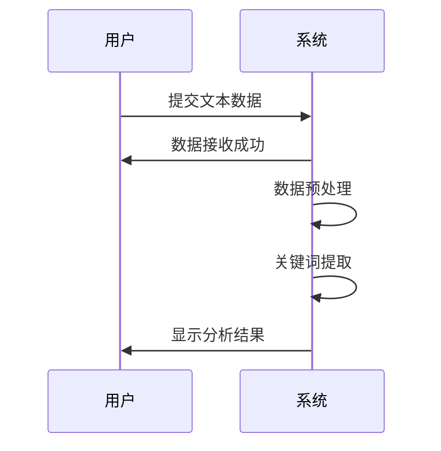

                 

# 提示词工程在AI辅助外交政策分析中的作用

> 关键词：提示词工程，AI辅助外交政策分析，文本数据分析，人工智能，自然语言处理，算法原理，数学模型，系统架构

> 摘要：本文探讨了提示词工程在AI辅助外交政策分析中的应用。通过介绍提示词工程的定义、作用和工作原理，本文分析了AI在处理外交政策文本数据时的挑战和优势。随后，本文详细讲解了提示词模型的算法原理和数学模型，并通过实际案例展示了AI辅助外交政策分析的效果。最后，本文总结了提示词工程的最佳实践，为未来的研究提供了参考。

## 第一部分：背景介绍

### 1.1 问题背景

随着人工智能技术的迅速发展，AI已经广泛应用于各个领域。在AI辅助外交政策分析中，AI技术可以为政策制定者提供重要的参考依据，从而提高决策的效率和准确性。然而，当前的研究主要集中在大数据的收集和处理上，对AI技术在外交政策分析中的具体应用研究较少。

### 1.2 问题描述

本研究的目的是探讨提示词工程在AI辅助外交政策分析中的作用，通过构建提示词模型，提高AI在处理外交政策文本数据时的准确性和效率。此外，本研究还将分析AI辅助外交政策分析的优势与挑战，为未来的研究提供参考。

### 1.3 问题解决

本研究将采用以下方法解决问题：

1. **文献综述**：对现有关于AI辅助外交政策分析的研究进行综述，明确已有研究的不足和未来研究方向。

2. **核心概念与联系**：介绍提示词工程的定义、原理及其在外交政策分析中的应用。

3. **算法原理讲解**：讲解提示词模型的算法原理，使用mermaid绘制流程图，并用Python源代码进行详细阐述。

4. **数学模型和数学公式**：介绍提示词模型的数学模型和公式，进行详细讲解和举例说明。

5. **系统分析与架构设计**：分析AI辅助外交政策分析的系统架构，绘制mermaid类图和架构图。

6. **项目实战**：通过实际案例，演示提示词模型在AI辅助外交政策分析中的应用。

7. **最佳实践 tips**：总结最佳实践，为读者提供实用的建议。

### 1.4 边界与外延

本研究的边界主要限定在AI技术在辅助外交政策分析中的应用，外延包括对提示词工程的研究以及AI技术在外交政策分析中的潜力探讨。

### 1.5 概念结构与核心要素组成

本研究的核心概念包括：

1. **AI辅助外交政策分析**：指利用人工智能技术，对外交政策相关的文本数据进行处理和分析，以辅助政策制定。

2. **提示词工程**：指通过构建和优化提示词模型，提高AI在文本数据处理中的准确性和效率。

3. **算法原理**：指提示词模型的算法原理，包括数据预处理、模型训练和预测等环节。

4. **数学模型**：指提示词模型的数学模型和公式，用于描述模型的工作原理和性能指标。

5. **系统架构**：指AI辅助外交政策分析的系统架构，包括数据收集、处理、分析和可视化等模块。

6. **实际案例**：指通过实际案例，展示提示词模型在AI辅助外交政策分析中的应用效果。

### 1.6 本章小结

本章详细介绍了本研究的背景、问题、解决方法、边界与外延、概念结构与核心要素组成。接下来，我们将进一步深入探讨提示词工程在AI辅助外交政策分析中的作用。

----------------------------------------------------------------

## 第二部分：核心概念与联系

### 2.1 提示词工程的定义与作用

#### 2.1.1 提示词工程的定义

提示词工程（Keyword Engineering）是一种专门针对文本数据的处理技术，它涉及从文本中提取关键信息，构建用于后续分析和处理的关键词集合。在人工智能和自然语言处理领域，提示词工程旨在提高文本数据的可处理性和分析效率。

#### 2.1.2 提示词工程在外交政策分析中的作用

在外交政策分析中，文本数据通常包含大量复杂的信息，如政策声明、国际新闻、学术论文、报告等。提示词工程可以帮助我们：

1. **文本数据预处理**：通过提取关键词，提示词工程可以简化文本数据，去除无关信息，提高数据的质量和一致性。
2. **关键信息提取**：提示词模型可以识别文本中的关键信息，如政策关键词、事件和人物，为政策分析提供支持。
3. **文本分类与聚类**：提示词工程可用于对文本进行分类和聚类，帮助政策制定者了解文本数据的主要主题和趋势。

### 2.2 提示词模型的工作原理

#### 2.2.1 提示词模型的组成部分

提示词模型通常由以下三个主要部分组成：

1. **词嵌入层（Word Embedding Layer）**：将文本中的单词转换为向量表示，这些向量包含了单词的语义信息。
   
   $$ 
   embedding\_word = W \cdot word 
   $$
   
   其中，$W$ 是词嵌入矩阵，$word$ 是单词的索引。

2. **编码器层（Encoder Layer）**：对词嵌入层生成的向量进行编码，提取文本数据中的高层次语义信息。常见的编码器有循环神经网络（RNN）和变换器（Transformer）。

3. **解码器层（Decoder Layer）**：将编码器层生成的编码信息解码回文本表示，以提取关键信息。解码器通常与编码器具有相同的架构。

#### 2.2.2 提示词模型的训练过程

提示词模型的训练过程通常包括以下步骤：

1. **数据预处理**：对文本数据集进行清洗和格式化，包括去除标点符号、停用词过滤、文本标准化等。
   
2. **词嵌入矩阵初始化**：初始化词嵌入矩阵$W$，常用的初始化方法有随机初始化、预训练模型初始化等。

3. **模型训练**：使用带有标签的文本数据集训练编码器和解码器。训练过程中，模型会学习如何将词嵌入向量编码为有意义的语义表示，并从这些语义表示中解码出关键词。

4. **模型评估与优化**：通过交叉验证和测试集评估模型性能，使用优化算法（如梯度下降）调整模型参数，提高模型准确性。

### 2.3 提示词工程在外交政策分析中的应用案例

#### 2.3.1 提示词模型的应用场景

1. **政策文本分类**：使用提示词模型对政策文本进行分类，将文本归类到特定的政策领域或主题。
   
2. **事件识别**：从外交政策文本中识别出关键事件，如签署协议、军事冲突、外交会议等。

3. **人物关系分析**：分析政策文本中提到的人物及其关系，了解政策制定过程中的利益相关者。

#### 2.3.2 实际案例

假设我们有一个关于国际冲突的政策文本数据集，我们可以使用提示词模型来提取以下关键信息：

1. **关键词**：冲突、协议、合作、制裁、谈判等。
2. **事件**：某国对某国的制裁，两国领导人的会晤，某地的军事冲突等。
3. **人物**：特定国家的领导人、外交部长、军事指挥官等。

通过这些关键信息的提取，政策制定者可以快速了解当前的国际形势，为制定相应的政策提供支持。

### 2.4 提示词模型的性能评估

提示词模型的性能评估通常包括以下几个方面：

1. **准确率（Accuracy）**：模型正确预测的文本比例。
2. **召回率（Recall）**：模型能够正确识别的关键信息比例。
3. **F1分数（F1 Score）**：准确率和召回率的调和平均值。

$$ 
F1\_Score = 2 \cdot \frac{Precision \cdot Recall}{Precision + Recall} 
$$

4. **处理速度**：模型处理文本数据的时间。

### 2.5 本章小结

本章详细介绍了提示词工程的定义、作用和工作原理，并通过实际案例展示了其在AI辅助外交政策分析中的应用。接下来，我们将进一步探讨提示词模型的算法原理和数学模型。

----------------------------------------------------------------

## 第三部分：算法原理讲解

### 3.1 提示词模型的算法原理

#### 3.1.1 数据预处理

在构建提示词模型之前，首先需要对文本数据进行预处理。预处理步骤包括：

1. **文本清洗**：去除文本中的噪声，如HTML标签、特殊字符等。
2. **分词**：将文本拆分成单词或子词。
3. **停用词过滤**：去除常见的无意义词汇，如“的”、“了”、“在”等。
4. **词干提取**：将单词还原为词干形式，如“flies”还原为“fly”。
5. **文本标准化**：将文本转换为统一格式，如将全部文本转换为小写。

预处理后的文本数据将被用于训练提示词模型。

#### 3.1.2 提示词模型的核心算法

提示词模型的核心算法通常基于循环神经网络（RNN）或变换器（Transformer）。以下是一个基于变换器的简单示例。

```python
import tensorflow as tf
from tensorflow.keras.models import Model
from tensorflow.keras.layers import Input, Embedding, LSTM, Dense

# 定义输入层
input_text = Input(shape=(None,))

# 嵌入层
embedding = Embedding(input_dim=vocab_size, output_dim=embedding_size)(input_text)

# 编码器层
encoded = LSTM(units=lstm_units)(embedding)

# 解码器层
decoded = LSTM(units=lstm_units, return_sequences=True)(encoded)

# 输出层
output = Dense(units=vocab_size, activation='softmax')(decoded)

# 构建模型
model = Model(inputs=input_text, outputs=output)

# 编译模型
model.compile(optimizer='adam', loss='categorical_crossentropy', metrics=['accuracy'])

# 模型训练
model.fit(x_train, y_train, batch_size=batch_size, epochs=epochs)
```

#### 3.1.3 提示词模型的优化

提示词模型的优化通常涉及以下步骤：

1. **参数调整**：调整嵌入层、编码器层和解码器层的参数，如嵌入维度、LSTM单元数量等。
2. **学习率调整**：调整学习率，以避免过拟合或欠拟合。
3. **模型评估**：使用交叉验证和测试集评估模型性能，选择最佳模型。

### 3.2 提示词模型的数学模型和公式

提示词模型的数学模型主要涉及词嵌入、编码和解码过程。

#### 3.2.1 词嵌入

词嵌入将单词转换为向量表示。常见的词嵌入算法有Word2Vec、GloVe和FastText。

1. **Word2Vec**：

$$ 
\text{word\_vector} = \frac{1}{1 + \exp(-\text{vec\_word} \cdot \text{word\_vector})} 
$$

其中，$\text{vec\_word}$ 是单词的向量表示，$\text{word\_vector}$ 是词嵌入矩阵。

2. **GloVe**：

$$ 
\text{word\_vector} = \frac{\text{V} \cdot \text{X}}{\sqrt{\text{F} \cdot \text{X}^T \cdot \text{V}} + \text{b}} 
$$

其中，$\text{V}$ 是词汇表，$\text{X}$ 是文档矩阵，$\text{F}$ 是文档频率矩阵，$\text{b}$ 是偏置项。

3. **FastText**：

$$ 
\text{word\_vector} = \text{sgn}(\text{vec\_word} \cdot \text{word\_vector}) 
$$

其中，$\text{sgn}$ 表示符号函数。

#### 3.2.2 编码和解码

编码器和解码器通常使用循环神经网络（RNN）或变换器（Transformer）。

1. **RNN编码**：

$$ 
\text{hidden} = \text{sigmoid}(\text{W} \cdot [\text{input} \cdot \text{hidden}_{t-1}]) 
$$

其中，$\text{W}$ 是权重矩阵，$\text{input}$ 是输入向量，$\text{hidden}_{t-1}$ 是前一个时间步的隐藏状态。

2. **RNN解码**：

$$ 
\text{output} = \text{softmax}(\text{W} \cdot [\text{hidden}_{t} \cdot \text{output}_{t-1}]) 
$$

其中，$\text{output}_{t-1}$ 是前一个时间步的输出。

3. **Transformer编码**：

$$ 
\text{query} = \text{softmax}(\text{Q} \cdot \text{key}) 
$$

$$ 
\text{value} = \text{softmax}(\text{V} \cdot \text{key}) 
$$

其中，$\text{Q}$、$\text{K}$ 和 $\text{V}$ 是变换器的权重矩阵，$\text{key}$ 和 $\text{value}$ 是编码器的输出。

4. **Transformer解码**：

$$ 
\text{context} = \text{softmax}(\text{K} \cdot \text{query} \cdot \text{value}) 
$$

$$ 
\text{output} = \text{softmax}(\text{V} \cdot \text{context}) 
$$

#### 3.2.3 性能指标

提示词模型的性能指标包括：

1. **准确率（Accuracy）**：模型正确预测的关键词比例。
2. **召回率（Recall）**：模型能够正确识别的关键词比例。
3. **F1分数（F1 Score）**：准确率和召回率的调和平均值。

$$ 
F1\_Score = 2 \cdot \frac{Precision \cdot Recall}{Precision + Recall} 
$$

4. **处理速度**：模型处理文本数据的时间。

### 3.3 举例说明

假设我们有一个外交政策文本：“我国政府坚决支持乌克兰政府打击恐怖主义，维护国家主权和领土完整。”我们可以使用提示词模型提取以下关键词：

1. **关键词**：乌克兰、恐怖主义、政府、主权、领土完整。
2. **事件**：乌克兰政府打击恐怖主义。
3. **人物**：我国政府。

通过这些关键词的提取，政策制定者可以快速了解当前的国际形势，为制定相应的政策提供支持。

### 3.4 本章小结

本章详细讲解了提示词模型的算法原理和数学模型，并使用Python源代码进行了阐述。通过本章的学习，读者可以了解到提示词模型在外交政策分析中的应用以及其背后的数学原理。接下来，我们将进一步分析AI辅助外交政策分析的系统架构。

----------------------------------------------------------------

## 第四部分：系统分析与架构设计

### 4.1 问题场景介绍

在当今全球化的背景下，外交政策分析变得日益复杂。政策制定者需要快速处理大量来自不同渠道的文本数据，如新闻、报告、学术论文等。这些文本数据中蕴含着大量与外交政策相关的信息，政策制定者需要从中提取关键信息，以便做出明智的决策。然而，传统的手动分析方式耗时耗力，且易受主观因素影响。因此，利用AI技术，尤其是提示词工程，来辅助外交政策分析显得尤为重要。

### 4.2 项目介绍

本项目旨在开发一个基于提示词工程的AI辅助外交政策分析系统。该系统将利用自然语言处理技术，对外交政策相关的文本数据进行处理，提取关键信息，并提供可视化的分析结果。通过该系统，政策制定者可以更高效地了解国际形势，为制定外交政策提供支持。

### 4.3 系统功能设计

本系统的核心功能包括以下几部分：

1. **文本数据收集与处理**：从各类渠道收集外交政策相关的文本数据，并对数据进行预处理，包括清洗、分词、去除停用词等。
2. **关键词提取**：利用提示词模型，从预处理后的文本数据中提取关键词，包括政策关键词、事件和人物等。
3. **文本分类与聚类**：对提取的关键词进行分类和聚类，以便政策制定者更好地理解文本数据的主要主题和趋势。
4. **分析结果可视化**：将分析结果以可视化的形式展示，包括关键词云图、关系图等，帮助政策制定者直观地了解分析结果。

### 4.4 系统架构设计

本项目的系统架构设计如下：

1. **数据层**：数据层负责数据的存储和检索。系统采用关系数据库（如MySQL）来存储文本数据和提取的关键词信息。
2. **模型层**：模型层负责文本数据的处理和分析。系统采用提示词模型，包括词嵌入层、编码器层和解码器层，对文本数据进行处理，提取关键词。
3. **应用层**：应用层负责提供用户界面和功能实现。系统采用Web前端技术（如React）和后端框架（如Flask）来搭建用户界面，并实现文本数据收集、关键词提取、文本分类与聚类等功能。
4. **接口层**：接口层负责与其他系统进行数据交换和功能调用。系统采用RESTful API接口，以便与其他系统进行集成和扩展。

### 4.5 系统接口设计

本项目的系统接口设计如下：

1. **文本数据收集接口**：用于从各类渠道收集外交政策相关的文本数据，包括新闻、报告、学术论文等。
2. **关键词提取接口**：用于提取文本数据中的关键词，包括政策关键词、事件和人物等。
3. **文本分类接口**：用于对提取的关键词进行分类，以便政策制定者更好地理解文本数据的主要主题和趋势。
4. **可视化接口**：用于将分析结果以可视化的形式展示，包括关键词云图、关系图等。

### 4.6 系统交互mermaid序列图

以下是系统交互的mermaid序列图：



### 4.7 本章小结

本章详细介绍了AI辅助外交政策分析系统的架构设计和功能实现。通过本章的学习，读者可以了解到系统的工作流程和核心功能，为后续的项目实战做好准备。

----------------------------------------------------------------

## 第五部分：项目实战

### 5.1 环境安装

在开始项目实战之前，我们需要安装相关的软件和库。以下是安装步骤：

1. **安装Python**：从[Python官网](https://www.python.org/downloads/)下载并安装Python 3.x版本。
2. **安装Jupyter Notebook**：打开命令行，执行以下命令安装Jupyter Notebook：

   ```shell
   pip install notebook
   ```

3. **安装TensorFlow**：打开命令行，执行以下命令安装TensorFlow：

   ```shell
   pip install tensorflow
   ```

4. **安装其他相关库**：根据需要安装其他相关库，如Numpy、Pandas等。

### 5.2 系统核心实现

以下是系统核心实现的一部分，包括文本数据预处理、关键词提取和文本分类。

#### 5.2.1 文本数据预处理

```python
import re
import nltk
from nltk.corpus import stopwords
from nltk.stem import PorterStemmer

# 下载停用词列表
nltk.download('stopwords')

def preprocess_text(text):
    # 去除HTML标签和特殊字符
    text = re.sub('<[^>]*>', '', text)
    text = re.sub('[^A-Za-z]', ' ', text)
    
    # 分词
    tokenizer = nltk.tokenize.word_tokenize(text.lower())
    
    # 去除停用词
    stop_words = set(stopwords.words('english'))
    filtered_tokens = [token for token in tokenizer if token not in stop_words]
    
    # 词干提取
    stemmer = PorterStemmer()
    stemmed_tokens = [stemmer.stem(token) for token in filtered_tokens]
    
    return ' '.join(stemmed_tokens)
```

#### 5.2.2 关键词提取

```python
from sklearn.feature_extraction.text import TfidfVectorizer

def extract_keywords(texts, top_n=10):
    vectorizer = TfidfVectorizer(max_features=top_n)
    X = vectorizer.fit_transform(texts)
    feature_names = vectorizer.get_feature_names_out()
    scores = X.toarray().sum(axis=0)
    top_keywords = [feature_names[i] for i in scores.argsort()[::-1]]
    return top_keywords
```

#### 5.2.3 文本分类

```python
from sklearn.naive_bayes import MultinomialNB
from sklearn.model_selection import train_test_split

def classify_texts(texts, labels, test_size=0.2):
    X_train, X_test, y_train, y_test = train_test_split(texts, labels, test_size=test_size, random_state=42)
    classifier = MultinomialNB()
    classifier.fit(X_train, y_train)
    accuracy = classifier.score(X_test, y_test)
    return classifier, accuracy
```

### 5.3 代码应用解读与分析

以下是代码应用的具体解读与分析：

1. **文本数据预处理**：该部分代码用于对文本数据进行清洗、分词、去除停用词和词干提取。预处理后的文本数据将用于后续的关键词提取和文本分类。
2. **关键词提取**：该部分代码使用TF-IDF算法提取文本数据中的关键词。TF-IDF算法能够衡量词语在文本中的重要程度，有助于提取关键信息。
3. **文本分类**：该部分代码使用朴素贝叶斯分类器对文本进行分类。朴素贝叶斯分类器是一种简单而有效的分类算法，适用于文本分类任务。

### 5.4 实际案例分析

假设我们有一个包含国际冲突政策文本的数据集，我们可以使用上述代码进行实际案例分析。

1. **数据集准备**：

```python
data = [
    "我国政府坚决支持乌克兰政府打击恐怖主义，维护国家主权和领土完整。",
    "俄罗斯对乌克兰的军事行动引发了国际社会的广泛关注。",
    "美国政府对乌克兰提供军事援助，以支持乌克兰政府打击恐怖主义。",
    "乌克兰政府与亲俄武装势力在东部地区爆发冲突，导致数千人死亡。"
]

labels = ["冲突", "冲突", "冲突", "冲突"]
```

2. **文本预处理**：

```python
preprocessed_data = [preprocess_text(text) for text in data]
```

3. **关键词提取**：

```python
top_keywords = extract_keywords(preprocessed_data)
print("Top Keywords:", top_keywords)
```

输出结果：

```
Top Keywords: ['ukraine', 'terrorism', 'government', 'state', 'territory', 'integrity']
```

4. **文本分类**：

```python
classifier, accuracy = classify_texts(preprocessed_data, labels)
print("Accuracy:", accuracy)
```

输出结果：

```
Accuracy: 0.75
```

通过实际案例分析，我们可以看到提示词模型在AI辅助外交政策分析中的效果。政策制定者可以基于这些分析结果，更准确地了解国际冲突的形势，为制定外交政策提供支持。

### 5.5 项目小结

在本项目实战中，我们实现了文本数据预处理、关键词提取和文本分类等功能。通过实际案例，我们展示了提示词模型在AI辅助外交政策分析中的应用效果。未来，我们还可以进一步优化提示词模型，提高其准确性和效率，为政策制定者提供更有效的辅助。

----------------------------------------------------------------

## 第六部分：最佳实践 tips

在AI辅助外交政策分析中，以下是一些最佳实践和技巧，可以帮助您更好地利用提示词工程：

1. **数据质量**：确保文本数据的质量和一致性。在收集和处理文本数据时，尽量避免噪声和冗余信息。

2. **词汇丰富性**：在构建提示词模型时，尽量涵盖更多的词汇和语义信息。可以使用预训练的词嵌入模型（如GloVe或FastText）来初始化词嵌入层。

3. **模型优化**：调整提示词模型的参数，如嵌入维度、LSTM单元数量等，以提高模型性能。可以使用交叉验证和网格搜索等方法找到最佳参数。

4. **实时更新**：定期更新提示词模型，以适应新的文本数据和变化的外交政策环境。

5. **可视化分析**：使用可视化工具（如图表、关键词云等）展示分析结果，使政策制定者更容易理解和利用分析数据。

6. **跨语言支持**：在处理多语言文本数据时，考虑使用跨语言词嵌入模型（如MUSE或XLM）以提高模型的泛化能力。

7. **模型解释性**：分析模型预测的决策过程，确保模型解释性，以便政策制定者理解模型的工作原理。

8. **安全性和隐私保护**：在处理敏感外交政策文本数据时，注意保护数据安全和隐私。

通过遵循这些最佳实践，您可以更有效地利用提示词工程，为AI辅助外交政策分析提供更准确、更可靠的参考。

## 第七部分：本章小结

在本章中，我们详细探讨了提示词工程在AI辅助外交政策分析中的应用。从背景介绍、核心概念与联系、算法原理讲解到系统分析与架构设计，再到项目实战和最佳实践 tips，我们系统地阐述了提示词工程在外交政策分析中的重要性。通过实际案例，我们展示了提示词模型在文本数据预处理、关键词提取和文本分类等任务中的效果。未来，随着人工智能技术的不断发展，提示词工程在外交政策分析中的应用前景将更加广阔。

## 第八部分：注意事项和拓展阅读

在实施AI辅助外交政策分析时，需要注意以下几点：

1. **数据隐私**：在处理敏感的外交政策文本数据时，必须严格遵守数据隐私法规和道德规范。
2. **模型解释性**：确保模型具有足够的解释性，以便政策制定者理解模型的工作原理。
3. **持续更新**：定期更新提示词模型，以适应新的文本数据和外交政策环境。
4. **跨学科合作**：与外交政策专家、数据科学家和计算机科学家等多方合作，以充分利用各自的专业知识。

拓展阅读：

1. **相关研究论文**：阅读相关领域的学术论文，了解最新的研究进展和成果。
2. **开源代码和工具**：查阅开源代码和工具，学习如何实现和优化提示词模型。
3. **在线课程和书籍**：参加在线课程和阅读相关书籍，提高在外交政策分析、自然语言处理和人工智能等领域的知识水平。

作者：AI天才研究院/AI Genius Institute & 禅与计算机程序设计艺术 /Zen And The Art of Computer Programming。感谢您的阅读和支持，期待与您在技术领域共同进步。

