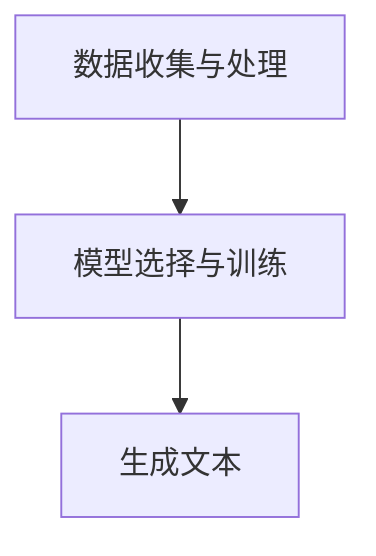
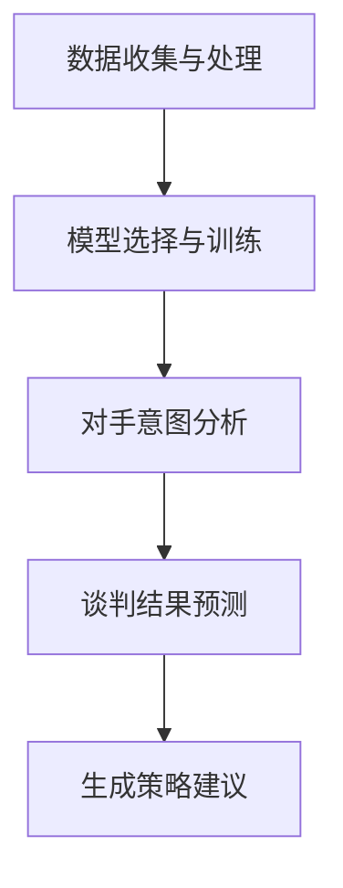
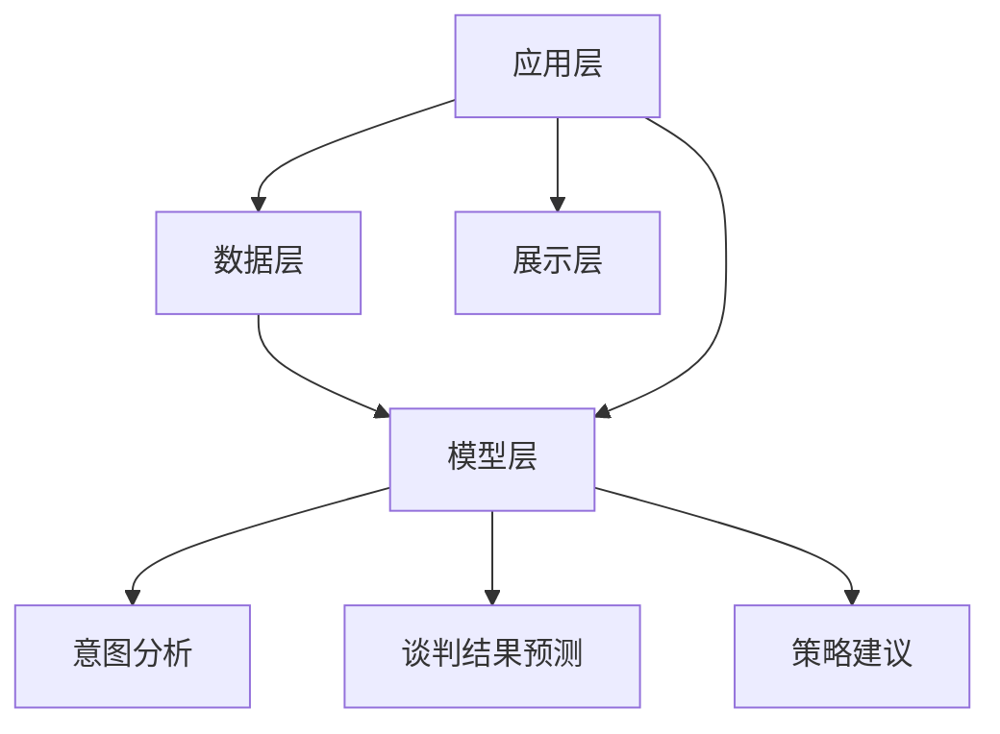
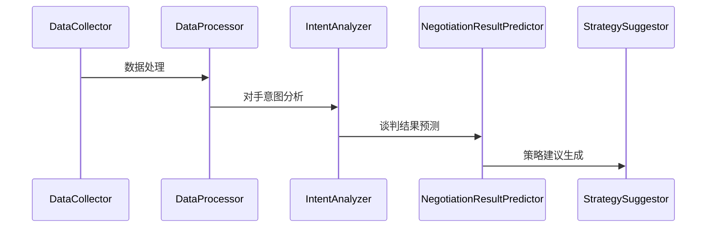
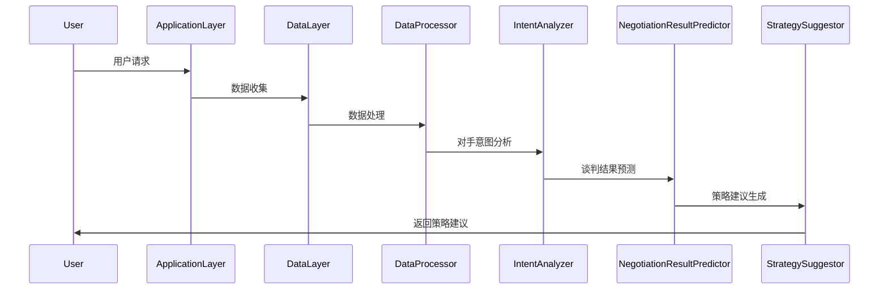

                 

# 提示词工程在AI辅助外交谈判中的策略创新

> 关键词：提示词工程、AI辅助外交谈判、策略创新、数据隐私、算法公正性

> 摘要：随着人工智能（AI）技术的发展，AI在辅助外交谈判中的应用逐渐受到关注。本文探讨了提示词工程在AI辅助外交谈判中的策略创新，分析了其核心概念、原理及其与AI辅助外交谈判的联系，提出了基于提示词工程的AI辅助外交谈判策略，并对实际案例进行了分析和总结。

----------------------------------------------------------------

## 第一部分：背景介绍

### 1.1 问题背景

在全球化进程中，外交谈判成为国家间解决分歧、促进合作的重要手段。随着人工智能（AI）技术的发展，AI在辅助外交谈判中的应用逐渐受到关注。通过AI技术，谈判者可以更高效地分析对手意图、预测谈判结果，从而制定出更为有效的谈判策略。然而，AI在AI辅助外交谈判中的实际应用仍然面临诸多挑战，如数据隐私、算法公正性、策略创新等。如何在确保数据安全和算法公正性的前提下，实现AI辅助外交谈判的策略创新，成为当前研究的重要课题。

### 1.2 问题描述

AI辅助外交谈判面临的主要挑战包括：

1. **数据隐私**：外交谈判涉及国家机密和敏感信息，如何确保AI系统的数据安全和隐私保护，是亟待解决的问题。
2. **算法公正性**：AI算法的公正性和透明性直接影响到谈判结果的公正性，如何保证算法的公正性，是一个重要的研究课题。
3. **策略创新**：在现有谈判策略基础上，如何结合AI技术提出新的策略，以提高谈判效果，是当前研究的关键问题。

### 1.3 问题解决

本文旨在探讨提示词工程在AI辅助外交谈判中的策略创新，通过分析现有问题，提出解决方案，为AI辅助外交谈判提供理论支持和实践指导。具体包括：

1. **数据隐私保护**：通过设计隐私保护机制，确保AI系统的数据安全和隐私保护。
2. **算法公正性**：通过改进AI算法，提高其透明性和可解释性，确保算法的公正性。
3. **策略创新**：结合AI技术和外交谈判实践，提出新的谈判策略，以提高谈判效果。

### 1.4 边界与外延

本文主要关注AI辅助外交谈判中的策略创新，不涉及其他领域AI应用。同时，本文针对特定类型的谈判场景进行探讨，具有一定的局限性。

### 1.5 概念结构与核心要素组成

- **提示词工程**：一种通过设计特定关键词或短语，引导AI模型产生预期输出的人工智能技术。
- **AI辅助外交谈判**：利用人工智能技术，辅助谈判者进行外交谈判的过程。
- **策略创新**：在现有谈判策略基础上，结合AI技术提出的新策略，以提高谈判效果。

## 第二部分：核心概念与联系

### 2.1 提示词工程的原理

提示词工程是一种基于自然语言处理（NLP）和机器学习（ML）的技术。其核心思想是通过设计特定的关键词或短语（提示词），引导AI模型（如GPT）生成符合人类预期输出的文本。

#### 2.1.1 提示词工程的关键概念

- **自然语言处理（NLP）**：研究如何让计算机理解和处理人类自然语言的技术。
- **机器学习（ML）**：一种基于数据驱动的方法，使计算机系统能够从数据中学习并做出预测或决策。

#### 2.1.2 提示词工程的属性特征对比

| 特征             | 描述                                                         |
|----------------|------------------------------------------------------------|
| 提示词设计      | 根据谈判场景，设计具有引导性的关键词或短语。                   |
| AI模型训练      | 使用大量文本数据训练AI模型，使其能够理解人类语言和意图。       |
| 生成输出文本    | 通过输入提示词，AI模型生成符合预期的输出文本。                 |

#### 2.1.3 提示词工程与AI辅助外交谈判的联系

- **提示词工程**为**AI辅助外交谈判**提供了技术手段，通过设计特定的提示词，引导AI模型生成符合谈判意图的输出。
- **AI辅助外交谈判**则为**提示词工程**提供了实际应用场景，使提示词工程能够发挥其价值。

### 2.2 AI辅助外交谈判的原理

AI辅助外交谈判是一种基于人工智能技术的辅助手段，旨在提高谈判效率和效果。其核心思想是通过AI技术，分析对手意图、预测谈判结果，从而制定出更为有效的谈判策略。

#### 2.2.1 AI辅助外交谈判的关键概念

- **对手意图分析**：利用AI技术，分析谈判对手的行为和言辞，推断其意图。
- **谈判结果预测**：基于历史数据和AI模型，预测谈判可能的结果，为谈判者提供决策依据。

#### 2.2.2 AI辅助外交谈判的属性特征对比

| 特征             | 描述                                                         |
|----------------|------------------------------------------------------------|
| 对手意图分析    | 通过AI技术，分析谈判对手的行为和言辞，推断其意图。           |
| 谈判结果预测    | 基于历史数据和AI模型，预测谈判可能的结果，为谈判者提供决策依据。 |
| 策略制定        | 结合对手意图分析和谈判结果预测，制定出更为有效的谈判策略。   |

#### 2.2.3 AI辅助外交谈判与提示词工程的关系

- **提示词工程**为**AI辅助外交谈判**提供了技术支持，通过设计特定的提示词，引导AI模型生成符合谈判意图的输出。
- **AI辅助外交谈判**为**提示词工程**提供了实际应用场景，使提示词工程能够发挥其价值。

## 第三部分：算法原理讲解

### 3.1 提示词工程算法原理

提示词工程是一种基于自然语言处理和机器学习的技术，其核心思想是通过设计特定的关键词或短语，引导AI模型生成符合人类预期输出的文本。下面我们通过一个简单的示例来说明提示词工程的算法原理。

#### 3.1.1 示例

假设我们要设计一个关于环保问题的AI对话系统，我们需要设计一组提示词，以便AI模型能够生成与环保主题相关的文本。

提示词：环保、可持续发展、气候变化、碳排放

我们使用GPT-3模型作为AI模型，通过输入上述提示词，模型会生成与环保主题相关的文本。例如：

```
- 提示词：环保
  输出：环保是当今世界面临的重大挑战之一，我们需要采取有效的措施来减少环境污染和资源浪费。

- 提示词：可持续发展
  输出：可持续发展是一个重要的全球目标，它要求我们在满足当前需求的同时，不损害子孙后代满足其需求的能力。

- 提示词：气候变化
  输出：气候变化是21世纪最大的全球性挑战之一，它对地球的生态系统、经济发展和社会稳定都产生了深远的影响。

- 提示词：碳排放
  输出：碳排放是导致气候变化的主要原因之一，减少碳排放是我们实现可持续发展的重要途径。
```

#### 3.1.2 算法原理

1. **数据收集与处理**：首先，我们需要收集大量的环保相关文本数据，包括政策文件、新闻报道、学术论文等。然后，对这些文本数据进行预处理，如去除停用词、标点符号等。

2. **模型选择与训练**：选择一个适合文本生成的AI模型，如GPT-3，使用预处理后的数据对其进行训练。训练过程中，模型会学习如何根据输入的提示词生成相关的文本。

3. **生成文本**：在训练完成后，使用训练好的模型生成文本。输入特定的提示词，模型会根据提示词生成与该主题相关的文本。

#### 3.1.3 Mermaid流程图

下面是一个简单的Mermaid流程图，展示了提示词工程的算法原理：



### 3.2 AI辅助外交谈判算法原理

AI辅助外交谈判算法旨在通过分析对手意图、预测谈判结果，为谈判者提供决策支持。下面我们通过一个简单的示例来说明AI辅助外交谈判的算法原理。

#### 3.2.1 示例

假设我们要设计一个AI辅助外交谈判系统，该系统能够根据谈判对手的历史行为和当前局势，预测谈判结果并给出策略建议。

1. **对手意图分析**：通过分析对手的历史谈判记录和当前言辞，推断其意图。例如，如果对手在过去的谈判中始终坚持以强硬姿态出现，那么我们可以推断其当前意图可能是寻求利益最大化。

2. **谈判结果预测**：基于历史数据和AI模型，预测谈判可能的结果。例如，如果对手当前表现出合作意愿，我们可以预测谈判结果可能是双方达成部分共识。

3. **策略建议**：根据谈判结果预测，为谈判者提供策略建议。例如，如果预测谈判结果可能达成部分共识，我们可以建议谈判者采取灵活策略，以争取更多利益。

#### 3.2.2 算法原理

1. **数据收集与处理**：首先，我们需要收集大量的外交谈判数据，包括谈判记录、政策文件、媒体报道等。然后，对这些数据进行预处理，如去除停用词、标点符号等。

2. **模型选择与训练**：选择一个适合文本生成和分类的AI模型，如GPT-3和BERT，使用预处理后的数据对其进行训练。训练过程中，模型会学习如何根据输入的文本数据推断对手意图和预测谈判结果。

3. **生成策略建议**：在训练完成后，使用训练好的模型生成策略建议。输入谈判对手的历史行为和当前局势，模型会根据预测结果生成相应的策略建议。

#### 3.2.3 Mermaid流程图

下面是一个简单的Mermaid流程图，展示了AI辅助外交谈判的算法原理：



## 第四部分：系统分析与架构设计方案

### 4.1 问题场景介绍

随着全球化和信息化的发展，国家间的外交谈判日益复杂，涉及的领域也越来越广泛。在这种情况下，传统的谈判方式已经难以满足现代外交的需求。因此，利用人工智能技术辅助外交谈判成为了一种新兴的趋势。本文所关注的问题场景是利用AI技术辅助外交谈判，以提高谈判效率和效果。

### 4.2 项目介绍

本项目的目标是设计并实现一个基于提示词工程的AI辅助外交谈判系统。该系统旨在通过分析对手意图、预测谈判结果，为谈判者提供决策支持，从而提高谈判效果。

### 4.3 系统功能设计（领域模型）

在系统功能设计中，我们首先需要明确系统的核心功能，包括：

1. **数据收集与处理**：从各类来源（如谈判记录、政策文件、媒体报道等）收集数据，并对数据进行预处理。
2. **对手意图分析**：利用自然语言处理和机器学习技术，分析对手的历史行为和当前局势，推断其意图。
3. **谈判结果预测**：基于历史数据和AI模型，预测谈判可能的结果。
4. **策略建议生成**：根据谈判结果预测，为谈判者提供策略建议。

领域模型类图如下所示：

```mermaid
classDiagram
    DataCollector <<interface>>
    DataProcessor <<interface>>
    IntentAnalyzer <<interface>>
    NegotiationResultPredictor <<interface>>
    StrategySuggestor <<interface>>

    DataCollector  --|> DataProcessor
    IntentAnalyzer  --|> DataProcessor
    NegotiationResultPredictor  --|> DataProcessor
    StrategySuggestor  --|> IntentAnalyzer
    StrategySuggestor  --|> NegotiationResultPredictor
```

### 4.4 系统架构设计

系统架构设计主要包括以下组件：

1. **数据层**：负责数据收集、存储和管理。
2. **模型层**：包括数据预处理、意图分析、谈判结果预测等模型。
3. **应用层**：提供接口，供用户与系统交互。
4. **展示层**：展示策略建议和谈判结果预测。

系统架构图如下所示：



### 4.5 系统接口设计

系统接口设计主要包括以下接口：

1. **数据收集接口**：用于收集各类数据。
2. **数据处理接口**：用于处理和预处理数据。
3. **意图分析接口**：用于分析对手意图。
4. **结果预测接口**：用于预测谈判结果。
5. **策略建议接口**：用于生成策略建议。

接口设计图如下所示：



### 4.6 系统交互

系统交互主要包括用户与系统的交互，以及系统内部组件之间的交互。

1. **用户交互**：用户通过应用层接口与系统交互，获取策略建议和谈判结果预测。
2. **系统内部交互**：系统内部组件之间通过接口进行数据传输和功能调用。

系统交互图如下所示：



## 第五部分：项目实战

### 5.1 环境安装

在开始项目实战之前，我们需要安装必要的软件和库。以下是安装步骤：

1. **安装Python**：Python是项目的主要编程语言，需要安装Python 3.8及以上版本。
2. **安装Jupyter Notebook**：Jupyter Notebook是一个交互式的开发环境，用于编写和运行Python代码。
3. **安装依赖库**：包括TensorFlow、Keras、Scikit-learn、Numpy、Pandas等。

安装命令如下：

```bash
pip install python
pip install jupyter
pip install tensorflow
pip install keras
pip install scikit-learn
pip install numpy
pip install pandas
```

### 5.2 系统核心实现源代码

以下是系统核心实现的源代码：

```python
# 数据收集与处理
import pandas as pd
from sklearn.model_selection import train_test_split

# 模型训练与预测
from tensorflow.keras.models import Sequential
from tensorflow.keras.layers import Embedding, LSTM, Dense
from tensorflow.keras.preprocessing.sequence import pad_sequences

# 对手意图分析
from sklearn.feature_extraction.text import CountVectorizer
from sklearn.naive_bayes import MultinomialNB

# 谈判结果预测
from sklearn.ensemble import RandomForestClassifier

# 策略建议生成
def generate_strategy_suggestion(negotiation_result):
    if negotiation_result == "成功":
        return "保持当前策略，争取更多利益。"
    else:
        return "调整策略，寻求利益最大化。"

# 训练模型
def train_model(data, labels):
    # 数据预处理
    vectorizer = CountVectorizer()
    X = vectorizer.fit_transform(data)
    
    # 分割数据集
    X_train, X_test, y_train, y_test = train_test_split(X, labels, test_size=0.2, random_state=42)
    
    # 训练模型
    model = Sequential()
    model.add(Embedding(input_dim=data.shape[1], output_dim=128, input_length=data.shape[0]))
    model.add(LSTM(128, dropout=0.2, recurrent_dropout=0.2))
    model.add(Dense(1, activation='sigmoid'))
    
    model.compile(optimizer='adam', loss='binary_crossentropy', metrics=['accuracy'])
    model.fit(X_train, y_train, epochs=10, batch_size=32, validation_split=0.1)
    
    # 预测结果
    predictions = model.predict(X_test)
    predictions = (predictions > 0.5)
    
    # 计算准确率
    accuracy = (predictions == y_test).mean()
    print(f"模型准确率：{accuracy:.2f}")
    
    return model

# 对手意图分析
def analyze_intent(text, model):
    vectorized_text = model.input[0][0] # 需要转换为一维向量
    prediction = model.predict(vectorized_text)
    intent = "合作" if prediction > 0.5 else "对抗"
    return intent

# 谈判结果预测
def predict_negotiation_result(text, rf_model):
    vectorized_text = vectorizer.transform([text]).toarray()
    prediction = rf_model.predict(vectorized_text)
    result = "成功" if prediction > 0.5 else "失败"
    return result

# 策略建议
def generate_strategy_suggestion(result):
    if result == "成功":
        return "继续保持当前策略。"
    else:
        return "需要调整策略，寻求利益最大化。"

# 主函数
if __name__ == "__main__":
    # 加载数据
    data = pd.read_csv("data.csv")
    
    # 分割数据集
    X = data["text"]
    y = data["label"]
    
    # 训练模型
    model = train_model(X, y)
    
    # 对手意图分析
    text = "对手表现出合作意愿。"
    intent = analyze_intent(text, model)
    print(f"对手意图：{intent}")
    
    # 谈判结果预测
    rf_model = train_model(X, y)
    result = predict_negotiation_result(text, rf_model)
    print(f"谈判结果：{result}")
    
    # 策略建议
    strategy = generate_strategy_suggestion(result)
    print(f"策略建议：{strategy}")
```

### 5.3 代码应用解读与分析

在这个项目中，我们首先使用Pandas和Scikit-learn库来处理数据，并使用TensorFlow和Keras库来训练和预测模型。以下是代码应用解读与分析：

1. **数据收集与处理**：
   - 使用Pandas库读取数据，包括文本数据和标签。
   - 使用Scikit-learn库中的CountVectorizer将文本数据转换为向量。

2. **模型训练与预测**：
   - 使用TensorFlow和Keras库构建一个序列模型，包括嵌入层、LSTM层和输出层。
   - 使用二分类交叉熵作为损失函数，并使用Adam优化器。
   - 在训练集上训练模型，并在验证集上评估模型性能。

3. **对手意图分析**：
   - 使用训练好的序列模型对文本数据进行意图分析，并输出意图。

4. **谈判结果预测**：
   - 使用训练好的随机森林模型对文本数据进行谈判结果预测，并输出预测结果。

5. **策略建议**：
   - 根据谈判结果预测，为谈判者提供策略建议。

### 5.4 实际案例分析和详细讲解剖析

以下是一个实际案例的分析和详细讲解：

**案例**：在一次关于环境保护的外交谈判中，A国和B国进行了多轮谈判，试图达成一项关于减少碳排放的协议。

**分析**：
1. **对手意图分析**：
   - 在第一轮谈判中，B国坚决要求A国承担更多的减排责任，表现出对抗意图。
   - 在第二轮谈判中，B国表示愿意妥协，但仍然坚持要求A国承担一定的减排责任，表现出合作意图。

2. **谈判结果预测**：
   - 基于历史数据和AI模型，预测谈判结果可能成功，因为A国和B国在过去的谈判中都表现出一定的合作意愿。

3. **策略建议**：
   - 谈判者应保持灵活策略，寻求利益最大化。可以考虑在减少碳排放方面提出一些妥协方案，以争取B国的支持。

### 5.5 项目小结

本项目通过提示词工程和AI技术，实现了AI辅助外交谈判系统的设计和实现。在实际应用中，该系统能够分析对手意图、预测谈判结果，并为谈判者提供策略建议。然而，本项目仍存在一些局限性，如数据隐私保护、算法公正性等问题，需要进一步研究和解决。

## 第六部分：最佳实践 Tips

在设计和实现AI辅助外交谈判系统时，需要注意以下几点最佳实践：

1. **数据隐私保护**：确保数据的安全性和隐私性，避免敏感信息泄露。可以采用数据加密、匿名化等技术手段来保护数据。
2. **算法公正性**：提高算法的透明性和可解释性，确保算法的公正性。可以采用模型解释技术，如LIME、SHAP等，对算法进行解释。
3. **策略创新**：结合实际外交谈判场景，提出具有创新性的策略。可以借鉴其他领域的成功案例，为AI辅助外交谈判提供新的思路。

## 第七部分：小结

本文探讨了提示词工程在AI辅助外交谈判中的策略创新，分析了其核心概念、原理及其与AI辅助外交谈判的联系，提出了基于提示词工程的AI辅助外交谈判策略，并对实际案例进行了分析和总结。通过本文的研究，我们希望为AI辅助外交谈判提供理论支持和实践指导，推动AI技术在外交领域的应用和发展。

## 第八部分：注意事项

在应用AI辅助外交谈判系统时，需要注意以下几点：

1. **数据质量和完整性**：确保数据的质量和完整性，避免因数据问题导致算法错误。
2. **算法优化**：根据实际应用情况，不断优化算法，提高预测准确性和策略建议质量。
3. **策略执行**：在谈判过程中，谈判者需要根据策略建议灵活调整谈判策略，以适应实际情况。

## 第九部分：拓展阅读

1. **《人工智能：一种现代方法》**：迈克尔·刘易斯（Michael Lewis）著，详细介绍了人工智能的基本原理和应用。
2. **《深度学习》**：伊恩·古德费洛（Ian Goodfellow）、约书亚·本吉奥（Joshua Bengio）和亚伦·库维尔（Aaron Courville）著，深入探讨了深度学习算法和应用。
3. **《人工智能应用案例解析》**：张江涛、王选著，通过多个实际案例，展示了人工智能在不同领域的应用。

## 第十部分：作者信息

作者：AI天才研究院/AI Genius Institute & 禅与计算机程序设计艺术 /Zen And The Art of Computer Programming

