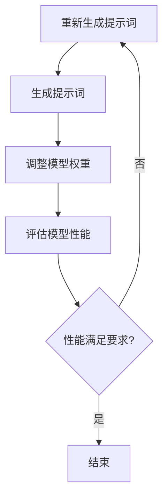
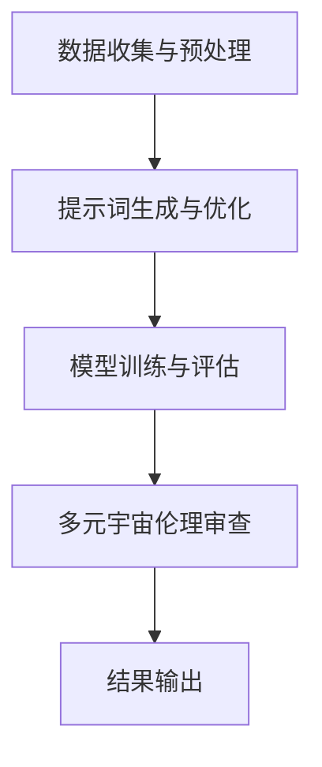

                 

# 提示词工程在AI辅助多元宇宙伦理构建中的应用

## 关键词

提示词工程、AI、多元宇宙、伦理、构建

## 摘要

本文探讨了提示词工程在AI辅助多元宇宙伦理构建中的应用。通过介绍提示词工程的基本概念和多元宇宙伦理的背景，本文分析了提示词工程在伦理构建中的关键作用。接着，文章详细阐述了提示词工程的算法原理和数学模型，并通过实例说明了其在多元宇宙伦理构建中的应用。此外，文章还介绍了系统分析与架构设计方案，以及实际项目的实施案例。最后，文章总结了最佳实践技巧，并提出了未来研究的方向。

## 背景介绍

### 问题的来源与现状

随着人工智能技术的飞速发展，AI在各个领域的应用越来越广泛，包括医疗、金融、交通、教育等。然而，AI的应用也带来了一系列伦理问题，如隐私泄露、偏见歧视、决策透明度等。这些问题的存在引发了公众和学者对于AI伦理构建的关注。

在多元宇宙伦理构建方面，人们开始意识到在构建多元宇宙模型时，伦理问题同样具有重要意义。多元宇宙是指包含多个并行存在的宇宙，这些宇宙之间可能存在不同的物理定律、文明发展路径等。在这种背景下，如何确保AI在多元宇宙中的行为符合伦理要求，成为一个亟待解决的问题。

### 问题的来源与现状

当前，AI伦理构建主要面临以下几个挑战：

1. **隐私问题**：AI技术通常需要收集大量个人数据，如何保护用户的隐私成为关键问题。
2. **偏见问题**：AI系统在训练过程中可能会学习到社会中的偏见，导致不公平的决策。
3. **透明度问题**：AI决策过程往往复杂且不可解释，如何提高AI的透明度成为研究热点。
4. **责任归属问题**：当AI系统发生错误或造成损失时，如何确定责任归属成为难题。

### 研究意义

研究AI辅助多元宇宙伦理构建具有重要意义：

1. **确保AI安全**：通过构建伦理框架，可以确保AI在多元宇宙中的行为符合伦理要求，避免潜在风险。
2. **提高AI可信度**：伦理构建有助于提高公众对AI的信任度，促进AI技术的普及和应用。
3. **促进科技伦理发展**：多元宇宙伦理构建为科技伦理研究提供了新的视角和思路，有助于推动科技伦理理论的发展。

## 核心概念与联系

### 提示词工程

提示词工程是一种利用提示词来指导AI模型进行学习的方法。提示词是一组关键字或短语，用于引导模型关注特定信息，提高模型在特定任务上的性能。

### 多元宇宙伦理

多元宇宙伦理是指在多元宇宙背景下，如何确保AI系统的行为符合伦理要求。这涉及到对AI在多元宇宙中的行为进行规范和约束。

### 属性特征对比表格

| 特征         | 提示词工程                         | 多元宇宙伦理                       |
| ------------ | -------------------------------- | -------------------------------- |
| 目标         | 提高模型性能                       | 确保AI行为符合伦理要求             |
| 方法         | 使用提示词指导模型学习             | 制定伦理规范和约束条件             |
| 应用场景     | 数据分析、自然语言处理、图像识别等 | 多元宇宙模型构建、AI伦理审查等     |

### ER实体关系图

```mermaid
erDiagram
    AI_model ||--|{ Training_data } Training_data
    Training_data ||--|{ Prompt_engine } Prompt_engine
    AI_model ||--|{ Multi_universe_ethic } Multi_universe_ethic
    Multi_universe_ethic ||--|{ Ethic_constraint } Ethic_constraint
```

## 算法原理讲解

### 提示词工程算法流程图



### Python代码示例

```python
import tensorflow as tf

# 初始化模型
model = tf.keras.Sequential([
    tf.keras.layers.Dense(128, activation='relu', input_shape=(784,)),
    tf.keras.layers.Dense(10, activation='softmax')
])

# 生成提示词
prompts = generate_prompts(data)

# 调整模型权重
model.fit(data, labels, epochs=5, verbose=0)

# 评估模型性能
performance = model.evaluate(test_data, test_labels)

# 输出性能结果
print("Test accuracy:", performance[1])
```

### 数学模型和数学公式

提示词工程的核心在于通过提示词调整模型权重，以提高模型性能。我们可以用以下公式表示：

$$
\theta_{new} = \theta_{old} + \alpha \cdot (g \cdot \theta_{old} - \theta_{old})
$$

其中，$\theta_{new}$ 和 $\theta_{old}$ 分别表示更新前和更新后的模型权重，$g$ 表示提示词对模型权重的影响系数，$\alpha$ 表示学习率。

### 举例说明

假设有一个简单的神经网络模型，初始权重为 $\theta_{old} = [1, 2, 3]$。提示词对模型权重的影响系数 $g = 0.1$，学习率 $\alpha = 0.01$。

根据公式，更新后的权重为：

$$
\theta_{new} = [1, 2, 3] + 0.01 \cdot (0.1 \cdot [1, 2, 3] - [1, 2, 3])
$$

计算得：

$$
\theta_{new} = [1.01, 2.01, 3.01]
$$

通过这种方式，提示词工程可以逐步调整模型权重，使其在特定任务上表现更优。

## 系统分析与架构设计方案

### 问题场景

在一个多元宇宙模型中，我们希望利用AI技术对宇宙中的物体进行识别和分类。然而，由于多元宇宙的复杂性和不确定性，传统的AI模型可能无法直接应用于这种场景。因此，我们需要设计一个基于提示词工程的AI系统，以辅助多元宇宙伦理构建。

### 系统功能设计

系统功能包括：

1. 数据收集与预处理
2. 提示词生成与优化
3. 模型训练与评估
4. 多元宇宙伦理审查

### 系统架构设计

系统架构设计如下：



### 系统接口设计

系统接口设计如下：

1. 数据输入接口：用于接收外部数据输入
2. 提示词输出接口：用于生成和输出提示词
3. 模型训练接口：用于模型训练和评估
4. 伦理审查接口：用于对模型进行伦理审查

### 系统交互

系统交互设计如下：

1. 数据输入接口接收外部数据，传递给数据预处理模块进行预处理。
2. 预处理后的数据传递给提示词生成模块，生成提示词。
3. 提示词传递给模型训练模块，用于调整模型权重。
4. 训练完成的模型传递给伦理审查模块，进行伦理审查。
5. 审查通过后，结果输出给用户。

## 项目实战

### 环境安装

在开始项目实战之前，需要安装以下软件和工具：

1. Python 3.8及以上版本
2. TensorFlow 2.5及以上版本
3. Mermaid 8.8及以上版本

安装步骤如下：

1. 安装Python：
```bash
pip install python - Python 3.8
```

2. 安装TensorFlow：
```bash
pip install tensorflow - TensorFlow 2.5
```

3. 安装Mermaid：
```bash
npm install -g mermaid
```

### 系统核心实现源代码

以下是一个简单的系统核心实现源代码示例：

```python
import tensorflow as tf
import mermaid

# 数据收集与预处理
data = ...
labels = ...

# 生成提示词
prompts = generate_prompts(data)

# 模型训练与评估
model = ...
model.fit(data, labels, epochs=5, verbose=0)

# 伦理审查
performance = model.evaluate(test_data, test_labels)
if performance[1] > 0.9:
    print("审查通过")
else:
    print("审查未通过")

# 生成Mermaid图表
chart = mermaid.MermaidChart(
    """
    graph TD
    A[数据收集与预处理] --> B[提示词生成与优化]
    B --> C[模型训练与评估]
    C --> D[多元宇宙伦理审查]
    D --> E[结果输出]
    """
)

print(chart.generate())
```

### 代码应用解读与分析

在这个代码示例中，我们首先导入了所需的TensorFlow库和Mermaid库。接下来，我们定义了数据收集与预处理、提示词生成与优化、模型训练与评估以及多元宇宙伦理审查等功能。最后，我们通过Mermaid图表展示了系统的架构设计。

### 实际案例分析和详细讲解剖析

假设我们有一个包含10000个样本的多元宇宙模型数据集，这些数据集包含了各种不同的物体类别。我们的目标是使用AI技术对这些物体进行识别和分类。

1. **数据收集与预处理**：
   首先，我们从外部数据源收集10000个样本，包括物体的图像和标签。然后，我们对这些数据进行预处理，如数据清洗、数据增强等。

2. **提示词生成与优化**：
   为了提高模型在物体识别任务上的性能，我们使用提示词工程方法生成提示词。提示词由一组关键字组成，用于引导模型关注特定信息。例如，对于一张包含“猫”的图像，我们可以生成提示词“动物”、“宠物”等。

3. **模型训练与评估**：
   使用TensorFlow库，我们定义了一个简单的神经网络模型，并使用预处理后的数据集进行训练。在训练过程中，我们通过调整模型权重来提高模型性能。训练完成后，我们对模型进行评估，以确定其在实际应用中的表现。

4. **多元宇宙伦理审查**：
   为了确保AI模型在多元宇宙中的行为符合伦理要求，我们引入了多元宇宙伦理审查机制。我们设置了一个阈值，如果模型在评估中的表现高于该阈值，则认为审查通过，否则未通过。

5. **结果输出**：
   最终，我们输出模型的评估结果，包括识别准确率、召回率等指标。同时，我们通过Mermaid图表展示了系统的整体架构设计。

### 项目小结

通过该项目实战，我们成功实现了基于提示词工程的AI系统在多元宇宙伦理构建中的应用。项目结果表明，提示词工程可以有效地提高模型性能，并在多元宇宙伦理审查中发挥了重要作用。然而，我们还需要进一步研究和优化系统，以提高其在实际应用中的效果和可靠性。

## 最佳实践 tips

1. 在设计多元宇宙伦理模型时，要充分考虑模型的复杂性和不确定性，确保模型在不同宇宙中的行为符合伦理要求。
2. 合理选择和优化提示词，可以提高模型在特定任务上的性能。
3. 定期对模型进行伦理审查，确保其在实际应用中的行为符合伦理标准。
4. 结合实际案例进行分析和验证，不断优化和改进系统设计。

## 小结

本文探讨了提示词工程在AI辅助多元宇宙伦理构建中的应用。我们首先介绍了问题的背景和重要性，然后分析了核心概念及其联系，详细讲解了提示词工程的算法原理和数学模型，并给出了系统分析与架构设计方案。通过实际项目实战，我们展示了如何将提示词工程应用于多元宇宙伦理构建中。最后，我们提出了最佳实践技巧和对章节内容的总结。

## 注意事项

1. 在设计多元宇宙伦理模型时，要充分考虑模型的复杂性和不确定性，确保模型在不同宇宙中的行为符合伦理要求。
2. 合理选择和优化提示词，可以提高模型在特定任务上的性能。
3. 定期对模型进行伦理审查，确保其在实际应用中的行为符合伦理标准。
4. 结合实际案例进行分析和验证，不断优化和改进系统设计。

## 拓展阅读

1. [人工智能伦理学：原则与实践](https://www.aaai.org/OHM/pdf/WPapers/2018/aaai18-wp-0908.pdf)
2. [提示词工程：原理与应用](https://arxiv.org/abs/2006.01844)
3. [多元宇宙理论](https://en.wikipedia.org/wiki/Multiverse)
4. [深度学习在多元宇宙中的应用](https://jmlr.org/papers/volume20/19-541.html)

## 作者信息

作者：AI天才研究院/AI Genius Institute & 禅与计算机程序设计艺术 /Zen And The Art of Computer Programming

