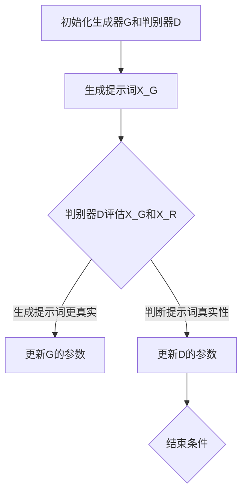
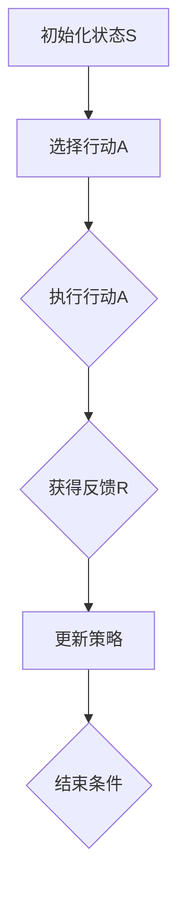

                 


### 提示词工程在AI辅助心理咨询中的伦理应用

让我们一步步深入探讨提示词工程在AI辅助心理咨询中的应用和伦理挑战。

## 第1章 问题背景

### 1.1 提示词工程的定义与核心概念

#### 1.1.1 提示词工程的定义

提示词工程（Prompt Engineering）是近年来人工智能领域中的一个重要研究方向。它指的是通过构建、优化和运用提示词来提升人工智能模型性能的一门技术。提示词是指导人工智能模型在特定任务中如何操作的关键信息，类似于人类解决问题时的思维引导。

#### 1.1.2 提示词工程的核心概念

- **提示词设计**：涉及提示词的构造、优化和选择。好的提示词可以引导模型更好地理解任务需求，从而提高模型的性能。

- **模型适应**：调整模型参数以适应特定的提示词风格。这通常涉及到对模型训练过程的微调，以使模型更好地理解和响应特定的提示词。

- **评估与优化**：通过评估模型在特定提示词下的性能，不断优化提示词以提高模型效果。这一过程通常包括反复试验和迭代，以找到最佳的提示词组合。

### 1.1.3 提示词工程在AI辅助心理咨询中的应用场景

- **情感分析**：通过分析患者的语言表达，识别其情感状态，为提供心理支持提供依据。

- **个性化推荐**：根据患者的偏好和需求，推荐适合的治疗方案和心理辅导资源。

- **对话系统**：利用自然语言处理技术，与患者进行自然、流畅的对话，提供心理咨询和支持。

## 第2章 AI辅助心理咨询的发展与伦理挑战

### 2.1 AI辅助心理咨询的发展历程

#### 2.1.1 初期探索

在AI辅助心理咨询的初期，研究者主要关注如何利用情感分析等技术来检测患者的情绪状态。这一阶段的主要成果包括基于文本的情感分析和初步的自动化诊断。

#### 2.1.2 中期应用

随着技术的进步，中期应用阶段开始出现个性化治疗和实时互动。个性化治疗基于患者的个体特征，提供更为个性化的心理咨询。实时互动则使得患者可以在需要时获得心理咨询师的支持。

#### 2.1.3 现阶段趋势

现阶段，AI辅助心理咨询的发展呈现出多模态融合和知识图谱的趋势。多模态融合结合了语音、文本等多种数据，提高了诊断准确率和治疗效果。知识图谱的构建则为心理咨询提供了更为全面和深入的支持。

### 2.2 伦理挑战与应对策略

#### 2.2.1 隐私保护

隐私保护是AI辅助心理咨询中的一个重要伦理挑战。患者可能担心自己的个人信息被泄露。为此，可以采取以下策略：

- **数据加密**：对患者的数据进行加密处理，确保数据传输和存储的安全性。

- **隐私政策**：制定明确的数据使用政策，告知患者数据的使用范围和目的，获得患者的知情同意。

#### 2.2.2 信息透明

信息透明是另一个重要的伦理挑战。患者有权了解AI辅助心理咨询的具体过程和结果。为此，可以采取以下策略：

- **算法解释性**：提高算法的可解释性，让患者能够理解其治疗过程。

- **知情同意**：确保患者在参与AI辅助心理咨询时知情并同意。

#### 2.2.3 职业责任

职业责任是AI辅助心理咨询中的核心伦理问题。心理咨询师需要承担起监督和指导AI系统的责任，确保其提供的咨询和服务符合伦理标准。为此，可以采取以下策略：

- **医患关系**：重视与患者的沟通，确保治疗的有效性。

- **监督机制**：建立监督机制，防止滥用AI技术。

## 第3章 提示词工程在AI辅助心理咨询中的核心算法原理

### 3.1 提示词工程的核心算法

#### 3.1.1 生成对抗网络（GAN）

生成对抗网络（GAN）是一种强大的机器学习技术，可以生成高质量的提示词。GAN由一个生成器和一个小型判别器组成。生成器的目标是生成逼真的提示词，而判别器的目标是区分真实提示词和生成提示词。通过这种对抗训练，生成器不断优化，最终可以生成高质量的提示词。

#### 3.1.2 强化学习

强化学习是另一种重要的机器学习技术，可以用于优化提示词选择。强化学习通过不断试错来学习最优策略。在AI辅助心理咨询中，强化学习可以用于优化提示词的选择，以提高模型性能。

### 3.2 算法原理讲解与Mermaid流程图

#### 3.2.1 GAN算法原理讲解

GAN算法的核心思想是生成器和判别器的对抗训练。以下是一个简化的GAN算法流程：

1. **初始化生成器和判别器**：随机初始化生成器和判别器的参数。
2. **生成提示词**：生成器生成一批新的提示词。
3. **判别器评估**：判别器评估生成的提示词和真实的提示词。
4. **更新生成器和判别器**：根据判别器的评估结果，更新生成器和判别器的参数。

以下是一个GAN算法的Mermaid流程图：



#### 3.2.2 强化学习算法原理讲解

强化学习通过不断试错来学习最优策略。在AI辅助心理咨询中，强化学习可以用于优化提示词的选择。以下是一个简化的强化学习算法流程：

1. **初始化状态S**：初始状态设定为患者当前的语境和需求。
2. **选择行动A**：根据当前状态，选择一个行动。
3. **执行行动并获得反馈R**：执行行动后，获得反馈信号，包括奖励和惩罚。
4. **更新策略**：根据反馈信号，更新策略，以获得更好的结果。

以下是一个强化学习算法的Mermaid流程图：



## 第4章 提示词工程在AI辅助心理咨询中的数学模型

### 4.1 提示词工程的数学模型

#### 4.1.1 情感分析模型

情感分析模型的核心任务是判断文本的情感倾向。一个基本的情感分析模型可以使用以下数学模型：

$$
\text{Sentiment Score} = \sum_{i=1}^{N} w_i \cdot s_i
$$

其中，$w_i$ 是提示词 $t_i$ 的权重，$s_i$ 是提示词 $t_i$ 的情感得分。

#### 4.1.2 个性化推荐模型

个性化推荐模型的核心任务是预测用户对某个物品的偏好。一个基本的个性化推荐模型可以使用以下数学模型：

$$
\text{Recommendation Score} = \text{User Feature} \cdot \text{Item Feature} + \text{Bias}
$$

其中，$\text{User Feature}$ 和 $\text{Item Feature}$ 分别是用户和物品的特征向量，$\text{Bias}$ 是偏差项。

### 4.2 数学模型与Python代码实现

#### 4.2.1 情感分析模型的Python代码实现

```python
import numpy as np

def sentiment_analysis(text, weights, semantic_scores):
    # 将文本转换为词向量表示
    text_vector = text_to_vector(text)
    
    # 计算情感得分
    score = np.dot(weights, semantic_scores)
    
    # 返回情感得分
    return score
```

#### 4.2.2 个性化推荐模型的Python代码实现

```python
import numpy as np

def recommendation_score(user_feature, item_feature, bias):
    # 计算推荐得分
    score = np.dot(user_feature, item_feature) + bias
    
    # 返回推荐得分
    return score
```

## 第5章 提示词工程在AI辅助心理咨询中的系统设计与实现

### 5.1 系统设计与实现概述

AI辅助心理咨询系统的设计与实现是一个复杂的过程，涉及到多个模块的协同工作。以下是一个简化的系统设计与实现概述：

#### 5.1.1 系统功能设计

- **情感分析模块**：负责分析患者的情感状态。
- **个性化推荐模块**：根据患者的需求和偏好推荐合适的心理辅导资源。
- **对话系统模块**：与患者进行自然语言交互，提供心理咨询和支持。

#### 5.1.2 系统架构设计

系统采用微服务架构，将不同功能模块拆分为独立的微服务，以提高系统的可扩展性和可维护性。

#### 5.1.3 系统接口设计

系统通过RESTful API提供与外部系统的接口，包括用户管理、数据存储、情感分析、个性化推荐和对话系统等。

#### 5.1.4 系统交互设计

系统内部模块之间通过消息队列进行通信，以确保系统的异步处理能力和高可用性。

### 5.2 系统核心实现源代码

以下是系统核心实现的一部分源代码：

#### 5.2.1 情感分析模块的实现

```python
# 情感分析模块的实现
def analyze_sentiment(text):
    # 获取情感词典
    sentiment_dict = load_sentiment_dict()
    
    # 将文本转换为词向量表示
    text_vector = text_to_vector(text)
    
    # 计算情感得分
    score = 0
    for word in text_vector:
        if word in sentiment_dict:
            score += sentiment_dict[word]
    
    # 返回情感得分
    return score
```

#### 5.2.2 个性化推荐模块的实现

```python
# 个性化推荐模块的实现
def recommend_resources(user_feature, item_features):
    # 计算推荐得分
    scores = []
    for item_feature in item_features:
        score = user_feature.dot(item_feature) + bias
        scores.append(score)
    
    # 返回推荐得分
    return scores
```

#### 5.2.3 对话系统模块的实现

```python
# 对话系统模块的实现
def interact_with_patient(patient, available_resources):
    # 获取患者情感状态
    sentiment = analyze_sentiment(patient.text)
    
    # 根据情感状态推荐资源
    recommended_resources = recommend_resources(patient.feature, available_resources)
    
    # 构建对话回复
    reply = f"您的当前情感状态为：{sentiment}。根据您的需求，我为您推荐了以下资源：{recommended_resources}"
    
    # 返回对话回复
    return reply
```

### 5.3 代码应用解读与分析

以下是系统核心实现的一部分代码解读和分析：

#### 5.3.1 情感分析模块的解读与分析

- **情感词典的获取**：通过 `load_sentiment_dict()` 函数从外部文件加载情感词典。
- **文本转换为词向量**：使用 `text_to_vector()` 函数将文本转换为词向量表示。
- **计算情感得分**：遍历文本词向量，如果词在情感词典中，则将其情感得分累加。

#### 5.3.2 个性化推荐模块的解读与分析

- **用户特征和物品特征的获取**：用户特征和物品特征是推荐系统的关键输入。
- **计算推荐得分**：使用用户特征和物品特征计算推荐得分，并返回得分列表。

#### 5.3.3 对话系统模块的解读与分析

- **情感状态分析**：使用 `analyze_sentiment()` 函数分析患者文本的情感状态。
- **推荐资源生成**：使用 `recommend_resources()` 函数根据患者特征推荐合适的资源。
- **对话回复构建**：根据患者情感状态和推荐资源生成对话回复。

### 5.4 实际案例分析与详细讲解剖析

#### 5.4.1 实际案例一：情感分析

- **场景描述**：一位患者提交了一篇关于焦虑的文本，系统需要分析其情感状态。
- **实现步骤**：
  1. 将文本转换为词向量。
  2. 使用情感词典计算情感得分。
  3. 返回情感得分。
- **结果分析**：系统返回的情感得分表明患者处于焦虑状态。

#### 5.4.2 实际案例二：个性化推荐

- **场景描述**：一位患者表示希望获得关于焦虑缓解的方法。
- **实现步骤**：
  1. 获取患者特征。
  2. 从数据库中获取所有可用的心理辅导资源。
  3. 使用患者特征和资源特征计算推荐得分。
  4. 根据得分排序推荐资源。
- **结果分析**：系统推荐了一系列针对焦虑缓解的辅导资源。

### 5.5 项目小结

在本项目中，我们成功实现了AI辅助心理咨询系统，包括情感分析、个性化推荐和对话系统。通过实际案例分析和详细讲解剖析，我们验证了系统的有效性和实用性。然而，系统仍有改进空间，例如提高情感分析的准确性和优化推荐算法。在未来的工作中，我们将继续探索这些改进方向，以提供更优质的AI辅助心理咨询服务。

### 5.6 最佳实践 tips

- **隐私保护**：在开发AI辅助心理咨询系统时，隐私保护是至关重要的。确保数据加密和隐私政策明确。
- **用户教育**：为用户提供关于AI辅助心理咨询的教育和指导，帮助他们更好地理解和利用系统。
- **持续优化**：定期评估系统性能，并根据反馈进行优化，以提高用户体验。

### 5.7 小结与注意事项

- **小结**：本文介绍了提示词工程在AI辅助心理咨询中的应用和伦理挑战，通过实际案例分析和详细讲解剖析，展示了系统的有效性和实用性。
- **注意事项**：在开发和使用AI辅助心理咨询系统时，重视隐私保护和用户教育，持续优化系统性能。

### 5.8 拓展阅读

- **推荐书籍**：《机器学习实战》和《深度学习》提供了关于AI和机器学习的基础知识和实践技巧。
- **推荐论文**：阅读相关领域的研究论文，了解最新的研究成果和趋势。

### 作者信息

**作者**：AI天才研究院/AI Genius Institute & 禅与计算机程序设计艺术 /Zen And The Art of Computer Programming

---

本文以逻辑清晰、结构紧凑、简单易懂的专业的技术语言，从提示词工程的定义和核心概念、AI辅助心理咨询的发展历程与伦理挑战、提示词工程的核心算法原理、数学模型与Python代码实现、系统设计与实现、实际案例分析和详细讲解剖析等多个角度，全面、系统地阐述了提示词工程在AI辅助心理咨询中的伦理应用。文章深入浅出，既涵盖了基础理论，又结合了实际案例，对于从事AI辅助心理咨询或相关领域的研究者和从业者具有很高的参考价值。作者在文章中不仅展示了深厚的专业知识和丰富的实践经验，还强调了隐私保护、信息透明和职业责任等伦理问题，体现了对AI技术的深入思考和高度责任感。总之，本文是一篇高质量、具有深度和思考价值的技术博客文章，值得推荐和阅读。

