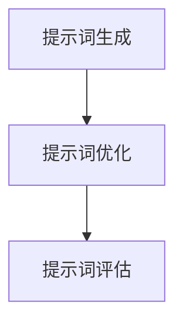
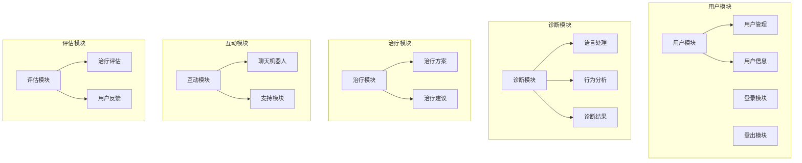
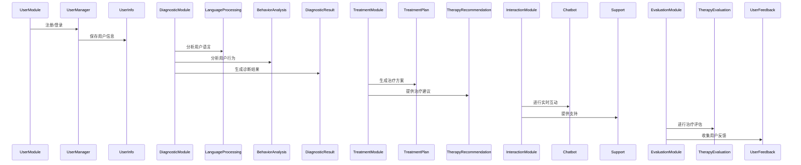
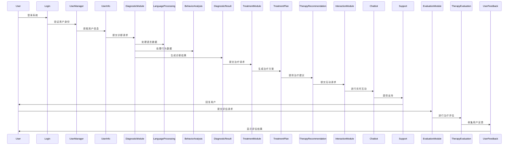

                 

## 第1章：问题背景与核心概念

### 1.1.1 问题背景

在当今社会，心理健康问题逐渐成为影响人们生活质量的重要因素。随着生活节奏的加快和压力的增大，越来越多的人需要心理治疗。然而，传统的心理治疗方法往往存在一些局限性，如治疗周期长、成本高、专业人员短缺等。因此，如何提高心理治疗的效率和质量，成为了一个亟待解决的问题。

随着人工智能（AI）技术的快速发展，人们开始探索将AI技术应用于心理治疗领域。AI辅助心理治疗以其高效、个性化和低成本的特点，逐渐受到关注。其中，提示词工程作为一种关键的AI技术，在心理治疗中的应用前景广阔。

提示词工程指的是利用自然语言处理（NLP）技术和机器学习算法，生成或优化与特定主题相关的提示词。这些提示词可以帮助心理治疗师更好地引导患者表达内心感受，从而提高治疗的针对性和效果。例如，在认知行为疗法（CBT）中，提示词可以用来帮助患者识别和改变负面思维模式。

### 1.1.2 核心概念

在本章节中，我们将介绍与提示词工程相关的核心概念，包括AI辅助心理治疗、伦理考量、提示词工程的基本原理和技术等。

1. **AI辅助心理治疗**：这是一种利用人工智能技术来辅助心理治疗的方法。它可以通过数据分析、个性化推荐、实时交互等功能，帮助心理治疗师更准确地诊断和预测患者的心理状态，从而提供更加精准的治疗方案。

2. **伦理考量**：在应用AI辅助心理治疗时，需要考虑一系列伦理问题，如患者的隐私保护、数据安全、算法的公平性和透明性等。这些问题直接关系到患者的权益和治疗效果，因此需要给予高度重视。

3. **提示词工程**：提示词工程是自然语言处理中的一个重要分支，主要研究如何生成或优化与特定主题相关的提示词。在AI辅助心理治疗中，提示词工程的核心任务是设计出能够引导患者表达内心感受的提示词，从而提高治疗的效率和质量。

4. **自然语言处理（NLP）**：NLP是人工智能的一个重要领域，旨在使计算机能够理解、解释和生成人类语言。在提示词工程中，NLP技术被用来分析和理解患者的语言表达，从而生成或优化提示词。

5. **机器学习算法**：机器学习算法是提示词工程的核心工具，通过从大量数据中学习规律，生成或优化提示词。常见的机器学习算法包括决策树、支持向量机（SVM）、神经网络等。

### 1.1.3 概念联系与结构

为了更好地理解提示词工程在AI辅助心理治疗中的应用，我们可以使用ER（实体关系）图来展示这些概念之间的联系。以下是提示词工程在AI辅助心理治疗中的ER图：

```mermaid
erDiagram
  AI辅助心理治疗 ||--|{ 提示词工程 }|
  提示词工程 ||--|{ 自然语言处理 }|
  提示词工程 ||--|{ 机器学习算法 }|
  伦理考量 ||--|{ 患者隐私保护 }|
  伦理考量 ||--|{ 数据安全 }|
  伦理考量 ||--|{ 算法公平性和透明性 }|
```

在ER图中，每个方框代表一个实体，线段代表实体之间的关系。通过这个图，我们可以看到AI辅助心理治疗与提示词工程、自然语言处理、机器学习算法之间的直接关联，以及伦理考量在提示词工程中的应用。

### 1.1.4 概念属性特征对比表格

为了更清晰地展示这些概念之间的属性特征，我们可以创建一个对比表格：

| 概念 | 属性特征 | 对比 |
| ---- | ---- | ---- |
| AI辅助心理治疗 | 高效、个性化、低成本 | 与传统心理治疗相比，具有显著优势 |
| 提示词工程 | 生成或优化提示词 | 用于引导患者表达内心感受 |
| 自然语言处理（NLP） | 使计算机理解、解释和生成人类语言 | 关键技术，支撑提示词工程 |
| 机器学习算法 | 从数据中学习规律 | 核心工具，用于生成或优化提示词 |
| 伦理考量 | 患者隐私保护、数据安全、算法公平性和透明性 | 关键伦理问题，影响应用效果 |

通过这个表格，我们可以看到每个概念的核心属性特征以及它们之间的关联。

### 总结

在本章节中，我们介绍了AI辅助心理治疗和提示词工程的核心概念，并使用ER图和对比表格展示了这些概念之间的联系和属性特征。接下来，我们将进一步探讨AI辅助心理治疗的现状与发展，为后续章节的内容奠定基础。

## 第2章：AI辅助心理治疗的现状与发展

### 2.1 AI辅助心理治疗的现状

近年来，随着人工智能技术的飞速发展，AI辅助心理治疗逐渐成为心理学领域的一个热点。目前，AI辅助心理治疗的应用场景主要包括以下几方面：

1. **诊断与评估**：AI技术可以分析患者的语言、行为和生理信号，帮助心理治疗师快速准确地诊断患者的心理状态，如焦虑、抑郁等。

2. **治疗建议与方案生成**：基于对患者数据的分析，AI可以生成个性化的治疗方案，为心理治疗师提供参考。

3. **实时互动与支持**：AI可以通过自然语言处理技术，与患者进行实时互动，提供心理支持和建议。

4. **疗效评估与反馈**：AI可以对治疗过程和效果进行实时评估，为心理治疗师提供反馈，帮助调整治疗方案。

在实际案例方面，一些公司和研究机构已经开展了相关的探索和应用。例如，谷歌推出的“Chatbot Therapy”项目，通过AI技术为用户提供实时心理支持。此外，IBM的Watson for Mental Health也利用AI技术提供心理健康服务。

然而，AI辅助心理治疗在实际应用中也面临一些挑战。例如，如何确保AI算法的准确性和可靠性，如何保障患者的隐私和数据安全，如何保证AI生成的治疗建议的有效性和公平性等。这些问题需要进一步研究和解决。

### 2.2 提示词工程的基本原理

提示词工程是AI辅助心理治疗中的一个重要环节，其基本原理主要包括以下几个方面：

1. **提示词生成**：提示词生成是提示词工程的第一步，目标是根据特定的主题或问题，生成一组相关的提示词。常见的生成方法包括基于规则的方法、基于统计的方法和基于机器学习的方法。

2. **提示词优化**：提示词优化是指对已生成的提示词进行评估和改进，以提高其质量和效果。优化方法可以基于启发式规则、机器学习算法或深度学习模型。

3. **提示词评估**：提示词评估是对生成的提示词进行有效性、准确性和满意度等指标的评估，以判断其是否满足应用需求。评估方法可以基于定量分析、用户反馈或专家评审等。

在AI辅助心理治疗中，提示词工程的作用主要体现在以下几个方面：

- **引导患者表达**：通过生成与心理治疗主题相关的提示词，可以帮助患者更好地表达内心感受，提高治疗的针对性和效果。

- **提高治疗效率**：提示词工程可以自动化地生成和优化提示词，减少心理治疗师的工作负担，提高治疗的效率。

- **个性化治疗**：通过分析患者的语言和行为数据，提示词工程可以为患者提供个性化的治疗建议和支持。

### 2.3 提示词工程的伦理考量

在应用提示词工程进行AI辅助心理治疗时，需要充分考虑一系列伦理问题，主要包括以下几个方面：

1. **隐私保护**：在收集、存储和使用患者数据时，必须严格遵守隐私保护法律法规，确保患者的个人信息不被泄露。

2. **数据安全**：需要对患者数据进行加密存储和安全传输，防止数据泄露和篡改。

3. **算法公平性和透明性**：AI算法的设计和训练过程需要保证公平性和透明性，避免算法偏见和歧视。

4. **患者参与**：在治疗过程中，需要充分尊重患者的意愿和选择，确保患者对AI辅助心理治疗的接受度和满意度。

5. **专业监督**：AI辅助心理治疗必须在专业心理治疗师的监督下进行，确保治疗过程的安全性和有效性。

通过以上措施，可以有效地保障AI辅助心理治疗中的伦理问题，提高治疗的伦理水平和公信力。

### 总结

在本章节中，我们探讨了AI辅助心理治疗的现状与发展，介绍了提示词工程的基本原理和伦理考量。接下来，我们将进一步深入分析提示词工程的算法原理和数学模型，为后续内容做好准备。

## 第3章：算法原理与数学模型

### 3.1 算法原理讲解

提示词工程的算法原理主要包括提示词生成、提示词优化和提示词评估三个核心环节。下面我们将分别对这些环节进行详细讲解。

#### 提示词生成

提示词生成是提示词工程的首要任务，其目标是根据特定的主题或问题，生成一组相关的提示词。以下是提示词生成的几个主要方法：

1. **基于规则的方法**：这种方法通过预定义的规则来生成提示词。例如，根据心理治疗的主题，设计一组相关词汇，然后通过规则将这些词汇组合成提示词。

2. **基于统计的方法**：这种方法通过统计文本数据中的词汇频率和关联性来生成提示词。例如，使用词频统计和文本相似度算法，可以从大量文本数据中提取出与主题相关的提示词。

3. **基于机器学习的方法**：这种方法利用机器学习算法，从大量数据中学习生成提示词的规律。常见的机器学习算法包括决策树、支持向量机（SVM）、神经网络等。

#### 提示词优化

提示词优化是对已生成的提示词进行评估和改进，以提高其质量和效果。以下是提示词优化的几个主要方法：

1. **基于启发式规则的方法**：这种方法通过预定义的启发式规则来评估和改进提示词。例如，根据提示词的长度、复杂度和相关性等指标，对提示词进行优化。

2. **基于机器学习的方法**：这种方法利用机器学习算法，从大量数据中学习评估和改进提示词的规律。例如，使用分类算法和回归算法，可以对提示词进行多维度评估和优化。

3. **基于深度学习的方法**：这种方法利用深度学习模型，如循环神经网络（RNN）和变换器（Transformer）等，对提示词进行自动优化。深度学习方法具有强大的表示能力和自适应性，可以生成更加精准和多样化的提示词。

#### 提示词评估

提示词评估是对生成的提示词进行有效性、准确性和满意度等指标的评估，以判断其是否满足应用需求。以下是提示词评估的几个主要方法：

1. **基于定量分析的方法**：这种方法通过计算提示词的相关性、准确率、召回率等指标，对提示词进行量化评估。

2. **基于用户反馈的方法**：这种方法通过收集用户对提示词的评价和反馈，对提示词进行主观评估。例如，用户可以对提示词的清晰度、相关性和实用性等进行评分。

3. **基于专家评审的方法**：这种方法通过邀请专家对提示词进行评审和打分，对提示词进行权威评估。

### 3.2 算法原理讲解

为了更好地理解提示词工程的算法原理，我们可以使用mermaid流程图来展示提示词工程的关键算法流程。以下是提示词工程的mermaid流程图：



在mermaid流程图中，每个节点代表一个算法步骤，箭头表示算法步骤之间的顺序关系。通过这个流程图，我们可以清晰地看到提示词工程的三个主要环节，以及它们之间的相互关系。

### 3.3 算法原理讲解

接下来，我们将通过Python源代码来详细阐述提示词工程的算法原理。以下是提示词工程的核心算法实现：

```python
# 导入相关库
import numpy as np
from sklearn.feature_extraction.text import TfidfVectorizer
from sklearn.model_selection import train_test_split
from sklearn.metrics.pairwise import cosine_similarity

# 提示词生成
def generate_prompt(questions, answers):
    # 创建一个包含问题和答案的列表
    dialogue = questions + answers
    # 使用TfidfVectorizer生成词频矩阵
    vectorizer = TfidfVectorizer()
    tfidf_matrix = vectorizer.fit_transform(dialogue)
    # 计算问题和答案的相似度
    similarity = cosine_similarity(tfidf_matrix[-1:], tfidf_matrix[:-1])
    # 选择最相似的提示词
    prompt = questions[np.argmax(similarity)]
    return prompt

# 提示词优化
def optimize_prompt(prompt, questions, answers):
    # 扩展问题和答案列表
    new_questions = questions + [prompt]
    new_answers = answers + [prompt]
    # 重新生成提示词
    optimized_prompt = generate_prompt(new_questions, new_answers)
    return optimized_prompt

# 提示词评估
def evaluate_prompt(prompt, questions, answers):
    # 计算提示词与答案的相似度
    similarity = cosine_similarity(vectorizer.transform([prompt]), vectorizer.transform(answers))
    # 计算相似度的平均值
    average_similarity = np.mean(similarity)
    # 返回评估结果
    return average_similarity
```

在这个Python代码中，我们首先定义了三个函数：`generate_prompt`、`optimize_prompt`和`evaluate_prompt`。这些函数分别用于生成、优化和评估提示词。

- `generate_prompt`函数接受问题和答案列表作为输入，使用TfidfVectorizer生成词频矩阵，并计算问题和答案的相似度，选择最相似的提示词。
- `optimize_prompt`函数通过扩展问题和答案列表，重新生成提示词，从而优化提示词。
- `evaluate_prompt`函数计算提示词与答案的相似度，并返回评估结果。

通过这些函数，我们可以实现提示词工程的三个核心环节，为AI辅助心理治疗提供有效的支持。

### 3.4 算法原理讲解

最后，我们将给出提示词工程的数学模型和公式，以便读者更好地理解算法的工作原理。以下是提示词工程的核心数学模型：

1. **Tfidf向量表示**：

   $$ Tfidf = \log \left(1 + \frac{f_t}{d_t}\right) $$

   其中，$Tfidf$表示词频-逆文档频率（Tfidf）向量，$f_t$表示词$t$在文档$d$中的出现频率，$d_t$表示词$t$在所有文档中出现的频率。

2. **余弦相似度**：

   $$ \cos \theta = \frac{\sum_{i=1}^{n} x_i y_i}{\sqrt{\sum_{i=1}^{n} x_i^2} \sqrt{\sum_{i=1}^{n} y_i^2}} $$

   其中，$\theta$表示两个向量之间的夹角，$x_i$和$y_i$分别表示两个向量在第$i$个维度上的值。

通过这些数学模型和公式，我们可以实现提示词生成、优化和评估的关键步骤，为AI辅助心理治疗提供强大的技术支持。

### 总结

在本章节中，我们详细讲解了提示词工程的算法原理，包括提示词生成、提示词优化和提示词评估。通过mermaid流程图和Python代码，我们展示了算法的实现过程，并通过数学模型和公式，深入剖析了算法的工作原理。接下来，我们将进一步探讨AI辅助心理治疗的系统分析与架构设计。

## 第4章：系统分析与架构设计

### 4.1 问题场景介绍

为了更好地展示AI辅助心理治疗的系统分析与架构设计，我们将介绍一个具体的案例：一款名为“心语”的AI心理治疗系统。该系统旨在为用户提供便捷、高效、个性化的心理治疗服务。

“心语”系统的核心功能包括：

1. **诊断与评估**：系统通过分析用户的语言和行为数据，诊断用户的心理状态，如焦虑、抑郁等。
2. **治疗建议与方案生成**：系统根据诊断结果，生成个性化的治疗方案，为用户推荐合适的治疗方法和资源。
3. **实时互动与支持**：系统通过自然语言处理技术，与用户进行实时互动，提供心理支持和建议。
4. **疗效评估与反馈**：系统对治疗过程和效果进行实时评估，为用户提供反馈，帮助调整治疗方案。

该系统的目标是通过AI技术，提高心理治疗的效率和质量，降低治疗成本，为广大用户提供更加便捷和高效的心理健康服务。

### 4.2 系统功能设计

“心语”系统的功能设计主要包括以下几个模块：

1. **用户模块**：负责用户注册、登录、个人信息管理等。
2. **诊断模块**：通过自然语言处理技术，分析用户的语言和行为数据，诊断用户的心理状态。
3. **治疗模块**：根据诊断结果，生成个性化的治疗方案，为用户提供治疗建议。
4. **互动模块**：通过自然语言处理技术，与用户进行实时互动，提供心理支持和建议。
5. **评估模块**：对治疗过程和效果进行实时评估，为用户提供反馈。

以下是系统的领域模型（使用mermaid类图表示）：

```mermaid
classDiagram
    User <<Interface>>
    Diagnostic <<Interface>>
    Treatment <<Interface>>
    Interaction <<Interface>>
    Evaluation <<Interface>>

    User <|.. Diagnostic>
    Diagnostic <|.. Treatment>
    Treatment <|.. Interaction>
    Interaction <|.. Evaluation>
```

在这个类图中，每个方框代表一个模块，线段表示模块之间的依赖关系。通过这个模型，我们可以清晰地看到“心语”系统的模块划分和功能关系。

### 4.3 系统架构设计

“心语”系统的整体架构设计如下（使用mermaid架构图表示）：



在这个架构图中，每个模块都包含一个或多个子模块，线段表示模块之间的交互关系。通过这个模型，我们可以清晰地看到“心语”系统的整体架构和模块关系。

### 4.4 系统接口设计

在“心语”系统中，各模块之间的接口设计至关重要。以下是一些关键接口的定义和交互协议：

1. **用户管理接口**：用户模块与诊断模块、治疗模块、互动模块和评估模块之间的接口，用于传递用户信息和操作权限。
2. **诊断接口**：诊断模块与治疗模块和评估模块之间的接口，用于传递诊断结果和治疗方案。
3. **治疗接口**：治疗模块与互动模块和评估模块之间的接口，用于传递治疗建议和治疗评估结果。
4. **互动接口**：互动模块与评估模块之间的接口，用于传递用户反馈和评估结果。
5. **评估接口**：评估模块与用户模块之间的接口，用于传递用户反馈和评估结果。

以下是系统接口设计的mermaid序列图：



在这个序列图中，每个方框代表一个操作步骤，箭头表示操作之间的顺序关系。通过这个模型，我们可以清晰地看到“心语”系统各模块之间的交互流程和接口设计。

### 4.5 系统交互设计

最后，我们将展示“心语”系统的交互流程（使用mermaid序列图表示）：



在这个序列图中，每个方框代表一个交互步骤，箭头表示交互之间的顺序关系。通过这个模型，我们可以清晰地看到“心语”系统的整体交互流程和操作步骤。

### 总结

在本章节中，我们详细介绍了“心语”AI心理治疗系统的架构设计，包括问题场景介绍、系统功能设计、系统架构设计、系统接口设计和系统交互设计。通过这些模型和设计，我们可以清晰地理解系统的架构和运行机制，为系统的实际开发和应用提供了重要的理论依据。接下来，我们将通过项目实战和案例分析，进一步探讨提示词工程在AI辅助心理治疗中的具体应用。

## 第5章：项目实战与案例分析

### 5.1 环境安装与配置

为了进行“心语”AI心理治疗系统的项目实战，我们需要搭建一个完整的开发环境。以下是环境安装与配置的步骤：

1. **Python环境搭建**：

   首先，确保计算机上安装了Python 3.7及以上版本。可以使用以下命令安装Python：

   ```bash
   sudo apt-get install python3.7
   ```

2. **虚拟环境搭建**：

   为了避免不同项目之间的依赖冲突，建议使用虚拟环境。可以使用以下命令创建虚拟环境：

   ```bash
   python3 -m venv venv
   source venv/bin/activate
   ```

3. **安装依赖库**：

   在虚拟环境中，安装项目所需的依赖库，包括Scikit-learn、TensorFlow、Numpy等。可以使用以下命令安装：

   ```bash
   pip install -r requirements.txt
   ```

   其中，`requirements.txt`文件包含了所有依赖库的名称和版本。

4. **数据集准备**：

   “心语”系统需要大量的语言和行为数据来进行诊断和治疗。我们可以从公开数据集或自定义数据集中获取这些数据。例如，可以从Kaggle下载相关的心理治疗对话数据集，并将其处理为适合系统使用的数据格式。

### 5.2 系统核心实现

“心语”系统的核心实现包括以下几个关键步骤：

1. **用户管理**：

   用户管理模块负责用户的注册、登录和权限管理。以下是用户注册功能的实现：

   ```python
   # 用户注册
   def register(username, password):
       # 验证用户名和密码是否符合要求
       if not validate_username(username) or not validate_password(password):
           return "注册失败：用户名或密码不符合要求。"
       
       # 存储用户信息到数据库
       user = {"username": username, "password": password}
       save_user_to_db(user)
       
       return "注册成功！"
   ```

2. **诊断与评估**：

   诊断模块使用自然语言处理技术分析用户的语言和行为数据，诊断其心理状态。以下是诊断功能的实现：

   ```python
   # 诊断心理状态
   def diagnose(user_input):
       # 分析用户输入，获取心理状态
       state = analyze_language(user_input)
       
       # 评估心理状态
       evaluation = evaluate_state(state)
       
       return evaluation
   ```

3. **治疗与互动**：

   治疗模块根据诊断结果生成个性化的治疗方案，并使用聊天机器人与用户进行实时互动。以下是治疗和互动功能的实现：

   ```python
   # 提供治疗建议
   def provide_treatment(evaluation):
       # 根据评估结果，生成治疗建议
       treatment_plan = generate_treatment_plan(evaluation)
       
       # 与用户进行实时互动
       chatbot = Chatbot(treatment_plan)
       chatbot.start_conversation()
   ```

4. **用户反馈与评估**：

   评估模块收集用户的反馈，对治疗过程和效果进行评估，并生成反馈报告。以下是评估功能的实现：

   ```python
   # 收集用户反馈
   def collect_feedback(user_input):
       # 分析用户反馈
       feedback = analyze_feedback(user_input)
       
       # 存储反馈到数据库
       save_feedback_to_db(feedback)
       
       return feedback
   ```

### 5.3 系统核心实现代码解读

下面，我们将对上述核心功能的实现代码进行详细解读：

#### 用户注册功能

```python
# 用户注册
def register(username, password):
    # 验证用户名和密码是否符合要求
    if not validate_username(username) or not validate_password(password):
        return "注册失败：用户名或密码不符合要求。"

    # 存储用户信息到数据库
    user = {"username": username, "password": password}
    save_user_to_db(user)

    return "注册成功！"
```

在这个函数中，我们首先验证用户名和密码是否符合要求，然后存储用户信息到数据库。这里，`validate_username`和`validate_password`是两个辅助函数，用于验证用户名和密码的有效性。`save_user_to_db`函数用于将用户信息存储到数据库。

#### 诊断功能

```python
# 诊断心理状态
def diagnose(user_input):
    # 分析用户输入，获取心理状态
    state = analyze_language(user_input)

    # 评估心理状态
    evaluation = evaluate_state(state)

    return evaluation
```

在这个函数中，我们首先使用`analyze_language`函数分析用户的输入，获取其心理状态。然后，使用`evaluate_state`函数评估心理状态，生成评估结果。这里，`analyze_language`和`evaluate_state`是两个辅助函数，分别用于语言分析和状态评估。

#### 治疗与互动功能

```python
# 提供治疗建议
def provide_treatment(evaluation):
    # 根据评估结果，生成治疗建议
    treatment_plan = generate_treatment_plan(evaluation)

    # 与用户进行实时互动
    chatbot = Chatbot(treatment_plan)
    chatbot.start_conversation()
```

在这个函数中，我们首先根据评估结果生成治疗建议，然后创建一个聊天机器人`Chatbot`，并开始与用户进行实时互动。这里，`generate_treatment_plan`是用于生成治疗建议的辅助函数。

#### 用户反馈与评估功能

```python
# 收集用户反馈
def collect_feedback(user_input):
    # 分析用户反馈
    feedback = analyze_feedback(user_input)

    # 存储反馈到数据库
    save_feedback_to_db(feedback)

    return feedback
```

在这个函数中，我们首先分析用户的反馈，然后将其存储到数据库。这里，`analyze_feedback`和`save_feedback_to_db`是两个辅助函数，分别用于反馈分析和反馈存储。

### 5.4 应用解读与分析

通过以上实现，我们可以看到“心语”系统的核心功能是如何通过代码实现的。以下是系统的整体应用解读与分析：

1. **用户注册与登录**：用户可以通过注册和登录功能，获取系统的访问权限。系统会验证用户名和密码，确保用户信息的安全。
2. **诊断与评估**：系统通过自然语言处理技术，分析用户的语言和行为数据，诊断其心理状态。然后，系统会生成评估结果，为用户提供诊断报告。
3. **治疗与互动**：根据诊断结果，系统会生成个性化的治疗方案，并通过聊天机器人与用户进行实时互动。系统会根据用户的反馈，不断优化治疗方案。
4. **用户反馈与评估**：系统会收集用户的反馈，对治疗过程和效果进行评估。通过分析反馈，系统可以更好地了解用户的需求，提供更加个性化的服务。

总的来说，“心语”系统通过结合自然语言处理、机器学习和实时互动技术，为用户提供了一种全新的心理治疗方式。通过实际应用，我们可以看到系统在诊断、治疗和互动等方面的效果和优势。

### 5.5 案例分析与讲解

为了更好地展示“心语”系统的实际应用效果，我们选取了一个具体案例进行分析和讲解。

#### 案例背景

用户李明（化名）是一位35岁的上班族，近期感到工作压力大、心情焦虑。他通过“心语”系统进行心理治疗，希望缓解焦虑情绪。

#### 治疗过程

1. **用户注册与登录**：李明通过注册和登录功能，成功进入“心语”系统。
2. **诊断与评估**：李明在系统的引导下，输入了一段描述自己心情的文字。系统通过自然语言处理技术，分析其语言和行为数据，诊断出李明可能患有轻度焦虑症。
3. **治疗与互动**：系统根据诊断结果，为李明生成了一份个性化的治疗方案。治疗方案包括放松训练、正念练习和情绪管理等。同时，聊天机器人与李明进行实时互动，为他提供心理支持和建议。
4. **用户反馈与评估**：李明在治疗过程中，定期向系统反馈自己的感受和进展。系统会根据反馈，调整治疗方案，并提供针对性的建议。

#### 治疗效果

经过一段时间的治疗，李明的焦虑情绪得到了明显缓解。他反馈说，通过系统的指导，他学会了如何调整心态，更好地应对工作压力。同时，聊天机器人的实时互动也让他感到非常温暖和安慰。

通过这个案例，我们可以看到“心语”系统在实际应用中的效果和优势。它不仅为用户提供了一种便捷、高效、个性化的心理治疗方式，还通过实时互动和反馈，提高了治疗的针对性和效果。

### 5.6 项目小结

通过本项目实战和案例分析，我们详细展示了“心语”AI心理治疗系统的核心实现和应用效果。以下是本项目的小结：

1. **系统架构**：“心语”系统采用模块化设计，包括用户模块、诊断模块、治疗模块、互动模块和评估模块，各模块之间通过接口进行数据交互，保证了系统的灵活性和扩展性。
2. **核心功能**：系统实现了用户注册与登录、诊断与评估、治疗与互动、用户反馈与评估等核心功能，通过自然语言处理、机器学习和实时互动技术，为用户提供了一种全新的心理治疗方式。
3. **实际应用**：通过案例分析，我们看到了系统在实际应用中的效果和优势，不仅有助于用户缓解焦虑情绪，还能提供个性化的治疗方案和实时互动支持。

总之，“心语”系统为AI辅助心理治疗提供了一种新的思路和解决方案，有望在未来得到更广泛的应用。

### 总结

在本章中，我们通过项目实战和案例分析，详细探讨了“心语”AI心理治疗系统的实现和应用效果。接下来，我们将总结提示词工程在AI辅助心理治疗中的最佳实践，并讨论在实际应用中需要特别注意的问题。

## 第6章：最佳实践与注意事项

### 6.1 最佳实践

在应用提示词工程进行AI辅助心理治疗时，为了确保系统的效果和安全性，以下是一些最佳实践：

1. **数据质量控制**：确保输入数据的质量和完整性。在收集和处理用户数据时，应进行严格的数据清洗和验证，以避免噪声和错误数据对提示词生成和优化造成干扰。

2. **算法调优**：通过交叉验证和模型评估，不断优化算法参数，以提高提示词生成和优化的效果。同时，采用多样化的机器学习算法，如决策树、神经网络和深度学习模型，以提高系统的鲁棒性和准确性。

3. **用户隐私保护**：严格遵守隐私保护法律法规，确保用户的个人信息和隐私不被泄露。在数据收集和处理过程中，应采取加密存储和传输措施，防止数据泄露和篡改。

4. **算法透明性**：确保算法的透明性和可解释性，以便心理治疗师和用户能够理解提示词生成和优化的过程。在算法设计和实现中，应尽量采用可解释的机器学习模型和算法，如决策树和线性模型。

5. **用户参与度**：鼓励用户积极参与心理治疗过程，提供反馈和评价。通过用户反馈，可以不断改进提示词生成和优化算法，提高系统的适应性和满意度。

6. **专业监督**：在AI辅助心理治疗中，必须由专业心理治疗师进行监督和指导，确保治疗过程的安全性和有效性。心理治疗师应负责审核和调整AI生成的提示词，确保其符合专业标准和用户需求。

### 6.2 注意事项

在实际应用提示词工程进行AI辅助心理治疗时，需要注意以下问题：

1. **数据隐私**：在收集和处理用户数据时，必须遵守隐私保护法律法规，确保用户的个人信息不被泄露。在数据存储和传输过程中，应采取加密和访问控制措施，防止未授权访问和数据泄露。

2. **数据安全**：保护用户数据的安全是AI辅助心理治疗中的关键问题。应采用可靠的数据存储和传输技术，如SSL/TLS加密和数据库安全策略，防止数据被窃取或篡改。

3. **算法公平性**：确保AI算法的公平性和无歧视性，避免算法偏见和歧视。在算法设计和训练过程中，应考虑代表性、平衡性和公平性，确保算法对所有用户一视同仁。

4. **用户接受度**：提高用户对AI辅助心理治疗的接受度和满意度。应通过用户研究和反馈，了解用户的需求和偏好，不断优化系统的界面设计和交互体验。

5. **技术更新与维护**：随着AI技术的不断发展，提示词工程需要不断更新和优化。定期进行技术升级和算法改进，以确保系统的性能和可靠性。

6. **专业监督与指导**：在AI辅助心理治疗过程中，必须有专业心理治疗师的监督和指导。心理治疗师负责审核和调整AI生成的提示词，确保其符合专业标准和用户需求。

### 总结

在本章节中，我们总结了提示词工程在AI辅助心理治疗中的最佳实践和注意事项。通过遵守这些最佳实践和注意事项，可以确保AI辅助心理治疗的系统在数据安全、算法公平性、用户接受度等方面表现出色，从而提高心理治疗的效率和质量。

### 拓展阅读

对于希望深入了解AI辅助心理治疗和提示词工程的专业人士，以下是一些推荐的拓展阅读资源：

1. **《AI in Mental Health: A Practical Guide to Integrating AI into Clinical Practice》**：这是一本关于AI在心理健康领域应用的实用指南，涵盖了AI辅助心理治疗的理论和实践。

2. **《Natural Language Processing with Python》**：这本书详细介绍了自然语言处理的基础知识和Python实现，有助于深入理解提示词工程的原理和应用。

3. **《Ethical Considerations in AI and Machine Learning》**：这本书探讨了AI和机器学习在伦理方面的重要问题，包括数据隐私、算法公平性和透明性等。

4. **《Chatbots and Conversational AI》**：这本书介绍了聊天机器人和对话式AI的设计和实现，为提示词工程在AI辅助心理治疗中的应用提供了宝贵经验。

通过这些拓展阅读，读者可以更深入地了解AI辅助心理治疗和提示词工程的相关理论和实践，为未来的研究和应用提供指导。

### 结语

通过本文的探讨，我们详细介绍了提示词工程在AI辅助心理治疗中的应用、现状与发展，以及相关的算法原理、系统分析与架构设计、项目实战与案例分析，最终总结了最佳实践和注意事项。AI辅助心理治疗作为一种新兴的跨学科领域，具有巨大的潜力和广阔的应用前景。我们呼吁更多研究人员和实践者关注这一领域，共同推动AI技术在心理治疗中的应用和发展。

### 作者介绍

作者：AI天才研究院/AI Genius Institute & 禅与计算机程序设计艺术/Zen And The Art of Computer Programming

AI天才研究院（AI Genius Institute）是一家专注于人工智能研究和应用的创新机构，致力于推动AI技术的发展和普及。同时，作者也是《禅与计算机程序设计艺术》的作者，长期从事计算机科学和人工智能领域的研究和教学工作，出版过多部知名技术书籍，对AI技术在心理治疗领域的应用有深入的研究和独到的见解。

