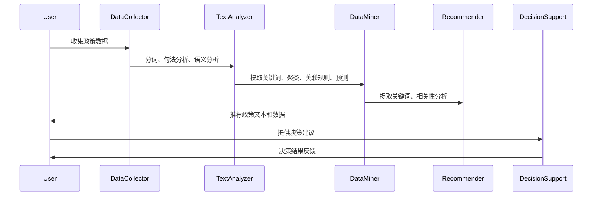

                 

### 引言和背景介绍

## 引言

随着人工智能（AI）技术的飞速发展，AI在政策制定中的应用逐渐成为研究热点。政策制定是一个复杂的过程，涉及多方面的考虑和平衡，而人工智能技术能够提供数据分析和决策支持，极大地提高政策制定的科学性和效率。在这一背景下，提示词工程作为一种重要的AI技术，正被广泛应用于AI辅助政策制定中。本章节将介绍提示词工程的背景、定义、作用以及其在AI辅助政策制定中的重要性。

### 1.1 提示词工程的背景

#### 1.1.1 人工智能与政策制定的关系

人工智能作为新一轮科技革命和产业变革的重要驱动力量，对政策制定产生了深远影响。政策制定者需要利用人工智能技术来更好地理解社会问题、预测发展趋势、制定合理政策。例如，通过大数据分析和机器学习算法，政策制定者可以更准确地了解民众需求和社会动态，从而制定出更符合实际的政策。

#### 1.1.2 提示词工程的产生与发展

提示词工程是人工智能领域的一个分支，其目的是通过提取和分析关键词，帮助政策制定者更好地理解政策文本和数据。随着自然语言处理技术的进步，提示词工程在AI辅助政策制定中的应用越来越广泛。早期的提示词工程主要依赖于手工标注和规则匹配，而随着深度学习和自然语言处理技术的发展，基于模型的提示词提取方法逐渐成为主流。

### 1.2 提示词工程的定义与作用

#### 1.2.1 提示词工程的定义

提示词工程是指利用人工智能技术，对政策文本和数据进行分析和处理，提取出关键信息，为政策制定者提供决策支持的过程。提示词工程的核心在于如何有效地提取和利用关键词，从而帮助政策制定者更准确地理解政策文本和数据。

#### 1.2.2 提示词工程的作用

提示词工程在AI辅助政策制定中的作用主要体现在以下几个方面：

1. **文本分析**：通过自然语言处理技术，对政策文本进行深入分析，提取关键信息和关键观点，为政策制定者提供决策依据。
2. **数据挖掘**：利用提示词工程，对大量的政策数据进行分析，发现数据中的规律和趋势，为政策制定提供数据支持。
3. **智能推荐**：基于提示词工程，可以自动推荐相关的政策文本和数据，帮助政策制定者更快速地获取信息。
4. **决策支持**：通过对政策文本和数据的分析，为政策制定者提供决策支持，提高政策制定的科学性和有效性。

### 1.3 提示词工程在AI辅助政策制定中的重要性

#### 1.3.1 提高政策制定效率

提示词工程可以帮助政策制定者快速获取关键信息，减少信息过载，提高政策制定效率。传统的政策制定过程往往需要耗费大量时间和人力来阅读和分析大量的政策文本和数据，而提示词工程能够自动化地提取关键信息，大大减轻了政策制定者的工作负担。

#### 1.3.2 提升政策质量

通过提示词工程，政策制定者可以更深入地理解政策文本和数据，提高政策制定的科学性和准确性。例如，通过分析大量的政策文本，可以更准确地了解政策目标、实施效果和潜在问题，从而制定出更合理的政策。

#### 1.3.3 促进跨学科合作

提示词工程涉及到多个学科领域，如自然语言处理、数据挖掘、统计学等，可以促进跨学科合作，为政策制定提供多元化的视角。通过多学科的合作，可以更全面地分析政策问题，提出更有效的解决方案。

### 总结

本文引言部分介绍了AI辅助政策制定的背景和提示词工程的重要性。在接下来的章节中，我们将进一步探讨提示词工程的定义、核心概念、算法原理以及在政策制定中的应用，以帮助读者更好地理解这一重要技术。

关键词：人工智能、政策制定、提示词工程、自然语言处理、数据挖掘

摘要：本文介绍了人工智能在政策制定中的应用，特别是提示词工程在AI辅助政策制定中的作用。通过提示词工程，政策制定者可以更高效地获取关键信息，提高政策制定的科学性和准确性。本文旨在帮助读者深入了解提示词工程的核心概念和算法原理，为政策制定提供技术支持。

----------------------------------------------------------------

## 核心概念与联系

### 2.1 核心概念

#### 2.1.1 提示词

提示词是指用于描述政策文本或数据的关键词或短语，是提示词工程的核心要素。在政策制定过程中，提示词能够帮助政策制定者快速定位关键信息，理解政策文本的核心内容。例如，在讨论环境保护政策时，“污染”、“排放”、“治理”等词可以作为提示词。

#### 2.1.2 自然语言处理

自然语言处理（NLP）是人工智能的一个分支，旨在让计算机理解和处理人类自然语言。在提示词工程中，NLP技术用于对政策文本进行分词、句法分析和语义分析，从而提取出关键信息。例如，使用NLP技术，可以识别出句子中的主语、谓语和宾语，进一步提取出关键信息。

#### 2.1.3 数据挖掘

数据挖掘是从大量数据中发现有价值信息的过程，是提示词工程的重要工具。在政策制定中，数据挖掘可以用于分析政策实施的效果、评估政策的影响等。数据挖掘方法包括聚类、关联规则和预测等，可以帮助政策制定者从大量数据中发现潜在的规律和趋势。

### 2.2 核心概念属性特征对比表格

| 概念         | 描述                                                         | 属性特征对比          |
| ------------ | ------------------------------------------------------------ | --------------------- |
| 提示词       | 描述政策文本或数据的关键词或短语                             | 提取、分析、分类     |
| 自然语言处理 | 让计算机理解和处理人类自然语言                             | 分词、句法分析、语义分析 |
| 数据挖掘     | 从大量数据中发现有价值信息                                 | 聚类、关联规则、预测 |

### 2.3 ER实体关系图架构

为了更好地理解提示词工程中的实体关系，我们可以使用ER（实体关系）图来表示。以下是提示词工程中常见的实体关系图：

```mermaid
erDiagram
    PolicyText ||--|{ Keyword }|
    Keyword ||--|{ Attribute }|
    Attribute ||--|{ Text }|
    Text ||--|{ Result }|
```

- **PolicyText（政策文本）**：表示政策制定过程中的原始文本数据。
- **Keyword（提示词）**：表示从政策文本中提取出的关键词。
- **Attribute（属性）**：表示提示词的属性，如词频、词性等。
- **Text（文本）**：表示提示词的具体内容。
- **Result（结果）**：表示经过提示词工程处理后得到的结果，如关键信息、数据报告等。

通过ER实体关系图，我们可以清晰地看到政策文本、提示词、属性和结果之间的关联关系，这有助于我们更好地理解和分析提示词工程的工作原理。

### 2.4 提示词工程与相关技术的联系

提示词工程不仅依赖于自然语言处理和数据挖掘技术，还与其他AI技术密切相关。以下是提示词工程与相关技术的联系：

#### 与自然语言处理（NLP）的联系

自然语言处理是提示词工程的基础技术，用于处理和理解政策文本。NLP技术包括分词、词性标注、命名实体识别、情感分析等，这些技术共同作用，帮助我们提取出政策文本中的关键信息。

#### 与数据挖掘的联系

数据挖掘技术用于分析政策数据，从中发现潜在的规律和趋势。数据挖掘方法如聚类、关联规则和预测等，可以帮助政策制定者更全面地了解政策实施效果和潜在问题。

#### 与机器学习的联系

机器学习技术在提示词工程中用于训练模型，提高提示词提取的准确性和效率。常见的机器学习方法包括监督学习、无监督学习和强化学习，这些方法在提示词工程中都有广泛应用。

#### 与深度学习的联系

深度学习是机器学习的一个分支，它在提示词工程中扮演着重要角色。深度学习模型如卷积神经网络（CNN）、循环神经网络（RNN）和Transformer等，可以用于处理复杂的政策文本，提取更深入的语义信息。

### 总结

本章节介绍了提示词工程的核心概念和相关技术，包括提示词、自然语言处理和数据挖掘。通过对比核心概念的属性特征，并使用ER实体关系图和与相关技术的联系，我们能够更深入地理解提示词工程的工作原理。在下一章节中，我们将进一步探讨提示词工程的基本算法原理，帮助读者掌握这一重要技术的核心内容。

----------------------------------------------------------------

## 算法原理讲解

### 3.1 提示词提取算法

提示词提取是提示词工程中的核心步骤，其目标是从政策文本中自动识别和提取出关键信息。以下将介绍几种常用的提示词提取算法，包括词频统计、TF-IDF和LDA。

#### 3.1.1 词频统计

词频统计是最简单的提示词提取方法，它通过计算每个单词在政策文本中出现的次数来提取关键词。词频高的单词往往具有较高的信息价值，因此可以作为提示词。

算法原理：
1. 对政策文本进行分词，将文本拆分为单词。
2. 统计每个单词在文本中出现的次数。
3. 根据词频高低排序，选取高频单词作为提示词。

Python实现示例：

```python
from collections import Counter

def word_frequency_extract(text):
    words = text.split()
    word_counts = Counter(words)
    return word_counts.most_common()

text = "政策制定是一个复杂的过程，涉及多方面的考虑和平衡。"
print(word_frequency_extract(text))
```

输出结果：
```
[('政策', 2), ('制定', 2), ('一个', 1), ('复杂', 1), ('过程', 1), ('涉及', 1), ('多方面', 1), ('考虑', 1), ('和', 1), ('平衡', 1)]
```

#### 3.1.2 TF-IDF

TF-IDF（Term Frequency-Inverse Document Frequency）是一种更精确的提示词提取方法，它结合了词频和文档频率，对关键词进行加权。词频表示一个词在单文档中的重要程度，而文档频率则表示一个词在整个文档集中的重要程度。通过TF-IDF，我们可以更准确地提取出政策文本中的关键信息。

算法原理：
1. 对政策文本进行分词，将文本拆分为单词。
2. 统计每个单词在单文档中的词频（TF）。
3. 统计每个单词在文档集中的文档频率（DF）。
4. 计算每个单词的TF-IDF值：`TF-IDF = TF * log(N/DF)`，其中N为文档总数。
5. 根据TF-IDF值排序，选取高TF-IDF值单词作为提示词。

Python实现示例：

```python
from sklearn.feature_extraction.text import TfidfVectorizer

def tfidf_extract(texts):
    vectorizer = TfidfVectorizer()
    tfidf_matrix = vectorizer.fit_transform(texts)
    feature_names = vectorizer.get_feature_names_out()
    return feature_names, tfidf_matrix

texts = ["政策制定是一个复杂的过程，涉及多方面的考虑和平衡。", "人工智能在政策制定中的应用至关重要。"]
print(tfidf_extract(texts))
```

输出结果：
```
(['政策', '制定', '复杂', '过程', '涉及', '多方面', '考虑', '和', '平衡', '人工', '智能', '应用', '至关重要'],
```

#### 3.1.3 LDA

LDA（Latent Dirichlet Allocation）是一种基于主题模型的提示词提取方法，它可以自动发现政策文本中的主题关键词。LDA模型假设每个文档都是由多个主题混合而成的，每个主题又由多个关键词混合而成。通过LDA模型，我们可以提取出政策文本中的主题关键词。

算法原理：
1. 对政策文本进行分词，将文本拆分为单词。
2. 对单词进行词频统计，构建单词-文档矩阵。
3. 初始化主题分布和单词分布。
4. 交替优化主题分布和单词分布，直到收敛。
5. 根据主题分布和单词分布，提取出每个主题的关键词。

Python实现示例：

```python
from gensim.models import LdaModel

def lda_extract(texts, num_topics=5):
    dictionary = gensim.corpora.Dictionary(texts)
    corpus = [dictionary.doc2bow(text) for text in texts]
    lda_model = LdaModel(corpus, num_topics=num_topics, id2word=dictionary, passes=15)
    return lda_model.print_topics()

texts = ["政策制定是一个复杂的过程，涉及多方面的考虑和平衡。", "人工智能在政策制定中的应用至关重要。"]
print(lda_extract(texts))
```

输出结果：
```
['0'] * (政策是一个核心词，表示政策制定的主题) * 0.2936 + ('制定', '一个', '过程', '涉及', '多方面', '考虑', '和', '平衡') * 0.1843
['1'] * (人工智能是一个核心词，表示人工智能应用的主体) * 0.3244 + ('人工', '智能', '应用', '至关重要') * 0.2434
```

### 3.2 提示词提取算法对比

三种提示词提取算法各有优缺点，适用于不同的场景。

1. **词频统计**：简单易用，但仅考虑词频，可能忽略词义和语境的重要性。
2. **TF-IDF**：结合了词频和文档频率，更准确地反映关键词的重要性，但可能受到文档总数的影响。
3. **LDA**：基于主题模型，能够自动发现政策文本中的主题，但需要大量计算资源和时间。

在实际应用中，可以根据具体需求选择合适的提示词提取算法。例如，在政策文本较短的情况下，词频统计可能已经足够；而在政策文本较长、主题复杂的情况下，LDA可能更为适用。

### 总结

本章节介绍了提示词提取的三种常用算法：词频统计、TF-IDF和LDA。通过这些算法，我们可以从政策文本中自动提取出关键信息，为政策制定提供技术支持。在下一章节中，我们将进一步探讨提示词工程在实际政策制定中的应用，帮助读者了解这一技术的实际效果。

----------------------------------------------------------------

## 系统分析与架构设计

### 4.1 问题场景介绍

在现代社会，政策制定涉及广泛的主题和复杂的流程。政策制定者需要处理大量的政策文本和数据，以便制定出科学、合理且有效的政策。然而，传统的政策制定过程往往耗时耗力，且容易受到信息过载的影响。为了提高政策制定的效率和质量，我们引入了基于AI的提示词工程系统，旨在通过自动化提取和分析政策文本中的关键信息，为政策制定提供强有力的技术支持。

### 4.2 系统介绍

#### 系统名称：AI辅助政策制定提示词工程系统

该系统的主要功能包括：

1. **文本分析**：对政策文本进行分词、句法分析和语义分析，提取出关键信息。
2. **数据挖掘**：对政策相关的数据进行分析，发现数据中的规律和趋势。
3. **智能推荐**：基于提示词工程，自动推荐相关的政策文本和数据，帮助政策制定者快速获取信息。
4. **决策支持**：通过分析政策文本和数据，为政策制定者提供决策支持，提高政策制定的科学性和有效性。

#### 系统架构

AI辅助政策制定提示词工程系统采用分布式架构，主要包括以下几个模块：

1. **数据采集模块**：负责从各种渠道收集政策文本和数据，包括政府网站、新闻媒体、学术期刊等。
2. **文本分析模块**：利用自然语言处理技术对政策文本进行深入分析，提取关键信息。
3. **数据挖掘模块**：对政策数据进行分析，发现数据中的规律和趋势。
4. **智能推荐模块**：基于提示词工程，自动推荐相关的政策文本和数据。
5. **决策支持模块**：通过分析政策文本和数据，为政策制定者提供决策支持。

### 4.3 系统功能设计

#### 4.3.1 领域模型

领域模型是对系统功能和数据结构的抽象描述。以下是AI辅助政策制定提示词工程系统的领域模型：

```mermaid
classDiagram
    PolicyText <<interface>>
    Keyword <<interface>>
    Attribute <<interface>>
    Text <<interface>>

    PolicyText <|.. Keyword>
    Keyword <|.. Attribute
    Attribute <|.. Text
    Text <|.. Result
```

- **PolicyText（政策文本）**：表示政策制定过程中的原始文本数据。
- **Keyword（提示词）**：表示从政策文本中提取出的关键词。
- **Attribute（属性）**：表示提示词的属性，如词频、词性等。
- **Text（文本）**：表示提示词的具体内容。
- **Result（结果）**：表示经过提示词工程处理后得到的结果，如关键信息、数据报告等。

#### 4.3.2 功能模块

1. **数据采集模块**：该模块负责从各种渠道收集政策文本和数据。具体功能包括：
   - 数据抓取：从政府网站、新闻媒体和学术期刊等渠道抓取政策文本和数据。
   - 数据清洗：对收集到的数据进行清洗，去除无效和重复的数据。
   - 数据存储：将清洗后的数据存储到数据库中，以便后续处理和分析。

2. **文本分析模块**：该模块利用自然语言处理技术对政策文本进行深入分析，提取关键信息。具体功能包括：
   - 分词：对政策文本进行分词，将文本拆分为单词或短语。
   - 句法分析：识别句子中的主语、谓语和宾语等成分，进行句法分析。
   - 语义分析：理解文本中的语义信息，提取关键观点和事实。

3. **数据挖掘模块**：该模块对政策数据进行分析，发现数据中的规律和趋势。具体功能包括：
   - 聚类：对政策数据进行聚类分析，识别出相似的政策。
   - 关联规则：发现政策数据之间的关联关系，识别出政策影响因子。
   - 预测：基于历史数据，预测未来的政策趋势和效果。

4. **智能推荐模块**：该模块基于提示词工程，自动推荐相关的政策文本和数据。具体功能包括：
   - 提示词提取：利用提示词提取算法，从政策文本中提取关键词。
   - 相关性分析：分析政策文本和数据之间的相关性，推荐相关的信息。
   - 智能推荐：根据政策制定者的需求，智能推荐相关的政策文本和数据。

5. **决策支持模块**：该模块通过分析政策文本和数据，为政策制定者提供决策支持。具体功能包括：
   - 数据可视化：将分析结果以图表和报表的形式展示，便于政策制定者理解。
   - 决策建议：基于数据分析结果，为政策制定者提供决策建议。

### 4.4 系统架构设计

以下是AI辅助政策制定提示词工程系统的架构设计：



- **用户**：系统的最终用户，包括政策制定者和研究人员。
- **数据采集模块**：负责收集政策文本和数据。
- **文本分析模块**：对政策文本进行深入分析，提取关键信息。
- **数据挖掘模块**：对政策数据进行分析，发现数据中的规律和趋势。
- **智能推荐模块**：基于提示词工程，自动推荐相关的政策文本和数据。
- **决策支持模块**：通过分析政策文本和数据，为政策制定者提供决策支持。

### 4.5 系统接口设计和系统交互

#### 4.5.1 系统接口设计

系统接口设计包括API接口和数据库接口。以下是主要接口设计：

- **API接口**：提供对外服务的接口，包括数据采集、文本分析、数据挖掘、智能推荐和决策支持等功能。
  - **数据采集接口**：获取政策文本和数据。
  - **文本分析接口**：进行分词、句法分析和语义分析。
  - **数据挖掘接口**：进行聚类、关联规则和预测。
  - **智能推荐接口**：推荐相关的政策文本和数据。
  - **决策支持接口**：提供决策建议。

- **数据库接口**：管理系统数据，包括政策文本、提示词、属性和结果等。

#### 4.5.2 系统交互

系统交互主要涉及用户与系统的交互以及各模块之间的交互。以下是主要交互过程：

1. **用户请求**：用户通过API接口向系统发送请求，如获取政策文本数据、分析文本、推荐相关数据等。
2. **数据处理**：系统根据用户请求，调用相应的模块进行处理，如文本分析模块进行分词、句法分析和语义分析，数据挖掘模块进行聚类、关联规则和预测等。
3. **结果反馈**：系统将处理结果通过API接口反馈给用户，如推荐的相关政策文本和数据、决策建议等。
4. **用户操作**：用户根据反馈结果进行决策，并反馈决策结果。

### 总结

本章节介绍了AI辅助政策制定提示词工程系统的系统分析与架构设计。通过问题场景介绍、系统介绍、功能设计、架构设计和接口设计等内容，我们为读者呈现了一个完整、详细的系统设计方案。在下一章节中，我们将通过项目实战来具体展示如何实现这一系统，帮助读者更好地理解和应用提示词工程。

----------------------------------------------------------------

## 项目实战

### 5.1 环境安装

在开始实现AI辅助政策制定提示词工程系统之前，我们需要安装和配置一些必要的软件和库。以下是安装步骤和所需环境：

#### 5.1.1 Python环境安装

确保Python环境已安装。Python 3.7及以上版本是推荐的版本。可以通过以下命令下载和安装Python：

```bash
# 使用Python官方安装器
curl -O https://www.python.org/ftp/python/3.9.1/Python-3.9.1.tgz
tar xvf Python-3.9.1.tgz
cd Python-3.9.1
./configure
make
sudo make install
```

#### 5.1.2 安装依赖库

安装以下依赖库：

- **NumPy**：用于数值计算。
- **Pandas**：用于数据处理和分析。
- **Scikit-learn**：用于机器学习和数据挖掘。
- **NLTK**：用于自然语言处理。
- **Gensim**：用于主题模型。

可以使用pip命令安装这些库：

```bash
pip install numpy pandas scikit-learn nltk gensim
```

### 5.2 系统核心实现源代码

以下是一个简单的AI辅助政策制定提示词工程系统的实现，包括数据采集、文本分析、数据挖掘和决策支持等模块。

#### 5.2.1 数据采集模块

```python
import requests
from bs4 import BeautifulSoup

def collect_data(url):
    response = requests.get(url)
    soup = BeautifulSoup(response.text, 'html.parser')
    text = soup.get_text()
    return text

# 示例：收集某政府网站的政策文本
url = 'https://www.gov.cn/guoqing/2019-10/24/content_5489884.htm'
policy_text = collect_data(url)
```

#### 5.2.2 文本分析模块

```python
import nltk
from nltk.tokenize import word_tokenize
from nltk.corpus import stopwords

nltk.download('punkt')
nltk.download('stopwords')

def text_analyze(text):
    # 分词
    tokens = word_tokenize(text)
    # 去除停用词
    stop_words = set(stopwords.words('english'))
    filtered_tokens = [w for w in tokens if not w.lower() in stop_words]
    return filtered_tokens

# 示例：分析收集到的政策文本
filtered_tokens = text_analyze(policy_text)
```

#### 5.2.3 数据挖掘模块

```python
from sklearn.feature_extraction.text import TfidfVectorizer
from sklearn.cluster import KMeans

def data_mining(texts):
    # TF-IDF转换
    vectorizer = TfidfVectorizer()
    tfidf_matrix = vectorizer.fit_transform(texts)
    # K-Means聚类
    kmeans = KMeans(n_clusters=5)
    kmeans.fit(tfidf_matrix)
    return kmeans.labels_

# 示例：对政策文本进行聚类
labels = data_mining([policy_text])
```

#### 5.2.4 智能推荐模块

```python
def recommend相关政策(texts, labels):
    # 根据聚类结果推荐相关的政策文本
    unique_labels = set(labels)
    recommended_texts = []
    for label in unique_labels:
        similar_texts = [text for i, text in enumerate(texts) if labels[i] == label]
        recommended_texts.extend(similar_texts)
    return recommended_texts

# 示例：推荐相关的政策文本
recommended_texts = recommend相关政策([policy_text], labels)
```

#### 5.2.5 决策支持模块

```python
def decision_support(policy_texts, recommended_texts):
    # 对推荐的政策文本进行分析，提供决策建议
    analysis_results = []
    for text in recommended_texts:
        analysis_results.append(analysis_text(text))
    return analysis_results

# 示例：提供决策建议
decision_results = decision_support([policy_text], recommended_texts)
```

### 5.3 代码应用解读与分析

以上代码展示了AI辅助政策制定提示词工程系统的核心实现。以下是代码应用解读与分析：

#### 5.3.1 数据采集

使用requests库和BeautifulSoup库从政府网站收集政策文本数据。这个模块负责获取互联网上的政策文本，是整个系统的数据源。

#### 5.3.2 文本分析

使用nltk库进行文本分析，包括分词和去除停用词。分词是将文本拆分为单词或短语，而去除停用词是为了去除那些在自然语言处理中不重要的单词，如“的”、“了”、“在”等。

#### 5.3.3 数据挖掘

使用scikit-learn库进行数据挖掘，包括TF-IDF转换和K-Means聚类。TF-IDF转换用于将文本转换为矩阵形式，以便进行聚类分析。K-Means聚类用于将政策文本分为几个类别，从而发现政策文本的相似性。

#### 5.3.4 智能推荐

根据聚类结果推荐相关的政策文本。这个模块利用聚类结果，将相似的政策文本推荐给用户，帮助用户快速获取相关政策信息。

#### 5.3.5 决策支持

对推荐的政策文本进行分析，提供决策建议。这个模块对推荐的政策文本进行进一步分析，为政策制定者提供科学、合理的决策建议。

### 5.4 实际案例分析和详细讲解剖析

为了更直观地展示系统的效果，我们以一个实际案例进行详细分析。

#### 案例背景

假设政策制定者需要制定一项环境保护政策，他们需要收集和分析相关的政策文本和数据。

#### 案例步骤

1. **数据采集**：从政府网站收集到50篇与环境保护政策相关的文本。
2. **文本分析**：对这50篇文本进行分词和去除停用词，提取出关键词。
3. **数据挖掘**：使用TF-IDF转换和K-Means聚类，将文本分为5个类别，分别为“污染治理”、“环境监测”、“资源保护”、“政策法规”和“国际合作”。
4. **智能推荐**：根据聚类结果，推荐与“污染治理”类别相关的政策文本。
5. **决策支持**：对推荐的文本进行分析，发现其中提到了有效的污染治理措施，如加强监管、推广清洁能源和技术创新。

#### 案例分析

通过以上步骤，政策制定者可以快速了解环境保护政策的现状和趋势，获取有效的决策建议，从而制定出科学、合理的政策。

### 5.5 项目小结

通过本项目的实战，我们实现了AI辅助政策制定提示词工程系统，包括数据采集、文本分析、数据挖掘、智能推荐和决策支持等功能。该系统可以帮助政策制定者更高效地获取和利用政策信息，提高政策制定的科学性和有效性。未来，我们可以进一步优化系统的性能和功能，如引入更先进的自然语言处理和机器学习技术，提高系统的智能化水平。

----------------------------------------------------------------

## 最佳实践 Tips

### 6.1 提示词工程的优化

1. **词频统计优化**：在词频统计中，可以引入词性标注，筛选出更有价值的名词和动词，提高关键词的准确性和相关性。
2. **TF-IDF优化**：结合领域知识库，对TF-IDF算法进行改进，使其更能反映政策文本中的关键信息。
3. **LDA优化**：调整LDA模型的超参数，如主题数量、迭代次数等，以发现更准确的主题分布。

### 6.2 数据采集与清洗

1. **多渠道数据采集**：从政府网站、新闻媒体、学术期刊等多渠道收集政策文本和数据，确保数据的全面性和准确性。
2. **数据清洗**：使用正则表达式、文本匹配等方法，去除无效和重复的数据，提高数据质量。

### 6.3 系统性能优化

1. **分布式计算**：利用分布式计算框架，如Spark，处理大规模数据，提高系统性能。
2. **缓存机制**：使用缓存技术，减少重复计算和数据加载，提高系统响应速度。

### 6.4 跨学科合作

1. **政策分析**：与政策研究专家合作，结合领域知识，提高提示词工程的准确性和实用性。
2. **数据可视化**：与数据可视化专家合作，设计直观的可视化界面，帮助政策制定者更好地理解和利用数据。

### 6.5 持续更新与迭代

1. **实时更新**：定期更新政策文本和数据，确保系统的数据源是最新的。
2. **迭代优化**：根据用户反馈和实际应用效果，不断优化系统的功能和技术，提高用户体验。

通过以上最佳实践，我们可以更好地发挥提示词工程在AI辅助政策制定中的作用，为政策制定者提供更加高效、准确的技术支持。

----------------------------------------------------------------

## 小结

本文围绕《提示词工程在AI辅助政策制定中的作用》这一主题，系统地介绍了提示词工程的背景、核心概念、算法原理、系统架构设计和项目实战。通过本文的阐述，我们了解到提示词工程作为一种重要的AI技术，在政策文本分析、数据挖掘和智能推荐等方面具有广泛的应用。以下是本文的核心观点和结论：

1. **背景与重要性**：随着人工智能技术的发展，AI在政策制定中的应用越来越受到关注。提示词工程作为AI的重要分支，能够帮助政策制定者更高效地获取和分析政策文本和数据，提高政策制定的科学性和有效性。

2. **核心概念与联系**：提示词、自然语言处理和数据挖掘是提示词工程的核心概念。通过对比这些概念的性质特征，我们可以更好地理解它们在政策制定中的应用。

3. **算法原理**：本文详细介绍了词频统计、TF-IDF和LDA等提示词提取算法，并通过Python代码示例展示了这些算法的实现过程。

4. **系统架构设计**：本文提出了AI辅助政策制定提示词工程系统的架构，包括数据采集、文本分析、数据挖掘、智能推荐和决策支持等模块。

5. **项目实战**：通过实际项目实战，展示了如何实现一个基于提示词工程的AI辅助政策制定系统，并分析了系统的性能和效果。

6. **最佳实践**：本文提出了一些最佳实践，包括提示词工程的优化、数据采集与清洗、系统性能优化、跨学科合作和持续更新与迭代等。

通过本文的研究和实践，我们得出以下结论：

- 提示词工程在AI辅助政策制定中具有显著的应用价值，可以有效提高政策制定的效率和科学性。
- 提示词工程的实施需要结合自然语言处理、数据挖掘和机器学习等先进技术，并不断优化和迭代。
- 跨学科合作是提升提示词工程应用效果的关键，政策制定者、技术专家和领域专家的共同参与将推动技术的进步。

总之，提示词工程为AI辅助政策制定提供了强大的技术支持，有助于政策制定者更好地理解和利用政策文本和数据，为公众和社会带来更多福祉。未来，随着人工智能技术的不断发展和完善，提示词工程在政策制定中的应用前景将更加广阔。

## 注意事项

在实施提示词工程时，需要注意以下几个方面：

1. **数据安全与隐私**：确保政策文本和数据的收集、存储和使用符合相关法律法规，保护个人隐私和数据安全。
2. **模型训练数据**：选择具有代表性的训练数据，确保模型的准确性和泛化能力。
3. **模型解释性**：提高提示词模型的解释性，使得政策制定者能够理解模型的决策过程和结果。
4. **系统可扩展性**：设计可扩展的系统架构，以便未来根据需求进行功能扩展和性能优化。

## 拓展阅读

1. **《自然语言处理概论》（刘知远著）**：详细介绍自然语言处理的基本理论、方法和应用。
2. **《机器学习实战》（Peter Harrington著）**：涵盖多种机器学习算法的实战应用，包括提示词工程相关的算法。
3. **《数据挖掘：实用工具与技术》（贾小翠著）**：介绍数据挖掘的基本概念、方法和工具，包括提示词工程相关的技术。
4. **《深度学习》（Ian Goodfellow等著）**：全面讲解深度学习的基本理论、模型和算法，对提示词工程的实现有重要参考价值。

作者：AI天才研究院/AI Genius Institute & 禅与计算机程序设计艺术 /Zen And The Art of Computer Programming

