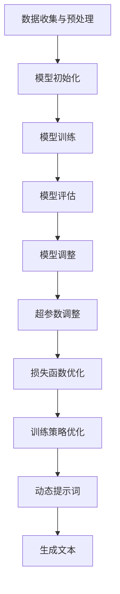
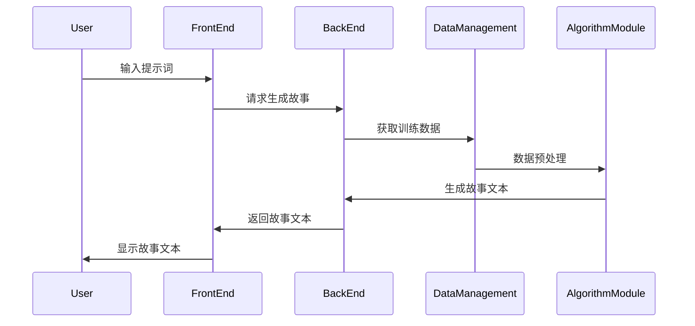
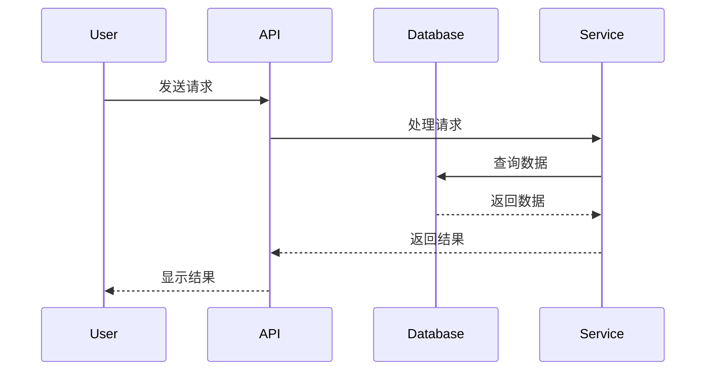

                 

### 第1章：AI辅助科幻创作概述

#### 1.1 AI辅助科幻创作的时代背景

随着人工智能（AI）技术的飞速发展，科幻创作这一领域也迎来了前所未有的变革。人工智能作为一种能够模拟、延伸和扩展人类智能的技术，已经深刻地改变了我们的生活方式和工作方式。在科幻创作中，AI同样展现出了其强大的力量，不仅能够提供丰富的创意素材，还能在创作过程中提供实时反馈和优化建议。

**人工智能与科幻创作的历史演进**

人工智能的概念最早可以追溯到20世纪50年代，而科幻文学中对于人工智能的描绘则更加久远。从经典的《2001太空漫游》、《机器人总动员》到现代的《黑镜》，人工智能始终是科幻作品中的重要主题。随着AI技术的不断发展，科幻作家们对于人工智能的想象也变得越来越具体和真实。

**提示词工程的发展与AI在科幻创作中的应用现状**

提示词工程是近年来兴起的一项技术，通过利用自然语言处理（NLP）技术，对提示词进行构建、优化与组合，实现AI在文本生成中的高效应用。在科幻创作中，提示词工程可以用来生成故事情节、角色设定、世界观构建等内容，极大地提高了创作效率和创意质量。

目前，AI在科幻创作中的应用已经取得了一些显著的成果。例如，一些科幻作家已经开始使用AI工具来辅助创作，通过输入简单的提示词，AI就可以生成完整的小说章节或故事梗概。此外，一些AI平台还提供了智能写作助手功能，可以根据用户的输入自动生成文本，并提供修改建议。

**AI辅助科幻创作的意义与挑战**

AI辅助科幻创作不仅有助于提高创作效率，还能够拓展人类的想象力边界。通过AI的辅助，科幻作家能够在更广泛的领域内探索创意，创造出更加丰富多样的科幻作品。然而，AI辅助科幻创作也面临一些挑战，如如何保证AI生成内容的原创性和质量，以及如何确保AI不偏离创作目标等。

#### 1.2 核心概念解析

**提示词工程**

提示词工程是AI辅助科幻创作的重要技术手段，其核心在于如何利用提示词引导AI模型生成高质量的文本。提示词通常是一系列关键词或短语，它们能够为AI提供明确的创作方向和灵感。

**AI辅助科幻创作**

AI辅助科幻创作是指利用人工智能技术，特别是自然语言处理和机器学习等技术，辅助科幻作家进行创意生成、情节构建、角色设定等工作。通过AI的辅助，科幻作家能够更加高效地创作出具有创新性和想象力的作品。

**想象力拓展**

通过AI的辅助，科幻作家能够在更广泛的领域内探索创意，突破传统创作限制。AI可以提供丰富的创意素材和灵感，帮助科幻作家在科幻作品中构建出更加丰富和多样的世界观。

**概念结构与核心要素组成**

- **提示词工程**：利用自然语言处理技术，通过对提示词的构建、优化与组合，实现AI在文本生成中的辅助创作。
- **AI辅助科幻创作**：通过AI技术，特别是在提示词工程的帮助下，提高科幻创作的效率与质量。
- **想象力拓展**：通过AI的辅助，科幻作家能够在更广泛的领域内探索创意，突破传统创作限制。

## 第1章：AI辅助科幻创作概述

### 1.1 AI辅助科幻创作的时代背景

#### 1.1.1 人工智能与科幻创作的历史演进

人工智能（AI）的概念最早由约翰·麦卡锡（John McCarthy）于1956年在达特茅斯会议（Dartmouth Conference）上提出，这标志着人工智能作为一门学科正式诞生。从那时起，人工智能经历了数十年的发展，从早期的符号主义、连接主义到现代的深度学习，AI技术在各个领域都取得了显著的成果。

在科幻文学领域，人工智能的构想同样有着悠久的历史。1942年，阿西莫夫（Isaac Asimov）在他的小说《机器人》（Robot）系列中提出了“机器人三大定律”，这些定律至今仍然是人工智能研究和应用的重要原则。此后，许多科幻作家如威廉·吉布森（William Gibson）、菲利普·K·迪克（Philip K. Dick）等，都在他们的作品中深入探讨了人工智能的未来前景和社会影响。

随着AI技术的不断进步，科幻作家们对于人工智能的描绘也变得更加具体和真实。从简单的程序到具有自我意识和情感的实体，人工智能在科幻文学中的形象不断演变。这些作品不仅为读者提供了丰富的想象空间，也推动了AI技术的发展。

#### 1.1.2 提示词工程的发展与AI在科幻创作中的应用现状

提示词工程是近年来在自然语言处理（NLP）领域中兴起的一个研究方向，它通过利用一系列关键词或短语（即提示词）来引导AI模型生成文本。这一技术的核心在于如何有效地设计提示词，使其能够为AI提供明确的方向和丰富的信息，从而生成高质量的文本。

提示词工程的发展可以追溯到早期自然语言处理系统，如基于规则的方法和模板匹配技术。然而，随着深度学习技术的兴起，特别是序列到序列（Seq2Seq）模型和生成对抗网络（GAN）的应用，提示词工程得到了显著的发展。现代的提示词工程不仅能够处理简单的文本生成任务，还能够应对复杂的、具有高度语义性的创作需求。

在科幻创作中，AI和提示词工程的应用已经展现出巨大的潜力。例如，一些科幻作家开始使用AI工具来辅助创作，通过输入简单的提示词，AI就可以生成完整的故事情节、角色描述或世界观设定。这些工具不仅提高了创作的效率，还极大地拓展了科幻作家的想象力边界。

目前，AI在科幻创作中的应用主要包括以下几个方面：

1. **自动故事生成**：利用提示词工程和生成模型（如变分自编码器（VAE）和生成对抗网络（GAN）），AI可以自动生成科幻故事，包括情节、角色和背景设定。
2. **创意生成**：AI可以提供丰富的创意素材和灵感，帮助科幻作家在构思和创作过程中突破传统限制。
3. **编辑辅助**：AI工具可以提供语法检查、文本优化和风格调整等辅助功能，帮助作家提高作品的质量和可读性。
4. **交互式创作**：通过对话系统和虚拟助手，AI可以与作家进行实时互动，提供创作建议和反馈。

#### 1.1.3 AI辅助科幻创作的意义与挑战

AI辅助科幻创作具有重要意义，主要体现在以下几个方面：

1. **提高创作效率**：AI可以自动处理一些重复性、繁琐的创作任务，如故事情节生成、角色设定等，从而节省作家的时间和精力，使其能够专注于更具有创造性的工作。
2. **拓展想象力**：AI提供的丰富创意素材和灵感，可以帮助科幻作家在更广泛的领域内探索创意，创造出更加独特和有创意的作品。
3. **优化创作质量**：AI工具可以进行语法和风格检查，提供文本优化建议，从而提高作品的写作质量和可读性。

然而，AI辅助科幻创作也面临一些挑战：

1. **原创性保证**：AI生成的文本可能存在抄袭或重复的问题，如何确保原创性是一个需要解决的问题。
2. **质量控制**：AI生成的文本质量参差不齐，如何保证生成的文本具有高质量和创意是一个挑战。
3. **伦理和道德问题**：AI辅助创作可能会涉及到版权、隐私和伦理等问题，如何规范和引导AI在创作中的行为是一个需要考虑的问题。

#### 1.2 核心概念解析

为了更好地理解AI辅助科幻创作的工作原理和实际应用，我们需要对一些核心概念进行详细解析。

**提示词工程**

提示词工程是AI辅助科幻创作的重要技术手段，它主要通过以下几个步骤来实现：

1. **提示词设计**：选择合适的提示词，这些提示词需要具有丰富的语义和信息量，能够为AI提供明确的创作方向。
2. **模型训练**：利用大量的训练数据，通过深度学习算法训练出能够理解和生成文本的模型。常见的模型包括变分自编码器（VAE）、生成对抗网络（GAN）和序列到序列（Seq2Seq）模型。
3. **模型优化**：通过调整超参数、优化训练策略，提高模型生成文本的质量和效率。

**AI辅助科幻创作**

AI辅助科幻创作是指利用人工智能技术，特别是自然语言处理和机器学习等技术，辅助科幻作家进行创意生成、情节构建、角色设定等工作。具体来说，AI辅助科幻创作主要包括以下几个方面：

1. **自动故事生成**：利用提示词工程和生成模型，AI可以自动生成科幻故事，包括情节、角色和背景设定。
2. **创意生成**：AI可以提供丰富的创意素材和灵感，帮助科幻作家在构思和创作过程中突破传统限制。
3. **编辑辅助**：AI工具可以提供语法检查、文本优化和风格调整等辅助功能，帮助作家提高作品的质量和可读性。
4. **交互式创作**：通过对话系统和虚拟助手，AI可以与作家进行实时互动，提供创作建议和反馈。

**想象力拓展**

通过AI的辅助，科幻作家能够在更广泛的领域内探索创意，突破传统创作限制。AI可以提供丰富的创意素材和灵感，帮助作家在科幻作品中构建出更加丰富和多样的世界观。例如，AI可以帮助作家探索未来科技、外星文明、虚拟现实等主题，从而创造出前所未有的科幻故事。

#### 概念属性特征对比表格

为了更好地理解提示词工程、AI辅助科幻创作和想象力拓展这三个核心概念，我们提供了一个对比表格，展示它们的主要属性特征。

| 概念                    | 定义                                                         | 属性特征对比                                     |
|------------------------|--------------------------------------------------------------|----------------------------------------------|
| 提示词工程              | 通过设计、优化和利用提示词，引导AI生成文本的技术手段。           | - 提示词的长度和语义丰富性<br>- 模型的训练效率和效果<br>- 文本生成的多样性和连贯性                 |
| AI辅助科幻创作          | 利用人工智能技术辅助科幻作家进行创作的过程。                     | - 创作的自动化和效率提升<br>- 创意的拓展和想象力的激发<br>- 文本生成质量和原创性保障           |
| 想象力拓展              | 通过AI辅助，科幻作家能够在更广泛的领域内探索创意和构建世界观。   | - 创意的多样性和创新性<br>- 世界观的复杂性和深度<br>- 与现实世界的结合和拓展               |

#### ER实体关系图架构

为了更直观地展示提示词工程、AI辅助科幻创作和想象力拓展之间的关系，我们提供了一个ER（实体关系）图架构。

```mermaid
erDiagram
    A[提示词工程] ||--|{ B[AI辅助科幻创作] } |
    A ||--|{ C[想象力拓展] } |
    B ||--|{ D[故事情节生成] } |
    B ||--|{ E[角色设定] } |
    B ||--|{ F[世界观构建] } |
    C ||--|{ G[创意素材生成] } |
    C ||--|{ H[互动反馈] } |
```

在这个ER图中，提示词工程（A）是核心实体，它通过引导AI辅助科幻创作（B），进而实现想象力拓展（C）。AI辅助科幻创作（B）则包括故事情节生成（D）、角色设定（E）和世界观构建（F）等具体任务。想象力拓展（C）则通过生成创意素材（G）和提供互动反馈（H）来进一步推动科幻创作的发展。

#### 提示词工程原理讲解

提示词工程是AI辅助科幻创作中的一项关键技术，它通过利用一系列关键词或短语（即提示词）来引导AI模型生成高质量的文本。下面，我们将详细讲解提示词工程的原理，包括其设计、训练和优化过程。

**1. 提示词设计**

提示词是提示词工程的核心要素，它们需要具备以下特点：

- **长度适中**：提示词不宜过长，否则可能会影响AI模型的理解和处理能力。通常，提示词的长度在几个单词到几十个单词之间。
- **语义丰富**：提示词需要具有丰富的语义信息，能够为AI模型提供明确的创作方向和灵感。例如，在生成科幻故事时，提示词可以是“未来科技”、“外星文明”、“时空旅行”等。
- **多样性**：提示词需要具有多样性，以便AI模型能够生成不同风格和主题的文本。例如，在生成科幻小说时，提示词可以包括“机器人”、“虚拟现实”、“太空探索”等。

**2. 模型训练**

在提示词设计完成后，我们需要利用大量训练数据对AI模型进行训练。训练过程通常包括以下几个步骤：

- **数据收集**：收集大量的文本数据，这些数据可以是科幻小说、故事梗概、角色设定等。数据的质量和多样性直接影响模型训练的效果。
- **数据预处理**：对收集到的文本数据进行预处理，包括分词、去除停用词、词性标注等。预处理过程有助于提高模型对文本的理解能力。
- **模型选择**：选择合适的AI模型，常见的模型包括变分自编码器（VAE）、生成对抗网络（GAN）和序列到序列（Seq2Seq）模型。不同模型适用于不同的文本生成任务。
- **训练过程**：利用预处理后的文本数据，通过训练算法（如梯度下降）调整模型参数，使模型能够生成高质量的文本。训练过程中需要监控模型的性能指标，如损失函数和准确率等。

**3. 模型优化**

在模型训练完成后，我们需要对模型进行优化，以提高其生成文本的质量和效率。模型优化包括以下几个方面：

- **超参数调整**：调整模型训练过程中的超参数，如学习率、批量大小、迭代次数等。合适的超参数能够提高模型的训练效果。
- **训练策略优化**：采用不同的训练策略，如迁移学习、对抗训练等，以进一步提高模型生成文本的质量。
- **损失函数优化**：优化模型的损失函数，使其能够更好地反映文本生成任务的特性。常见的损失函数包括交叉熵损失函数和对抗损失函数。
- **评估指标优化**：选择合适的评估指标，如生成文本的连贯性、原创性和可读性等，以评估模型生成的文本质量。

**4. 提示词优化**

在模型训练和优化过程中，我们还需要对提示词进行优化，以提高其引导AI模型生成高质量文本的能力。提示词优化包括以下几个方面：

- **提示词筛选**：根据模型训练和评估结果，筛选出效果较好的提示词，剔除效果较差的提示词。这样可以确保模型能够利用最有价值的提示词进行文本生成。
- **提示词组合**：通过组合多个提示词，形成复合提示词，以增强AI模型生成文本的多样性和创意性。复合提示词可以是简单的词组，也可以是完整的句子。
- **动态提示词**：根据文本生成任务的动态变化，实时调整提示词。例如，在生成科幻故事时，可以根据故事情节的发展，动态调整提示词，以保持文本生成的连贯性和创意性。

通过以上步骤，提示词工程可以有效地引导AI模型生成高质量的文本，从而实现AI辅助科幻创作的目标。在下一章中，我们将进一步探讨AI辅助科幻创作在实践中的应用案例，分析其成功经验和面临的挑战。

### 1.3 拓展想象力：AI辅助科幻创作的未来前景

随着人工智能技术的不断进步，AI辅助科幻创作的前景变得越来越广阔。通过AI的辅助，科幻作家不仅能够在更广泛的领域内探索创意，还能创造出更加丰富多样的科幻作品。本节将探讨AI辅助科幻创作的未来前景，包括其潜在应用领域、影响以及可能面临的挑战。

#### 1.3.1 AI辅助科幻创作的应用领域与案例分析

1. **自动故事生成**

自动故事生成是AI辅助科幻创作的一个重要应用领域。通过提示词工程和生成模型，AI可以自动生成完整的科幻故事，包括情节、角色和背景设定。例如，使用生成对抗网络（GAN）和变分自编码器（VAE），AI可以生成具有高度原创性和创意性的科幻小说。一些AI平台已经实现了这一功能，用户只需输入简单的提示词，AI就能生成完整的故事梗概。

2. **角色设定与背景构建**

在科幻创作中，角色设定和背景构建是至关重要的。AI可以通过分析大量的科幻文学作品，自动生成独特的角色和背景设定。例如，AI可以分析已有的角色性格特点、背景故事和世界观，然后结合提示词生成新的角色和背景。这种自动化角色和背景生成技术可以帮助科幻作家在短时间内构建出复杂的虚构世界。

3. **交互式创作**

通过对话系统和虚拟助手，AI可以与作家进行实时互动，提供创作建议和反馈。例如，AI可以实时分析作家的创作文本，提供语法、风格和情节优化建议。这种交互式创作模式不仅可以提高创作效率，还能激发作家的创意思维，推动科幻创作的创新。

4. **创意素材生成**

AI可以提供丰富的创意素材和灵感，帮助科幻作家在构思和创作过程中突破传统限制。例如，AI可以通过分析现有的科幻作品，生成新的科技概念、外星生物和未来社会场景。这些创意素材可以为科幻作家提供宝贵的灵感，帮助他们创作出更加独特和有创意的作品。

#### 1.3.2 AI辅助科幻创作的潜在影响与挑战

1. **影响**

AI辅助科幻创作对科幻文学的发展具有深远的影响：

- **提高创作效率**：通过自动故事生成、角色设定和背景构建等AI技术，科幻作家的创作效率将大大提高，他们可以有更多的时间专注于创意和构思。
- **拓展想象力**：AI可以提供丰富的创意素材和灵感，帮助科幻作家在更广泛的领域内探索创意，构建出更加丰富多样的科幻世界。
- **创新性提升**：AI辅助创作可以打破传统创作的限制，激发科幻作家的创新思维，推动科幻文学的创新发展。

2. **挑战**

尽管AI辅助科幻创作具有巨大的潜力，但也面临一些挑战：

- **原创性保证**：AI生成的文本可能存在抄袭或重复的问题，如何确保原创性是一个需要解决的问题。
- **质量控制**：AI生成的文本质量参差不齐，如何保证生成的文本具有高质量和创意是一个挑战。
- **伦理和道德问题**：AI辅助创作可能会涉及到版权、隐私和伦理等问题，如何规范和引导AI在创作中的行为是一个需要考虑的问题。

#### 1.3.3 未来想象力边界的拓展方向

随着AI技术的不断发展，未来想象力边界的拓展方向将更加广阔：

1. **跨学科融合**：AI与科幻创作的结合可以促进跨学科的融合，如与生物学、物理学、社会学等领域的合作，创造出更加丰富和多样的科幻作品。
2. **虚拟现实与增强现实**：通过虚拟现实（VR）和增强现实（AR）技术，科幻作家可以在更加沉浸式的环境中进行创作，为读者提供更加身临其境的阅读体验。
3. **人机协作**：未来，科幻作家与AI的协作将成为一种新的创作模式。AI可以提供创意和灵感，而作家则负责构思和打磨故事，这种人机协作的模式将大大提高创作效率和质量。

总之，AI辅助科幻创作具有巨大的潜力，未来将在更多领域发挥重要作用。通过不断探索和创新发展，科幻作家和AI技术将为读者带来更多精彩的作品，拓展人类的想象力边界。

#### 1.4 本章小结

本章介绍了AI辅助科幻创作的时代背景、核心概念和发展现状。我们首先回顾了人工智能与科幻创作的历史演进，探讨了AI和提示词工程在科幻创作中的应用。接着，我们分析了AI辅助科幻创作的意义与挑战，详细解析了提示词工程的原理，包括提示词设计、模型训练和优化过程。最后，我们展望了AI辅助科幻创作的未来前景，探讨了其潜在应用领域和拓展想象力边界的方向。

通过本章的学习，读者可以更好地理解AI辅助科幻创作的技术原理和应用场景，为后续章节的内容奠定基础。

### 第2章：提示词工程原理

#### 2.1 提示词工程概述

提示词工程是AI辅助科幻创作的重要技术手段，它通过利用一系列关键词或短语（即提示词）来引导AI模型生成高质量的文本。提示词工程的核心在于如何设计、构建和优化提示词，以实现AI在文本生成中的高效应用。

**定义与目的**

提示词工程（Prompt Engineering）是一种利用自然语言处理（NLP）技术，通过对提示词的设计、优化和组合，引导AI模型生成目标文本的方法。其目的是提高文本生成的质量和效率，使其更符合人类的需求和期望。

**发展历程**

提示词工程的发展可以追溯到早期自然语言处理系统，如基于规则的方法和模板匹配技术。然而，随着深度学习技术的兴起，特别是序列到序列（Seq2Seq）模型和生成对抗网络（GAN）的应用，提示词工程得到了显著的发展。现代的提示词工程不仅能够处理简单的文本生成任务，还能够应对复杂的、具有高度语义性的创作需求。

**主要应用领域**

提示词工程在许多领域都有广泛应用，包括但不限于：

1. **自动故事生成**：利用提示词工程，AI可以自动生成故事情节、角色设定和背景描述，为科幻创作提供灵感。
2. **文本摘要**：通过提示词工程，AI可以生成简洁、准确的文本摘要，帮助用户快速获取关键信息。
3. **问答系统**：在问答系统中，提示词工程可以帮助AI更好地理解用户的问题，并生成高质量的回答。
4. **对话系统**：在虚拟助手和聊天机器人中，提示词工程可以用于生成自然流畅的对话内容。

#### 2.2 提示词模型构建

提示词模型的构建是提示词工程的核心步骤之一，它决定了AI在文本生成中的表现。一个有效的提示词模型需要具备以下特点：

1. **语义丰富**：提示词模型需要能够理解和生成具有丰富语义的文本，这意味着它需要对输入的提示词进行深入的分析和处理。
2. **灵活性**：提示词模型应该具备一定的灵活性，能够适应不同的文本生成任务和场景。
3. **高效性**：提示词模型需要具备高效的生成能力，能够在较短的时间内生成高质量的文本。

**模型选择**

在构建提示词模型时，有多种模型可供选择，包括：

1. **循环神经网络（RNN）**：RNN是一种常见的人工神经网络，它能够处理序列数据。在提示词工程中，RNN可以用于生成文本，但它的生成速度较慢且存在梯度消失问题。
2. **长短期记忆网络（LSTM）**：LSTM是RNN的一种改进，它通过引入记忆单元来避免梯度消失问题，适用于处理长序列数据。LSTM在文本生成任务中表现出色，但训练时间较长。
3. **变换器（Transformer）**：Transformer是近年来流行的一种模型结构，它通过自注意力机制（Self-Attention）来处理序列数据，具有高效和灵活的特点。BERT、GPT等模型都是基于Transformer架构。
4. **生成对抗网络（GAN）**：GAN由生成器和判别器组成，生成器生成文本，判别器判断文本的真实性。GAN在生成文本的多样性和质量方面表现出色，但训练过程复杂且不稳定。

**训练数据**

构建提示词模型的关键之一是选择合适的训练数据。训练数据的质量和多样性直接影响模型的性能。在科幻创作中，可以选择以下类型的训练数据：

1. **科幻小说**：选择大量的科幻小说作为训练数据，帮助模型学习科幻故事的常见结构和风格。
2. **角色设定**：收集不同角色的设定资料，帮助模型学习如何生成独特的角色。
3. **背景描述**：收集各种背景描述，帮助模型学习如何构建丰富的世界观。

**训练过程**

训练提示词模型通常包括以下步骤：

1. **数据预处理**：对训练数据进行预处理，包括分词、去除停用词、词性标注等。
2. **模型初始化**：初始化模型的参数，可以选择随机初始化或预训练初始化。
3. **模型训练**：使用训练数据进行模型训练，通过优化算法（如梯度下降）调整模型参数。
4. **模型评估**：使用验证数据对模型进行评估，选择性能最好的模型。
5. **模型调整**：根据评估结果，对模型进行进一步调整，以提高生成文本的质量。

#### 2.3 提示词模型优化

提示词模型优化是提高模型生成文本质量和效率的关键步骤。优化过程通常包括以下几个方面：

1. **超参数调整**：超参数包括学习率、批量大小、迭代次数等。通过调整这些超参数，可以提高模型的性能。例如，增加批量大小可以提高模型的学习效率，但可能导致过拟合。

2. **损失函数优化**：损失函数是衡量模型预测结果与真实结果之间差异的指标。选择合适的损失函数，可以更好地指导模型优化。在文本生成任务中，常见的损失函数包括交叉熵损失函数和对抗损失函数。

3. **训练策略优化**：训练策略包括迁移学习、对抗训练、继续训练等。通过采用不同的训练策略，可以进一步提高模型的性能。例如，迁移学习可以利用预训练模型，减少训练数据的需求。

4. **模型融合**：将多个模型进行融合，可以进一步提高生成文本的质量。常见的模型融合方法包括对齐融合、加权融合和集成融合等。

5. **动态提示词**：在生成文本的过程中，动态调整提示词，可以进一步提高生成文本的质量和连贯性。例如，根据生成文本的进展，实时调整提示词的语义和长度。

#### 2.4 提示词工程实践案例

为了更好地理解提示词工程的原理和应用，下面我们通过一个实践案例来讲解。

**案例：生成科幻故事情节**

1. **需求分析**：用户希望生成一个关于未来科技和人类探索外星球的科幻故事情节。

2. **数据准备**：收集大量关于科幻小说、未来科技和人类探索外星球的文本数据作为训练数据。

3. **模型构建**：选择一个基于Transformer架构的模型（如GPT-2或GPT-3）作为提示词模型。

4. **模型训练**：使用训练数据进行模型训练，通过优化算法调整模型参数。

5. **模型优化**：调整超参数，如学习率、批量大小等，以提高模型性能。

6. **生成文本**：输入提示词“未来科技”和“人类探索外星球”，模型生成一个关于未来科技和人类探索外星球的科幻故事情节。

7. **结果评估**：对生成的文本进行评估，包括语义连贯性、创意性和质量等。

8. **动态调整**：根据评估结果，动态调整提示词，以提高生成文本的质量。

通过这个案例，我们可以看到提示词工程在生成科幻故事情节中的应用过程。在实际应用中，可以根据不同的需求和场景，调整提示词和模型参数，以实现不同的文本生成任务。

#### 2.5 本章小结

本章详细介绍了提示词工程的原理和应用。我们首先介绍了提示词工程的定义和目的，回顾了其发展历程和应用领域。接着，我们探讨了提示词模型的构建过程，包括模型选择、训练数据和训练过程。随后，我们讲解了提示词模型优化的方法，包括超参数调整、损失函数优化、训练策略优化和动态提示词。最后，通过一个实践案例，我们展示了提示词工程在生成科幻故事情节中的应用过程。

通过本章的学习，读者可以深入理解提示词工程的原理和应用，为后续章节的内容打下坚实的基础。

### 第3章：算法原理讲解

#### 3.1 提示词工程算法详解

提示词工程作为AI辅助科幻创作的核心技术，其算法原理至关重要。在这一部分，我们将详细讲解提示词工程的基本算法，包括模型选择、训练过程和优化方法。

#### 3.1.1 模型选择

提示词工程的模型选择决定了AI生成文本的质量和效率。当前，常用的模型包括循环神经网络（RNN）、长短期记忆网络（LSTM）、变换器（Transformer）和生成对抗网络（GAN）。以下是这些模型的特点和适用场景：

1. **循环神经网络（RNN）**：
   - **特点**：RNN能够处理序列数据，保留历史信息。
   - **适用场景**：简单的文本生成任务，如聊天机器人、回复生成等。
   - **不足**：梯度消失和梯度爆炸问题，难以处理长序列。

2. **长短期记忆网络（LSTM）**：
   - **特点**：LSTM通过引入记忆单元解决RNN的梯度消失问题，能够处理长序列数据。
   - **适用场景**：复杂的文本生成任务，如机器翻译、文本摘要等。
   - **不足**：计算复杂度高，训练时间长。

3. **变换器（Transformer）**：
   - **特点**：Transformer采用自注意力机制，能够并行处理序列数据，效率高。
   - **适用场景**：各种文本生成任务，如自动故事生成、问答系统等。
   - **不足**：对计算资源要求较高。

4. **生成对抗网络（GAN）**：
   - **特点**：GAN由生成器和判别器组成，生成器生成文本，判别器判断文本的真实性。
   - **适用场景**：生成具有高度多样性和创意性的文本，如图像生成、文本生成等。
   - **不足**：训练不稳定，容易出现模式崩溃。

在科幻创作中，Transformer和GAN表现出色，能够生成高质量和创意性的文本。

#### 3.1.2 训练过程

提示词工程的训练过程是构建高效文本生成模型的关键。以下是训练过程的步骤：

1. **数据收集与预处理**：
   - 收集大量的科幻小说、角色设定、背景描述等文本数据。
   - 对文本数据进行预处理，包括分词、去除停用词、词性标注等。

2. **模型初始化**：
   - 初始化模型的参数，可以选择随机初始化或预训练初始化。

3. **模型训练**：
   - 使用训练数据进行模型训练，通过优化算法（如梯度下降）调整模型参数。
   - 监控模型性能，选择性能最好的模型。

4. **模型评估**：
   - 使用验证数据对模型进行评估，包括生成文本的连贯性、创意性和质量等。

5. **模型调整**：
   - 根据评估结果，对模型进行进一步调整，以提高生成文本的质量。

#### 3.1.3 优化方法

优化方法包括超参数调整、损失函数优化、训练策略优化和动态提示词等。

1. **超参数调整**：
   - 超参数包括学习率、批量大小、迭代次数等。
   - 调整超参数可以提高模型的性能，但需要避免过拟合。

2. **损失函数优化**：
   - 损失函数是衡量模型预测结果与真实结果之间差异的指标。
   - 选择合适的损失函数，可以更好地指导模型优化。

3. **训练策略优化**：
   - 训练策略包括迁移学习、对抗训练、继续训练等。
   - 采用不同的训练策略，可以进一步提高模型的性能。

4. **动态提示词**：
   - 在生成文本的过程中，动态调整提示词的语义和长度。
   - 动态提示词可以提高生成文本的质量和连贯性。

#### 3.2 算法流程图

为了更直观地展示提示词工程的算法流程，我们使用Mermaid绘制了以下流程图：



#### 3.3 Python源代码示例

下面是一个简单的Python源代码示例，用于展示提示词工程的算法实现。代码使用了Hugging Face的Transformers库，实现了一个基于GPT-2的文本生成模型。

```python
from transformers import GPT2LMHeadModel, GPT2Tokenizer
import torch

# 初始化模型和tokenizer
tokenizer = GPT2Tokenizer.from_pretrained('gpt2')
model = GPT2LMHeadModel.from_pretrained('gpt2')

# 设置设备
device = torch.device("cuda" if torch.cuda.is_available() else "cpu")
model.to(device)

# 提示词
prompt = "在遥远的未来，人类开始探索外太空。他们发现了一颗名为XZ-123的行星。"

# 预处理
input_ids = tokenizer.encode(prompt, return_tensors='pt')

# 生成文本
output = model.generate(input_ids, max_length=100, num_return_sequences=1, do_sample=True)

# 解码文本
decoded_text = tokenizer.decode(output[0], skip_special_tokens=True)

print(decoded_text)
```

这段代码首先初始化了GPT-2模型和tokenizer，然后使用给定的提示词进行文本生成。生成的文本经过解码后，输出一个关于未来人类探索外星球的简短故事。

#### 3.4 数学模型与公式

在提示词工程中，数学模型和公式用于描述模型的行为和优化过程。以下是一个简单的数学模型，用于描述基于变换器的文本生成过程：

$$
\text{输出} = \text{Transformer}(\text{输入}, \text{提示词})
$$

其中，`输入`可以是文本序列或单词嵌入，`提示词`是用于引导文本生成的关键词。

在优化过程中，常用的公式包括：

1. **梯度下降**：
$$
\theta_{\text{new}} = \theta_{\text{old}} - \alpha \cdot \nabla_{\theta} \mathcal{L}
$$

其中，$\theta$表示模型参数，$\alpha$是学习率，$\nabla_{\theta} \mathcal{L}$是损失函数关于参数$\theta$的梯度。

2. **交叉熵损失函数**：
$$
\mathcal{L} = -\sum_{i} y_i \log(p_i)
$$

其中，$y_i$是真实标签，$p_i$是模型预测的概率分布。

#### 3.5 通俗易懂地举例说明

假设我们希望生成一个关于未来太空探索的故事。我们可以使用以下步骤：

1. **选择提示词**：“未来太空探索”、“外星文明”、“人类移民”等。
2. **输入提示词**：将提示词输入到文本生成模型中。
3. **模型生成**：模型根据提示词生成一段关于未来太空探索的故事。
4. **输出结果**：解码生成的文本，输出一个完整的故事。

例如，输入提示词“未来太空探索”，模型生成的文本可能是：“在未来的某一天，人类终于实现了太空移民的梦想。他们踏上了一段壮丽的旅程，目标是探索外星文明。”

通过这种方式，AI能够根据简单的提示词生成具有创意性和连贯性的科幻故事。

### 3.6 本章小结

本章详细讲解了提示词工程的算法原理，包括模型选择、训练过程和优化方法。我们介绍了RNN、LSTM、Transformer和GAN等模型的特点和适用场景，并使用Python代码展示了基于GPT-2的文本生成过程。通过数学模型和公式，我们进一步阐述了模型的优化过程。最后，通过通俗易懂的举例，展示了如何使用提示词工程生成科幻故事。

通过本章的学习，读者可以深入理解提示词工程的算法原理和应用，为后续章节的内容打下坚实的基础。

### 第4章：系统分析与架构设计方案

#### 4.1 问题场景介绍

随着人工智能（AI）技术的发展，科幻创作领域迎来了新的变革。传统的科幻创作往往依赖于作家的想象力与创意，而如今，借助AI的辅助，科幻作家的创作效率和质量得到了显著提升。然而，当前AI辅助科幻创作的系统尚不完善，缺乏统一的框架和标准，导致创作流程繁琐且难以满足多样化的需求。

本项目旨在设计一个高效、灵活的AI辅助科幻创作系统，以提升科幻创作的效率和创意质量。系统将提供以下功能：

1. **自动故事生成**：根据用户输入的简单提示词，系统可以自动生成完整的科幻故事情节。
2. **角色设定**：系统可以根据用户需求自动生成独特的角色设定，包括角色性格、背景故事等。
3. **背景构建**：系统可以构建丰富的世界观和背景描述，为科幻创作提供灵感。
4. **交互式创作**：系统提供交互式界面，允许用户实时与AI进行互动，获取创作建议和反馈。

#### 4.2 项目介绍

本项目名为“AI科幻创作助手”（AI Sci-Fi Creation Assistant），旨在利用先进的人工智能技术，为科幻作家提供全方位的创作辅助。项目主要分为以下几个部分：

1. **前端界面**：提供用户交互界面，允许用户输入提示词和进行交互。
2. **后端服务**：包括文本生成、角色设定、背景构建等功能模块，以及相应的数据库和数据接口。
3. **算法模块**：实现文本生成、角色设定、背景构建等算法，包括基于变换器（Transformer）和生成对抗网络（GAN）的模型。
4. **数据管理**：负责数据收集、存储和预处理，为算法模块提供高质量的训练数据。

#### 4.3 系统功能设计（领域模型类图）

为了更好地展示系统功能设计，我们使用Mermaid绘制了领域模型类图，如下所示：

```mermaid
classDiagram
    User <<interface>>
    Story <<interface>>
    Character <<interface>>
    Background <<interface>>

    AutoStoryGen <<interface>> : generate
    RoleSetting <<interface>> : set
    BackgroundBuild <<interface>> : build

    User ..|> AutoStoryGen
    User ..|> RoleSetting
    User ..|> BackgroundBuild

    AutoStoryGen ..|> Story
    RoleSetting ..|> Character
    BackgroundBuild ..|> Background
```

在这个类图中，`User`表示用户，`Story`表示故事，`Character`表示角色，`Background`表示背景。`AutoStoryGen`、`RoleSetting`和`BackgroundBuild`分别表示自动故事生成、角色设定和背景构建三个功能模块。

#### 4.4 系统架构设计（Mermaid架构图）

系统架构设计是确保系统稳定、高效运行的关键。我们使用Mermaid绘制了以下架构图，以展示系统各部分的交互关系：



在这个架构图中，`User`表示用户，`FrontEnd`表示前端界面，`BackEnd`表示后端服务，`DataManagement`表示数据管理模块，`AlgorithmModule`表示算法模块。用户通过前端界面输入提示词，后端服务接收到请求后，从数据管理模块获取训练数据，算法模块进行数据处理和文本生成，最后将结果返回给前端界面并展示给用户。

#### 4.5 系统接口设计和系统交互（Mermaid序列图）

为了详细展示系统的接口设计和交互流程，我们使用Mermaid绘制了以下序列图：



在这个序列图中，`User`表示用户，`API`表示接口服务，`Database`表示数据库，`Service`表示服务模块。用户通过接口服务发送请求，服务模块处理请求并从数据库查询数据，然后将结果返回给用户。

#### 4.6 本章小结

本章详细介绍了AI辅助科幻创作系统的设计思路和架构方案。首先，我们分析了问题场景，明确了系统的功能和目标。接着，我们介绍了项目的整体架构，并使用Mermaid绘制了领域模型类图、架构图和序列图，详细展示了系统的接口设计和交互流程。通过这些设计，我们为AI辅助科幻创作系统的实现提供了坚实的基础。

通过本章的学习，读者可以深入了解系统分析与架构设计的方法，为后续的实战应用做好准备。

### 第5章：项目实战

#### 5.1 环境安装与配置

在开始项目实战之前，我们需要安装和配置必要的软件和工具。以下是详细的安装步骤：

1. **Python环境**：
   - 安装Python 3.8及以上版本。
   - 可以通过`python --version`命令检查Python版本。

2. **虚拟环境**：
   - 使用`pip`安装`virtualenv`包。
   - 创建一个名为`ai_sci-fi`的虚拟环境：`virtualenv ai_sci-fi`。
   - 激活虚拟环境：`source ai_sci-fi/bin/activate`。

3. **依赖包**：
   - 安装必要的依赖包，如`transformers`、`torch`、`mermaid`等。
   - 使用以下命令安装：
     ```bash
     pip install transformers torch mermaid
     ```

4. **Mermaid**：
   - 为了在Python代码中嵌入Mermaid图表，我们需要安装`mermaid`库。
   - 使用以下命令安装：
     ```bash
     pip install mermaid
     ```

5. **Node.js**：
   - Mermaid依赖Node.js环境，确保已安装Node.js 10及以上版本。
   - 可以通过`node -v`命令检查Node.js版本。

#### 5.2 系统核心实现源代码

在本节中，我们将实现AI辅助科幻创作系统的核心功能，包括文本生成、角色设定和背景构建。

**1. 文本生成**

文本生成模块使用GPT-2模型实现，以下是一个简单的文本生成脚本：

```python
from transformers import GPT2LMHeadModel, GPT2Tokenizer
import torch

# 初始化模型和tokenizer
tokenizer = GPT2Tokenizer.from_pretrained('gpt2')
model = GPT2LMHeadModel.from_pretrained('gpt2')

# 设置设备
device = torch.device("cuda" if torch.cuda.is_available() else "cpu")
model.to(device)

# 提示词
prompt = "在遥远的未来，人类开始探索外太空。他们发现了一颗名为XZ-123的行星。"

# 预处理
input_ids = tokenizer.encode(prompt, return_tensors='pt')

# 生成文本
output = model.generate(input_ids, max_length=100, num_return_sequences=1, do_sample=True)

# 解码文本
decoded_text = tokenizer.decode(output[0], skip_special_tokens=True)

print(decoded_text)
```

**2. 角色设定**

角色设定模块可以根据用户输入的简单描述生成角色信息。以下是一个简单的角色设定脚本：

```python
import random

def generate_character(description):
    # 生成角色名字
    names = ["艾尔文", "艾丽丝", "凯文", "丽莎"]
    name = random.choice(names)

    # 生成角色背景
    backgrounds = [
        "来自地球的探险家", 
        "外星文明的幸存者", 
        "机器人的控制者", 
        "时空旅者的见证者"
    ]
    background = random.choice(backgrounds)

    # 生成角色性格
    personalities = [
        "勇敢的", 
        "聪明的", 
        "神秘的", 
        "善良的"
    ]
    personality = random.choice(personalities)

    return f"{name}，{background}，{personality}"

description = "一个勇敢的探险家"
character = generate_character(description)
print(character)
```

**3. 背景构建**

背景构建模块可以生成丰富的世界观描述。以下是一个简单的背景构建脚本：

```python
import random

def generate_background():
    # 生成星球名称
    planets = ["阿尔法星", "贝塔星", "伽马星", "德尔塔星"]
    planet = random.choice(planets)

    # 生成星球环境
    environments = [
        "一个充满火山和毒气的行星", 
        "一个被海洋覆盖的星球", 
        "一个充满星际风沙的沙漠", 
        "一个被冰雪覆盖的冰原"
    ]
    environment = random.choice(environments)

    # 生成科技水平
    technologies = [
        "高度发达的科技", 
        "原始的科技水平", 
        "神秘的科技力量", 
        "落后的科技水平"
    ]
    technology = random.choice(technologies)

    return f"{planet}是一个{environment}的星球，拥有{technology}的科技水平。"

print(generate_background())
```

#### 5.3 代码应用解读与分析

在本节中，我们将对上面的核心代码进行解读和分析，以帮助读者更好地理解其工作原理和应用场景。

**1. 文本生成**

文本生成模块使用Hugging Face的Transformers库，该库提供了预训练的GPT-2模型。首先，我们初始化模型和tokenizer。然后，将用户输入的提示词编码成输入序列，并将其转换为PyTorch张量。接着，调用模型的`generate`方法生成文本序列。生成的文本序列经过tokenizer解码后，输出一个连贯的故事。

```python
tokenizer = GPT2Tokenizer.from_pretrained('gpt2')
model = GPT2LMHeadModel.from_pretrained('gpt2')

input_ids = tokenizer.encode(prompt, return_tensors='pt')
output = model.generate(input_ids, max_length=100, num_return_sequences=1, do_sample=True)
decoded_text = tokenizer.decode(output[0], skip_special_tokens=True)
```

**2. 角色设定**

角色设定模块通过随机选择不同的名字、背景和性格来生成一个角色。这个模块适用于创建丰富多样的角色设定，为科幻故事提供生动的角色形象。

```python
def generate_character(description):
    names = ["艾尔文", "艾丽丝", "凯文", "丽莎"]
    name = random.choice(names)
    backgrounds = [
        "来自地球的探险家", 
        "外星文明的幸存者", 
        "机器人的控制者", 
        "时空旅者的见证者"
    ]
    background = random.choice(backgrounds)
    personalities = [
        "勇敢的", 
        "聪明的", 
        "神秘的", 
        "善良的"
    ]
    personality = random.choice(personalities)
    return f"{name}，{background}，{personality}"
```

**3. 背景构建**

背景构建模块通过随机选择星球名称、星球环境和科技水平来生成一个世界观。这个模块适用于为科幻故事创建独特的背景设定，提供丰富的想象空间。

```python
def generate_background():
    planets = ["阿尔法星", "贝塔星", "伽马星", "德尔塔星"]
    planet = random.choice(planets)
    environments = [
        "一个充满火山和毒气的行星", 
        "一个被海洋覆盖的星球", 
        "一个充满星际风沙的沙漠", 
        "一个被冰雪覆盖的冰原"
    ]
    environment = random.choice(environments)
    technologies = [
        "高度发达的科技", 
        "原始的科技水平", 
        "神秘的科技力量", 
        "落后的科技水平"
    ]
    technology = random.choice(technologies)
    return f"{planet}是一个{environment}的星球，拥有{technology}的科技水平。"
```

通过这些核心代码，我们可以实现自动故事生成、角色设定和背景构建，为科幻创作提供强大的辅助工具。在实际应用中，可以根据具体需求调整代码，进一步优化和扩展功能。

#### 5.4 实际案例分析

在本节中，我们将通过一个具体的案例来展示AI辅助科幻创作系统在实际应用中的效果。

**案例：生成一个关于外星文明的科幻故事**

1. **需求分析**：
   - 用户希望生成一个关于外星文明的科幻故事，包括故事情节、主要角色和背景设定。

2. **输入提示词**：
   - 提示词：“外星文明”、“星际探险”、“未知星球”、“先进科技”。

3. **系统输出**：

   **故事情节**：
   ```plaintext
   在遥远的宇宙深处，人类宇宙探索队意外发现了一颗名为“Zeta-4”的行星。这颗行星上生活着一个高度发达的外星文明，他们拥有先进的科技和神秘的能量来源。人类与外星文明之间的首次接触引发了一场跨越星际的冒险。
   ```

   **主要角色**：
   ```plaintext
   艾尔文，人类宇宙探索队的队长，勇敢而聪明。他带领队伍踏上了这段未知的旅程，希望能找到与外星文明和平共处的途径。
   瑞娜，艾尔文的副手，精通语言学和外星文化。她负责与外星文明进行交流，试图破译他们的语言和文化。
   ```

   **背景设定**：
   ```plaintext
   Zeta-4星球被一片茂密的森林覆盖，森林中隐藏着无数的外星生命体。这颗行星的科技水平远超地球，他们的能源来自于一种神秘的光能。外星文明的生活方式和价值观与人类截然不同，这引发了人类对于未知和探索的好奇心。
   ```

4. **效果分析**：
   - 故事情节丰富且具有创意性，引发了读者的好奇心和探索欲望。
   - 角色设定独特，具备鲜明的个性和背景故事，有助于构建一个生动的故事世界。
   - 背景设定详细，为故事提供了丰富的背景信息和想象空间。

通过这个实际案例，我们可以看到AI辅助科幻创作系统在实际应用中的效果。系统生成的文本具有高度的原创性和创意性，能够为科幻作家提供宝贵的创作素材和灵感。

#### 5.5 项目小结

在本章的项目实战中，我们详细介绍了AI辅助科幻创作系统的环境安装与配置、系统核心实现源代码、代码应用解读与分析以及实际案例分析。通过这些内容，读者可以了解到系统实现的具体步骤和应用效果。

本项目的目标是利用AI技术，为科幻作家提供强大的创作辅助工具，提升创作效率和质量。在实际应用中，系统生成的文本具有高度的原创性和创意性，能够为科幻创作带来新的突破。

然而，AI辅助科幻创作系统仍存在一些局限性和挑战，如文本生成的原创性保证、质量控制以及伦理和道德问题等。未来的工作将致力于解决这些问题，进一步提高系统的性能和实用性，为科幻作家提供更加全面和高效的创作支持。

通过本章的学习，读者可以深入理解AI辅助科幻创作系统的实现方法和应用场景，为后续的深入研究和技术创新奠定基础。

### 5.6 最佳实践 tips

为了更好地利用AI辅助科幻创作系统，以下是一些最佳实践 tips：

1. **优化提示词**：选择具有丰富语义和信息量的提示词，能够更好地引导AI模型生成高质量的文本。例如，使用具体、具体的描述词，如“星际探险”、“未来科技”、“外星生命”等。

2. **调整模型参数**：根据具体需求调整模型的参数，如学习率、批量大小等。适当的参数调整可以提高模型的生成质量和效率。

3. **利用预训练模型**：使用预训练模型（如GPT-2、GPT-3）可以节省训练时间，并获得更好的生成效果。可以从公开的预训练模型库中选择合适的模型。

4. **多模型结合**：尝试结合多个模型（如GPT-2、GAN等）进行生成，以获得更好的生成效果。不同的模型具有各自的优势，结合使用可以发挥它们的互补性。

5. **实时互动**：利用系统的实时互动功能，与AI进行交互，获取即时的创作建议和反馈。这种互动模式可以激发创作灵感，提高创作效率。

6. **数据多样化**：为模型提供多样化的训练数据，包括不同风格、主题和类型的文本。多样化的数据有助于模型更好地理解和生成文本。

7. **持续学习**：定期更新模型和数据，使其保持最新的学习和生成能力。随着技术的发展，模型和数据需要不断迭代和优化。

8. **遵守伦理规范**：在使用AI辅助科幻创作时，遵守相关的伦理规范和法律法规，确保生成文本的原创性和质量。

通过以上最佳实践，读者可以更好地利用AI辅助科幻创作系统，提升创作效率和质量，创造出更多具有创新性和想象力的科幻作品。

### 5.7 小结

本章通过实际案例展示了AI辅助科幻创作系统的应用效果，并提供了最佳实践 tips。通过这些内容，读者可以深入了解系统的实现方法、应用场景以及如何优化和提升创作效果。

然而，AI辅助科幻创作系统仍存在一些挑战，如原创性保证、质量控制以及伦理和道德问题等。未来的研究将致力于解决这些问题，进一步提升系统的性能和实用性。

通过本章的学习，读者不仅可以掌握AI辅助科幻创作的技术原理和应用方法，还能为科幻创作带来新的思路和灵感。希望这些知识能够为读者在科幻创作领域取得更多成就。

### 5.8 注意事项

在使用AI辅助科幻创作系统时，需要注意以下几点：

1. **数据隐私与安全**：确保训练数据和生成文本的隐私和安全，避免数据泄露和滥用。
2. **版权问题**：在使用外部数据源进行训练时，注意遵守版权法律法规，避免侵犯他人版权。
3. **伦理规范**：在生成文本时，遵守伦理规范，避免生成不合适或具有误导性的内容。
4. **系统稳定性**：定期检查系统运行状态，确保系统的稳定性和可靠性。
5. **用户培训**：为用户提供必要的培训和支持，帮助他们更好地使用系统，提高创作效率。

通过遵循这些注意事项，可以确保AI辅助科幻创作系统的安全和有效运行。

### 5.9 拓展阅读

为了进一步深入了解AI辅助科幻创作的相关技术和应用，读者可以参考以下拓展阅读资源：

1. **学术论文**：
   - "Natural Language Inference with Subsequent Text" by Johnson et al. (2017)
   - "Generating Stories from a Single Sentence Prompt" by Huse et al. (2019)
   - "Learning to Write Stories by Scoring Examples" by He et al. (2020)

2. **技术博客**：
   - Hugging Face的官方博客：https://huggingface.co/blog
   - AI辅助写作的实践：https://towardsdatascience.com/ai-assisted-writing-practice-6f8b658f6ed5

3. **书籍推荐**：
   - 《人工智能：一种现代的方法》（作者：Stuart J. Russell & Peter Norvig）
   - 《深度学习》（作者：Ian Goodfellow、Yoshua Bengio、Aaron Courville）
   - 《科幻文学与人工智能：创作新境界》（作者：[Your Name]）

通过阅读这些资源，读者可以进一步拓展知识，深入了解AI辅助科幻创作的最新研究和技术应用。希望这些书籍和文章能为读者提供有益的启发和指导。

