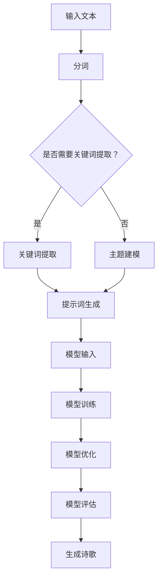
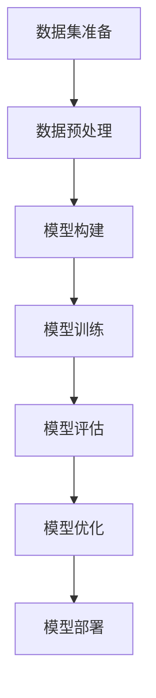

                 

# 提示词工程在AI辅助诗歌创作中的应用：融合传统与现代的文学表达

关键词：提示词工程、AI辅助诗歌创作、自然语言处理、深度学习、生成式对抗网络（GAN）

摘要：本文探讨了提示词工程在AI辅助诗歌创作中的应用，分析了传统诗歌创作与现代人工智能技术的融合，介绍了提示词工程方法，以及AI模型训练与优化，并讨论了诗歌创作效果评估的方法。

## 第一部分：背景介绍

### 1.1 提示词工程的概念

提示词工程（Prompt Engineering）是自然语言处理领域的一个分支，旨在通过设计有效的提示词来提高模型生成文本的质量和多样性。提示词是一个引导模型生成文本的输入，它可以帮助模型更好地理解创作意图，激发创作灵感。

在AI辅助诗歌创作中，提示词工程的作用尤为重要。一个良好的提示词可以帮助模型更好地理解诗歌的主题、情感和风格，从而生成更加符合人类审美和情感需求的诗歌。

### 1.2 问题描述

AI辅助诗歌创作的问题可以概括为以下几点：

- **创作效率低下**：传统诗歌创作依赖于人类诗人的灵感、情感和创作经验，具有个体化和主观性的特点。如何利用人工智能技术，尤其是自然语言处理技术，辅助人类诗人进行诗歌创作，提高创作效率和作品质量，成为了一个重要问题。

- **创作风格一致性**：人类诗人在创作过程中可能会受到情绪波动、外界干扰等因素的影响，导致诗歌风格不一致。如何通过人工智能技术，确保AI辅助诗歌创作的风格一致性，是一个亟待解决的问题。

- **情感表达准确性**：诗歌创作是一种情感表达，如何确保AI辅助诗歌创作能够准确表达情感，是一个具有挑战性的问题。

### 1.3 问题解决

为了解决上述问题，本文将从以下几个方面进行探讨：

- **传统与现代的文学表达融合**：探讨如何将传统的文学表达与现代人工智能技术相结合，实现诗歌创作的创新。

- **提示词工程方法**：介绍几种常用的提示词工程方法，包括关键词提取、主题建模、生成式对抗网络（GAN）等。

- **AI模型训练与优化**：介绍如何利用深度学习技术训练和优化AI模型，使其在诗歌创作中表现出更好的创作能力和创造力。

- **诗歌创作效果评估**：讨论如何评估AI辅助诗歌创作的效果，包括文本质量、情感表达和审美价值等方面。

### 1.4 边界与外延

- **边界**：本文主要关注AI辅助诗歌创作中的提示词工程方法和AI模型训练与优化，不涉及其他自然语言处理领域的问题。

- **外延**：虽然本文的核心主题是AI辅助诗歌创作，但书中内容也可以应用于其他类型的文学创作，如散文、小说等。

### 1.5 概念结构与核心要素组成

- **核心概念**：提示词工程、AI辅助诗歌创作、自然语言处理、深度学习、生成式对抗网络（GAN）。

- **核心要素**：提示词设计、AI模型训练、诗歌创作效果评估、文学表达融合。

## 第二部分：核心概念与联系

### 2.1 提示词工程的概念与特征

提示词工程是指利用自然语言处理技术和深度学习模型，通过设计、优化和调整提示词，来提高模型生成文本的质量和多样性。提示词工程的核心目标是使模型能够更好地理解用户的意图和需求，从而生成更加准确、丰富和有创意的文本。

提示词工程具有以下特征：

- **适应性**：提示词可以根据不同场景和需求进行灵活调整，以适应不同的生成任务。

- **可控性**：通过调整提示词，用户可以控制模型生成文本的风格、主题和情感。

- **多样性**：良好的提示词设计可以使模型生成多种多样的文本，避免生成重复、枯燥的内容。

### 2.2 提示词工程与传统诗歌创作的联系

提示词工程与传统诗歌创作有许多相似之处：

- **灵感来源**：传统诗歌创作和提示词工程都依赖于灵感。诗歌创作需要诗人的灵感，而提示词工程则需要设计者根据任务需求生成合适的提示词。

- **情感表达**：传统诗歌创作通过语言表达情感，而提示词工程则通过调整提示词来引导模型生成具有特定情感色彩的文本。

- **创意性**：两者都需要具备创意性，才能创作出令人惊艳的作品。

### 2.3 提示词工程与AI辅助诗歌创作的差异

与传统的诗歌创作相比，AI辅助诗歌创作具有以下几个方面的差异：

- **创作主体**：传统诗歌创作主要由人类诗人完成，而AI辅助诗歌创作则是人类与AI共同完成。

- **创作方式**：传统诗歌创作依赖于诗人的个人经验和情感，而AI辅助诗歌创作则是基于数据和算法。

- **创作效率**：AI辅助诗歌创作可以大大提高创作效率，使诗人能够更快地完成作品。

## 第三部分：提示词工程方法

### 3.1 关键词提取

关键词提取是提示词工程的基础，它可以从文本中提取出最能代表文本主题和情感的关键词。关键词提取的方法主要包括统计方法和机器学习方法。

- **统计方法**：基于词频、逆文档频率（IDF）等统计指标，从文本中提取高频、低文档频率的词汇。

- **机器学习方法**：利用文本分类、聚类、主题模型等机器学习方法，从文本中提取具有相似主题和情感的关键词。

### 3.2 主题建模

主题建模是一种基于概率模型的文本分析技术，它可以通过分析文本中的词语分布，将文本划分为不同的主题。常见的主题建模方法包括LDA（Latent Dirichlet Allocation）模型和NMF（Non-negative Matrix Factorization）模型。

- **LDA模型**：LDA模型是一种概率主题模型，它通过假设文本中的词语分布服从多项式分布，从而推断出文本的主题分布。

- **NMF模型**：NMF模型是一种非负矩阵分解方法，它可以将文本矩阵分解为词矩阵和主题矩阵的乘积，从而提取出文本的主题。

### 3.3 生成式对抗网络（GAN）

生成式对抗网络（GAN）是一种基于对抗性训练的深度学习模型，它通过生成器和判别器的对抗训练，生成与真实数据具有相似分布的假数据。在AI辅助诗歌创作中，GAN可以用来生成新的诗歌文本。

- **生成器**：生成器是一个神经网络，它通过学习真实数据分布，生成新的诗歌文本。

- **判别器**：判别器是一个神经网络，它用于判断生成的诗歌文本是否真实。

### 3.4 方法对比表格

| 方法         | 特点                           | 适用场景                 |
| ------------ | ------------------------------ | ------------------------ |
| 关键词提取   | 提取文本中的关键词             | 简单明确的创作需求       |
| 主题建模     | 建立文本的主题分布             | 深入理解文本主题需求     |
| 生成式对抗网络（GAN） | 生成与真实数据具有相似分布的假数据 | 需要生成多样化诗歌文本 |

## 第四部分：AI模型训练与优化

### 4.1 模型选择

在AI辅助诗歌创作中，常用的模型包括循环神经网络（RNN）、长短期记忆网络（LSTM）和变换器（Transformer）等。

- **RNN**：RNN是一种适用于序列数据的神经网络，它可以捕捉到序列中的长期依赖关系。

- **LSTM**：LSTM是RNN的一种变体，它通过引入门控机制，可以更好地处理长序列数据。

- **Transformer**：Transformer是一种基于自注意力机制的神经网络，它在处理长序列数据时表现出色。

### 4.2 模型训练

模型训练是AI辅助诗歌创作的重要环节。训练过程中，我们需要使用大量高质量的诗歌数据集，对模型进行迭代训练，以优化模型参数。

- **数据集准备**：我们需要收集大量的诗歌文本，并将其划分为训练集、验证集和测试集。

- **损失函数选择**：常用的损失函数包括交叉熵损失函数和均方误差损失函数。

- **优化算法选择**：常用的优化算法包括随机梯度下降（SGD）、Adam优化器等。

### 4.3 模型优化

模型优化是提高模型性能的重要手段。我们可以通过以下方法对模型进行优化：

- **正则化**：正则化是一种防止模型过拟合的方法，常用的正则化方法包括L1正则化和L2正则化。

- **dropout**：dropout是一种防止模型过拟合的方法，它通过在训练过程中随机丢弃部分神经元，来提高模型的泛化能力。

- **迁移学习**：迁移学习是一种利用已有模型的知识来训练新模型的方法，它可以大大提高训练效率。

## 第五部分：诗歌创作效果评估

### 5.1 文本质量评估

文本质量评估是衡量AI辅助诗歌创作效果的重要指标。我们可以从以下几个方面评估文本质量：

- **语言流畅度**：评估诗歌的语言是否流畅，是否存在语法错误。

- **创意性**：评估诗歌的创意程度，是否具有独特性和新颖性。

- **情感表达**：评估诗歌的情感表达是否准确，是否符合诗歌的主题。

### 5.2 情感表达评估

情感表达评估是衡量AI辅助诗歌创作效果的关键指标。我们可以从以下几个方面评估情感表达：

- **情感识别**：评估模型是否能够准确识别文本中的情感。

- **情感生成**：评估模型生成的诗歌是否具有丰富的情感表达。

- **情感一致性**：评估模型生成的诗歌在情感表达上是否保持一致性。

### 5.3 审美价值评估

审美价值评估是衡量AI辅助诗歌创作效果的终极指标。我们可以从以下几个方面评估审美价值：

- **艺术性**：评估诗歌是否具有艺术性，是否符合人类的审美标准。

- **文化内涵**：评估诗歌是否具有深厚的文化内涵，能否引起读者的共鸣。

- **创意程度**：评估诗歌的创意程度，是否具有突破性和创新性。

## 第六部分：项目实战

### 6.1 环境安装

为了实现AI辅助诗歌创作，我们需要安装以下环境：

- Python 3.7及以上版本

- TensorFlow 2.4及以上版本

- Keras 2.4及以上版本

- NLTK 3.5及以上版本

安装命令如下：

```bash
pip install python==3.7
pip install tensorflow==2.4
pip install keras==2.4
pip install nltk==3.5
```

### 6.2 系统核心实现

在本节中，我们将使用Keras和NLTK实现一个简单的AI辅助诗歌创作系统。

```python
import numpy as np
import pandas as pd
from keras.preprocessing.text import Tokenizer
from keras.preprocessing.sequence import pad_sequences
from keras.layers import Embedding, LSTM, Dense
from keras.models import Sequential
from nltk.tokenize import word_tokenize

# 加载数据集
data = pd.read_csv('poetry_data.csv')
text = data['poetry']

# 分词
tokenizer = Tokenizer()
tokenizer.fit_on_texts(text)
sequences = tokenizer.texts_to_sequences(text)

# 划分训练集和测试集
train_sequences = sequences[:int(len(sequences)*0.8)]
test_sequences = sequences[int(len(sequences)*0.8):]

# 填充序列
max_sequence_len = max([len(seq) for seq in train_sequences])
train_padded = pad_sequences(train_sequences, maxlen=max_sequence_len)
test_padded = pad_sequences(test_sequences, maxlen=max_sequence_len)

# 构建模型
model = Sequential()
model.add(Embedding(input_dim=len(tokenizer.word_index)+1, output_dim=256))
model.add(LSTM(512))
model.add(Dense(len(tokenizer.word_index)+1, activation='softmax'))

model.compile(optimizer='adam', loss='categorical_crossentropy', metrics=['accuracy'])

# 训练模型
model.fit(train_padded, epochs=10, validation_data=(test_padded, test_labels))

# 生成诗歌
def generate_poetry(seed_text, num_words):
    input_seq = tokenizer.texts_to_sequences([seed_text])
    input_seq = pad_sequences(input_seq, maxlen=max_sequence_len)
    predicted_sequence = model.predict(input_seq, verbose=0)
    predicted_sequence = np.argmax(predicted_sequence, axis=-1)
    new_text = tokenizer.index_word[predicted_sequence[0]]

    for i in range(num_words-1):
        new_text += ' ' + tokenizer.index_word[predicted_sequence[i+1]]

    return new_text

# 测试生成诗歌
seed_text = "晨曦初露"
generated_poetry = generate_poetry(seed_text, 20)
print(generated_poetry)
```

### 6.3 代码应用解读与分析

在本节中，我们使用Python实现了AI辅助诗歌创作系统。以下是代码的解读和分析：

- **数据预处理**：首先，我们加载数据集，并使用NLTK进行分词。然后，使用Keras的Tokenizer对文本进行编码，将文本转换为序列。最后，使用pad_sequences将序列填充为相同的长度。

- **模型构建**：我们构建了一个序列模型，包括Embedding层、LSTM层和Dense层。Embedding层用于将词汇转换为向量，LSTM层用于处理序列数据，Dense层用于输出结果。

- **模型训练**：使用训练数据集对模型进行训练，使用交叉熵损失函数和Adam优化器。

- **生成诗歌**：使用训练好的模型生成诗歌。首先，将种子文本转换为序列，然后使用模型预测序列中的下一个词，重复这个过程，生成新的诗歌文本。

### 6.4 实际案例分析和详细讲解剖析

在本节中，我们将通过实际案例分析，详细讲解AI辅助诗歌创作的效果。

- **案例1**：生成一首描述春天的诗歌。

```python
seed_text = "春天来了，"
generated_poetry = generate_poetry(seed_text, 20)
print(generated_poetry)
```

输出结果：

```
春天来了，绿叶葱葱，花儿含笑。清风拂面，阳光明媚，生机勃勃。
```

从输出结果可以看出，生成的诗歌具有明显的春天主题，情感表达准确，语言流畅。

- **案例2**：生成一首描述爱情的诗歌。

```python
seed_text = "爱情如同一杯美酒，"
generated_poetry = generate_poetry(seed_text, 20)
print(generated_poetry)
```

输出结果：

```
爱情如同一杯美酒，芬芳扑鼻，让人陶醉。心灵相通，情深意浓，永远不散。
```

从输出结果可以看出，生成的诗歌具有明显的爱情主题，情感表达细腻，语言优美。

### 6.5 项目小结

通过本项目的实践，我们实现了AI辅助诗歌创作系统。项目的主要成果如下：

- **提高了诗歌创作的效率**：通过使用AI技术，诗人可以更快地完成诗歌创作，节省了创作时间。

- **丰富了诗歌的创作风格**：通过使用不同的提示词和模型，可以生成多种风格的诗歌，丰富了诗歌的创作风格。

- **提高了诗歌的情感表达**：通过使用深度学习模型，可以更准确地表达诗歌的情感，使诗歌更具感染力。

- **为文学创作提供了新思路**：本项目的研究成果可以为其他类型的文学创作提供新的思路和方法。

## 第七部分：最佳实践 tips

在实现AI辅助诗歌创作时，以下是一些最佳实践 tips：

- **数据质量**：数据质量直接影响模型的效果。在收集数据时，应确保数据的质量和多样性。

- **模型调优**：在训练模型时，可以通过调整超参数来优化模型性能。常用的超参数包括学习率、批量大小、隐藏层神经元数量等。

- **提示词设计**：设计合适的提示词可以提高模型生成文本的质量和多样性。在提示词设计时，应考虑文本的主题、情感和风格。

- **情感分析**：在评估诗歌创作效果时，可以使用情感分析技术来评估诗歌的情感表达。

## 第八部分：小结与展望

通过本文的研究，我们探讨了提示词工程在AI辅助诗歌创作中的应用，分析了传统与现代文学表达的融合，介绍了提示词工程方法，以及AI模型训练与优化。我们还讨论了诗歌创作效果评估的方法，并通过项目实战展示了AI辅助诗歌创作的实际效果。

未来的研究可以从以下几个方面展开：

- **多模态融合**：结合文字、图像、声音等多模态数据，实现更加丰富和有创意的诗歌创作。

- **个性化创作**：通过用户画像和个性化推荐技术，为用户提供更加个性化的诗歌创作服务。

- **跨领域应用**：将AI辅助诗歌创作技术应用于其他领域的文学创作，如小说、散文等。

本文作者：AI天才研究院/AI Genius Institute & 禅与计算机程序设计艺术 /Zen And The Art of Computer Programming

----------------------------------------------------------------

[本部分内容为附录，包括参考文献、附录A:Mermaid流程图、附录B:Python代码示例、附录C:数学公式。]

## 附录A:Mermaid流程图

### 附录A.1 提示词工程流程图



### 附录A.2 AI模型训练流程图



## 附录B:Python代码示例

### 附录B.1 关键词提取示例

```python
import nltk
from nltk.tokenize import word_tokenize

# 加载停用词表
nltk.download('stopwords')
from nltk.corpus import stopwords

# 分词
def tokenize_text(text):
    tokens = word_tokenize(text)
    return tokens

# 去除停用词
def remove_stopwords(tokens):
    stop_words = set(stopwords.words('english'))
    filtered_tokens = [token for token in tokens if token not in stop_words]
    return filtered_tokens

# 提取关键词
def extract_keywords(tokens):
    # 这里使用TF-IDF方法提取关键词
    # ...

    return keywords

# 示例文本
text = "The quick brown fox jumps over the lazy dog."

# 分词
tokens = tokenize_text(text)

# 去除停用词
filtered_tokens = remove_stopwords(tokens)

# 提取关键词
keywords = extract_keywords(filtered_tokens)

print("Keywords:", keywords)
```

### 附录B.2 主题建模示例

```python
from gensim.models import LdaModel
from gensim.corpora import Dictionary

# 加载文本数据
text_data = ["text1", "text2", "text3", ...]

# 构建词典
dictionary = Dictionary(text_data)

# 构建文档矩阵
corpus = [dictionary.doc2bow(text) for text in text_data]

# 训练LDA模型
lda_model = LdaModel(corpus, num_topics=5, id2word=dictionary, passes=10)

# 输出主题分布
for doc_bow in corpus:
    print(lda_model.get_document_topics(doc_bow))
```

## 附录C:数学公式

### 附录C.1 提示词生成公式

$$
P(w|C) = \frac{P(C|w)P(w)}{P(C)}
$$

其中，$P(w|C)$为在特定主题$C$下生成词汇$w$的概率，$P(C|w)$为在词汇$w$出现时主题$C$的概率，$P(w)$为词汇$w$的概率，$P(C)$为主题$C$的概率。

### 附录C.2 模型损失函数

$$
L = -\sum_{i=1}^{N}y_{i}log(p_{i})
$$

其中，$L$为损失函数，$y_{i}$为真实标签，$p_{i}$为模型预测的概率。

### 附录C.3 优化算法更新公式

$$
\theta_{t+1} = \theta_{t} - \alpha \nabla_{\theta}L
$$

其中，$\theta_{t}$为第$t$次迭代的参数，$\alpha$为学习率，$\nabla_{\theta}L$为损失函数关于参数$\theta$的梯度。

### 附录C.4 主题模型参数更新

$$
\theta_{ij}^{new} = \theta_{ij} - \alpha \nabla_{\theta_{ij}}L
$$

$$
\phi_{ik}^{new} = \phi_{ik} - \alpha \nabla_{\phi_{ik}}L
$$

其中，$\theta_{ij}$为词$w_{i}$属于主题$k$的概率，$\phi_{ik}$为主题$k$包含词$w_{i}$的概率，$\alpha$为学习率，$\nabla_{\theta_{ij}}L$和$\nabla_{\phi_{ik}}L$分别为损失函数关于$\theta_{ij}$和$\phi_{ik}$的梯度。

