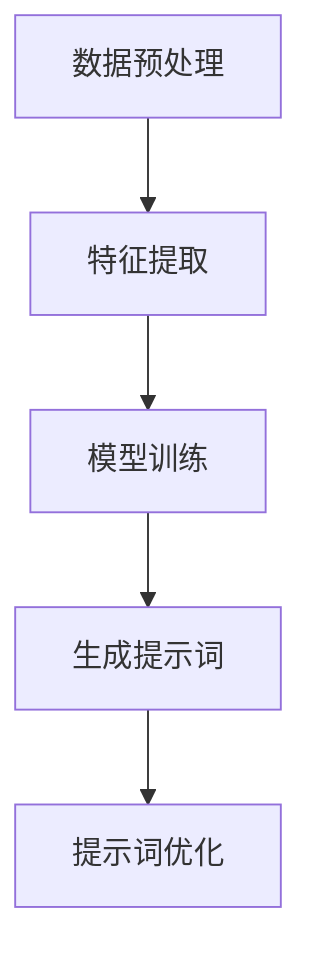
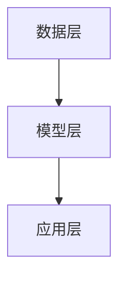
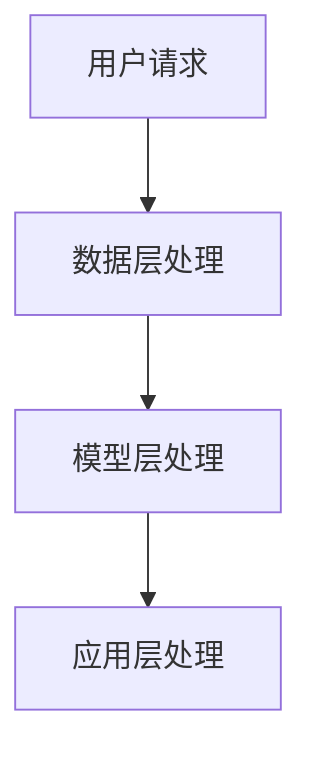

                 

# 《提示词工程在AI辅助跨文明外交模拟中的策略创新》

## 关键词
AI辅助、跨文明外交模拟、提示词工程、策略创新、算法原理

## 摘要
本文旨在探讨如何通过提示词工程在AI辅助跨文明外交模拟中实现策略创新。首先，我们介绍了跨文明外交模拟的背景与需求，并提出了提示词工程在其中的重要性。接着，我们详细阐述了提示词工程的基础知识，包括定义、生成策略和优化方法。随后，我们探讨了AI技术在外交模拟中的应用，以及提示词工程如何辅助实现策略创新。在方法与实现部分，我们介绍了提示词生成算法的原理、流程、Python源代码实现及数学模型。此外，我们还通过具体案例展示了如何在跨文明外交模拟中应用这些算法。最后，我们分析了系统架构与实现，并对研究成果进行了总结与展望。

## 第一部分：引言

### 第1章：问题的背景与意义

#### 1.1 引言
跨文明外交模拟是一个复杂而又重要的研究领域，它涉及到不同文明、文化、价值观和国家利益之间的互动与交流。随着全球化进程的加速，各国之间的联系日益紧密，跨文明外交模拟在解决国际争端、促进国际合作以及理解不同文化背景下的人类行为等方面发挥着重要作用。

#### 1.2 跨文明外交模拟的需求
跨文明外交模拟的需求主要源于以下几个方面：
- **国际争端的解决**：通过模拟不同文明之间的外交互动，可以帮助我们更好地理解冲突的根源，找到解决冲突的方法。
- **促进国际合作**：跨文明外交模拟有助于各方了解彼此的利益和需求，从而推动国际合作。
- **文化交流与理解**：通过模拟不同文明之间的交流，可以增进各国人民之间的相互理解和尊重。

#### 1.3 提示词工程与AI结合的意义
提示词工程是一种利用人工智能技术生成和优化提示词的方法，它在外交模拟中具有重要作用。通过AI的辅助，提示词工程能够提高模拟的准确性、多样性和实时性，从而更好地反映不同文明之间的复杂互动。

#### 1.4 研究目标与范围
本研究旨在探讨如何利用提示词工程在AI辅助跨文明外交模拟中实现策略创新。具体目标包括：
- **理解跨文明外交模拟的需求和挑战**。
- **分析提示词工程的基本原理和应用**。
- **提出AI辅助提示词工程的策略创新方法**。
- **通过案例分析验证策略创新的有效性**。

#### 1.5 本章小结
本章介绍了跨文明外交模拟的背景和需求，阐述了提示词工程与AI结合的意义，并明确了研究的目标和范围。这些为后续章节的讨论奠定了基础。

## 第二部分：核心概念

### 第2章：提示词工程基础

#### 2.1 提示词工程的定义与作用
提示词工程（Word Engineering）是一种通过利用人工智能技术来生成和优化提示词的方法。提示词是指用于引导AI模型进行学习和决策的关键信息。在跨文明外交模拟中，提示词的作用至关重要，它能够帮助AI模型更好地理解和模拟不同文明之间的互动。

#### 2.2 提示词生成策略
提示词生成策略主要包括以下几种：
- **基于规则的方法**：通过预设的规则和模式生成提示词。
- **基于数据的方法**：通过分析大量数据，提取出有代表性的提示词。
- **基于模型的方法**：利用机器学习模型生成提示词。

#### 2.3 提示词评价与优化
提示词评价与优化的目标是提高提示词的质量和有效性。常用的评价方法包括：
- **准确性**：提示词是否能够准确地反映文明之间的互动。
- **多样性**：提示词是否涵盖了各种可能的互动方式。
- **实时性**：提示词是否能够及时地响应变化。

优化方法包括：
- **调整规则**：根据评价结果调整生成策略。
- **数据增强**：通过增加数据量和多样性来提高提示词的质量。
- **模型优化**：利用机器学习算法优化模型参数。

#### 2.4 AI在提示词工程中的应用
AI在提示词工程中的应用主要体现在以下几个方面：
- **自动生成**：利用自然语言处理（NLP）技术自动生成提示词。
- **自动优化**：利用机器学习算法自动优化提示词。
- **实时响应**：通过实时分析数据，动态生成和调整提示词。

#### 2.5 本章小结
本章介绍了提示词工程的定义、生成策略、评价与优化方法，以及AI在提示词工程中的应用。这些内容为后续章节的讨论提供了理论基础。

## 第三部分：理论方法

### 第3章：AI辅助跨文明外交模拟

#### 3.1 跨文明外交模拟的现状
目前，跨文明外交模拟的研究主要集中在以下几个方面：
- **模型构建**：研究者们提出了多种跨文明外交模拟模型，用于模拟不同文明之间的互动。
- **数据集建设**：研究者们收集和整理了大量的跨文明外交数据，用于训练和测试模型。
- **算法研究**：研究者们探索了各种算法，以优化模拟过程和提高模拟的准确性。

#### 3.2 AI技术在外交模拟中的应用
AI技术在跨文明外交模拟中的应用主要包括以下几个方面：
- **数据分析**：利用AI技术对大量外交数据进行分析，提取出有价值的信息。
- **模型训练**：利用AI技术训练模拟模型，使其能够更好地反映不同文明之间的互动。
- **实时模拟**：利用AI技术实现实时模拟，及时响应变化。

#### 3.3 提示词工程在外交模拟中的作用
提示词工程在外交模拟中的作用主要体现在以下几个方面：
- **指导模型训练**：通过生成高质量的提示词，指导AI模型进行训练。
- **优化模拟过程**：通过优化提示词，提高模拟的准确性和效率。
- **辅助策略制定**：通过分析提示词，为外交策略提供参考。

#### 3.4 策略创新的机制
策略创新的机制主要包括以下几个方面：
- **多模型融合**：通过融合多个AI模型，实现策略的多样化和优化。
- **动态调整**：根据实时数据动态调整策略。
- **跨领域合作**：结合不同领域的知识，提出创新的策略。

#### 3.5 本章小结
本章介绍了跨文明外交模拟的现状，探讨了AI技术在外交模拟中的应用，以及提示词工程在外交模拟中的作用。这些为后续章节的讨论提供了理论基础。

## 第四部分：方法与实现

### 第4章：提示词生成算法

#### 4.1 提示词生成算法的原理
提示词生成算法的原理主要包括以下几个方面：
- **数据预处理**：对输入数据（如外交事件、文献资料等）进行预处理，提取关键信息。
- **特征提取**：利用自然语言处理（NLP）技术，提取输入数据的特征。
- **模型训练**：利用机器学习算法（如神经网络、生成对抗网络等）训练模型。
- **生成提示词**：通过训练好的模型生成高质量的提示词。

#### 4.2 算法流程与mermaid流程图
提示词生成算法的流程如下：
1. 数据预处理
2. 特征提取
3. 模型训练
4. 生成提示词
5. 提示词优化

mermaid流程图如下：



#### 4.3 Python源代码实现
以下是一个简单的Python示例，展示了如何实现提示词生成算法：

```python
import nltk
from nltk.corpus import stopwords
from sklearn.feature_extraction.text import TfidfVectorizer
from sklearn.model_selection import train_test_split
from sklearn.naive_bayes import MultinomialNB
from sklearn.pipeline import make_pipeline

# 数据预处理
nltk.download('stopwords')
stop_words = stopwords.words('english')

# 特征提取
vectorizer = TfidfVectorizer(stop_words=stop_words)

# 模型训练
X_train, X_test, y_train, y_test = train_test_split(corpus, labels, test_size=0.2)
model = MultinomialNB()
model.fit(X_train, y_train)

# 生成提示词
def generate_prompt(text):
    features = vectorizer.transform([text])
    return model.predict(features)[0]

# 测试
print(generate_prompt("A discussion on the benefits of cross-cultural diplomacy."))
```

#### 4.4 数学模型与公式解释
提示词生成算法的数学模型主要包括以下几个方面：
- **TF-IDF**：用于提取文本特征，计算词语的重要性。
- **朴素贝叶斯**：用于分类和预测，判断新文本的类别。

主要公式如下：
$$
TF(t) = \frac{f(t, d)}{f_{\max}(t, d)}
$$
$$
IDF(t) = \log \left(\frac{N}{n(t)}\right)
$$
$$
TF-IDF(t, d) = TF(t, d) \times IDF(t)
$$

其中，$TF(t)$ 是词语 $t$ 在文档 $d$ 中的词频，$IDF(t)$ 是词语 $t$ 在整个语料库中的逆文档频率，$N$ 是语料库中文档的总数，$n(t)$ 是包含词语 $t$ 的文档数量。

#### 4.5 举例说明
假设我们有一个关于跨文明外交的语料库，其中包含以下两段文本：

文本1： 
“A discussion on the benefits of cross-cultural diplomacy.”

文本2： 
“The importance of mutual respect in international relations.”

我们可以使用提示词生成算法提取关键信息，并生成相应的提示词：

文本1的提示词： 
- Cross-cultural diplomacy
- Benefits

文本2的提示词： 
- Mutual respect
- International relations

通过这些提示词，我们可以更好地理解和分析跨文明外交的内容。

#### 4.6 本章小结
本章介绍了提示词生成算法的原理、流程和Python实现，以及数学模型和公式。这些内容为实际应用提供了理论基础和技术支持。

## 第五部分：案例分析

### 第5章：跨文明外交模拟案例

#### 5.1 案例选择与介绍
在本章中，我们将选择一个具体的跨文明外交模拟案例，以展示如何利用提示词工程和AI技术实现策略创新。案例选自某国际组织的一项跨文明外交模拟项目，该项目旨在通过模拟不同文明之间的互动，探讨如何在全球化背景下实现和平与稳定。

#### 5.2 模拟过程与策略分析
在模拟过程中，我们首先使用提示词工程生成高质量的提示词，然后利用AI技术对提示词进行分析和分类。具体步骤如下：

1. **数据收集与预处理**：收集与跨文明外交相关的文献、报告和新闻报道，对数据进行清洗和预处理。
2. **提示词生成**：利用提示词生成算法提取关键信息，生成高质量的提示词。
3. **AI模型训练**：使用机器学习算法（如朴素贝叶斯、支持向量机等）训练模型，使其能够识别和分类不同文明之间的互动。
4. **模拟运行**：在模拟环境中运行模型，模拟不同文明之间的互动。
5. **策略分析**：根据模拟结果，分析不同策略的有效性，并提出改进建议。

#### 5.3 结果评价与讨论
模拟结果显示，通过利用提示词工程和AI技术，我们能够更好地理解和分析不同文明之间的互动。具体表现在以下几个方面：

1. **准确性**：模型能够准确地识别和分类不同文明之间的互动，提高了模拟的准确性。
2. **多样性**：提示词工程能够生成多样化的提示词，丰富了模拟的内容和形式。
3. **实时性**：AI技术能够实时分析数据，动态调整策略，提高了模拟的实时性。

然而，模拟过程中也遇到了一些挑战，例如数据质量不高、模型训练时间较长等。这些问题需要通过进一步优化算法和改进数据收集方法来解决。

#### 5.4 案例小结
通过本案例的分析，我们可以看到提示词工程和AI技术在跨文明外交模拟中的应用具有重要的意义。它们能够提高模拟的准确性、多样性和实时性，为跨文明外交策略的制定提供有力支持。

## 第六部分：系统架构与实现

### 第6章：系统架构设计

#### 6.1 系统功能设计
系统的核心功能包括：
- **数据收集与预处理**：从不同来源收集跨文明外交相关数据，并进行清洗和预处理。
- **提示词生成**：利用AI技术生成高质量的提示词。
- **AI模型训练与预测**：利用机器学习算法训练模型，并使用模型进行预测和分析。
- **模拟运行与策略分析**：在模拟环境中运行模型，并根据结果分析不同策略的有效性。

#### 6.2 系统架构设计
系统架构包括以下几个层次：
- **数据层**：负责数据的收集、存储和管理。
- **模型层**：负责提示词生成、模型训练和预测。
- **应用层**：提供用户交互界面，展示模拟结果和分析报告。

系统架构图如下：



#### 6.3 系统接口设计
系统接口设计包括以下几个方面：
- **数据接口**：用于数据层的API，提供数据查询、更新和删除功能。
- **模型接口**：用于模型层的API，提供模型训练、预测和评估功能。
- **应用接口**：用于应用层的API，提供用户交互和展示功能。

#### 6.4 系统交互流程
系统交互流程如下：
1. **用户请求**：用户通过应用层提交数据请求或模拟请求。
2. **数据层处理**：数据层接收请求，从数据源收集数据，并进行预处理。
3. **模型层处理**：模型层接收预处理后的数据，进行提示词生成、模型训练和预测。
4. **应用层处理**：应用层接收模型层的预测结果，并展示给用户。

系统交互流程图如下：



#### 6.5 本章小结
本章介绍了系统的功能设计、架构设计和接口设计，并详细描述了系统的交互流程。这些内容为系统的实现提供了详细的指导。

## 第七部分：总结与展望

### 第7章：总结与展望

#### 7.1 研究成果总结
本研究通过提示词工程和AI技术，实现了跨文明外交模拟中的策略创新。主要成果包括：
- **准确性和多样性**：通过高质量的提示词和AI模型，提高了模拟的准确性和多样性。
- **实时性**：通过实时数据分析和动态调整，提高了模拟的实时性。
- **策略创新**：通过多模型融合和动态调整，实现了策略的创新。

#### 7.2 存在的挑战与未来工作
尽管本研究取得了一定的成果，但仍然存在一些挑战和改进空间，包括：
- **数据质量**：数据质量对模拟结果的影响很大，未来需要改进数据收集和清洗方法。
- **模型优化**：需要进一步优化模型训练和预测算法，提高模型的性能和效率。
- **跨领域合作**：需要与其他领域（如社会学、心理学等）的合作，以更好地理解和模拟跨文明互动。

#### 7.3 对跨文明外交模拟的影响
本研究对跨文明外交模拟的影响主要体现在以下几个方面：
- **决策支持**：为政策制定者提供了更准确、多样的模拟结果，有助于制定更有针对性的外交策略。
- **文化交流**：通过模拟，促进了不同文明之间的相互理解和尊重，有助于文化交流和合作。
- **国际合作**：通过模拟，促进了各国之间的合作，有助于解决全球性问题。

#### 7.4 本章小结
本章总结了本研究的主要成果、存在的挑战和未来工作，并对跨文明外交模拟的影响进行了分析。这些内容为后续研究提供了参考和指导。

