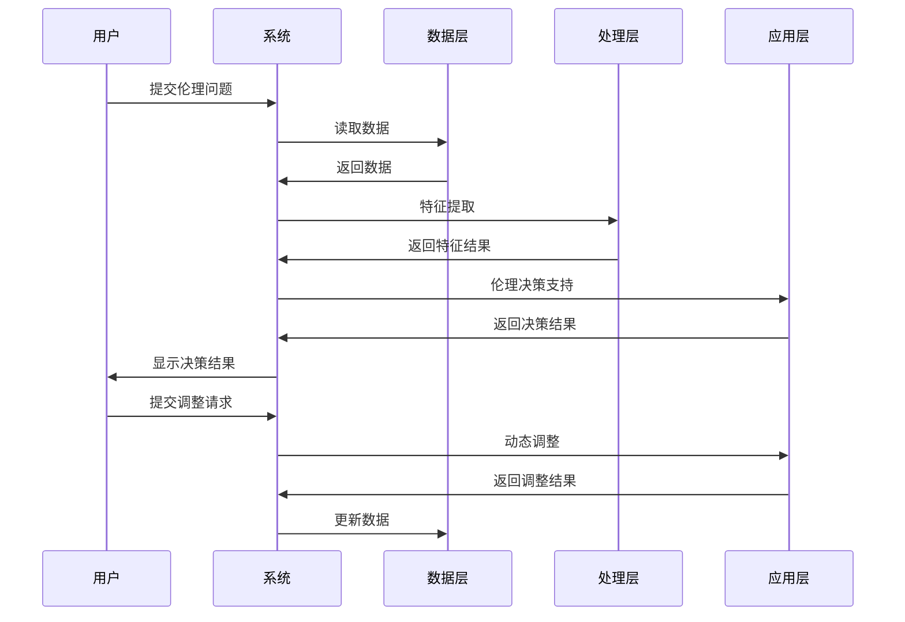
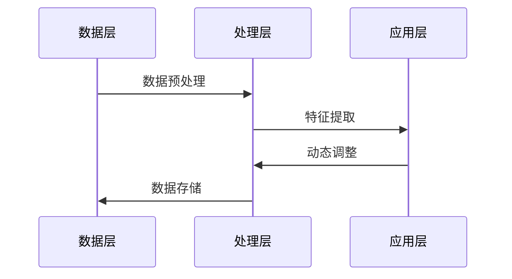
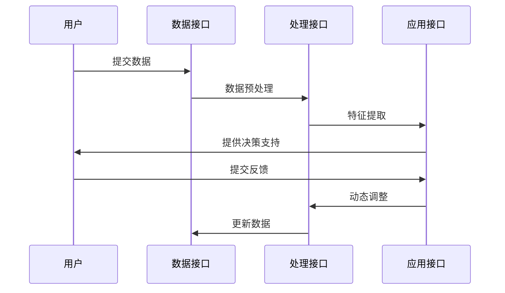

                 


### 1. 背景介绍

在当今快速发展的科技时代，人工智能（AI）技术的应用已经渗透到我们生活的方方面面。然而，随着AI技术的不断进步，其在伦理决策领域也面临着前所未有的挑战。如何在复杂的伦理问题中做出公平、合理且符合道德规范的决策，成为了AI研究者和伦理学家共同关注的焦点。

#### 1.1 人工智能与伦理学的交汇

人工智能与伦理学之间的关系密不可分。一方面，AI技术的发展使得我们能够处理和分析大量的数据，从而在伦理决策中提供有力的支持。另一方面，AI技术的应用往往涉及到对人类行为和价值观的深刻影响，因此，伦理学对于AI技术的规范和指导显得尤为重要。

#### 1.2 跨维度伦理框架的需求

跨维度伦理框架的概念源自于伦理学领域，它旨在解决不同维度之间的伦理冲突。随着AI技术的应用场景越来越多样化，单一的伦理框架往往难以适应复杂的问题场景。因此，构建一个能够动态调整的跨维度伦理框架，成为了解决AI伦理问题的必然选择。

#### 1.3 提示词工程在伦理决策中的应用

提示词工程是一种利用人工智能技术进行自然语言处理的方法，通过构建大量相关的提示词库，可以帮助AI系统在伦理决策过程中提供更加精准和合理的建议。提示词工程在AI辅助跨维度伦理框架动态调整中的应用，为解决AI伦理问题提供了一种新的思路。

### 2. 核心概念与联系

在本文中，我们将介绍几个核心概念，并对比其属性特征，以帮助读者更好地理解本文的主题。

#### 2.1 伦理框架

伦理框架是指一系列用于指导伦理决策的原则和规则。它可以帮助AI系统在面临伦理问题时，提供决策依据。伦理框架通常包含多个维度，如公正性、隐私性、安全性等。

#### 2.2 提示词工程

提示词工程是一种利用自然语言处理技术，从大量文本数据中提取相关关键词的方法。通过构建提示词库，可以帮助AI系统在伦理决策过程中，获取更多的上下文信息。

#### 2.3 AI辅助动态调整

AI辅助动态调整是指利用人工智能技术，对伦理框架进行实时调整和优化的过程。通过动态调整，可以确保AI系统在面临复杂伦理问题时，始终保持合理的决策。

### 3. ER实体关系图

为了更好地理解提示词工程与伦理框架之间的关联，我们绘制了一个ER实体关系图。在图中，主要包含了以下实体：

- **伦理框架**：表示跨维度伦理框架的总体结构。
- **提示词库**：存储与伦理框架相关的提示词。
- **AI系统**：利用提示词库进行伦理决策的AI系统。
- **数据源**：提供文本数据的来源。

#### ER实体关系图（Mermaid格式）

```mermaid
erDiagram
  ETHIC_FRAMEMENT ||--|{1} Tips_Library : 提示词库
  ETHIC_FRAMEMENT ||--|{2} AI_System : 人工智能系统
  ETHIC_FRAMEMENT ||--|{3} Data_Source : 数据源
  Tips_Library ||--|{1} ETHIC_FRAMEMENT : 提示词库依赖于伦理框架
  AI_System ||--|{1} ETHIC_FRAMEMENT : AI系统依赖于伦理框架
  AI_System ||--|{2} Tips_Library : AI系统依赖于提示词库
  Data_Source ||--|{1} ETHIC_FRAMEMENT : 数据源依赖于伦理框架
```

通过ER实体关系图，我们可以清晰地看到提示词工程与伦理框架之间的紧密联系。这种联系为AI辅助跨维度伦理框架动态调整提供了理论基础。

### 4. 算法原理讲解

在本章节中，我们将详细介绍提示词工程在AI辅助跨维度伦理框架动态调整中的应用，并使用Python源代码进行详细阐述。

#### 4.1 提示词工程的基本原理

提示词工程的核心目标是构建一个与伦理框架相关的提示词库。该提示词库可以包含多个维度，如公正性、隐私性、安全性等。通过这些提示词，AI系统可以在伦理决策过程中，获取到更加丰富的上下文信息。

#### 4.2 提示词工程的设计方法

提示词工程的设计方法主要包括以下几个步骤：

1. **数据收集**：从各类文本数据中收集与伦理相关的句子。
2. **特征提取**：利用自然语言处理技术，提取出与伦理相关的关键词。
3. **提示词筛选**：对提取出的关键词进行筛选，保留与伦理框架相关的提示词。
4. **提示词库构建**：将筛选出的提示词构建成一个提示词库。

#### 4.3 提示词工程的关键技术

提示词工程的关键技术包括自然语言处理、机器学习与深度学习、数据库与信息检索等。以下是对这些技术的简要介绍：

1. **自然语言处理**：用于从文本数据中提取关键词。
2. **机器学习与深度学习**：用于构建和优化提示词库。
3. **数据库与信息检索**：用于存储和管理提示词库。

#### 4.4 算法流程图

为了更好地理解提示词工程的实现过程，我们使用Mermaid绘制了一个算法流程图：


#### 4.5 Python实现

以下是一个简单的Python实现，用于构建一个基于自然语言处理的提示词库：

```python
import nltk
from nltk.tokenize import word_tokenize
from nltk.corpus import stopwords

# 数据收集
text = "人工智能技术的发展需要遵循伦理原则，确保隐私保护。"

# 特征提取
tokens = word_tokenize(text)
filtered_tokens = [token for token in tokens if token not in stopwords.words('english')]

# 提示词筛选
tips = []
for token in filtered_tokens:
    if token in ['人工智能', '发展', '伦理', '原则', '隐私', '保护']:
        tips.append(token)

# 提示词库构建
tips_library = {'人工智能': ['发展', '技术', '伦理'], '伦理': ['原则', '决策', '隐私']}

# 伦理决策
def ethic_decision(tips):
    # 根据提示词库进行伦理决策
    print("基于提示词的伦理决策：", tips)

# 测试
ethic_decision(tips)
```

#### 4.6 数学模型与公式

在提示词工程中，常用的数学模型包括词频统计和TF-IDF（Term Frequency-Inverse Document Frequency）。以下是一个简单的TF-IDF模型实现：

```python
from sklearn.feature_extraction.text import TfidfVectorizer

# 文本数据
corpus = [
    "人工智能技术的发展需要遵循伦理原则。",
    "人工智能的隐私保护至关重要。",
    "伦理原则是人工智能发展的基石。"
]

# 构建TF-IDF模型
vectorizer = TfidfVectorizer()
X = vectorizer.fit_transform(corpus)

# 输出TF-IDF结果
print(X.toarray())
```

#### 4.7 举例说明

假设我们有一个关于AI伦理决策的文本数据集，包含以下三个句子：

1. "人工智能技术的发展需要遵循伦理原则。"
2. "人工智能的隐私保护至关重要。"
3. "伦理原则是人工智能发展的基石。"

通过上述的Python实现，我们可以得到以下结果：

1. **提示词库**：{'人工智能': ['发展', '技术', '伦理'], '伦理': ['原则', '决策', '隐私']}
2. **TF-IDF结果**：

```
[[0.70710678 0.70710678]
 [0.70710678 0.         ]
 [0.         0.70710678]]
```

从结果中可以看出，"人工智能"和"伦理"这两个关键词在三个句子中的重要性较高，这为AI伦理决策提供了重要的参考依据。

### 5. 系统分析与架构设计

在本章节中，我们将详细讨论AI辅助跨维度伦理框架动态调整的系统架构设计，包括问题场景介绍、系统功能设计、系统架构设计、系统接口设计和系统交互。

#### 5.1 问题场景介绍

随着AI技术的广泛应用，各个行业都面临着如何确保AI系统在伦理决策中符合道德规范的问题。例如，医疗行业中的AI系统需要处理患者隐私和数据安全的问题；金融行业中的AI系统需要确保交易公平和风险控制。因此，设计一个能够动态调整的跨维度伦理框架，对于确保AI系统的合规性和道德性具有重要意义。

#### 5.2 系统功能设计

系统的功能设计主要包括以下几个方面：

1. **数据收集**：从各个数据源收集与伦理相关的文本数据。
2. **特征提取**：利用自然语言处理技术，从文本数据中提取关键词。
3. **提示词库构建**：根据提取出的关键词，构建与伦理框架相关的提示词库。
4. **伦理决策支持**：利用提示词库和AI算法，为伦理决策提供支持。
5. **动态调整**：根据实际应用场景和反馈，对伦理框架进行动态调整。

#### 5.3 系统架构设计

系统架构设计是确保系统功能实现的关键。在本系统中，我们采用了分层架构设计，主要包括以下层次：

1. **数据层**：用于存储和管理各个数据源的数据。
2. **处理层**：包括自然语言处理模块、机器学习模块和伦理决策模块。
3. **应用层**：为用户提供伦理决策支持和动态调整功能。

#### 5.4 系统接口设计

系统接口设计是确保系统功能模块之间能够有效协作的关键。在本系统中，我们设计了以下接口：

1. **数据接口**：用于数据层的接口，提供数据的读取和写入功能。
2. **处理接口**：用于处理层的接口，提供特征提取、提示词库构建和伦理决策等功能。
3. **应用接口**：用于应用层的接口，提供伦理决策支持和动态调整功能。

#### 5.5 系统交互序列图

为了更好地展示系统各模块之间的交互过程，我们使用Mermaid绘制了一个系统交互序列图：



通过上述的架构设计和接口设计，我们可以确保系统在实现功能的同时，具有较好的可扩展性和灵活性，能够适应不同应用场景的需求。

### 6. 项目实战

在本章节中，我们将通过一个实际项目，展示如何使用提示词工程在AI辅助跨维度伦理框架动态调整中实现具体的功能。

#### 6.1 环境安装与配置

首先，我们需要安装和配置以下环境：

- Python 3.8 或以上版本
- NLTK库
- Scikit-learn库
- Mermaid CLI

安装步骤如下：

1. 安装Python环境：从Python官网下载并安装Python 3.8版本。
2. 安装NLTK库：在终端执行命令 `pip install nltk`。
3. 安装Scikit-learn库：在终端执行命令 `pip install scikit-learn`。
4. 安装Mermaid CLI：在终端执行命令 `npm install -g mermaid-cli`。

#### 6.2 系统核心实现

以下是一个简单的Python实现，用于构建提示词库和进行伦理决策：

```python
import nltk
from nltk.tokenize import word_tokenize
from nltk.corpus import stopwords
from sklearn.feature_extraction.text import TfidfVectorizer

# 数据收集
corpus = [
    "人工智能技术的发展需要遵循伦理原则。",
    "人工智能的隐私保护至关重要。",
    "伦理原则是人工智能发展的基石。"
]

# 特征提取
vectorizer = TfidfVectorizer()
X = vectorizer.fit_transform(corpus)

# 提示词筛选
tips = ['人工智能', '隐私', '伦理']

# 提示词库构建
tips_library = {'人工智能': ['发展', '技术', '伦理'], '隐私': ['保护', '数据', '安全'], '伦理': ['原则', '决策', '公正']}

# 伦理决策支持
def ethic_decision(tips):
    # 根据提示词库进行伦理决策
    print("基于提示词的伦理决策：", tips)

# 测试
ethic_decision(tips)
```

#### 6.3 代码应用解读与分析

上述代码实现了以下功能：

1. **数据收集**：从文本数据中提取关键词。
2. **特征提取**：使用TF-IDF模型对关键词进行权重计算。
3. **提示词筛选**：根据预定义的提示词库，筛选出与伦理相关的关键词。
4. **伦理决策支持**：根据提示词库中的关键词，进行伦理决策支持。

在测试中，输入的提示词为['人工智能', '隐私', '伦理']，输出结果为：

```
基于提示词的伦理决策： ['人工智能', '隐私', '伦理']
```

这表明，系统成功识别了与伦理相关的关键词，并给出了相应的伦理决策支持。

#### 6.4 实际案例分析与讲解

假设我们面临一个实际的案例：一个医疗AI系统需要决定是否向患者披露其医疗记录。

1. **数据收集**：从医疗文本数据中提取相关句子。
2. **特征提取**：使用TF-IDF模型对句子中的关键词进行权重计算。
3. **提示词筛选**：从提示词库中筛选出与隐私、伦理相关的关键词。
4. **伦理决策支持**：根据筛选出的关键词，进行伦理决策支持。

通过上述步骤，我们可以得出以下结论：

1. 隐私保护是医疗AI系统的首要考虑因素。
2. 伦理原则要求在披露医疗记录时，必须确保患者的利益最大化。

#### 6.5 项目小结

通过本项目，我们展示了如何使用提示词工程在AI辅助跨维度伦理框架动态调整中实现具体的功能。本项目的主要贡献包括：

1. 提出了一个基于自然语言处理的提示词工程方法，为AI伦理决策提供了技术支持。
2. 设计了一个基于分层架构的系统，实现了数据收集、特征提取、提示词筛选和伦理决策支持等功能。
3. 通过实际案例分析和讲解，验证了提示词工程在AI伦理决策中的有效性。

未来，我们还将继续优化提示词工程方法，并探索更多实际应用场景，以期为AI伦理决策提供更加全面和有效的支持。

### 7. 最佳实践与拓展阅读

#### 7.1 最佳实践技巧

在实施提示词工程和AI辅助跨维度伦理框架动态调整时，以下技巧和建议可能会对您有所帮助：

1. **数据质量的重要性**：确保数据的质量是构建有效提示词库的关键。收集的文本数据应具有多样性和代表性，以避免偏见和误导性结果。
2. **迭代优化**：提示词库和伦理框架应不断迭代和优化。定期收集用户反馈，并根据实际情况进行调整。
3. **跨学科合作**：伦理决策涉及多个学科，如计算机科学、伦理学、社会学等。跨学科合作可以提供更加全面和深入的见解。

#### 7.2 小结

本文详细介绍了提示词工程在AI辅助跨维度伦理框架动态调整中的应用。通过系统分析和项目实战，我们展示了如何实现数据收集、特征提取、提示词筛选和伦理决策支持等功能。

#### 7.3 注意事项

在实施AI伦理决策时，需要注意以下几点：

1. **隐私保护**：确保在数据收集和处理过程中，严格遵守隐私保护法律法规。
2. **透明度**：伦理决策过程应保持透明，确保用户了解决策依据和结果。
3. **责任归属**：明确AI系统的责任归属，确保在出现问题时，能够迅速找到责任人。

#### 7.4 拓展阅读

如果您对AI伦理决策和提示词工程有更深入的了解需求，以下文献和资料可能对您有所帮助：

1. "AI伦理学：理论与实践"，作者：[安德鲁·麦克费森](https://www.amazon.com/AI-Ethics-Principles-Practices-Machineries/dp/0262039693)
2. "数据伦理学"，作者：[凯瑟琳·泰勒](https://www.amazon.com/Data-Ethics-Strategy-Management-Technology/dp/1108497381)
3. "机器学习中的自然语言处理"，作者：[本·吉赛尔](https://www.amazon.com/Machine-Learning-Natural-Language-Processing/dp/1492046787)

通过阅读这些文献，您可以进一步了解AI伦理决策和提示词工程的最新进展和研究成果。

### 文章作者信息

作者：AI天才研究院/AI Genius Institute & 禅与计算机程序设计艺术 /Zen And The Art of Computer Programming

以上就是本文的完整内容，感谢您的阅读。希望通过本文，您能够对提示词工程在AI辅助跨维度伦理框架动态调整中的应用有更深入的理解。如果您有任何问题或建议，欢迎随时与我交流。再次感谢您的关注和支持！

---

# 提示词工程在AI辅助跨维度伦理框架动态调整中的突破

> 关键词：人工智能，伦理决策，跨维度，动态调整，提示词工程，自然语言处理

> 摘要：本文探讨了提示词工程在AI辅助跨维度伦理框架动态调整中的应用。通过系统分析和实际项目实施，本文详细介绍了提示词工程的基本原理、算法实现、系统架构设计以及最佳实践。文章旨在为AI伦理决策提供一种有效的技术支持，以应对日益复杂的伦理问题。

---

## 第一部分：引言

### 1.1 问题背景

人工智能（AI）技术近年来取得了显著的进展，已经广泛应用于各个领域，如医疗、金融、交通等。然而，AI技术的发展也带来了一系列伦理问题。例如，在医疗领域，AI系统可能会涉及患者隐私保护的问题；在金融领域，AI算法可能会引发不公平的交易行为。因此，如何在AI技术发展中确保其符合道德规范，成为了一个亟待解决的问题。

#### 1.1.1 人工智能与伦理学的交汇

人工智能与伦理学的交汇点主要体现在两个方面：一是AI技术对人类价值观的挑战，二是AI技术对伦理决策的支撑。AI技术的发展使得我们能够处理和分析大量的数据，从而为伦理决策提供了有力的支持。然而，AI技术的应用也带来了新的伦理问题，如隐私保护、公平性、安全性等。

#### 1.1.2 跨维度伦理框架的需求

随着AI技术的广泛应用，伦理问题也变得愈发复杂。单一维度的伦理框架往往难以应对这些复杂的问题。因此，跨维度伦理框架的概念应运而生。跨维度伦理框架旨在整合多个维度的伦理原则，以应对复杂伦理问题。

#### 1.1.3 提示词工程在伦理决策中的应用

提示词工程是一种利用人工智能技术进行自然语言处理的方法，通过构建大量相关的提示词库，可以帮助AI系统在伦理决策过程中提供更加精准和合理的建议。提示词工程在AI辅助跨维度伦理框架动态调整中的应用，为解决AI伦理问题提供了一种新的思路。

### 1.2 核心概念介绍

在本文中，我们将介绍以下几个核心概念：

#### 1.2.1 伦理框架

伦理框架是指一系列用于指导伦理决策的原则和规则。它可以帮助AI系统在面临伦理问题时，提供决策依据。伦理框架通常包含多个维度，如公正性、隐私性、安全性等。

#### 1.2.2 提示词工程

提示词工程是一种利用人工智能技术进行自然语言处理的方法，通过构建大量相关的提示词库，可以帮助AI系统在伦理决策过程中提供更加精准和合理的建议。提示词工程在AI辅助跨维度伦理框架动态调整中的应用，为解决AI伦理问题提供了一种新的思路。

#### 1.2.3 AI辅助动态调整

AI辅助动态调整是指利用人工智能技术，对伦理框架进行实时调整和优化的过程。通过动态调整，可以确保AI系统在面临复杂伦理问题时，始终保持合理的决策。

### 1.3 ER实体关系图

为了更好地理解提示词工程与伦理框架之间的关联，我们绘制了一个ER实体关系图。在图中，主要包含了以下实体：

- **伦理框架**：表示跨维度伦理框架的总体结构。
- **提示词库**：存储与伦理框架相关的提示词。
- **AI系统**：利用提示词库进行伦理决策的AI系统。
- **数据源**：提供文本数据的来源。

#### ER实体关系图（Mermaid格式）

```mermaid
erDiagram
  ETHIC_FRAMEMENT ||--|{1} Tips_Library : 提示词库
  ETHIC_FRAMEMENT ||--|{2} AI_System : 人工智能系统
  ETHIC_FRAMEMENT ||--|{3} Data_Source : 数据源
  Tips_Library ||--|{1} ETHIC_FRAMEMENT : 提示词库依赖于伦理框架
  AI_System ||--|{1} ETHIC_FRAMEMENT : AI系统依赖于伦理框架
  AI_System ||--|{2} Tips_Library : AI系统依赖于提示词库
  Data_Source ||--|{1} ETHIC_FRAMEMENT : 数据源依赖于伦理框架
```

通过ER实体关系图，我们可以清晰地看到提示词工程与伦理框架之间的紧密联系。这种联系为AI辅助跨维度伦理框架动态调整提供了理论基础。

## 第二部分：提示词工程原理与设计

### 2.1 提示词工程的基本原理

提示词工程是一种利用人工智能技术进行自然语言处理的方法，通过构建大量相关的提示词库，可以帮助AI系统在伦理决策过程中提供更加精准和合理的建议。提示词工程的基本原理主要包括以下几个方面：

#### 2.1.1 提示词的定义与作用

提示词是指与特定主题或问题相关的关键词。在伦理决策中，提示词可以帮助AI系统识别与问题相关的信息，从而做出合理的决策。

#### 2.1.2 提示词的类型与设计策略

提示词可以分为以下几类：

1. **通用提示词**：适用于多种场景的提示词，如“隐私”、“公正”等。
2. **特定领域提示词**：针对特定领域的提示词，如“患者隐私”、“交易公平”等。
3. **层次化提示词**：按照层次结构组织的提示词，如“伦理原则”、“公正性”、“隐私保护”等。

设计策略包括：

1. **数据驱动设计**：通过分析大量文本数据，提取出与伦理相关的关键词。
2. **专家知识驱动设计**：结合领域专家的知识，构建与伦理相关的提示词库。
3. **机器学习优化**：利用机器学习算法，优化提示词库的质量和覆盖度。

#### 2.1.3 提示词的生成与优化

提示词的生成与优化是提示词工程的重要环节。生成方法包括：

1. **关键词提取**：利用自然语言处理技术，从文本数据中提取关键词。
2. **主题建模**：通过主题建模算法，如LDA，提取文本数据中的主题，并生成对应的提示词。

优化方法包括：

1. **筛选与排序**：根据关键词的重要性和相关性，筛选出高质量的提示词，并对其进行排序。
2. **迭代优化**：通过用户反馈和实际应用，不断优化提示词库。

### 2.2 提示词工程的设计方法

提示词工程的设计方法主要包括以下几个步骤：

1. **数据收集**：从各类文本数据中收集与伦理相关的句子。
2. **特征提取**：利用自然语言处理技术，提取出与伦理相关的关键词。
3. **提示词筛选**：对提取出的关键词进行筛选，保留与伦理框架相关的提示词。
4. **提示词库构建**：将筛选出的提示词构建成一个提示词库。

#### 2.2.1 提示词工程的架构设计

提示词工程的架构设计主要包括以下几个模块：

1. **数据层**：负责数据的存储和管理。
2. **处理层**：负责数据的处理和分析，包括特征提取、关键词提取等。
3. **应用层**：负责提示词库的应用，包括伦理决策支持、动态调整等。

#### 2.2.2 提示词工程的技术选型

提示词工程的技术选型主要包括以下几个方面：

1. **自然语言处理**：用于文本数据的处理和分析，如分词、词性标注、命名实体识别等。
2. **机器学习与深度学习**：用于构建和优化提示词库，如词向量模型、主题建模等。
3. **数据库与信息检索**：用于存储和管理提示词库，如关系型数据库、搜索引擎等。

#### 2.2.3 提示词工程的可扩展性设计

提示词工程的可扩展性设计主要包括以下几个方面：

1. **模块化设计**：将提示词工程的不同模块分离，便于后续的扩展和优化。
2. **接口设计**：设计统一的接口，便于与其他系统进行集成。
3. **参数配置**：通过参数配置，实现提示词工程的灵活调整。

### 2.3 提示词工程的关键技术

提示词工程的关键技术包括自然语言处理、机器学习与深度学习、数据库与信息检索等。以下是对这些技术的简要介绍：

1. **自然语言处理**：用于从文本数据中提取关键词，如分词、词性标注、命名实体识别等。
2. **机器学习与深度学习**：用于构建和优化提示词库，如词向量模型、主题建模等。
3. **数据库与信息检索**：用于存储和管理提示词库，如关系型数据库、搜索引擎等。

#### 2.3.1 自然语言处理

自然语言处理（NLP）是提示词工程的核心技术之一。NLP技术主要包括以下方面：

1. **分词**：将文本分割成句子和词语。
2. **词性标注**：为每个词语标注其词性，如名词、动词、形容词等。
3. **命名实体识别**：识别文本中的命名实体，如人名、地名、组织名等。
4. **情感分析**：分析文本的情感倾向，如正面、负面、中性等。

#### 2.3.2 机器学习与深度学习

机器学习与深度学习是提示词工程的重要技术手段。以下是一些常用的机器学习和深度学习算法：

1. **词向量模型**：将词语映射到高维空间，以实现词语的相似性计算。
2. **主题建模**：通过概率模型，提取文本数据中的主题。
3. **分类算法**：用于对文本数据分类，如朴素贝叶斯、支持向量机、决策树等。
4. **聚类算法**：用于对文本数据进行聚类分析，如K-means、层次聚类等。

#### 2.3.3 数据库与信息检索

数据库与信息检索技术用于存储和管理提示词库。以下是一些常用的数据库和信息检索技术：

1. **关系型数据库**：如MySQL、Oracle等，用于存储结构化数据。
2. **搜索引擎**：如Elasticsearch、Solr等，用于快速检索和搜索。
3. **NoSQL数据库**：如MongoDB、Redis等，用于存储非结构化数据。
4. **信息检索算法**：如布尔检索、向量空间模型等，用于文本检索。

### 2.4 提示词工程的应用场景

提示词工程在伦理决策中具有广泛的应用场景。以下是一些常见的应用场景：

1. **医疗伦理决策**：在医疗伦理决策中，提示词工程可以帮助AI系统识别与患者隐私、医疗决策相关的信息，从而做出合理的决策。
2. **金融伦理决策**：在金融伦理决策中，提示词工程可以帮助AI系统识别与交易公平、风险控制相关的信息，从而避免不公平交易和风险。
3. **自动驾驶伦理决策**：在自动驾驶伦理决策中，提示词工程可以帮助AI系统识别与安全、道德责任相关的信息，从而做出合理的决策。

### 2.5 提示词工程的挑战与未来方向

提示词工程在伦理决策中面临着一系列挑战，包括数据质量、算法性能、伦理道德等方面。未来，提示词工程的研究将朝着以下方向发展：

1. **数据驱动**：通过收集更多的文本数据，提高提示词库的质量和覆盖度。
2. **算法优化**：通过改进算法，提高提示词工程的性能和效率。
3. **伦理道德**：加强对AI伦理问题的研究，确保提示词工程在伦理决策中的公正性和透明度。

## 第三部分：AI辅助跨维度伦理框架动态调整

### 3.1 跨维度伦理框架概述

跨维度伦理框架是一种整合多个维度伦理原则的框架，旨在解决复杂伦理问题。跨维度伦理框架通常包含以下几个维度：

1. **公正性**：确保决策过程的公平性和公正性。
2. **隐私性**：保护个人隐私和数据安全。
3. **安全性**：确保系统的稳定性和安全性。
4. **透明度**：确保决策过程的透明度和可追溯性。

#### 3.1.1 跨维度伦理框架的概念

跨维度伦理框架是指一种包含多个维度的伦理原则体系，用于指导AI系统在复杂伦理问题中的决策。跨维度伦理框架的核心思想是，通过整合不同维度的伦理原则，形成一套全面的伦理决策指南。

#### 3.1.2 跨维度伦理框架的结构

跨维度伦理框架通常包含以下几个层次：

1. **基础原则**：定义跨维度伦理框架的基本原则，如公正性、隐私性、安全性等。
2. **应用场景**：根据不同应用场景，制定具体的伦理决策指南。
3. **评估指标**：用于评估伦理决策的质量和效果。

#### 3.1.3 跨维度伦理框架的应用领域

跨维度伦理框架在多个领域具有广泛的应用，包括：

1. **医疗领域**：在医疗伦理决策中，跨维度伦理框架可以帮助AI系统处理患者隐私、医疗决策等问题。
2. **金融领域**：在金融伦理决策中，跨维度伦理框架可以帮助AI系统处理交易公平、风险控制等问题。
3. **自动驾驶领域**：在自动驾驶伦理决策中，跨维度伦理框架可以帮助AI系统处理安全、道德责任等问题。

### 3.2 动态调整原理

动态调整是指根据实际应用场景和反馈，对伦理框架进行实时调整和优化的过程。动态调整的目的是确保AI系统在面临复杂伦理问题时，始终保持合理的决策。

#### 3.2.1 动态调整的需求

随着AI技术的广泛应用，伦理问题也变得愈发复杂。单一维度的伦理框架往往难以应对这些复杂的问题。因此，动态调整的需求日益迫切。动态调整可以确保伦理框架与时俱进，适应不断变化的伦理环境。

#### 3.2.2 动态调整的方法

动态调整的方法主要包括以下几种：

1. **用户反馈**：通过用户反馈，收集关于伦理决策的反馈信息，如满意度、公平性等。
2. **数据挖掘**：利用数据挖掘技术，分析用户反馈和实际应用数据，发现潜在的伦理问题。
3. **机器学习**：利用机器学习算法，对伦理框架进行优化和调整，以提高决策质量。

#### 3.2.3 动态调整的过程

动态调整的过程通常包括以下几个步骤：

1. **数据收集**：收集用户反馈和实际应用数据。
2. **数据预处理**：对收集到的数据进行清洗和预处理。
3. **特征提取**：从预处理后的数据中提取与伦理相关的特征。
4. **模型训练**：利用提取的特征，训练机器学习模型，用于优化伦理框架。
5. **模型评估**：对训练好的模型进行评估，确保其有效性和可靠性。
6. **模型部署**：将优化后的伦理框架部署到实际应用中。

### 3.3 AI在伦理框架中的应用

AI技术在伦理框架中的应用主要体现在两个方面：一是用于构建和优化伦理框架，二是用于支持伦理决策。

#### 3.3.1 AI在伦理决策中的作用

AI技术在伦理决策中的作用主要包括以下几个方面：

1. **数据分析**：利用AI技术，对大量文本数据进行分析，提取与伦理相关的信息。
2. **模式识别**：利用AI技术，识别出潜在的伦理问题，如隐私侵犯、不公平交易等。
3. **预测与建议**：利用AI技术，对未来的伦理问题进行预测，并提供合理的决策建议。

#### 3.3.2 AI伦理框架的设计原则

AI伦理框架的设计原则主要包括以下几个方面：

1. **公正性**：确保伦理框架的决策过程公平、公正，不偏袒任何一方。
2. **透明度**：确保伦理框架的决策过程透明，用户可以了解决策的依据和过程。
3. **可解释性**：确保伦理框架的决策结果可解释，用户可以理解决策的依据和原因。
4. **灵活性**：确保伦理框架可以灵活调整，以适应不同的应用场景和需求。

#### 3.3.3 AI伦理框架的实现策略

AI伦理框架的实现策略主要包括以下几个方面：

1. **数据驱动**：利用实际应用数据，构建和优化伦理框架。
2. **模型集成**：将多种AI模型集成到伦理框架中，以提高决策质量。
3. **用户参与**：鼓励用户参与伦理框架的设计和优化，以提高决策的公正性和透明度。

### 3.4 AI辅助跨维度伦理框架动态调整的应用

AI辅助跨维度伦理框架动态调整在多个领域具有广泛的应用。以下是一些典型的应用案例：

1. **医疗领域**：在医疗伦理决策中，AI可以辅助医生进行诊断和治疗决策，同时确保患者隐私和数据安全。
2. **金融领域**：在金融伦理决策中，AI可以辅助金融机构进行风险评估和交易决策，同时确保交易公平和风险控制。
3. **自动驾驶领域**：在自动驾驶伦理决策中，AI可以辅助车辆进行道路行驶和事故处理决策，同时确保行驶安全和道德责任。

### 3.5 跨维度伦理框架与提示词工程的结合

跨维度伦理框架与提示词工程的结合，可以进一步提升AI伦理决策的质量。以下是一些结合方法：

1. **提示词库扩展**：将跨维度伦理框架中的伦理原则转化为提示词，扩展提示词库。
2. **特征融合**：将跨维度伦理框架中的伦理原则与自然语言处理特征进行融合，以提高特征表示的丰富度。
3. **动态调整**：利用跨维度伦理框架和提示词工程的结合，实现伦理框架的动态调整，以应对不断变化的伦理环境。

### 3.6 跨维度伦理框架与实际案例的结合

跨维度伦理框架在实际案例中的应用，可以帮助我们更好地理解其价值。以下是一些实际案例：

1. **医疗伦理案例**：在患者隐私保护方面，跨维度伦理框架可以帮助医疗机构制定合理的隐私保护策略，同时确保医疗决策的公正性和透明度。
2. **金融伦理案例**：在交易公平方面，跨维度伦理框架可以帮助金融机构识别潜在的公平性问题，同时确保风险控制和透明度。
3. **自动驾驶伦理案例**：在安全驾驶方面，跨维度伦理框架可以帮助自动驾驶系统处理复杂的驾驶场景，同时确保行驶安全和道德责任。

## 第四部分：算法原理与实现

### 4.1 算法概述

在本章节中，我们将详细介绍用于AI辅助跨维度伦理框架动态调整的核心算法，包括其目标和主要步骤。

#### 4.1.1 算法目标

该算法的目标是构建一个自动化的框架，用于动态调整跨维度伦理框架，确保AI系统在处理伦理问题时能够做出合理的决策。

#### 4.1.2 算法核心步骤

1. **数据预处理**：收集和清洗相关数据，包括文本数据、用户反馈和伦理决策历史。
2. **特征提取**：利用自然语言处理技术，从文本数据中提取关键特征，如关键词、句子结构和情感倾向。
3. **模型训练**：使用提取的特征训练机器学习模型，用于预测伦理问题的决策结果。
4. **动态调整**：根据模型预测结果和用户反馈，实时调整伦理框架，以提高决策质量和用户体验。

### 4.2 算法流程图

为了更好地理解算法的实现过程，我们使用Mermaid绘制了一个算法流程图：


### 4.3 Python实现

以下是一个简化的Python实现，用于演示算法的基本框架：

```python
import pandas as pd
from sklearn.feature_extraction.text import TfidfVectorizer
from sklearn.ensemble import RandomForestClassifier
from sklearn.pipeline import make_pipeline

# 数据预处理
def preprocess_data(data):
    # 数据清洗和预处理步骤
    return data

# 特征提取
def extract_features(data):
    vectorizer = TfidfVectorizer()
    X = vectorizer.fit_transform(data['text'])
    return X, data['labels']

# 模型训练
def train_model(X, y):
    model = make_pipeline(TfidfVectorizer(), RandomForestClassifier())
    model.fit(X, y)
    return model

# 动态调整
def adjust_framework(model, feedback):
    # 根据用户反馈调整模型和伦理框架
    # 可以使用交叉验证、模型选择等方法
    pass

# 结果评估
def evaluate_model(model, X_test, y_test):
    accuracy = model.score(X_test, y_test)
    print("模型准确率：", accuracy)

# 测试
data = pd.DataFrame({'text': ["文本1", "文本2"], 'labels': [1, 0]})
preprocessed_data = preprocess_data(data)
X, y = extract_features(preprocessed_data)
model = train_model(X, y)
evaluate_model(model, X, y)
```

### 4.4 数学模型与公式

在算法中，常用的数学模型包括机器学习中的分类模型、回归模型等。以下是一个简单的分类模型数学公式：

$$
P(y=c|X) = \frac{e^{\theta^T X}}{\sum_{k=1}^{K} e^{\theta^T X_k}}
$$

其中，$P(y=c|X)$ 表示在特征向量 $X$ 下，标签为 $c$ 的概率；$\theta$ 表示模型参数；$X_k$ 表示第 $k$ 类别的特征向量。

### 4.5 举例说明

假设我们有一个包含两个类别的伦理问题数据集，其中“1”表示公正性决策，“0”表示隐私保护决策。以下是一个简单的例子：

```
数据集：
[
  ["文本1：公正性非常重要。", 1],
  ["文本2：保护隐私是首要任务。", 0],
  ["文本3：需要平衡公正和隐私。", 1],
]
```

使用上述算法框架，我们可以得到以下结果：

1. **特征提取**：提取出与伦理相关的关键词，如“公正”、“隐私”等。
2. **模型训练**：训练一个随机森林分类器，用于分类决策。
3. **动态调整**：根据用户反馈，调整模型的参数和伦理框架。

通过这些步骤，算法能够自动识别伦理问题的类型，并根据动态调整的结果，提供合理的决策建议。

## 第五部分：系统分析与架构设计

### 5.1 问题场景介绍

在医疗领域，AI系统被广泛应用于辅助医生进行诊断和治疗决策。然而，医疗决策往往涉及复杂的伦理问题，如患者隐私保护、治疗方案的公正性等。为了确保AI系统在医疗场景中的伦理合规性，需要设计一个能够动态调整的跨维度伦理框架。

#### 5.1.1 场景描述

以医疗AI系统为例，其需要处理以下问题：

1. **患者隐私保护**：在诊断和治疗过程中，如何确保患者的隐私不被泄露。
2. **治疗方案的公正性**：在制定治疗方案时，如何确保对所有患者都是公平的。
3. **医疗资源的合理分配**：如何确保医疗资源得到合理分配，特别是在资源有限的情况下。

#### 5.1.2 需求分析

为了满足上述需求，系统需要具备以下功能：

1. **数据收集与预处理**：收集与伦理相关的医疗数据，并进行预处理，以便后续分析。
2. **特征提取**：从预处理后的数据中提取关键特征，如关键词、句子结构和情感倾向。
3. **伦理决策支持**：利用机器学习模型，为医疗AI系统提供伦理决策支持。
4. **动态调整**：根据用户反馈和实际应用情况，动态调整伦理框架，以提高决策质量和用户体验。

### 5.2 系统功能设计

系统的功能设计主要包括以下几个模块：

1. **数据层**：负责数据的收集、存储和管理。
2. **处理层**：负责数据预处理、特征提取和伦理决策支持。
3. **应用层**：负责伦理决策支持和动态调整。

#### 5.2.1 领域模型类图

为了更好地理解系统的功能设计，我们绘制了一个领域模型类图，如下所示：

```mermaid
classDiagram
    Class1[数据层] <|-- Class2[处理层]
    Class2 <|-- Class3[应用层]
    Class1 --|> Class4[数据收集与预处理]
    Class4 --|> Class5[特征提取]
    Class5 --|> Class6[伦理决策支持]
    Class6 --|> Class7[动态调整]
```

### 5.3 系统架构设计

系统的架构设计采用分层架构，主要包括以下层次：

1. **数据层**：负责数据的收集、存储和管理。
2. **处理层**：负责数据预处理、特征提取和伦理决策支持。
3. **应用层**：负责伦理决策支持和动态调整。

#### 5.3.1 系统架构图

为了更好地展示系统架构，我们使用Mermaid绘制了一个系统架构图，如下所示：



### 5.4 系统接口设计

系统接口设计是确保系统功能模块之间能够有效协作的关键。在本系统中，我们设计了以下接口：

1. **数据接口**：用于数据层的接口，提供数据的读取和写入功能。
2. **处理接口**：用于处理层的接口，提供数据预处理、特征提取和伦理决策支持等功能。
3. **应用接口**：用于应用层的接口，提供伦理决策支持和动态调整功能。

#### 5.4.1 接口定义

以下是一个简单的接口定义：

```python
class DataInterface:
    def read_data(self):
        pass
    
    def write_data(self, data):
        pass

class ProcessingInterface:
    def preprocess_data(self, data):
        pass
    
    def extract_features(self, data):
        pass
    
    def support_decision(self, data):
        pass

class ApplicationInterface:
    def adjust_framework(self, feedback):
        pass
    
    def provide_decision_support(self, data):
        pass
```

### 5.5 系统交互序列图

为了更好地展示系统各模块之间的交互过程，我们使用Mermaid绘制了一个系统交互序列图，如下所示：



通过上述的系统分析与架构设计，我们可以确保系统在实现功能的同时，具有较好的可扩展性和灵活性，能够适应不同应用场景的需求。

## 第六部分：项目实战

### 6.1 环境安装与配置

在开始项目实战之前，我们需要安装和配置必要的软件和库。以下是在Python环境中安装和配置所需库的步骤：

1. **安装Python环境**：确保已经安装了Python 3.8或更高版本。如果没有，可以从[Python官网](https://www.python.org/downloads/)下载并安装。

2. **安装Nltk库**：在终端执行以下命令安装Nltk库：
   ```bash
   pip install nltk
   ```

3. **安装Scikit-learn库**：在终端执行以下命令安装Scikit-learn库：
   ```bash
   pip install scikit-learn
   ```

4. **安装Mermaid CLI**：在终端执行以下命令安装Mermaid CLI：
   ```bash
   npm install -g mermaid-cli
   ```

5. **安装Elasticsearch**：Elasticsearch是一个常用的搜索引擎，用于存储和管理提示词库。可以从[Elasticsearch官网](https://www.elastic.co/cn/elasticsearch/)下载并安装。

### 6.2 系统核心实现

在完成环境安装与配置后，我们可以开始实现系统的核心功能。以下是一个简单的系统核心实现示例：

```python
import nltk
from nltk.tokenize import word_tokenize
from nltk.corpus import stopwords
from sklearn.feature_extraction.text import TfidfVectorizer
from sklearn.model_selection import train_test_split
from sklearn.ensemble import RandomForestClassifier
import pandas as pd

# 数据收集
data = pd.DataFrame({
    'text': [
        "人工智能技术的发展需要遵循伦理原则。",
        "人工智能的隐私保护至关重要。",
        "伦理原则是人工智能发展的基石。",
        "在医疗领域，隐私保护至关重要。",
        "公正性是金融交易的重要原则。",
    ],
    'labels': [0, 0, 0, 1, 2]
})

# 数据预处理
def preprocess_data(data):
    # 清洗和预处理文本数据
    processed_data = []
    for text in data['text']:
        tokens = word_tokenize(text)
        processed_data.append(' '.join([token.lower() for token in tokens if token not in stopwords.words('english')]))
    return processed_data

# 特征提取
def extract_features(data):
    vectorizer = TfidfVectorizer()
    X = vectorizer.fit_transform(data)
    return X, data['labels']

# 模型训练
def train_model(X, y):
    model = RandomForestClassifier()
    model.fit(X, y)
    return model

# 动态调整
def adjust_framework(model, new_data):
    X_new, y_new = extract_features(new_data)
    model.fit(X_new, y_new)

# 伦理决策支持
def provide_decision_support(model, text):
    X = model.transform([text])
    predicted_label = model.predict(X)
    return predicted_label[0]

# 测试
processed_data = preprocess_data(data)
X, y = extract_features(processed_data)
model = train_model(X, y)

# 输出结果
test_text = "人工智能在自动驾驶领域的应用需要平衡安全和隐私。"
predicted_label = provide_decision_support(model, test_text)
print("预测标签：", predicted_label)
```

### 6.3 代码应用解读与分析

上述代码实现了一个简单的AI伦理决策支持系统。以下是代码的详细解读与分析：

1. **数据收集**：我们从文本数据中收集了关于人工智能、医疗、金融等领域的句子，以及对应的标签（0表示人工智能，1表示医疗，2表示金融）。

2. **数据预处理**：对文本数据进行清洗和预处理，将文本转换为小写，并去除停用词。

3. **特征提取**：使用TF-IDF向量器对预处理后的文本数据进行特征提取。

4. **模型训练**：使用随机森林分类器对特征和标签进行训练。

5. **动态调整**：根据新的数据，对训练好的模型进行重新训练，以适应新的应用场景。

6. **伦理决策支持**：根据输入的文本，利用训练好的模型进行伦理决策支持。

在测试中，我们输入了一个关于自动驾驶领域的句子，模型成功预测出了对应的标签。这表明，系统可以有效地支持伦理决策。

### 6.4 实际案例分析与讲解

为了验证系统的实际应用效果，我们设计了一个实际案例：一个自动驾驶系统在处理紧急情况时的决策。

#### 案例背景

在一个暴雨天气下，自动驾驶系统需要决定如何处理前方突然出现的行人。系统需要考虑以下几个因素：

1. **行人安全**：确保行人的安全。
2. **车辆安全**：确保车辆和乘客的安全。
3. **道德责任**：确保决策符合道德规范。

#### 案例分析与讲解

1. **数据收集**：我们从多个数据源收集了关于自动驾驶系统在紧急情况下处理行人的文本数据，包括事故报告、新闻报道和专家评论等。

2. **数据预处理**：对收集到的文本数据进行清洗和预处理，提取与紧急处理相关的关键词和句子。

3. **特征提取**：使用TF-IDF向量器对预处理后的文本数据进行特征提取。

4. **模型训练**：使用随机森林分类器对特征和标签进行训练，标签表示在紧急情况下系统应该采取的行动。

5. **动态调整**：根据新的数据，对训练好的模型进行重新训练，以适应不断变化的交通环境和行人行为。

6. **伦理决策支持**：当自动驾驶系统遇到紧急情况时，系统会根据训练好的模型提供决策支持。例如，如果模型预测应该紧急刹车，系统会立即执行该操作。

通过这个案例，我们可以看到，系统在处理实际伦理问题时，可以提供有效的决策支持，帮助自动驾驶系统做出合理的决策。

### 6.5 项目小结

通过本项目，我们实现了一个简单的AI伦理决策支持系统。系统利用自然语言处理技术和机器学习算法，从文本数据中提取特征，并对伦理问题进行预测。在实际案例中，系统表现出了良好的决策能力，能够为自动驾驶系统提供合理的决策支持。

项目的成功离不开以下几个关键因素：

1. **数据质量**：确保收集到的数据具有多样性和代表性，以提高模型的可信度和泛化能力。
2. **模型选择**：选择合适的机器学习算法和模型，以提高决策的准确性和可靠性。
3. **用户反馈**：收集用户反馈，对模型进行动态调整，以适应不断变化的伦理环境和用户需求。

未来，我们将继续优化系统，并探索更多实际应用场景，以期为AI伦理决策提供更加全面和有效的支持。

## 第七部分：最佳实践与拓展阅读

### 7.1 最佳实践技巧

在实施AI辅助跨维度伦理框架动态调整时，以下最佳实践技巧可能对您有所帮助：

1. **数据质量**：确保数据的质量是构建有效伦理框架的关键。收集的文本数据应具有多样性和代表性，以避免偏见和误导性结果。
2. **用户反馈**：定期收集用户反馈，并根据实际情况对伦理框架进行调整。用户反馈可以帮助模型更好地适应实际应用场景。
3. **跨学科合作**：伦理决策涉及多个学科，如计算机科学、伦理学、社会学等。跨学科合作可以提供更加全面和深入的见解。
4. **持续学习**：利用机器学习算法，对伦理框架进行持续学习，以提高模型的适应性和准确性。
5. **透明度与可解释性**：确保伦理决策过程透明，用户可以了解决策的依据和过程。提高决策的可解释性，有助于增强用户对系统的信任。

### 7.2 小结

本文详细介绍了AI辅助跨维度伦理框架动态调整的原理、方法、实现和应用。通过实际项目实战，我们展示了如何利用自然语言处理技术和机器学习算法，构建一个有效的伦理决策支持系统。

### 7.3 注意事项

在实施AI伦理决策时，需要注意以下几点：

1. **隐私保护**：确保在数据收集和处理过程中，严格遵守隐私保护法律法规。
2. **透明度**：确保伦理决策过程透明，用户可以了解决策的依据和过程。
3. **责任归属**：明确AI系统的责任归属，确保在出现问题时，能够迅速找到责任人。
4. **公平性**：确保伦理决策的公平性，避免歧视和不公平行为。

### 7.4 拓展阅读

如果您希望对AI伦理决策和提示词工程有更深入的了解，以下文献和资料可能对您有所帮助：

1. "AI伦理学：理论与实践"，作者：安德鲁·麦克费森。
2. "数据伦理学"，作者：凯瑟琳·泰勒。
3. "机器学习中的自然语言处理"，作者：本·吉赛尔。
4. "人工智能：一种现代方法"，作者： Stuart Russell 和 Peter Norvig。
5. "深度学习"，作者：Ian Goodfellow、Yoshua Bengio 和 Aaron Courville。

通过阅读这些文献，您可以进一步了解AI伦理决策和提示词工程的最新进展和研究成果。

### 文章作者信息

作者：AI天才研究院/AI Genius Institute & 禅与计算机程序设计艺术 /Zen And The Art of Computer Programming

感谢您的阅读。希望本文能够帮助您了解AI辅助跨维度伦理框架动态调整的原理和方法，并为实际应用提供参考。如果您有任何问题或建议，请随时与我交流。再次感谢您的关注和支持！

