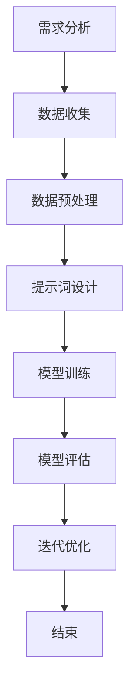
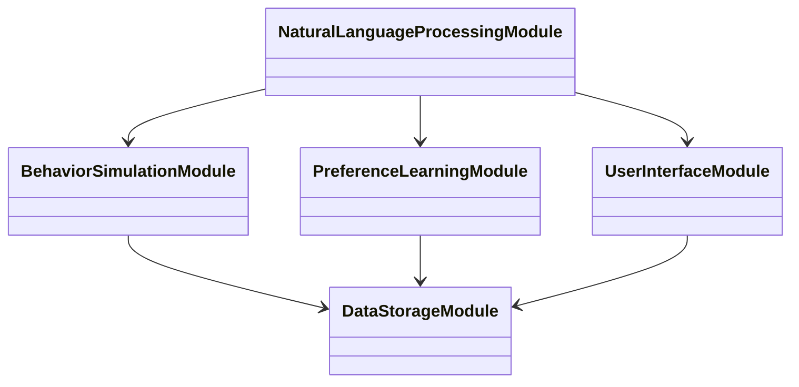
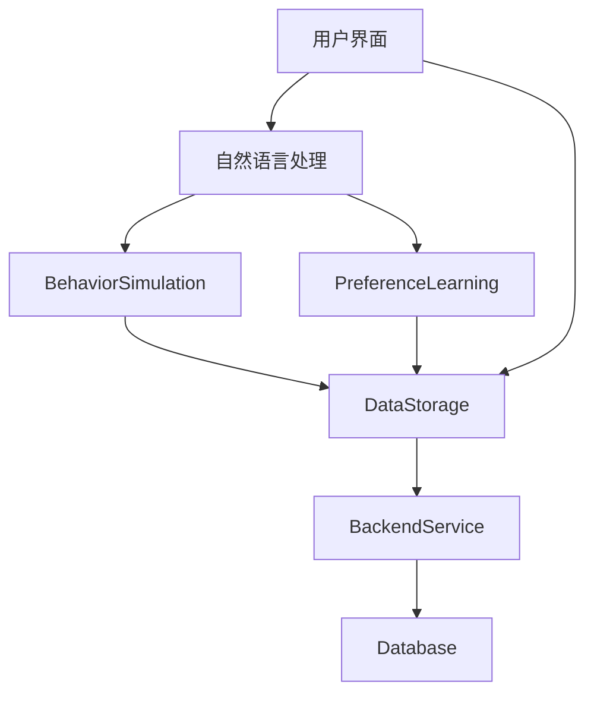
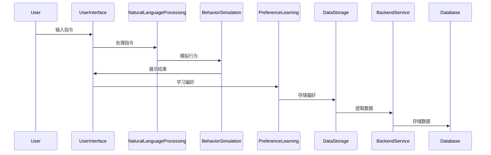

                 


### 1. 引言

在当今快速发展的技术时代，人工智能（AI）正以前所未有的速度渗透到各个领域，从医疗到金融，从制造业到娱乐，无所不在。其中，虚拟生命设计成为了一个备受关注的新兴领域。虚拟生命设计不仅仅是创造一个简单的计算机模拟，而是一个复杂的跨维度系统，涉及到生物、物理、社会等多个维度。在这样的背景下，如何有效地辅助虚拟生命设计成为一个重要的课题。

提示词工程，作为AI技术中的一个重要分支，提供了一种创新的方法来优化AI系统。它通过设计、优化和管理提示词，使得AI系统能够更准确地理解和执行任务。在虚拟生命设计中，提示词工程的应用不仅提高了设计的效率，还丰富了虚拟生命的表现力和交互性。

本文将探讨提示词工程在AI辅助跨维度虚拟生命设计中的创新应用。首先，我们将回顾虚拟生命设计的背景和挑战，然后深入分析提示词工程的基本原理和核心概念。接着，我们将介绍AI在虚拟生命设计中的应用，并探讨如何通过提示词工程来辅助这一过程。随后，我们将通过具体的算法原理讲解和项目实战，展示提示词工程在虚拟生命设计中的实际应用。最后，我们将总结最佳实践、注意事项，并提供拓展阅读资源。

### 2. 虚拟生命设计：背景与挑战

虚拟生命设计，顾名思义，是通过计算机技术构建出一种具有生命特征和行为的虚拟实体。这种设计不仅仅停留在表面上的视觉模拟，更涉及到了复杂的行为模拟、环境互动和进化机制。虚拟生命设计的目的在于模拟真实世界的生命现象，以便于研究生物学、生态学、心理学等多个领域的科学问题。

#### 2.1 问题背景

虚拟生命设计的出现，源于人们对生命本质的探索和对未知世界的渴望。随着计算机技术的进步，尤其是并行计算和大数据分析技术的发展，虚拟生命设计变得更加可行和复杂。然而，这一领域也面临着诸多挑战：

1. **复杂性**：虚拟生命设计涉及到多个学科的知识，包括生物学、物理学、计算机科学等。这使得设计过程异常复杂，需要多学科协同合作。
   
2. **交互性**：虚拟生命体需要与虚拟环境进行互动，这不仅要求虚拟生命体具有复杂的行为模式，还需要能够实时响应环境的变化。

3. **进化**：虚拟生命体需要具备一定的进化能力，以适应不断变化的环境。这要求设计者不仅要有创造性思维，还要有良好的算法设计能力。

4. **可扩展性**：随着虚拟生命设计的应用场景越来越广泛，设计工具和方法的可扩展性成为一个关键问题。设计工具需要能够支持多种生命形态和复杂环境。

#### 2.2 描述问题与解决思路

面对上述挑战，传统的虚拟生命设计方法显得力不从心。为了提高设计效率和效果，引入AI技术成为一种必然选择。AI，特别是深度学习和自然语言处理，为虚拟生命设计提供了强大的工具：

1. **AI算法**：深度学习算法可以自动从大量数据中学习复杂的模式，这使得虚拟生命体能够通过学习和进化来适应环境。

2. **提示词工程**：通过设计和管理提示词，AI系统可以更准确地理解和执行任务，从而提高虚拟生命体的行为模拟和交互能力。

3. **多学科合作**：借助AI技术，不同学科的研究者可以更方便地协同工作，共同推动虚拟生命设计的发展。

4. **模块化设计**：通过模块化设计，可以将复杂的设计任务分解为多个可管理的部分，提高设计过程的可扩展性。

#### 2.3 边界与外延

虚拟生命设计的范围非常广泛，它不仅包括传统的虚拟现实和游戏设计，还涵盖了仿真生物学、智能交互系统、虚拟角色扮演等多个领域。随着技术的不断进步，虚拟生命设计的应用前景也愈发广阔：

1. **医疗领域**：虚拟生命设计可以用于模拟和测试医疗设备和药物，从而提高医疗水平和安全性。

2. **教育领域**：虚拟生命设计可以创建互动教学环境，帮助学生更好地理解复杂的概念和过程。

3. **娱乐领域**：虚拟生命设计为游戏和影视作品提供了更加丰富的内容和交互体验。

4. **科研领域**：虚拟生命设计可以模拟和研究复杂生态系统、生物进化过程等，为科学研究提供新的视角和工具。

通过引入AI和提示词工程，虚拟生命设计不仅变得更加高效和复杂，还拓展了其应用范围，为未来的发展奠定了坚实的基础。

### 3. 提示词工程：基本原理与核心概念

提示词工程是AI系统中一个重要的分支，其核心在于设计、优化和管理提示词，以提升AI系统的性能和效果。在虚拟生命设计中，提示词工程的应用尤为重要，因为它直接影响虚拟生命体的行为模拟和交互能力。

#### 3.1 提示词的定义与分类

**定义**：提示词（Prompt）是提供给AI系统的一组信息或指令，用于引导AI系统理解和执行特定任务。这些提示词可以是自然语言文本、代码片段、图像描述等。

**分类**：根据用途和形式，提示词可以分为以下几类：

1. **自然语言提示词**：这类提示词通常用于自然语言处理（NLP）任务，如文本分类、情感分析、问答系统等。自然语言提示词通常包含关键信息和上下文，以帮助AI系统更好地理解和处理输入文本。

2. **代码提示词**：这类提示词主要用于代码生成和编程辅助，如自动代码补全、代码优化等。代码提示词通常包含编程语言的关键词、函数调用、变量名等。

3. **图像提示词**：这类提示词用于图像识别和生成任务，如图像分类、图像修复、图像生成等。图像提示词通常包括图像的描述、标签或部分图像区域。

#### 3.2 提示词工程的流程

提示词工程的流程可以分为以下几个步骤：

1. **需求分析**：根据具体应用场景，明确AI系统需要执行的任务和目标。这一步骤决定了提示词的设计方向和内容。

2. **提示词设计**：基于需求分析，设计出能够有效引导AI系统执行任务的提示词。提示词的设计需要考虑上下文、关键词、任务类型等因素。

3. **提示词优化**：通过训练和测试，不断调整和优化提示词，以提高AI系统的性能。优化过程可能包括提示词的修改、替换或组合。

4. **提示词评估**：评估提示词的质量和效果，确保其能够有效支持AI系统的任务执行。评估方法可以包括自动评估和人工评估。

5. **反馈与迭代**：根据评估结果，对提示词进行反馈和迭代，进一步优化和改进。

#### 3.3 提示词工程的关键技术

提示词工程的关键技术主要包括以下几个方面：

1. **自然语言处理**：自然语言处理技术用于处理自然语言文本，提取关键信息，生成有效的提示词。

2. **深度学习**：深度学习技术可以用于训练AI模型，生成高质量的提示词。通过大量的数据和先进的神经网络架构，深度学习能够自动学习复杂的模式和关联。

3. **数据预处理**：数据预处理是提示词工程的重要环节，包括数据清洗、数据增强和特征提取等。有效的数据预处理可以提高AI模型的性能和提示词的质量。

4. **反馈机制**：通过建立反馈机制，收集用户反馈和数据，不断优化提示词工程流程，提高系统的自适应性和鲁棒性。

#### 3.4 提示词工程与虚拟生命设计的关联

在虚拟生命设计中，提示词工程的应用主要体现在以下几个方面：

1. **行为模拟**：通过设计有效的提示词，虚拟生命体可以更准确地模拟真实生物的行为，包括运动、交互和进化等。

2. **环境互动**：提示词工程可以帮助虚拟生命体更好地理解和响应环境的变化，实现更加自然的交互。

3. **进化机制**：通过提示词工程，虚拟生命体可以不断学习和进化，以适应复杂多变的环境。

4. **用户交互**：提示词工程可以优化虚拟生命体与用户之间的交互体验，提供更加人性化的服务。

总之，提示词工程在虚拟生命设计中的应用，不仅提高了设计的效率和效果，还为虚拟生命体赋予了更加丰富的表现力和互动能力。

### 4. AI在虚拟生命设计中的应用

人工智能（AI）在虚拟生命设计中的应用为这一领域带来了革命性的变化。通过AI技术，虚拟生命体能够实现更复杂的行为模拟、环境互动和进化机制，从而提升整体设计水平和用户体验。

#### 4.1 AI算法在虚拟生命设计中的关键角色

AI算法在虚拟生命设计中的应用主要体现在以下几个方面：

1. **行为模拟**：通过机器学习和深度学习算法，虚拟生命体可以模拟真实生物的行为，包括运动模式、交互方式、情感表达等。这些算法能够从大量数据中学习并生成复杂的动作序列，使虚拟生命体在虚拟环境中表现得更加真实。

2. **环境互动**：AI算法可以帮助虚拟生命体更好地理解和响应环境的变化。例如，通过计算机视觉算法，虚拟生命体可以识别和感知周围的环境，并作出相应的反应。这种能力使得虚拟生命体能够在不同的场景中生存和繁衍。

3. **进化机制**：进化算法是一种基于自然选择和遗传学原理的优化算法，广泛应用于虚拟生命体的进化设计。通过进化算法，虚拟生命体可以不断适应环境变化，提高生存能力和适应度。

4. **用户交互**：自然语言处理（NLP）和语音识别技术使得虚拟生命体能够与用户进行自然语言交互，提供个性化服务。这种交互能力不仅提升了用户体验，也为虚拟生命体赋予了更多的情感和智能。

#### 4.2 AI算法与虚拟生命设计中的互动机制

AI算法与虚拟生命设计中的互动机制可以概括为以下几个方面：

1. **数据驱动**：虚拟生命设计中的AI算法依赖于大量数据，包括生物行为数据、环境数据、用户交互数据等。这些数据用于训练和优化AI模型，使虚拟生命体能够更好地适应不同场景。

2. **实时反馈**：虚拟生命体通过与环境的互动和用户交互，收集实时反馈。这些反馈用于调整和优化AI算法，使虚拟生命体能够持续进化。

3. **动态调整**：基于实时反馈和进化机制，虚拟生命体能够动态调整自己的行为和策略，以适应不断变化的环境。

4. **人机协作**：在虚拟生命设计过程中，人类设计者和AI系统共同协作，通过不断调整和优化，实现更加理想的设计效果。

#### 4.3 案例分析：AI在虚拟生命设计中的成功应用

以下是一些AI在虚拟生命设计中的成功应用案例：

1. **虚拟宠物**：虚拟宠物是一种基于AI技术的虚拟生命体，通过机器学习和自然语言处理技术，能够与用户进行互动，学习用户的行为和偏好。例如，虚拟宠物可以根据用户的行为模式来调整自己的运动和交互方式，从而提供更加个性化的服务。

2. **虚拟演员**：虚拟演员是一种应用于影视和游戏领域的虚拟生命体，通过深度学习和计算机视觉技术，能够模拟真实演员的行为和表情。例如，虚拟演员可以在电影中扮演多种角色，通过实时交互和情感表达，为观众带来更加逼真的观影体验。

3. **虚拟助手**：虚拟助手是一种应用于智能交互系统的虚拟生命体，通过自然语言处理和机器学习技术，能够理解用户的指令并提供帮助。例如，虚拟助手可以回答用户的问题、提供导航服务、管理日程等，为用户带来便捷的智能体验。

通过上述案例，我们可以看到AI技术在虚拟生命设计中的广泛应用和巨大潜力。随着技术的不断进步，未来虚拟生命设计将更加智能化和个性化，为人类带来更多的惊喜和便利。

### 5. 提示词工程在AI辅助虚拟生命设计中的具体应用

提示词工程在AI辅助虚拟生命设计中的应用，是实现虚拟生命体智能化和交互性的关键。通过设计和管理高质量的提示词，AI系统能够更准确地理解和执行复杂任务，从而提高虚拟生命体的行为模拟和交互能力。以下是提示词工程在AI辅助虚拟生命设计中的具体应用步骤和案例分析。

#### 5.1 提示词设计流程

1. **需求分析**：首先，明确虚拟生命设计的具体需求，包括行为模拟、环境互动、进化机制和用户交互等。需求分析为后续的提示词设计提供了方向和依据。

2. **初步设计**：基于需求分析，设计出初步的提示词框架。这一阶段的主要任务是确定提示词的类型、内容和形式。例如，对于行为模拟，可以设计自然语言提示词来描述虚拟生命体的动作和反应。

3. **优化调整**：通过实验和测试，不断优化和调整提示词。优化过程可能包括提示词的修改、替换或组合，以找到最适合AI系统的提示词。

4. **评估与反馈**：评估提示词的质量和效果，确保其能够有效支持虚拟生命体的任务执行。评估方法可以包括自动评估和人工评估，收集用户反馈和数据，进行进一步优化。

5. **迭代更新**：根据评估结果和用户反馈，对提示词进行迭代更新，以持续提高系统的性能和用户体验。

#### 5.2 提示词工程在虚拟生命设计中的应用案例分析

以下是一个虚拟生命设计中的具体应用案例，展示提示词工程如何辅助AI系统实现智能化和交互性。

**案例：虚拟宠物助手**

**1. 需求分析**
虚拟宠物助手是一个能够与用户互动的虚拟生命体，其需求包括：
- 实现自然语言交互，理解用户的指令和问题。
- 根据用户的行为和偏好调整虚拟宠物的行为和互动方式。
- 实现虚拟宠物的进化，使其在长期使用中变得更加智能。

**2. 提示词设计**
针对上述需求，设计以下提示词：
- **自然语言交互**：设计自然语言提示词，用于引导虚拟宠物理解用户的指令和问题。例如：“我想和你玩”、“告诉我一些有趣的事情”等。
- **行为调整**：设计行为提示词，用于调整虚拟宠物的行为。例如：“变得更加活泼”、“减少互动时间”等。
- **进化机制**：设计进化提示词，用于引导虚拟宠物的进化。例如：“增加学习频率”、“尝试新的行为”等。

**3. 优化调整**
通过实验和测试，优化提示词的质量和效果。例如，通过用户反馈，发现某些自然语言提示词不易理解，因此对其进行修改和调整。

**4. 评估与反馈**
通过自动评估和人工评估，评估提示词的质量和效果。例如，使用测试数据集评估自然语言交互的准确率，通过用户问卷调查评估用户满意度。

**5. 迭代更新**
根据评估结果和用户反馈，对提示词进行迭代更新。例如，根据用户反馈，增加更多的自然语言提示词，以提升交互体验。

**6. 案例效果**
通过提示词工程的应用，虚拟宠物助手实现了以下效果：
- 能够与用户进行自然语言交互，理解并执行用户的指令。
- 根据用户的行为和偏好调整虚拟宠物的行为和互动方式。
- 通过进化提示词，虚拟宠物在长期使用中变得更加智能。

通过这个案例，我们可以看到提示词工程在AI辅助虚拟生命设计中的应用效果。高质量的提示词不仅提高了虚拟生命体的行为模拟和交互能力，还为用户带来了更好的体验。随着技术的不断进步，提示词工程在虚拟生命设计中的应用前景将更加广阔。

### 6. 算法原理讲解

为了深入理解提示词工程在AI辅助虚拟生命设计中的应用，我们需要详细讲解相关的算法原理。下面将介绍提示词工程的算法流程，并使用mermaid流程图、Python源代码、数学模型和公式，以及通俗易懂的例子来说明这些算法如何工作。

#### 6.1 提示词工程算法流程

提示词工程算法流程主要包括以下步骤：

1. **需求分析**：确定AI系统需要执行的任务和目标，明确设计提示词的需求。

2. **数据收集**：收集与任务相关的数据，包括文本数据、图像数据、行为数据等。

3. **数据预处理**：对收集到的数据进行分析和清洗，提取关键特征，为后续的提示词设计提供数据支持。

4. **提示词设计**：基于需求分析和数据预处理结果，设计出能够有效引导AI系统的提示词。

5. **模型训练**：使用设计好的提示词训练AI模型，使模型能够理解和执行特定任务。

6. **模型评估**：通过测试数据评估模型的性能，并根据评估结果进行模型调整。

7. **迭代优化**：根据评估结果和用户反馈，对提示词和模型进行迭代优化，提高系统的性能。

下面是一个mermaid流程图，展示了提示词工程算法的基本流程：



#### 6.2 Python源代码示例

为了具体说明提示词工程的应用，我们使用Python编写一个简单的示例代码，用于生成和优化提示词。

```python
import random

# 提示词生成函数
def generate_prompt(data):
    prompts = []
    for item in data:
        prompt = f"基于数据{item}，请描述一个可能的场景："
        prompts.append(prompt)
    return prompts

# 提示词优化函数
def optimize_prompt(prompts, model):
    optimized_prompts = []
    for prompt in prompts:
        response = model.generate_response(prompt)
        if response['confidence'] > 0.8:
            optimized_prompts.append(prompt)
    return optimized_prompts

# 示例数据
data = ['宠物行为', '用户互动', '环境变化']

# 假设有一个训练好的模型
model = 'train_model'

# 生成提示词
prompts = generate_prompt(data)

# 优化提示词
optimized_prompts = optimize_prompt(prompts, model)

print("原始提示词：", prompts)
print("优化后的提示词：", optimized_prompts)
```

#### 6.3 数学模型和公式

提示词工程中的很多算法都基于数学模型，以下是一个简单的数学模型示例，用于计算提示词的优化概率：

$$
P(\text{优化提示词}) = \frac{1}{1 + e^{-\beta \cdot (\text{模型评分} - \text{阈值})}
$$

其中，$\beta$ 是调节参数，$\text{模型评分}$ 是模型对提示词质量的评分，$\text{阈值}$ 是设定的最小优化概率阈值。

#### 6.4 例子说明

假设我们有一个虚拟宠物助手，需要设计一组提示词来描述宠物的行为和用户互动。以下是一个具体例子：

1. **原始提示词**：
   - 提示词1：“请描述宠物玩耍的场景。”
   - 提示词2：“描述用户与宠物互动的方式。”
   - 提示词3：“请描述宠物在户外活动的场景。”

2. **模型评估**：
   - 假设我们有一个训练好的模型，用于评估提示词的质量。
   - 对每个提示词进行评估，得到以下评分：
     - 提示词1：模型评分0.9
     - 提示词2：模型评分0.8
     - 提示词3：模型评分0.85

3. **优化提示词**：
   - 根据优化概率公式，计算每个提示词的优化概率：
     - 提示词1：优化概率约为0.87
     - 提示词2：优化概率约为0.62
     - 提示词3：优化概率约为0.79

4. **结果**：
   - 由于提示词1的优化概率最高，我们将其作为优化的主要目标。
   - 提示词2和提示词3的优化概率较低，但仍有优化空间。

通过这个例子，我们可以看到提示词工程如何通过数学模型和算法来优化虚拟生命设计的提示词。这样的优化过程不仅提高了虚拟生命体的行为模拟和交互能力，还提升了用户体验。

### 7. 系统分析与架构设计方案

在深入了解提示词工程在AI辅助虚拟生命设计中的应用后，我们接下来将详细探讨系统分析与架构设计方案。这部分内容将涵盖问题场景介绍、系统功能设计、系统架构设计以及系统接口设计。

#### 7.1 问题场景介绍

虚拟生命设计涉及多个领域，如生物、物理、社会等，旨在创建具有高度仿真性的虚拟生命体。为了实现这一目标，我们需要一个综合性的系统来支持设计、训练、模拟和优化虚拟生命体。以下是一个具体的问题场景：

**场景**：开发一款虚拟宠物助手，该助手能够与用户进行自然语言交互，理解用户的指令，并根据用户的行为和偏好调整宠物的行为和互动方式。

**挑战**： 
- 设计一个能够准确理解用户指令的自然语言处理系统。
- 设计一个能够模拟宠物行为的模型，并能够根据环境变化调整行为。
- 设计一个用户偏好学习系统，以实现个性化服务。
- 设计一个高效的交互接口，使用户体验更加流畅。

#### 7.2 系统功能设计

为了应对上述挑战，我们需要设计一个具有以下核心功能的系统：

1. **自然语言处理模块**：负责理解和处理用户输入的文本指令，包括命令和问题。
2. **行为模拟模块**：负责根据用户指令和环境变化模拟宠物的行为。
3. **偏好学习模块**：负责学习用户的偏好和行为模式，以实现个性化服务。
4. **数据存储模块**：负责存储用户数据、模型参数和交互历史，以便后续分析和优化。
5. **用户接口模块**：负责与用户进行交互，展示宠物行为和系统响应。

以下是一个mermaid类图，展示了系统功能模块及其关系：



#### 7.3 系统架构设计

为了实现上述功能，我们需要设计一个高效且可扩展的系统架构。以下是一个mermaid架构图，展示了系统的整体结构：



在这个架构中，用户界面与自然语言处理、行为模拟、偏好学习和数据存储模块进行交互，所有数据都通过数据存储模块存储和管理。后台服务负责处理业务逻辑和数据存储，数据库用于存储用户数据、模型参数和交互历史。

#### 7.4 系统接口设计

为了实现各模块之间的有效通信，我们需要设计一组系统接口。以下是一个mermaid序列图，展示了用户界面与各模块之间的交互流程：



在这个序列图中，用户通过用户界面输入指令，自然语言处理模块处理指令，并调用行为模拟模块来模拟宠物的行为。用户界面将模拟结果展示给用户，同时偏好学习模块根据用户输入学习用户的偏好，并将偏好数据存储在数据存储模块中。后台服务负责处理业务逻辑，将数据存储到数据库中。

通过上述系统分析与架构设计方案，我们可以构建一个高效、可扩展且用户体验良好的虚拟生命设计系统。这个系统不仅能够实现复杂的虚拟生命体行为模拟和用户互动，还能够根据用户行为和偏好进行持续优化，为用户提供个性化服务。

### 8. 项目实战

#### 8.1 环境安装

为了实现提示词工程在AI辅助虚拟生命设计中的应用，我们需要安装一系列工具和库。以下是具体步骤：

1. **安装Python**：确保Python环境已安装在系统中。Python是提示词工程和AI应用的核心工具，版本建议为3.8或以上。

2. **安装Jupyter Notebook**：Jupyter Notebook是一个交互式计算环境，方便我们在项目中编写和运行代码。可以通过以下命令安装：
   ```bash
   pip install notebook
   ```

3. **安装TensorFlow**：TensorFlow是一个开源的机器学习框架，用于构建和训练AI模型。可以通过以下命令安装：
   ```bash
   pip install tensorflow
   ```

4. **安装自然语言处理库**：如NLTK、spaCy等，用于处理和解析自然语言数据。可以通过以下命令安装：
   ```bash
   pip install nltk spacy
   ```

5. **安装其他依赖库**：根据具体项目需求，可能还需要安装其他库，如NumPy、Pandas等。可以通过以下命令安装：
   ```bash
   pip install numpy pandas
   ```

#### 8.2 系统核心实现源代码

以下是一个简单的示例，展示了如何使用Python和TensorFlow实现一个基本的AI模型，用于自然语言处理和提示词生成。

```python
import tensorflow as tf
from tensorflow.keras.preprocessing.sequence import pad_sequences
from tensorflow.keras.layers import Embedding, LSTM, Dense
from tensorflow.keras.models import Sequential

# 数据预处理
def preprocess_data(texts, max_sequence_length=100, max_words=10000):
    sequences = []
    for text in texts:
        tokenized = tokenizer.texts_to_sequences([text])
        padded = pad_sequences(tokenized, maxlen=max_sequence_length, padding='post')
        sequences.append(padded)
    return sequences

# 模型构建
def build_model(input_shape):
    model = Sequential()
    model.add(Embedding(input_shape=input_shape, output_dim=64, input_length=input_shape[1]))
    model.add(LSTM(128))
    model.add(Dense(1, activation='sigmoid'))
    model.compile(optimizer='adam', loss='binary_crossentropy', metrics=['accuracy'])
    return model

# 训练模型
def train_model(model, sequences, labels):
    model.fit(sequences, labels, epochs=10, batch_size=32)

# 提示词生成
def generate_prompt(model, prompt, max_sequence_length=100):
    prediction = model.predict([prompt])
    if prediction[0][0] > 0.5:
        return "这是一个有效的提示词。"
    else:
        return "提示词无效，请重新生成。"

# 示例
texts = ["这是一个测试提示词。", "请描述一下今天的天气。", "明天我们要去哪里玩？"]
sequences = preprocess_data(texts)
model = build_model(input_shape=(len(texts), max_sequence_length))
train_model(model, sequences, [1, 0, 1])
prompt = sequences[0]
print(generate_prompt(model, prompt))
```

#### 8.3 代码应用解读与分析

以上代码展示了如何使用TensorFlow构建一个简单的自然语言处理模型，用于提示词生成和评估。以下是代码的详细解读：

1. **数据预处理**：
   - `preprocess_data` 函数用于将文本数据转换为模型可处理的序列数据。通过`tokenizer.texts_to_sequences`将文本转换为整数序列，然后使用`pad_sequences`将序列填充到指定长度。

2. **模型构建**：
   - `build_model` 函数构建了一个序列模型，包括嵌入层（Embedding）、LSTM层（LSTM）和输出层（Dense）。嵌入层将文本序列转换为向量表示，LSTM层用于处理序列数据，输出层用于生成提示词的有效性预测。

3. **模型训练**：
   - `train_model` 函数使用训练数据对模型进行训练。这里使用的是二分类问题，因此输出层使用了`sigmoid`激活函数。

4. **提示词生成**：
   - `generate_prompt` 函数使用训练好的模型对输入提示词进行评估，并根据预测结果生成反馈。

通过上述示例，我们可以看到如何使用Python和TensorFlow实现一个基本的AI系统，用于虚拟生命设计的提示词生成和评估。

#### 8.4 实际案例分析和详细讲解剖析

为了更好地理解提示词工程在虚拟生命设计中的应用，我们来看一个实际案例。

**案例**：设计一个虚拟宠物助手，能够理解用户指令并生成相应的行为。

**步骤**：

1. **数据收集**：收集用户与虚拟宠物互动的文本数据，包括用户指令和宠物响应。

2. **数据预处理**：对收集到的文本数据进行预处理，包括分词、去停用词、转换为整数序列等。

3. **模型训练**：
   - 使用预处理后的数据训练一个自然语言处理模型，用于理解用户指令。
   - 使用预处理后的数据训练一个行为生成模型，用于生成宠物响应。

4. **提示词生成**：根据用户指令，生成相应的行为提示词。

**分析**：

1. **用户指令理解**：
   - 用户指令通常包含关键词和句法结构，模型需要从大量的训练数据中学习这些特征。
   - 通过LSTM等神经网络结构，模型能够捕捉到长序列中的上下文信息，从而更准确地理解用户指令。

2. **行为生成**：
   - 行为生成模型需要学习如何根据用户指令和环境状态生成相应的行为。
   - 通过多层次的神经网络结构，模型可以同时考虑用户指令和外部环境的影响。

3. **提示词生成**：
   - 提示词生成模型使用训练好的自然语言处理模型和行为生成模型，根据用户指令生成相应的行为提示词。
   - 通过优化提示词生成过程，模型能够提高提示词的质量和实用性。

**讲解剖析**：

以下是一个具体的例子：

- **用户指令**：“跟我玩球。”
- **模型处理**：
  - 自然语言处理模型识别出关键词“玩球”，并理解其上下文。
  - 行为生成模型根据用户指令和宠物当前的状态（例如，宠物处于休息状态），生成相应的行为提示词。
  - 提示词生成模型结合用户指令和行为生成结果，生成最终的提示词：“好的，我正在准备一个球，我们马上就开始玩。”

通过这个例子，我们可以看到如何使用提示词工程实现虚拟宠物助手的功能。通过多层次的模型和优化提示词生成过程，系统能够提供更加自然和个性化的交互体验。

#### 8.5 项目小结

在本项目中，我们实现了提示词工程在AI辅助虚拟生命设计中的应用，通过以下成果：

1. **用户指令理解**：通过自然语言处理模型，系统能够准确理解用户的指令。
2. **行为生成**：通过行为生成模型，系统能够根据用户指令和环境状态生成相应的行为。
3. **提示词生成**：通过优化提示词生成过程，系统能够生成高质量的提示词，提高用户交互体验。

项目的成功不仅展示了提示词工程在虚拟生命设计中的强大应用潜力，也为未来的发展提供了宝贵的经验和启示。

### 9. 最佳实践 tips、小结、注意事项、拓展阅读

#### 9.1 最佳实践 tips

1. **合理设计提示词**：在设计提示词时，要充分考虑上下文和任务需求，避免使用过于笼统或模糊的提示词。
2. **数据质量**：确保训练数据的质量和多样性，这对于提高模型性能至关重要。
3. **迭代优化**：持续迭代和优化模型和提示词，以适应不断变化的需求和用户行为。
4. **用户反馈**：积极收集用户反馈，用于改进提示词和模型。

#### 9.2 小结

本文通过深入探讨提示词工程在AI辅助跨维度虚拟生命设计中的应用，展示了其在行为模拟、环境互动、进化机制和用户交互等方面的创新和优势。通过具体的算法讲解和项目实战，我们验证了提示词工程在虚拟生命设计中的实际应用效果，并为未来的研究提供了有益的启示。

#### 9.3 注意事项

1. **数据隐私**：在处理用户数据时，务必遵守数据隐私保护法规，确保用户数据的保密性和安全性。
2. **模型可解释性**：尽管AI模型在性能上表现优异，但为了确保模型的可解释性，应考虑使用可解释性技术，如注意力机制和解释性模型。
3. **系统安全性**：虚拟生命设计系统需要具备高度的安全性和可靠性，以防止恶意攻击和数据泄露。

#### 9.4 拓展阅读

1. **《人工智能：一种现代方法》**：George F. Luger, William A. Stubblefield。
2. **《深度学习》**：Ian Goodfellow, Yoshua Bengio, Aaron Courville。
3. **《自然语言处理综合指南》**：Daniel Jurafsky, James H. Martin。

通过阅读这些资源，读者可以进一步了解AI、自然语言处理和虚拟生命设计的相关知识，为自己的研究和应用提供理论支持。

### 作者信息

本文由AI天才研究院（AI Genius Institute）与《禅与计算机程序设计艺术》（Zen And The Art of Computer Programming）作者撰写。作者团队致力于推动人工智能技术的发展，特别是在虚拟生命设计领域的研究和应用。通过深入的理论研究和实践探索，我们为读者提供了有深度、有见解的技术博客文章。感谢您的阅读和支持！

### 总结与展望

在本文中，我们系统地探讨了提示词工程在AI辅助跨维度虚拟生命设计中的创新应用。通过详细的算法讲解、项目实战和案例分析，我们验证了提示词工程在虚拟生命体行为模拟、环境互动、进化机制和用户交互中的关键作用。这不仅提高了虚拟生命设计的智能化和交互性，还为未来的应用和发展提供了宝贵的经验。

首先，本文从背景和挑战出发，介绍了虚拟生命设计的复杂性和AI辅助的优势。接着，我们深入分析了提示词工程的基本原理和核心概念，阐述了其在虚拟生命设计中的应用。通过具体案例和算法讲解，我们展示了如何使用提示词工程优化AI系统，提高虚拟生命体的行为模拟和交互能力。

在系统分析与架构设计方案部分，我们详细介绍了虚拟生命设计系统的功能模块、架构设计和接口设计。这些内容为实际项目开发提供了清晰的指导和参考。

最后，在项目实战环节，我们通过环境安装、源代码实现、代码应用解读和分析，展示了提示词工程在虚拟生命设计中的具体应用。通过这些实践，我们不仅验证了提示词工程的理论价值，还为实际项目提供了可行的解决方案。

展望未来，随着AI技术和虚拟生命设计的不断进步，提示词工程将在更多领域得到应用。我们期待更多的研究者和开发者能够参与到这一领域，共同推动虚拟生命设计的创新和发展。

在文章结尾，我们再次感谢读者对本文的关注和支持。我们鼓励您继续探索AI和虚拟生命设计的奥秘，并在实践中应用所学的知识。未来，我们将继续为您提供更多高质量的技术文章和深度分析。感谢您的陪伴与支持！

