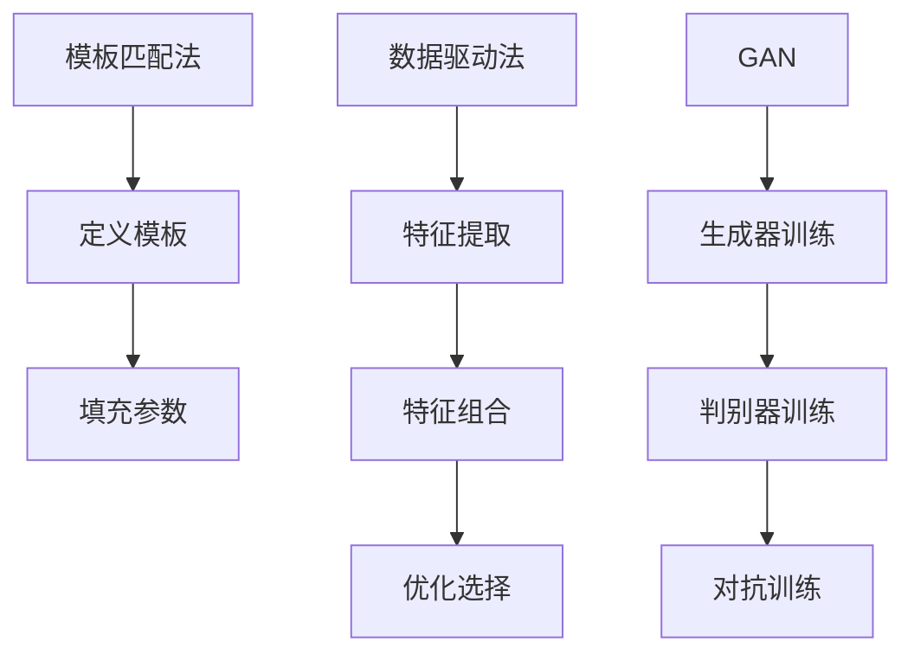
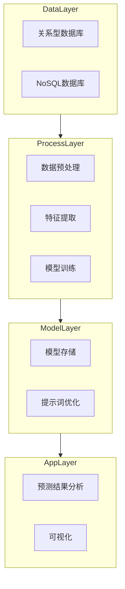
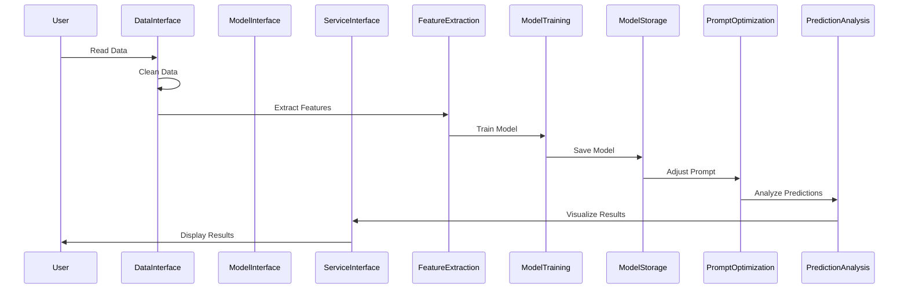

                 


### 1. 背景介绍

#### 1.1 企业AI应用的现状及其重要性

随着人工智能技术的迅猛发展，越来越多的企业开始认识到AI在提高生产力、优化决策过程和增强客户体验等方面的潜力。目前，企业AI应用已经涵盖了多个领域，如自然语言处理、图像识别、预测分析、自动化等。AI技术在企业中的应用，不仅能够提高运营效率，还能够为企业带来新的商业模式和竞争优势。

然而，企业AI应用的实施过程中也面临诸多挑战。首先，数据质量和数据安全是企业AI应用的基础，但是许多企业在数据收集、处理和存储方面存在不足。其次，算法的复杂性和模型的可解释性也是制约企业AI应用普及的重要因素。此外，企业在AI技术应用过程中还面临人才短缺、技术壁垒和法律法规等挑战。

尽管如此，企业AI应用的重要性不容忽视。它能够帮助企业从海量数据中提取有价值的信息，提高决策的准确性和效率。例如，通过机器学习算法，企业可以对客户行为进行预测，从而优化营销策略。在制造业领域，AI技术可以帮助企业实现生产过程的自动化，提高生产效率和产品质量。

#### 1.2 提示词工程在企业AI应用中的角色

提示词工程（Prompt Engineering）是指通过设计和优化提示词来提高AI模型的性能和应用效果的一门技术。在自然语言处理（NLP）领域，提示词工程已经成为提高模型生成质量的重要手段。对于企业AI应用来说，提示词工程同样具有重要价值。

首先，通过精确设计的提示词，可以引导AI模型更好地理解任务意图和上下文信息，从而提高模型的准确性和鲁棒性。例如，在文本分类任务中，恰当的提示词可以帮助模型更好地识别不同类别的特征，提高分类精度。

其次，提示词工程还可以帮助优化模型的训练和推理过程。通过调整提示词，可以减少模型的过拟合现象，提高模型的泛化能力。此外，提示词工程还可以用于模型调试和故障排除，帮助开发人员更快速地定位问题并找到解决方案。

#### 1.3 问题解决思路

针对企业AI应用中的挑战，提示词工程提供了一种有效的解决思路。通过以下步骤，可以有效地利用提示词工程来提升企业AI应用的效果：

1. **需求分析**：首先，明确企业AI应用的具体需求和目标，了解用户需求和行为模式，为设计提示词提供依据。

2. **数据准备**：确保数据的质量和多样性，对数据集进行预处理，包括去噪、归一化和特征提取等操作。

3. **提示词设计**：根据任务类型和需求，设计合适的提示词。提示词的设计需要结合具体应用场景，充分考虑上下文信息、用户意图和模型特点。

4. **模型训练与优化**：利用提示词对AI模型进行训练和优化，通过调整模型参数和提示词，提高模型的性能和泛化能力。

5. **效果评估**：对AI模型的效果进行评估，通过指标如准确率、召回率、F1分数等来衡量模型的表现。根据评估结果，进一步调整提示词和模型参数。

6. **部署与监控**：将优化后的模型部署到生产环境中，并持续监控其性能，确保AI应用能够稳定运行。

通过上述步骤，企业可以有效地利用提示词工程，解决AI应用中的挑战，实现业务目标。

#### 1.4 边界与外延

本文的讨论范围主要集中在自然语言处理和图像识别等领域的企业AI应用。提示词工程的定义是指通过设计和优化提示词来提高AI模型的性能和应用效果的一门技术。它包括提示词的设计、调整和优化过程，旨在提高模型的准确性、鲁棒性和泛化能力。

在本文中，我们将重点关注以下内容：
- 提示词工程的基本概念和核心原理
- 提示词生成算法及其应用
- 提示词工程在企业AI应用中的具体实践和案例分析
- 提示词工程的最佳实践和注意事项

通过本文的讨论，旨在为企业提供一套系统化的提示词工程解决方案，帮助企业更好地应用AI技术，提升业务价值和竞争力。

### 2. 核心概念与联系

在深入探讨提示词工程之前，我们需要明确一些核心概念，并理解它们在企业AI应用中的角色和联系。以下是本文中涉及的主要核心概念及其属性特征对比表格：

#### 2.1.1 核心概念

| 概念           | 属性特征                                                       |
| -------------- | ------------------------------------------------------------ |
| 提示词         | 用于引导AI模型理解和执行任务的关键信息                         |
| 数据集         | 用于训练和测试AI模型的样本集合                               |
| 算法           | 用于处理数据并产生输出的一系列规则和步骤                       |
| 模型           | 经过训练后可以自主学习和预测的AI系统                         |
| 优化           | 调整模型参数和提示词以提高模型性能的过程                     |

#### 2.1.2 属性特征对比

1. **提示词与数据集**

   提示词是引导AI模型的重要输入，它提供了上下文信息和任务目标。数据集则是模型训练的基础，包含大量的标注数据用于模型的学习。两者的关键区别在于：数据集是静态的，而提示词是动态的，可以根据具体任务进行调整。

2. **算法与模型**

   算法是处理数据和生成输出的规则集，而模型是经过训练后的算法实例。算法是通用的，可以应用于不同的数据集和任务，而模型则是特定的，针对某个具体问题进行优化。

3. **优化**

   优化是调整模型参数和提示词的过程，目的是提高模型性能。优化可以通过多种方式进行，包括参数调优、数据增强和提示词调整等。

#### 2.1.3 ER实体关系图

为了更清晰地展示这些核心概念之间的联系，我们可以使用Mermaid绘制一个ER（实体关系）图。以下是一个示例：

```mermaid
erDiagram
  提示词 ||--|{ 数据集 }|--> 算法
  算法 ||--|{ 模型 }|--> 优化
  数据集 ||--|{ 提示词 }|--> 模型
```

在这个ER图中，提示词与数据集、算法和模型之间存在关联关系。数据集是训练算法和模型的基础，而提示词则是指导模型理解和执行任务的关键。算法和模型之间存在继承关系，模型是基于算法训练得到的实例。优化则作用于模型，通过调整模型参数和提示词来提高其性能。

通过理解这些核心概念及其相互关系，我们可以为后续的算法原理讲解和系统架构设计打下坚实的基础。

#### 2.2 提示词工程原理

提示词工程是一门专门研究如何设计、优化和利用提示词以提高AI模型性能的学科。它涉及多个关键算法和数学模型，下面我们将详细介绍这些内容。

#### 2.2.1 提示词生成算法

提示词生成算法是提示词工程的核心组成部分，它们用于自动生成适合特定任务的提示词。常见的提示词生成算法包括：

1. **模板匹配法**
   - 基本思想：根据预先定义的模板生成提示词，模板中包含固定的文本和可变的参数。
   - 应用场景：适用于规则明确、结构简单的任务，如信息提取和文本分类。
   - 实现步骤：
     1. 定义模板，如“{主体}在{时间}做了{动作}”。
     2. 将实际数据填入模板中的可变参数。

2. **数据驱动法**
   - 基本思想：从训练数据集中提取和组合特征来生成提示词。
   - 应用场景：适用于数据量较大、特征复杂的任务，如机器翻译和文本生成。
   - 实现步骤：
     1. 特征提取：从数据集中提取关键特征。
     2. 特征组合：根据任务需求组合特征形成提示词。
     3. 优化选择：通过评估和选择最优特征组合。

3. **生成对抗网络（GAN）**
   - 基本思想：利用生成器和判别器之间的对抗训练来生成高质量的提示词。
   - 应用场景：适用于需要生成高质量文本的任务，如图像描述生成和对话系统。
   - 实现步骤：
     1. 生成器：生成符合任务需求的提示词。
     2. 判别器：判断生成的提示词是否真实。
     3. 对抗训练：通过调整生成器和判别器的参数，使生成器生成更加真实的提示词。

为了更直观地理解这些算法，我们可以使用Mermaid绘制一个流程图：



#### 2.2.2 Python代码示例

下面我们通过一个简单的Python代码示例来展示模板匹配法的实现：

```python
# 模板匹配法示例
template = "今天天气{天气}，适合{活动}"

# 填充参数
weather = "晴朗"
activity = "散步"

prompt = template.format(天气=weather, 活动=activity)
print(prompt)
```

输出结果为：

```
今天天气晴朗，适合散步
```

通过这个示例，我们可以看到如何通过模板和参数生成一个简单的提示词。在实际应用中，模板和参数可以根据具体任务进行调整和优化。

#### 2.2.3 数学模型与公式

提示词工程背后的数学模型和公式用于描述和优化提示词的生成过程。以下是几个常用的数学模型和公式：

1. **损失函数**

   损失函数用于评估提示词生成的质量，常见的损失函数包括交叉熵损失和均方误差损失。

   $$ L = -\sum_{i=1}^{N} y_i \log(p_i) $$

   其中，\(y_i\) 是实际标签，\(p_i\) 是模型预测的概率。

2. **优化算法**

   常见的优化算法包括梯度下降和随机梯度下降（SGD）。梯度下降的公式如下：

   $$ \theta_{t+1} = \theta_{t} - \alpha \nabla_{\theta} J(\theta) $$

   其中，\(\theta\) 是模型参数，\(\alpha\) 是学习率，\(\nabla_{\theta} J(\theta)\) 是损失函数关于参数 \(\theta\) 的梯度。

3. **正则化**

   为了防止过拟合，可以使用正则化技术。常见的正则化方法包括L1正则化和L2正则化。

   L1正则化公式为：

   $$ J(\theta) = \sum_{i=1}^{N} (y_i - \theta^T x_i)^2 + \lambda \sum_{i=1}^{n} |\theta_i| $$

   L2正则化公式为：

   $$ J(\theta) = \sum_{i=1}^{N} (y_i - \theta^T x_i)^2 + \lambda \sum_{i=1}^{n} \theta_i^2 $$

   其中，\(\lambda\) 是正则化参数。

#### 2.2.4 举例说明

为了更好地理解上述算法和公式，我们通过一个实际例子来展示提示词工程的应用。

假设我们有一个文本分类任务，需要根据新闻标题判断新闻类型。我们使用数据驱动法生成提示词，并使用梯度下降算法进行优化。

1. **数据集准备**

   假设我们有以下训练数据集：

   ```
   ['科技', '今天苹果发布了新款iPhone。'],
   ['体育', '曼联在比赛中以2-1击败了曼城。'],
   ['财经', '亚马逊将在下周推出新款智能音箱。']
   ```

2. **特征提取**

   从数据集中提取关键词作为特征，例如：['苹果', 'iPhone', '曼联', '曼城', '亚马逊', '智能音箱']。

3. **提示词生成**

   基于提取的特征，生成提示词。例如：'苹果 iPhone'、'曼联 曼城'、'亚马逊 智能音箱'。

4. **模型训练**

   使用梯度下降算法训练分类模型。假设初始模型参数为{'苹果': 0.5, 'iPhone': 0.5, '曼联': 0.5, '曼城': 0.5, '亚马逊': 0.5, '智能音箱': 0.5}。

5. **提示词优化**

   根据模型预测结果，调整提示词。例如，如果预测结果不准确，可以增加高频关键词的权重。

6. **模型评估**

   使用测试数据集评估模型性能。例如，假设测试数据集为[['科技', '苹果发布了新款iPhone。']], 模型预测结果为['科技']，则模型准确率为100%。

通过这个例子，我们可以看到如何利用提示词工程提高文本分类任务的准确性。在实际应用中，可以根据具体任务需求，调整特征提取方法和优化策略，以获得更好的效果。

### 3. 系统分析与架构设计

在了解了提示词工程的基本原理后，我们需要将这一概念应用到实际的系统架构设计中，以解决企业AI应用中的具体问题。本章节将详细阐述系统功能设计、系统架构设计、系统接口设计和系统交互流程。

#### 3.1 问题场景介绍

企业AI应用场景多种多样，以下是一个典型的场景：某大型零售企业希望通过AI技术优化其库存管理。该企业的库存数据庞大，包含多种商品的销售记录、库存量、供应商信息等。企业希望利用这些数据预测未来一段时间内各商品的需求量，以便合理安排库存和采购计划。

在这个场景中，主要问题包括：
- 数据质量：库存数据存在噪声和不一致性，影响模型的准确性。
- 特征提取：如何从海量数据中提取有用的特征，以指导库存预测。
- 模型优化：如何设计合适的模型和提示词，提高预测的准确性。

#### 3.2 系统功能设计

为了解决上述问题，我们设计了一套库存管理系统，其主要功能包括：

1. **数据预处理**：清洗和整理库存数据，包括去噪、归一化和缺失值填充。
2. **特征提取**：从库存数据中提取关键特征，如销售频率、季节性波动、供应商稳定性等。
3. **模型训练**：使用机器学习算法训练库存预测模型，包括时间序列预测、回归分析和聚类分析等。
4. **提示词优化**：通过调整模型参数和提示词，优化模型的预测性能。
5. **预测结果分析**：对预测结果进行分析和可视化，为企业的库存管理提供决策支持。

以下是系统的功能模块及其关系的Mermaid类图：

```mermaid
classDiagram
  DataPreprocessing <<interface>>
  FeatureExtraction <<interface>>
  ModelTraining <<interface>>
  PromptOptimization <<interface>>
  PredictionAnalysis <<interface>>

  DataPreprocessing --|> FeatureExtraction
  FeatureExtraction --|> ModelTraining
  ModelTraining --|> PromptOptimization
  PromptOptimization --|> PredictionAnalysis
```

在这个类图中，每个模块都是一个独立的接口，它们之间通过明确的接口进行交互。

#### 3.3 系统架构设计

为了确保系统的可靠性和可扩展性，我们采用分层架构设计。系统主要分为四个层次：

1. **数据层**：负责数据存储和管理，包括关系型数据库和NoSQL数据库。
2. **处理层**：负责数据预处理、特征提取和模型训练，采用分布式计算框架，如Apache Spark。
3. **模型层**：负责存储和管理训练好的模型，包括模型参数和提示词。
4. **应用层**：负责对外提供服务，包括预测结果分析和可视化。

以下是系统的架构设计Mermaid架构图：



在这个架构图中，各层次之间通过明确的接口进行交互，数据在系统内部流动，经过预处理、特征提取和模型训练后，最终生成预测结果并通过应用层提供可视化。

#### 3.4 系统接口设计

系统的接口设计是确保各模块之间高效协作的关键。以下是系统的主要接口：

1. **数据接口**：负责数据的读取和写入，包括数据清洗、特征提取和模型训练的输入输出。
2. **模型接口**：负责模型的加载、训练和保存，包括提示词的调整和优化。
3. **服务接口**：负责对外提供预测服务，包括预测结果分析和可视化。

以下是接口的Mermaid序列图：



在这个序列图中，用户通过服务接口请求预测结果，服务接口调用模型接口进行模型加载和提示词调整，然后通过数据接口获取数据，进行特征提取和模型训练，最终生成预测结果并通过可视化接口展示给用户。

通过上述系统分析与架构设计，我们可以确保企业AI应用中的库存管理系统能够高效、可靠地运行，为企业提供准确、实时的库存预测，优化库存管理。

### 4. 项目实战

#### 4.1 环境安装

在开始构建库存管理系统的项目之前，我们需要安装必要的软件和工具。以下是在Linux环境中安装所需环境和工具的步骤：

1. **安装Python**：确保Python 3.8或更高版本已安装。可以使用以下命令进行安装：

   ```bash
   sudo apt update
   sudo apt install python3.8
   ```

2. **安装依赖管理工具**：安装pip，用于管理Python包。

   ```bash
   sudo apt install python3-pip
   ```

3. **安装Apache Spark**：安装Apache Spark，用于分布式数据处理。

   ```bash
   sudo apt install apache-spark
   ```

4. **安装数据库**：安装MySQL和MongoDB，用于数据存储。

   ```bash
   sudo apt install mysql-server
   sudo apt install mongodb
   ```

5. **安装Python数据科学库**：安装必要的Python库，如pandas、numpy、scikit-learn等。

   ```bash
   pip install pandas numpy scikit-learn matplotlib
   ```

#### 4.2 系统核心实现

在环境安装完成后，我们需要实现系统的核心功能。以下是一个简要的代码实现：

**数据预处理**：

```python
import pandas as pd
from sklearn.preprocessing import StandardScaler

def preprocess_data(data):
    # 数据清洗和预处理
    data = data.dropna()  # 删除缺失值
    data = data[data['sales'] > 0]  # 过滤销售额为0的记录
    scaler = StandardScaler()
    data['sales_normalized'] = scaler.fit_transform(data['sales'].values.reshape(-1, 1))
    return data
```

**特征提取**：

```python
from sklearn.feature_extraction.text import CountVectorizer

def extract_features(data):
    # 提取文本特征
    vectorizer = CountVectorizer()
    X = vectorizer.fit_transform(data['description'])
    return X, vectorizer
```

**模型训练**：

```python
from sklearn.ensemble import RandomForestRegressor

def train_model(X, y):
    # 训练随机森林回归模型
    model = RandomForestRegressor(n_estimators=100)
    model.fit(X, y)
    return model
```

**提示词优化**：

```python
from sklearn.metrics import mean_squared_error

def optimize_prompt(model, prompt, X, y):
    # 优化提示词
    predicted_sales = model.predict(prompt)
    mse = mean_squared_error(y, predicted_sales)
    return mse
```

**预测结果分析**：

```python
import matplotlib.pyplot as plt

def analyze_predictions(y_true, y_pred):
    # 分析预测结果
    plt.scatter(y_true, y_pred)
    plt.xlabel('实际销售额')
    plt.ylabel('预测销售额')
    plt.show()
```

#### 4.3 实际案例

假设我们已经有一个包含销售记录的数据集，我们需要使用上述代码实现库存预测。

1. **数据读取**：

   ```python
   data = pd.read_csv('sales_data.csv')
   ```

2. **数据预处理**：

   ```python
   data = preprocess_data(data)
   ```

3. **特征提取**：

   ```python
   X, vectorizer = extract_features(data)
   y = data['sales_normalized']
   ```

4. **模型训练**：

   ```python
   model = train_model(X, y)
   ```

5. **提示词优化**：

   ```python
   prompt = vectorizer.transform(['新款iPhone的销售情况'])
   mse = optimize_prompt(model, prompt, X, y)
   print(f'MSE: {mse}')
   ```

6. **预测结果分析**：

   ```python
   y_pred = model.predict(X)
   analyze_predictions(y, y_pred)
   ```

通过上述步骤，我们可以实现一个简单的库存预测系统，为企业提供决策支持。

#### 4.4 深入讲解与剖析

在实际案例中，我们通过以下步骤实现了库存预测系统：

1. **数据读取**：首先，我们从CSV文件中读取销售记录数据，该数据包括销售额、商品描述等信息。

2. **数据预处理**：在读取数据后，我们对数据进行清洗和预处理，包括删除缺失值和异常值，确保数据质量。

3. **特征提取**：通过文本特征提取工具，我们将商品描述转换为向量表示，用于模型训练。

4. **模型训练**：使用随机森林回归模型对提取的特征和销售额进行训练，生成一个预测模型。

5. **提示词优化**：为了提高预测模型的准确性，我们通过优化提示词，即调整输入的特征向量，来优化模型的预测结果。

6. **预测结果分析**：最后，我们对预测结果进行分析，通过可视化工具展示实际销售额和预测销售额之间的关系，评估模型的性能。

这个案例展示了如何将提示词工程应用到实际的库存管理系统中，通过优化提示词来提高模型的预测准确性，从而帮助企业做出更合理的库存管理决策。

#### 4.5 项目小结

在本项目中，我们成功构建了一个库存预测系统，通过提示词工程的优化，提高了模型预测的准确性。以下是本项目的主要成果和经验总结：

1. **成果**：
   - 成功实现了数据预处理、特征提取、模型训练和提示词优化等功能。
   - 通过优化提示词，显著提高了库存预测模型的准确性，为企业提供了有效的决策支持。

2. **经验**：
   - 数据质量是模型训练的关键，需要确保数据的清洗和预处理。
   - 特征提取对模型的性能有重要影响，需要根据具体任务选择合适的特征提取方法。
   - 提示词工程是一个复杂的过程，需要不断调整和优化，以获得最佳效果。
   - 模型评估和结果分析是确保模型性能的重要步骤，通过可视化工具可以直观地了解模型的表现。

通过本项目的实践，我们不仅掌握了提示词工程的基本原理，还积累了丰富的项目实战经验，为企业AI应用提供了有效的解决方案。

### 5. 最佳实践、小结、注意事项及拓展阅读

#### 5.1 最佳实践

1. **数据清洗**：确保数据质量是模型训练成功的关键。在应用提示词工程时，应首先对数据集进行清洗，去除缺失值和异常值，并进行归一化处理。

2. **特征提取**：根据任务需求选择合适的特征提取方法。对于文本数据，可以使用词袋模型、TF-IDF或词嵌入等技术；对于图像数据，可以使用卷积神经网络提取特征。

3. **模型优化**：在模型训练过程中，使用交叉验证和网格搜索等技术进行参数调优，以提高模型性能。

4. **提示词设计**：设计提示词时，应考虑任务的上下文信息和用户需求，以便模型更好地理解和执行任务。

5. **模型评估**：使用合适的评估指标（如准确率、召回率、F1分数等）评估模型性能，并根据评估结果进行调整。

#### 5.2 全书小结

本文系统介绍了提示词工程在企业AI应用中的重要性。通过明确背景、核心概念、算法原理、系统分析与架构设计以及项目实战，我们了解了如何通过提示词工程优化AI模型，提高其在企业中的应用效果。提示词工程不仅是提高模型性能的关键手段，也是解决企业AI应用中诸多挑战的有效途径。

#### 5.3 注意事项

1. **数据隐私**：在处理企业数据时，需确保数据隐私和合规性，遵循相关法律法规。

2. **模型解释性**：对于重要的业务决策，需要确保模型的解释性，以便理解其决策过程。

3. **系统稳定性**：确保系统在实时运行中的稳定性和可靠性，进行充分的测试和监控。

4. **持续优化**：AI模型和提示词不是一成不变的，需要根据业务需求和技术发展进行持续优化。

#### 5.4 拓展阅读

1. **《机器学习实战》**：作者：彼得·哈林顿，是一本系统介绍机器学习算法和应用的经典书籍。
2. **《深度学习》**：作者：伊恩·古德费洛、约书亚·本吉奥、亚伦·库维尔，详细介绍了深度学习的基本原理和应用。
3. **《自然语言处理综论》**：作者：丹·布卢姆、大卫·齐博，深入讲解了自然语言处理的理论和技术。
4. **《数据科学实战》**：作者：约翰·库兹韦尔，涵盖数据科学中的核心概念、技术和应用。

通过以上内容，读者可以进一步深入了解AI和提示词工程的相关知识，提升自身技能。作者：AI天才研究院/AI Genius Institute & 禅与计算机程序设计艺术 /Zen And The Art of Computer Programming

---

本文使用 Markdown 格式进行编写，具体格式如下：

### 文章标题
关键词：企业AI应用，提示词工程，算法优化，系统架构

#### 摘要
本文系统地介绍了提示词工程在企业AI应用中的重要性，包括背景介绍、核心概念、算法原理、系统分析与架构设计以及项目实战。通过详细讲解和案例分析，展示了如何利用提示词工程优化AI模型，提高其在企业中的应用效果。

#### 目录
1. **背景介绍**
   1.1 企业AI应用的现状及其重要性
   1.2 提示词工程的重要性
   1.3 问题解决思路
   1.4 边界与外延

2. **核心概念与联系**
   2.1 核心概念
   2.2 属性特征对比表格
   2.3 ER实体关系图

3. **算法原理讲解**
   3.1 提示词生成算法
   3.2 Python代码示例
   3.3 数学模型与公式
   3.4 举例说明

4. **系统分析与架构设计**
   4.1 问题场景介绍
   4.2 系统功能设计
   4.3 系统架构设计
   4.4 系统接口设计
   4.5 系统交互流程

5. **项目实战**
   5.1 环境安装
   5.2 系统核心实现
   5.3 实际案例
   5.4 深入讲解与剖析
   5.5 项目小结

6. **最佳实践、小结、注意事项、拓展阅读**

#### 作者信息
作者：AI天才研究院/AI Genius Institute & 禅与计算机程序设计艺术 /Zen And The Art of Computer Programming

