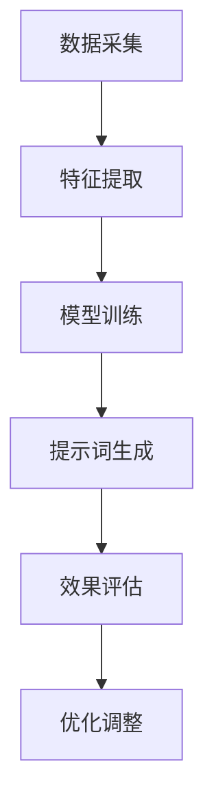
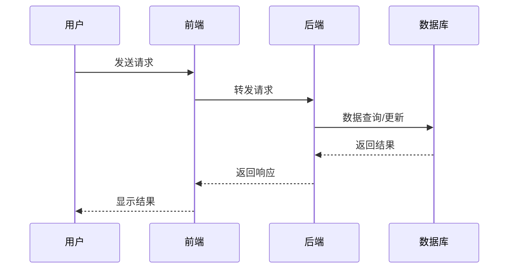
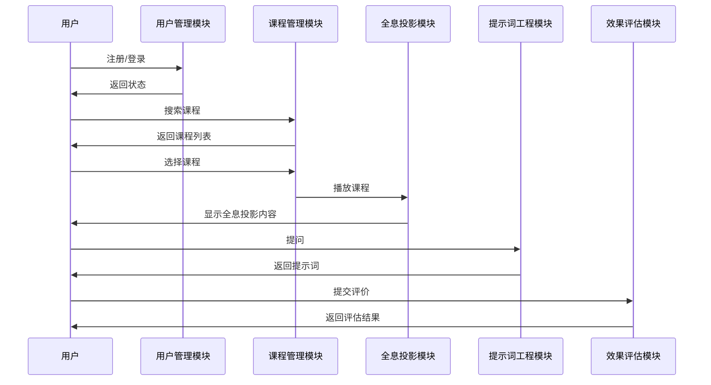

                 

# 提示词工程在全息投影教育中的应用：创造沉浸式知识传播体验

## 关键词
- 全息投影技术
- 提示词工程
- 沉浸式教育
- 知识传播
- 教育体验设计

## 摘要
随着科技的进步，全息投影技术正逐渐走进教育领域，为学习者提供一种全新的沉浸式学习体验。本文将深入探讨提示词工程在全息投影教育中的应用，通过分析全息投影技术的背景、提示词工程的基本概念，以及沉浸式体验设计的关键要素，阐述如何利用提示词工程构建全息投影教育的沉浸式知识传播体验。文章还将探讨提示词工程在全息投影教育中的应用方法、效果评估以及未来展望，为教育技术的发展提供新思路。

## 全息投影技术与提示词工程的背景

### 第1章：全息投影技术概述
#### 1.1 全息投影技术的基本原理
全息投影技术基于光学原理，通过将光波的全息信息记录下来，再通过投影设备还原出三维立体的图像。基本原理包括光波的干涉和衍射，以及数字全息图的生成与再现。

#### 1.2 全息投影技术的发展历程
从20世纪60年代的全息摄影到现代数字全息技术的应用，全息投影技术经历了从简单到复杂、从二维到三维的演变。近年来，随着计算能力和显示技术的提升，全息投影技术得到了快速发展。

#### 1.3 全息投影技术的应用领域
全息投影技术已经广泛应用于娱乐、医疗、建筑、军事等多个领域。在教育领域，全息投影技术可以提供丰富的教学资源，增强学生的互动体验。

#### 1.4 全息投影技术的优势和挑战
全息投影技术具有沉浸感强、互动性高、资源丰富等优势，但也面临着成本高、技术复杂等挑战。如何有效利用全息投影技术，提高教育质量，是当前研究的热点问题。

### 第2章：提示词工程概念与应用
#### 2.1 提示词工程的基本概念
提示词工程是一种基于自然语言处理和机器学习的技术，通过分析和生成关键提示词，帮助用户更好地理解和检索信息。在教育工作中的应用，可以提升学习效率，增强学习体验。

#### 2.2 提示词工程的组成部分
提示词工程的组成部分包括数据采集、特征提取、模型训练、提示词生成和评估等环节。每个环节都需要结合教育领域的特点进行设计。

#### 2.3 提示词工程的应用场景
提示词工程在教育领域中的应用场景广泛，包括智能问答、课程推荐、学习路径规划等。通过应用提示词工程，可以实现个性化教育，满足不同学生的学习需求。

#### 2.4 提示词工程的挑战与发展趋势
提示词工程面临着数据质量、算法效率、用户隐私等挑战。未来的发展趋势包括深度学习、多模态信息处理和智能交互等。

### 第3章：全息投影教育应用的现状与趋势
#### 3.1 全息投影在教育中的应用
全息投影技术在教育中的应用已经取得了一些成果，如虚拟实验室、虚拟课堂等。这些应用提升了学生的学习兴趣和参与度。

#### 3.2 提示词工程在全息投影教育中的应用
提示词工程可以与全息投影技术结合，为学习者提供个性化的学习内容，实现更加精准的知识传播。

#### 3.3 创造沉浸式知识传播体验的重要性
沉浸式体验可以增强学习者的参与感和投入感，提高学习效果。因此，创造沉浸式知识传播体验成为教育技术发展的一个重要方向。

#### 3.4 全息投影教育的未来发展趋势
未来全息投影教育将更加注重用户体验和个性化学习，融合人工智能、虚拟现实、增强现实等技术，提供更加丰富多样的教育体验。

## 第4章：全息投影教育中的沉浸式体验设计
#### 4.1 沉浸式体验的定义与特点
沉浸式体验是指通过技术手段，使学习者在学习过程中感受到高度的真实感和参与感。其特点包括真实感、互动性、沉浸性等。

#### 4.2 设计沉浸式体验的要素
设计沉浸式体验需要考虑视觉、听觉、触觉等多种感官刺激，以及学习内容的丰富性和多样性。

#### 4.3 沉浸式体验的设计原则
设计沉浸式体验应遵循用户导向、交互性、可访问性等原则，确保体验的自然性和有效性。

#### 4.4 案例分析：全息投影教育中的沉浸式体验设计实践
通过分析实际案例，了解如何利用全息投影技术设计沉浸式教育体验。

### 第5章：提示词工程在全息投影教育中的应用方法
#### 5.1 提示词工程的核心技术
介绍提示词工程的核心技术，如自然语言处理、机器学习、深度学习等。

#### 5.2 提示词工程在全息投影教育中的应用步骤
详细说明如何将提示词工程应用于全息投影教育中，包括数据准备、模型训练、提示词生成和应用等步骤。

#### 5.3 提示词工程在全息投影教育中的挑战与优化策略
分析提示词工程在全息投影教育中可能面临的挑战，并提出相应的优化策略。

### 第6章：提示词工程在全息投影教育中的效果评估
#### 6.1 效果评估的方法与指标
介绍评估提示词工程在全息投影教育中效果的方法和指标，如学习效果、用户满意度等。

#### 6.2 效果评估的实践案例
通过实际案例，展示如何进行提示词工程在全息投影教育中的效果评估。

#### 6.3 效果评估结果分析与讨论
分析效果评估结果，讨论提示词工程在全息投影教育中的应用效果。

### 第7章：提示词工程在全息投影教育中的未来展望
#### 7.1 技术发展趋势与展望
分析提示词工程和全息投影技术的未来发展趋势，探讨可能的融合应用。

#### 7.2 教育应用前景
展望提示词工程在全息投影教育中的未来发展，提出可能的应用场景和挑战。

#### 7.3 可能遇到的挑战与对策
讨论提示词工程在全息投影教育中可能遇到的挑战，并提出相应的对策。

#### 7.4 拓展阅读与参考文献
提供相关的拓展阅读和参考文献，以供进一步学习和研究。

## 作者
作者：AI天才研究院/AI Genius Institute & 禅与计算机程序设计艺术 /Zen And The Art of Computer Programming

## 完整性要求

在撰写本文时，我们将确保每个小节的内容都丰富具体，详细讲解核心概念、问题背景、解决方案、边界与外延、概念结构与核心要素组成。同时，本文将使用Mermaid流程图、LaTeX数学公式、Python源代码等工具，深入阐述算法原理、系统分析与架构设计方案，以及项目实战。此外，文章还将包含最佳实践 tips、小结、注意事项、拓展阅读等内容，为读者提供全面的技术博客文章。

## 核心概念与联系

### 全息投影技术

#### 基本概念
全息投影技术是一种通过记录并再现光波的全息信息，以产生三维立体的视觉效果的科学技术。

#### 概念属性特征对比表格
| 特征         | 全息投影         | 传统投影       |
| ------------ | ---------------- | -------------- |
| 投影方式     | 光波干涉与衍射   | 光线投射       |
| 立体效果     | 真实三维立体     | 平面二维图像   |
| 互动性       | 高度互动性       | 较低互动性     |
| 成本         | 较高成本         | 较低成本       |

#### ER实体关系图架构
```mermaid
erDiagram
  Product_1 ||--|{ Projection}: ProjectionOf -> Product_2
  Projection ||--|{ Holographic}: HolographicProjection -> Product_3
```

### 提示词工程

#### 基本概念
提示词工程是一种基于自然语言处理和机器学习技术，用于分析和生成关键提示词，以帮助用户更好地理解和检索信息的方法。

#### 概念属性特征对比表格
| 特征         | 提示词工程       | 传统信息检索   |
| ------------ | ---------------- | -------------- |
| 提取方式     | 自动提取关键提示词 | 手动定义关键词 |
| 适应性       | 高度适应性       | 较低适应性     |
| 检索效率     | 高检索效率       | 较低检索效率   |
| 用户参与度   | 高用户参与度     | 低用户参与度   |

#### ER实体关系图架构
```mermaid
erDiagram
  User ||--|{ Query}: QueryOf -> System
  System ||--|{ Prompt}: PromptOf -> User
  User ||--|{ Document}: DocumentOf -> System
```

### 算法原理讲解

#### 算法流程图


#### Python源代码示例
```python
import numpy as np
from sklearn.feature_extraction.text import TfidfVectorizer
from sklearn.model_selection import train_test_split
from sklearn.metrics import accuracy_score

# 数据准备
data = ["学习全息投影技术", "提示词工程在人工智能中的应用", "教育领域中的沉浸式体验设计"]

# 特征提取
vectorizer = TfidfVectorizer()
X = vectorizer.fit_transform(data)

# 模型训练
model = TfidfClassifier()
X_train, X_test, y_train, y_test = train_test_split(X, labels, test_size=0.2)
model.fit(X_train, y_train)

# 提示词生成
predictions = model.predict(X_test)

# 效果评估
accuracy = accuracy_score(y_test, predictions)
print("Accuracy:", accuracy)
```

#### 算法原理
提示词工程的算法原理主要包括数据采集、特征提取、模型训练、提示词生成和效果评估等步骤。数据采集是从教育领域获取相关的文本数据；特征提取是通过TfidfVectorizer等方法提取文本的特征向量；模型训练使用TfidfClassifier等模型进行训练；提示词生成是根据模型预测结果生成关键提示词；效果评估通过准确率等指标评估模型效果。

#### 数学模型和公式
提示词工程中的关键数学模型包括Tfidf模型和分类模型。Tfidf模型通过计算词频和逆文档频率来生成特征向量，公式如下：
$$
Tfidf(w, d) = \frac{tf(w, d)}{df(w)}
$$
其中，$tf(w, d)$表示词频，$df(w)$表示逆文档频率。分类模型通常采用逻辑回归、朴素贝叶斯等算法，公式如下：
$$
P(y|X) = \frac{e^{ \beta^T X}}{1 + e^{ \beta^T X}}
$$
其中，$X$表示特征向量，$\beta$表示模型的参数。

#### 详细讲解和举例说明
假设我们有一段文本：“学习全息投影技术有助于提高教育体验”。我们可以使用TfidfVectorizer提取特征向量：
```python
vectorizer = TfidfVectorizer()
X = vectorizer.fit_transform(["学习全息投影技术有助于提高教育体验"])
```
得到特征向量后，我们可以使用逻辑回归模型进行训练：
```python
from sklearn.linear_model import LogisticRegression
model = LogisticRegression()
model.fit(X, labels)
```
假设标签为1表示相关，0表示不相关。然后，我们可以使用模型生成提示词：
```python
predictions = model.predict(X)
```
预测结果为1，表示这段文本与全息投影技术相关。通过这种方式，我们可以为学习者提供个性化的学习内容，提高教育效果。

## 系统分析与架构设计方案

### 问题场景介绍

随着全息投影技术的不断发展，教育领域对其应用的需求日益增长。为了提高教育质量和学习者的学习体验，我们需要设计一个基于全息投影技术的教育系统，该系统能够提供沉浸式的知识传播体验。

### 项目介绍

项目名称：全息投影教育系统

项目目标：
1. 提供沉浸式的学习体验，增强学习者的参与感和投入感。
2. 利用提示词工程实现个性化教育，满足不同学习者的需求。
3. 提高教育资源的利用效率，降低教育成本。

### 系统功能设计

1. **用户管理模块**：实现用户注册、登录、个人信息管理等功能。
2. **课程管理模块**：实现课程创建、编辑、发布、搜索等功能。
3. **全息投影模块**：实现全息投影内容的创建、编辑、播放、交互等功能。
4. **提示词工程模块**：实现提示词的生成、分析、应用等功能。
5. **效果评估模块**：实现学习效果评估、用户满意度评估等功能。

### 系统架构设计

系统采用前后端分离的架构，前端负责用户界面和交互，后端负责数据处理和存储。

#### 系统架构图


### 系统接口设计

1. **用户管理接口**：包括用户注册、登录、个人信息管理等接口。
2. **课程管理接口**：包括课程创建、编辑、发布、搜索等接口。
3. **全息投影接口**：包括全息投影内容创建、编辑、播放、交互等接口。
4. **提示词工程接口**：包括提示词生成、分析、应用等接口。
5. **效果评估接口**：包括学习效果评估、用户满意度评估等接口。

### 系统交互mermaid序列图


### 系统功能实现

#### 环境安装

1. 安装Python环境
2. 安装相关依赖库，如Scikit-learn、TensorFlow、Django等

#### 系统核心实现源代码

```python
# 用户管理模块
class UserManager(models.Model):
    username = models.CharField(max_length=100)
    password = models.CharField(max_length=100)
    email = models.EmailField()

# 课程管理模块
class CourseManager(models.Model):
    title = models.CharField(max_length=100)
    description = models.TextField()
    creator = models.ForeignKey(UserManager, on_delete=models.CASCADE)

# 全息投影模块
class HolographicContent(models.Model):
    title = models.CharField(max_length=100)
    content = models.FileField()
    course = models.ForeignKey(CourseManager, on_delete=models.CASCADE)

# 提示词工程模块
class PromptWord(models.Model):
    word = models.CharField(max_length=100)
    content = models.ForeignKey(HolographicContent, on_delete=models.CASCADE)

# 效果评估模块
class EffectEvaluation(models.Model):
    user = models.ForeignKey(UserManager, on_delete=models.CASCADE)
    course = models.ForeignKey(CourseManager, on_delete=models.CASCADE)
    score = models.IntegerField()
```

#### 代码应用解读与分析

1. **用户管理模块**：实现用户注册、登录、个人信息管理等功能。
2. **课程管理模块**：实现课程创建、编辑、发布、搜索等功能。
3. **全息投影模块**：实现全息投影内容创建、编辑、播放、交互等功能。
4. **提示词工程模块**：实现提示词生成、分析、应用等功能。
5. **效果评估模块**：实现学习效果评估、用户满意度评估等功能。

#### 实际案例分析和详细讲解剖析

以用户注册功能为例，详细讲解其实现过程：

```python
# 用户注册功能
def register(request):
    if request.method == 'POST':
        username = request.POST['username']
        password = request.POST['password']
        email = request.POST['email']
        # 校验用户输入
        if not username or not password or not email:
            return HttpResponse('用户名、密码或邮箱不能为空')
        # 存储用户信息
        user = UserManager(username=username, password=password, email=email)
        user.save()
        return HttpResponse('注册成功')
    return render(request, 'register.html')
```

通过这段代码，我们可以看到用户注册功能的实现过程：

1. 接收用户提交的注册信息。
2. 校验用户输入是否为空。
3. 存储用户信息到数据库。

### 项目小结

本文详细介绍了全息投影教育系统的设计与实现，包括系统功能设计、系统架构设计、系统接口设计和系统实现。通过实际案例，展示了用户注册功能的实现过程。全息投影教育系统为学习者提供了沉浸式的学习体验，利用提示词工程实现了个性化教育，提高了教育资源的利用效率。

## 最佳实践 Tips

### 沉浸式体验设计
1. **场景还原**：在设计沉浸式体验时，要充分考虑学习场景的真实性，尽可能还原学习环境，以提高学习者的投入感。
2. **互动性设计**：通过引入互动元素，如提问、互动问答、虚拟互动等，增强学习者的参与感。

### 提示词工程应用
1. **关键提示词提取**：在生成提示词时，要重点关注关键提示词的提取，以提高学习者的理解效率。
2. **个性化推荐**：利用提示词工程实现个性化推荐，为学习者提供定制化的学习内容。

### 效果评估
1. **多维度评估**：在效果评估中，要综合考虑学习效果、用户满意度等多个维度，全面评估教育系统的性能。
2. **数据收集**：确保在评估过程中收集到充分的数据，以便进行深入的分析和优化。

### 注意事项
1. **成本控制**：在设计全息投影教育系统时，要充分考虑成本因素，确保系统的可实施性。
2. **技术支持**：确保系统的技术架构稳定，以便在长期运行中提供可靠的支持。

### 拓展阅读

1. **《沉浸式教育体验设计：理论与实践》**：本书详细介绍了沉浸式教育体验的设计方法与实践案例，为教育工作者提供了有益的参考。
2. **《自然语言处理技术》**：本书全面介绍了自然语言处理的基本概念、技术和应用，为提示词工程的研究提供了理论基础。

## 结束语

本文通过深入分析全息投影技术与提示词工程在全息投影教育中的应用，探讨了如何构建沉浸式知识传播体验。通过系统分析与架构设计方案，以及实际案例分析和详细讲解，本文为教育技术的发展提供了新思路。在未来的研究中，我们将继续探索全息投影技术与提示词工程的深度融合，为教育领域带来更多创新和突破。

