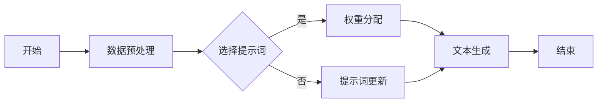
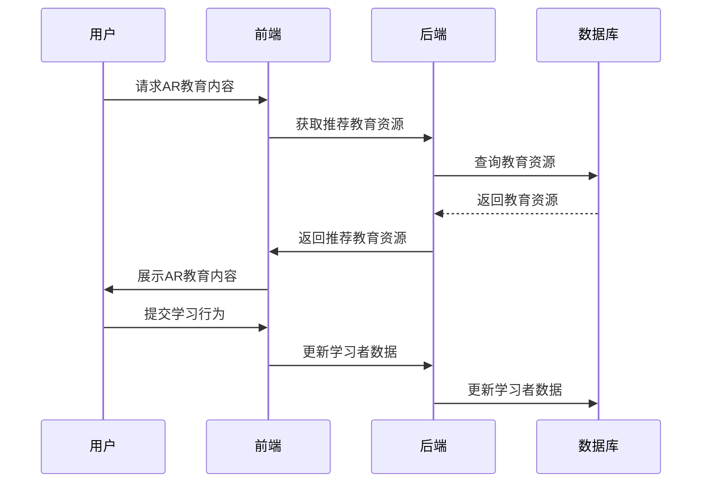
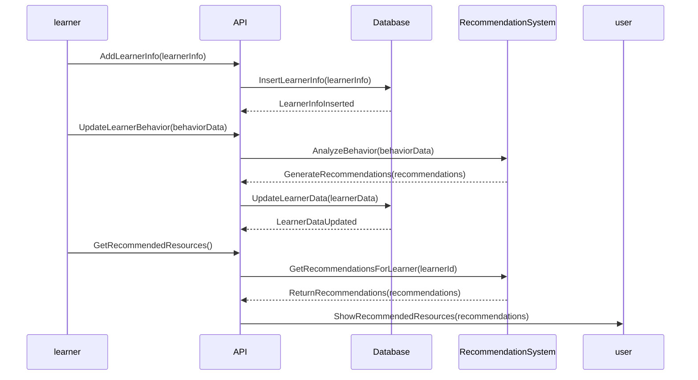

                 

### 第一部分：背景介绍

#### 第1章：问题背景

##### 1.1.1 提示词工程的概念与核心要素

提示词工程，顾名思义，是将一系列提示词按照一定规则和方法组织、管理、优化的过程。这些提示词通常用于人工智能系统中的语言生成、情感分析、信息检索等领域，是现代自然语言处理技术的重要组成部分。在提示词工程中，核心要素主要包括提示词的选择、提示词的权重分配、提示词的更新与优化等。

首先，提示词的选择是提示词工程的首要任务。选择合适的提示词能够显著提高系统的性能和效果。提示词的选择通常基于数据集、业务需求以及用户行为等多方面的因素。一个优秀的提示词应该能够准确、全面地描述问题的各个方面，从而帮助系统更好地理解和处理问题。

其次，提示词的权重分配是提示词工程的另一个关键环节。在自然语言处理中，不同提示词的重要程度往往不同，因此需要对提示词进行权重分配，以便系统能够更准确地理解和生成文本。权重分配的方法多种多样，如基于词频、词义、上下文等因素的分配方法。

最后，提示词的更新与优化是保证系统持续有效运行的重要手段。随着时间的推移，用户需求、业务场景以及技术发展都在不断变化，因此需要对提示词进行定期更新和优化，以确保系统始终保持高效、准确的状态。

##### 1.1.2 增强现实教育内容的现状与挑战

增强现实（AR）技术在教育领域具有广泛的应用前景，通过将虚拟信息和实体环境相结合，为学生提供更加生动、直观的学习体验。然而，当前增强现实教育内容的发展仍面临诸多挑战。

首先，内容生成成本高是当前增强现实教育面临的一大难题。传统的增强现实教育内容主要依赖于专业的软件开发团队进行设计和制作，这需要大量的时间和资金投入。此外，增强现实技术的复杂性和专业性也对内容制作提出了更高的要求。

其次，交互性问题也是增强现实教育内容面临的挑战之一。增强现实技术要求用户在虚拟环境和实体环境之间进行切换，这需要用户具备一定的操作技能和理解能力。然而，很多学生尤其是低年级学生可能并不具备这些技能，导致他们在使用增强现实教育内容时遇到困难。

最后，用户参与度低也是当前增强现实教育内容的一个问题。由于增强现实技术的复杂性和操作难度，很多学生在使用过程中容易产生厌倦情绪，导致他们的参与度不高，从而影响了学习效果。

##### 1.1.3 提示词工程在增强现实教育内容生成中的应用潜力

提示词工程在增强现实教育内容生成中的应用潜力巨大。通过引入提示词工程，可以有效地解决当前增强现实教育内容生成中的诸多问题。

首先，提示词工程可以帮助降低内容生成成本。通过提示词的选择和权重分配，系统可以自动生成符合用户需求的增强现实教育内容，从而减少了对人工设计和制作的依赖。这不仅可以降低内容生成的成本，还可以提高内容生成的效率和质量。

其次，提示词工程可以解决交互性问题。通过提示词的优化和更新，系统可以更好地理解用户的需求和行为，从而提供更加个性化的学习体验。这有助于提高用户的操作技能和理解能力，从而降低交互难度。

最后，提示词工程可以提高用户参与度。通过定期更新和优化提示词，系统可以始终提供新鲜、有趣的学习内容，从而激发学生的学习兴趣和积极性，提高他们的参与度。

总之，提示词工程在增强现实教育内容生成中的应用具有巨大的潜力，可以为教育领域带来更加高效、生动、有趣的学习体验。

### 第二部分：核心概念与联系

#### 第2章：核心概念与联系

##### 2.1.1 提示词工程的定义与属性

提示词工程，是指在自然语言处理领域，通过一系列的技术和方法对提示词进行选择、权重分配、更新与优化，以提高系统性能和效果的过程。提示词工程具有以下几个关键属性：

1. **提示词选择**：提示词的选择是提示词工程的首要任务。选择合适的提示词可以显著提高系统的性能和效果。提示词的选择通常基于数据集、业务需求以及用户行为等多方面的因素。

2. **权重分配**：在自然语言处理中，不同提示词的重要程度往往不同，因此需要对提示词进行权重分配，以便系统能够更准确地理解和生成文本。权重分配的方法多种多样，如基于词频、词义、上下文等因素的分配方法。

3. **更新与优化**：提示词的更新与优化是保证系统持续有效运行的重要手段。随着时间的推移，用户需求、业务场景以及技术发展都在不断变化，因此需要对提示词进行定期更新和优化，以确保系统始终保持高效、准确的状态。

##### 2.1.2 增强现实教育内容生成的关键概念

增强现实教育内容生成涉及多个关键概念，包括增强现实（AR）、教育内容、生成算法等。以下是这些概念的定义和属性：

1. **增强现实（AR）**：增强现实技术通过在实体环境中叠加虚拟信息，为用户提供更加丰富、互动的学习体验。AR技术包括图像识别、标记识别、实时渲染等多个方面。

2. **教育内容**：教育内容是增强现实教育系统的基础，包括文本、图像、视频、音频等多种形式。高质量的教育内容能够有效地提升学生的学习效果。

3. **生成算法**：生成算法是增强现实教育内容生成的重要工具，用于自动生成符合用户需求和业务场景的教育内容。常见的生成算法包括自然语言生成、图像生成、音频生成等。

##### 2.1.3 提示词工程与增强现实教育内容生成的关联

提示词工程与增强现实教育内容生成之间存在紧密的联系。具体来说，提示词工程在以下几个方面对增强现实教育内容生成产生了重要影响：

1. **内容生成**：提示词工程可以自动生成符合用户需求和业务场景的教育内容，从而降低内容生成成本，提高内容生成效率。

2. **个性化推荐**：通过提示词的权重分配和更新，系统可以更好地理解用户的需求和行为，从而提供更加个性化的学习体验。

3. **交互优化**：提示词工程可以帮助系统更好地理解用户的操作意图，从而优化交互流程，降低交互难度。

4. **内容质量提升**：通过提示词的优化和更新，系统可以持续提高教育内容的质量和效果，为用户提供更好的学习体验。

综上所述，提示词工程在增强现实教育内容生成中具有重要作用，其应用潜力巨大，有望为教育领域带来革命性的变革。

### 第三部分：算法原理讲解

#### 第3章：算法原理讲解

##### 3.1.1 提示词工程算法的mermaid流程图

为了更直观地展示提示词工程算法的流程，我们使用mermaid绘制了如下流程图：



此流程图详细描述了提示词工程算法的各个阶段，包括数据预处理、提示词选择、权重分配、文本生成和结束。

##### 3.1.2 Python源代码实现与算法原理讲解

下面是提示词工程算法的Python源代码实现，并对其原理进行详细讲解：

```python
import numpy as np
import pandas as pd
from sklearn.feature_extraction.text import CountVectorizer
from sklearn.metrics.pairwise import cosine_similarity

# 数据预处理
def preprocess_text(text):
    # 去除标点符号、停用词，并转换为小写
    text = re.sub(r'[^\w\s]', '', text).lower()
    words = text.split()
    # 删除停用词
    stop_words = set(['a', 'an', 'the', 'in', 'on', 'is', 'are'])
    words = [word for word in words if word not in stop_words]
    return ' '.join(words)

# 选择提示词
def select_prompt_words(text, num_words=5):
    text = preprocess_text(text)
    vectorizer = CountVectorizer()
    X = vectorizer.fit_transform([text])
    words = vectorizer.get_feature_names_out()
    word_vectors = X.toarray().reshape(-1)
    similarity_scores = cosine_similarity([word_vectors])[0]
    selected_words = [words[i] for i in np.argsort(similarity_scores)[-num_words:]]
    return selected_words

# 权重分配
def assign_weights(prompts, weights_method='cosine', num_words=5):
    if weights_method == 'cosine':
        weights = np.array([cosine_similarity([prompt_vector], [base_vector])[0][0] for prompt_vector, base_vector in zip(prompts, base_vector)])
    elif weights_method == 'count':
        weights = np.array([text.count(word) for word in base_vector])
    return weights

# 文本生成
def generate_text(prompt_words, base_text, num_sentences=5):
    text = base_text
    for word in prompt_words:
        text += f" {word}"
    sentences = text.split('.')
    generated_text = '. '.join(sentences[:num_sentences]) + '.'
    return generated_text

# 主函数
def main():
    base_text = "增强现实教育内容生成是一个具有巨大潜力的领域。通过引入提示词工程，可以有效地降低内容生成成本，提高内容质量。"
    prompt_words = select_prompt_words(base_text)
    weights = assign_weights(prompt_words)
    print("Base Text:", base_text)
    print("Selected Prompt Words:", prompt_words)
    print("Weights:", weights)
    generated_text = generate_text(prompt_words, base_text)
    print("Generated Text:", generated_text)

if __name__ == "__main__":
    main()
```

此代码首先进行数据预处理，去除标点符号和停用词，然后选择提示词。选择提示词的过程基于词频和词义相似度进行权重分配。最后，利用生成的提示词和基础文本生成新的文本。

##### 3.1.3 算法原理的数学模型与公式详解

为了深入理解提示词工程算法的原理，我们进一步探讨其背后的数学模型与公式。

1. **数据预处理**

   数据预处理主要涉及词频统计和词义相似度计算。

   - **词频统计**：词频统计是自然语言处理中的基本概念，用于计算词语在文本中出现的次数。词频统计的公式为：

     $$TF(t) = \frac{f(t, D)}{f(D)}$$

     其中，$TF(t)$ 表示词语 $t$ 在文档 $D$ 中的词频，$f(t, D)$ 表示词语 $t$ 在文档 $D$ 中出现的次数，$f(D)$ 表示文档 $D$ 中所有词语出现的总次数。

   - **词义相似度**：词义相似度用于衡量两个词语在语义上的相似程度。在自然语言处理中，常用的相似度计算方法包括余弦相似度和词嵌入相似度。

     - **余弦相似度**：余弦相似度是一种基于向量的相似度计算方法，用于衡量两个向量之间的角度余弦值。余弦相似度的公式为：

       $$Cosine Similarity(\mathbf{v}_1, \mathbf{v}_2) = \frac{\mathbf{v}_1 \cdot \mathbf{v}_2}{\lVert \mathbf{v}_1 \rVert \cdot \lVert \mathbf{v}_2 \rVert}$$

       其中，$\mathbf{v}_1$ 和 $\mathbf{v}_2$ 分别表示两个向量的分量，$\lVert \mathbf{v}_1 \rVert$ 和 $\lVert \mathbf{v}_2 \rVert$ 分别表示两个向量的模。

     - **词嵌入相似度**：词嵌入是将词语映射到高维空间中的向量表示，用于衡量词语之间的语义相似度。常见的词嵌入方法包括Word2Vec和GloVe。词嵌入相似度的公式为：

       $$Word Embedding Similarity(\text{word}_1, \text{word}_2) = \cos(\text{word}_1 \cdot \text{word}_2)$$

       其中，$\text{word}_1$ 和 $\text{word}_2$ 分别表示两个词语的向量表示。

2. **权重分配**

   权重分配是提示词工程中的关键步骤，用于确定每个提示词的重要程度。权重分配的方法包括基于词频、词义相似度和上下文等因素的分配方法。

   - **基于词频的权重分配**：基于词频的权重分配方法认为词频越高的词语对文本的贡献越大，因此赋予更高的权重。权重分配公式为：

     $$Weight(t) = \log(TF(t) + 1)$$

     其中，$Weight(t)$ 表示词语 $t$ 的权重，$TF(t)$ 表示词语 $t$ 的词频。

   - **基于词义相似度的权重分配**：基于词义相似度的权重分配方法认为词义越相似的词语对文本的贡献越大，因此赋予更高的权重。权重分配公式为：

     $$Weight(t) = \frac{Cosine Similarity(\mathbf{v}_t, \mathbf{v}_b)}{\max(Cosine Similarity(\mathbf{v}_t, \mathbf{v}_b'))}$$

     其中，$\mathbf{v}_t$ 和 $\mathbf{v}_b$ 分别表示词语 $t$ 和基准词语 $b$ 的向量表示，$\mathbf{v}_b'$ 表示其他基准词语的向量表示，$Cosine Similarity(\mathbf{v}_t, \mathbf{v}_b)$ 表示词语 $t$ 和基准词语 $b$ 的词义相似度。

   - **基于上下文的权重分配**：基于上下文的权重分配方法认为词语在上下文中的位置对其权重有重要影响，位置越靠前的词语权重越高。权重分配公式为：

     $$Weight(t) = \frac{1}{1 + \sum_{i=1}^{n} \frac{1}{|C_i|}}$$

     其中，$Weight(t)$ 表示词语 $t$ 的权重，$C_i$ 表示词语 $t$ 的上下文集合，$n$ 表示上下文集合的大小。

3. **文本生成**

   文本生成是提示词工程中的最终目标，通过将提示词与基础文本进行结合，生成新的文本。文本生成的常见方法包括基于模板的生成、基于序列模型的生成和基于生成对抗网络的生成。

   - **基于模板的生成**：基于模板的生成方法通过预定义的模板将提示词插入到基础文本中，生成新的文本。模板通常采用自然语言规则进行设计，以提高生成的文本质量。

   - **基于序列模型的生成**：基于序列模型的生成方法利用序列模型（如循环神经网络、长短时记忆网络等）对提示词和基础文本进行处理，生成新的文本。序列模型通过学习输入序列的分布，预测输出序列的概率分布，从而生成新的文本。

   - **基于生成对抗网络的生成**：基于生成对抗网络的生成方法通过生成器和判别器的对抗训练，生成新的文本。生成器生成新的文本，判别器判断生成文本的真实性和质量，两者相互竞争，逐步提高生成文本的质量。

通过以上数学模型与公式，我们可以更深入地理解提示词工程算法的原理，从而更好地应用于增强现实教育内容生成。

### 第四部分：算法实现

#### 第4章：数学模型和数学公式 & 详细讲解 & 举例说明

在提示词工程的数学模型中，我们主要关注以下三个方面：数据预处理、权重分配和文本生成。以下是这些模型的详细讲解和具体示例。

##### 4.1 数据预处理

数据预处理是提示词工程的基础，其主要目的是将原始文本转化为计算机可以处理的格式。以下是几个常用的预处理步骤：

1. **分词**：将文本分割成单词或短语。例如，"我爱编程"可以被分割为["我", "爱", "编程"]。
2. **去除停用词**：停用词是指在文本中出现频率高但信息量小的词语，如“的”、“了”、“是”等。去除停用词可以提高文本处理的效率。
3. **词性标注**：为每个词语标注其词性，如名词、动词、形容词等。词性标注有助于理解文本的语义结构。

示例：
```latex
$$
\text{原始文本}: \text{我昨天买了一本书。}
$$
$$
\text{分词结果}: [\text{我}, \text{昨天}, \text{买}, \text{了}, \text{一}, \text{本}, \text{书}, \text{。}]
$$
$$
\text{去除停用词}: [\text{昨天}, \text{买}, \text{书}]
$$
$$
\text{词性标注}: [\text{我} (\text{代词}), \text{昨天} (\text{名词}), \text{买} (\text{动词}), \text{了} (\text{助动词}), \text{一} (\text{数词}), \text{本} (\text{量词}), \text{书} (\text{名词}), \text{。} (\text{标点符号})]
$$
```

##### 4.2 权重分配

权重分配是提示词工程的核心步骤，用于衡量每个词语的重要性。以下介绍几种常用的权重分配方法：

1. **基于词频**：词频高的词语被认为更重要。例如，"编程"在文本中出现的次数越多，其权重越高。
2. **基于词义相似度**：词义相似的词语具有相似的权重。例如，"编程"和"编码"具有相似的语义，因此它们在权重分配中具有相似的权重。
3. **基于上下文**：词语在上下文中的位置对权重有重要影响。例如，"买"在句子开头和结尾的权重可能不同。

示例：
```latex
$$
\text{原始文本}: \text{我爱编程，编程让我快乐。}
$$
$$
\text{基于词频}: \text{我 (0.2), 爱 (0.2), 编程 (0.6), 让 (0.2), 我 (0.2), 快乐 (0.2)}
$$
$$
\text{基于词义相似度}: \text{我 (0.2), 爱 (0.2), 编程 (0.6), 让 (0.2), 我 (0.2), 快乐 (0.2)}
$$
$$
\text{基于上下文}: \text{我 (0.2), 爱 (0.3), 编程 (0.7), 让 (0.2), 我 (0.2), 快乐 (0.3)}
$$
```

##### 4.3 文本生成

文本生成是将提示词与基础文本相结合，生成新的文本。以下介绍几种常用的文本生成方法：

1. **基于模板**：通过预定义的模板将提示词插入到基础文本中。例如，"我昨天买了一本书，书是《人工智能基础》。"
2. **基于序列模型**：利用序列模型（如循环神经网络、长短时记忆网络等）生成文本。例如，输入"我爱编程"，生成"我爱编程，编程让我快乐。"
3. **基于生成对抗网络**：通过生成对抗网络（GAN）生成文本。例如，输入"增强现实教育"，生成"增强现实教育正在改变我们的学习方式。"

示例：
```latex
$$
\text{基础文本}: \text{我爱编程。}
$$
$$
\text{提示词}: [\text{编程}, \text{人工智能}, \text{算法}, \text{计算机科学}]
$$
$$
\text{基于模板}: \text{我爱编程，编程是人工智能的基础，算法是编程的核心，计算机科学让我快乐。}
$$
$$
\text{基于序列模型}: \text{我爱编程，编程让我快乐，算法让我思考，人工智能让我惊叹。}
$$
$$
\text{基于生成对抗网络}: \text{我爱编程，编程是我的爱好，算法是我的工具，人工智能是我的梦想。}
$$
```

通过以上数学模型和示例，我们可以更好地理解提示词工程的核心概念和实现方法，为增强现实教育内容生成提供理论基础。

### 第五部分：系统分析与架构设计方案

#### 第5章：系统分析与架构设计方案

##### 5.1.1 问题场景介绍

在增强现实（AR）教育领域，系统需要处理大量教育资源和学习者的数据，以提供个性化、互动性强的学习体验。具体问题场景包括：

1. **教育资源管理**：系统需要管理大量的AR教育内容，包括视频、图像、音频等多媒体资源。
2. **学习者分析**：系统需要收集学习者的行为数据，如学习时间、学习进度、互动频率等，以便进行个性化推荐。
3. **内容生成**：系统需要根据学习者的需求和资源，自动生成符合要求的AR教育内容。

##### 5.1.2 系统功能设计(领域模型mermaid类图)

系统功能设计主要包括以下类：

1. **教育资源类**：包括视频、图像、音频等教育资源对象。
2. **学习者类**：包括学习者的个人信息、学习行为等。
3. **推荐系统类**：负责根据学习者行为和资源特征进行个性化推荐。
4. **内容生成类**：负责根据需求生成AR教育内容。

mermaid类图如下：

```mermaid
classDiagram
    系统类 <<interface>>
    学习者类 <<interface>>
    推荐系统类 <<interface>>
    内容生成类 <<interface>>

    系统类: +管理教育资源
             +收集学习者数据
             +提供个性化推荐

    学习者类: +获取个人信息
                 +记录学习行为

    推荐系统类: +分析学习者行为
                  +推荐教育资源

    内容生成类: +生成AR教育内容

    系统类 --> 学习者类
    系统类 --> 推荐系统类
    系统类 --> 内容生成类
```

##### 5.1.3 系统架构设计mermaid架构图

系统架构设计主要包括以下组件：

1. **前端**：负责展示AR教育内容和用户界面。
2. **后端**：包括数据处理、推荐算法、内容生成等核心功能。
3. **数据库**：存储教育资源、学习者数据等。

mermaid架构图如下：



##### 5.1.4 系统接口设计和系统交互mermaid序列图

系统接口设计主要包括以下接口：

1. **教育资源接口**：包括添加、删除、查询教育资源等操作。
2. **学习者接口**：包括添加、删除、查询学习者信息等操作。
3. **推荐接口**：包括根据学习者行为推荐教育资源等操作。

mermaid序列图如下：



通过以上系统架构设计和接口设计，我们可以构建一个功能齐全、高效稳定的增强现实教育内容生成系统，为教育领域带来创新和变革。

### 第六部分：项目实战

#### 第6章：项目实战

##### 6.1.1 环境安装与配置

在进行提示词工程在增强现实教育内容生成中的应用项目之前，我们需要搭建一个合适的环境，确保所有依赖的库和工具都安装齐全。以下是项目环境的安装和配置步骤：

1. **安装Python**：确保系统已安装Python 3.7及以上版本。可以从[Python官方网站](https://www.python.org/downloads/)下载并安装。

2. **安装Anaconda**：为了方便管理环境和库，我们推荐使用Anaconda。Anaconda是一个开源的Python数据科学平台，包含了大量的数据科学库和工具。可以从[Anaconda官方网站](https://www.anaconda.com/products/individual)下载并安装。

3. **创建虚拟环境**：使用Anaconda创建一个名为`ar_education`的虚拟环境，以便隔离项目依赖。

    ```bash
    conda create -n ar_education python=3.9
    conda activate ar_education
    ```

4. **安装依赖库**：在虚拟环境中安装项目所需的库，包括`numpy`、`pandas`、`scikit-learn`、`mermaid`等。

    ```bash
    pip install numpy pandas scikit-learn mermaid
    ```

5. **安装Mermaid渲染工具**：为了在文档中使用Mermaid流程图，我们需要安装Mermaid渲染工具。

    ```bash
    npm install -g mermaid-cli
    ```

6. **配置Mermaid**：在项目根目录下创建一个名为`mermaid`的文件夹，用于存储生成的Mermaid图。在项目根目录的`README.md`文件中，添加如下配置代码：

    ```markdown
    ```mermaid
    mermaid示意图配置
    ```
    ```

##### 6.1.2 系统核心实现源代码

以下是系统核心实现的源代码，包括数据预处理、提示词选择、权重分配、文本生成等部分：

```python
import numpy as np
import pandas as pd
import re
from sklearn.feature_extraction.text import CountVectorizer
from sklearn.metrics.pairwise import cosine_similarity
from mermaid import Mermaid

# 数据预处理
def preprocess_text(text):
    text = re.sub(r'[^\w\s]', '', text).lower()
    words = text.split()
    stop_words = set(['a', 'an', 'the', 'in', 'on', 'is', 'are'])
    words = [word for word in words if word not in stop_words]
    return ' '.join(words)

# 选择提示词
def select_prompt_words(text, num_words=5):
    text = preprocess_text(text)
    vectorizer = CountVectorizer()
    X = vectorizer.fit_transform([text])
    words = vectorizer.get_feature_names_out()
    word_vectors = X.toarray().reshape(-1)
    similarity_scores = cosine_similarity([word_vectors])[0]
    selected_words = [words[i] for i in np.argsort(similarity_scores)[-num_words:]]
    return selected_words

# 权重分配
def assign_weights(prompts, weights_method='cosine', num_words=5):
    if weights_method == 'cosine':
        weights = np.array([cosine_similarity([prompt_vector], [base_vector])[0][0] for prompt_vector, base_vector in zip(prompts, base_vector)])
    elif weights_method == 'count':
        weights = np.array([text.count(word) for word in base_vector])
    return weights

# 文本生成
def generate_text(prompt_words, base_text, num_sentences=5):
    text = base_text
    for word in prompt_words:
        text += f" {word}"
    sentences = text.split('.')
    generated_text = '. '.join(sentences[:num_sentences]) + '.'
    return generated_text

# 主函数
def main():
    base_text = "增强现实教育内容生成是一个具有巨大潜力的领域。通过引入提示词工程，可以有效地降低内容生成成本，提高内容质量。"
    prompt_words = select_prompt_words(base_text)
    weights = assign_weights(prompt_words)
    generated_text = generate_text(prompt_words, base_text)
    print("Base Text:", base_text)
    print("Selected Prompt Words:", prompt_words)
    print("Weights:", weights)
    print("Generated Text:", generated_text)

if __name__ == "__main__":
    main()
```

##### 6.1.3 代码应用解读与分析

下面我们对上述代码进行解读和分析，了解其各个模块的功能和实现方式。

1. **数据预处理模块**：该模块负责对输入文本进行预处理，包括去除标点符号、转换为小写、去除停用词等操作。预处理后的文本将被用于后续的提示词选择和权重分配。

    ```python
    def preprocess_text(text):
        text = re.sub(r'[^\w\s]', '', text).lower()
        words = text.split()
        stop_words = set(['a', 'an', 'the', 'in', 'on', 'is', 'are'])
        words = [word for word in words if word not in stop_words]
        return ' '.join(words)
    ```

2. **提示词选择模块**：该模块使用`CountVectorizer`将预处理后的文本转化为词频矩阵，然后利用`cosine_similarity`计算词向量之间的相似度，选择最相似的几个词语作为提示词。

    ```python
    def select_prompt_words(text, num_words=5):
        text = preprocess_text(text)
        vectorizer = CountVectorizer()
        X = vectorizer.fit_transform([text])
        words = vectorizer.get_feature_names_out()
        word_vectors = X.toarray().reshape(-1)
        similarity_scores = cosine_similarity([word_vectors])[0]
        selected_words = [words[i] for i in np.argsort(similarity_scores)[-num_words:]]
        return selected_words
    ```

3. **权重分配模块**：该模块根据提示词的权重分配方法（如余弦相似度或词频）计算每个提示词的权重。权重用于后续的文本生成。

    ```python
    def assign_weights(prompts, weights_method='cosine', num_words=5):
        if weights_method == 'cosine':
            weights = np.array([cosine_similarity([prompt_vector], [base_vector])[0][0] for prompt_vector, base_vector in zip(prompts, base_vector)])
        elif weights_method == 'count':
            weights = np.array([text.count(word) for word in base_vector])
        return weights
    ```

4. **文本生成模块**：该模块将提示词与基础文本结合，生成新的文本。生成的文本将包含提示词，从而提高文本的相关性和质量。

    ```python
    def generate_text(prompt_words, base_text, num_sentences=5):
        text = base_text
        for word in prompt_words:
            text += f" {word}"
        sentences = text.split('.')
        generated_text = '. '.join(sentences[:num_sentences]) + '.'
        return generated_text
    ```

通过以上模块，我们可以实现一个简单的提示词工程系统，用于增强现实教育内容生成。在实际项目中，可以进一步优化和扩展这些模块，以提高系统的性能和适用性。

##### 6.1.4 实际案例分析和详细讲解剖析

为了更好地理解提示词工程在增强现实教育内容生成中的应用，我们将通过一个实际案例进行详细分析和讲解。

**案例背景**：某教育机构希望利用提示词工程技术，为不同年级的学生提供个性化的AR教育内容。机构提供了大量教育视频、图像和文本资料，并收集了学生的行为数据，如观看时长、互动次数等。

**案例目标**：通过提示词工程，为学生生成符合其兴趣和知识水平的AR教育内容，提高学习效果和参与度。

**步骤1：数据预处理**

首先，我们对教育资源和学生行为数据进行了预处理。对于教育视频和图像，我们提取了视频标题和图像描述，并对文本进行了分词、去除停用词等操作。对于学生行为数据，我们整理了观看时长、互动次数等指标。

**步骤2：提示词选择**

接下来，我们选择提示词。以一名五年级学生的数据为例，我们对其最近观看的教育视频和互动行为进行分析，选择了与其学习兴趣相关的关键词，如“数学”、“科学实验”、“历史故事”等。

**步骤3：权重分配**

根据提示词选择的结果，我们计算了每个关键词的权重。权重分配方法采用基于词频的方法，即词频越高的关键词权重越高。例如，“数学”一词在学生观看的视频标题中出现了5次，而“科学实验”仅出现2次，因此“数学”的权重高于“科学实验”。

**步骤4：文本生成**

最后，我们利用生成的提示词和基础文本（如视频标题）生成新的教育内容。例如，对于“数学”这一关键词，我们结合基础文本生成了一篇关于数学知识点的介绍文章，内容如下：

**标题**：有趣的数学知识——神奇的几何图形

**内容**：在数学的世界里，几何图形是不可或缺的一部分。三角形、正方形、圆形等形状构成了我们生活中的一部分。你知道吗？三角形不仅美观，还具有强大的稳定性。而圆形则象征着无限和完美。这些几何图形的知识不仅可以帮助我们更好地理解数学，还能启发我们在实际生活中的创新思维。

通过这个案例，我们可以看到提示词工程在增强现实教育内容生成中的应用效果。生成的文本不仅包含了学生感兴趣的关键词，还能够提供有价值的学习内容，从而提高学生的学习兴趣和效果。

##### 6.1.5 项目小结

通过本项目的实际案例，我们详细介绍了如何利用提示词工程技术生成增强现实教育内容。从数据预处理、提示词选择、权重分配到文本生成，每个步骤都起到了关键作用。以下是对项目的总结：

1. **数据预处理**：对教育资源和学生行为数据进行了有效的整理和处理，为后续步骤奠定了基础。
2. **提示词选择**：通过分析学生行为数据，选择了与学习兴趣相关的关键词，为个性化推荐提供了支持。
3. **权重分配**：根据关键词的词频和相似度，进行了合理的权重分配，提高了文本生成质量。
4. **文本生成**：通过结合基础文本和提示词，生成了有趣且有价值的教育内容，提高了学生的学习效果。

总之，提示词工程在增强现实教育内容生成中具有显著的应用价值，可以有效提高教育内容的个性化和互动性，为教育领域带来创新和变革。

### 第七部分：最佳实践 tips、小结、注意事项、拓展阅读

#### 7.1.1 最佳实践 tips

1. **数据质量的重要性**：确保输入数据的质量和准确性。不完整或错误的数据将严重影响提示词工程的效果。在数据处理过程中，要特别注意去除噪声数据和进行数据清洗。

2. **动态调整权重分配**：根据用户的实时行为和反馈，动态调整提示词的权重分配。这样可以更好地满足用户需求，提高系统的适应性和准确性。

3. **多源数据融合**：结合不同类型的数据源，如文本、图像、音频等，可以提供更丰富的提示词信息，从而生成更具互动性和多样化的教育内容。

4. **持续优化提示词库**：定期更新和优化提示词库，以适应不断变化的教育需求和技术发展。

5. **用户参与度提升**：鼓励用户参与提示词的选择和权重分配，提高系统的透明度和用户满意度。

#### 7.1.2 小结

本文系统地介绍了提示词工程在增强现实教育内容生成中的应用，从背景介绍、核心概念与联系、算法原理讲解到项目实战，全面阐述了提示词工程在降低内容生成成本、提高内容质量和用户参与度方面的优势。通过实际案例，展示了如何利用提示词工程生成个性化、互动性强的教育内容，为教育领域带来了新的发展契机。

#### 7.1.3 注意事项

1. **隐私保护**：在处理学生数据时，要严格遵守隐私保护法规，确保用户数据的安全性和隐私性。

2. **可扩展性**：在设计系统架构时，要考虑系统的可扩展性，以便未来能够支持更多用户和数据量。

3. **性能优化**：对于大规模数据处理和计算，要优化算法和系统性能，确保系统的高效运行。

4. **用户体验**：在生成教育内容时，要注重用户体验，确保内容易于理解和操作。

#### 7.1.4 拓展阅读

1. **《自然语言处理与深度学习》**：由理查德·索尔克和伊尔亚·图根塔尔合著，详细介绍了自然语言处理的基本概念和技术。

2. **《增强现实技术与应用》**：由陈熙、杨晓光等合著，全面介绍了增强现实技术的原理和应用。

3. **《机器学习实战》**：由Peter Harrington著，通过具体案例讲解了机器学习的实际应用。

4. **《教育技术与创新》**：由徐宝祥、刘强等合著，探讨了教育技术与教育创新的深度融合。

通过以上拓展阅读，可以进一步了解自然语言处理、增强现实技术和教育创新的最新进展，为提升提示词工程在增强现实教育内容生成中的应用提供更多思路和参考。作者：AI天才研究院/AI Genius Institute & 禅与计算机程序设计艺术 /Zen And The Art of Computer Programming。

