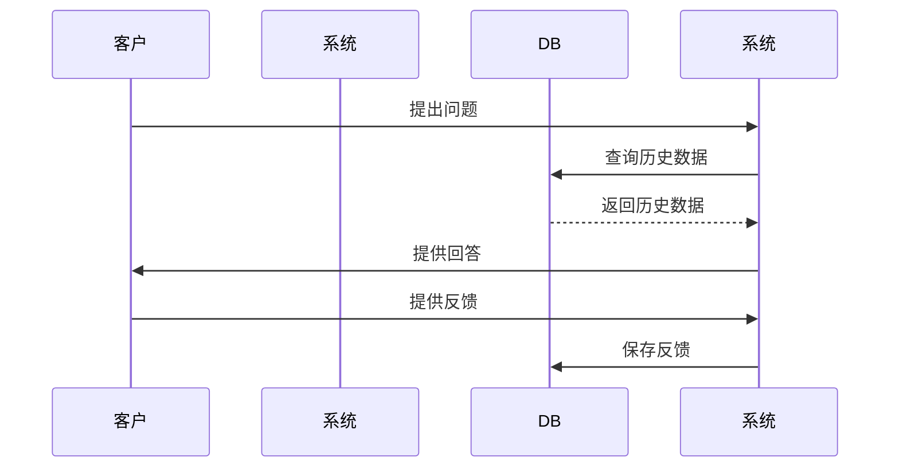
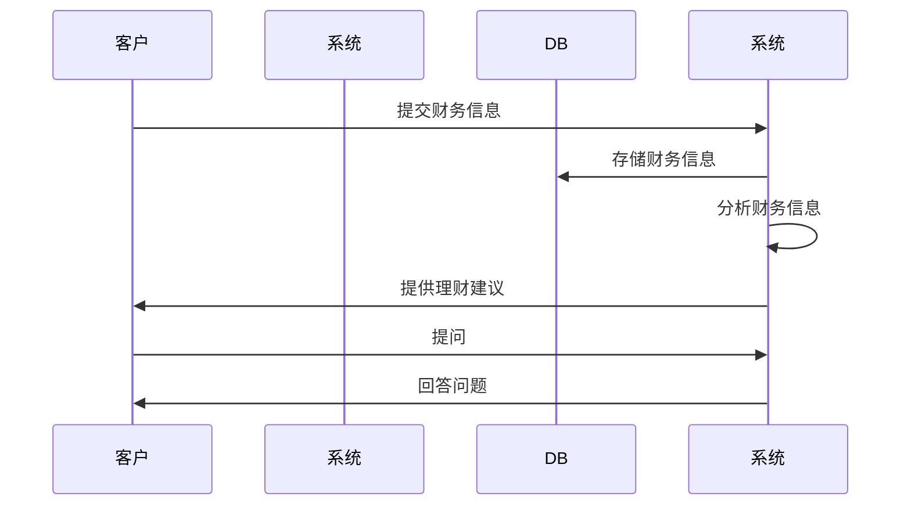

                 


## 引言与背景

### 问题背景

在当今快速发展的数字化时代，客户服务已经成为了企业竞争的关键因素。传统的客户服务模式往往依赖于人工，不仅效率低下，而且难以满足日益增长的客户期望。随着人工智能技术的不断进步，智能客户服务逐渐成为了企业提升客户体验和满意度的有力工具。在这一背景下，提示词工程（Prompt Engineering）作为一种新兴的技术手段，逐渐崭露头角，成为改善客户服务的重要手段之一。

### 问题描述

智能客户服务的核心挑战在于如何有效地利用人工智能技术，实现个性化、高效、精准的服务。具体来说，这些挑战包括：

1. **个性化服务**：如何根据客户的历史行为、偏好和需求，提供定制化的服务？
2. **高效处理**：如何在短时间内处理大量的客户咨询和请求，保持服务的连贯性和质量？
3. **精准回答**：如何确保机器生成的回答准确、可信，避免信息误导？
4. **用户体验**：如何提升客户在使用智能客户服务时的体验，使其感到愉悦和满意？

### 问题解决

提示词工程为上述挑战提供了一种系统化的解决方案。通过精心设计和优化的提示词，可以引导人工智能系统更好地理解和处理客户需求，从而实现以下目标：

1. **提高个性化服务水平**：通过设计个性化的提示词，系统能够更好地捕捉客户的需求和偏好，提供个性化的服务。
2. **提升处理效率**：通过优化提示词的长度、结构和逻辑，可以显著提高智能系统的处理速度和效率。
3. **确保回答准确性**：提示词的设计能够引导系统生成更准确、更可信的回答，减少信息误导的风险。
4. **增强用户体验**：优化的提示词可以提升客户的互动体验，使其在使用智能客户服务时感到更加舒适和满意。

### 边界与外延

提示词工程的应用不仅限于客户服务领域，还可以拓展到其他需要个性化交互的智能系统，如智能助理、虚拟客服等。同时，随着人工智能技术的不断进步，提示词工程也将不断发展，为智能客户服务带来更多的可能性。

### 概念结构与核心要素组成

提示词工程的核心概念和结构包括以下几个方面：

1. **提示词设计**：这是整个工程的基础，涉及提示词的长度、结构、内容等方面的设计。
2. **数据处理**：包括客户数据的收集、处理和分析，为提示词的设计提供数据支持。
3. **模型训练**：利用机器学习和自然语言处理技术，对提示词进行训练，使其能够更好地理解和生成回答。
4. **交互优化**：通过优化交互流程和界面设计，提升用户体验。
5. **效果评估**：对提示词工程的效果进行评估，包括个性化程度、处理效率、回答准确性等方面。

## 文章关键词

- 智能客户服务
- 提示词工程
- 用户体验
- 满意度
- 个性化服务

## 文章摘要

本文深入探讨了提示词工程在智能客户服务中的应用，旨在提升用户体验与满意度。通过分析智能客户服务的核心挑战，本文提出了提示词工程作为解决这些问题的有效手段。文章详细介绍了提示词工程的基本原理、应用场景、技术方法和用户体验优化策略。同时，通过实际案例和未来趋势分析，本文为读者提供了全面的指导和建议。## 第1章：智能客户服务与提示词工程

### 1.1 问题背景

智能客户服务是现代企业提升竞争力、满足客户需求的关键手段。随着互联网和移动互联网的普及，客户对服务的需求变得日益多样化和个性化。传统的客户服务模式往往依赖于人工，这种方式不仅效率低下，而且难以应对大规模客户咨询和请求。此外，人工客服在处理复杂问题和情感交流方面存在一定的局限性。为了解决这些问题，企业开始寻求新的解决方案，其中智能客户服务成为了一个热门话题。

智能客户服务是指利用人工智能技术，如自然语言处理（NLP）、机器学习（ML）等，提供高效、精准、个性化的客户服务。它包括智能聊天机器人、语音识别、智能问答系统等应用。智能客户服务的出现，不仅提高了客户服务的效率和准确性，还为企业节省了大量的人力成本。

### 1.2 问题描述

智能客户服务的核心挑战在于如何有效地利用人工智能技术，实现个性化、高效、精准的服务。具体来说，这些挑战包括：

1. **个性化服务**：如何根据客户的历史行为、偏好和需求，提供定制化的服务？这需要深入分析客户数据，构建个性化的服务策略。

2. **高效处理**：如何在短时间内处理大量的客户咨询和请求，保持服务的连贯性和质量？这需要优化系统性能，提高处理速度。

3. **精准回答**：如何确保机器生成的回答准确、可信，避免信息误导？这需要利用先进的自然语言处理和机器学习技术，提高回答的准确性。

4. **用户体验**：如何提升客户在使用智能客户服务时的体验，使其感到愉悦和满意？这需要优化交互流程和界面设计，提高用户的参与度和满意度。

### 1.3 问题解决

提示词工程为上述挑战提供了一种系统化的解决方案。通过精心设计和优化的提示词，可以引导人工智能系统更好地理解和处理客户需求，从而实现以下目标：

1. **提高个性化服务水平**：通过设计个性化的提示词，系统能够更好地捕捉客户的需求和偏好，提供个性化的服务。

2. **提升处理效率**：通过优化提示词的长度、结构和逻辑，可以显著提高智能系统的处理速度和效率。

3. **确保回答准确性**：提示词的设计能够引导系统生成更准确、更可信的回答，减少信息误导的风险。

4. **增强用户体验**：优化的提示词可以提升客户的互动体验，使其在使用智能客户服务时感到更加舒适和满意。

### 1.4 边界与外延

提示词工程的应用不仅限于客户服务领域，还可以拓展到其他需要个性化交互的智能系统，如智能助理、虚拟客服等。同时，随着人工智能技术的不断进步，提示词工程也将不断发展，为智能客户服务带来更多的可能性。

### 1.5 概念结构与核心要素组成

提示词工程的核心概念和结构包括以下几个方面：

1. **提示词设计**：这是整个工程的基础，涉及提示词的长度、结构、内容等方面的设计。

2. **数据处理**：包括客户数据的收集、处理和分析，为提示词的设计提供数据支持。

3. **模型训练**：利用机器学习和自然语言处理技术，对提示词进行训练，使其能够更好地理解和生成回答。

4. **交互优化**：通过优化交互流程和界面设计，提升用户体验。

5. **效果评估**：对提示词工程的效果进行评估，包括个性化程度、处理效率、回答准确性等方面。

### 1.6 小结

本章通过对智能客户服务背景的介绍，分析了其核心挑战，并提出了提示词工程作为解决这些问题的有效手段。接下来，我们将深入探讨提示词工程的基本原理、应用场景、技术方法和用户体验优化策略，为智能客户服务的发展提供全面的理论和实践指导。## 第2章：提示词工程的基本原理

### 2.1 提示词工程定义

提示词工程（Prompt Engineering）是一种系统化的方法，旨在设计和优化提示词，以引导人工智能系统更好地理解和处理人类语言。提示词是用于启动对话或请求的文本或语言序列，它可以用来引导机器学习模型生成特定的回答或执行特定的任务。

在智能客户服务的背景下，提示词工程的核心目标是提高交互的质量和效率。通过设计有效的提示词，系统可以更好地理解客户的意图，提供更准确、更个性化的回答。提示词工程涉及到多个领域，包括自然语言处理（NLP）、机器学习（ML）、人机交互（HCI）等。

### 2.2 提示词工程的核心原则

提示词工程的核心原则包括以下几个方面：

1. **明确性**：提示词应清晰明确，避免歧义和模糊。这有助于系统更好地理解客户的意图。

2. **简洁性**：提示词应简洁明了，避免冗长的描述。简洁的提示词有助于提高系统的响应速度和处理效率。

3. **灵活性**：提示词应具备一定的灵活性，以适应不同的交互场景和客户需求。灵活的提示词可以更好地应对变化和不确定性。

4. **适应性**：提示词应根据客户的行为和偏好进行动态调整，以提高个性化服务的水平。

5. **可扩展性**：提示词设计应考虑未来的扩展性，以便在系统升级或功能扩展时，提示词可以轻松适应。

### 2.3 提示词工程的关键概念

在提示词工程中，以下几个关键概念尤为重要：

1. **意图识别**：意图识别是提示词工程的核心任务之一，旨在确定客户的意图或目的。通过识别客户的意图，系统可以提供更相关的回答或执行相应的任务。

2. **上下文理解**：上下文理解是理解客户意图的关键，提示词应能够捕捉和利用上下文信息，以提供更准确的回答。

3. **回答生成**：回答生成是提示词工程的另一个关键任务，旨在利用提示词生成合适的回答。这通常涉及到自然语言生成（NLG）技术。

4. **反馈循环**：反馈循环是提示词工程的重要机制，通过收集和分析用户的反馈，可以不断优化提示词的设计和交互流程。

### 2.4 提示词工程的属性特征对比

为了更好地理解提示词工程的属性特征，我们可以通过以下表格进行对比：

| 特征 | 说明 |
| --- | --- |
| **意图识别** | 确定客户的意图或目的 |
| **上下文理解** | 理解客户提供的上下文信息 |
| **回答生成** | 利用提示词生成合适的回答 |
| **反馈循环** | 收集和分析用户的反馈，优化提示词 |
| **适应性** | 根据客户行为和偏好动态调整提示词 |

### 2.5 提示词工程的ER实体关系图

为了更清晰地展示提示词工程的实体关系，我们可以使用ER（实体关系）图来描述。以下是提示词工程的ER实体关系图：

```mermaid
erDiagram
  客户 ||--|{ 提示词 }
  提示词 ||--|{ 意图识别 }
  提示词 ||--|{ 回答生成 }
  提示词 ||--|{ 反馈循环 }
  意图识别 ||--|{ 上下文理解 }
  意图识别 ||--|{ 答案生成 }
```

在这个ER图中，客户是核心实体，它与提示词、意图识别、回答生成和反馈循环之间存在关联。意图识别和上下文理解是理解客户意图的关键步骤，而回答生成和反馈循环则是实现有效交互的重要机制。

### 2.6 小结

本章详细介绍了提示词工程的基本原理，包括其定义、核心原则、关键概念和ER实体关系图。通过对提示词工程的深入理解，我们可以更好地设计和管理智能客户服务的交互流程，提高用户体验和满意度。在接下来的章节中，我们将进一步探讨提示词工程在不同应用场景中的具体实现方法和效果评估。## 第3章：提示词工程的应用场景

### 3.1 智能客服聊天机器人

智能客服聊天机器人是提示词工程最常见的应用场景之一。这类系统通常用于处理客户的常见问题和提供基本的服务支持。通过提示词工程，可以设计出更智能、更人性化的对话流程，从而提高客户满意度。

在实际应用中，智能客服聊天机器人通常需要处理大量的客户查询，包括产品咨询、售后服务、账单查询等。通过优化提示词，系统可以更准确地理解客户的意图，并提供相应的回答或操作建议。

#### 应用示例

以某电商平台的智能客服为例，当客户询问“我的订单状态是什么？”时，系统可以设计以下提示词：

```
您好，感谢您选择我们的服务。为了查询您的订单状态，请您提供您的订单号。
```

这个提示词明确了查询订单状态的要求，并引导客户提供关键信息（订单号），从而提高了查询的准确性和效率。

#### 提示词优化策略

- **明确性**：确保提示词清晰明确，避免歧义。
- **简洁性**：避免冗长的描述，简化客户的输入步骤。
- **适应性**：根据不同客户的提问习惯和偏好，动态调整提示词。

### 3.2 智能助理与个人助手

智能助理和个人助手是另一种广泛应用的提示词工程场景。这类系统旨在帮助用户管理日常事务、提供信息查询和任务提醒等服务。通过提示词工程，可以设计出更贴近用户需求、更高效的交互流程。

#### 应用示例

以智能个人助手为例，当用户询问“明天有哪些会议？”时，系统可以设计以下提示词：

```
您好，根据您的日程安排，明天有以下会议：
1. 上午10点：项目讨论会
2. 下午2点：客户会议
请问是否需要我将这些会议添加到您的日历中？
```

这个提示词不仅提供了具体的会议信息，还询问用户是否需要进一步操作，从而提高了用户体验。

#### 提示词优化策略

- **个性化**：根据用户的历史行为和偏好，提供个性化的提示词。
- **连贯性**：确保提示词之间的逻辑连贯，避免用户的困惑。
- **多模态**：结合语音、文本等多种交互方式，提高用户的选择灵活性。

### 3.3 虚拟客服与在线支持

虚拟客服和在线支持系统是许多企业提供客户服务的重要渠道。通过提示词工程，可以设计出更智能、更高效的虚拟客服，以应对各种客户咨询和问题。

#### 应用示例

以某在线教育平台的虚拟客服为例，当客户询问“如何升级会员？”时，系统可以设计以下提示词：

```
您好，感谢您的咨询。如果您想升级会员，可以按照以下步骤操作：
1. 登录您的账户
2. 点击右上角的设置图标
3. 选择“会员升级”选项
4. 选择合适的会员套餐并完成支付
如果您在操作过程中遇到任何问题，请随时告诉我，我将为您提供帮助。
```

这个提示词详细地描述了升级会员的步骤，并提供了及时的支持，从而提高了客户的操作效率和满意度。

#### 提示词优化策略

- **清晰性**：确保每个操作步骤都清晰明了，避免用户混淆。
- **实用性**：提供具体的操作指导，帮助用户快速解决问题。
- **反馈机制**：设计反馈机制，收集用户的反馈，不断优化提示词。

### 3.4 其他应用场景

除了上述场景外，提示词工程还可以应用于其他需要智能交互的领域，如智能医疗咨询、智能家居控制等。在这些场景中，提示词工程的设计和优化同样至关重要，可以提升用户体验和系统性能。

#### 应用示例

以智能医疗咨询为例，当用户询问“有哪些症状是流感？”时，系统可以设计以下提示词：

```
您好，流感通常伴有以下症状：
1. 发热
2. 咳嗽
3. 喉咙痛
4. 头痛
5. 身体疼痛
如果您有上述症状，建议尽快就医。请问还有其他问题我可以帮助您解答吗？
```

这个提示词不仅提供了流感症状的信息，还提供了进一步咨询的途径，从而提高了用户的信任度和满意度。

### 3.5 小结

本章介绍了提示词工程在智能客服聊天机器人、智能助理与个人助手、虚拟客服与在线支持以及其他应用场景中的具体应用。通过优化提示词的设计和交互流程，可以显著提升用户体验和满意度。在接下来的章节中，我们将进一步探讨提示词工程的技术方法和实施策略。## 第4章：提示词工程的技术方法

### 4.1 自然语言处理（NLP）工具

自然语言处理（NLP）是提示词工程的核心技术之一。NLP工具能够帮助系统理解和处理人类语言，从而生成更准确、更自然的回答。以下是一些常用的NLP工具：

1. **词向量模型**：词向量模型如Word2Vec、GloVe等，可以将词汇映射到高维向量空间，从而实现词汇的相似性计算和语义分析。

2. **命名实体识别（NER）**：命名实体识别是一种用于识别文本中具有特定意义的实体（如人名、地点、组织等）的技术。

3. **情感分析**：情感分析用于判断文本的情感倾向，如正面、负面或中性。这对于设计情绪化响应的提示词至关重要。

4. **句法分析**：句法分析用于解析文本的语法结构，帮助系统更好地理解句子的构成和语义。

5. **对话系统**：对话系统能够处理自然语言交互，实现智能对话。常用的对话系统包括基于规则的方法、基于统计的方法和基于机器学习的方法。

### 4.2 机器学习（ML）模型

机器学习模型在提示词工程中发挥着重要作用，能够从数据中学习并生成高质量的提示词。以下是一些常用的机器学习模型：

1. **决策树**：决策树是一种简单但有效的分类模型，通过一系列的决策路径来预测客户意图。

2. **支持向量机（SVM）**：SVM是一种强大的分类器，能够在高维空间中找到最佳分类边界。

3. **神经网络**：神经网络，特别是深度学习模型，如卷积神经网络（CNN）和循环神经网络（RNN），能够在大量数据上进行复杂的特征提取和学习。

4. **强化学习**：强化学习通过奖励机制来训练模型，使其在交互过程中不断优化策略，以最大化长期回报。

### 4.3 结合NLP和ML的提示词生成方法

为了实现高质量的提示词生成，可以将NLP和ML技术相结合。以下是一些常用的方法：

1. **基于规则的提示词生成**：这种方法使用预定义的规则来生成提示词。规则可以是基于语法、语义或上下文信息的。

2. **基于模板的提示词生成**：这种方法使用预定义的模板来生成提示词，并根据实际情况进行填充。

3. **基于数据驱动的提示词生成**：这种方法利用NLP和ML技术从大量数据中学习提示词的模式和特征，生成个性化的提示词。

4. **多模态提示词生成**：这种方法结合文本、语音、图像等多种模态的信息，生成更丰富、更自然的提示词。

### 4.4 提示词优化的方法和策略

提示词优化是提示词工程的关键步骤，旨在提高提示词的质量和效果。以下是一些常见的优化方法和策略：

1. **数据质量提升**：通过数据清洗、去重和预处理，提高输入数据的质量和一致性。

2. **特征工程**：通过提取和选择有代表性的特征，增强模型的预测能力。

3. **模型调优**：通过调整模型参数、选择合适的算法和架构，提高模型的性能和泛化能力。

4. **用户反馈循环**：通过收集和分析用户反馈，不断优化提示词的设计和交互流程。

5. **多语言支持**：对于国际化应用，提供多语言支持，确保提示词在不同语言环境中都能有效工作。

### 4.5 小结

本章介绍了提示词工程的技术方法，包括NLP工具、ML模型和提示词生成方法。同时，还讨论了提示词优化的方法和策略。通过这些技术方法，可以设计和实现高质量的提示词，提升智能客户服务的交互质量和用户体验。在接下来的章节中，我们将通过实际案例来展示提示词工程的应用效果。## 第5章：用户体验（UX）和满意度

### 5.1 提示词工程对用户体验的影响

提示词工程在提升用户体验方面发挥着至关重要的作用。通过设计优化提示词，可以显著改善用户与智能客户服务的交互体验。以下是提示词工程对用户体验的几个关键影响：

1. **交互效率**：优化后的提示词可以简化用户的操作步骤，减少不必要的交互，从而提高交互效率。例如，通过提供明确的操作指导，用户可以更快地完成任务。

2. **清晰性**：清晰的提示词能够帮助用户更好地理解系统提供的指令或信息，避免误解和困惑。这有助于提升用户的信任感和满意度。

3. **个性化**：个性化的提示词可以根据用户的历史行为和偏好，提供定制化的服务。这种个性化体验能够增强用户的参与感和忠诚度。

4. **情感共鸣**：通过设计情感化的提示词，系统能够更好地与用户建立情感联系，提升用户的情感体验。例如，使用亲切、幽默的措辞，可以增加用户的愉悦感。

### 5.2 提升用户体验的案例研究

以下是一些实际案例，展示了提示词工程如何提升用户体验和满意度：

1. **案例一：电商平台的智能客服**

某电商平台通过提示词工程优化了其智能客服系统。例如，当用户询问“商品是否可以退换货？”时，系统会提供以下优化后的提示词：

```
尊敬的顾客，我们的退换货政策如下：
1. 在7天内无理由退换货
2. 非质量问题，30天内可退换货
如有其他问题，请随时联系我们的客服团队，我们将竭诚为您服务。
```

这个提示词不仅提供了详细的政策信息，还体现了亲切和专业的客服态度，从而提升了用户体验和满意度。

2. **案例二：金融服务的虚拟助手**

某金融服务公司推出了一个虚拟助手，用于解答客户的财务问题。通过提示词工程，虚拟助手提供了以下优化后的提示词：

```
您好，我是您的财务助手。请问您需要了解以下哪方面的财务信息？
1. 投资理财
2. 个人贷款
3. 信用卡问题
4. 其他财务咨询
请选择您感兴趣的服务，我将为您提供详细的信息和帮助。
```

这个提示词清晰地列出了不同的服务选项，并引导用户进行选择，从而提高了用户操作的便捷性和满意度。

3. **案例三：医疗健康咨询系统**

某医疗健康咨询系统通过提示词工程优化了其交互流程。当用户询问“有哪些健康饮食建议？”时，系统会提供以下优化后的提示词：

```
您好，以下是一些健康的饮食建议：
1. 多吃蔬菜和水果，每天至少摄入五种
2. 适量摄入全谷物，减少白米饭和白面食的摄入
3. 选择低脂肪的蛋白质来源，如鸡胸肉、鱼和豆类
4. 控制盐分和糖分的摄入，避免过量
请问您还有其他健康相关的问题需要咨询吗？
```

这个提示词不仅提供了详细的健康饮食建议，还询问用户是否有其他咨询需求，从而提升了用户的互动体验和满意度。

### 5.3 提升用户满意度的策略

为了提升用户满意度，提示词工程可以采用以下策略：

1. **用户调研**：通过用户调研和反馈，了解用户的需求和痛点，为提示词的设计提供依据。

2. **多语言支持**：对于国际化应用，提供多语言支持，确保提示词在不同语言环境中都能有效工作。

3. **情感化设计**：使用亲切、幽默的措辞，设计情感化的提示词，增加用户的情感体验。

4. **个性化服务**：根据用户的历史行为和偏好，提供个性化的服务和建议，提升用户的参与感和忠诚度。

5. **持续优化**：通过收集用户反馈和数据分析，不断优化提示词的设计和交互流程，提高用户体验和满意度。

### 5.4 小结

提示词工程在提升用户体验和满意度方面具有重要作用。通过优化提示词的设计和交互流程，可以显著改善用户的互动体验，提升客户的满意度和忠诚度。在接下来的章节中，我们将通过实际应用案例，进一步展示提示词工程在提升用户体验方面的效果。## 第6章：实际应用与案例分析

### 6.1 案例一：某电商平台的智能客服系统

某知名电商平台引入了智能客服系统，通过提示词工程优化客户服务体验。在引入智能客服之前，该平台主要依赖人工客服处理客户咨询，但由于客服人员数量有限，往往难以在短时间内响应用户的请求，导致用户等待时间过长，满意度下降。

#### 系统介绍

该电商平台智能客服系统基于自然语言处理（NLP）和机器学习（ML）技术，通过分析大量的历史客户对话数据，设计出优化后的提示词。系统的主要功能包括：

1. **自动分类问题**：系统能够自动识别客户的问题类型，如订单查询、售后服务、产品咨询等，并根据不同类型的问题提供相应的处理流程。
2. **智能回答**：系统使用优化后的提示词生成高质量的回答，确保回答的准确性和人性化。
3. **反馈机制**：系统收集用户的反馈，用于不断优化提示词和交互流程。

#### 系统功能设计

1. **领域模型**：通过领域模型，系统将客户问题分为多个领域，如订单、支付、产品、售后服务等。领域模型包括以下类：

   - **客户**：代表与客服系统交互的用户。
   - **问题**：代表客户提出的问题。
   - **回答**：代表系统生成的回答。
   - **反馈**：代表用户对回答的反馈。

2. **类图**：领域模型的类图如下（使用Mermaid表示）：

   ```mermaid
   classDiagram
   ClassDef 客户{
       +String 姓名
       +String 账户
   }
   ClassDef 问题{
       +String 内容
       +String 类型
   }
   ClassDef 回答{
       +String 内容
       +String 类型
   }
   ClassDef 反馈{
       +String 反馈内容
   }
   客户 "1" --|> 问题: 提出问题
   问题 "1" --|> 回答: 回答问题
   回答 "1" --|> 反馈: 收集反馈
   ```

#### 系统架构设计

系统的整体架构设计如下（使用Mermaid表示）：



#### 系统接口设计

系统提供了以下主要接口：

- **问题分类接口**：用于自动分类客户提出的问题。
- **回答生成接口**：用于生成高质量的回答。
- **反馈接口**：用于收集用户对回答的反馈。

#### 系统交互流程

系统的交互流程如下：

1. 客户向客服系统提出问题。
2. 系统自动分析问题，并根据历史数据和优化后的提示词生成回答。
3. 系统将回答反馈给客户。
4. 客户对回答进行评价，提供反馈。

#### 案例分析

引入智能客服系统后，该电商平台的客户满意度显著提升。以下是具体分析：

1. **效率提升**：系统自动处理大量客户咨询，响应速度明显提高，用户等待时间缩短。
2. **准确性提升**：优化后的提示词使得系统生成的回答更加准确、人性化，减少了信息误导。
3. **个性化服务**：通过分析用户的历史行为和偏好，系统提供了更个性化的服务，提升了用户的参与感和忠诚度。
4. **成本降低**：智能客服系统部分替代了人工客服，减少了人工成本。

### 6.2 案例二：某银行的人工智能理财顾问

某银行引入了人工智能理财顾问系统，通过提示词工程优化用户体验。在引入系统之前，银行客户在办理理财业务时，需要与理财顾问面对面沟通，这不仅耗费时间，而且难以满足客户对个性化理财服务的需求。

#### 系统介绍

该人工智能理财顾问系统基于自然语言处理和机器学习技术，通过优化提示词，提供个性化的理财建议。系统的主要功能包括：

1. **客户资料分析**：系统分析客户的财务状况、投资偏好和风险承受能力。
2. **理财建议生成**：系统根据分析结果，生成个性化的理财建议。
3. **互动交流**：系统通过与客户进行对话，解释理财建议，并提供投资方案。

#### 系统架构设计

系统的整体架构设计如下（使用Mermaid表示）：



#### 系统接口设计

系统提供了以下主要接口：

- **财务信息提交接口**：用于客户提交财务信息。
- **理财建议生成接口**：用于生成个性化的理财建议。
- **互动交流接口**：用于系统与客户之间的对话。

#### 系统交互流程

系统的交互流程如下：

1. 客户提交财务信息。
2. 系统存储财务信息，并进行分析。
3. 系统根据分析结果生成个性化的理财建议，并提供给客户。
4. 客户与系统进行互动，提问并获得回答。

#### 案例分析

引入人工智能理财顾问系统后，该银行的客户满意度显著提升。以下是具体分析：

1. **个性化服务**：系统根据客户的具体情况提供个性化的理财建议，提升了客户的参与感和满意度。
2. **效率提升**：系统自动处理客户的理财咨询，响应速度明显提高，客户等待时间缩短。
3. **成本降低**：人工智能理财顾问系统部分替代了传统的人工理财顾问，减少了人工成本。
4. **客户体验**：通过优化后的提示词，系统与客户之间的互动更加自然和流畅，提升了用户体验。

### 6.3 案例三：某在线教育平台的智能辅导系统

某在线教育平台引入了智能辅导系统，通过提示词工程优化学生与辅导老师的互动体验。在引入系统之前，学生主要通过线上讨论区或邮件与辅导老师交流，这种方式效率较低，且难以提供实时、个性化的辅导。

#### 系统介绍

该智能辅导系统基于自然语言处理和机器学习技术，通过优化提示词，提供实时、个性化的辅导服务。系统的主要功能包括：

1. **实时问答**：学生可以随时向系统提出问题，系统会根据问题内容提供即时回答。
2. **个性化辅导**：系统根据学生的学习进度和表现，提供个性化的辅导建议。
3. **学习报告**：系统生成学生的学习报告，供学生和辅导老师参考。

#### 系统架构设计

系统的整体架构设计如下（使用Mermaid表示）：


#### 系统接口设计

系统提供了以下主要接口：

- **问题提交接口**：用于学生提交问题。
- **回答生成接口**：用于系统生成回答。
- **反馈接口**：用于学生提交反馈。

#### 系统交互流程

系统的交互流程如下：

1. 学生向系统提出问题。
2. 系统分析问题，并生成回答。
3. 系统将回答反馈给学生。
4. 学生对回答进行反馈。

#### 案例分析

引入智能辅导系统后，该在线教育平台的学生满意度显著提升。以下是具体分析：

1. **实时互动**：系统提供的实时问答功能，使学生在遇到问题时能够立即得到解答，提升了学习效率。
2. **个性化辅导**：系统根据学生的学习情况和反馈，提供个性化的辅导建议，提高了学生的学习效果。
3. **学习报告**：系统的学习报告功能，帮助学生和辅导老师更好地了解学生的学习情况，为后续教学提供依据。
4. **用户体验**：通过优化后的提示词，系统与学生的互动更加自然和流畅，提升了用户体验。

### 6.4 小结

通过以上案例，我们可以看到提示词工程在提升用户体验和满意度方面具有显著的效果。通过优化提示词的设计和交互流程，智能系统可以提供更高效、更个性化、更自然的服务，从而提升客户的满意度和忠诚度。在未来的发展中，提示词工程将继续发挥重要作用，为智能客户服务带来更多可能性。## 第7章：未来趋势与挑战

### 7.1 未来发展趋势

随着人工智能技术的不断进步，提示词工程在智能客户服务中的应用也将迎来新的发展趋势。以下是未来可能的发展方向：

1. **更加智能化和自适应的提示词设计**：未来的提示词工程将更加注重智能化和自适应性的提升。通过深度学习、强化学习等先进技术，提示词可以更好地理解用户的意图和行为模式，提供更加个性化的服务。

2. **多模态交互**：未来的智能客户服务将不再局限于单一的文本交互，而是结合语音、图像、视频等多种模态进行多渠道互动。这将为用户提供更加丰富、自然的交互体验。

3. **大数据与云计算的融合**：随着大数据和云计算技术的发展，提示词工程将能够处理和分析海量的用户数据，从而实现更加精准的个性化服务。

4. **边缘计算的应用**：边缘计算可以将计算能力推向网络的边缘，使得智能客户服务可以在本地快速响应，提高系统的实时性和效率。

5. **国际化与多语言支持**：随着全球化的推进，智能客户服务的国际化需求日益增加。未来的提示词工程将更加注重多语言支持，提供跨语言、跨文化的个性化服务。

### 7.2 挑战与解决方案

尽管提示词工程在智能客户服务中具有巨大潜力，但在实际应用中仍面临一系列挑战：

1. **数据隐私和安全性**：随着数据的广泛应用，数据隐私和安全性成为了一个重要问题。未来的提示词工程需要采取更加严格的数据保护措施，确保用户数据的安全和隐私。

2. **误报和错误处理**：智能系统可能会因为理解错误或数据不足而产生误报或错误回答。未来的提示词工程需要开发更加鲁棒和适应性强的错误处理机制，以提高系统的可靠性和准确性。

3. **用户体验的平衡**：在提供个性化服务的同时，如何平衡用户体验和系统的性能是一个挑战。未来的提示词工程需要在个性化与效率之间找到最佳平衡点。

4. **技术更新和维护**：随着人工智能技术的快速更新，提示词工程也需要不断迭代和升级。这要求企业和开发者具备持续学习和创新能力，以适应新技术的发展。

### 7.3 小结

未来，提示词工程在智能客户服务中的应用将继续深入发展，带来更加智能化、个性化、高效的客户服务体验。同时，企业需要关注面临的挑战，通过技术创新和管理优化，不断推动提示词工程的进步。在这一过程中，提示词工程将成为企业提升竞争力、满足客户需求的重要工具。## 结论与最佳实践

### 结论

本文详细探讨了提示词工程在智能客户服务中的应用，旨在提升用户体验与满意度。通过分析智能客户服务的核心挑战，如个性化服务、高效处理、精准回答和用户体验，本文提出了提示词工程作为有效解决手段。文章介绍了提示词工程的基本原理、应用场景、技术方法和用户体验优化策略，并通过实际案例展示了其应用效果。未来，提示词工程将继续发挥重要作用，推动智能客户服务的发展。

### 最佳实践

为了有效实施提示词工程，以下是一些最佳实践：

1. **用户调研**：在设计和优化提示词之前，进行用户调研，了解用户的需求和痛点，为提示词提供依据。

2. **多模态交互**：结合文本、语音、图像等多种模态，提供更加丰富和自然的用户体验。

3. **持续优化**：通过收集用户反馈和数据分析，不断优化提示词的设计和交互流程。

4. **个性化服务**：根据用户的历史行为和偏好，提供个性化的服务和建议，提升用户的参与感和忠诚度。

5. **数据安全**：确保用户数据的安全和隐私，采取严格的数据保护措施。

6. **技术更新**：关注人工智能技术的最新进展，不断更新和优化提示词工程系统。

### 小结

提示词工程在智能客户服务中具有巨大的应用潜力，通过有效的设计和优化，可以显著提升用户体验和满意度。企业应积极采用最佳实践，不断推动提示词工程的发展，以满足不断变化的客户需求。## 注意事项与拓展阅读

### 注意事项

1. **数据隐私与安全**：在收集和处理用户数据时，应严格遵守数据隐私和信息安全法律法规，确保用户数据的保密性和安全性。

2. **用户体验测试**：在设计和优化提示词时，应进行充分的用户体验测试，确保提示词能够满足用户的需求，提高用户满意度。

3. **持续更新与优化**：随着技术的不断进步和用户需求的变化，提示词工程需要持续更新和优化，以保持其有效性和适应性。

4. **文化适应性**：在国际化应用中，提示词工程应充分考虑不同文化背景下的用户习惯和偏好，确保提示词的适用性和有效性。

### 拓展阅读

1. **《对话系统设计与实现》**：介绍了对话系统的基本原理、设计方法和实现技术，对提示词工程有一定的参考价值。

2. **《人工智能：一种现代方法》**：详细介绍了人工智能的基本理论、技术和应用，包括自然语言处理和机器学习等内容。

3. **《用户画像与应用》**：探讨了用户画像的概念、方法和应用，对个性化服务的实施有重要指导意义。

4. **《大数据应用技术》**：介绍了大数据的处理、分析和应用技术，对于提示词工程中的数据分析和处理具有参考价值。

作者：AI天才研究院/AI Genius Institute & 禅与计算机程序设计艺术 /Zen And The Art of Computer Programming

