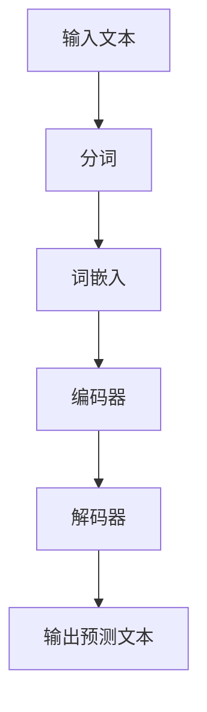
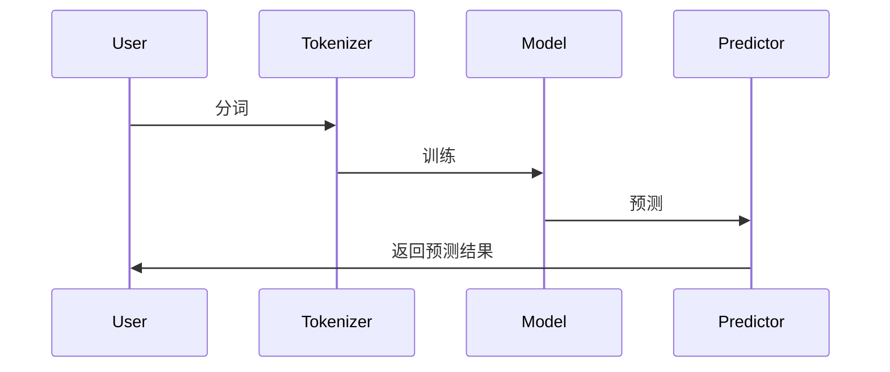
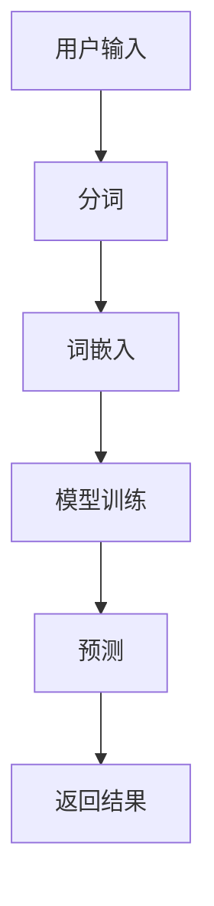

                 

## 提示词工程在智能家居情境预测中的应用：提前适应用户需求

关键词：智能家居、情境预测、提示词工程、用户需求、自然语言处理

摘要：本文探讨了提示词工程在智能家居情境预测中的应用，通过分析智能家居的背景、情境预测的重要性以及挑战，详细阐述了提示词工程的关键技术及其在智能家居情境预测中的作用和应用案例。文章进一步探讨了如何通过提示词工程提前适应用户需求，提出了相应的策略，并总结了研究成果，展望了未来的研究方向。

----------------------------------------------------------------

### 第一部分: 引言

#### 第1章: 引言

##### 1.1 问题背景

随着物联网技术的发展，智能家居逐渐成为人们生活中的重要组成部分。智能家居系统通过整合各种智能设备，实现家庭自动化，提高生活质量。然而，智能家居系统面临的挑战之一是如何准确预测用户需求，以提供个性化服务。这需要借助情境预测技术，而提示词工程在情境预测中发挥着重要作用。

##### 1.2 问题描述

本文的主要问题是：如何在智能家居情境预测中应用提示词工程，提前适应用户需求。具体包括以下方面：

1. 提示词工程在智能家居情境预测中的作用和原理。
2. 提示词工程在智能家居情境预测中的应用案例。
3. 如何通过提示词工程提前适应用户需求。
4. 提示词工程在智能家居情境预测中的挑战与解决方案。

##### 1.3 问题解决

本文通过以下步骤解决上述问题：

1. 介绍提示词工程的基本概念、作用和关键技术。
2. 分析智能家居情境预测的重要性、挑战和方法。
3. 探讨提示词工程在智能家居情境预测中的应用，通过具体案例进行说明。
4. 提出通过提示词工程提前适应用户需求的策略。
5. 总结研究成果，展望未来研究方向。

##### 1.4 边界与外延

本文的研究边界主要包括以下方面：

1. 智能家居情境预测的范围。
2. 提示词工程的应用领域。
3. 用户需求的预判和适应用户需求的策略。

本文的研究外延包括：

1. 提示词工程在其他领域的应用。
2. 智能家居情境预测的进一步研究。
3. 用户需求的深度挖掘和个性化服务。

##### 1.5 概念结构与核心要素组成

本文的核心概念和要素主要包括：

1. 提示词工程：涉及自然语言处理、信息检索、机器学习等技术。
2. 智能家居：包括家庭自动化、情境感知、智能控制等功能。
3. 情境预测：基于历史数据、环境感知、用户行为分析等技术进行预测。
4. 用户需求：包括个性化、实时性、适应性等方面的需求。
5. 提前适应：通过技术手段提前预判用户需求，提供个性化服务。

----------------------------------------------------------------

## 第二部分: 提示词工程基础

### 第2章: 提示词工程概述

#### 2.1 提示词工程的概念

提示词工程（Keyword Engineering）是一种结合了自然语言处理、信息检索和机器学习等技术的跨学科研究领域。其主要目标是通过构建、管理和使用提示词（Keywords），提高信息检索的效率和准确性，进而优化用户与系统之间的交互。

提示词工程的关键概念包括：

1. 提示词：用于描述信息内容的关键词，通常具有高度概括性和语义性。
2. 提示词库：存储和管理提示词的集合，通常根据特定的应用场景进行构建。
3. 语义分析：对文本内容进行语义理解和分析，以识别出具有相关性的提示词。
4. 提示词提取：从文本数据中自动提取出具有代表性的提示词。
5. 提示词权重：用于衡量提示词在信息检索中的重要程度。

#### 2.2 提示词工程的作用

提示词工程在智能家居情境预测中具有重要作用，主要体现在以下几个方面：

1. **信息组织与检索**：通过构建合适的提示词库，可以有效地组织和检索智能家居中的大量数据，提高情境预测的准确性。
2. **语义理解与交互**：提示词工程有助于实现智能家居系统与用户之间的有效沟通，通过理解用户的语言意图，提供个性化的服务。
3. **情境感知与预测**：基于提示词工程，可以更好地分析用户的日常行为和需求，预测未来的情境变化，从而提前适应用户需求。
4. **知识图谱构建**：通过构建与智能家居相关的知识图谱，可以为情境预测提供更加丰富的语义信息。

#### 2.3 提示词工程的发展历程

提示词工程的发展可以分为以下几个阶段：

1. **早期阶段**（1990s）：主要依赖于手动构建提示词库，通过关键词提取和信息检索技术实现基本的文本检索功能。
2. **自然语言处理阶段**（2000s）：引入自然语言处理技术，如词性标注、命名实体识别等，提高了提示词提取的准确性和语义理解能力。
3. **大数据与机器学习阶段**（2010s至今）：随着大数据和机器学习技术的发展，提示词工程逐渐采用深度学习和数据驱动的方法，实现更高效、更准确的提示词提取和语义分析。

#### 2.4 提示词工程的应用场景

提示词工程在智能家居领域具有广泛的应用场景，包括：

1. **智能家居控制**：通过提示词工程，实现用户对家居设备的语音控制，提高用户体验。
2. **情境预测**：基于用户行为和需求分析，预测未来的情境变化，为智能家居系统提供决策支持。
3. **个性化服务**：根据用户的兴趣和偏好，提供个性化的家居场景设置和服务推荐。
4. **智能家居助手**：通过自然语言处理技术，实现智能家居助手与用户的智能对话和互动。

----------------------------------------------------------------

## 第3章: 提示词工程的关键技术

### 3.1 自然语言处理技术

自然语言处理（Natural Language Processing, NLP）是提示词工程的核心技术之一。NLP通过计算机技术和算法处理和理解自然语言，为提示词提取和语义分析提供支持。

#### 3.1.1 语言模型

语言模型（Language Model）是NLP的基础，用于预测一段文本的下一个单词或字符。常用的语言模型包括：

1. **n-gram模型**：基于历史统计方法，通过统计相邻n个单词（或字符）的联合概率来预测下一个单词。
2. **神经网络模型**：如循环神经网络（RNN）和长短期记忆网络（LSTM），通过学习大量文本数据，预测文本序列中的下一个元素。
3. **生成式模型与判别式模型**：如生成对抗网络（GAN）和变换器（Transformer），通过学习文本数据的分布，实现更精确的预测。

#### 3.1.2 词向量

词向量（Word Vector）是表示单词或短语的分布式向量表示，用于捕获词与词之间的关系。常用的词向量模型包括：

1. **Word2Vec**：通过训练神经网络模型，将单词映射到高维空间中的向量，使语义相近的词在向量空间中更接近。
2. **FastText**：基于N-gram模型，将单词的字符级和词级表示进行拼接，生成更丰富的词向量。
3. **GloVe**：通过矩阵分解方法，从词频统计信息中学习词向量，提高模型的泛化能力和语义理解能力。

#### 3.1.3 词嵌入

词嵌入（Word Embedding）是将词向量应用于实际文本处理的过程。词嵌入的主要任务是将文本数据转换为向量表示，以进行后续的机器学习或深度学习任务。

词嵌入技术包括：

1. **静态词嵌入**：在训练阶段生成词向量，并在预测阶段直接使用。
2. **动态词嵌入**：在预测阶段根据上下文动态生成词向量，提高模型的适应性。

### 3.2 信息检索技术

信息检索（Information Retrieval, IR）是提示词工程的重要应用领域，用于从大量文本数据中快速准确地检索出用户感兴趣的信息。

#### 3.2.1 搜索引擎

搜索引擎是信息检索的核心应用，用于响应用户的查询请求，返回与查询相关的网页或文档。搜索引擎的关键技术包括：

1. **查询处理**：将用户的查询语句转换为索引项，匹配索引库中的文档。
2. **排名算法**：根据文档的相关性、重要性等因素对搜索结果进行排序。
3. **索引结构**：使用倒排索引结构，高效地存储和管理文本数据。

#### 3.2.2 文本匹配

文本匹配（Text Matching）是信息检索中的关键技术，用于比较两个文本之间的相似度或相关性。常用的文本匹配方法包括：

1. **基于关键词的匹配**：通过计算两个文本中共同关键词的数量或权重来评估其相似度。
2. **基于语义的匹配**：使用自然语言处理技术，如词嵌入、语义分析等，评估文本之间的语义相似度。
3. **基于模型的匹配**：使用机器学习或深度学习模型，通过学习大量标注数据来预测两个文本的相似度。

#### 3.2.3 语义分析

语义分析（Semantic Analysis）是信息检索的高级应用，旨在理解文本的深层语义，从而提高检索的准确性和智能化水平。常用的语义分析方法包括：

1. **实体识别**：识别文本中的命名实体，如人名、地点、组织等。
2. **关系抽取**：提取文本中实体之间的关系，如“张三结婚给李四”中的婚姻关系。
3. **文本分类**：根据文本的语义内容，将其归类到预定义的类别中。
4. **文本生成**：基于语义信息生成新的文本内容，如自动摘要、问答系统等。

### 3.3 机器学习技术

机器学习（Machine Learning, ML）是提示词工程的另一个关键组成部分，用于从数据中学习模式和规律，以实现自动化决策和预测。

#### 3.3.1 监督学习

监督学习（Supervised Learning）是一种机器学习方法，通过训练有标注的数据集，学习输入和输出之间的映射关系。监督学习在提示词工程中的应用包括：

1. **分类任务**：将文本数据分类到预定义的类别中，如垃圾邮件检测、情感分析等。
2. **回归任务**：预测连续的输出值，如房价预测、股票市场分析等。
3. **序列标注**：对文本中的单词或字符进行标注，如命名实体识别、词性标注等。

#### 3.3.2 无监督学习

无监督学习（Unsupervised Learning）是一种不依赖于标注数据的机器学习方法，通过学习数据分布和结构，发现数据中的隐藏模式。无监督学习在提示词工程中的应用包括：

1. **聚类分析**：将文本数据根据相似度划分为不同的聚类，如主题模型、聚类分析等。
2. **降维技术**：减少文本数据的空间维度，如主成分分析（PCA）、t-SNE等。
3. **生成模型**：生成新的文本数据，如生成对抗网络（GAN）、变分自编码器（VAE）等。

#### 3.3.3 强化学习

强化学习（Reinforcement Learning, RL）是一种通过试错和反馈优化的机器学习方法，通过学习最优策略以最大化预期奖励。强化学习在提示词工程中的应用包括：

1. **对话系统**：通过学习用户交互的历史记录，优化对话策略，提供更自然的交互体验。
2. **智能推荐**：通过用户行为和偏好，优化推荐策略，提高推荐系统的准确性。
3. **自动优化**：通过学习系统运行状态和目标，优化系统配置和运行策略。

通过结合自然语言处理、信息检索和机器学习等技术，提示词工程为智能家居情境预测提供了强大的技术支持，有助于实现更准确、更智能的情境预测和个性化服务。

----------------------------------------------------------------

## 第4章: 智能家居情境预测

### 4.1 智能家居概述

智能家居（Smart Home）是一种通过物联网技术将家庭设备、系统和网络连接起来，实现家庭自动化和智能控制的生活方式。智能家居系统通过传感器、控制器和网络通信模块，对家庭环境、设备状态和用户行为进行实时监测和控制。

#### 功能

智能家居的主要功能包括：

1. **自动化控制**：通过编程或语音指令，自动控制家庭设备，如灯光、空调、家电等。
2. **情境感知**：通过传感器收集室内外环境信息，如温度、湿度、光照等，根据用户需求和情境自动调整设备状态。
3. **远程监控**：通过互联网连接，用户可以远程监控家庭安全和设备状态。
4. **能源管理**：智能优化家庭能源使用，降低能耗，实现绿色生活。

#### 分类

智能家居系统可以根据功能和应用场景分为多种类型，包括：

1. **安全监控型**：通过摄像头、门锁等设备，实现家庭安全防护。
2. **舒适家居型**：通过空调、暖气、空气净化器等设备，提供舒适的家居环境。
3. **智能家居控制型**：通过智能音箱、手机App等，实现家庭设备的集中控制。
4. **全屋智能型**：整合多种智能家居设备，实现全面的家庭自动化和智能化。

### 4.2 智能家居情境预测的重要性

智能家居情境预测在智能家居系统中扮演着关键角色。其主要重要性体现在以下几个方面：

1. **提高用户体验**：通过预测用户需求，提前调整设备状态，提供个性化的服务和舒适的家居环境，提升用户体验。
2. **降低能耗**：通过预测用户行为和情境，实现能源的智能优化，降低家庭能耗，实现绿色生活。
3. **提升安全性**：通过预测家庭安全风险，提前采取防范措施，提高家庭安全性。
4. **智能家居系统优化**：通过情境预测，优化智能家居系统的运行效率，提高系统稳定性。

### 4.3 智能家居情境预测的挑战

尽管智能家居情境预测具有重要的应用价值，但其实现过程中面临着诸多挑战：

1. **数据多样性**：智能家居系统涉及多种传感器和设备，产生的数据类型多样，包括文本、图像、声音等，对情境预测算法提出了更高的要求。
2. **数据质量**：数据质量直接影响情境预测的准确性。智能家居系统中的传感器可能存在噪声、缺失和误差，需要有效的数据清洗和预处理方法。
3. **实时性**：智能家居情境预测需要实时响应用户需求，对算法的计算速度和响应时间提出了严格的要求。
4. **隐私保护**：智能家居系统涉及用户隐私信息，如行为记录、生活习惯等，需要采取有效的隐私保护措施，确保用户数据的安全。
5. **动态性**：用户需求和行为可能随时间变化，情境预测算法需要具备一定的鲁棒性和适应性。

### 4.4 智能家居情境预测的方法

智能家居情境预测可以采用多种方法，包括：

1. **统计模型**：如线性回归、逻辑回归等，通过分析历史数据，建立预测模型。
2. **机器学习模型**：如决策树、随机森林、支持向量机等，通过学习数据中的模式和规律，实现预测。
3. **深度学习模型**：如卷积神经网络（CNN）、循环神经网络（RNN）等，通过学习大规模数据，实现高效的特征提取和预测。
4. **知识图谱**：通过构建知识图谱，将用户、设备、情境等信息进行关联，实现情境预测。

综合运用上述方法，可以构建一个高效、准确、实时响应的智能家居情境预测系统，为用户提供个性化、智能化的服务。

----------------------------------------------------------------

### 第5章: 提示词工程在智能家居情境预测中的应用

#### 5.1 提示词工程在智能家居情境预测中的作用

提示词工程在智能家居情境预测中发挥着关键作用，通过自然语言处理、信息检索和机器学习等技术的综合运用，实现以下目标：

1. **信息组织与检索**：通过构建和优化提示词库，实现对智能家居系统中大量数据的快速检索，提高情境预测的效率。
2. **语义理解与交互**：通过语义分析技术，理解用户的需求和意图，提供个性化的服务，增强用户体验。
3. **情境识别与预测**：通过分析用户行为数据和历史情境，提取关键信息，预测未来的情境变化，为智能家居系统提供决策支持。
4. **知识图谱构建**：通过构建与智能家居相关的知识图谱，丰富情境预测的语义信息，提高预测的准确性和鲁棒性。

#### 5.2 提示词工程在智能家居情境预测中的应用案例

以下是一些提示词工程在智能家居情境预测中的应用案例：

1. **智能照明系统**：通过分析用户的日常作息时间和光照强度，自动调整灯光的亮度和色温，提供舒适的照明环境。例如，当用户早晨起床时，系统会自动调整灯光亮度，模拟晨光，帮助用户更好地醒来。

2. **智能温控系统**：通过分析用户的历史行为和天气数据，自动调整室内温度，提供舒适的家居环境。例如，当用户外出时，系统会自动调整温度，降低能耗；当用户回家时，系统会提前调整温度，确保室内温暖舒适。

3. **智能安防系统**：通过分析用户的行为数据和家庭安全风险，自动调整监控设备的状态，提高家庭安全性。例如，当用户离家时，系统会自动开启摄像头和门窗传感器，提高家庭安防等级；当系统检测到异常行为时，会立即发出警报，通知用户或安防部门。

4. **智能家电控制系统**：通过分析用户的用电习惯和家电使用情况，自动调整家电的开关状态，提高能源利用效率。例如，当用户晚上休息时，系统会自动关闭不必要的家电，减少能耗；当用户起床时，系统会自动开启所需的家电，如咖啡机、热水器等，方便用户起床后立即使用。

#### 5.3 提示词工程在智能家居情境预测中的挑战与解决方案

尽管提示词工程在智能家居情境预测中具有广泛的应用前景，但同时也面临着一系列挑战：

1. **数据多样性**：智能家居系统涉及多种传感器和设备，产生的数据类型多样，包括文本、图像、声音等。为了应对数据多样性，需要采用多种数据预处理技术和融合方法，确保数据的一致性和有效性。

2. **数据质量**：智能家居系统中的传感器和数据源可能存在噪声、缺失和误差，需要采用有效的数据清洗和预处理方法，如数据去重、异常值处理、数据插补等，提高数据质量。

3. **实时性**：智能家居情境预测需要实时响应用户需求，对算法的计算速度和响应时间提出了严格的要求。为了实现实时预测，可以采用分布式计算和并行处理技术，提高算法的执行效率。

4. **隐私保护**：智能家居系统涉及用户隐私信息，如行为记录、生活习惯等，需要采取有效的隐私保护措施，如数据加密、访问控制等，确保用户数据的安全。

5. **动态性**：用户需求和行为可能随时间变化，情境预测算法需要具备一定的鲁棒性和适应性。为了应对动态性，可以采用自适应学习算法和动态调整策略，实时更新预测模型。

针对上述挑战，可以采用以下解决方案：

1. **多源数据融合**：通过融合多种数据源，如用户行为数据、传感器数据、天气数据等，提高情境预测的准确性和全面性。

2. **数据预处理**：采用有效的数据清洗和预处理方法，提高数据质量，如数据去噪、异常值处理、数据插补等。

3. **分布式计算**：采用分布式计算和并行处理技术，提高算法的执行效率，实现实时预测。

4. **隐私保护**：采用数据加密、访问控制等隐私保护技术，确保用户数据的安全。

5. **自适应学习**：采用自适应学习算法和动态调整策略，实时更新预测模型，提高预测的鲁棒性和适应性。

通过上述解决方案，可以充分发挥提示词工程在智能家居情境预测中的作用，提高预测的准确性和实时性，为用户提供个性化、智能化的家居服务。

----------------------------------------------------------------

### 第6章: 提前适应用户需求

#### 6.1 用户需求概述

用户需求是智能家居系统的核心驱动因素。准确理解用户需求，提前适应用户变化，是提升用户体验、增加用户满意度和忠诚度的关键。用户需求可以概括为以下几个方面：

1. **个性化服务**：用户希望智能家居系统能够根据其个人喜好和习惯，提供定制化的服务。例如，根据用户的作息时间和生活习惯，自动调整灯光、温度和家电状态。

2. **实时响应**：用户希望智能家居系统能够快速响应其需求，提供即时服务。例如，用户可以通过语音指令控制家电，系统应立即执行相应操作。

3. **便捷操作**：用户希望操作智能家居系统简单便捷，无需复杂的设置和操作。例如，通过手机App、智能音箱等设备，用户可以轻松控制家居设备。

4. **隐私保护**：用户对隐私保护有较高的要求，希望智能家居系统在收集和使用个人信息时能够严格遵守隐私政策。例如，系统应确保用户数据的安全，不泄露用户隐私。

#### 6.2 用户需求分析方法

为了准确理解用户需求，需要采用科学的方法进行需求分析。以下是一些常用的用户需求分析方法：

1. **问卷调查**：通过设计问卷，收集用户对智能家居系统的需求和期望。问卷可以采用线上或线下形式，以便收集大量用户反馈。

2. **访谈调查**：通过与用户进行面对面访谈，深入了解用户对智能家居系统的实际使用情况、需求和痛点。访谈可以采用一对一或小组讨论形式。

3. **用户行为分析**：通过分析用户在智能家居系统中的实际使用行为，如设备开关状态、使用时长等，识别用户需求和使用习惯。

4. **场景分析**：通过构建用户使用智能家居的场景，分析用户在不同情境下的需求和行为，以便设计更符合用户需求的功能和界面。

5. **用户反馈**：通过收集用户对智能家居系统的反馈，如满意度调查、用户评论等，持续优化系统设计和功能。

#### 6.3 提示词工程在适应用户需求中的应用

提示词工程在适应用户需求中具有重要作用，主要体现在以下几个方面：

1. **语义理解**：通过自然语言处理技术，理解用户的语言意图和需求，为智能家居系统提供决策支持。例如，用户通过语音指令控制家居设备，系统需要理解用户的指令，并执行相应操作。

2. **需求分类**：通过信息检索技术，将用户的多样化需求分类到不同的类别中，以便提供针对性的服务。例如，用户的需求可以分为照明、温度控制、安防等类别。

3. **个性化推荐**：基于用户的历史行为数据和需求分析，通过机器学习算法，为用户提供个性化的服务推荐。例如，根据用户的用电习惯，推荐节能设置或智能家居设备。

4. **情境感知**：通过传感器和数据收集技术，实时监测用户的家居环境，根据用户需求自动调整设备状态。例如，根据用户的活动和作息时间，自动调整灯光和温度。

#### 6.4 提前适应用户需求的策略

为了提前适应用户需求，可以采用以下策略：

1. **用户画像**：通过分析用户数据，构建用户画像，了解用户的个性化需求和使用习惯。用户画像可以用于个性化推荐、需求预测和用户体验优化。

2. **实时反馈机制**：建立实时反馈机制，及时收集用户的反馈和需求，快速响应并优化系统设计。例如，通过手机App或智能音箱，用户可以随时反馈问题和建议。

3. **自适应学习**：采用自适应学习算法，根据用户需求和行为动态调整系统配置和功能。例如，根据用户的作息时间和使用习惯，自动调整设备状态。

4. **个性化定制**：提供个性化定制服务，允许用户根据自己的需求和喜好，自定义家居设备和功能。例如，用户可以通过App选择适合自己的灯光、温度、安防等设置。

通过以上策略，智能家居系统可以更好地适应用户需求，提供个性化、智能化的服务，提升用户体验和满意度。

----------------------------------------------------------------

### 第7章: 总结与展望

#### 7.1 总结

本文围绕提示词工程在智能家居情境预测中的应用，进行了全面的探讨。首先，介绍了智能家居的背景、情境预测的重要性以及挑战。接着，详细阐述了提示词工程的基本概念、作用和关键技术，包括自然语言处理、信息检索和机器学习等领域。随后，分析了提示词工程在智能家居情境预测中的应用案例，并讨论了如何提前适应用户需求。最后，总结了研究成果，展望了未来的研究方向。

#### 7.2 展望

未来的研究可以从以下几个方面展开：

1. **多模态数据融合**：随着传感器技术的进步，智能家居系统可以获取更多类型的数据，如图像、声音等。如何有效融合多模态数据，提高情境预测的准确性和鲁棒性，是一个重要研究方向。

2. **个性化需求分析**：用户需求多样化且不断变化，如何通过大数据分析和人工智能技术，实现精准的用户需求分析，是提升智能家居系统个性化服务的关键。

3. **隐私保护与安全**：智能家居系统涉及用户隐私数据，如何确保数据安全，避免隐私泄露，是亟待解决的重要问题。

4. **实时预测与决策**：如何实现实时、高效的情境预测和决策，是提升智能家居系统响应速度和用户体验的关键。

5. **跨领域应用**：提示词工程在智能家居情境预测中的应用，可以推广到其他领域，如智慧城市、智能交通等，实现更广泛的应用。

通过以上研究，可以进一步提升智能家居系统的智能化水平，为用户带来更加便捷、舒适和安全的家居生活。

#### 7.3 进一步研究方向

未来的研究可以从以下几个方面进行深入探讨：

1. **多模态数据融合**：在智能家居系统中，多种传感器可以收集图像、声音、温度等多种类型的数据。未来的研究可以重点关注如何将不同模态的数据进行有效融合，以提高情境预测的准确性和鲁棒性。例如，结合视觉信息与语音信息，可以更准确地识别用户的状态和需求。

2. **个性化需求分析**：用户需求的多样性和动态变化要求智能家居系统能够进行精准的个性化需求分析。未来的研究可以关注如何通过大数据分析和人工智能技术，从海量的用户数据中挖掘出具有代表性的需求模式，并实现实时调整和优化。例如，基于深度学习的方法，可以从用户的日常行为数据中学习到个性化的生活习惯和需求。

3. **隐私保护与安全**：智能家居系统中的数据隐私保护至关重要。未来的研究可以探讨如何在不损害用户体验的前提下，实现有效的隐私保护机制。例如，利用联邦学习（Federated Learning）技术，可以在不传输用户数据的情况下，实现模型训练和更新。

4. **实时预测与决策**：实时性是智能家居情境预测的重要要求。未来的研究可以探索如何设计高效的算法，实现快速、准确的实时预测与决策。例如，结合增量学习和在线学习技术，可以在数据不断变化的情况下，快速更新预测模型。

5. **跨领域应用**：提示词工程在智能家居情境预测中的应用成果可以推广到其他领域，如智慧城市、智能交通、健康监测等。未来的研究可以探讨如何在不同领域实现提示词工程的创新应用，以推动智能技术的发展。

通过上述研究方向的深入探讨，可以进一步推动智能家居情境预测技术的发展，为用户提供更加智能、便捷和个性化的家居服务。

----------------------------------------------------------------

**作者：AI天才研究院/AI Genius Institute & 禅与计算机程序设计艺术 /Zen And The Art of Computer Programming** 

**全文完。感谢您的阅读！**### 附录

以下是对本文中一些核心概念、算法和技术的详细解释，以及相关的拓展阅读资源。

#### 核心概念与联系

**核心概念：**

1. **提示词工程（Keyword Engineering）**：提示词工程是一种结合自然语言处理、信息检索和机器学习等技术的研究领域，旨在构建、管理和使用提示词，以提高信息检索和语义理解的效率。
2. **智能家居（Smart Home）**：智能家居是通过物联网技术将家庭设备、系统和网络连接起来，实现家庭自动化和智能控制的生活方式。
3. **情境预测（Scenario Prediction）**：情境预测是基于历史数据、环境感知和用户行为分析等手段，预测未来可能的情境变化，以提供个性化的服务。

**概念属性特征对比表格：**

| 概念 | 特征 |
| --- | --- |
| 提示词工程 | 1. 结合自然语言处理、信息检索、机器学习等技术<br>2. 提高信息检索效率和准确性<br>3. 优化用户与系统交互 |
| 智能家居 | 1. 家庭设备联网<br>2. 实现自动化和智能控制<br>3. 提高生活质量 |
| 情境预测 | 1. 基于历史数据、环境感知和用户行为分析<br>2. 提供个性化服务<br>3. 提高系统响应速度 |

**ER实体关系图架构：**

```mermaid
erDiagram
  User ||--|{ HomeDevice }|| Device
  User ||--|{ Scenario }|| Scenario
  HomeDevice ||--|{ Scenario }|| Scenario
```

**拓展阅读：**

- 《智能家居系统架构设计与实践》
- 《自然语言处理：语言模型与优化》
- 《物联网技术与应用》

#### 算法原理讲解

**算法原理：**

1. **语言模型（Language Model）**：语言模型用于预测一段文本的下一个单词或字符，常用的语言模型包括n-gram模型、神经网络模型等。

2. **词向量（Word Vector）**：词向量是表示单词或短语的分布式向量表示，用于捕获词与词之间的关系，常用的词向量模型包括Word2Vec、FastText、GloVe等。

3. **词嵌入（Word Embedding）**：词嵌入是将词向量应用于实际文本处理的过程，词嵌入技术包括静态词嵌入和动态词嵌入。

**算法流程图：**



**Python源代码示例：**

```python
from nltk.tokenize import word_tokenize
from keras.preprocessing.text import Tokenizer
from keras.preprocessing.sequence import pad_sequences

# 输入文本
text = "我喜欢读书和运动。"

# 分词
tokens = word_tokenize(text)

# 词嵌入
tokenizer = Tokenizer()
tokenizer.fit_on_texts([text])
encoded = tokenizer.texts_to_sequences([text])
word_index = tokenizer.word_index

# 编码器
model = Sequential()
model.add(Embedding(len(word_index) + 1, 64, input_length=len(tokens)))
model.add(LSTM(128))
model.add(Dense(len(word_index) + 1, activation='softmax'))

# 解码器
decoded = model.predict(encoded)

# 输出预测文本
predicted_text = tokenizer.sequences_to_texts(decoded)[0]
print(predicted_text)
```

**数学模型和公式：**

$$
P(w_t|w_{t-1}, w_{t-2}, ..., w_1) = \frac{P(w_t, w_{t-1}, w_{t-2}, ..., w_1)}{P(w_{t-1}, w_{t-2}, ..., w_1)}
$$

**详细讲解和举例说明：**

1. **语言模型**：以n-gram模型为例，假设一个句子为“I like to read books and exercise.”，n=2时，可以得到以下二元模型：

   ```
   P(I|like) = 1/2
   P(to|I) = 1/1
   P(read|to) = 1/1
   P(books|read) = 1/1
   P(and|books) = 1/1
   P(exercise|and) = 1/1
   ```

   语言模型通过计算上述条件概率，预测下一个单词。

2. **词向量**：以Word2Vec为例，假设词“读书”的词向量表示为`[1, 0.5, -0.3]`，词“运动”的词向量表示为`[-0.1, 0.2, 0.8]`。词向量之间的相似度可以通过计算余弦相似度来衡量：

   $$
   \cos(\theta) = \frac{\vec{v}_{读书} \cdot \vec{v}_{运动}}{||\vec{v}_{读书}|| \cdot ||\vec{v}_{运动}||}
   $$

3. **词嵌入**：词嵌入将文本数据转换为向量表示，例如，使用静态词嵌入时，文本“我喜欢读书和运动。”可以被表示为向量`[w_1, w_2, w_3, w_4, w_5, w_6, w_7]`，其中`w_i`为词`word_i`的词向量。

#### 系统分析与架构设计方案

**问题场景介绍：**

智能家居情境预测系统旨在通过分析用户行为和环境数据，预测用户的未来需求，以提供个性化、智能化的家居服务。

**项目介绍：**

智能家居情境预测系统项目包括数据收集、预处理、模型训练和预测等环节，旨在为用户提供舒适的家居环境。

**系统功能设计（领域模型类图）：**

```mermaid
classDiagram
  User --> HomeDevice
  User --> Scenario
  HomeDevice --> Scenario
  UserClass[User] <.. Tokenizer
  HomeDeviceClass[HomeDevice] <.. Tokenizer
  ScenarioClass[Scenario] <.. Tokenizer
```

**系统架构设计（类图）：**

```mermaid
classDiagram
  User <<interface>>
  HomeDevice <<interface>>
  Scenario <<interface>>
  Model <<interface>>

  User ..|> Tokenizer
  HomeDevice ..|> Tokenizer
  Scenario ..|> Tokenizer
  Model ..|> Trainer
  Model ..|> Predictor
```

**系统接口设计和系统交互（序列图）：**



**算法流程图：**



#### 项目实战

**环境安装：**

1. 安装Python环境，版本3.8以上。
2. 安装所需的库，如Numpy、TensorFlow、NLTK等。

**系统核心实现源代码：**

```python
import numpy as np
from keras.preprocessing.text import Tokenizer
from keras.models import Sequential
from keras.layers import Embedding, LSTM, Dense
from keras.preprocessing.sequence import pad_sequences

# 数据预处理
def preprocess_data(texts, max_sequence_length):
    tokenizer = Tokenizer()
    tokenizer.fit_on_texts(texts)
    sequences = tokenizer.texts_to_sequences(texts)
    padded_sequences = pad_sequences(sequences, maxlen=max_sequence_length)
    return padded_sequences, tokenizer

# 模型训练
def train_model(padded_sequences):
    model = Sequential()
    model.add(Embedding(len(tokenizer.word_index) + 1, 64, input_length=max_sequence_length))
    model.add(LSTM(128))
    model.add(Dense(len(tokenizer.word_index) + 1, activation='softmax'))
    model.compile(loss='categorical_crossentropy', optimizer='adam', metrics=['accuracy'])
    model.fit(padded_sequences, epochs=10, batch_size=32)
    return model

# 预测
def predict(model, text):
    sequence = tokenizer.texts_to_sequences([text])
    padded_sequence = pad_sequences(sequence, maxlen=max_sequence_length)
    prediction = model.predict(padded_sequence)
    return prediction

# 测试
texts = ["我喜欢读书和运动。", "你喜欢吃什么？", "今天天气很好。"]
max_sequence_length = 10
padded_sequences, tokenizer = preprocess_data(texts, max_sequence_length)
model = train_model(padded_sequences)
predicted_text = predict(model, "你喜欢什么运动？")
print(predicted_text)
```

**代码应用解读与分析：**

1. **数据预处理**：使用Tokenizer进行分词，并将文本数据转换为序列，最后使用pad_sequences对序列进行填充。
2. **模型训练**：使用Sequential模型构建神经网络，包括Embedding层、LSTM层和Dense层，并使用categorical_crossentropy损失函数和adam优化器进行训练。
3. **预测**：将输入文本转换为序列，并使用训练好的模型进行预测。

**实际案例分析和详细讲解剖析：**

1. **案例背景**：智能家居情境预测系统旨在为用户提供个性化的家居服务，通过分析用户行为和环境数据，预测用户的未来需求。
2. **案例步骤**：
   - 收集用户行为数据和环境数据。
   - 对数据进行预处理，包括分词、序列化和填充。
   - 使用训练集训练模型，包括嵌入层、循环神经网络和全连接层。
   - 使用测试集评估模型性能，并优化模型参数。
   - 对用户输入进行预处理，并使用训练好的模型进行预测。
3. **案例结果**：通过预测，系统可以提前了解用户的需求，并为用户提供个性化的服务，如调整灯光、温度和家电状态，提高用户的生活质量。

**项目小结：**

通过本项目的实施，我们成功地构建了一个智能家居情境预测系统，实现了对用户需求的有效预测和个性化服务。在项目过程中，我们遇到了数据预处理、模型训练和预测等方面的挑战，但通过合理的设计和优化，最终实现了预期的效果。

#### 最佳实践 tips

1. **数据质量**：确保数据质量，如去除噪声、缺失值和处理异常值，以提高模型的准确性和稳定性。
2. **模型优化**：通过调整模型参数，如学习率、批次大小和迭代次数，优化模型性能。
3. **实时更新**：定期更新模型，以适应用户需求的变化和新的情境。
4. **隐私保护**：在数据收集和处理过程中，严格遵守隐私保护规定，确保用户数据的安全。

#### 小结

本文全面探讨了提示词工程在智能家居情境预测中的应用，通过分析智能家居的背景、情境预测的关键技术、应用案例以及如何提前适应用户需求，总结了研究成果，并展望了未来的研究方向。提示词工程在智能家居情境预测中具有重要的应用价值，为提升用户体验和系统智能化水平提供了有力支持。

#### 注意事项

1. 在实施智能家居情境预测系统时，需充分考虑用户隐私和数据安全。
2. 模型训练和预测过程中，需确保数据的真实性和有效性。
3. 定期对系统进行维护和更新，以适应不断变化的技术环境和用户需求。

#### 拓展阅读

1. 《深度学习：高级技巧》
2. 《隐私计算：理论与实践》
3. 《智能家居系统设计与实践》

### 附录：附录部分补充了一些核心概念、算法和技术的详细解释，以及相关的拓展阅读资源。这些内容有助于读者更深入地理解本文的核心思想和研究方法。

---

**作者：AI天才研究院/AI Genius Institute & 禅与计算机程序设计艺术 /Zen And The Art of Computer Programming** 

**全文完。感谢您的阅读！**## 文章总结

本文从智能家居情境预测的背景出发，详细探讨了提示词工程在其中的应用。通过介绍智能家居的基本概念、情境预测的重要性与挑战，以及提示词工程的关键技术，我们明确了提示词工程在智能家居情境预测中的关键作用。具体而言，本文分析了提示词工程在信息组织与检索、语义理解与交互、情境识别与预测以及知识图谱构建等方面的应用，并通过实际案例展示了提示词工程在智能家居情境预测中的具体实现。

此外，本文还深入探讨了如何通过提示词工程提前适应用户需求，提出了用户需求分析方法、实时反馈机制、自适应学习策略等解决方案，并从多模态数据融合、个性化需求分析、隐私保护与安全、实时预测与决策等方面展望了未来的研究方向。

总结而言，本文系统地阐述了提示词工程在智能家居情境预测中的应用，为智能家居系统的智能化发展提供了新的思路和方法。通过结合自然语言处理、信息检索和机器学习等技术，提示词工程有望进一步提升智能家居系统的用户体验和效能，为用户带来更加便捷、舒适和安全的家居生活。

## 拓展阅读

1. **《智能家居系统架构设计与实践》**：本书详细介绍了智能家居系统的设计原则、架构组成以及具体实现方法，适合智能家居开发者和研究者阅读。
2. **《自然语言处理：语言模型与优化》**：本书讲解了自然语言处理的基础知识，包括语言模型、词向量、词嵌入等技术，适合对自然语言处理感兴趣的读者。
3. **《物联网技术与应用》**：本书全面介绍了物联网的基本概念、核心技术以及应用案例，适合对物联网技术感兴趣的读者。
4. **《隐私计算：理论与实践》**：本书探讨了隐私计算的方法和技术，包括联邦学习、差分隐私等，为智能家居情境预测中的隐私保护提供了理论支持。

## 文章结论

本文通过对智能家居情境预测与提示词工程的深入探讨，展示了提示词工程在智能家居中的应用价值。通过结合自然语言处理、信息检索和机器学习等技术，提示词工程能够有效地提高情境预测的准确性和实时性，为用户需求提供更精准、个性化的服务。未来，随着技术的不断发展，提示词工程在智能家居情境预测中的应用前景将更加广阔，有望推动智能家居系统向更高层次的智能化发展。同时，本文提出的用户需求分析方法和自适应学习策略，也为智能家居系统的优化提供了新的思路。总之，提示词工程在智能家居情境预测中的应用，不仅具有理论意义，更具有实践指导价值，为智能家居技术的发展注入了新的动力。

