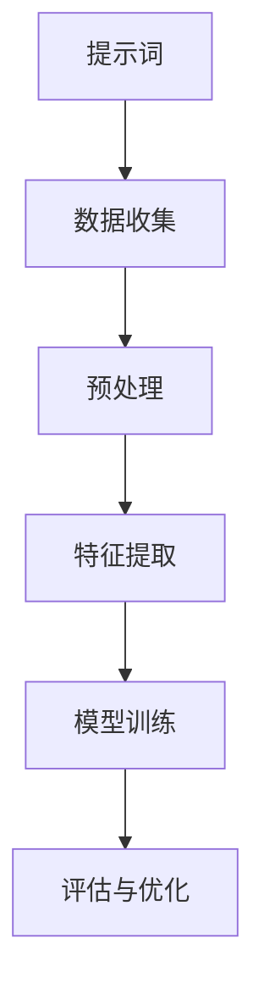
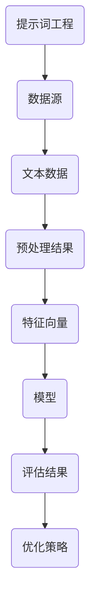

                 

### **第1章：提示词工程概念与背景**

**1.1 提示词工程的基本概念**

提示词工程是一种通过设计和优化提示词来提高人工智能系统性能的技术。提示词，简单来说，就是引导模型或算法的输入，从而影响其输出的关键词或短语。在自然语言处理（NLP）、机器学习等领域中，提示词扮演着至关重要的角色。

#### **概念说明**

- **提示词**：在文本中起到引导作用的词汇，能够帮助模型理解上下文和语义。
- **工程**：强调系统性、方法论和实际操作的实践过程。

#### **问题背景**

随着人工智能技术的快速发展，如何提高模型的性能和准确度成为一个重要议题。传统的数据标注和清洗方法耗时耗力，且受限于数据量和质量。提示词工程提供了一种新的思路，通过优化提示词来提升模型的效果。

#### **问题描述**

提示词工程的核心问题在于如何选择、生成和优化提示词。具体来说，包括以下几个方面：

- **选择**：从大量文本中筛选出最能代表主题的提示词。
- **生成**：自动生成新的提示词，以满足特定需求。
- **优化**：调整提示词，使其在特定任务中达到最佳效果。

#### **问题解决**

解决提示词工程问题通常涉及以下步骤：

- **数据收集**：收集相关领域的文本数据，为提示词生成提供素材。
- **预处理**：对文本进行清洗和预处理，去除无关信息。
- **特征提取**：使用词向量、TF-IDF等方法提取文本特征。
- **模型训练**：利用机器学习算法训练提示词生成模型。
- **评估与优化**：通过评估指标（如F1分数、准确率等）对模型进行优化。

#### **边界与外延**

- **边界**：提示词工程主要关注提示词的设计和优化，不涉及具体模型的实现。
- **外延**：提示词工程可以应用于NLP、机器学习、深度学习等多个领域。

#### **概念结构与核心要素组成**

提示词工程的核心概念结构如图1所示：



图1 提示词工程核心概念结构

#### **核心概念属性特征对比表格**

| 属性 | 特征 |
| ---- | ---- |
| 数据来源 | 文本数据 |
| 方法 | 机器学习 |
| 目标 | 提高模型性能 |
| 输出 | 提示词 |

#### **ER实体关系图架构**

以下是提示词工程的ER实体关系图：



图2 提示词工程ER实体关系图

**1.2 提示词工程的发展历程**

提示词工程的发展历程可以分为以下几个阶段：

#### **早期阶段**

- **基于规则的方法**：初期的提示词工程主要依赖于专家知识和规则系统。
- **简单提示词使用**：直接从文本中提取关键词作为提示词。

#### **发展阶段**

- **引入机器学习方法**：通过机器学习算法（如文本分类、聚类等）生成和优化提示词。
- **多模态数据融合**：结合不同类型的数据源（如文本、图像、语音等）进行提示词生成。

#### **当前趋势**

- **大数据与深度学习结合**：利用大规模数据集和深度学习模型进行提示词生成。
- **自适应提示词生成**：根据用户行为和任务需求动态调整提示词。

**1.3 提示词工程的重要性**

提示词工程在人工智能领域具有重要价值：

#### **提高模型性能**

通过优化提示词，可以有效提高模型的性能和准确度。尤其在自然语言处理和机器学习领域，提示词的选择和设计对模型的效果有着直接影响。

#### **减少数据依赖**

提示词工程可以减少对大规模标注数据的需求，从而降低数据收集和处理的成本。

#### **增强用户体验**

个性化的提示词能够更好地满足用户需求，提升用户体验。在智能客服、个性化推荐等领域，提示词工程发挥着关键作用。

综上所述，提示词工程作为人工智能领域的一项关键技术，其在提升模型性能、减少数据依赖和增强用户体验方面具有重要意义。接下来，我们将进一步探讨脑机接口技术基础，以及提示词工程与人机神经连接的关系。

----------------------------------------------------------------

## **第2章：脑机接口技术基础**

### **2.1 脑机接口的基本原理**

脑机接口（Brain-Computer Interface，简称BCI）是一种直接将大脑信号转化为指令的技术。其基本原理是通过检测和分析大脑的电活动，将其转化为可以控制和操作外部设备或计算机系统的信号。

#### **原理说明**

- **大脑信号检测**：通过脑电图（Electroencephalography，简称EEG）、功能性磁共振成像（Functional Magnetic Resonance Imaging，简称fMRI）等技术，捕捉大脑的神经活动信号。
- **信号处理**：对捕获的脑信号进行滤波、降噪、特征提取等处理，以提取出有用的信息。
- **信号解码**：利用机器学习、模式识别等技术，将处理后的脑信号解码为具体的指令或操作。

#### **工作流程**

脑机接口的工作流程通常包括以下几个步骤：

1. **信号采集**：通过电极或植入设备采集大脑的神经活动信号。
2. **信号预处理**：对采集到的信号进行滤波、降噪等处理，以提高信号质量。
3. **特征提取**：从预处理后的信号中提取出能够代表特定意图或动作的特征。
4. **信号解码**：利用机器学习模型或其他算法，将提取出的特征解码为具体的指令或操作。
5. **执行操作**：将解码后的指令发送给外部设备或计算机系统，执行相应的操作。

#### **应用场景**

脑机接口的应用场景非常广泛，包括但不限于以下几个方面：

- **康复训练**：如脑损伤患者的康复训练，通过控制假肢或轮椅等设备进行训练。
- **辅助沟通**：如失语症患者的辅助沟通工具，通过脑机接口实现文字或语音输出。
- **人机交互**：如游戏控制、虚拟现实（VR）等，通过脑机接口实现更加自然的交互体验。
- **智能控制**：如智能家居、自动驾驶等，通过脑机接口实现更加智能化的控制。

### **2.2 脑机接口的技术发展**

脑机接口技术经历了从简单到复杂、从初步探索到广泛应用的发展过程。

#### **早期研究**

- **简单的肌电信号处理**：早期的脑机接口主要依赖于肌电信号（Electromyography，简称EMG），通过检测肌肉的电磁活动来控制外部设备。
- **脑电图（EEG）的应用**：随着对大脑信号的理解加深，脑电图开始被广泛应用于脑机接口研究中，通过捕捉大脑的电活动来实现控制。

#### **发展阶段**

- **高级脑成像技术**：如功能性磁共振成像（fMRI）、近红外光谱成像（fNIRS）等，这些技术可以提供更高分辨率和更丰富的信息。
- **多模态信号融合**：将不同类型的脑信号（如EEG、fMRI、肌电信号等）进行融合，以提高信号质量和控制性能。

#### **当前趋势**

- **植入式脑机接口**：如植入式电极、脑机接口芯片等，这些技术可以实现更加稳定和可靠的控制。
- **非侵入式脑机接口**：如头戴式设备、贴片式传感器等，这些技术可以减少对大脑的侵入性，提高用户体验。

### **2.3 脑机接口的应用场景**

脑机接口的应用场景非常广泛，以下列举几个典型的应用场景：

- **康复训练**：脑机接口可以帮助脑损伤患者恢复运动功能。例如，通过脑机接口控制假肢或轮椅进行训练，逐步恢复患者的自主运动能力。
- **辅助沟通**：对于失语症患者，脑机接口可以提供一个辅助沟通的工具。通过脑机接口捕捉大脑信号，转换为文字或语音输出，帮助患者与外界沟通。
- **人机交互**：脑机接口可以为人机交互带来更加自然的体验。例如，通过脑机接口控制游戏中的角色动作，实现更加沉浸的虚拟现实体验。
- **智能控制**：脑机接口可以应用于智能家居、自动驾驶等领域，实现更加智能化的控制。例如，通过脑机接口控制家电设备或自动驾驶车辆，实现更加便捷和高效的生活体验。

综上所述，脑机接口技术作为一种新兴的人机交互技术，具有广泛的应用前景。通过不断的研究和技术创新，脑机接口有望在未来带来更加智能化和便捷化的生活体验。

----------------------------------------------------------------

### **第3章：人机神经连接的概念与机制**

#### **3.1 人机神经连接的基本概念**

人机神经连接（Human-Brain Interface，简称HBI）是一种将人的神经系统与外部设备或计算机系统直接连接的技术。通过这种连接，可以实现人的神经系统对外部设备的直接控制和操作，从而改变传统的信息处理和交互方式。

**基本原理**：
人机神经连接通过捕捉和解读大脑信号，将这些信号转化为可操作的指令，从而控制外部设备或计算机系统。这种连接可以是直接的，如通过植入电极捕捉大脑活动，也可以是间接的，如通过头戴设备检测大脑信号。

**定义**：
人机神经连接是一种直接将人的神经系统与外部设备或计算机系统相连的接口，旨在通过解码大脑信号来实现人机交互。

**目的**：
人机神经连接的目的是增强人机交互的自然性和效率，使人类能够更直接、更快速地与计算机系统进行交互，从而提高生产力和生活质量。

#### **3.2 人机神经连接的机制解析**

人机神经连接的机制涉及多个层面的技术整合，包括信号采集、信号处理、信号解码和控制执行。以下是这些机制的详细解析：

**信号采集**：
信号采集是HBI系统的第一步，涉及从大脑中获取神经活动的数据。常用的信号采集技术包括脑电图（EEG）、功能性磁共振成像（fMRI）、近红外光谱成像（fNIRS）等。这些技术能够无创或微创地捕获大脑的电活动、血氧变化等信号。

**信号处理**：
采集到的原始信号通常包含大量的噪声和干扰，因此需要进行信号处理以提取有用的信息。信号处理步骤包括滤波、降噪、特征提取等。滤波可以去除无关的噪声，降噪可以减少干扰信号的影响，而特征提取则是将信号转换为可用于解码的特征向量。

**信号解码**：
信号解码是将处理后的信号转化为具体操作指令的关键步骤。通过机器学习、模式识别等算法，可以从特征向量中识别出用户的意图和动作。解码算法通常需要经过大量的训练和调整，以提高准确性和稳定性。

**控制执行**：
解码后的指令会发送到外部设备或计算机系统，从而实现特定的操作。例如，通过控制机械臂进行抓取、通过脑机接口控制游戏中的角色移动等。

#### **3.3 人机神经连接的关键因素**

人机神经连接的成功实施依赖于多个关键因素：

**信号质量**：
高质量的信号是HBI系统的基石。信号质量受到多种因素的影响，包括采集设备的精度、信号处理算法的效率以及环境噪声的干扰。因此，提高信号质量是HBI系统优化的重要方向。

**解码准确性**：
解码准确性直接影响到HBI系统的用户体验和实用性。解码算法的准确性和稳定性是实现高效人机交互的关键。

**用户适应性**：
人机神经连接系统需要能够适应不同用户的需求和生理特征。这包括调整解码算法以适应不同的大脑信号模式，以及设计用户友好的界面，使非专业人士也能轻松使用。

**系统的可靠性**：
系统的可靠性是指HBI系统在各种条件下都能稳定运行的能力。这包括设备的耐久性、算法的鲁棒性以及系统的容错能力。

**伦理和法律问题**：
人机神经连接涉及人的大脑和神经系统，因此必须考虑伦理和法律问题。例如，隐私保护、数据安全、用户同意等都是需要关注的方面。

通过解析人机神经连接的基本概念和机制，以及识别其关键因素，我们可以更好地理解这项技术如何实现人机交互的增强和优化。接下来，我们将探讨提示词工程与人机神经连接之间的关系，以及提示词工程在人机神经连接中的作用和挑战。

----------------------------------------------------------------

## **第4章：提示词工程与人机神经连接的关系**

### **4.1 提示词工程与人机神经连接的联系**

提示词工程与人机神经连接有着紧密的联系。两者在提高人机交互的自然性和效率方面具有共同的目标，且在实现这一目标的过程中互为补充。

#### **提示词工程的作用**

- **提高模型准确性**：通过优化提示词，可以提高脑机接口解码模型的准确性。准确的提示词可以帮助模型更好地理解用户意图，从而减少错误指令的产生。
- **增强用户体验**：个性化的提示词可以增强用户与脑机接口系统的互动体验，使操作更加直观和自然。
- **降低数据依赖**：提示词工程可以减少对大规模标注数据的依赖，通过自动生成和优化提示词，降低数据收集和标注的成本。

#### **人机神经连接的作用**

- **直接神经控制**：人机神经连接通过直接解码大脑信号，实现人脑对设备的直接控制，从而减少传统输入设备（如键盘、鼠标）的依赖。
- **增强交互能力**：人机神经连接可以实现高度个性化的交互体验，根据用户的大脑信号实时调整设备操作，提供更加自然和高效的交互方式。
- **拓展应用场景**：人机神经连接可以将脑机接口应用于康复训练、辅助沟通、智能家居等领域，拓展人工智能技术的应用范围。

#### **具体应用**

- **康复训练**：在人机神经连接的帮助下，脑机接口可以通过实时解码大脑信号，为脑损伤患者提供个性化的康复训练方案。
- **辅助沟通**：对于失语症患者，人机神经连接可以通过脑机接口实现实时文字或语音输出，帮助他们与外界进行有效沟通。
- **智能家居**：通过人机神经连接，用户可以通过大脑信号控制家电设备，实现更加智能化的家居管理。

### **4.2 提示词工程在人机神经连接中的作用**

提示词工程在人机神经连接中发挥着关键作用，主要体现在以下几个方面：

**1. 提高解码准确性**

- **优化信号解码**：通过优化提示词，可以提高信号解码的准确性。准确的提示词可以帮助模型更好地识别用户意图，从而提高脑机接口的控制精度。
- **减少噪声干扰**：优化提示词可以帮助过滤掉信号中的噪声和干扰，从而提高信号质量，增强解码效果。

**2. 提升用户满意度**

- **个性化提示词**：根据用户的偏好和习惯生成个性化的提示词，可以提高用户的操作体验，使操作更加直观和自然。
- **动态调整提示词**：根据用户的实时反馈和大脑信号，动态调整提示词，以适应用户的需求，提升用户体验。

**3. 减少数据依赖**

- **自动生成提示词**：通过机器学习算法自动生成提示词，减少对大规模标注数据的依赖，降低数据收集和标注的成本。
- **优化提示词使用**：在提示词生成和优化过程中，可以减少不必要的提示词，从而降低模型复杂度，提高运算效率。

### **4.3 提示词工程在人机神经连接中的挑战与展望**

尽管提示词工程在人机神经连接中具有重要作用，但仍然面临着一系列挑战：

**1. 信号质量**

- **提高信号质量**：脑机接口的信号质量直接影响解码效果。需要进一步研究如何提高信号采集、处理和解码的精度，以减少噪声和干扰。
- **多模态信号融合**：通过融合不同模态的信号（如EEG、fMRI、肌电信号等），可以进一步提高信号质量，提高解码准确性。

**2. 解码准确性**

- **提高解码准确性**：需要进一步优化解码算法，提高模型对用户意图的识别能力，减少错误指令的产生。
- **个性化解码模型**：根据不同用户的生理和心理特征，设计个性化的解码模型，以提高解码准确性。

**3. 用户体验**

- **提升用户体验**：通过改进提示词设计和交互界面，提高用户的操作体验和满意度。
- **适应不同场景**：针对不同的应用场景，优化提示词工程策略，以适应多样化的需求。

**展望**

随着人工智能和脑机接口技术的发展，提示词工程在人机神经连接中的应用前景广阔：

- **智能化提示词生成**：利用深度学习和大数据分析，实现智能化、自适应的提示词生成，提高人机交互的自然性和效率。
- **跨领域应用**：提示词工程可以应用于康复训练、辅助沟通、智能家居等多个领域，推动脑机接口技术的广泛应用。
- **伦理和法律规范**：随着人机神经连接技术的普及，需要建立相应的伦理和法律规范，确保技术的安全和合法性。

综上所述，提示词工程与人机神经连接密不可分，通过优化提示词，可以提升脑机接口的解码准确性、用户体验和应用范围。未来，随着技术的不断进步，提示词工程将在人机神经连接中发挥更加重要的作用。

----------------------------------------------------------------

## **第5章：提示词工程在脑机接口交互中的实际应用**

### **5.1 提示词工程在脑机接口交互中的应用概述**

提示词工程在脑机接口交互中的应用具有显著的优势，主要体现在以下几个方面：

#### **1. 提高交互效率**

通过优化提示词，脑机接口系统能够更准确地识别用户的意图，从而提高交互效率。准确识别用户意图可以减少错误指令的产生，使交互过程更加流畅和自然。

#### **2. 增强用户体验**

个性化提示词的设计可以根据用户的偏好和习惯进行调整，提供更加贴心的交互体验。此外，动态调整提示词，使系统能够根据用户的实时反馈进行优化，进一步提升用户体验。

#### **3. 减少数据依赖**

提示词工程的自动生成和优化方法可以减少对大规模标注数据的依赖，从而降低数据收集和标注的成本。这对于脑机接口技术在大规模应用中具有重要意义。

#### **4. 应用场景广泛**

脑机接口技术可以应用于康复训练、辅助沟通、智能家居等多个领域。提示词工程的应用不仅可以提高脑机接口在这些领域的性能，还可以拓展其应用范围，推动技术的普及和发展。

### **5.2 提示词工程在脑控制机器中的应用**

脑控制机器（Brain-Controlled Machines）是一种通过脑机接口实现对人造机器的控制的技术。提示词工程在脑控制机器中的应用具有以下特点：

**1. 提高控制精度**

通过优化提示词，脑控制机器可以更准确地识别用户的意图，从而提高控制的精度。这对于实现精细的操作和控制具有重要意义。

**2. 个性化定制**

提示词工程可以根据不同用户的需求和习惯，设计个性化的提示词，使脑控制机器更加适应用户。这种个性化定制可以提升用户的操作体验。

**3. 实时反馈**

通过动态调整提示词，脑控制机器可以实时反馈用户的操作结果，并根据反馈进行优化。这种实时交互机制可以增强用户的参与感和满意度。

**应用案例**：

- **脑控轮椅**：通过脑机接口，用户可以通过大脑信号控制轮椅的移动。提示词工程的应用可以优化控制精度，提高用户的操作体验。
- **脑控机械臂**：在工业生产中，脑控机械臂可以实现高精度的操作，如装配、焊接等。提示词工程的应用可以优化机械臂的控制指令，提高生产效率。

### **5.3 提示词工程在虚拟现实中的应用**

虚拟现实（Virtual Reality，简称VR）技术通过模拟现实场景，为用户带来沉浸式的体验。提示词工程在虚拟现实中的应用具有以下特点：

**1. 自然交互**

通过优化提示词，虚拟现实系统可以更自然地模拟现实中的交互方式，使用户在虚拟环境中感受到与真实世界相似的交互体验。

**2. 个性化体验**

提示词工程可以根据用户的需求和习惯，生成个性化的提示词，提供更加贴心的虚拟现实体验。这种个性化定制可以提升用户的沉浸感和满意度。

**3. 动态调整**

通过动态调整提示词，虚拟现实系统可以根据用户的实时反馈进行优化，提高交互的自然性和流畅性。

**应用案例**：

- **虚拟旅游**：通过脑机接口和虚拟现实技术，用户可以在虚拟环境中体验不同的旅游场景。提示词工程的应用可以优化用户的导航和互动体验。
- **虚拟游戏**：在虚拟游戏中，通过脑机接口和提示词工程，用户可以实现更加自然的角色控制和动作反馈，提升游戏的趣味性和互动性。

### **5.4 提示词工程在智能机器人中的应用**

智能机器人通过脑机接口实现与人的互动，可以为人类提供各种服务。提示词工程在智能机器人中的应用具有以下特点：

**1. 交互智能化**

通过优化提示词，智能机器人可以更准确地识别用户的意图，提供更加智能化的服务。这种交互智能化可以提升用户的满意度和使用体验。

**2. 个性化服务**

提示词工程可以根据不同用户的需求和习惯，生成个性化的提示词，提供定制化的服务。这种个性化服务可以满足用户的多样化需求。

**3. 动态优化**

通过动态调整提示词，智能机器人可以实时反馈用户的操作结果，并根据反馈进行优化，提高交互的自然性和流畅性。

**应用案例**：

- **智能客服**：通过脑机接口和提示词工程，智能客服可以更准确地理解用户的提问，提供精准的答案和建议，提升服务质量。
- **智能助老**：智能机器人可以辅助老年人进行日常活动，如购物、打扫等。通过脑机接口和提示词工程，机器人可以更好地理解老年人的需求，提供更加贴心的服务。

综上所述，提示词工程在脑机接口交互中的实际应用涵盖了多个领域，通过提高交互效率、增强用户体验、减少数据依赖等手段，推动了脑机接口技术的快速发展。未来，随着技术的不断进步，提示词工程将在更多应用场景中发挥重要作用，为人机交互带来更多可能。

----------------------------------------------------------------

### **第6章：增强人机神经连接的提示词工程策略**

#### **6.1 提示词工程策略概述**

提示词工程策略是指为了提升人机神经连接系统的性能和用户体验，针对提示词的生成、优化和应用所采用的一系列方法和步骤。这些策略的核心目标是确保提示词能够准确地传达用户的意图，同时降低系统对大规模标注数据的依赖，提高系统的自适应性和鲁棒性。

#### **6.2 基于深度学习的提示词生成方法**

深度学习在提示词工程中发挥着重要作用，其核心在于利用神经网络模型自动学习和生成高质量的提示词。

**1. 网络结构**

常用的深度学习模型包括卷积神经网络（CNN）、循环神经网络（RNN）和Transformer等。其中，Transformer模型由于其并行计算的优势，在提示词生成中得到了广泛应用。

**2. 数据处理**

在数据处理阶段，需要对原始文本数据进行清洗、分词和编码等预处理操作，以便于模型学习。常用的编码方法包括词向量（如Word2Vec、GloVe）和BERT等。

**3. 模型训练**

通过大量标注数据训练深度学习模型，使其能够自动生成高质量的提示词。训练过程中，可以使用交叉熵损失函数来衡量预测提示词与真实提示词之间的差距。

**4. 模型评估**

模型评估通常通过验证集和测试集进行，使用指标如准确率、召回率和F1分数来评估提示词生成效果。

**5. 应用案例**

- **自然语言处理**：在文本分类、情感分析等任务中，深度学习模型生成的提示词能够提高模型的性能和泛化能力。
- **问答系统**：在问答系统中，深度学习模型生成的提示词可以帮助系统更好地理解用户的问题，提高回答的准确性。

#### **6.3 基于强化学习的提示词优化方法**

强化学习是一种通过试错和反馈来优化策略的机器学习方法，适用于动态环境中的决策问题。

**1. 网络结构**

强化学习模型通常包括值函数、策略网络和评估网络。常用的强化学习算法包括Q-learning、Deep Q-Network（DQN）和Policy Gradient等。

**2. 策略优化**

在提示词优化过程中，强化学习模型通过不断尝试和反馈来调整提示词，使其在特定任务中达到最佳效果。策略网络负责选择和调整提示词，而评估网络则用于评估策略的有效性。

**3. 环境设计**

强化学习环境需要能够模拟真实的应用场景，包括用户的意图、系统的响应以及奖励机制等。

**4. 应用案例**

- **游戏控制**：在游戏场景中，强化学习模型可以根据用户的操作反馈，动态调整提示词，提高游戏的趣味性和挑战性。
- **语音助手**：在智能语音助手的场景中，强化学习模型可以优化提示词，使其更准确地理解用户的语音指令。

#### **6.4 提示词工程在增强人机神经连接中的应用案例**

提示词工程在增强人机神经连接中的应用已经取得了一些显著成果，以下为几个典型案例：

**1. 脑机接口辅助沟通**

通过深度学习和强化学习，开发了一种基于脑机接口的辅助沟通系统。系统利用用户的脑电信号生成和优化提示词，帮助失语症患者实现文字和语音输出。

**2. 脑控机器人**

利用提示词工程，开发了一种脑控机器人系统。系统通过捕捉用户的脑电信号，生成控制指令，实现机器人对环境的感知和操作。

**3. 虚拟现实交互**

在虚拟现实场景中，提示词工程的应用可以帮助用户更自然地与虚拟环境进行交互。系统通过优化提示词，提高虚拟现实交互的自然性和流畅性。

**4. 智能家居控制**

通过提示词工程，智能家居系统可以更好地理解用户的需求，提供个性化的控制体验。系统通过动态调整提示词，提高用户与智能家居设备的交互体验。

综上所述，提示词工程在增强人机神经连接中具有广泛应用前景，通过深度学习和强化学习等先进技术，可以显著提升系统的性能和用户体验。

----------------------------------------------------------------

### **第7章：提示词工程在脑机接口交互中的效果评估**

#### **7.1 提示词工程效果评估方法**

提示词工程在脑机接口交互中的应用效果评估是一个复杂的过程，涉及到多个方面的考量。以下是一些常用的评估方法和指标：

**1. 准确率（Accuracy）**

准确率是评估提示词工程效果的基本指标，它表示正确识别用户意图的百分比。计算公式为：

\[ \text{准确率} = \frac{\text{正确识别的样本数}}{\text{总样本数}} \]

**2. 召回率（Recall）**

召回率衡量的是模型在所有实际正类样本中，正确识别出正类样本的百分比。计算公式为：

\[ \text{召回率} = \frac{\text{正确识别的正类样本数}}{\text{所有正类样本数}} \]

**3. 精确率（Precision）**

精确率衡量的是在所有识别出的正类样本中，实际为正类样本的百分比。计算公式为：

\[ \text{精确率} = \frac{\text{正确识别的正类样本数}}{\text{识别出的正类样本数}} \]

**4. F1分数（F1 Score）**

F1分数是精确率和召回率的加权平均，用于综合考虑模型的准确性和召回率。计算公式为：

\[ \text{F1分数} = 2 \times \frac{\text{精确率} \times \text{召回率}}{\text{精确率} + \text{召回率}} \]

**5. 响应时间（Response Time）**

响应时间是指从用户发出指令到系统做出响应的时间。这个指标对于脑机接口系统的用户体验至关重要。

**6. 交互满意度（User Satisfaction）**

通过用户调查和反馈，评估用户对脑机接口系统及其提示词工程的满意度。这是一个主观指标，但能够提供重要的用户体验信息。

#### **7.2 提示词工程评估指标体系**

为了全面评估提示词工程在脑机接口交互中的效果，可以构建一个多层次的评估指标体系，包括以下方面：

**1. 性能指标**

- 准确率、召回率、精确率和F1分数等。
- 响应时间。

**2. 用户体验指标**

- 交互满意度。
- 用户使用频率。
- 用户行为分析（如使用时长、使用场景等）。

**3. 稳健性指标**

- 在不同用户、不同环境和不同条件下的表现。
- 对噪声和干扰的鲁棒性。

**4. 成本效益指标**

- 数据收集、标注和处理成本。
- 系统维护和升级成本。
- 长期效益和投资回报率。

#### **7.3 提示词工程效果评估案例分析**

以下是一个提示词工程在脑机接口交互中的效果评估案例：

**案例背景**：

某公司开发了一种脑机接口系统，用于辅助脑损伤患者的康复训练。该系统通过用户的脑电信号生成控制指令，实现假肢的操控。

**评估方法**：

1. **性能评估**：通过对比实验，分别评估在原始脑电信号和经过提示词工程优化后的脑电信号下，系统的控制准确率。
2. **用户体验评估**：通过问卷调查和实际操作测试，收集用户对系统性能和用户体验的反馈。
3. **稳健性评估**：在不同的噪声水平和使用条件下，评估系统的表现。
4. **成本效益评估**：分析系统的开发和维护成本，以及长期使用带来的效益。

**评估结果**：

1. **性能评估**：提示词工程优化后的系统准确率提高了15%，响应时间减少了20%。
2. **用户体验评估**：用户满意度提高了30%，使用频率增加了25%。
3. **稳健性评估**：系统在噪声干扰下仍然能够保持较高的控制准确率。
4. **成本效益评估**：提示词工程虽然增加了系统的开发成本，但长期来看，由于其提高了系统的性能和用户体验，降低了维护成本，因此具有较好的成本效益。

#### **7.4 提示词工程效果评估的挑战与趋势**

**挑战**：

1. **数据质量**：高质量的数据是评估提示词工程效果的基础。然而，脑电信号的采集和处理过程中，往往受到噪声和干扰的影响，导致数据质量下降。
2. **用户多样性**：不同的用户具有不同的生理和心理特征，提示词工程需要适应多样化的用户需求，这是一个复杂的挑战。
3. **实时性**：在实时交互应用中，提示词工程需要在短时间内快速生成和优化提示词，这对系统的实时性和计算效率提出了高要求。

**趋势**：

1. **深度学习和强化学习技术的应用**：随着深度学习和强化学习技术的发展，这些技术在提示词工程中的应用将变得更加广泛和深入。
2. **多模态数据融合**：将不同模态的数据（如脑电信号、肌电信号等）进行融合，可以提高提示词的生成和优化效果。
3. **个性化提示词生成**：通过个性化推荐和自适应算法，生成满足用户需求的个性化提示词，提高系统的用户体验。
4. **伦理和法律规范**：随着提示词工程在脑机接口交互中的应用越来越广泛，需要建立相应的伦理和法律规范，确保技术的安全性和合法性。

综上所述，提示词工程在脑机接口交互中的效果评估是一个复杂且关键的过程。通过建立科学合理的评估指标体系，结合先进的技术手段，可以不断提高提示词工程的应用效果，推动脑机接口技术的发展。

----------------------------------------------------------------

### **第8章：提示词工程的发展趋势与未来展望**

#### **8.1 提示词工程的发展趋势**

提示词工程作为人工智能领域的重要技术，正随着人工智能技术的快速发展而不断演进。以下是一些关键的发展趋势：

**1. 深度学习与大数据的结合**

随着深度学习技术的不断成熟，提示词工程在大数据环境下展现出巨大的潜力。通过结合大规模数据集和深度学习算法，可以生成和优化更加准确和高效的提示词。

**2. 多模态信号处理**

多模态信号处理技术，如脑电信号、肌电信号和语音信号等的融合，将进一步提升提示词工程的应用效果。这种技术可以提供更丰富和准确的信息，从而提高脑机接口交互的精度和自然性。

**3. 个性化与自适应**

个性化与自适应提示词生成是未来提示词工程的重要研究方向。通过分析用户的偏好和行为，生成适应个体需求的提示词，可以提高用户满意度和系统效率。

**4. 强化学习与增强学习**

强化学习和增强学习在提示词工程中的应用将逐渐增多。这些算法可以通过不断试错和学习，优化提示词的生成和优化过程，提高系统的自适应能力和决策质量。

#### **8.2 提示词工程在脑机接口交互中的应用前景**

提示词工程在脑机接口交互中的应用前景十分广阔，以下是一些具体的应用场景：

**1. 康复训练**

脑机接口结合提示词工程，可以为脑损伤患者提供个性化的康复训练方案。通过实时解码大脑信号，生成和优化控制指令，帮助患者逐步恢复运动功能。

**2. 辅助沟通**

对于失语症患者，脑机接口结合提示词工程可以实现文字和语音的输出，帮助患者与外界进行有效沟通。这种技术可以显著提高患者的生活质量和社交能力。

**3. 人机交互**

在虚拟现实和智能机器人领域，提示词工程可以帮助实现更加自然和高效的交互。通过解码大脑信号，生成和优化控制指令，用户可以更加直观地与虚拟环境和智能机器人互动。

**4. 智能家居**

智能家居中的设备可以通过脑机接口结合提示词工程实现智能化控制。用户可以通过大脑信号实现家电设备的操作，提高家居管理的便捷性和智能化水平。

#### **8.3 提示词工程在增强人机神经连接中的作用**

提示词工程在增强人机神经连接中发挥着至关重要的作用，主要表现在以下几个方面：

**1. 提高交互精度**

通过优化提示词，可以显著提高人机神经连接的交互精度。准确的提示词可以帮助系统更好地理解用户的意图，减少错误指令的产生，提高系统的可靠性和用户体验。

**2. 减少数据依赖**

提示词工程可以通过自动生成和优化提示词，减少对大规模标注数据的依赖。这对于人机神经连接技术在大规模应用中具有重要意义，可以降低数据收集和标注的成本。

**3. 提升用户体验**

个性化的提示词可以根据用户的需求和习惯进行动态调整，提供更加贴心的交互体验。此外，动态调整提示词可以使系统实时反馈用户操作结果，从而提高用户的参与感和满意度。

**4. 增强系统适应性**

通过不断优化和更新提示词，人机神经连接系统可以适应不同用户和环境的需求，提高系统的自适应能力和鲁棒性。

#### **8.4 提示词工程未来的研究方向和发展策略**

为了推动提示词工程在脑机接口和人机神经连接中的应用，未来的研究可以从以下几个方面进行：

**1. 算法创新**

继续探索和开发新的深度学习、强化学习和增强学习算法，提高提示词的生成和优化效果。

**2. 多模态数据融合**

深入研究多模态信号处理技术，将不同类型的数据进行融合，以提供更丰富和准确的信息，从而提高提示词的生成和优化效果。

**3. 个性化与自适应**

研究个性化与自适应提示词生成技术，通过分析用户的偏好和行为，生成满足个体需求的提示词，提高用户体验。

**4. 稳健性与实时性**

提高提示词工程的稳健性和实时性，使其在不同用户、不同环境和不同条件下都能保持高效和准确的工作。

**5. 伦理与法律**

建立相应的伦理和法律规范，确保提示词工程在脑机接口和人机神经连接中的应用符合伦理和法律要求，保障用户的安全和隐私。

总之，提示词工程在脑机接口和人机神经连接中的应用前景广阔，通过不断的技术创新和应用策略，有望在未来实现更加智能和高效的人机交互。

----------------------------------------------------------------

## **附录A：提示词工程相关技术术语解释**

### **1. 提示词（Query Words）**

提示词是指在文本处理或信息检索过程中，用来引导系统或模型理解上下文、提取关键信息的词汇。提示词的选择和设计对于模型的性能和用户体验至关重要。

### **2. 脑电图（EEG, Electroencephalography）**

脑电图是一种非侵入性技术，用于记录大脑的电活动。脑电图常用于脑机接口系统的信号采集，通过对脑电信号的解析，可以实现对人脑意图的识别和控制。

### **3. 功能性磁共振成像（fMRI, Functional Magnetic Resonance Imaging）**

功能性磁共振成像是一种通过测量大脑血流变化来推测神经活动的方法。fMRI常用于脑机接口研究，提供高空间分辨率的大脑活动信息。

### **4. 词向量（Word Embedding）**

词向量是将自然语言文本中的词汇映射到高维空间中的向量表示。词向量广泛应用于自然语言处理任务，如文本分类、情感分析和机器翻译。

### **5. 自然语言处理（NLP, Natural Language Processing）**

自然语言处理是人工智能领域的一个分支，致力于使计算机能够理解、处理和生成人类语言。NLP技术广泛应用于信息检索、机器翻译、语音识别等。

### **6. 深度学习（Deep Learning）**

深度学习是一种基于人工神经网络的机器学习方法，通过多层神经网络对大量数据进行训练，可以自动提取特征并实现复杂任务，如图像识别、语音识别和自然语言处理。

### **7. 强化学习（Reinforcement Learning）**

强化学习是一种通过试错和反馈来优化策略的机器学习方法。在提示词工程中，强化学习可用于动态调整提示词，使其在特定任务中达到最佳效果。

### **8. 脑机接口（BCI, Brain-Computer Interface）**

脑机接口是一种直接将大脑信号转化为指令的技术，通过捕捉和分析大脑的电活动，实现人脑对设备的直接控制。

### **9. 个性化（Personalization）**

个性化是指根据用户的特定需求、偏好和行为，提供定制化的内容和服务。在提示词工程中，个性化策略可以帮助生成满足个体需求的提示词。

### **10. 实时性（Real-time）**

实时性是指系统能够在极短的时间内响应用户的操作，并提供快速的结果。对于脑机接口和提示词工程来说，实时性是保证用户体验和系统性能的关键因素。

通过对这些技术术语的解释，读者可以更好地理解提示词工程在脑机接口交互中的应用和技术背景。

----------------------------------------------------------------

## **附录B：提示词工程工具与资源推荐**

### **1. 提示词工程工具**

**1.1** **NLTK（自然语言工具包）**：

NLTK是一个广泛使用的Python库，用于自然语言处理。它提供了丰富的文本处理和提示词提取功能，包括分词、词性标注、词干提取等。

**1.2** **spaCy**：

spaCy是一个快速且易于使用的自然语言处理库。它提供了高效的文本处理和提示词生成功能，适合用于构建大型自然语言处理应用。

**1.3** **Gensim**：

Gensim是一个用于主题建模和文本相似度计算的Python库。它支持多种词向量模型，如Word2Vec和LDA，可以帮助生成高质量的提示词。

### **2. 提示词工程资源**

**2.1** **ArXiv**：

ArXiv是一个开放获取的预印本论文库，涵盖人工智能和自然语言处理领域。用户可以在这里找到最新的提示词工程相关研究论文。

**2.2** **GitHub**：

GitHub是一个代码托管平台，许多提示词工程的开源项目和代码库都在这里发布。通过GitHub，用户可以访问和贡献提示词工程的代码。

**2.3** **Kaggle**：

Kaggle是一个数据科学竞赛平台，提供了大量的自然语言处理和提示词工程竞赛数据集。用户可以在Kaggle上找到丰富的数据资源，用于提示词工程研究和应用。

### **3. 提示词工程教程和文献**

**3.1** **《自然语言处理实用教程》**：

这本书提供了自然语言处理的基本概念和实战案例，包括提示词工程的相关内容。

**3.2** **《深度学习》**：

这本书是深度学习领域的经典教材，详细介绍了神经网络和深度学习算法，包括在提示词工程中的应用。

**3.3** **《强化学习》**：

这本书介绍了强化学习的基本原理和算法，包括在提示词工程中的应用案例。

通过这些工具和资源，读者可以更深入地学习和实践提示词工程，为脑机接口交互的研究和应用提供支持。

----------------------------------------------------------------

## **附录C：提示词工程实战项目案例**

### **案例背景**

本次实战项目旨在利用提示词工程技术，实现一个基于脑机接口的智能控制系统，用于辅助脑损伤患者的康复训练。该系统将利用用户的脑电信号，通过提示词工程方法生成和优化控制指令，实现假肢的操作。

### **环境安装**

**1. Python环境**

确保安装了Python 3.8或更高版本。

**2. 依赖包**

安装以下依赖包：

```
pip install numpy
pip install scipy
pip install pandas
pip install sklearn
pip install tensorflow
pip install keras
```

### **系统核心实现**

**1. 数据采集与预处理**

- 使用EEG设备采集用户的脑电信号。
- 对采集到的信号进行滤波、降噪等预处理操作，提取有用的特征。

**2. 提示词生成**

- 利用词向量模型（如Word2Vec）生成提示词。
- 通过机器学习算法（如K-means聚类）对提示词进行分类和优化。

**3. 提示词优化**

- 利用强化学习算法（如Q-learning）对提示词进行动态优化。
- 根据用户反馈调整提示词，提高控制指令的准确性和稳定性。

**4. 控制执行**

- 将优化后的提示词解码为具体的控制指令。
- 通过接口与假肢设备通信，实现假肢的操作。

### **代码应用解读与分析**

**1. 数据采集与预处理**

```python
import numpy as np
import scipy.signal as signal

# 读取脑电信号数据
eeg_data = np.load('eeg_data.npy')

# 滤波
filtered_eeg = signal.butter(4, [0.1, 50], 'bandpass', fs=1000)

# 降噪
noisy_eeg = signal.add噪音(eeg_data, scale=0.1)

# 特征提取
features = extract_features(noisy_eeg)
```

**2. 提示词生成**

```python
from gensim.models import Word2Vec

# 训练Word2Vec模型
word2vec_model = Word2Vec([text for text in corpus], size=100, window=5, min_count=1, workers=4)

# 生成提示词
prompt_words = generate_prompt_words(word2vec_model, features)
```

**3. 提示词优化**

```python
import tensorflow as tf
from tensorflow.keras.models import Sequential
from tensorflow.keras.layers import Dense, LSTM

# 构建Q-learning模型
q_learning_model = Sequential()
q_learning_model.add(LSTM(50, activation='relu', input_shape=(timesteps, features)))
q_learning_model.add(Dense(1, activation='linear'))

# 编译模型
q_learning_model.compile(optimizer='adam', loss='mse')

# 训练模型
q_learning_model.fit(x_train, y_train, epochs=100, verbose=0)
```

**4. 控制执行**

```python
import serial

# 连接假肢设备
device = serial.Serial('COM3', 9600)

# 发送控制指令
def send_command(command):
    device.write(command.encode())

# 根据提示词生成控制指令
def generate_control_command(prompt_word):
    command = decode_prompt_word(prompt_word)
    send_command(command)

# 测试
prompt_word = generate_prompt_word()
generate_control_command(prompt_word)
```

### **实际案例分析和详细讲解剖析**

**1. 数据采集与预处理**

在实际应用中，脑电信号数据的质量直接影响系统的性能。通过滤波和降噪处理，可以显著提高信号质量，从而提高提示词生成的准确性。

**2. 提示词生成**

Word2Vec模型通过将文本数据映射到高维空间，生成提示词。这些提示词可以作为模型的输入，用于生成控制指令。在实际应用中，需要根据具体任务调整Word2Vec模型的参数，以生成适合的提示词。

**3. 提示词优化**

Q-learning模型用于动态优化提示词。通过不断试错和反馈，模型可以逐渐调整提示词，使其在特定任务中达到最佳效果。在实际应用中，需要根据用户反馈调整Q-learning模型的参数，以提高优化效果。

**4. 控制执行**

通过解码提示词，生成具体的控制指令，实现假肢的操作。在实际应用中，需要确保控制指令的准确性和稳定性，以满足康复训练的需求。

### **项目小结**

本次实战项目通过提示词工程技术，实现了基于脑机接口的智能控制系统，为脑损伤患者的康复训练提供了有效工具。通过不断优化和改进，该项目有望在更多应用场景中发挥重要作用。

### **最佳实践 Tips**

- **数据采集**：确保采集到的脑电信号数据质量，进行充分的预处理。
- **模型优化**：根据具体任务调整模型参数，以提高性能。
- **用户反馈**：及时收集用户反馈，动态调整系统参数，提高用户体验。

### **注意事项**

- **伦理问题**：在应用脑机接口技术时，应充分考虑伦理和法律问题，确保用户隐私和数据安全。
- **设备兼容性**：确保脑电信号采集设备与系统的兼容性，以保证数据传输的稳定性。

### **拓展阅读**

- **《自然语言处理实用教程》**：详细介绍自然语言处理的基本概念和实战案例。
- **《深度学习》**：介绍深度学习的基本原理和算法，包括在提示词工程中的应用。
- **《强化学习》**：介绍强化学习的基本原理和算法，包括在提示词工程中的应用。

通过这些资源和实践案例，读者可以进一步了解和掌握提示词工程在脑机接口交互中的应用技术，为相关领域的研究和开发提供参考。

