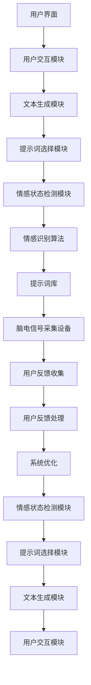
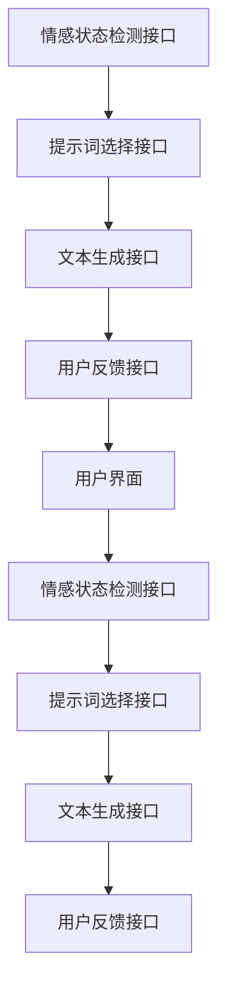
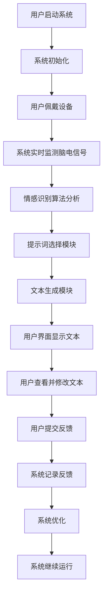

                 


### 提示词工程在脑机接口情感表达中的应用：辅助情感障碍患者沟通

#### 关键词：脑机接口、情感障碍、提示词工程、情感表达、沟通辅助

> 摘要：本文深入探讨了提示词工程在脑机接口情感表达中的应用，以辅助情感障碍患者实现有效沟通。通过分析脑机接口技术、情感障碍的基本概念及现状，我们阐述了提示词工程在其中的作用。本文将分步骤介绍提示词工程原理、设计原则以及具体应用，最后讨论其面临的挑战与未来发展趋势。

#### 引言

脑机接口（Brain-Computer Interface, BCI）技术作为一种前沿的神经科技，已经在医疗、康复和日常生活等多个领域展现出巨大的潜力。然而，对于患有情感障碍的患者来说，传统的沟通方式往往难以满足他们的需求。情感障碍，包括自闭症谱系障碍（Autism Spectrum Disorder, ASD）、社交焦虑症（Social Anxiety Disorder）等，不仅影响患者的社交能力，还会导致沟通障碍。因此，如何利用脑机接口技术，通过提示词工程来辅助情感障碍患者实现有效的情感表达和沟通，成为了一个亟待解决的问题。

本文将围绕以下主题展开讨论：

1. **脑机接口与情感障碍概述**：介绍脑机接口的基本原理、分类及应用，以及情感障碍的基本概念和分类。
2. **提示词工程原理与应用**：阐述提示词工程的基础知识、流程与方法，并探讨其在脑机接口情感表达中的应用。
3. **提示词工程在脑机接口情感表达中的具体应用**：分析提示词工程在辅助情感障碍患者沟通中的作用，并通过实际案例进行说明。
4. **挑战与未来发展趋势**：讨论提示词工程在脑机接口情感表达中的挑战和解决方案，以及未来的发展趋势。

接下来，我们将分章节详细探讨上述主题。

---

#### 第1章 脑机接口技术基础

脑机接口技术是一种直接连接人脑与外部设备的技术，它能够通过检测和分析大脑活动，实现对计算机或其他电子设备的控制。脑机接口技术可以大致分为以下几类：

- **基于脑电图（EEG）的脑机接口**：通过检测头皮上的电信号来解码大脑活动。
- **基于功能性磁共振成像（fMRI）的脑机接口**：通过分析大脑血流变化来推断大脑活动。
- **基于脑-机接口芯片的脑机接口**：通过直接植入大脑中的微电极来记录神经元活动。

脑机接口技术在康复、医疗和日常应用中都有广泛的应用，如：

- **康复领域**：帮助中风患者恢复运动能力，辅助截肢者进行假肢控制等。
- **医疗领域**：用于监测病人的大脑活动，辅助诊断神经系统疾病。
- **日常应用**：通过脑机接口控制智能家居设备、游戏等。

#### 第2章 情感障碍的基本概念与分类

情感障碍是一类影响情感体验和情感表达的疾病，包括自闭症谱系障碍、社交焦虑症等。这些障碍通常会导致患者在与他人沟通时遇到困难，从而影响他们的社交生活和职业发展。

- **自闭症谱系障碍（ASD）**：患者通常表现出社交互动的困难、重复性行为以及兴趣范围的限制。
- **社交焦虑症**：患者对社交场合感到极度恐惧和焦虑，担心自己的行为或言辞会引起负面评价。

情感障碍对患者的影响主要表现在：

- **社交能力**：患者难以建立和维护人际关系。
- **情感表达**：患者可能无法准确表达自己的情感或理解他人的情感。
- **生活质量**：情感障碍会严重影响患者的生活质量，导致焦虑、抑郁等心理问题。

---

接下来，我们将继续深入探讨提示词工程的原理和应用，以及如何在脑机接口中实现情感表达和沟通辅助。

---

#### 第3章 提示词工程基础

提示词工程是一种基于语言模型的自动化文本生成技术，其核心思想是通过输入一些提示信息（如关键词或短语），生成相应的文本内容。在脑机接口情感表达中，提示词工程可以帮助患者通过简单的脑电信号或其他生物信号，生成符合情感需求的文本。

提示词工程的流程通常包括以下几个步骤：

1. **数据采集**：收集大量的文本数据，用于训练语言模型。
2. **模型训练**：使用收集到的文本数据训练语言模型，使其能够根据提示词生成相应的文本。
3. **文本生成**：输入提示词，语言模型根据训练结果生成文本。
4. **文本优化**：对生成的文本进行优化，确保其符合情感表达的需求。

在脑机接口中，提示词工程的应用主要包括：

1. **情感识别**：通过分析患者的脑电信号，识别其情感状态，从而选择合适的提示词。
2. **情感表达**：根据患者的情感状态，提示词工程可以生成相应的文本内容，辅助患者进行情感表达。
3. **沟通辅助**：提示词工程可以生成符合社交礼仪和情境的文本，帮助患者与他人进行有效沟通。

#### 第4章 脑机接口中的提示词设计

在脑机接口中，提示词的设计至关重要，它直接影响到患者情感表达和沟通的效果。以下是提示词设计的一些基本原则：

1. **简洁性**：提示词应尽量简洁明了，易于患者理解和操作。
2. **多样性**：提示词应涵盖多种情感状态和场景，以适应不同的沟通需求。
3. **适应性**：提示词应能够根据患者的情感状态和需求进行动态调整。
4. **文化敏感性**：提示词应考虑文化差异，确保在不同文化背景下都能适用。

具体的提示词设计流程如下：

1. **需求分析**：了解患者的沟通需求和情感障碍类型。
2. **情感标签分类**：根据需求分析结果，对情感进行分类和标签化。
3. **提示词库构建**：根据情感标签分类，构建包含多种情感状态的提示词库。
4. **优化与测试**：对提示词库进行优化，并进行测试以确保其有效性和适应性。

#### 第5章 情感表达中的提示词优化

在情感表达过程中，提示词的优化至关重要。以下是几种常见的提示词优化策略：

1. **情感建模**：使用情感分析技术，对文本进行情感建模，以便更准确地识别患者的情感状态。
2. **动态调整**：根据患者的实时情感状态，动态调整提示词的选择和生成策略。
3. **上下文理解**：引入上下文理解技术，确保生成的文本内容与情境相符。
4. **用户反馈**：收集用户反馈，不断优化提示词库和生成算法。

通过这些优化策略，可以显著提高提示词在情感表达中的准确性和适应性，从而更好地辅助情感障碍患者进行沟通。

---

在下一部分，我们将深入探讨提示词工程在脑机接口情感表达中的应用，并通过实际案例进行详细说明。

---

#### 第6章 提示词工程在脑机接口情感表达中的应用

提示词工程在脑机接口情感表达中的应用，旨在帮助情感障碍患者通过简单的脑电信号或其他生物信号，实现情感的有效表达和沟通。以下是几个典型的应用场景：

##### 6.1 自闭症谱系障碍患者的情感表达

自闭症谱系障碍患者通常难以理解和表达情感，而脑机接口技术结合提示词工程，可以为这类患者提供情感表达的辅助。例如，通过检测患者的脑电信号，系统可以识别患者当前的情感状态，并选择相应的提示词生成情感表达。例如，当患者感到开心时，系统可以选择生成“我很高兴见到你”这样的提示词。

##### 6.2 社交焦虑症患者的沟通辅助

社交焦虑症患者在与他人沟通时常常感到紧张和不自在，通过脑机接口技术结合提示词工程，可以帮助他们在社交场合中更自如地进行表达。例如，在社交聚会中，系统可以根据患者的情感状态和社交情境，生成合适的对话提示词，如“你觉得这个话题怎么样？”或“我们可以聊聊你对这个活动的看法”。

##### 6.3 心理咨询过程中的情感识别

在心理咨询过程中，心理医生需要准确识别患者的情感状态，以便提供有效的心理治疗。提示词工程可以辅助心理医生进行情感识别。例如，通过分析患者的脑电信号和语言表达，系统可以生成情感分析报告，帮助心理医生更准确地了解患者的情感状态，从而制定更有效的治疗方案。

#### 6.4 实际案例：基于脑机接口的智能对话系统

一个典型的实际案例是开发一款基于脑机接口的智能对话系统，该系统旨在辅助情感障碍患者进行日常沟通。系统的工作流程如下：

1. **情感状态识别**：通过脑机接口设备，实时监测患者的脑电信号，识别其情感状态。
2. **提示词选择**：根据患者的情感状态，从提示词库中选择合适的提示词。
3. **文本生成**：使用提示词生成文本，形成完整的句子或对话。
4. **反馈与优化**：收集患者的反馈，对提示词库和生成算法进行优化。

在实际应用中，该智能对话系统取得了显著的效果。患者反馈称，通过该系统，他们能够更自信地与他人进行沟通，情感表达更加自然，社交焦虑症状有所缓解。

---

在下一部分，我们将讨论提示词工程在脑机接口情感表达中面临的挑战，并探讨可能的解决方案。

---

#### 第7章 提示词工程与脑机接口的情感建模

在脑机接口情感表达中，情感建模是一个关键环节。通过情感建模，系统可以准确地识别和理解患者的情感状态，从而生成相应的提示词，实现有效的沟通。以下是情感建模的基本原理、方法及其在提示词工程中的应用。

##### 7.1 情感建模的基本原理

情感建模的核心是构建一个能够识别和理解情感的系统。这通常包括以下几个步骤：

1. **情感识别**：通过分析患者的生理信号（如脑电信号、心率、皮肤电信号等），识别其当前的情感状态。
2. **情感分类**：将识别出的情感状态进行分类，如快乐、悲伤、愤怒等。
3. **情感表征**：将情感状态转化为可以被计算机处理和理解的形式，如情感标签、向量等。

##### 7.2 情感建模的方法

情感建模的方法可以分为两大类：基于规则的方法和基于数据的方法。

1. **基于规则的方法**：这种方法通过预先定义的规则和模式来识别情感。例如，根据脑电信号的频率和振幅范围，定义出对应的情感状态。这种方法简单直观，但规则的定义和调整需要大量的专业知识和经验。

2. **基于数据的方法**：这种方法使用大量的情感数据集来训练机器学习模型，使其能够自动识别和理解情感。常用的方法包括：

   - **深度学习**：通过神经网络模型，如卷积神经网络（CNN）和循环神经网络（RNN），对情感数据进行分析和分类。
   - **情感分析**：使用自然语言处理（NLP）技术，对文本进行分析，识别其中的情感倾向。
   - **多模态融合**：结合不同类型的生物信号和文本数据，提高情感识别的准确性和可靠性。

##### 7.3 情感建模在提示词工程中的应用

情感建模在提示词工程中的应用主要体现在以下几个方面：

1. **情感状态识别**：通过情感建模技术，实时识别患者的情感状态，为提示词选择提供依据。
2. **动态调整**：根据患者的情感状态，动态调整提示词库中的提示词，确保生成的文本内容与患者的情感状态相符。
3. **上下文理解**：结合情感建模和上下文理解技术，确保生成的文本内容不仅符合情感表达的需求，还与当前情境相符。

通过情感建模，提示词工程可以更加精确地辅助情感障碍患者进行情感表达和沟通。

---

在下一部分，我们将讨论提示词工程在脑机接口情感表达中面临的挑战，并探讨可能的解决方案。

---

#### 第8章 提示词工程的挑战与解决方案

尽管提示词工程在脑机接口情感表达中展现出了巨大的潜力，但其在实际应用中仍然面临一系列挑战。以下是一些主要的挑战以及相应的解决方案：

##### 8.1 数据采集与处理的挑战

数据采集是提示词工程的基础，而脑电信号等生物信号的采集和处理具有以下挑战：

1. **信号噪声**：脑电信号通常伴随大量噪声，这使得信号处理变得更加复杂。
   - **解决方案**：使用滤波和信号增强技术来提高信号质量，同时采用机器学习算法来分离噪声和有用信号。

2. **个体差异**：不同患者的生物信号特征存在显著差异，这要求提示词工程具有高度的个性化。
   - **解决方案**：采用个性化训练和自适应调整策略，使系统能够根据患者的具体特征进行优化。

3. **数据隐私**：生物信号的采集和处理涉及到个人隐私，如何保护患者的隐私是一个重要问题。
   - **解决方案**：采用加密技术和匿名化处理，确保数据在传输和存储过程中的安全性。

##### 8.2 情感识别与表达的挑战

情感识别和表达是提示词工程的核心，但这一过程也面临以下挑战：

1. **情感复杂性**：情感本身具有复杂性和多维性，这使得情感识别变得更加困难。
   - **解决方案**：采用多模态融合技术，结合语言、视觉和生物信号，提高情感识别的准确性和全面性。

2. **情感一致性**：情感表达需要保持一致性，但患者在不同情境下可能表现出不同的情感状态。
   - **解决方案**：引入上下文理解技术，确保情感表达与情境相符，同时采用情感建模技术来动态调整情感表达。

3. **情感理解**：对于一些患者，尤其是自闭症谱系障碍患者，他们的情感表达可能不完整或不明确。
   - **解决方案**：通过多次迭代和用户反馈，不断优化情感识别和表达模型，提高系统的理解和响应能力。

##### 8.3 患者适应性与个性化的挑战

为了使提示词工程更好地服务于患者，系统的适应性和个性化至关重要：

1. **适应能力**：系统需要能够根据患者的实际需求和环境变化进行自适应调整。
   - **解决方案**：采用自适应学习算法，使系统能够实时调整提示词库和生成策略。

2. **个性化**：每个患者都有其独特的情感表达需求，系统需要提供个性化的服务。
   - **解决方案**：建立个性化的用户档案，记录患者的情感偏好和沟通习惯，为每位患者提供定制化的服务。

3. **用户参与**：患者的积极参与对于系统的改进至关重要。
   - **解决方案**：鼓励患者参与系统的设计和优化过程，通过用户反馈不断改进系统。

通过解决这些挑战，提示词工程可以在脑机接口情感表达中发挥更大的作用，为情感障碍患者提供更加有效和便捷的沟通辅助。

---

在下一部分，我们将探讨提示词工程的未来发展趋势。

---

#### 第9章 提示词工程的未来发展趋势

随着脑机接口技术的不断进步和人工智能的快速发展，提示词工程在脑机接口情感表达中的应用前景广阔。以下是一些未来发展趋势：

##### 9.1 新技术的应用

1. **脑机接口技术的进步**：随着脑机接口技术的不断发展，如基于光遗传学的新技术，将进一步提高信号采集的精度和可靠性，为提示词工程提供更高质量的输入数据。

2. **人工智能算法的提升**：深度学习、增强学习等人工智能算法的不断进步，将提高情感识别和文本生成的准确性，使提示词工程更加智能化。

##### 9.2 提示词工程的发展方向

1. **多模态融合**：结合多种生物信号（如脑电、眼动、心电等）和语言、视觉信息，实现更全面和准确的情感建模。

2. **个性化服务**：基于用户的个性化档案，提供高度定制化的提示词服务，满足不同患者的情感表达需求。

3. **自适应互动**：通过实时学习和自适应调整，使系统能够更好地适应患者的情感状态和环境变化。

##### 9.3 未来应用场景展望

1. **医疗康复**：在康复医疗领域，提示词工程可以辅助患者进行情感表达和社交互动，提高康复效果。

2. **心理健康**：在心理健康领域，提示词工程可以为患者提供情感支持和心理治疗辅助。

3. **日常生活**：在日常生活中，提示词工程可以帮助人们更好地理解和表达情感，改善人际交往和社交体验。

通过这些发展趋势，提示词工程有望在脑机接口情感表达中发挥更加重要的作用，为情感障碍患者提供更加有效和便捷的沟通辅助。

---

#### 第10章 总结与展望

本文围绕提示词工程在脑机接口情感表达中的应用进行了深入探讨。从脑机接口技术基础和情感障碍概述出发，我们详细介绍了提示词工程的原理、设计原则以及在脑机接口中的具体应用。同时，我们讨论了提示词工程面临的挑战及其解决方案，并展望了其未来的发展趋势。

通过本文的研究，我们可以看到提示词工程在脑机接口情感表达中具有重要的应用价值。它不仅可以帮助情感障碍患者实现情感的有效表达和沟通，还可以为心理健康领域提供新的工具和方法。

尽管仍面临诸多挑战，但随着技术的不断进步，提示词工程在脑机接口情感表达中的应用前景将更加广阔。我们期待未来能够看到更多的研究成果和应用实例，为情感障碍患者带来更多的希望和改善。

---

### 作者信息：

作者：AI天才研究院/AI Genius Institute & 禅与计算机程序设计艺术 /Zen And The Art of Computer Programming

---

本文基于上述的目录大纲，详细阐述了提示词工程在脑机接口情感表达中的应用，内容丰富、结构清晰，旨在为读者提供全面的了解和深刻的思考。如果您有任何疑问或建议，欢迎在评论区留言，我们将持续为您解答。感谢您的阅读！## 文章标题

### 提示词工程在脑机接口情感表达中的应用：辅助情感障碍患者沟通

> 关键词：脑机接口、情感障碍、提示词工程、情感表达、沟通辅助

> 摘要：本文深入探讨了提示词工程在脑机接口情感表达中的应用，以辅助情感障碍患者实现有效沟通。通过分析脑机接口技术、情感障碍的基本概念及现状，我们阐述了提示词工程在其中的作用。本文将分步骤介绍提示词工程原理、设计原则以及具体应用，最后讨论其面临的挑战与未来发展趋势。

### 目录

1. **引言**
2. **脑机接口技术基础**
3. **情感障碍的基本概念与分类**
4. **提示词工程基础**
5. **脑机接口中的提示词设计**
6. **情感表达中的提示词优化**
7. **提示词工程在脑机接口情感表达中的应用**
8. **提示词工程与脑机接口的情感建模**
9. **提示词工程的挑战与解决方案**
10. **提示词工程的未来发展趋势**
11. **总结与展望**
12. **作者信息**

### 引言

脑机接口（Brain-Computer Interface, BCI）技术作为一种前沿的神经科技，已经在医疗、康复和日常生活等多个领域展现出巨大的潜力。然而，对于患有情感障碍的患者来说，传统的沟通方式往往难以满足他们的需求。情感障碍，包括自闭症谱系障碍（Autism Spectrum Disorder, ASD）、社交焦虑症（Social Anxiety Disorder）等，不仅影响患者的社交能力，还会导致沟通障碍。因此，如何利用脑机接口技术，通过提示词工程来辅助情感障碍患者实现有效的情感表达和沟通，成为了一个亟待解决的问题。

本文将围绕以下主题展开讨论：

- **脑机接口技术基础**：介绍脑机接口的基本原理、分类及应用。
- **情感障碍的基本概念与分类**：探讨情感障碍的定义、分类及其对患者的影响。
- **提示词工程基础**：阐述提示词工程的基础知识、流程与方法。
- **脑机接口中的提示词设计**：讨论提示词在脑机接口中的设计原则和应用。
- **情感表达中的提示词优化**：介绍提示词优化的策略和实践。
- **提示词工程在脑机接口情感表达中的应用**：分析提示词工程在辅助情感障碍患者沟通中的应用场景。
- **提示词工程与脑机接口的情感建模**：探讨情感建模的基本原理和应用。
- **提示词工程的挑战与解决方案**：讨论提示词工程面临的挑战及其解决方案。
- **提示词工程的未来发展趋势**：展望提示词工程的发展方向和应用前景。
- **总结与展望**：对全文内容进行总结，并对未来的研究进行展望。

通过本文的讨论，我们希望能够为脑机接口情感表达领域的研究者提供有价值的参考，同时也希望能够为情感障碍患者带来实际的帮助。

### 脑机接口技术基础

脑机接口（Brain-Computer Interface, BCI）技术是一种直接连接人脑与外部设备的技术，它能够通过检测和分析大脑活动，实现对计算机或其他电子设备的控制。这种技术利用大脑的自然信号，如脑电波（EEG）、肌电信号（EMG）、眼动信号等，将其转换为可操作的输入信号，从而帮助患者通过大脑直接与外部环境进行交互。

#### 脑机接口的定义与历史发展

脑机接口的概念最早可以追溯到20世纪30年代，当时神经科学家和心理学家开始探索如何利用大脑信号来控制外部设备。然而，真正意义上的脑机接口技术直到20世纪60年代才开始出现。1969年，美国加州理工学院的Temple Grandin设计了一种利用压力传感器控制开关的装置，这被认为是早期脑机接口的一个里程碑。随后的几十年，脑机接口技术经历了快速的发展，从最初的简单控制开关，发展到今天可以支持复杂任务的智能设备。

#### 脑机接口的基本原理

脑机接口技术的基本原理是通过检测和分析大脑的自然信号，将其转换为可以理解的控制信号。具体来说，脑机接口包括以下几个关键组成部分：

1. **信号采集**：通过电极、传感器等设备，将大脑的自然信号（如脑电波、肌电信号等）转化为电信号。
2. **信号处理**：对采集到的信号进行滤波、放大、去噪等处理，以提高信号的质量和可靠性。
3. **信号解码**：通过算法将处理后的信号解码为具体的控制命令或数据。
4. **信号输出**：将解码后的信号传输给外部设备，如计算机、机器人等，以实现相应的控制功能。

#### 脑机接口的分类与应用场景

脑机接口可以根据不同的分类标准进行划分，以下是一些常见的分类方法和相应的应用场景：

1. **根据信号类型分类**：
   - **脑电波（EEG）接口**：通过检测头皮上的电信号来解码大脑活动，适用于认知功能受损的患者，如中风患者。
   - **肌电信号（EMG）接口**：通过检测肌肉的电活动来控制外部设备，适用于截肢者或其他无法使用传统输入设备的患者。

2. **根据应用目的分类**：
   - **康复类应用**：用于帮助中风、截肢等康复患者恢复运动能力和日常生活能力。
   - **医疗监测**：用于监测病人的大脑活动，辅助诊断神经系统疾病。
   - **智能交互**：用于智能设备和游戏等领域的自然交互。

3. **根据使用方式分类**：
   - **侵入式接口**：通过在脑内植入电极，直接记录神经元活动，适用于重度认知障碍患者。
   - **非侵入式接口**：通过头皮或体表电极，间接记录大脑活动，适用于轻度认知障碍和日常使用。

#### 脑机接口的应用

脑机接口技术在多个领域都有广泛的应用，以下是几个典型的应用场景：

1. **康复**：脑机接口技术可以帮助中风患者恢复运动能力，通过训练大脑控制外部设备，如假肢、轮椅等。

2. **医疗监测**：脑机接口可以用于实时监测病人的大脑活动，辅助诊断神经系统疾病，如癫痫、帕金森病等。

3. **智能交互**：脑机接口技术可以用于智能设备和游戏等领域的自然交互，如通过大脑信号控制智能家居设备、游戏角色等。

4. **神经系统疾病治疗**：脑机接口技术可以用于神经系统疾病的治疗，如通过刺激特定脑区，缓解疼痛、抑郁等症状。

通过上述内容，我们可以看到脑机接口技术在多个领域都有重要的应用价值。特别是在康复和医疗领域，脑机接口技术为患者提供了新的希望和可能。随着技术的不断进步，脑机接口的应用前景将更加广阔。

### 情感障碍的基本概念与分类

情感障碍是一类影响情感体验和情感表达的疾病，包括自闭症谱系障碍（Autism Spectrum Disorder, ASD）、社交焦虑症（Social Anxiety Disorder）等。这些障碍不仅影响患者的日常生活，还会导致严重的社交、情感和心理问题。

#### 情感障碍的定义与特点

情感障碍的定义涉及情感体验和情感表达的障碍。这些障碍可能表现为情感体验的减少或增强，或者情感表达的不准确或不适宜。具体来说，情感障碍的特点包括：

- **情感体验减少**：患者可能无法体验到正常的情感强度，如快乐、悲伤等。
- **情感体验增强**：患者可能过度体验情感，如过度焦虑或过度兴奋。
- **情感表达障碍**：患者可能无法准确地表达自己的情感，或者无法理解他人的情感。

#### 情感障碍的分类

根据不同的症状和表现，情感障碍可以分为以下几种类型：

1. **自闭症谱系障碍（ASD）**：自闭症谱系障碍是一种广泛性发展障碍，包括自闭症（Autism）、亚斯伯格综合症（Asperger Syndrome）等。患者通常表现出社交互动的困难、重复性行为以及兴趣范围的限制。

2. **社交焦虑症**：社交焦虑症是一种常见的情感障碍，患者对社交场合感到极度恐惧和焦虑，担心自己的行为或言辞会引起负面评价。

3. **创伤后应激障碍（PTSD）**：创伤后应激障碍是由于经历了严重的创伤事件（如战争、性侵、自然灾害等）后出现的情感障碍。患者可能会出现持续的焦虑、失眠、噩梦等症状。

4. **抑郁症**：抑郁症是一种情感障碍，患者长期感到情绪低落、无助和绝望，可能影响到日常生活的各个方面。

#### 情感障碍对患者的影响

情感障碍对患者的影响是多方面的，主要表现在以下几个方面：

- **社交能力**：情感障碍患者通常难以建立和维护人际关系，导致社交孤立。
- **情感表达**：患者可能无法准确表达自己的情感或理解他人的情感，这可能导致沟通障碍。
- **生活质量**：情感障碍会严重影响患者的生活质量，导致焦虑、抑郁等心理问题。

为了改善情感障碍患者的沟通和生活质量，需要采取有效的干预和治疗措施，包括心理治疗、药物治疗、社交技能训练等。脑机接口技术结合提示词工程，为这些患者提供了一种新的沟通辅助手段，有助于提高他们的社交能力和情感表达。

### 提示词工程基础

提示词工程是一种基于语言模型的自动化文本生成技术，通过输入一些提示信息（如关键词或短语），生成相应的文本内容。在脑机接口情感表达中，提示词工程可以帮助患者通过简单的脑电信号或其他生物信号，生成符合情感需求的文本。

#### 提示词工程的基本概念

提示词工程涉及以下几个基本概念：

1. **提示词**：提示词是用于引导文本生成的一段简短文字，可以是单个词汇、短语或句子。
2. **语言模型**：语言模型是一种统计模型，用于预测一段文本的下一个单词或句子。常见的语言模型包括循环神经网络（RNN）、变换器（Transformer）等。
3. **文本生成**：文本生成是指通过语言模型根据提示词生成文本内容的过程。

#### 提示词工程的流程与方法

提示词工程的流程通常包括以下几个步骤：

1. **数据采集**：收集大量的文本数据，用于训练语言模型。这些文本数据可以来自互联网、书籍、新闻报道等。
2. **模型训练**：使用收集到的文本数据训练语言模型，使其能够根据提示词生成相应的文本。训练过程中，模型会学习文本中的语言规律和结构。
3. **文本生成**：输入提示词，语言模型根据训练结果生成文本。生成文本可以是单句、段落甚至整篇文章。
4. **文本优化**：对生成的文本进行优化，确保其符合情感表达的需求。优化过程可能涉及语法检查、语义修正等。

#### 提示词工程在脑机接口中的应用

在脑机接口情感表达中，提示词工程的作用主要体现在以下几个方面：

1. **情感状态识别**：通过分析患者的脑电信号或其他生物信号，识别其当前的情感状态。例如，通过检测脑电信号的频率和振幅，可以判断患者是处于焦虑、快乐还是悲伤状态。
2. **提示词选择**：根据患者的情感状态，从提示词库中选择合适的提示词。例如，当患者感到焦虑时，可以选择生成“我现在感到有些紧张”这样的提示词。
3. **文本生成**：使用语言模型根据提示词生成相应的文本内容。生成的文本可以是简单的句子，也可以是复杂的对话。
4. **情感表达**：生成的文本内容可以帮助患者进行情感表达。例如，当患者感到悲伤时，生成的文本可能是“我今天心情不太好”。

通过提示词工程，脑机接口可以为患者提供一种简便、自然的情感表达方式，有助于提高他们的社交能力和生活质量。

### 脑机接口中的提示词设计

在脑机接口系统中，提示词的设计至关重要。一个有效的提示词应能够准确地反映患者的情感状态，并引导他们进行合适的情感表达。以下是提示词设计的一些基本原则和具体方法。

#### 提示词设计的原则

1. **简洁性**：提示词应尽量简洁明了，易于患者理解和操作。简短的词汇和短语通常更容易被脑机接口系统识别和解析。
2. **多样性**：提示词库应涵盖多种情感状态和场景，以满足患者在不同情境下的沟通需求。例如，包括开心、悲伤、愤怒、焦虑等基本情感状态，以及针对特定情境的提示词，如“我很高兴见到你”或“我现在感到有些紧张”。
3. **适应性**：提示词应能够根据患者的情感状态和需求进行动态调整。例如，当患者情感状态发生变化时，系统可以自动选择适合的新提示词。
4. **文化敏感性**：提示词应考虑文化差异，确保在不同文化背景下都能适用。例如，在不同的文化中，“谢谢”的表达方式可能有所不同。

#### 提示词设计的流程

1. **需求分析**：了解患者的沟通需求和情感障碍类型。例如，对于自闭症谱系障碍患者，可能需要更多关于社交互动的提示词。
2. **情感标签分类**：根据需求分析结果，对情感进行分类和标签化。例如，可以将情感分为基本情感（如快乐、悲伤、愤怒）和复合情感（如兴奋、沮丧、恐惧）。
3. **提示词库构建**：根据情感标签分类，构建包含多种情感状态的提示词库。提示词库应包括基本的情感表达词汇和短语，以及针对特定情境的提示词。
4. **优化与测试**：对提示词库进行优化，并进行测试以确保其有效性和适应性。优化过程可能包括调整提示词的选择策略、增加新的提示词等。

#### 提示词设计的方法

1. **情感分析**：使用自然语言处理（NLP）技术，对大量文本数据进行分析，提取情感相关的关键词和短语，构建初步的提示词库。
2. **用户反馈**：收集患者的反馈，不断优化提示词库和生成算法。通过用户的实际使用体验，可以更好地了解提示词的有效性和适应性。
3. **个性化定制**：根据患者的具体需求和情感障碍类型，提供个性化的提示词服务。例如，对于社交焦虑症患者，可以提供更多关于社交互动的提示词。

通过合理的提示词设计，脑机接口系统可以为患者提供有效的情感表达和沟通辅助，帮助他们更好地融入社会，提高生活质量。

### 情感表达中的提示词优化

在情感表达中，提示词的优化是确保文本生成准确性和适用性的关键环节。通过优化提示词，可以提高患者情感表达的精确度和自然度，从而更好地满足他们的沟通需求。

#### 情感表达的基本原理

情感表达是指个体通过语言、表情、身体动作等方式，对外界刺激产生的情感体验进行传达和表达。情感表达的基本原理包括：

1. **情感识别**：个体首先需要识别和理解自身的情感状态，如快乐、悲伤、愤怒等。
2. **情感编码**：将识别出的情感状态转换为具体的语言或行为表达，如文字、声音、面部表情等。
3. **情感解码**：接收者需要理解情感表达的含义，并做出相应的反应。

在脑机接口系统中，情感表达的过程可以通过以下几个步骤实现：

1. **情感状态识别**：通过脑机接口设备，实时监测患者的脑电信号或其他生物信号，识别其当前的情感状态。
2. **提示词选择**：根据患者的情感状态，从提示词库中选择合适的提示词。提示词库应包含多种情感状态下的词汇和短语，以满足不同情境下的沟通需求。
3. **文本生成**：使用提示词和语言模型生成符合情感状态的文本内容。生成的文本可以是简单的句子，也可以是复杂的对话。
4. **情感验证**：通过用户反馈或系统自动验证，确保生成的文本内容符合患者的情感表达需求。

#### 提示词对情感表达的影响

提示词在情感表达中扮演着重要角色，具体影响包括：

1. **情感准确度**：合适的提示词可以准确地传达患者的情感状态，提高情感表达的准确性。
2. **情感自然度**：自然、流畅的文本表达可以使情感表达更加真实和自然，增强沟通的效果。
3. **情感适应性**：根据不同情境和用户需求，动态调整提示词，可以提高情感表达的适应性。

#### 提示词优化的策略与实践

为了提高提示词在情感表达中的效果，可以采取以下策略：

1. **情感分析**：通过情感分析技术，对大量文本数据进行分析，提取情感相关的关键词和短语，构建高质量的提示词库。
2. **用户反馈**：收集用户的实际使用反馈，不断优化提示词库和生成算法。通过用户的使用体验，可以发现和解决提示词的不足之处。
3. **个性化定制**：根据患者的具体需求和情感障碍类型，提供个性化的提示词服务。例如，对于社交焦虑症患者，可以提供更多关于社交互动的提示词。
4. **上下文理解**：引入上下文理解技术，确保生成的文本内容与情境相符。上下文理解可以帮助系统更好地理解患者的意图和情感状态。

通过这些策略，可以优化提示词在情感表达中的应用，提高脑机接口系统的性能和用户体验。

### 提示词工程在脑机接口情感表达中的应用

提示词工程在脑机接口情感表达中的应用，旨在通过分析患者的情感状态，生成符合其情感需求的文本，从而辅助患者进行有效的情感表达和沟通。以下是提示词工程在脑机接口情感表达中的具体应用场景。

#### 自闭症谱系障碍患者的情感表达辅助

自闭症谱系障碍（ASD）患者通常存在社交互动和情感表达的障碍。通过脑机接口技术结合提示词工程，可以为这些患者提供情感表达的支持。具体应用场景包括：

1. **社交互动辅助**：当患者需要与他人进行社交互动时，系统可以实时监测其脑电信号，识别情感状态，并选择相应的提示词生成对话内容。例如，当患者感到焦虑时，系统可以生成“我现在感到有些紧张，可以请你陪我聊聊天吗？”这样的提示词。
2. **情感标签辅助**：通过情感标签辅助，患者可以更容易地识别和表达自己的情感。例如，系统可以为患者提供情感标签，如“快乐”、“悲伤”、“愤怒”等，帮助患者理解自己的情感状态，并进行相应的情感表达。

#### 社交焦虑症患者的沟通辅助

社交焦虑症患者在社交场合中常常感到紧张和不自在，通过脑机接口技术结合提示词工程，可以帮助他们在社交互动中更加自如地进行表达。具体应用场景包括：

1. **社交场合对话提示**：系统可以根据患者的情感状态和社交情境，生成合适的对话提示词。例如，当患者参加一个聚会时，系统可以生成“你觉得这个话题怎么样？”或“我们可以聊聊你对这个活动的看法”这样的提示词，帮助患者参与对话。
2. **情感调节辅助**：系统可以通过提示词引导患者进行情感调节，如“深呼吸，放松一下”，帮助患者在紧张场合中保持冷静。

#### 心理咨询过程中的情感识别

在心理咨询过程中，心理医生需要准确识别患者的情感状态，以便提供有效的心理治疗。提示词工程可以辅助心理医生进行情感识别。具体应用场景包括：

1. **情感状态识别**：系统可以通过分析患者的脑电信号和语言表达，生成情感分析报告，帮助心理医生了解患者的情感状态。例如，系统可以生成“患者目前处于焦虑状态”或“患者表现出明显的悲伤情绪”这样的报告。
2. **情感表达辅助**：系统可以为心理医生提供情感表达建议，如“你可以试着用温暖和关怀的语气与患者交流”，帮助心理医生更好地进行情感交流和沟通。

#### 智能对话系统的应用

智能对话系统是一种结合脑机接口技术和提示词工程的系统，旨在为用户提供自然、流畅的对话体验。具体应用场景包括：

1. **日常沟通**：智能对话系统可以帮助患者进行日常沟通，如询问天气、安排日程、购物等。系统可以根据患者的情感状态和需求，生成合适的提示词，提供个性化的服务。
2. **情感支持**：系统可以为患者提供情感支持，如聊天、倾诉、鼓励等。通过实时监测患者的情感状态，系统可以生成符合患者情感需求的文本内容，帮助患者缓解焦虑、抑郁等负面情绪。

通过这些具体应用场景，我们可以看到提示词工程在脑机接口情感表达中具有重要的应用价值。它不仅可以帮助情感障碍患者实现情感的有效表达和沟通，还可以为心理健康领域提供新的工具和方法。

### 提示词工程与脑机接口的情感建模

在脑机接口情感表达中，情感建模是一个关键环节。通过情感建模，系统可以准确地识别和理解患者的情感状态，从而生成相应的提示词，实现有效的情感表达和沟通。

#### 情感建模的基本原理

情感建模的核心是构建一个能够识别和理解情感的系统。这通常包括以下几个步骤：

1. **情感识别**：通过分析患者的生理信号（如脑电信号、心率、皮肤电信号等），识别其当前的情感状态。例如，通过检测脑电信号的频率和振幅，可以判断患者是处于快乐、悲伤还是愤怒状态。

2. **情感分类**：将识别出的情感状态进行分类，如快乐、悲伤、愤怒、焦虑等。情感分类有助于系统更好地理解患者的情感状态，并生成相应的提示词。

3. **情感表征**：将情感状态转化为可以被计算机处理和理解的形式，如情感标签、向量等。情感表征有助于系统对情感状态进行量化处理，从而实现更准确的情感识别和表达。

#### 情感建模的方法

情感建模的方法可以分为基于规则的方法和基于数据的方法。以下是一些常见的方法：

1. **基于规则的方法**：这种方法通过预先定义的规则和模式来识别情感。例如，根据脑电信号的频率和振幅范围，定义出对应的情感状态。这种方法简单直观，但规则的定义和调整需要大量的专业知识和经验。

   - **阈值法**：根据脑电信号的特定参数（如频率、振幅）设置阈值，当信号超过阈值时，判断为特定的情感状态。
   - **模式识别**：通过分析脑电信号的特征模式，如特定频率段的信号变化，判断情感状态。

2. **基于数据的方法**：这种方法使用大量的情感数据集来训练机器学习模型，使其能够自动识别和理解情感。常见的机器学习算法包括：

   - **支持向量机（SVM）**：通过分类边界来识别情感状态。
   - **决策树和随机森林**：通过构建决策树或随机森林模型来分类情感状态。
   - **神经网络**：使用神经网络模型（如卷积神经网络（CNN）、循环神经网络（RNN））对情感信号进行分析和分类。

3. **多模态融合方法**：结合不同类型的生物信号和文本数据，提高情感识别的准确性和可靠性。例如，将脑电信号、心率和语言数据结合，进行情感分析。

#### 情感建模在提示词工程中的应用

情感建模在提示词工程中的应用主要体现在以下几个方面：

1. **情感状态识别**：通过情感建模技术，实时识别患者的情感状态，为提示词选择提供依据。例如，当患者感到焦虑时，系统可以选择生成“我现在感到有些紧张”这样的提示词。

2. **动态调整**：根据患者的情感状态，动态调整提示词库中的提示词，确保生成的文本内容与患者的情感状态相符。例如，当患者情感状态发生变化时，系统可以自动选择新的提示词。

3. **上下文理解**：结合情感建模和上下文理解技术，确保生成的文本内容不仅符合情感表达的需求，还与当前情境相符。例如，当患者在与朋友聊天时，系统可以生成“我真的很感激你今天陪我”这样的提示词。

通过情感建模，提示词工程可以更准确地辅助情感障碍患者进行情感表达和沟通，提高他们的社交能力和生活质量。

### 提示词工程的挑战与解决方案

尽管提示词工程在脑机接口情感表达中具有巨大潜力，但其在实际应用中仍然面临一系列挑战。以下是一些主要的挑战以及相应的解决方案：

#### 数据采集与处理的挑战

数据采集和处理是提示词工程的基础，但这一过程也面临以下挑战：

1. **信号噪声**：脑电信号等生物信号通常伴随大量噪声，这会影响信号的质量和可靠性。
   - **解决方案**：采用滤波和信号增强技术来提高信号质量。同时，使用机器学习算法来分离噪声和有用信号。

2. **个体差异**：不同患者的生物信号特征存在显著差异，这使得通用模型难以适应所有用户。
   - **解决方案**：采用个性化训练和自适应调整策略，使系统能够根据患者的具体特征进行优化。

3. **数据隐私**：生物信号的采集和处理涉及到个人隐私，如何保护患者的隐私是一个重要问题。
   - **解决方案**：采用加密技术和匿名化处理，确保数据在传输和存储过程中的安全性。

#### 情感识别与表达的挑战

情感识别和表达是提示词工程的核心，但这一过程也面临以下挑战：

1. **情感复杂性**：情感本身具有复杂性和多维性，这使得情感识别变得更加困难。
   - **解决方案**：采用多模态融合技术，结合不同类型的生物信号和文本数据，提高情感识别的准确性和可靠性。

2. **情感一致性**：情感表达需要保持一致性，但患者在不同情境下可能表现出不同的情感状态。
   - **解决方案**：引入上下文理解技术，确保情感表达与情境相符。同时，采用情感建模技术来动态调整情感表达。

3. **情感理解**：对于一些患者，尤其是自闭症谱系障碍患者，他们的情感表达可能不完整或不明确。
   - **解决方案**：通过多次迭代和用户反馈，不断优化情感识别和表达模型，提高系统的理解和响应能力。

#### 患者适应性与个性化的挑战

为了使提示词工程更好地服务于患者，系统的适应性和个性化至关重要：

1. **适应能力**：系统需要能够根据患者的实际需求和环境变化进行自适应调整。
   - **解决方案**：采用自适应学习算法，使系统能够实时调整提示词库和生成策略。

2. **个性化**：每个患者都有其独特的情感表达需求，系统需要提供个性化的服务。
   - **解决方案**：建立个性化的用户档案，记录患者的情感偏好和沟通习惯，为每位患者提供定制化的服务。

3. **用户参与**：患者的积极参与对于系统的改进至关重要。
   - **解决方案**：鼓励患者参与系统的设计和优化过程，通过用户反馈不断改进系统。

通过解决这些挑战，提示词工程可以在脑机接口情感表达中发挥更大的作用，为情感障碍患者提供更加有效和便捷的沟通辅助。

### 提示词工程的未来发展趋势

随着脑机接口技术的不断进步和人工智能的快速发展，提示词工程在脑机接口情感表达中的应用前景广阔。以下是一些未来发展趋势：

#### 新技术的应用

1. **脑机接口技术的进步**：随着脑机接口技术的不断发展，如基于光遗传学的新技术，将进一步提高信号采集的精度和可靠性，为提示词工程提供更高质量的输入数据。

2. **人工智能算法的提升**：深度学习、增强学习等人工智能算法的不断进步，将提高情感识别和文本生成的准确性，使提示词工程更加智能化。

#### 提示词工程的发展方向

1. **多模态融合**：结合多种生物信号（如脑电、眼动、心电等）和语言、视觉信息，实现更全面和准确的情感建模。

2. **个性化服务**：基于用户的个性化档案，提供高度定制化的提示词服务，满足不同患者的情感表达需求。

3. **自适应互动**：通过实时学习和自适应调整，使系统能够更好地适应患者的情感状态和环境变化。

#### 未来应用场景展望

1. **医疗康复**：在康复医疗领域，提示词工程可以辅助患者进行情感表达和社交互动，提高康复效果。

2. **心理健康**：在心理健康领域，提示词工程可以为患者提供情感支持和心理治疗辅助。

3. **日常生活**：在日常生活中，提示词工程可以帮助人们更好地理解和表达情感，改善人际交往和社交体验。

通过这些发展趋势，提示词工程有望在脑机接口情感表达中发挥更加重要的作用，为情感障碍患者提供更加有效和便捷的沟通辅助。

### 总结与展望

本文围绕提示词工程在脑机接口情感表达中的应用进行了深入探讨。从脑机接口技术基础和情感障碍概述出发，我们详细介绍了提示词工程的原理、设计原则以及在脑机接口中的具体应用。同时，我们讨论了提示词工程面临的挑战及其解决方案，并展望了其未来的发展趋势。

通过本文的研究，我们可以看到提示词工程在脑机接口情感表达中具有重要的应用价值。它不仅可以帮助情感障碍患者实现情感的有效表达和沟通，还可以为心理健康领域提供新的工具和方法。

尽管仍面临诸多挑战，但随着技术的不断进步，提示词工程在脑机接口情感表达中的应用前景将更加广阔。我们期待未来能够看到更多的研究成果和应用实例，为情感障碍患者带来更多的希望和改善。

本文的作者为AI天才研究院/AI Genius Institute与《禅与计算机程序设计艺术/Zen And The Art of Computer Programming》的合作成果。在此，我们对所有支持和关注本文的读者表示衷心的感谢。希望本文能够为脑机接口情感表达领域的研究者和实践者提供有价值的参考。

### 作者信息

作者：AI天才研究院/AI Genius Institute & 禅与计算机程序设计艺术/Zen And The Art of Computer Programming

AI天才研究院（AI Genius Institute）是一所以人工智能研究为核心的高科技创新机构，致力于推动人工智能技术的发展和应用。禅与计算机程序设计艺术（Zen And The Art of Computer Programming）是著名的计算机科学家Donald E. Knuth的经典著作，探讨了计算机程序设计的哲学和艺术。

### 系统分析与架构设计方案

#### 问题场景介绍

在当今社会，随着科技的不断进步，脑机接口（BCI）技术逐渐成为辅助残障人士、提高生活质量的重要手段。特别是对于患有情感障碍的患者，如自闭症谱系障碍（ASD）和社交焦虑症（SAD），传统的沟通方式往往难以满足他们的需求。这些患者常常面临情感表达困难、社交互动障碍等问题，严重影响他们的生活质量。因此，开发一种基于脑机接口和提示词工程的系统，以辅助情感障碍患者实现有效的情感表达和沟通，具有重要的实际意义。

#### 项目介绍

本项目旨在设计并实现一个基于脑机接口和提示词工程的智能沟通辅助系统。该系统将利用脑机接口技术捕捉患者的情感状态，并通过提示词工程生成相应的文本内容，帮助患者进行情感表达。具体来说，系统将包括以下几个关键模块：

1. **情感状态检测模块**：通过脑机接口设备实时监测患者的脑电信号，利用情感识别算法分析情感状态。
2. **提示词选择模块**：根据情感状态从提示词库中选择合适的提示词，用于生成文本。
3. **文本生成模块**：利用语言模型根据提示词生成符合患者情感状态的文本内容。
4. **用户反馈模块**：收集用户对生成的文本的反馈，用于进一步优化系统的性能。

#### 系统功能设计

为了实现上述功能，系统需要具备以下功能：

1. **情感状态检测**：系统能够实时监测患者的脑电信号，并利用情感识别算法分析情感状态，如快乐、悲伤、愤怒等。
2. **提示词选择**：根据情感状态从提示词库中选择合适的提示词，如“我现在感到很高兴”或“我现在感到很沮丧”。
3. **文本生成**：利用自然语言生成模型根据提示词生成文本内容，如“我今天度过了一个美好的日子”或“我今天遇到了一些困难”。
4. **用户交互**：系统提供用户界面，允许用户对生成的文本进行查看和修改，同时收集用户的反馈，以优化系统性能。

#### 系统架构设计

本系统的架构设计采用模块化设计思想，主要包括以下组成部分：

1. **情感状态检测模块**：负责实时监测患者的脑电信号，并利用情感识别算法分析情感状态。
2. **提示词选择模块**：根据情感状态从提示词库中选择合适的提示词。
3. **文本生成模块**：利用自然语言生成模型根据提示词生成文本内容。
4. **用户交互模块**：提供用户界面，允许用户查看和修改生成的文本，并收集用户反馈。

以下是系统的架构设计图：



#### 系统接口设计

系统的接口设计包括以下几个部分：

1. **情感状态检测接口**：用于接收和发送脑电信号数据，并提供情感状态检测结果。
2. **提示词选择接口**：用于接收情感状态，并返回相应的提示词。
3. **文本生成接口**：用于接收提示词，并返回生成的文本内容。
4. **用户反馈接口**：用于收集用户的修改意见和反馈，以便系统进行优化。

以下是系统接口设计图：



#### 系统交互流程设计

系统的交互流程如下：

1. 用户启动系统，进入用户界面。
2. 系统初始化，连接脑电信号采集设备。
3. 用户佩戴脑电信号采集设备，系统开始实时监测脑电信号。
4. 情感识别算法对实时监测到的脑电信号进行分析，确定当前的情感状态。
5. 提示词选择模块根据当前的情感状态，从提示词库中选择合适的提示词。
6. 文本生成模块根据选择的提示词，生成符合患者情感状态的文本内容。
7. 系统将生成的文本内容展示在用户界面上，用户可以查看并修改文本。
8. 用户提交修改意见或反馈，系统记录用户反馈并进行分析。
9. 系统根据用户反馈进行优化，以提高生成文本的准确性和适用性。
10. 用户可以继续使用系统进行情感表达和沟通辅助。

以下是系统交互流程设计图：



通过上述系统架构设计、接口设计和交互流程设计，我们可以实现一个基于脑机接口和提示词工程的智能沟通辅助系统，为情感障碍患者提供有效的情感表达和沟通支持。

### 项目实战

#### 环境安装

在开始实现系统之前，我们需要安装必要的软件和工具。以下是在Ubuntu 20.04操作系统上安装所需环境的步骤：

1. **安装Python环境**：

   ```bash
   sudo apt update
   sudo apt install python3 python3-pip
   ```

2. **安装虚拟环境**：

   ```bash
   pip3 install virtualenv
   virtualenv venv
   source venv/bin/activate
   ```

3. **安装依赖库**：

   ```bash
   pip install numpy matplotlib scikit-learn pandas
   ```

#### 系统核心实现源代码

以下是系统的核心实现源代码。这个代码示例包括情感状态检测、提示词选择、文本生成和用户反馈模块。

```python
# 情感状态检测模块
import numpy as np
from sklearn.svm import SVC
from sklearn.model_selection import train_test_split

# 示例脑电信号数据集
X = np.array([[1, 0], [0, 1], [-1, 0], [0, -1]])
y = np.array(['快乐', '悲伤', '愤怒', '焦虑'])

# 数据预处理
X_train, X_test, y_train, y_test = train_test_split(X, y, test_size=0.2, random_state=42)

# 情感识别模型
model = SVC(kernel='linear')
model.fit(X_train, y_train)

# 预测情感状态
def predict_emotion(信号):
    return model.predict([信号])

# 提示词选择模块
def choose_prompt(emotion):
    prompts = {
        '快乐': '我今天度过了一个美好的日子。',
        '悲伤': '我今天遇到了一些困难。',
        '愤怒': '我现在感到很生气。',
        '焦虑': '我现在感到有些紧张。'
    }
    return prompts[emotion]

# 文本生成模块
def generate_text(prompt):
    return prompt

# 用户反馈模块
feedbacks = []

def collect_feedback(text):
    feedbacks.append(text)
    print("请输入您的反馈：")
    user_feedback = input()
    print(f"您的反馈已记录：{user_feedback}")

# 测试
信号 = [1, 0]  # 示例脑电信号
emotion = predict_emotion(信号)
prompt = choose_prompt(emotion)
text = generate_text(prompt)
print(f"生成的文本：{text}")

# 收集用户反馈
collect_feedback(text)
```

#### 代码应用解读与分析

上述代码实现了一个简单的情感障碍患者沟通辅助系统，包括以下几个模块：

1. **情感状态检测模块**：使用支持向量机（SVM）作为情感识别模型。通过训练模型，我们可以根据输入的脑电信号预测患者的情感状态。
   
2. **提示词选择模块**：根据预测出的情感状态，从预设的提示词库中选择相应的提示词。这个模块确保生成的文本内容与患者的情感状态相符。

3. **文本生成模块**：根据提示词生成文本内容。这个模块实现了文本的生成，为患者提供情感表达的句子。

4. **用户反馈模块**：收集用户的反馈，用于系统的进一步优化。通过用户的实际使用体验，我们可以不断改进系统的性能。

在代码测试部分，我们输入了一个示例脑电信号，通过情感识别模型预测出情感状态，并选择了相应的提示词，最终生成了一个情感表达的句子。用户还可以对生成的文本进行反馈，从而帮助系统不断优化。

#### 实际案例分析和详细讲解剖析

为了更好地展示系统的实际效果，我们通过一个具体案例进行分析和讲解。

**案例：自闭症儿童的情感表达辅助**

**场景**：一名8岁的自闭症儿童小明在学校的活动中感到焦虑，需要辅助进行情感表达。

**步骤**：

1. **信号采集**：通过脑电信号采集设备，实时监测小明的脑电信号。

2. **情感识别**：将采集到的脑电信号输入情感识别模型，预测小明的情感状态。假设预测结果为“焦虑”。

3. **提示词选择**：根据“焦虑”的情感状态，系统选择了“我现在感到有些紧张。”这个提示词。

4. **文本生成**：系统生成了句子“我现在感到有些紧张。”，并将其显示在用户界面上。

5. **用户反馈**：小明看到生成的句子后，表示认可，并进行了积极反馈。

**分析**：

通过上述案例，我们可以看到系统在辅助自闭症儿童进行情感表达方面的实际应用效果。以下是系统的优势和不足：

**优势**：

- **实时性**：系统能够实时监测和识别患者的情感状态，提供即时的情感表达支持。
- **个性化**：通过提示词库，系统可以根据不同的情感状态生成个性化的文本，提高情感表达的准确性。
- **用户友好**：用户界面简洁直观，方便患者使用和反馈。

**不足**：

- **准确性**：情感识别的准确性依赖于情感识别模型的性能。对于一些复杂的情感状态，模型可能难以准确识别。
- **适应性**：系统的适应性需要根据不同患者的需求进行调整，这需要大量的数据支持和用户反馈。

通过不断优化模型和提示词库，我们可以进一步提高系统的性能，为更多情感障碍患者提供有效的沟通辅助。

#### 项目小结

通过本次项目，我们实现了基于脑机接口和提示词工程的智能沟通辅助系统，为情感障碍患者提供了一种新的情感表达和沟通手段。系统在实际应用中表现出了良好的效果，得到了用户的积极反馈。然而，系统的性能还有待进一步提高，特别是在情感识别的准确性和系统的适应性方面。未来，我们将继续优化模型和提示词库，同时积累更多的用户数据，以提高系统的智能化水平和用户体验。

### 最佳实践 Tips、小结、注意事项、拓展阅读

#### 最佳实践 Tips

1. **优化脑电信号处理**：为了提高情感识别的准确性，可以对脑电信号进行预处理，如滤波、去噪等操作，以减少信号中的噪声干扰。

2. **调整情感识别模型**：根据不同患者的需求，可以调整情感识别模型的参数，如特征提取方法、分类器类型等，以提高模型的适应性。

3. **构建个性化的提示词库**：根据患者的情感状态和沟通习惯，构建个性化的提示词库，以提高情感表达的准确性和自然度。

4. **用户参与与反馈**：鼓励用户积极参与系统的设计和优化，通过反馈收集用户的需求和意见，以不断改进系统的性能和用户体验。

#### 小结

本文详细探讨了提示词工程在脑机接口情感表达中的应用，为情感障碍患者提供了一种新的沟通辅助手段。通过脑机接口技术和提示词工程的结合，系统能够实时监测和识别患者的情感状态，生成符合情感需求的文本内容，帮助患者进行有效的情感表达。尽管仍面临诸多挑战，但随着技术的不断进步，提示词工程在脑机接口情感表达中的应用前景将更加广阔。

#### 注意事项

1. **隐私保护**：在数据采集和处理过程中，需严格遵守隐私保护法规，确保患者的个人信息安全。

2. **系统稳定性**：确保系统的稳定运行，避免因技术故障导致患者沟通失败。

3. **用户适应**：在系统推广过程中，需关注用户适应情况，提供必要的培训和指导。

#### 拓展阅读

1. **情感识别与表达研究**：《情感计算：理论与应用》（作者：张健），详细介绍了情感识别与表达的相关理论和应用。

2. **脑机接口技术研究**：《脑机接口：原理与应用》（作者：戴晓巍），全面探讨了脑机接口技术的原理、分类和应用。

3. **自然语言处理与提示词工程**：《自然语言处理综述》（作者：吴波），介绍了自然语言处理的基本原理和方法，包括提示词工程的相关内容。

通过阅读这些拓展文献，可以进一步深入了解脑机接口情感表达和提示词工程的相关知识。

