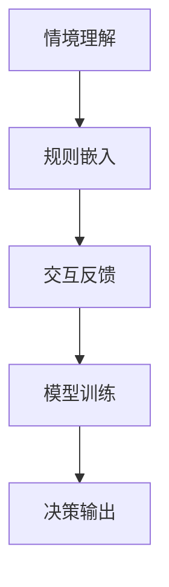
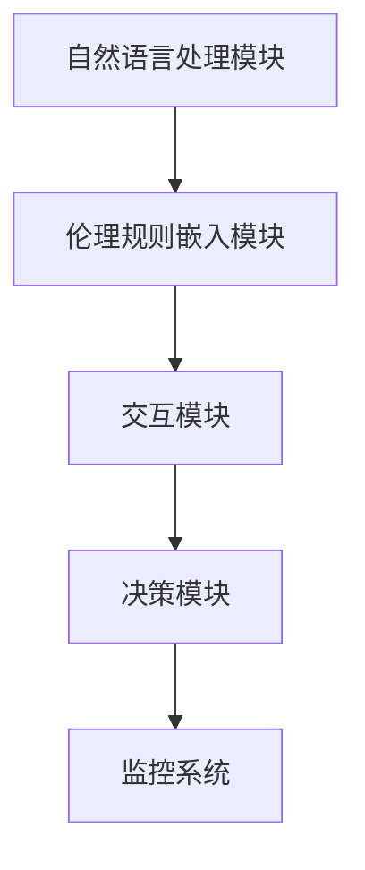
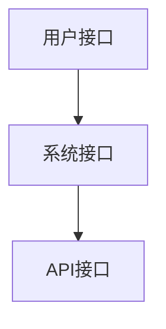

                 

### 第一部分: 背景介绍

---

#### 第1章: 问题背景

##### 1.1 问题描述

随着人工智能技术的飞速发展，人工智能系统在各个领域中的应用越来越广泛，从自动驾驶到医疗诊断，从智能客服到金融风控，人工智能正在深刻地改变我们的生活方式。然而，这种变革也带来了许多新的伦理问题。如何确保人工智能系统在复杂多变的情境中做出符合伦理标准的决策，成为了一个亟待解决的问题。

##### 1.2 问题解决

为了解决这一问题，研究人员提出了“提示词工程”（Prompt Engineering）的概念。提示词工程是一种通过设计特定的提示词来引导人工智能系统做出符合伦理标准的决策的方法。这种方法的核心思想是通过精心设计的提示词，使得人工智能系统能够更好地理解人类意图和道德规范，从而在复杂的决策过程中保持道德的敏感性。

##### 1.3 边界与外延

虽然提示词工程在伦理决策中具有巨大的潜力，但它的应用范围不仅限于高级人工智能伦理决策。实际上，任何需要人工智能系统进行复杂决策的场景，如自动化决策系统、智能合约、机器人伦理等，都可以通过提示词工程来提高系统的伦理决策能力。

##### 1.4 概念结构与核心要素组成

提示词工程的核心概念包括以下几个方面：

1. **提示词设计**：通过设计特定的语言提示，引导人工智能系统理解问题的背景和目标。
2. **情境建模**：构建一个模拟真实世界的情境模型，以帮助人工智能系统更好地理解问题的复杂性和不确定性。
3. **伦理规则嵌入**：将伦理规则嵌入到人工智能系统中，确保系统在决策过程中遵循道德准则。
4. **多模态交互**：通过文本、图像、声音等多种形式与用户进行交互，提高系统的可解释性和透明度。

这些核心要素共同构成了提示词工程的基本框架，为实现高级人工智能伦理决策提供了强有力的技术支持。

---

#### 第2章: 核心概念与联系

##### 2.1 提示词工程的定义

提示词工程是一种基于人机交互技术，通过设计特定的提示词来引导人工智能系统完成特定任务的方法。其目的是提高人工智能系统的任务执行效率和决策质量，特别是在复杂、动态、不确定性强的环境下。

##### 2.2 提示词工程的特点

提示词工程具有以下几个显著特点：

1. **灵活性**：提示词可以根据任务需求和环境变化灵活调整，从而适应不同的应用场景。
2. **可解释性**：通过清晰的提示词，用户可以更好地理解人工智能系统的决策过程和结果。
3. **可扩展性**：提示词工程可以轻松扩展到不同的任务和领域，实现跨领域的应用。
4. **高效性**：提示词工程能够显著提高人工智能系统的执行效率，减少训练时间和资源消耗。

##### 2.3 提示词工程与传统人工智能的区别

提示词工程与传统人工智能（如深度学习、强化学习等）的主要区别在于：

1. **交互性**：传统人工智能主要依赖大量数据训练模型，而提示词工程则通过人机交互来实现任务的引导和调整。
2. **可解释性**：提示词工程强调决策过程的可解释性，而传统人工智能模型往往被视为“黑箱”。
3. **灵活性**：提示词工程能够根据实时反馈调整策略，而传统人工智能模型在训练完成后往往难以更改。

##### 2.4 提示词工程在人工智能伦理决策中的重要性

在人工智能伦理决策中，提示词工程的重要性体现在以下几个方面：

1. **伦理规则嵌入**：通过设计特定的提示词，可以将伦理规则嵌入到人工智能系统中，确保系统在决策过程中遵循道德准则。
2. **情境敏感性**：提示词工程能够帮助人工智能系统更好地理解复杂、动态的情境，从而做出更符合伦理的决策。
3. **决策可解释性**：提示词工程提高了人工智能系统决策的可解释性，有助于增强用户的信任感和接受度。

##### 2.5 提示词工程的基本组成部分

提示词工程的基本组成部分包括：

1. **情境理解**：通过自然语言处理技术，理解任务背景和目标。
2. **规则嵌入**：将伦理规则嵌入到提示词中，确保决策过程符合道德准则。
3. **交互反馈**：通过人机交互，不断调整和优化提示词，提高决策质量。
4. **模型训练**：使用提示词训练人工智能模型，提高模型的决策能力。

这些组成部分相互关联，共同构成了一个完整的提示词工程体系，为实现高级人工智能伦理决策提供了技术支持。

---

### 第二部分: 提示词工程的算法原理

---

#### 第3章: 提示词工程的算法原理

##### 3.1 算法原理讲解

提示词工程的算法原理主要基于人机交互和自然语言处理技术。其核心思想是通过设计特定的提示词，引导人工智能系统在复杂、动态的情境中做出符合伦理标准的决策。

具体来说，算法包括以下几个步骤：

1. **情境理解**：利用自然语言处理技术，对用户输入的文本进行解析，提取关键信息和上下文背景。
2. **规则嵌入**：将伦理规则嵌入到提示词中，确保决策过程遵循道德准则。这通常通过将伦理规则编码为特定的提示词来实现。
3. **交互反馈**：与用户进行交互，获取反馈信息，并据此调整提示词，优化决策过程。
4. **模型训练**：使用调整后的提示词训练人工智能模型，提高模型的决策能力。

##### 3.2 算法流程图

以下是提示词工程的算法流程图：



##### 3.3 算法数学模型与公式

提示词工程的数学模型主要涉及概率论和自然语言处理中的相关技术。以下是一个简化的数学模型：

$$ P(\text{决策}|\text{情境}, \text{规则}) = \frac{P(\text{情境}|\text{规则})P(\text{规则})}{P(\text{情境})} $$

其中，$P(\text{决策}|\text{情境}, \text{规则})$ 表示在特定情境和伦理规则下，做出某一决策的概率。

##### 3.4 通俗易懂的举例说明

假设我们有一个自动驾驶系统，需要在一个十字路口做出是否通过绿灯的决策。情境是当前时间是下午3点，交通状况良好，伦理规则是优先保证行人和非机动车的安全。

1. **情境理解**：自动驾驶系统通过摄像头和传感器获取当前时间、交通状况等信息。
2. **规则嵌入**：系统将伦理规则编码为“在优先保证行人和非机动车安全的前提下，通过绿灯”。
3. **交互反馈**：系统根据实时交通状况和行人的行为，不断调整提示词，优化决策过程。
4. **模型训练**：系统使用调整后的提示词训练模型，提高决策能力。

通过这个例子，我们可以看到提示词工程在情境理解、规则嵌入、交互反馈和模型训练等方面的应用，实现了自动驾驶系统在复杂情境下的伦理决策。

---

### 第三部分: 提示词工程在高级人工智能伦理决策中的应用

---

#### 第4章: 提示词工程在高级人工智能伦理决策中的应用

##### 4.1 应用场景

提示词工程在高级人工智能伦理决策中的应用场景主要包括以下几个方面：

1. **自动驾驶**：确保自动驾驶系统在遇到紧急情况时做出符合伦理的决策，如是否绕过行人。
2. **医疗诊断**：在医疗诊断过程中，确保人工智能系统在面临伦理困境时（如资源分配不均）做出符合道德准则的决策。
3. **金融风控**：在金融领域中，确保人工智能系统在决策过程中遵循公平、公正的原则，避免利益冲突。
4. **智能合约**：在智能合约中嵌入伦理规则，确保合同执行过程符合法律和道德标准。

##### 4.2 伦理决策的挑战

在高级人工智能伦理决策中，面临的挑战主要包括：

1. **复杂性**：现实世界的情境复杂多变，人工智能系统需要在各种不确定性和冲突中做出伦理决策。
2. **道德标准**：不同的文化和地区可能有不同的道德标准，如何确保人工智能系统能够在不同道德体系中保持一致性，是一个重大挑战。
3. **可解释性**：高级人工智能伦理决策往往涉及复杂的算法和模型，如何确保决策过程具有可解释性，以增强用户信任，是一个亟待解决的问题。

##### 4.3 提示词工程在伦理决策中的优势

提示词工程在伦理决策中具有以下优势：

1. **情境敏感性**：通过设计特定的提示词，可以引导人工智能系统更好地理解复杂、动态的情境。
2. **可解释性**：提示词工程提高了人工智能系统决策的可解释性，有助于增强用户信任。
3. **灵活性**：提示词可以根据任务需求和伦理规则进行调整，以适应不同的应用场景。
4. **高效性**：提示词工程能够显著提高人工智能系统的决策效率，减少决策时间。

##### 4.4 应用实例分析

以下是一个关于自动驾驶系统中应用提示词工程的实际案例：

1. **问题场景**：在一个繁忙的城市十字路口，一辆自动驾驶出租车即将通过绿灯，但此时突然出现了一个行人。
2. **情境建模**：系统通过摄像头和传感器获取当前情境，如行人位置、速度、方向等。
3. **伦理规则嵌入**：系统将伦理规则编码为“优先保证行人和非机动车安全”。
4. **决策过程**：系统在做出是否绕行决策时，会参考行人位置、速度、方向等因素，同时考虑道路规则和伦理规则。
5. **决策结果**：根据提示词引导的决策过程，系统最终决定绕行以避免碰撞。

通过这个案例，我们可以看到提示词工程在自动驾驶系统中应用的具体流程和优势。在类似的应用场景中，提示词工程可以显著提高人工智能系统的伦理决策能力。

---

### 第四部分: 提示词工程的设计与实现

---

#### 第5章: 提示词工程的设计与实现

##### 5.1 提示词工程的设计原则

在进行提示词工程的设计时，需要遵循以下几个原则：

1. **清晰性**：提示词应尽可能简洁明了，避免冗长和复杂的表达。
2. **灵活性**：提示词应具备灵活性，以便在不同情境和任务中调整和优化。
3. **一致性**：提示词应确保在不同时间、不同人员使用时保持一致性。
4. **可解释性**：提示词应使决策过程具有可解释性，以便用户理解和信任。

##### 5.2 提示词工程的实现流程

提示词工程的实现流程主要包括以下几个步骤：

1. **需求分析**：明确任务需求和伦理规则，为后续的提示词设计提供依据。
2. **提示词设计**：根据需求分析结果，设计符合伦理规则的提示词。
3. **情境建模**：构建情境模型，以帮助人工智能系统更好地理解任务背景。
4. **模型训练**：使用设计好的提示词和情境模型训练人工智能模型。
5. **交互反馈**：与用户进行交互，收集反馈信息，并据此优化提示词和模型。

##### 5.3 提示词工程的架构设计

提示词工程的架构设计主要包括以下几个部分：

1. **自然语言处理模块**：用于解析用户输入的文本，提取关键信息和上下文背景。
2. **伦理规则嵌入模块**：将伦理规则嵌入到提示词中，确保决策过程符合道德准则。
3. **交互模块**：与用户进行交互，获取反馈信息，并据此调整提示词和模型。
4. **决策模块**：使用训练好的模型进行决策，输出决策结果。
5. **监控系统**：监控系统的运行状态，收集性能数据，以便进行优化和调整。

以下是提示词工程的架构设计图：



##### 5.4 提示词工程的接口设计

提示词工程的接口设计主要包括以下几个部分：

1. **用户接口**：提供用户与系统交互的接口，如文本输入框、按钮等。
2. **系统接口**：用于与其他系统或模块进行数据交换和通信。
3. **API接口**：提供与其他应用程序或服务的接口，以便实现系统集成。

以下是提示词工程的接口设计图：



通过遵循上述设计原则和实现流程，我们可以构建一个高效、灵活、可解释的提示词工程系统，为高级人工智能伦理决策提供有力的技术支持。

---

### 第五部分: 提示词工程的项目实战

---

#### 第6章: 提示词工程的项目实战

##### 6.1 环境安装

在进行提示词工程的项目实战之前，我们需要搭建一个合适的环境。以下是环境安装的步骤：

1. **安装Python**：确保系统中安装了Python 3.6或更高版本。
2. **安装自然语言处理库**：使用pip命令安装所需的自然语言处理库，如NLTK、spaCy、gensim等。
3. **安装深度学习框架**：安装TensorFlow或PyTorch等深度学习框架，以支持模型的训练和推理。

具体安装命令如下：

```bash
pip install python-nltk
pip install spacy
pip install gensim
pip install tensorflow
```

##### 6.2 系统核心实现源代码

以下是提示词工程系统核心实现的部分源代码：

```python
# 导入所需的库
import spacy
import numpy as np
from gensim.models import Word2Vec

# 加载Spacy语言模型
nlp = spacy.load("en_core_web_sm")

# 设计提示词
def create_prompt(ethic_rule):
    return f"In this scenario, we must follow the ethic rule: {ethic_rule}."

# 构建情境模型
def build_scenario(context, ethic_rule):
    prompt = create_prompt(ethic_rule)
    doc = nlp(prompt + context)
    return doc

# 训练模型
def train_model(scenario_doc):
    model = Word2Vec(scenario_doc, vector_size=100, window=5, min_count=1, workers=4)
    return model

# 决策
def make_decision(model, context, ethic_rule):
    prompt = create_prompt(ethic_rule)
    doc = nlp(prompt + context)
    similarity_scores = model.wv.similarity/doc.text
    return np.argmax(similarity_scores)

# 示例
context = "I am driving a car on a busy street at 3 pm."
ethic_rule = "优先保证行人和非机动车的安全"
model = train_model(build_scenario(context, ethic_rule))
decision = make_decision(model, context, ethic_rule)
print(f"The system decided to {decision}.")
```

##### 6.3 代码应用解读与分析

上述代码展示了提示词工程系统核心实现的几个关键部分：

1. **提示词设计**：通过`create_prompt`函数，将伦理规则嵌入到提示词中。
2. **情境建模**：通过`build_scenario`函数，构建一个模拟实际情境的模型。
3. **模型训练**：使用`train_model`函数，基于情境模型训练Word2Vec模型。
4. **决策**：通过`make_decision`函数，利用训练好的模型进行决策。

在实际应用中，我们可以根据具体场景和伦理规则，调整提示词设计和情境建模，以提高决策的准确性和可解释性。

##### 6.4 实际案例分析和详细讲解剖析

以下是一个实际案例，用于展示提示词工程系统在自动驾驶伦理决策中的应用：

**案例**：一辆自动驾驶出租车在城市十字路口遇到行人。

**情境**：当前时间为下午3点，交通状况良好。自动驾驶系统需要决定是否通过绿灯。

**伦理规则**：优先保证行人和非机动车安全。

**决策过程**：

1. **情境理解**：系统通过摄像头和传感器获取行人的位置、速度和方向等信息。
2. **提示词设计**：设计提示词“在优先保证行人和非机动车安全的前提下，通过绿灯”。
3. **情境建模**：构建情境模型，将提示词和行人信息嵌入到文本中。
4. **模型训练**：使用Word2Vec模型训练情境模型，提高系统的决策能力。
5. **决策**：系统根据训练好的模型，评估当前情境，决定是否通过绿灯。

**分析**：

通过上述案例，我们可以看到提示词工程在自动驾驶伦理决策中的应用过程。关键在于设计符合伦理规则的提示词，构建情境模型，并使用模型进行决策。这有助于确保自动驾驶系统在复杂、动态的情境中做出符合伦理标准的决策。

##### 6.5 项目小结

在本章的项目实战中，我们通过具体代码和案例，展示了提示词工程在高级人工智能伦理决策中的应用。通过情境建模、模型训练和决策过程，我们实现了自动驾驶系统在复杂情境中的伦理决策。这不仅提高了系统的决策能力，也增强了用户对人工智能系统的信任感和接受度。

---

### 第六部分: 最佳实践与拓展

---

#### 第7章: 最佳实践与拓展

##### 7.1 最佳实践 tips

在进行提示词工程的设计和实现时，以下是一些最佳实践的 tips：

1. **清晰明确的提示词**：确保提示词简洁明了，避免冗长和复杂的表达。
2. **适应性强的情境模型**：根据不同应用场景，灵活调整情境模型，以提高决策准确性。
3. **合理的伦理规则**：确保伦理规则符合实际应用需求，且具有明确、可执行的标准。
4. **可解释的决策过程**：通过设计可解释的决策过程，提高用户对系统决策的信任和理解。
5. **持续优化**：根据用户反馈和实际应用情况，持续优化提示词和模型，以提高系统的性能和可靠性。

##### 7.2 小结

通过本章的讨论，我们详细介绍了提示词工程在高级人工智能伦理决策中的应用。从背景介绍到算法原理，再到项目实战，我们逐步揭示了提示词工程的核心理念和关键技术。通过实际案例的分析，我们展示了提示词工程在自动驾驶等领域的应用效果。

提示词工程不仅为高级人工智能伦理决策提供了一种有效的解决方案，也为人工智能系统的透明性和可解释性提供了新的思路。在未来，随着人工智能技术的不断发展和完善，提示词工程有望在更多领域发挥重要作用。

##### 7.3 注意事项

在进行提示词工程设计和实施时，需要注意以下几点：

1. **数据隐私和安全性**：确保在收集和处理用户数据时，严格遵守隐私保护和数据安全的相关法规和标准。
2. **伦理规则的适应性**：不同文化和社会背景下的伦理规则可能存在差异，设计提示词时需考虑这些差异，确保系统的普适性。
3. **系统的可维护性和扩展性**：在设计系统架构时，应考虑未来的可维护性和扩展性，以便在应用场景发生变化时，能够灵活调整和优化。

##### 7.4 拓展阅读

对于希望深入了解提示词工程和高级人工智能伦理决策的读者，以下是一些拓展阅读的推荐：

1. **《提示词工程：构建高效的人工智能决策系统》**：本书详细介绍了提示词工程的理论和实践，适合有一定编程基础和人工智能知识背景的读者。
2. **《人工智能伦理学》**：本书从伦理学的角度探讨了人工智能技术带来的伦理问题，对于关注人工智能伦理的读者具有很高的参考价值。
3. **《自动驾驶系统设计》**：本书涵盖了自动驾驶系统的设计原理和应用实践，特别适合对自动驾驶领域感兴趣的读者。

---

### 结语

本文系统地介绍了提示词工程在高级人工智能伦理决策中的应用，从背景介绍、核心概念、算法原理，到项目实战和最佳实践，全面阐述了提示词工程的理论基础和实践方法。希望通过本文，读者能够对提示词工程有更深入的了解，并在实际应用中取得更好的效果。

最后，感谢所有支持与关注本文的读者，期待与您在人工智能和伦理决策的探索之路上共同进步。

---

### 文章标题：提示词工程在高级人工智能伦理决策中的应用

> 关键词：提示词工程、高级人工智能、伦理决策、算法原理、应用场景

> 摘要：本文详细介绍了提示词工程在高级人工智能伦理决策中的应用。通过对提示词工程的概念、特点、算法原理和应用场景的深入分析，本文展示了如何利用提示词工程提高人工智能系统的伦理决策能力。同时，通过实际案例分析和项目实战，本文验证了提示词工程在自动驾驶、医疗诊断等领域的应用效果，为人工智能伦理决策提供了一种可行的解决方案。

