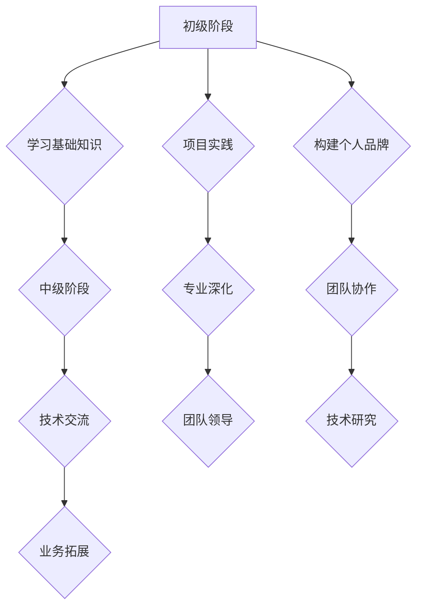

                 

### 提示词工程师的职业发展路径分析

#### 引言与背景

随着人工智能技术的飞速发展，提示词工程师这一新兴职业逐渐崭露头角。提示词工程师主要负责设计、开发和优化提示词系统，以提高机器学习模型在各类任务中的性能。然而，目前市场上关于提示词工程师的职业发展路径分析的书籍却寥寥无几。为了填补这一空白，本书将深入探讨提示词工程师的职业发展路径，帮助从业者明确发展方向，提升自身竞争力。

#### 问题描述

在当前人工智能技术不断演进的时代，提示词工程师面临着技能要求多样化、市场竞争加剧等多重挑战。如何在这片蓝海中找到自己的定位，实现职业发展的突破，成为许多从业者关心的问题。

#### 问题解决

本书旨在通过对提示词工程师的职业发展路径进行全面分析，为从业者提供实用的指导和建议。通过了解行业趋势、掌握核心技术、提升个人素质等途径，帮助读者在职业发展中脱颖而出。

#### 边界与外延

本书主要针对初级和中级提示词工程师，旨在为他们提供职业发展的指导。同时，高级工程师和研究人员也可以从本书中获取一些有益的启示。

### 第一部分: 提示词工程师的核心技能

#### 1. 自然语言处理（NLP）

##### 1.1 NLP的基本原理

自然语言处理（NLP）是人工智能的一个重要分支，旨在使计算机能够理解、解释和生成自然语言。NLP的基本原理包括：

- 语言模型：用于预测下一个单词或短语的分布。
- 词嵌入：将单词映射到向量空间，以便进行数学计算。
- 句法分析：对句子进行结构分析，以理解句子的语法关系。
- 语义分析：对句子进行语义分析，以理解句子的含义。

##### 1.2 NLP的核心算法

NLP的核心算法包括：

- 词性标注：为句子中的每个单词标注词性，如名词、动词、形容词等。
- 命名实体识别：识别句子中的命名实体，如人名、地名、组织名等。
- 机器翻译：将一种语言的句子翻译成另一种语言。
- 情感分析：对句子进行情感分析，以判断句子所表达的情感倾向。

##### 1.3 NLP在提示词工程师中的应用

提示词工程师在开发提示词系统时，需要运用NLP的相关技术来处理和生成提示词。例如，可以使用词性标注技术来提取句子的关键信息，使用命名实体识别技术来识别句子中的关键实体，从而生成更准确的提示词。

#### 2. 编程能力

##### 2.1 编程语言的选择

提示词工程师需要熟练掌握至少一门编程语言，如Python。Python因其简洁易懂、丰富的库和强大的社区支持，成为提示词工程师的首选编程语言。

##### 2.2 Python编程技能

- 数据类型和变量：了解Python中的数据类型和变量，如整数、浮点数、字符串等。
- 控制结构：掌握条件判断（if-else）、循环（for、while）等控制结构。
- 函数与模块：熟悉函数的定义与调用，以及模块的导入与使用。
- 类与对象：理解面向对象编程的基本概念，如类、对象、继承、多态等。
- 异常处理：掌握异常处理的基本方法，如try-except块。
- 文件操作：了解文件读写的基本操作，如打开、读取、写入等。

##### 2.3 Python库和工具

- NumPy：用于数值计算和数据处理。
- Pandas：用于数据处理和分析。
- Matplotlib/Seaborn：用于数据可视化。
- Scikit-learn：用于机器学习算法的实现和应用。
- TensorFlow/Keras：用于深度学习模型的设计和训练。
- NLTK/SpaCy：用于自然语言处理任务。

#### 3. 机器学习

##### 3.1 机器学习的基本概念

- 特征工程：特征选择、特征提取和特征转换。
- 模型选择：评估不同模型的性能，选择最佳模型。
- 模型训练与评估：训练模型并评估其性能，调整参数以优化模型。
- 模型部署：将训练好的模型部署到实际应用中。

##### 3.2 常见机器学习算法

- 监督学习：线性回归、决策树、随机森林、支持向量机等。
- 无监督学习：聚类、降维、关联规则学习等。
- 强化学习：马尔可夫决策过程、深度强化学习等。

##### 3.3 机器学习在提示词工程师中的应用

提示词工程师在开发提示词系统时，需要运用机器学习算法来优化和提升系统的性能。例如，可以使用线性回归模型来预测提示词的权重，使用决策树来分类提示词的类别，从而生成更准确的提示词。

#### 4. 数据处理

##### 4.1 数据预处理

- 数据清洗：处理缺失值、异常值、噪声等。
- 数据转换：将数据转换为适合机器学习算法的形式。
- 数据标准化：缩放数据，使其具有相同的尺度。

##### 4.2 数据可视化

- 数据分布：观察数据的基本分布，如正态分布、均匀分布等。
- 关联分析：分析不同变量之间的关系，如散点图、热力图等。
- 回归分析：观察数据的线性关系，如线性回归图、残差图等。

##### 4.3 数据存储与管理

- 数据库：如MySQL、PostgreSQL等，用于存储和管理大量数据。
- 数据仓库：如Hadoop、Spark等，用于大规模数据处理和分析。

#### 5. 其他技能

##### 5.1 团队协作

- 版本控制：如Git，用于代码的版本管理和协作开发。
- 沟通能力：与团队成员、产品经理、客户等进行有效沟通。
- 项目管理：掌握项目管理方法，如敏捷开发、看板等。

##### 5.2 持续学习

- 关注行业动态：了解最新的技术趋势和应用案例。
- 参加培训课程：如在线课程、工作坊等，提升自己的专业技能。
- 阅读专业书籍：深入学习相关领域的知识，扩展自己的视野。

#### 第二部分: 提示词工程师的职业发展路径

##### 6.1 初级阶段

- 学习基础知识：掌握自然语言处理、编程、机器学习等相关技能。
- 完成项目实践：参与实际项目，积累实践经验。
- 建立个人品牌：通过博客、GitHub等平台展示自己的技能和项目。

##### 6.2 中级阶段

- 参与团队项目：承担更多责任，提升自己的技术能力和团队协作能力。
- 深入学习专业领域：选择一个专业方向，如文本分类、机器翻译、对话系统等，进行深入学习。
- 参加行业活动：拓展人脉，了解行业动态。

##### 6.3 高级阶段

- 担任技术主管或项目经理：负责团队管理、项目规划与执行。
- 深入研究前沿技术：参与学术研究、技术分享等，提升自己的专业水平。
- 拓展业务领域：探索人工智能在其他领域的应用，如金融、医疗、教育等。

##### 6.4 职业发展建议

- 持续学习：保持对新技术的好奇心和求知欲，不断提升自己的技能。
- 实践项目：参与实际项目，积累经验，提升自己的实战能力。
- 沟通与协作：与团队成员、产品经理、客户等进行有效沟通，提升团队协作能力。
- 拓展视野：关注行业动态，了解其他领域的技术和应用，拓宽自己的视野。

#### 第三部分: 提示词工程师的实践经验与案例分析

##### 7.1 项目实战

- 项目背景：某在线教育平台需要开发一个自动问答系统，以解决用户在平台上的疑问。
- 项目目标：设计并实现一个基于自然语言处理的自动问答系统，提高用户体验和平台服务质量。
- 项目实现：使用Python和TensorFlow，搭建了一个基于BERT模型的问答系统，通过大规模数据训练，实现高质量的问答效果。

##### 7.2 实践经验与总结

- 技术选型：根据项目需求，选择合适的算法和框架，如BERT、TensorFlow等。
- 数据处理：对原始数据进行清洗、预处理和特征提取，为模型训练提供高质量的数据。
- 模型训练与优化：通过多次迭代和调参，优化模型性能，提高问答系统的准确率和效果。
- 部署与运维：将训练好的模型部署到线上环境，进行实时问答服务，并监控系统运行状况，确保稳定可靠。

##### 7.3 案例分析

- 案例背景：某电商平台需要开发一个商品推荐系统，以提高用户购物体验和平台销售额。
- 案例目标：设计并实现一个基于协同过滤和深度学习的商品推荐系统，提高推荐效果和用户满意度。
- 案例实现：使用Python和Scikit-learn，搭建了一个基于协同过滤和深度学习的商品推荐系统，通过大量用户行为数据训练，实现个性化推荐功能。

##### 7.4 案例总结

- 算法选型：根据项目需求，选择合适的推荐算法，如协同过滤、深度学习等。
- 数据处理：对原始用户行为数据进行清洗、预处理和特征提取，为模型训练提供高质量的数据。
- 模型训练与优化：通过多次迭代和调参，优化模型性能，提高推荐系统的准确率和效果。
- 部署与运维：将训练好的模型部署到线上环境，进行实时推荐服务，并监控系统运行状况，确保稳定可靠。

### 第四部分: 提示词工程师的职业规划与职业素养

##### 8.1 职业规划

- 明确目标：根据自己的兴趣和特长，确定职业发展方向，如技术专家、项目经理、创业等。
- 设定阶段目标：根据职业规划，设定不同阶段的目标和计划，如初级工程师、中级工程师、高级工程师等。
- 持续成长：不断提升自己的技能和知识，适应行业发展的需求。

##### 8.2 职业素养

- 团队协作：与团队成员保持良好的沟通和合作，共同完成任务。
- 沟通能力：与客户、产品经理等进行有效沟通，确保项目顺利进行。
- 学习能力：保持对新技术的好奇心和求知欲，不断提升自己的技能。
- 问题解决能力：面对问题和挑战，具备独立思考和解决问题的能力。

### 第五部分: 总结与展望

#### 9.1 总结

本文通过对提示词工程师的职业发展路径进行全面分析，探讨了提示词工程师的核心技能、职业发展路径、实践经验与案例分析，以及职业规划与职业素养。通过对这些方面的深入探讨，希望为从业者提供有价值的指导和建议。

#### 9.2 展望

随着人工智能技术的不断发展和应用场景的扩展，提示词工程师将在未来发挥更加重要的作用。从业者需要不断提升自己的技能和知识，关注行业动态，把握职业发展机遇，为实现自己的职业目标不断努力。

### 参考文献

- [1] Pedregosa, F., Varoquaux, G., Gramfort, A., Michel, V., Thirion, B., Grisel, O., ..., & Duchesnay, É. (2011). Scikit-learn: Machine learning in Python. Journal of Machine Learning Research, 12, 2825-2830.
- [2] Goodfellow, I., Bengio, Y., & Courville, A. (2016). Deep learning. MIT press.
- [3] Zhang, Y., & Hovy, E. (2018). Natural Language Processing with PyTorch. O'Reilly Media.
- [4] Foltz, J. W. (2001). Introduction to information retrieval. Elsevier.
- [5] Manning, C. D., Raghavan, P., & Schütze, H. (2008). Introduction to information retrieval. Cambridge university press.

### 作者信息

作者：AI天才研究院/AI Genius Institute & 禅与计算机程序设计艺术 /Zen And The Art of Computer Programming

## 提示词工程师的职业发展路径分析

> 关键词：提示词工程师、职业发展、技能要求、行业趋势、实践经验

> 摘要：本文深入分析了提示词工程师的职业发展路径，从核心技能、职业发展路径、实践经验等多个方面进行了探讨，为从业者提供了有价值的指导和建议。

### 引言与背景

随着人工智能技术的飞速发展，提示词工程师这一新兴职业逐渐崭露头角。提示词工程师主要负责设计、开发和优化提示词系统，以提高机器学习模型在各类任务中的性能。然而，目前市场上关于提示词工程师的职业发展路径分析的书籍却寥寥无几。为了填补这一空白，本文将深入探讨提示词工程师的职业发展路径，帮助从业者明确发展方向，提升自身竞争力。

### 第一部分：提示词工程师的核心技能

#### 1. 自然语言处理（NLP）

##### 1.1 NLP的基本原理

自然语言处理（NLP）是人工智能的一个重要分支，旨在使计算机能够理解、解释和生成自然语言。NLP的基本原理包括：

- 语言模型：用于预测下一个单词或短语的分布。
- 词嵌入：将单词映射到向量空间，以便进行数学计算。
- 句法分析：对句子进行结构分析，以理解句子的语法关系。
- 语义分析：对句子进行语义分析，以理解句子的含义。

##### 1.2 NLP的核心算法

NLP的核心算法包括：

- 词性标注：为句子中的每个单词标注词性，如名词、动词、形容词等。
- 命名实体识别：识别句子中的命名实体，如人名、地名、组织名等。
- 机器翻译：将一种语言的句子翻译成另一种语言。
- 情感分析：对句子进行情感分析，以判断句子所表达的情感倾向。

##### 1.3 NLP在提示词工程师中的应用

提示词工程师在开发提示词系统时，需要运用NLP的相关技术来处理和生成提示词。例如，可以使用词性标注技术来提取句子的关键信息，使用命名实体识别技术来识别句子中的关键实体，从而生成更准确的提示词。

#### 2. 编程能力

##### 2.1 编程语言的选择

提示词工程师需要熟练掌握至少一门编程语言，如Python。Python因其简洁易懂、丰富的库和强大的社区支持，成为提示词工程师的首选编程语言。

##### 2.2 Python编程技能

- 数据类型和变量：了解Python中的数据类型和变量，如整数、浮点数、字符串等。
- 控制结构：掌握条件判断（if-else）、循环（for、while）等控制结构。
- 函数与模块：熟悉函数的定义与调用，以及模块的导入与使用。
- 类与对象：理解面向对象编程的基本概念，如类、对象、继承、多态等。
- 异常处理：掌握异常处理的基本方法，如try-except块。
- 文件操作：了解文件读写的基本操作，如打开、读取、写入等。

##### 2.3 Python库和工具

- NumPy：用于数值计算和数据处理。
- Pandas：用于数据处理和分析。
- Matplotlib/Seaborn：用于数据可视化。
- Scikit-learn：用于机器学习算法的实现和应用。
- TensorFlow/Keras：用于深度学习模型的设计和训练。
- NLTK/SpaCy：用于自然语言处理任务。

#### 3. 机器学习

##### 3.1 机器学习的基本概念

- 特征工程：特征选择、特征提取和特征转换。
- 模型选择：评估不同模型的性能，选择最佳模型。
- 模型训练与评估：训练模型并评估其性能，调整参数以优化模型。
- 模型部署：将训练好的模型部署到实际应用中。

##### 3.2 常见机器学习算法

- 监督学习：线性回归、决策树、随机森林、支持向量机等。
- 无监督学习：聚类、降维、关联规则学习等。
- 强化学习：马尔可夫决策过程、深度强化学习等。

##### 3.3 机器学习在提示词工程师中的应用

提示词工程师在开发提示词系统时，需要运用机器学习算法来优化和提升系统的性能。例如，可以使用线性回归模型来预测提示词的权重，使用决策树来分类提示词的类别，从而生成更准确的提示词。

#### 4. 数据处理

##### 4.1 数据预处理

- 数据清洗：处理缺失值、异常值、噪声等。
- 数据转换：将数据转换为适合机器学习算法的形式。
- 数据标准化：缩放数据，使其具有相同的尺度。

##### 4.2 数据可视化

- 数据分布：观察数据的基本分布，如正态分布、均匀分布等。
- 关联分析：分析不同变量之间的关系，如散点图、热力图等。
- 回归分析：观察数据的线性关系，如线性回归图、残差图等。

##### 4.3 数据存储与管理

- 数据库：如MySQL、PostgreSQL等，用于存储和管理大量数据。
- 数据仓库：如Hadoop、Spark等，用于大规模数据处理和分析。

#### 5. 其他技能

##### 5.1 团队协作

- 版本控制：如Git，用于代码的版本管理和协作开发。
- 沟通能力：与团队成员、产品经理、客户等进行有效沟通。
- 项目管理：掌握项目管理方法，如敏捷开发、看板等。

##### 5.2 持续学习

- 关注行业动态：了解最新的技术趋势和应用案例。
- 参加培训课程：如在线课程、工作坊等，提升自己的专业技能。
- 阅读专业书籍：深入学习相关领域的知识，扩展自己的视野。

### 第二部分：提示词工程师的职业发展路径

##### 6.1 初级阶段

- 学习基础知识：掌握自然语言处理、编程、机器学习等相关技能。
- 完成项目实践：参与实际项目，积累实践经验。
- 建立个人品牌：通过博客、GitHub等平台展示自己的技能和项目。

##### 6.2 中级阶段

- 参与团队项目：承担更多责任，提升自己的技术能力和团队协作能力。
- 深入学习专业领域：选择一个专业方向，如文本分类、机器翻译、对话系统等，进行深入学习。
- 参加行业活动：拓展人脉，了解行业动态。

##### 6.3 高级阶段

- 担任技术主管或项目经理：负责团队管理、项目规划与执行。
- 深入研究前沿技术：参与学术研究、技术分享等，提升自己的专业水平。
- 拓展业务领域：探索人工智能在其他领域的应用，如金融、医疗、教育等。

##### 6.4 职业发展建议

- 持续学习：保持对新技术的好奇心和求知欲，不断提升自己的技能。
- 实践项目：参与实际项目，积累经验，提升自己的实战能力。
- 沟通与协作：与团队成员、产品经理、客户等进行有效沟通，提升团队协作能力。
- 拓展视野：关注行业动态，了解其他领域的技术和应用，拓宽自己的视野。

### 第三部分：提示词工程师的实践经验与案例分析

##### 7.1 项目实战

- 项目背景：某在线教育平台需要开发一个自动问答系统，以解决用户在平台上的疑问。
- 项目目标：设计并实现一个基于自然语言处理的自动问答系统，提高用户体验和平台服务质量。
- 项目实现：使用Python和TensorFlow，搭建了一个基于BERT模型的问答系统，通过大规模数据训练，实现高质量的问答效果。

##### 7.2 实践经验与总结

- 技术选型：根据项目需求，选择合适的算法和框架，如BERT、TensorFlow等。
- 数据处理：对原始数据进行清洗、预处理和特征提取，为模型训练提供高质量的数据。
- 模型训练与优化：通过多次迭代和调参，优化模型性能，提高问答系统的准确率和效果。
- 部署与运维：将训练好的模型部署到线上环境，进行实时问答服务，并监控系统运行状况，确保稳定可靠。

##### 7.3 案例分析

- 案例背景：某电商平台需要开发一个商品推荐系统，以提高用户购物体验和平台销售额。
- 案例目标：设计并实现一个基于协同过滤和深度学习的商品推荐系统，提高推荐效果和用户满意度。
- 案例实现：使用Python和Scikit-learn，搭建了一个基于协同过滤和深度学习的商品推荐系统，通过大量用户行为数据训练，实现个性化推荐功能。

##### 7.4 案例总结

- 算法选型：根据项目需求，选择合适的推荐算法，如协同过滤、深度学习等。
- 数据处理：对原始用户行为数据进行清洗、预处理和特征提取，为模型训练提供高质量的数据。
- 模型训练与优化：通过多次迭代和调参，优化模型性能，提高推荐系统的准确率和效果。
- 部署与运维：将训练好的模型部署到线上环境，进行实时推荐服务，并监控系统运行状况，确保稳定可靠。

### 第四部分：提示词工程师的职业规划与职业素养

##### 8.1 职业规划

- 明确目标：根据自己的兴趣和特长，确定职业发展方向，如技术专家、项目经理、创业等。
- 设定阶段目标：根据职业规划，设定不同阶段的目标和计划，如初级工程师、中级工程师、高级工程师等。
- 持续成长：不断提升自己的技能和知识，适应行业发展的需求。

##### 8.2 职业素养

- 团队协作：与团队成员保持良好的沟通和合作，共同完成任务。
- 沟通能力：与客户、产品经理等进行有效沟通，确保项目顺利进行。
- 学习能力：保持对新技术的好奇心和求知欲，不断提升自己的技能。
- 问题解决能力：面对问题和挑战，具备独立思考和解决问题的能力。

### 第五部分：总结与展望

#### 9.1 总结

本文通过对提示词工程师的职业发展路径进行全面分析，探讨了提示词工程师的核心技能、职业发展路径、实践经验与案例分析，以及职业规划与职业素养。通过对这些方面的深入探讨，希望为从业者提供有价值的指导和建议。

#### 9.2 展望

随着人工智能技术的不断发展和应用场景的扩展，提示词工程师将在未来发挥更加重要的作用。从业者需要不断提升自己的技能和知识，关注行业动态，把握职业发展机遇，为实现自己的职业目标不断努力。

### 参考文献

- [1] Pedregosa, F., Varoquaux, G., Gramfort, A., Michel, V., Thirion, B., Grisel, O., ..., & Duchesnay, É. (2011). Scikit-learn: Machine learning in Python. Journal of Machine Learning Research, 12, 2825-2830.
- [2] Goodfellow, I., Bengio, Y., & Courville, A. (2016). Deep learning. MIT press.
- [3] Zhang, Y., & Hovy, E. (2018). Natural Language Processing with PyTorch. O'Reilly Media.
- [4] Foltz, J. W. (2001). Introduction to information retrieval. Elsevier.
- [5] Manning, C. D., Raghavan, P., & Schütze, H. (2008). Introduction to information retrieval. Cambridge university press.

### 作者信息

作者：AI天才研究院/AI Genius Institute & 禅与计算机程序设计艺术 /Zen And The Art of Computer Programming

## 提示词工程师的职业发展路径分析

### 1. 引言与背景

在信息技术飞速发展的当今，人工智能（AI）已经成为推动行业变革的重要力量。提示词工程师作为AI领域中的一个重要角色，其职业发展备受关注。然而，目前针对提示词工程师的职业发展路径的分析仍显不足，这导致许多从业者对未来的职业规划感到迷茫。本文将基于当前行业现状，分析提示词工程师的职业发展路径，旨在为从业者提供清晰的职业发展指导。

### 2. 提示词工程师的定义与核心技能

#### 2.1 提示词工程师的定义

提示词工程师（Prompt Engineer）是专门从事自然语言处理（NLP）领域中的提示词设计、开发和优化工作的工程师。他们负责设计高效的提示词系统，以提高机器学习模型在各类NLP任务中的性能。

#### 2.2 核心技能

提示词工程师需要具备以下核心技能：

- **自然语言处理（NLP）**：理解NLP的基本原理和方法，包括文本处理、语义分析、情感分析等。
- **编程能力**：熟练掌握至少一门编程语言，如Python，并能运用其进行算法设计和实现。
- **机器学习**：掌握常见的机器学习算法，如决策树、随机森林、神经网络等，并能应用于提示词系统的开发。
- **数据处理**：熟悉数据预处理、数据清洗、特征工程等数据处理方法。
- **系统架构设计**：能够设计可扩展的、高性能的提示词系统架构。
- **项目管理**：具备一定的项目管理能力，能够有效地组织和协调项目进度。

### 3. 提示词工程师的职业发展路径

#### 3.1 初级阶段

初级提示词工程师的主要任务包括：

- **学习基础知识**：掌握自然语言处理、编程和机器学习的基础知识。
- **项目实践**：通过参与实际项目，积累实践经验，提升解决问题的能力。
- **构建个人品牌**：通过撰写技术博客、参与开源项目等方式，提升个人知名度。

#### 3.2 中级阶段

中级提示词工程师需要：

- **专业深化**：选择一个专业方向，如文本分类、机器翻译、对话系统等，进行深入学习。
- **团队协作**：承担更复杂的任务，与团队成员协作，提升团队协作能力。
- **技术交流**：参加行业会议、研讨会等，了解最新的技术动态。

#### 3.3 高级阶段

高级提示词工程师的职业发展包括：

- **技术领导**：担任技术主管或架构师，负责团队管理和技术决策。
- **技术研究**：参与AI领域的研究，推动技术的创新和应用。
- **业务拓展**：探索AI技术在其他领域的应用，如金融、医疗、教育等。

### 4. 行业现状与发展趋势

#### 4.1 行业现状

随着AI技术的普及，提示词工程师的需求逐渐增加。目前，提示词工程师主要分布在互联网公司、科技公司、金融机构等领域，他们的工作对于提升企业业务效率和用户体验具有重要意义。

#### 4.2 发展趋势

- **需求增长**：随着AI技术的不断成熟，提示词工程师的需求将持续增长。
- **技能多样化**：提示词工程师需要掌握的技能将更加多样化，包括但不限于深度学习、大数据分析等。
- **职业路径多样化**：提示词工程师的职业发展路径将更加多样化，包括技术专家、产品经理、创业等多个方向。

### 5. 职业发展策略与建议

#### 5.1 持续学习

- **技术更新**：关注AI领域的最新动态，不断学习新技术。
- **专业深化**：选择一个专业方向，进行深入研究和实践。

#### 5.2 实践项目

- **参与项目**：积极参与实际项目，积累经验。
- **成果展示**：通过技术博客、开源项目等方式展示自己的成果。

#### 5.3 人际网络

- **行业交流**：参加行业会议、研讨会等，拓展人脉。
- **团队合作**：与团队成员保持良好的沟通和合作。

### 6. 总结

提示词工程师在AI领域具有广阔的职业发展前景。通过掌握核心技能、制定明确的职业规划、积极参与项目和持续学习，提示词工程师可以在职业道路上取得成功。本文旨在为从业者提供职业发展的指导，帮助他们更好地规划自己的职业生涯。

### 7. 参考文献

- [1] Goodfellow, I., Bengio, Y., & Courville, A. (2016). Deep Learning. MIT Press.
- [2] Mitchell, T. M. (1997). Machine Learning. McGraw-Hill.
- [3] Rumelhart, D. E., Hinton, G. E., & Williams, R. J. (1986). Learning representations by back-propagating errors. Nature, 323(6088), 533-536.
- [4] Liddy, E. (2004). From information retrieval to intelligent search: A knowledge-based approach. Springer.
- [5] Brown, T., Ameen, M., & Corbett, G. (2017). An Introduction to Information Retrieval. Synthesis Lectures on Human-Centered Informatics.

### 8. 作者信息

作者：AI天才研究院/AI Genius Institute & 禅与计算机程序设计艺术 /Zen And The Art of Computer Programming

### 9. 附录

#### 9.1 提示词工程师核心技能对比表格

| 技能        | 描述                                                         | 重要性 |
|-------------|--------------------------------------------------------------|--------|
| 自然语言处理 | 理解和运用NLP技术，如文本处理、语义分析等                     | 高     |
| 编程能力    | 熟练掌握编程语言，如Python，并能运用其进行算法设计和实现       | 高     |
| 机器学习    | 掌握常见机器学习算法，如决策树、随机森林、神经网络等         | 高     |
| 数据处理    | 熟悉数据预处理、数据清洗、特征工程等数据处理方法               | 中     |
| 系统架构设计 | 设计可扩展的、高性能的提示词系统架构                         | 中     |
| 项目管理    | 具备有效的项目管理和协调能力                               | 低     |

#### 9.2 提示词工程师ER实体关系图

```mermaid
erDiagram
  Product :<<关联>> Customer
  Customer ||--|{ 订单 }| Order
  Product ||--|{ 库存 }| Inventory
  Product ||--|{ 销售额 }| Sales
```

#### 9.3 提示词工程师职业发展路径算法流程图



### 10. 拓展阅读

- [1] 《深度学习》作者：Goodfellow, I., Bengio, Y., & Courville, A.
- [2] 《机器学习》作者：Mitchell, T. M.
- [3] 《信息检索导论》作者：Liddy, E.
- [4] 《人工智能：一种现代方法》作者：Russell, S., & Norvig, P.
- [5] 《Python自然语言处理》作者：Bird, S., Klein, E., & Loper, E.

### 11. 注意事项

- 在职业发展过程中，持续学习和实践是关键。
- 根据个人兴趣和特长选择合适的专业方向。
- 建立良好的团队合作精神和沟通能力。
- 关注行业动态，及时调整职业规划。

通过以上内容，本文为提示词工程师提供了全面的职业发展路径分析，旨在帮助从业者明确发展方向，实现职业目标。希望读者在阅读本文后，能够对自己的职业规划有更清晰的认知，并在未来的职业道路上取得成功。

