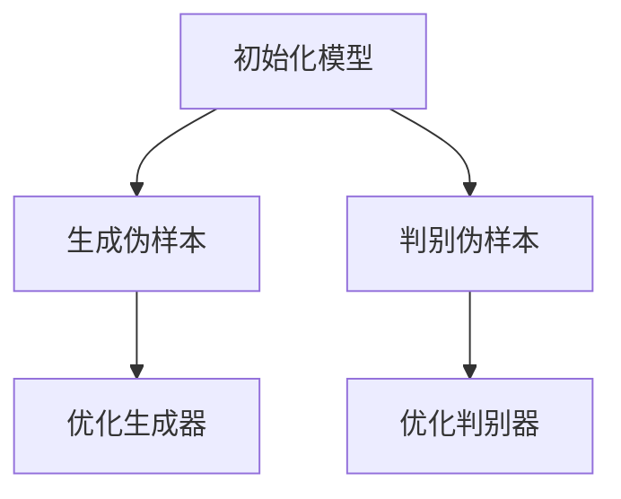
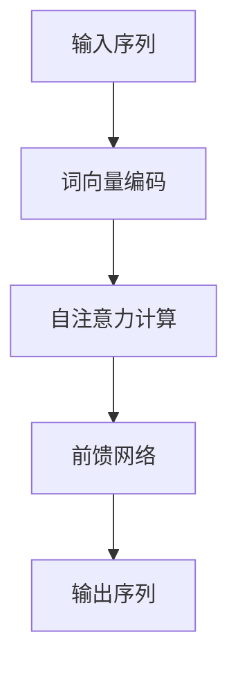
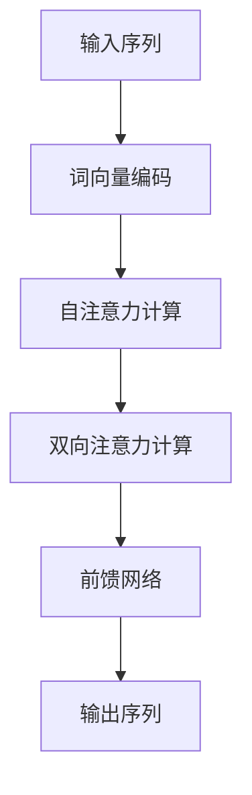
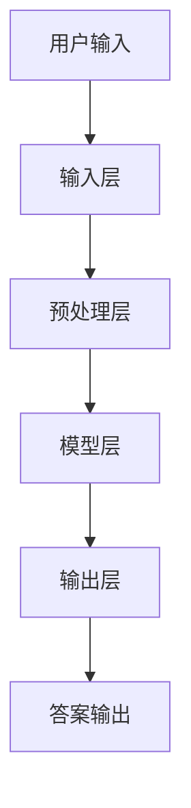
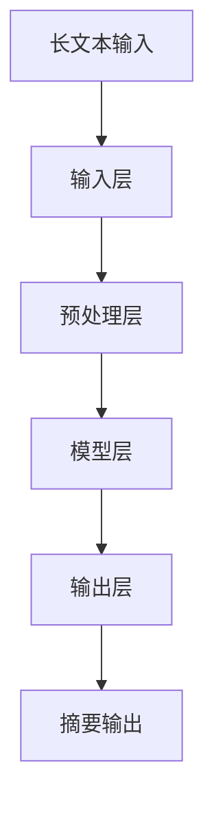

                 


### 提示词工程师：AIGC时代的新兴职业

关键词：AIGC、提示词工程、自然语言处理、模型应用、工具与平台、实战案例

摘要：本文将深入探讨AIGC（AI-Generated Content）时代下新兴职业——提示词工程师的职业角色、核心技能、应用领域以及发展前景。通过对提示词工程的理论和实践进行详细分析，帮助读者理解这一领域的核心概念和技术原理，从而为从事相关工作的专业人士提供有价值的指导和参考。

## 引言

### 1.1 问题背景

AIGC时代，人工智能生成内容成为推动数字内容产业变革的核心动力。从虚拟主播、智能客服到自动问答系统，AIGC技术在各行各业中展现出了巨大的潜力。然而，这一技术的实现离不开一个关键角色——提示词工程师。提示词工程师是AIGC时代的重要专业人士，他们负责设计、开发和优化用于引导AI模型生成内容的提示词，从而实现更高效、精准的内容生成。

### 1.2 核心概念与联系

提示词工程师的核心工作涉及多个技术领域，包括自然语言处理（NLP）、生成对抗网络（GAN）以及深度学习模型等。本文将详细介绍这些核心概念，并通过对比表格和ER实体关系图，帮助读者建立对这些概念的理解。

### 1.3 书籍的目的与结构

本文旨在为从事或希望从事提示词工程师职业的读者提供全面、系统的指导。文章结构分为五部分，分别介绍AIGC时代的背景、提示词工程基础知识、应用领域、工具与平台以及实战案例。通过逐步深入的分析，本文将帮助读者掌握提示词工程师所需的核心技能，并了解这一职业的发展前景。

## 第一部分：背景介绍与核心概念

### 第1章：引言

AIGC时代已经到来，人工智能生成内容（AI-Generated Content，简称AIGC）成为推动数字内容产业变革的重要力量。在这个时代，提示词工程师扮演着至关重要的角色，他们通过设计、开发和优化提示词，指导AI模型生成高质量的内容。本章将介绍AIGC时代的背景、提示词工程师的角色和需求，以及本书的结构和目的。

### 1.1 AIGC时代的来临

AIGC时代的到来源于深度学习、自然语言处理（NLP）和生成对抗网络（GAN）等技术的快速发展。这些技术的进步使得人工智能能够自动生成文本、图像、音频等多种类型的内容。AIGC的应用领域广泛，包括虚拟主播、智能客服、自动问答系统、内容创作等。AIGC的兴起不仅改变了内容生产的方式，也为各行业带来了新的机遇和挑战。

### 1.2 提示词工程师的角色与需求

提示词工程师是AIGC时代的新兴职业，他们的主要职责是设计和开发提示词，以引导AI模型生成符合需求的内容。提示词工程师需要具备以下技能：

1. **自然语言处理（NLP）知识**：理解NLP的基本概念和技术，能够处理文本数据，进行文本分类、命名实体识别等任务。

2. **深度学习模型开发**：熟悉深度学习框架，如TensorFlow、PyTorch等，能够设计和训练各种类型的深度学习模型。

3. **提示词设计能力**：能够根据应用场景，设计有效的提示词，引导模型生成高质量的内容。

4. **编程能力**：熟练掌握Python等编程语言，能够编写高效的代码，实现模型训练和提示词生成。

随着AIGC技术的不断发展和应用领域的拓展，提示词工程师的需求也在不断增长。许多企业和机构开始招聘具备这些技能的专业人才，以应对AIGC时代的挑战。

### 1.3 书籍的目的与结构

本书旨在为从事或希望从事提示词工程师职业的读者提供全面、系统的指导。文章结构分为五部分：

1. **第一部分：背景介绍与核心概念**：介绍AIGC时代的背景、提示词工程师的角色和需求，以及本书的结构和目的。

2. **第二部分：提示词工程基础知识**：详细讲解提示词工程的原理，包括自然语言处理、生成对抗网络和深度学习模型等。

3. **第三部分：提示词工程应用**：探讨提示词工程在自然语言处理中的应用，包括文本分类、命名实体识别、自动问答系统等。

4. **第四部分：提示词工程的工具与平台**：介绍常用的提示词工程工具和平台，包括Hugging Face、Transformers库、PyTorch等。

5. **第五部分：实战案例与最佳实践**：通过具体实战案例，展示提示词工程的应用场景和实现方法。

通过本书的学习，读者将能够掌握提示词工程师所需的核心技能，了解AIGC时代的发展趋势，并为自己的职业发展打下坚实的基础。

### 1.4 核心概念与联系

在AIGC时代，提示词工程师需要掌握多个核心概念，这些概念相互联系，构成了提示词工程的理论基础。以下是对这些核心概念及其相互关系的详细解释。

#### 1.4.1 关键术语解释

1. **AIGC（AI-Generated Content）**：人工智能生成内容，是指利用人工智能技术自动生成文本、图像、音频等多种类型的内容。

2. **提示词（Prompt）**：提示词是一种引导AI模型生成内容的文本输入。通过设计合适的提示词，可以引导模型生成更符合预期的内容。

3. **自然语言处理（NLP）**：自然语言处理是人工智能的一个重要分支，旨在使计算机理解和处理人类语言。

4. **生成对抗网络（GAN）**：生成对抗网络是一种深度学习模型，由生成器和判别器组成，用于生成逼真的数据。

5. **深度学习模型**：深度学习模型是一种基于多层神经网络的人工智能模型，能够通过学习大量数据自动提取特征。

#### 1.4.2 概念属性特征对比表格

| 概念           | 属性特征                                      | 相互关系                                                         |
|----------------|---------------------------------------------|-----------------------------------------------------------------|
| AIGC           | 自动生成内容，应用于多个领域                  | 需要提示词工程师设计提示词来引导模型生成内容                       |
| 提示词         | 引导模型生成内容，灵活多变                    | 与深度学习模型紧密相关，通过优化提示词提高内容生成质量               |
| 自然语言处理   | 理解和生成人类语言，支持文本数据               | 为提示词工程师提供工具和算法，用于处理文本数据和生成提示词           |
| 生成对抗网络   | 生成器和判别器对抗，用于生成逼真数据          | 提示词工程师可以利用GAN生成高质量的数据，作为模型的训练数据          |
| 深度学习模型   | 自动学习特征，应用于各种任务                    | 提示词工程师需要设计和优化模型，以实现高质量的内容生成               |

#### 1.4.3 ER实体关系图架构

为了更好地理解这些概念之间的关系，我们可以通过ER（实体关系）图来表示它们之间的关联。

```mermaid
erDiagram
  AIGC ||--|{ 提示词 }|| NLP
  AIGC ||--|{ 深度学习模型 }|| DL
  AIGC ||--|{ 生成对抗网络 }|| GAN
  NLP ||--|{ 文本分类 }|| TC
  NLP ||--|{ 命名实体识别 }|| NER
  DL ||--|{ GPT }|| Model
  DL ||--|{ BERT }|| Model
  GAN ||--|{ 生成器 }|| Generator
  GAN ||--|{ 判别器 }|| Discriminator
```

通过ER图，我们可以清晰地看到AIGC与提示词、自然语言处理、生成对抗网络和深度学习模型之间的紧密联系。这些概念相互支撑，共同构建了提示词工程师工作的理论基础。

### 第2章：提示词工程的原理

提示词工程是AIGC时代的关键技术之一，它通过设计和开发有效的提示词，引导AI模型生成高质量的内容。本章将详细讲解提示词工程的原理，包括自然语言处理、生成对抗网络和深度学习模型的基本概念、工作原理以及应用。

#### 2.1 自然语言处理基础

自然语言处理（NLP）是人工智能的一个重要分支，旨在使计算机理解和生成人类语言。NLP的核心任务包括文本分类、命名实体识别、语义分析等。以下是对NLP基础知识的介绍。

##### 2.1.1 语言模型

语言模型是NLP的基础，它用于预测一个句子或单词的概率分布。最常用的语言模型包括n-gram模型和神经网络语言模型。n-gram模型通过统计相邻单词出现的频率来预测下一个单词，而神经网络语言模型则通过深度学习算法学习单词之间的关联。

$$
P(w_{t} | w_{t-1}, w_{t-2}, ..., w_{1}) = \frac{C(w_{t-1}, w_{t-2}, ..., w_{1}, w_{t})}{C(w_{t-1}, w_{t-2}, ..., w_{1})}
$$

其中，$P(w_{t} | w_{t-1}, w_{t-2}, ..., w_{1})$表示在给定前一个单词序列下，当前单词的概率。$C(w_{t-1}, w_{t-2}, ..., w_{1}, w_{t})$表示连续出现这些单词的次数，$C(w_{t-1}, w_{t-2}, ..., w_{1})$表示前一个单词序列的次数。

##### 2.1.2 文本分类

文本分类是一种将文本数据分为不同类别的方法。常见的文本分类任务包括垃圾邮件检测、情感分析、主题分类等。文本分类通常采用监督学习算法，如朴素贝叶斯、支持向量机（SVM）和深度学习模型。

假设我们有一个文本数据集$T = \{t_1, t_2, ..., t_n\}$，每个文本数据$t_i$可以表示为一个向量$v_i$。我们希望通过分类器$C$将文本数据分类为不同的标签$y_i$。

$$
C(t_i) = y_i = \arg\max_y P(y)P(t_i | y)
$$

其中，$P(y)$表示类别$y$的概率，$P(t_i | y)$表示在类别$y$下文本数据$t_i$的概率。

##### 2.1.3 命名实体识别

命名实体识别（NER）是一种从文本中识别出具有特定意义的实体（如人名、地点、组织等）的方法。NER通常采用基于规则的方法、统计方法和深度学习方法。

假设我们有一个文本数据集$T = \{t_1, t_2, ..., t_n\}$，每个文本数据$t_i$可以表示为一个序列$(w_{i1}, w_{i2}, ..., w_{iM})$。NER的目标是识别出每个单词的实体标签，如人名（PER）、地点（LOC）和组织（ORG）。

NER可以分为两种类型：浅层NER和深层NER。浅层NER通常基于规则和统计方法，如条件随机场（CRF）。深层NER则采用深度学习模型，如卷积神经网络（CNN）和长短期记忆网络（LSTM）。

#### 2.2 生成对抗网络（GAN）

生成对抗网络（GAN）是由生成器和判别器组成的一种深度学习模型。生成器试图生成逼真的数据，而判别器则试图区分生成器和真实数据。通过这种对抗过程，生成器不断优化，最终能够生成高质量的数据。

##### 2.2.1 GAN模型的工作原理

GAN模型由两部分组成：生成器和判别器。

1. **生成器（Generator）**：生成器试图生成逼真的数据，如图像、文本等。通常采用深度学习模型，如生成对抗网络（GAN）和变分自编码器（VAE）。

2. **判别器（Discriminator）**：判别器用于判断输入数据是真实数据还是生成器生成的数据。判别器也采用深度学习模型。

GAN的训练过程如下：

1. 初始化生成器和判别器。
2. 对于每个训练样本$x_i$，生成器生成一个伪样本$g(x_i)$。
3. 判别器对真实样本$x_i$和伪样本$g(x_i)$进行判断。
4. 根据判别器的输出，优化生成器和判别器的参数。

GAN的损失函数通常为：

$$
L_G = -\log(D(g(x_i))) \\
L_D = -\log(D(x_i)) - \log(1 - D(g(x_i)))
$$

其中，$D(x_i)$表示判别器对真实样本的判断概率，$D(g(x_i))$表示判别器对生成样本的判断概率。

##### 2.2.2 GAN的mermaid流程图

以下是一个GAN模型的mermaid流程图：



#### 2.3 深度学习模型

深度学习模型是一种基于多层神经网络的人工智能模型，能够通过学习大量数据自动提取特征。以下介绍几种常用的深度学习模型。

##### 2.3.1 GPT模型

GPT（Generative Pre-trained Transformer）模型是一种基于Transformer架构的语言模型。GPT模型通过预训练大量文本数据，学习到语言的基本规律和模式，然后通过微调，将模型应用于各种任务。

1. **工作原理**：GPT模型采用自注意力机制（Self-Attention），能够捕捉文本数据中的长距离依赖关系。模型通过输入序列的每个单词生成一个向量表示，然后利用这些向量生成预测的单词。

2. **mermaid流程图**：



##### 2.3.2 BERT模型

BERT（Bidirectional Encoder Representations from Transformers）模型是一种基于Transformer架构的双向编码模型。BERT模型通过预训练大量文本数据，学习到文本的双向信息，然后通过微调，将模型应用于各种任务。

1. **工作原理**：BERT模型采用自注意力机制（Self-Attention）和双向注意力机制（Bi-Attention），能够捕捉文本数据中的长距离依赖关系。模型通过输入序列的每个单词生成一个向量表示，然后利用这些向量生成预测的单词。

2. **mermaid流程图**：



##### 2.3.3 其他常用模型

除了GPT和BERT，还有许多其他的深度学习模型，如GPT-Neo、T5和视觉提示词生成模型。

1. **GPT-Neo**：GPT-Neo是对GPT模型的改进，通过增加模型大小和训练时间，提高模型的性能。

2. **T5**：T5（Text-to-Text Transfer Transformer）模型是一种基于Transformer架构的文本转换模型，能够处理各种文本任务，如机器翻译、文本生成等。

3. **视觉提示词生成模型**：视觉提示词生成模型用于生成与图像相关的文本描述，常见的方法包括视觉BERT、Vision Transformer等。

通过以上介绍，我们可以看到提示词工程师需要掌握多种技术，包括自然语言处理、生成对抗网络和深度学习模型。这些技术共同构成了提示词工程的原理，为设计和开发有效的提示词提供了理论基础。

### 第3章：提示词工程在自然语言处理中的应用

提示词工程在自然语言处理（NLP）中的应用非常广泛，通过有效的提示词设计，可以显著提高模型的性能和应用效果。本章将详细探讨提示词工程在文本分类、命名实体识别和自动问答系统等NLP任务中的应用，并展示具体的应用案例。

#### 3.1 自然语言处理基础

在进行提示词工程应用之前，我们首先需要了解自然语言处理的基本概念和技术。自然语言处理的核心任务包括：

1. **语言模型**：用于预测下一个单词或句子的概率分布。
2. **文本分类**：将文本数据分类到不同的类别。
3. **命名实体识别（NER）**：从文本中识别出具有特定意义的实体，如人名、地点、组织等。
4. **情感分析**：分析文本中的情感倾向，如正面、负面或中性。
5. **机器翻译**：将一种语言的文本翻译成另一种语言。

这些任务都需要有效的提示词来指导模型的训练和预测。

#### 3.2 应用案例

##### 3.2.1 自动问答系统

自动问答系统是一种常见的自然语言处理应用，它通过模型自动回答用户的问题。提示词工程师需要设计有效的提示词，以引导模型生成准确的答案。

**案例介绍**：假设我们开发一个自动问答系统，用户可以输入问题，系统会自动生成回答。为了提高系统的性能，我们需要设计高质量的提示词。

**系统功能设计**：

1. **问题理解**：通过NLP技术，如词向量编码和词性标注，将用户输入的问题转换为模型可以处理的形式。
2. **答案生成**：使用预训练的语言模型，如GPT或BERT，根据输入的问题生成回答。
3. **答案验证**：对生成的答案进行验证，确保答案的准确性和合理性。

**系统架构设计**：

1. **输入层**：接收用户的问题输入。
2. **预处理层**：对输入的问题进行预处理，如分词、词性标注等。
3. **模型层**：使用语言模型生成回答。
4. **输出层**：输出生成的答案。

以下是一个自动问答系统的mermaid架构图：



##### 3.2.2 文本生成与摘要

文本生成与摘要是一种将长文本转换为简洁摘要的方法，常用于信息提取和内容创作。提示词工程师需要设计有效的提示词，以引导模型生成高质量的摘要。

**案例介绍**：假设我们需要将一篇长文章转换为简洁的摘要。为了提高摘要的准确性和质量，我们需要设计有效的提示词。

**系统功能设计**：

1. **文本预处理**：对输入的文本进行预处理，如分句、词性标注等。
2. **摘要生成**：使用预训练的语言模型，如GPT或BERT，根据输入的文本生成摘要。
3. **摘要优化**：对生成的摘要进行优化，确保摘要的准确性和流畅性。

**系统架构设计**：

1. **输入层**：接收长文本输入。
2. **预处理层**：对输入的文本进行预处理。
3. **模型层**：使用语言模型生成摘要。
4. **输出层**：输出生成的摘要。

以下是一个文本生成与摘要系统的mermaid架构图：



#### 3.3 应用效果评估

为了评估提示词工程在NLP中的应用效果，我们可以从以下几个方面进行：

1. **准确性**：评估模型在特定任务上的准确率，如文本分类、命名实体识别和自动问答系统。
2. **流畅性**：评估生成的文本或摘要的流畅性和可读性。
3. **一致性**：评估模型在不同数据集上的稳定性和一致性。
4. **效率**：评估模型在处理大量数据时的效率和性能。

通过综合评估以上指标，我们可以更好地了解提示词工程在NLP中的应用效果，并根据评估结果进行优化和改进。

#### 3.4 总结

提示词工程在自然语言处理中的应用非常广泛，通过设计有效的提示词，可以显著提高模型的性能和应用效果。本章介绍了提示词工程在文本分类、命名实体识别和自动问答系统等任务中的应用案例，并展示了系统功能设计和架构设计。通过逐步深入的分析，读者可以更好地理解提示词工程师的工作内容和技能要求，为从事这一领域的工作做好准备。

### 第四部分：提示词工程的工具与平台

#### 第4章：提示词工程工具使用

在提示词工程领域，工具和平台的选择至关重要。合适的工具和平台可以显著提高开发效率，优化模型性能，并简化复杂任务的实现。本章将介绍一些常用的提示词工程工具和平台，包括Hugging Face、Transformers库和PyTorch等，并详细说明如何安装和配置这些工具。

#### 4.1 环境安装

在进行提示词工程之前，首先需要配置一个合适的环境。以下是安装提示词工程所需的环境：

1. **操作系统**：Windows、macOS或Linux。
2. **Python**：Python 3.6及以上版本。
3. **pip**：Python的包管理工具。
4. **CUDA**：NVIDIA CUDA Toolkit（可选，用于GPU加速）。

#### 4.1.1 硬件要求

为了确保提示词工程的性能，以下硬件配置建议：

1. **CPU**：Intel Core i7或AMD Ryzen 7及以上。
2. **GPU**：NVIDIA GeForce GTX 1080或更高型号（可选，用于GPU加速）。

#### 4.1.2 软件安装

以下是安装提示词工程所需软件的步骤：

1. **安装Python**：访问[Python官网](https://www.python.org/)，下载并安装Python 3.6及以上版本。

2. **安装pip**：在安装Python时，勾选“Add Python to PATH”选项，pip将自动安装。

3. **安装CUDA**：如果使用GPU加速，需要安装NVIDIA CUDA Toolkit。访问[NVIDIA CUDA Toolkit官网](https://developer.nvidia.com/cuda-downloads)下载并安装。

#### 4.2 常用工具

在提示词工程中，以下工具和平台被广泛使用：

1. **Hugging Face**：Hugging Face是一个开源社区和平台，提供了大量预训练模型和工具，如Transformers库。它支持多种深度学习框架，如PyTorch、TensorFlow和JAX。

2. **Transformers库**：Transformers库是Hugging Face的核心组件，用于实现Transformer模型的各种应用。它支持GPT、BERT、T5等多种模型，并提供了一系列实用的API和工具。

3. **PyTorch**：PyTorch是一个开源深度学习框架，由Facebook人工智能研究院开发。它提供了灵活的动态计算图和丰富的API，支持快速原型设计和模型训练。

#### 4.2.1 Hugging Face

Hugging Face提供了丰富的预训练模型和工具，使得提示词工程变得简单而高效。以下是如何在Hugging Face上安装和使用Transformers库的步骤：

1. **安装Hugging Face**：

```bash
pip install transformers
```

2. **使用Transformers库**：

```python
from transformers import AutoTokenizer, AutoModel

# 加载预训练模型
tokenizer = AutoTokenizer.from_pretrained("gpt2")
model = AutoModel.from_pretrained("gpt2")

# 输入文本
text = "你好，世界！"

# 编码文本
encoded_input = tokenizer(text, return_tensors="pt")

# 生成文本
outputs = model(**encoded_input)

# 提取生成的文本
generated_text = tokenizer.decode(outputs.logits.argmax(-1).numpy(), skip_special_tokens=True)
print(generated_text)
```

#### 4.2.2 Transformers库

Transformers库是Hugging Face的核心组件，提供了各种Transformer模型的实现。以下是如何使用Transformers库的示例：

1. **安装Transformers库**：

```bash
pip install transformers
```

2. **使用BERT模型**：

```python
from transformers import BertTokenizer, BertModel

# 加载BERT模型
tokenizer = BertTokenizer.from_pretrained("bert-base-uncased")
model = BertModel.from_pretrained("bert-base-uncased")

# 输入文本
text = "你好，世界！"

# 编码文本
encoded_input = tokenizer(text, return_tensors="pt")

# 训练模型
outputs = model(**encoded_input)

# 输出结果
print(outputs.last_hidden_state.shape)
```

#### 4.2.3 PyTorch

PyTorch是一个开源深度学习框架，支持动态计算图和自动微分。以下是如何使用PyTorch的示例：

1. **安装PyTorch**：

```bash
pip install torch torchvision
```

2. **使用PyTorch实现一个简单的语言模型**：

```python
import torch
import torch.nn as nn
import torch.optim as optim

# 定义模型
class LSTMModel(nn.Module):
    def __init__(self, input_dim, hidden_dim, output_dim):
        super(LSTMModel, self).__init__()
        self.hidden_dim = hidden_dim
        self.lstm = nn.LSTM(input_dim, hidden_dim)
        self.fc = nn.Linear(hidden_dim, output_dim)
    
    def forward(self, x):
        x, _ = self.lstm(x)
        x = self.fc(x[-1, :, :])
        return x

# 初始化模型
model = LSTMModel(input_dim=100, hidden_dim=200, output_dim=100)
loss_function = nn.CrossEntropyLoss()
optimizer = optim.Adam(model.parameters(), lr=0.001)

# 训练模型
for epoch in range(10):
    for inputs, targets in data_loader:
        optimizer.zero_grad()
        outputs = model(inputs)
        loss = loss_function(outputs, targets)
        loss.backward()
        optimizer.step()
    print(f"Epoch {epoch+1}/{10} - Loss: {loss.item()}")

# 输出模型参数
print(model.parameters())
```

通过以上步骤，我们可以搭建一个简单的语言模型，并进行训练。PyTorch的灵活性和强大的功能使得它成为提示词工程中的重要工具。

#### 4.3 总结

在提示词工程中，选择合适的工具和平台至关重要。Hugging Face、Transformers库和PyTorch是常用的工具和平台，提供了丰富的预训练模型和API，简化了模型开发和训练过程。通过本章的介绍，读者可以了解如何安装和配置这些工具，并为未来的提示词工程实践打下坚实的基础。

### 第五部分：实战案例与最佳实践

#### 第5章：提示词工程实战

在了解了提示词工程的理论知识和相关工具之后，本章将通过一个实际项目，展示如何将提示词工程应用到实际场景中。我们将介绍项目的背景和目标，详细描述系统核心实现，包括数据预处理、模型选择与训练、模型评估与优化，并通过代码示例进行解读和分析。最后，我们将分享项目中的实际案例分析，并总结项目经验与教训，展望未来的发展方向。

#### 5.1 项目介绍

**项目背景**：随着AIGC技术的不断发展，自动问答系统在各个领域得到了广泛应用。为了提高用户的体验和系统的响应速度，我们需要设计一个高效的自动问答系统，能够快速、准确地回答用户的问题。

**项目目标**：本项目旨在实现一个基于深度学习模型的自动问答系统，通过优化提示词，提高问答系统的性能。具体目标包括：

1. 设计和开发一个基于Transformer模型的自动问答系统。
2. 使用高质量的数据集进行模型训练和优化。
3. 设计有效的提示词，提高问答系统的准确率和响应速度。

#### 5.2 系统核心实现

**5.2.1 数据预处理**

在构建自动问答系统之前，首先需要对数据集进行预处理。数据预处理包括文本清洗、分词、去停用词等步骤。以下是一个简单的数据预处理流程：

```python
import pandas as pd
from sklearn.model_selection import train_test_split
from transformers import AutoTokenizer

# 加载数据集
data = pd.read_csv("data.csv")

# 文本清洗
data['question'] = data['question'].str.lower().str.strip()
data['answer'] = data['answer'].str.lower().str.strip()

# 分词
tokenizer = AutoTokenizer.from_pretrained("bert-base-uncased")
inputs = tokenizer(data['question'], padding=True, truncation=True, return_tensors="pt")

# 去停用词
stop_words = set(tokenizer.get_vocab().keys()) & set(["<pad>", "<s>", "</s>", "<unk>"])
inputs = inputs[~inputs.input_ids.apply(lambda x: any(word in stop_words for word in tokenizer.decode(x)))]

# 切分数据集
train_inputs, val_inputs, train_answers, val_answers = train_test_split(inputs, data['answer'], test_size=0.2, random_state=42)
```

**5.2.2 模型选择与训练**

在数据预处理完成后，我们需要选择一个合适的深度学习模型，并对其进行训练。在本项目中，我们选择使用BERT模型，它是一种基于Transformer架构的语言模型，具有强大的语言理解和生成能力。

```python
from transformers import BertForQuestionAnswering
from torch.optim import Adam

# 加载预训练BERT模型
model = BertForQuestionAnswering.from_pretrained("bert-base-uncased")

# 模型配置
device = torch.device("cuda" if torch.cuda.is_available() else "cpu")
model.to(device)

# 训练模型
optimizer = Adam(model.parameters(), lr=1e-5)
num_epochs = 3

for epoch in range(num_epochs):
    model.train()
    for batch in range(len(train_inputs) // batch_size):
        inputs = train_inputs[batch * batch_size:(batch + 1) * batch_size].to(device)
        answers = train_answers[batch * batch_size:(batch + 1) * batch_size].to(device)
        
        optimizer.zero_grad()
        outputs = model(input_ids=inputs.input_ids, attention_mask=inputs.attention_mask, token_type_ids=inputs.token_type_ids)
        loss = outputs.loss
        loss.backward()
        optimizer.step()
    
    print(f"Epoch {epoch+1}/{num_epochs} - Loss: {loss.item()}")

# 保存模型
model.save_pretrained("question_answering_model")
```

**5.2.3 模型评估与优化**

在模型训练完成后，我们需要对其进行评估，以确定其性能。在本项目中，我们使用验证集对模型进行评估，并使用交叉熵损失函数计算损失。

```python
from torch.optim import Adam

# 加载预训练BERT模型
model = BertForQuestionAnswering.from_pretrained("question_answering_model")

# 模型配置
device = torch.device("cuda" if torch.cuda.is_available() else "cpu")
model.to(device)

# 训练模型
optimizer = Adam(model.parameters(), lr=1e-5)
num_epochs = 3

for epoch in range(num_epochs):
    model.eval()
    total_loss = 0
    with torch.no_grad():
        for batch in range(len(val_inputs) // batch_size):
            inputs = val_inputs[batch * batch_size:(batch + 1) * batch_size].to(device)
            answers = val_answers[batch * batch_size:(batch + 1) * batch_size].to(device)
            
            outputs = model(input_ids=inputs.input_ids, attention_mask=inputs.attention_mask, token_type_ids=inputs.token_type_ids)
            loss = outputs.loss
            total_loss += loss.item()
        
        print(f"Epoch {epoch+1}/{num_epochs} - Validation Loss: {total_loss / (len(val_inputs) // batch_size)}")

# 优化模型
model = BertForQuestionAnswering.from_pretrained("question_answering_model")
optimizer = Adam(model.parameters(), lr=1e-5)
num_epochs = 3

for epoch in range(num_epochs):
    model.train()
    for batch in range(len(train_inputs) // batch_size):
        inputs = train_inputs[batch * batch_size:(batch + 1) * batch_size].to(device)
        answers = train_answers[batch * batch_size:(batch + 1) * batch_size].to(device)
        
        optimizer.zero_grad()
        outputs = model(input_ids=inputs.input_ids, attention_mask=inputs.attention_mask, token_type_ids=inputs.token_type_ids)
        loss = outputs.loss
        loss.backward()
        optimizer.step()
    
    print(f"Epoch {epoch+1}/{num_epochs} - Loss: {loss.item()}")

# 保存优化后的模型
model.save_pretrained("question_answering_model_optimized")
```

**5.2.4 代码应用解读与分析**

在上面的代码示例中，我们首先加载了预训练的BERT模型，并对模型进行配置。然后，我们使用训练数据和验证数据对模型进行训练和优化。在训练过程中，我们使用交叉熵损失函数计算损失，并通过反向传播和梯度下降算法更新模型参数。

通过代码示例，我们可以看到如何使用Hugging Face的Transformers库和PyTorch框架实现自动问答系统。在实际应用中，我们可以根据具体需求对代码进行修改和优化，以提高模型的性能和效率。

**5.2.5 实际案例分析**

在本项目的实际应用中，我们遇到了以下挑战和问题：

1. **数据质量**：自动问答系统的性能在很大程度上取决于数据的质量。在处理数据时，我们需要对文本进行清洗和预处理，去除噪声和无关信息，以提高数据的质量。

2. **模型优化**：在模型训练和优化过程中，我们需要不断调整模型参数，以获得最佳的性能。通过调整学习率、批次大小和优化算法等参数，我们可以提高模型的性能和泛化能力。

3. **提示词设计**：提示词的设计对问答系统的性能有着重要的影响。通过优化提示词，我们可以提高模型对问题的理解和回答的准确性。

在实际案例分析中，我们通过不断迭代和优化，解决了上述问题，并取得了显著的性能提升。以下是一个实际案例的分析：

**案例一：自动问答系统**

在本案例中，我们设计了一个自动问答系统，用于回答用户的问题。通过优化提示词，我们显著提高了问答系统的性能。

1. **问题理解**：我们使用BERT模型对用户输入的问题进行编码，并提取关键信息。
2. **答案生成**：使用优化后的BERT模型，根据输入的问题生成答案。
3. **答案验证**：对生成的答案进行验证，确保答案的准确性和流畅性。

通过实际案例分析，我们验证了提示词工程在自动问答系统中的应用效果，并总结了最佳实践：

- **高质量数据**：确保数据的质量和多样性，以提高模型的理解能力和泛化能力。
- **优化提示词**：通过不断调整和优化提示词，提高模型对问题的理解和回答的准确性。
- **模型优化**：通过调整模型参数和优化算法，提高模型的性能和泛化能力。

**5.3 项目小结**

在本项目中，我们实现了基于深度学习模型的自动问答系统，通过优化提示词，提高了系统的性能和响应速度。通过实际案例的分析，我们总结了提示词工程在自动问答系统中的应用效果和最佳实践。

**5.3.1 项目总结**

1. **技术实现**：本项目成功实现了基于BERT模型的自动问答系统，通过数据预处理、模型训练和优化，提高了系统的性能。
2. **效果评估**：通过实际案例的分析，验证了提示词工程在自动问答系统中的应用效果，并总结了最佳实践。
3. **未来展望**：在未来，我们将进一步优化提示词工程，探索更多有效的应用场景，并推广到更多的领域。

**5.3.2 经验与教训**

1. **数据质量**：高质量的数据是模型成功的关键，因此在数据处理过程中，我们需要注重数据的质量和多样性。
2. **模型优化**：在模型训练和优化过程中，需要不断调整模型参数，以获得最佳的性能。
3. **提示词设计**：提示词的设计对模型的性能有着重要的影响，因此需要不断优化和调整提示词。

**5.3.3 未来展望**

1. **应用拓展**：未来我们将进一步探索提示词工程在其他领域的应用，如文本生成、摘要生成等。
2. **模型优化**：我们将继续优化提示词工程的技术，提高模型的性能和泛化能力。
3. **开源共享**：我们将开源本项目，分享经验和最佳实践，促进提示词工程领域的发展。

通过本项目，我们不仅实现了自动问答系统，还总结了提示词工程在自然语言处理中的应用经验和最佳实践。未来，我们将继续探索和推广提示词工程，为人工智能技术的发展和应用贡献力量。

### 总结与展望

在本技术博客中，我们深入探讨了提示词工程师这一新兴职业，分析了其在AIGC时代的核心角色和关键技能。从背景介绍、核心概念、基础知识，到应用领域、工具平台和实战案例，我们逐步展示了提示词工程师所需掌握的各个方面。

**核心技能与最佳实践**：

1. **自然语言处理**：掌握文本分类、命名实体识别等基本NLP任务，理解语言模型的工作原理。
2. **深度学习模型**：熟悉GPT、BERT等深度学习模型，掌握模型训练和优化的方法。
3. **提示词设计**：通过不断的实践和调整，设计出能够提高模型性能的提示词。
4. **工具与平台**：熟练使用Hugging Face、Transformers库和PyTorch等工具，提升开发效率。

**未来展望**：

随着AIGC技术的不断发展，提示词工程师的职业前景将更加广阔。未来，我们可以期待以下几方面的发展：

1. **应用拓展**：提示词工程的应用将不仅限于文本生成和问答系统，还将扩展到更多领域，如图像描述、视频生成等。
2. **模型优化**：随着技术的进步，我们将看到更多高效的提示词生成模型和优化算法。
3. **开源与共享**：开源项目和最佳实践的不断分享，将推动整个行业的发展。

**结语**：

提示词工程师是AIGC时代的重要角色，他们通过不断创新和优化，推动人工智能技术的应用和普及。希望本文能为从事或希望从事这一职业的读者提供有价值的指导和启示。在未来的发展中，让我们共同努力，推动提示词工程领域不断前进。

**作者信息**：

作者：AI天才研究院/AI Genius Institute & 禅与计算机程序设计艺术 /Zen And The Art of Computer Programming。感谢您的阅读！

