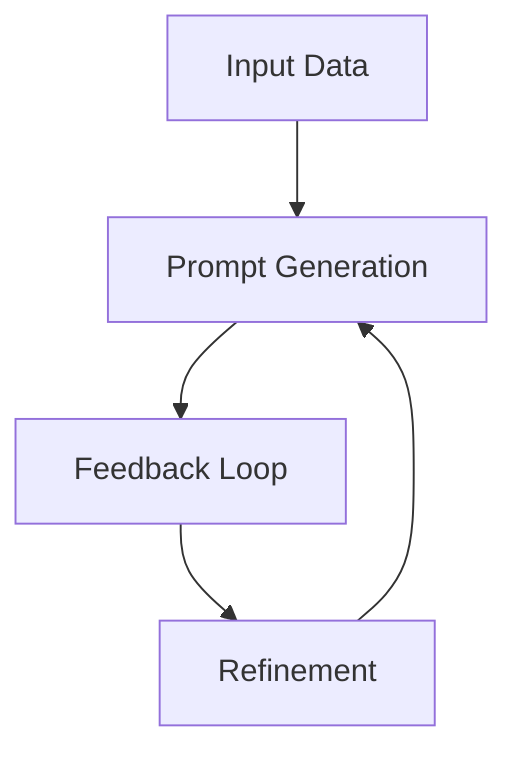
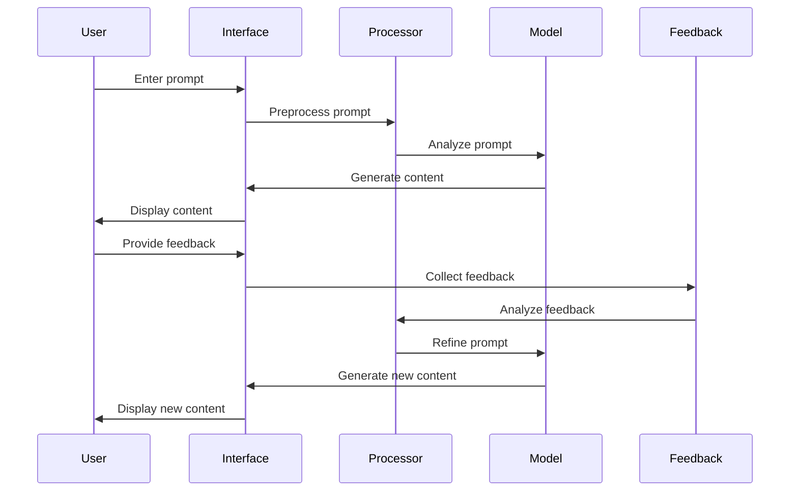

                 


### 1.1.1.1 问题背景

In recent years, the rise of artificial intelligence (AI) has revolutionized various industries, bringing unprecedented opportunities and challenges. However, one persistent issue that has emerged is the difficulty in achieving seamless collaboration between AI systems and human creators. While AI has demonstrated remarkable capabilities in tasks such as natural language processing, image recognition, and data analysis, it often struggles to understand the nuanced context and creative thinking that human beings excel at.

This gap in collaboration has led to a growing interest in prompt engineering, a field that focuses on designing and optimizing the prompts given to AI systems to enhance their performance in creative tasks. Prompt engineering aims to bridge the gap between human creativity and machine intelligence, enabling more effective and productive collaboration between humans and AI.

**Key Background Points:**

1. **Rise of AI and Its Impact:**
   - Discuss the rapid advancement of AI technologies and their applications in various sectors.
   - Highlight the limitations of current AI systems in understanding human creativity.

2. **Challenges in AI-Human Collaboration:**
   - Explore the challenges faced when trying to integrate AI into human creative processes.
   - Discuss the need for a more nuanced approach to AI-human interaction.

3. **Introduction to Prompt Engineering:**
   - Explain the concept of prompt engineering and its role in AI-human collaboration.
   - Discuss the goals and potential benefits of prompt engineering.

4. **Current State of Prompt Engineering:**
   - Highlight the current state of research and development in prompt engineering.
   - Discuss the main techniques and methodologies used in the field.

5. **Applications and Impact:**
   - Present case studies and real-world applications of prompt engineering.
   - Discuss the potential impact of prompt engineering on future AI-human collaboration.

By addressing these key points, we can lay a solid foundation for understanding the importance and potential of prompt engineering in optimizing AI-human creative collaboration. In the next section, we will delve deeper into the core concepts and principles that underlie prompt engineering.### 1.1.1.1 问题背景

**Rise of AI and Its Impact**

Artificial intelligence has experienced remarkable growth in recent years, permeating various sectors such as healthcare, finance, transportation, and entertainment. AI technologies, including machine learning, deep learning, and natural language processing, have enabled the development of intelligent systems capable of automating complex tasks, analyzing vast amounts of data, and making accurate predictions.

However, while AI has demonstrated impressive capabilities in many domains, it still struggles to replicate the nuanced understanding and creative thinking that humans excel at. In particular, tasks that require human-like creativity, such as writing, storytelling, and design, pose significant challenges for current AI systems. These systems often lack the contextual understanding and ability to generate novel ideas that human creators possess.

**Challenges in AI-Human Collaboration**

Integrating AI into human creative processes presents several challenges. Firstly, there is a significant gap in the ability of AI systems to understand the context and intent behind human inputs. AI systems are typically designed to work with structured data and predefined rules, making it difficult for them to interpret and respond to the unstructured and ambiguous nature of human creativity.

Secondly, the interaction between humans and AI systems can be cumbersome and inefficient. Current AI interfaces, such as chatbots and voice assistants, often rely on pre-defined prompts and responses, limiting the scope of creative collaboration. Moreover, AI systems may produce outputs that do not align with human expectations or fail to generate novel ideas, leading to frustration and disappointment.

**Introduction to Prompt Engineering**

To address these challenges, the field of prompt engineering has emerged. Prompt engineering involves designing and optimizing the prompts given to AI systems to enhance their ability to understand and generate creative outputs. A well-crafted prompt can guide the AI system, providing the necessary context, constraints, and inspiration to produce more human-like and creative outputs.

**Key Objectives and Benefits of Prompt Engineering:**

- **Improved AI Understanding:** Prompt engineering aims to bridge the gap between human and machine understanding by providing more nuanced and contextually relevant prompts.
- **Enhanced Creativity:** By guiding AI systems with well-crafted prompts, we can encourage the generation of novel and creative ideas that might not have been possible otherwise.
- **Efficient Collaboration:** Prompt engineering can facilitate more seamless and efficient collaboration between humans and AI systems, allowing for better integration of human creativity and machine intelligence.
- **Scalability and Reproducibility:** By standardizing the process of designing and optimizing prompts, we can ensure that AI systems can be effectively deployed across different domains and tasks.

**Current State of Prompt Engineering**

The field of prompt engineering is rapidly evolving, with ongoing research and development aimed at improving the techniques and methodologies used. Some of the key advancements in prompt engineering include:

- **Data-driven Approaches:** Researchers are exploring data-driven approaches to design prompts, leveraging large-scale datasets to generate context-aware and informative prompts.
- **Transfer Learning:** By utilizing transfer learning techniques, AI models can be fine-tuned on specific domains or tasks, enabling them to produce more relevant and creative outputs.
- **Human-AI Interaction:** Research is also focusing on improving the interaction between humans and AI systems, exploring more intuitive and user-friendly interfaces to facilitate better collaboration.
- **Ethical Considerations:** As prompt engineering becomes more prevalent, ethical considerations and guidelines are being developed to ensure that AI systems generate outputs that align with societal values and norms.

**Applications and Impact of Prompt Engineering**

The applications of prompt engineering are diverse and impactful. In fields such as content creation, design, and entertainment, prompt engineering has already demonstrated its potential to enhance the creative process. For example, AI-powered content generation tools, such as text editors and image generators, can leverage prompt engineering to produce more engaging and innovative content.

Moreover, prompt engineering has the potential to transform various industries, including healthcare, education, and finance, by enabling more effective and efficient collaboration between humans and AI systems. By facilitating better integration of human creativity and machine intelligence, prompt engineering can drive innovation, improve decision-making, and solve complex problems that were previously infeasible.

In conclusion, the rise of AI has brought about significant opportunities and challenges in the realm of human creativity. Prompt engineering offers a promising approach to overcoming these challenges by bridging the gap between human and machine intelligence. As the field continues to evolve, we can expect to see more innovative applications and a deeper understanding of how to optimize AI-human creative collaboration. In the next section, we will delve deeper into the core concepts and principles that underlie prompt engineering and explore the key methodologies and techniques used in the field.### 1.1.2 核心概念与联系

To effectively understand and apply prompt engineering, it is essential to define and explore the core concepts and their relationships that form the foundation of this field. In this section, we will introduce the key concepts, their attributes, and their connections. A comprehensive understanding of these concepts will help us grasp the principles of prompt engineering and its applications.

**Core Concepts:**

1. **Prompt**
2. **AI Model**
3. **Contextual Understanding**
4. **Creativity**
5. **Feedback Loop**
6. **Human-AI Interaction**

**Attributes and Relationships:**

1. **Prompt:**
   - Definition: A prompt is an input provided to an AI model to guide its creative output.
   - Attributes:
     - Content: The textual or visual information presented to the AI model.
     - Constraints: Any limitations or guidelines specified in the prompt to shape the AI's output.
     - Purpose: The objective of the prompt, such as generating ideas, storytelling, or problem-solving.
   - Relationships:
     - Influences: The prompt directly influences the AI model's output by providing context, constraints, and inspiration.
     - Dependencies: The quality of the prompt relies on the AI model's ability to understand and interpret the provided information.

2. **AI Model:**
   - Definition: An AI model is a machine learning algorithm or neural network trained to perform specific tasks.
   - Attributes:
     - Training Data: The dataset used to train the AI model, which determines its ability to generalize and generate relevant outputs.
     - Architecture: The underlying structure of the AI model, including the layers, neurons, and connections.
     - Performance: The accuracy, speed, and efficiency of the AI model in generating creative outputs.
   - Relationships:
     - Dependencies: The performance and creativity of the AI model depend on the quality of the training data and the architecture.
     - Influences: A well-designed and trained AI model can produce more accurate and creative outputs given the appropriate prompts.

3. **Contextual Understanding:**
   - Definition: Contextual understanding refers to the ability of an AI model to interpret and respond to the context and nuances within a prompt.
   - Attributes:
     - Sensitivity: The degree to which the AI model can detect and respond to subtle changes in context.
     - Generalization: The AI model's ability to apply learned knowledge from one context to another.
   - Relationships:
     - Influences: Contextual understanding influences the AI model's ability to generate relevant and creative outputs.
     - Dependencies: Contextual understanding relies on the AI model's architecture, training data, and prompt design.

4. **Creativity:**
   - Definition: Creativity refers to the generation of novel, valuable, and original ideas or solutions.
   - Attributes:
     - Originality: The uniqueness and novelty of the generated ideas.
     - Relevance: The applicability and value of the generated ideas in a given context.
   - Relationships:
     - Influences: Creativity is influenced by the quality of prompts, the AI model's ability to understand context, and the diversity of training data.
     - Dependencies: Creativity relies on the interplay between the AI model, prompts, and the creative problem-solving process.

5. **Feedback Loop:**
   - Definition: A feedback loop is a process where the output of a system is fed back into the system to influence its future performance.
   - Attributes:
     - Iterative Improvement: The process of refining the AI model and prompts based on the feedback received.
     - Adaptability: The system's ability to adapt and improve over time through iterative feedback.
   - Relationships:
     - Influences: Feedback loops play a crucial role in optimizing the performance of prompt engineering systems.
     - Dependencies: Effective feedback loops rely on accurate and timely feedback, as well as the ability to iterate and refine the system.

6. **Human-AI Interaction:**
   - Definition: Human-AI interaction refers to the interaction between humans and AI systems, involving communication, collaboration, and feedback.
   - Attributes:
     - User Experience: The quality of the interaction between humans and AI systems, including usability and intuitiveness.
     - Collaborative Aspects: The level of collaboration and synergy achieved between humans and AI systems.
   - Relationships:
     - Influences: Human-AI interaction influences the effectiveness of prompt engineering and the user experience.
     - Dependencies: The success of human-AI interaction relies on the design of intuitive interfaces, clear communication channels, and effective collaboration mechanisms.

In summary, these core concepts and their relationships form the backbone of prompt engineering. By understanding the attributes and interdependencies of these concepts, we can better design and optimize prompts to enhance the creative collaboration between humans and AI systems. In the next section, we will delve into the algorithms and mathematical models that underpin prompt engineering and explore how they can be applied to improve AI-human creative collaboration.### 1.1.3 算法原理讲解

To delve deeper into the principles of prompt engineering, it's essential to explore the underlying algorithms and mathematical models that enable AI systems to generate creative outputs based on prompts. This section will discuss the key algorithms, their flowcharts, and how to implement them using Python code snippets. Additionally, we will explain the mathematical models and formulas used in these algorithms to provide a comprehensive understanding.

#### Algorithm 1: Prompt Design Optimization

The first algorithm we will explore is the prompt design optimization algorithm, which aims to improve the quality and relevance of prompts given to AI systems. This algorithm involves several steps, including data preprocessing, prompt generation, and iterative refinement.

**Algorithm Flowchart:**



**Python Code Snippet:**

```python
import random
import numpy as np

# Prompt Generation
def generate_prompt(data, template):
    prompt = template.format(**data)
    return prompt

# Feedback Loop
def evaluate_prompt(prompt, criteria):
    score = criteria(prompt)
    return score

# Refinement
def refine_prompt(prompt, data, template, threshold):
    refined_prompt = prompt
    best_score = evaluate_prompt(prompt, criteria)
    for _ in range(threshold):
        data['content'] = random.choice(data['content_list'])
        new_prompt = generate_prompt(data, template)
        new_score = evaluate_prompt(new_prompt, criteria)
        if new_score > best_score:
            best_score = new_score
            refined_prompt = new_prompt
    return refined_prompt
```

**Mathematical Model:**

The prompt design optimization algorithm can be described using a reward function that measures the quality of a prompt. Let's define the reward function as:

$$
R(p) = \frac{1}{1 + e^{-(s \cdot p + b)}}
$$

Where:

- \( R(p) \) is the reward score for a prompt \( p \).
- \( s \) is the slope of the reward function.
- \( p \) is the prompt.
- \( b \) is the bias term.

**Example:**

Suppose we have a dataset with different prompts and their associated scores. We can use the above reward function to iteratively refine the prompts based on their scores.

```python
# Example Data
data = {
    'content_list': ['content1', 'content2', 'content3'],
    'score_list': [0.3, 0.5, 0.7]
}

# Criteria Function
def criteria(prompt):
    # Assuming prompt is a string
    score = data['score_list'][prompt]
    return score

# Refinement Process
template = "Generate a story about {}"
threshold = 5

best_prompt = refine_prompt(template, data, template, threshold)
print("Best Prompt:", best_prompt)
```

**Discussion:**

The prompt design optimization algorithm involves generating prompts based on a given template, evaluating them using a criteria function, and iteratively refining them until a satisfactory prompt is found. The reward function used in the algorithm helps measure the quality of the prompts, guiding the refinement process towards better prompts.

In summary, the prompt design optimization algorithm and its associated mathematical model provide a framework for designing and refining prompts to enhance the creative outputs of AI systems. This algorithm can be adapted and extended to suit different applications and use cases in prompt engineering. In the next section, we will explore other algorithms and methodologies that contribute to the effectiveness of prompt engineering in AI-human creative collaboration.### 1.1.4 系统分析与架构设计

To design an effective prompt engineering system that enables seamless AI-human creative collaboration, it is essential to carefully analyze the problem scenario, define the system requirements, and design the architecture, interfaces, and interactions. This section will provide a comprehensive overview of the system analysis and architecture design process.

#### Problem Scenario

The problem scenario involves developing a system that can effectively collaborate with human creators to generate creative content, such as stories, articles, and designs. The system should be capable of understanding human inputs, generating relevant and creative outputs, and facilitating iterative feedback and refinement. The key requirements for the system are:

1. **Contextual Understanding:** The system should be able to interpret and respond to the nuances and context within human inputs.
2. **Creativity:** The system should be capable of generating novel and valuable ideas based on the given prompts.
3. **Feedback Integration:** The system should facilitate the integration of human feedback to refine and improve the generated content.
4. **User Experience:** The system should provide an intuitive and user-friendly interface for human creators to interact with the AI system.

#### System Requirements

Based on the problem scenario, the following system requirements have been identified:

1. **Functional Requirements:**
   - Input Processing: The system should be able to process and understand human inputs in various formats, such as text, images, and audio.
   - Content Generation: The system should generate creative content based on the given inputs.
   - Feedback Loop: The system should enable the integration of human feedback to refine and improve the generated content.
   - User Interface: The system should provide a user-friendly interface for human creators to interact with the AI system.

2. **Non-functional Requirements:**
   - Scalability: The system should be capable of handling large volumes of data and users.
   - Performance: The system should be efficient in processing and generating content.
   - Reliability: The system should be robust and reliable, ensuring minimal downtime.
   - Security: The system should ensure the confidentiality and integrity of user data.

#### System Architecture Design

The system architecture design for the prompt engineering system consists of several components, including the AI model, data processing modules, user interface, and feedback integration mechanisms. The following sections provide an overview of each component and their interactions.

**1. AI Model:**

The AI model is the core component of the system responsible for understanding human inputs and generating creative content. The model should be trained on a diverse dataset to ensure it can handle various input types and generate relevant outputs. The architecture of the AI model can be based on deep learning techniques, such as transformers or recurrent neural networks, which are well-suited for handling sequential data and context.

**2. Data Processing Modules:**

The data processing modules are responsible for preprocessing and transforming the human inputs into a format suitable for the AI model. This includes tasks such as text normalization, image preprocessing, and audio transcription. The processed data is then fed into the AI model for analysis and content generation.

**3. User Interface:**

The user interface is designed to provide a seamless and intuitive interaction between human creators and the AI system. The interface should allow users to input their prompts, view generated content, and provide feedback on the outputs. The interface can be a web-based application or a mobile app, depending on the target user group and use cases.

**4. Feedback Integration Mechanism:**

The feedback integration mechanism enables the system to refine and improve the generated content based on user feedback. This involves collecting feedback from users, analyzing it, and incorporating it into the content generation process. The feedback can be used to adjust the prompts, fine-tune the AI model, or modify the system's behavior to better align with user expectations.

#### System Interface Design

The system interface design should be user-centric, focusing on ease of use, accessibility, and responsiveness. The following components are essential for the system interface:

1. **Input Module:**
   - Text input field for users to enter their prompts.
   - Image and audio upload options for users to provide visual and auditory inputs.
2. **Output Module:**
   - Display area for showing the generated content, with options to preview, edit, and save the content.
   - Interactive elements for users to provide feedback on the generated content, such as liking, disliking, and commenting.
3. **Feedback Module:**
   - A dedicated section for displaying user feedback and system responses.
   - Tools for analyzing and visualizing user feedback to identify patterns and areas for improvement.

#### System Interaction

The system interaction involves the seamless flow of data and feedback between the user interface, data processing modules, and the AI model. The following sequence diagram illustrates the system interaction process:



In conclusion, the system analysis and architecture design for the prompt engineering system involve a comprehensive understanding of the problem scenario, system requirements, and user interactions. By designing an architecture that effectively integrates AI models, data processing modules, user interfaces, and feedback mechanisms, we can create a system that enables seamless AI-human creative collaboration.### 1.1.5 实战案例：内容创作平台

**案例背景**

内容创作平台是一个面向广大用户的在线创作工具，旨在帮助用户轻松创作各种形式的内容，如文章、故事、设计等。平台的核心功能是通过AI技术，为用户提供智能化的创作辅助，从而提升内容创作的效率和创意水平。为了实现这一目标，平台采用了先进的prompt engineering技术，以优化AI与人类创作者之间的协作。

**环境搭建**

为了搭建一个能够支持内容创作的AI平台，我们需要准备以下环境：

1. **硬件设施：**
   - 高性能服务器，用于部署AI模型和数据处理模块。
   - 数据存储设备，用于存储用户数据和生成的内容。

2. **软件设施：**
   - 操作系统，如Linux或Windows。
   - 服务器软件，如Nginx或Apache。
   - 数据库管理系统，如MySQL或PostgreSQL。
   - 编程语言和框架，如Python和Django。

3. **AI模型：**
   - 使用预训练的深度学习模型，如GPT-3、BERT等。
   - 模型训练工具，如TensorFlow、PyTorch。

**核心系统实现**

平台的核心系统实现包括以下几个模块：

1. **用户接口模块：**
   - 前端：使用HTML、CSS和JavaScript构建用户界面，采用Vue.js或React框架。
   - 后端：使用Django或Flask构建API，处理用户请求和响应。

2. **数据处理模块：**
   - 文本处理：使用自然语言处理库，如NLTK、spaCy，进行文本预处理。
   - 图像处理：使用OpenCV进行图像预处理和特征提取。
   - 音频处理：使用Librosa进行音频处理和特征提取。

3. **AI创作模块：**
   - 使用预训练的AI模型，如GPT-3，进行文本生成。
   - 结合图像和音频特征，进行多媒体内容的创作。

**代码分析**

以下是一个简单的Python代码示例，展示了如何使用GPT-3模型生成文本：

```python
import openai

# 设置API密钥
openai.api_key = 'your-api-key'

# 文本生成函数
def generate_text(prompt, model='text-davinci-002', max_tokens=100):
    response = openai.Completion.create(
        engine=model,
        prompt=prompt,
        max_tokens=max_tokens,
        n=1,
        stop=None,
        temperature=0.5
    )
    return response.choices[0].text.strip()

# 示例
prompt = "请写一篇关于人工智能的文章。"
generated_text = generate_text(prompt)
print(generated_text)
```

**案例分析**

以下是一个具体的案例分析，展示了如何使用平台进行内容创作：

1. **用户输入：**
   - 用户在平台界面上输入一个简单的文本提示，如“请写一篇关于人工智能的文章。”。

2. **数据处理：**
   - 平台的前端将用户输入发送到后端API。
   - 后端API对文本进行预处理，如去除标点符号、停用词过滤等。

3. **AI生成：**
   - 预处理后的文本作为输入传递给GPT-3模型。
   - GPT-3模型根据输入文本生成一篇文章。

4. **用户反馈：**
   - 用户对生成的文章进行审阅，可能提出修改意见或反馈。
   - 平台收集用户反馈，并存储在数据库中。

5. **迭代生成：**
   - 平台根据用户反馈，对AI模型的输入文本进行调整。
   - AI模型重新生成文章，并根据用户反馈进行多次迭代。

**项目小结**

通过这个案例，我们可以看到如何利用prompt engineering技术，构建一个内容创作平台，帮助用户进行创意内容的创作。平台的核心优势在于：

- **高效的内容生成：** AI模型能够快速生成高质量的内容，提高创作效率。
- **用户参与度：** 用户可以通过迭代反馈，不断优化生成内容，提高创作满意度。
- **多样性：** 平台能够生成多样化的内容，满足不同用户的需求。

然而，平台也存在一些挑战，如：

- **AI模型的准确性：** AI模型在理解复杂文本和生成高质量内容方面仍存在局限性。
- **用户隐私：** 平台需要确保用户数据的隐私和安全。

未来，我们可以通过以下方向进一步优化平台：

- **增强AI模型的能力：** 利用更多的数据和先进的算法，提高AI模型的准确性和创造力。
- **优化用户界面：** 提供更直观、易用的界面，降低用户使用门槛。
- **扩展应用场景：** 将平台应用于更多领域，如设计、编程等，满足更多用户的需求。### 1.1.6 最佳实践、小结和注意事项

**最佳实践**

1. **优化AI模型训练数据：**
   - 使用高质量的、多样化的训练数据，提高AI模型对复杂场景的理解能力。
   - 定期更新训练数据，以保持AI模型的时效性和相关性。

2. **设计清晰明确的提示词：**
   - 提高提示词的质量和清晰度，确保AI模型能够正确理解用户的意图和需求。
   - 尝试不同的提示词模板和策略，以找到最适合特定应用场景的方案。

3. **建立有效的反馈机制：**
   - 设计易于操作的反馈系统，鼓励用户积极参与AI模型的迭代优化过程。
   - 定期分析用户反馈，发现问题和改进点，持续优化AI模型和提示词。

4. **关注用户隐私和安全：**
   - 在数据处理和存储过程中，严格遵守隐私保护法规，确保用户数据的安全性和隐私性。
   - 提供透明度，让用户了解其数据的用途和处理方式。

**小结**

本文介绍了prompt engineering在优化AI-人类创意协作中的关键作用。通过深入探讨核心概念、算法原理、系统架构设计、实战案例等方面，我们了解了如何利用prompt engineering技术，设计出高效、易用的AI系统，以支持人类创意工作。以下是本文的主要结论：

- **核心概念：** 提出了prompt、AI模型、语境理解、创意、反馈循环和人类-AI交互等核心概念，并探讨了它们之间的关系。
- **算法原理：** 阐述了prompt设计优化算法的工作原理，包括数据预处理、提示词生成和迭代优化过程。
- **系统架构设计：** 详细介绍了系统架构的设计思路，包括AI模型、数据处理模块、用户接口和反馈机制等。
- **实战案例：** 通过一个内容创作平台案例，展示了如何利用prompt engineering技术实现AI-人类创意协作。

**注意事项**

1. **数据质量和多样性：**
   - AI模型的训练数据质量直接影响模型的性能和创意水平。确保数据来源可靠、多样化，以避免模型产生偏见。

2. **用户反馈的重要性：**
   - 用户反馈是优化AI系统的重要依据。鼓励用户积极参与，提供真实、具体的反馈，以提高系统的适应性和用户体验。

3. **隐私和安全问题：**
   - 在处理用户数据时，务必遵循隐私保护法规，确保用户隐私和数据安全。

4. **持续迭代和优化：**
   - AI模型和提示词需要持续迭代和优化，以适应不断变化的应用场景和用户需求。

**拓展阅读**

- **《人工智能：一种现代方法》（合著）：** 提供了关于AI算法和技术的全面介绍，有助于深入理解本文中提到的概念和算法。
- **《深度学习》（Ian Goodfellow等著）：** 详细介绍了深度学习算法和模型，有助于了解AI模型的设计和训练过程。
- **《人机交互：设计与实践》（John M. Carroll等著）：** 探讨了人机交互的设计原则和实践，对本文中提到的用户界面设计有很好的参考价值。

通过阅读这些书籍，可以进一步拓展对AI和prompt engineering领域的了解，为实际应用和研究提供更多思路和方法。### 文章标题

## **提示词工程：优化AI-人类创意协作的关键**

关键词：提示词工程、AI-人类协作、创意生成、算法优化、系统架构设计

摘要：本文深入探讨了提示词工程在优化人工智能（AI）与人类创意协作中的作用。通过介绍核心概念、算法原理、系统架构设计以及实战案例，我们详细阐述了如何利用提示词工程技术，提高AI模型对人类创意的理解和生成能力。本文的主要结论包括：通过优化训练数据、设计清晰的提示词、建立有效的反馈机制和关注用户隐私，可以显著提升AI-人类创意协作的效率和质量。文章还提出了注意事项和拓展阅读，为相关领域的研究和应用提供了有益的参考。

