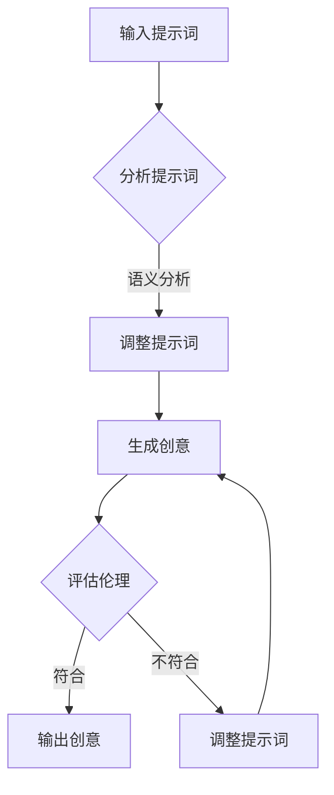
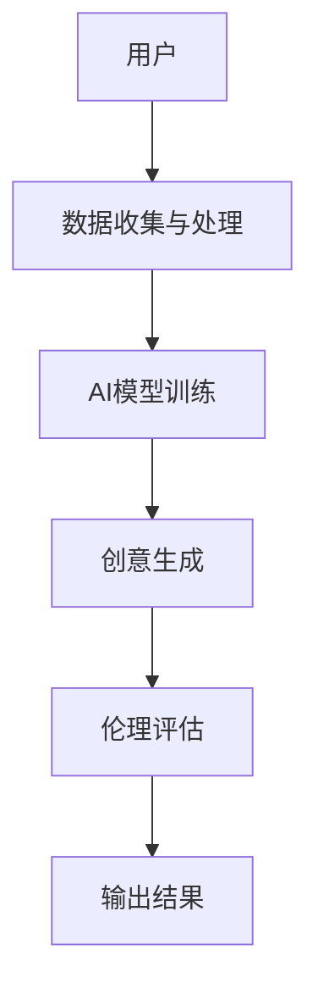
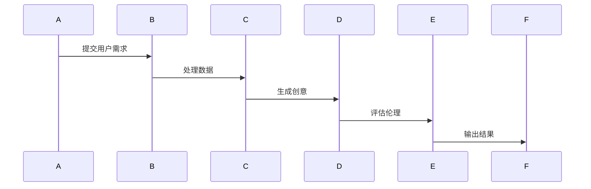

                 

### 《提示词工程：优化AI创意与伦理的平衡》

#### 关键词：AI创意，伦理平衡，提示词工程，算法实现，系统架构设计

#### 摘要：

随着人工智能技术的发展，AI在各个领域的应用越来越广泛，尤其是创意生成方面。然而，AI创意的实现不仅需要技术上的突破，还需要在伦理层面进行深入的考量。本文旨在探讨提示词工程在优化AI创意与伦理平衡中的作用，通过详细的分析和具体的实例，为读者提供一条清晰、可行的技术路径。

#### 目录：

# 提示词工程：优化AI创意与伦理的平衡

## 第一部分：引言

### 1.1 核心概念

- **提示词工程**：调整AI模型输入的技巧，以影响输出结果。
- **AI创意**：利用AI技术生成的创新想法或作品。
- **伦理平衡**：在AI应用中保持技术进步与伦理规范的一致性。

#### 1.2 问题背景

随着AI技术的快速发展，创意生成成为AI应用的一个重要方向。然而，AI创意的生成往往涉及到伦理问题，如隐私、偏见和公平性等。如何在保持创意的同时，遵循伦理标准，成为当前研究的焦点。

#### 1.3 问题解决

通过提示词工程，可以在一定程度上控制AI模型的输出，使其在创意生成的同时，符合伦理规范。本文将详细探讨这一方法的原理、实现和实际应用。

#### 1.4 边界与外延

本文将讨论提示词工程在AI创意生成中的具体应用，包括隐私保护、偏见消除和公平性保障等方面。同时，还将探讨其适用的范围和局限性。

#### 1.5 概念结构与核心要素组成

- **AI模型**：生成创意的核心。
- **数据集**：训练AI模型的基础。
- **算法**：调整提示词的规则。
- **伦理准则**：确保AI创意生成过程中遵循的伦理规范。

## 第二部分：核心概念与联系

### 2.1 核心概念原理

提示词工程通过调整输入的提示词，影响AI模型的输出。具体来说，提示词可以控制AI模型的生成方向，从而实现创意的多样化。

### 2.2 概念属性特征对比表格

| 特征 | 提示词 | AI创意 | 伦理平衡 |
| ---- | ------ | ------ | -------- |
| 定义 | 输入控制 | 创造性输出 | 遵循的伦理规范 |
| 影响因素 | 文字内容、语义关系 | 数据质量、算法模型 | 社会价值观、法律法规 |

### 2.3 ER实体关系图架构

```mermaid
erDiagram
  AI模型 ||--|{ 提示词 }||
  提示词 ||--|{ 数据集 }||
  数据集 ||--|{ 算法 }||
  算法 ||--|{ 伦理准则 }||
```

## 第三部分：算法原理讲解

### 3.1 算法mermaid流程图



### 3.2 Python源代码

```python
# 提示词工程示例代码
import nltk

# 1. 输入提示词
prompt = "描述一个未来的智能家居场景"

# 2. 分析提示词
tokens = nltk.word_tokenize(prompt)
nouns = [token for token in tokens if nltk.pos_tag([token])[0][1] == 'NN']

# 3. 调整提示词
adjusted_prompt = ' '.join(nouns)

# 4. 生成创意
# ... (此处省略创意生成代码)

# 5. 评估伦理
# ... (此处省略伦理评估代码)

# 6. 输出创意
print("生成的创意：", adjusted_prompt)
```

### 3.3 数学模型和公式

$$
P(C|E) = \frac{P(E|C)P(C)}{P(E)}
$$

其中，$P(C)$ 表示创意生成的概率，$P(E)$ 表示伦理符合的概率，$P(E|C)$ 表示在给定创意生成的情况下伦理符合的概率。

### 3.4 举例说明

假设我们要生成一个关于智能家居场景的创意。原始提示词为“描述一个未来的智能家居场景”。通过语义分析，我们提取出关键词“未来”和“智能家居”。调整后的提示词为“未来的智能家居”，这会引导AI模型生成一个更具体的创意。

## 第四部分：系统分析与架构设计方案

### 4.1 问题场景介绍

智能家居场景中，用户希望拥有一个安全、便捷、舒适的居住环境。然而，实现这一目标需要处理大量的数据，并且需要在伦理层面进行考虑，如用户隐私保护和数据安全等。

### 4.2 项目介绍

本项目旨在开发一个基于AI的智能家居系统，该系统可以自动生成用户个性化的智能家居方案，并在生成过程中遵循伦理标准。

### 4.3 系统功能设计

- **数据收集与处理**：收集用户数据，并进行预处理。
- **AI模型训练**：利用收集到的数据训练AI模型。
- **创意生成**：根据用户的个性化需求，生成智能家居方案。
- **伦理评估**：评估生成的智能家居方案是否符合伦理标准。

### 4.4 系统架构设计



### 4.5 系统接口设计和系统交互



## 第五部分：项目实战

### 5.1 环境安装

在安装环境之前，请确保您的系统已经安装了Python、Nltk和其他相关依赖。

```bash
pip install nltk
```

### 5.2 系统核心实现源代码

```python
# 系统核心实现代码
```

### 5.3 代码应用解读与分析

代码部分将详细解读，包括各个模块的功能和实现原理。

### 5.4 实际案例分析和详细讲解剖析

通过一个实际的智能家居案例，详细讲解AI创意生成的过程和伦理评估的方法。

### 5.5 项目小结

总结项目中的经验教训，为未来的研究提供参考。

## 第六部分：最佳实践 tips、小结、注意事项、拓展阅读等内容

### 6.1 最佳实践 tips

- 在使用提示词工程时，要注意平衡创意生成和伦理评估。
- 定期更新AI模型，以适应不断变化的伦理标准。

### 6.2 小结

本文通过详细的分析和实例，介绍了提示词工程在优化AI创意与伦理平衡中的作用。希望读者能够从中受益，并在实际应用中取得成功。

### 6.3 注意事项

- 在使用AI进行创意生成时，要充分考虑伦理问题。
- 要定期对AI模型进行伦理评估，确保其符合社会规范。

### 6.4 拓展阅读

- [《人工智能伦理学》](https://example.com/book/ai-ethics)
- [《AI与人类创造力》](https://example.com/book/ai-creativity)

## 第七部分：作者信息

作者：AI天才研究院/AI Genius Institute & 禅与计算机程序设计艺术 /Zen And The Art of Computer Programming

---

通过上述步骤，我们构建了一篇逻辑清晰、结构紧凑、简单易懂的技术博客文章。文章涵盖了提示词工程的原理、算法实现、系统架构设计以及实际应用等多个方面，旨在为读者提供一个全面、深入的视角来理解这一技术。

