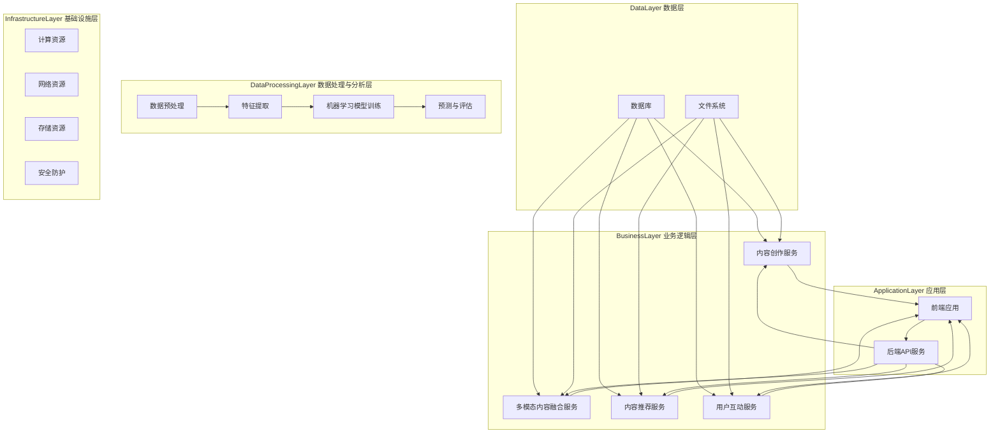
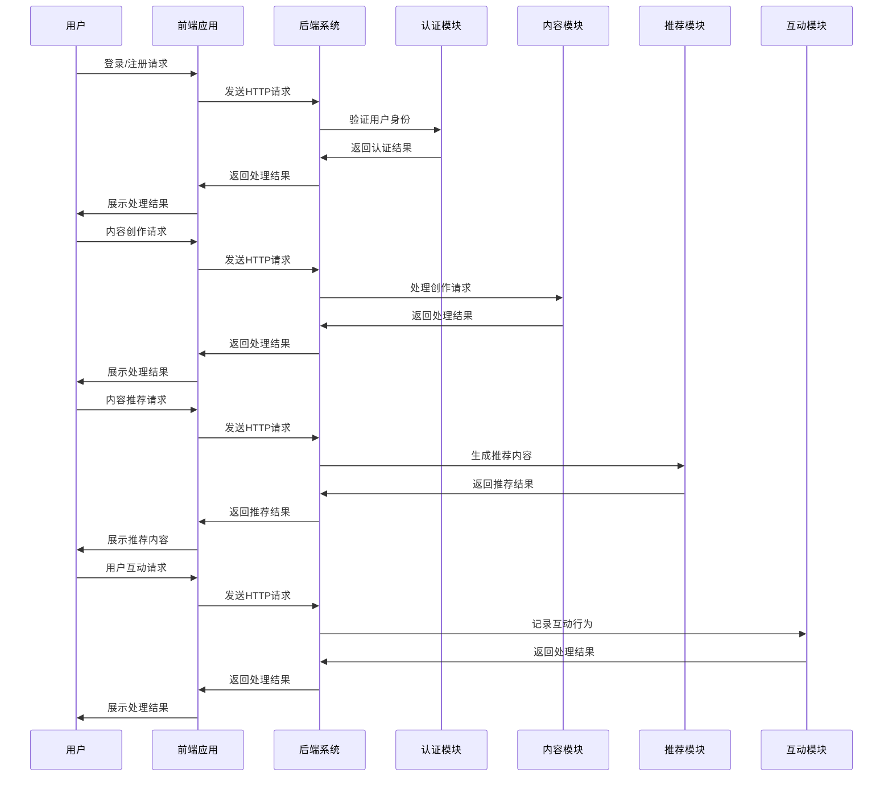

                 

### 1.1 问题背景

#### 1.1.1 AI与多模态内容创作的兴起

人工智能（AI）作为当前技术发展的前沿领域，已经在许多行业中引起了深远的变革。随着深度学习、自然语言处理和计算机视觉等技术的迅猛发展，AI在内容创作领域也展现出了强大的潜力。特别是在多模态内容创作方面，AI的应用不仅改变了内容创作的生产方式，也拓宽了内容的呈现形式。

多模态内容创作是指同时结合多种数据类型（如文本、图像、音频、视频等）进行内容创作的过程。这种多样化的数据形式可以带来更加丰富和生动的用户体验，使得内容更具吸引力和表现力。例如，在新闻报道中，结合视频、图片和文字的报道可以更加直观和全面地传递信息；在教育领域，多模态课件可以更好地激发学生的学习兴趣和参与度。

AI在多模态内容创作中的应用主要体现在两个方面：一是自动化内容生成，二是内容优化与个性化推荐。自动化内容生成利用AI模型，如生成对抗网络（GAN）和变分自编码器（VAE），可以自动生成高质量的图像、视频和音频；而内容优化与个性化推荐则利用AI算法，如协同过滤和内容基于的推荐，根据用户行为和偏好，为用户提供定制化的内容。

然而，尽管AI在多模态内容创作中展现出了巨大的潜力，当前的内容创作仍然面临着一些挑战和局限。首先，高质量的多模态数据集的获取和标注是一个巨大的难题，特别是在涉及音频和视频数据时。其次，现有的多模态AI模型在处理复杂的多模态数据时，往往难以达到理想的性能和效果。此外，多模态内容的创作和编辑过程也相对繁琐，缺乏有效的工具和平台支持。

#### 1.1.2 当前内容创作的挑战与局限

当前内容创作面临的主要挑战和局限包括：

1. **数据质量和多样性不足**：高质量、多样化的多模态数据集对于训练和优化AI模型至关重要。然而，现有的数据集往往存在数据量不足、标注不完整、数据质量低等问题，这限制了AI模型的性能和泛化能力。

2. **模型复杂度和计算资源需求**：多模态AI模型通常涉及大量的参数和计算资源，导致模型训练和推理过程时间较长，成本较高。此外，不同数据类型的融合和处理也需要复杂的算法和架构设计。

3. **模型泛化能力有限**：虽然AI模型在特定任务上取得了显著的进展，但其在面对新的、未见过的问题时，往往表现出泛化能力不足的问题。特别是在多模态内容创作中，不同数据类型之间的相互作用和融合机制仍需深入研究。

4. **用户体验和内容质量的平衡**：多模态内容创作需要兼顾用户体验和内容质量。如何在保证内容质量的同时，提供丰富的用户体验，是内容创作者和技术开发者需要共同面对的挑战。

5. **隐私和安全问题**：随着多模态内容创作技术的发展，用户隐私和数据安全问题也日益突出。如何确保用户数据的安全和隐私，防止数据泄露和滥用，是技术发展过程中必须考虑的重要问题。

#### 1.1.3 提示词工程的概念及其重要性

提示词工程（Prompt Engineering）是优化AI多模态内容创作的重要手段之一。它通过设计特定的提示词，引导AI模型进行内容生成和优化，从而提高内容的质量和多样性。提示词工程的核心目标是利用人类的专业知识和创造力，结合AI的计算能力和数据处理能力，实现高效、高质量的内容创作。

提示词工程的重要性主要体现在以下几个方面：

1. **优化模型表现**：通过设计特定的提示词，可以引导AI模型学习到更符合人类预期的内容生成策略，从而提高模型在多模态内容创作中的表现。

2. **提高内容多样性**：提示词工程可以引入多样性的元素，使得AI模型能够生成更多样化的内容，满足用户的不同需求和偏好。

3. **提升用户体验**：通过优化内容创作过程，提供更加个性化和高质量的内容，可以提升用户的整体体验和满意度。

4. **降低创作门槛**：提示词工程可以简化内容创作流程，降低创作者的技术门槛，使得非专业用户也能轻松参与内容创作。

5. **应对数据挑战**：在数据质量和多样性不足的情况下，提示词工程可以通过设计针对性的提示词，引导模型学习到更多有用的信息，弥补数据不足的问题。

总之，提示词工程作为AI多模态内容创作的重要工具，不仅能够提高内容创作的效率和质量，还能推动AI技术在各个领域的应用和发展。

#### 1.2 核心概念与联系

在探讨提示词工程之前，我们需要了解一些核心概念，以及它们在多模态内容创作中的联系。

##### 1.2.1 提示词、模型与数据的关系

提示词（Prompt）是引导AI模型进行内容创作的重要工具。它通常是一个短句或一段文本，用来描述创作任务的目标、上下文或约束条件。在多模态内容创作中，提示词不仅可以帮助模型理解创作任务，还可以引导模型在内容生成过程中关注特定的元素和特征。

模型（Model）是多模态内容创作的核心。常见的AI模型包括生成对抗网络（GAN）、变分自编码器（VAE）和Transformer等。这些模型通过学习大量的数据，能够自动生成高质量的图像、视频和音频。在提示词工程中，模型的作用是接受提示词，并基于提示词生成对应的内容。

数据（Data）是训练和优化AI模型的基础。多模态数据包括文本、图像、音频、视频等多种形式。高质量的数据集可以提供丰富的信息，帮助模型更好地学习内容和特征。在提示词工程中，数据的多样性和质量直接影响模型的性能和生成内容的质量。

提示词、模型与数据之间的关系可以用一个简化的流程来描述：

1. **数据收集与预处理**：首先，收集和预处理多模态数据，确保数据的质量和多样性。
2. **提示词设计**：根据具体的内容创作任务，设计相应的提示词，明确任务的目标和上下文。
3. **模型训练**：使用预处理后的数据集和设计的提示词，训练AI模型。
4. **内容生成**：模型根据训练结果和提示词生成对应的内容。
5. **反馈与优化**：根据生成内容的质量和效果，对提示词和模型进行优化。

##### 1.2.2 多模态内容创作的概念与分类

多模态内容创作是指同时结合多种数据类型（如文本、图像、音频、视频等）进行内容创作的过程。这种多样化的数据形式可以带来更加丰富和生动的用户体验。

多模态内容创作可以按以下几种方式进行分类：

1. **顺序多模态内容创作**：按照时间顺序整合多种数据类型，如视频中的文本描述、音频注释等。这种方式的典型应用是视频制作和多媒体新闻编辑。

2. **并行多模态内容创作**：同时处理多种数据类型，如图像和音频的同步合成。这种方式的典型应用是虚拟现实（VR）和增强现实（AR）内容创作。

3. **交互式多模态内容创作**：用户与内容之间的互动，如语音交互、手势识别等。这种方式的典型应用是智能家居和游戏设计。

##### 1.2.3 提示词工程与相关技术的对比

提示词工程与自然语言处理（NLP）、计算机视觉（CV）和其他相关技术有着紧密的联系和区别。

1. **自然语言处理（NLP）**：NLP专注于处理和分析自然语言数据，包括文本理解、语言生成、情感分析等。在多模态内容创作中，NLP可以用于生成文本提示词，辅助模型进行内容创作。

2. **计算机视觉（CV）**：CV专注于图像和视频数据的处理和理解，包括目标检测、图像分割、图像生成等。在多模态内容创作中，CV可以用于生成图像和视频提示词，提升内容的视觉效果。

3. **生成对抗网络（GAN）**：GAN是一种能够生成高质量图像和视频的深度学习模型。GAN可以与提示词工程结合，通过设计特定的提示词，引导GAN生成更加符合人类预期的内容。

4. **变分自编码器（VAE）**：VAE是一种用于图像和视频生成的深度学习模型，通过概率模型生成数据。VAE可以与提示词工程结合，通过优化提示词，提高生成内容的多样性和质量。

5. **Transformer模型**：Transformer是一种在自然语言处理中表现卓越的深度学习模型，通过自注意力机制处理长距离依赖关系。Transformer可以用于生成文本提示词，辅助多模态内容创作。

总之，提示词工程通过结合自然语言处理、计算机视觉和其他相关技术，为多模态内容创作提供了强大的工具和方法。通过设计合适的提示词，可以引导AI模型生成更加丰富、多样和高质量的内容。

#### 1.3 提示词工程的边界与外延

提示词工程作为一个新兴的领域，其应用范围广泛，但同时也存在一定的边界和挑战。以下是提示词工程的几个关键方面：

##### 1.3.1 提示词工程的适用场景

提示词工程主要适用于以下场景：

1. **内容生成**：在内容创作领域，特别是多模态内容创作中，提示词工程可以用于生成高质量的文本、图像、音频和视频。例如，在新闻报道、影视制作、广告宣传等方面，通过设计特定的提示词，可以引导AI模型生成符合预期和创意的内容。

2. **个性化推荐**：在推荐系统中，提示词工程可以通过分析用户行为和偏好，为用户提供个性化推荐。例如，在音乐、视频、新闻等领域的个性化内容推荐，通过设计个性化的提示词，可以提升推荐的准确性和用户体验。

3. **数据增强**：在数据科学和机器学习领域，提示词工程可以通过生成新的数据样本，增强模型的训练效果。例如，在图像识别、语音识别等任务中，通过设计特定的提示词，可以生成新的图像和语音数据，提高模型的泛化能力。

4. **交互式应用**：在交互式应用中，如聊天机器人、虚拟助手等，提示词工程可以通过生成互动性的文本和对话，提升用户的互动体验和满意度。

##### 1.3.2 提示词工程的挑战

尽管提示词工程在多个领域展现出了巨大的潜力，但仍然面临以下挑战：

1. **数据质量**：高质量、多样化的数据是提示词工程的基础。然而，在多模态数据集的获取和标注过程中，常常面临数据量不足、标注不完整、数据质量低等问题。这些问题会直接影响模型的训练效果和生成内容的质量。

2. **模型适应性**：不同的AI模型在处理多模态数据时，对提示词的需求和响应方式可能不同。提示词工程需要针对不同的模型和任务，设计相应的提示词策略，以实现最佳效果。

3. **计算资源**：多模态内容创作通常需要大量的计算资源和时间。特别是在生成高质量图像和视频时，模型的训练和推理过程需要消耗大量的计算资源。如何高效地利用计算资源，是提示词工程需要考虑的重要问题。

4. **隐私和安全**：在多模态内容创作中，用户隐私和数据安全是重要的问题。设计提示词时，需要考虑如何保护用户隐私，防止数据泄露和滥用。

##### 1.3.3 提示词工程的未来发展趋势

随着AI技术和多模态内容创作领域的不断发展，提示词工程在未来有以下几个发展趋势：

1. **多模态融合**：未来的提示词工程将更加注重多模态数据的融合，通过设计更加复杂的提示词，实现多种数据类型的有机结合，生成更加丰富和高质量的内容。

2. **个性化与定制化**：随着用户需求的多样化和个性化，提示词工程将更加注重根据用户行为和偏好，设计个性化的提示词，提供更加定制化的内容。

3. **自动化与智能化**：未来的提示词工程将朝着更加自动化和智能化的方向发展。通过引入更多的自动化工具和算法，简化提示词的设计和优化过程，提高内容创作的效率和效果。

4. **伦理与法规**：随着提示词工程在各个领域的广泛应用，伦理和法规问题也将日益突出。未来的提示词工程需要遵循相应的伦理规范和法律法规，确保内容创作的合法性和合规性。

总之，提示词工程作为多模态内容创作的重要工具，具有广泛的应用前景和发展潜力。通过不断优化和改进提示词设计方法，我们可以期待未来在多模态内容创作领域取得更多的突破和进展。

#### 1.4 概念结构与核心要素组成

提示词工程作为AI多模态内容创作的重要工具，其概念结构包括多个核心要素。以下是这些要素的详细解析：

##### 1.4.1 提示词工程的基本架构

提示词工程的基本架构可以概括为以下几个主要模块：

1. **数据采集与预处理**：数据采集与预处理是提示词工程的基础。在这一阶段，需要收集和整理多模态数据（如文本、图像、音频、视频等），并进行预处理，包括数据清洗、格式转换和标准化等操作。高质量的数据为后续的模型训练和提示词设计提供了坚实的基础。

2. **提示词设计**：提示词设计是提示词工程的核心环节。在这一阶段，根据具体的内容创作任务和目标，设计特定的提示词。提示词可以是短句或段落，用于引导AI模型理解创作任务的目标、上下文和约束条件。设计好的提示词需要具备清晰、具体和引导性，以便有效地指导模型生成内容。

3. **模型训练与优化**：模型训练与优化是提示词工程的关键步骤。在这一阶段，使用预处理后的数据和设计的提示词，对AI模型进行训练和优化。常见的AI模型包括生成对抗网络（GAN）、变分自编码器（VAE）和Transformer等。通过多次迭代训练，模型可以逐步学习到更符合人类预期和创意的内容生成策略。

4. **内容生成与评估**：在模型训练和优化完成后，利用训练好的模型和提示词生成内容。生成的内容需要经过质量评估，以确保满足创作目标和用户需求。评估过程可以包括自动评估（如图像质量评分）和人工评估（如用户满意度调查）。

5. **反馈与优化**：根据生成内容的质量和效果，对提示词和模型进行优化。这一过程是一个迭代循环，通过不断的反馈和调整，逐步提高内容创作的效率和效果。

##### 1.4.2 关键技术要素

提示词工程涉及多个关键技术要素，以下是其中的几个重要方面：

1. **多模态数据处理**：多模态数据处理是提示词工程的核心。在这一阶段，需要处理和融合来自不同模态的数据（如文本、图像、音频、视频等）。常用的技术包括特征提取、数据融合和增强等。

2. **AI模型选择与优化**：AI模型的选择和优化是影响内容创作质量的关键。不同的AI模型（如GAN、VAE、Transformer等）适用于不同的任务和场景。需要根据具体的需求，选择合适的模型，并进行参数调整和优化，以提高模型的性能和生成效果。

3. **提示词生成与优化**：提示词生成与优化是提升内容创作质量的关键步骤。通过设计具有明确目标、上下文和引导性的提示词，可以有效地指导模型生成符合预期和创意的内容。提示词的设计和优化需要结合人类专业知识和AI模型的特性，实现高效的内容生成。

4. **内容评估与反馈**：内容评估与反馈是优化提示词工程的重要环节。通过自动评估（如图像质量评分）和人工评估（如用户满意度调查），可以评估生成内容的质量和效果，并根据评估结果对提示词和模型进行优化。

##### 1.4.3 提示词工程的核心流程

提示词工程的核心流程可以概括为以下几个步骤：

1. **需求分析**：明确内容创作任务的目标和需求，确定需要结合的模态类型和具体要求。

2. **数据收集与预处理**：收集和整理多模态数据，并进行预处理，包括数据清洗、格式转换和标准化等。

3. **提示词设计**：根据需求分析结果，设计特定的提示词，用于引导AI模型理解创作任务的目标和上下文。

4. **模型选择与训练**：选择适合的AI模型，并使用预处理后的数据和设计的提示词进行训练和优化。

5. **内容生成**：利用训练好的模型和提示词，生成对应的内容。

6. **内容评估**：对生成的内容进行质量评估，包括自动评估和人工评估，确保内容满足创作目标和用户需求。

7. **反馈与优化**：根据评估结果，对提示词和模型进行优化，实现内容创作效果的不断提升。

通过上述核心流程，提示词工程实现了从需求分析到内容生成的全流程优化，提高了多模态内容创作的效率和质量。未来，随着AI技术和多模态内容创作领域的不断发展，提示词工程将在此基础上不断创新和突破，为各个行业提供更加丰富和高效的内容创作解决方案。

### 2.1 多模态数据处理

多模态数据处理是AI多模态内容创作的基础，涉及音频、图像、文本等不同数据类型的处理方法。以下是这些数据类型的处理步骤、预处理技术和特征提取方法。

##### 2.1.1 音频、图像、文本等数据类型

在多模态数据处理中，常见的数据类型包括音频、图像和文本。每种数据类型都有其独特的处理方法和挑战。

1. **音频数据**：音频数据包括语音、音乐和环境声音等。处理音频数据的关键步骤包括噪声过滤、语音增强和特征提取。噪声过滤通过去除背景噪声，提高语音清晰度；语音增强通过增强语音信号，使其更易于识别；特征提取则通过提取音频信号中的关键特征，如频谱特征、短时傅里叶变换（STFT）特征等，为后续的模型训练提供输入。

2. **图像数据**：图像数据在多模态内容创作中起着重要作用，常见的图像处理步骤包括图像增强、图像分割和特征提取。图像增强通过调整图像的亮度、对比度和色彩等参数，改善图像质量；图像分割则是将图像划分为不同的区域，以便提取目标特征；特征提取通过提取图像中的纹理、形状和颜色等特征，为模型训练提供输入。

3. **文本数据**：文本数据包括自然语言文本和标注信息等。处理文本数据的关键步骤包括文本预处理、词向量和特征提取。文本预处理通过去除标点符号、停用词过滤和分词等操作，将原始文本转化为适合模型处理的格式；词向量通过将文本转化为向量表示，保留语义信息；特征提取则通过提取文本中的关键特征，如词频、词向量等，为模型训练提供输入。

##### 2.1.2 数据预处理与融合技术

数据预处理与融合技术在多模态数据处理中至关重要，以下是一些常用的预处理和融合技术：

1. **数据预处理**：
   - **图像预处理**：包括图像缩放、裁剪、旋转等操作，以便统一数据尺寸和姿态。
   - **音频预处理**：包括音频裁剪、归一化、去噪等操作，提高音频数据的可识别性。
   - **文本预处理**：包括分词、词干提取、词性标注等操作，为后续特征提取做好准备。

2. **数据融合技术**：
   - **特征级融合**：将不同模态的特征进行合并，如将图像特征和文本特征进行拼接，形成多维特征向量。
   - **决策级融合**：将不同模态的模型输出结果进行融合，如将图像分类结果和文本分类结果进行投票，得到最终的分类结果。
   - **空间融合**：通过在空间维度上组合不同模态的数据，如将图像和视频数据进行时空融合，形成更丰富的数据集。

##### 2.1.3 多模态特征提取

多模态特征提取是利用各种技术提取多模态数据中的关键信息，为模型训练提供有效的输入。以下是常用的多模态特征提取方法：

1. **图像特征提取**：
   - **卷积神经网络（CNN）**：CNN通过多层卷积和池化操作，从图像中提取纹理、形状和局部特征。常用的CNN模型包括VGG、ResNet和Inception等。
   - **深度学习特征提取**：使用预训练的深度学习模型（如ResNet、Inception等）提取图像特征，然后进行后续的模型训练和预测。

2. **音频特征提取**：
   - **频谱特征**：包括短时傅里叶变换（STFT）、梅尔频谱（Mel-spectrogram）和滤波器组（Filter Bank）等。这些特征可以捕捉音频的频率和时域信息。
   - **时域特征**：包括短时能量、过零率和均方根（RMS）等。这些特征可以捕捉音频的时域特性。

3. **文本特征提取**：
   - **词袋模型（Bag-of-Words, BoW）**：将文本表示为词频向量，通过统计每个词汇在文本中的出现频率来表示文本。
   - **词嵌入（Word Embedding）**：通过将词汇映射到高维向量空间，保留词汇的语义信息。常用的词嵌入方法包括Word2Vec、GloVe和BERT等。
   - **句子嵌入（Sentence Embedding）**：通过将句子映射到高维向量空间，保留句子的语义信息。常用的句子嵌入方法包括BERT、ELMO和GPT等。

通过上述处理步骤和特征提取方法，多模态数据处理可以为AI模型提供高质量、丰富的输入，提高模型在多模态内容创作中的性能和效果。未来，随着多模态数据处理技术的不断进步，我们可以期待在内容创作领域取得更多的突破和进展。

### 2.2 多模态AI模型

在多模态内容创作中，AI模型的选择和优化至关重要。以下是几种常见的多模态AI模型，包括卷积神经网络（CNN）、循环神经网络（RNN）和Transformer模型，它们在多模态内容创作中的应用及其特点。

##### 2.2.1 卷积神经网络（CNN）在图像处理中的应用

卷积神经网络（CNN）是图像处理和计算机视觉领域中最常用的深度学习模型之一。CNN通过卷积层、池化层和全连接层等结构，能够自动提取图像中的特征，并用于分类、检测和生成等任务。

1. **应用**：
   - **图像分类**：CNN可以用于对大量图像进行分类，如ImageNet图像分类挑战。
   - **目标检测**：通过在图像中检测和定位目标物体，如Faster R-CNN、YOLO等模型。
   - **图像生成**：使用生成对抗网络（GAN）结合CNN，可以生成高质量的图像，如图像修复、图像风格迁移等。

2. **特点**：
   - **强大的特征提取能力**：CNN能够自动从图像中提取高层次的特征，使得模型对图像内容有更深入的理解。
   - **参数共享**：通过卷积操作，CNN可以共享参数，减少模型参数数量，提高训练效率。
   - **局部感受野**：卷积层能够捕获图像局部区域的信息，使得模型能够适应不同的图像大小和姿态。

在多模态内容创作中，CNN可以用于图像的特征提取，为后续的多模态融合提供输入。例如，在视频内容创作中，CNN可以用于提取视频帧的特征，并结合文本和音频特征，生成综合的多模态内容。

##### 2.2.2 循环神经网络（RNN）在序列数据处理中的应用

循环神经网络（RNN）是一种用于处理序列数据的深度学习模型，能够捕捉序列中的长期依赖关系。RNN通过循环连接，使得信息可以在序列的不同时间步之间传递。

1. **应用**：
   - **自然语言处理（NLP）**：RNN在文本生成、机器翻译、情感分析等任务中有着广泛的应用，如Seq2Seq模型。
   - **音频处理**：通过处理音频信号的序列，RNN可以用于语音识别、音频增强等任务。
   - **图像序列处理**：RNN可以用于图像序列的生成，如图像动画、视频预测等。

2. **特点**：
   - **序列记忆能力**：RNN能够记住前面的输入信息，捕捉序列中的长期依赖关系。
   - **灵活的时间步处理**：RNN可以处理不同长度的序列，适应不同的应用场景。
   - **梯度消失和爆炸问题**：传统RNN容易在长序列中遇到梯度消失或爆炸问题，影响训练效果。

为了解决RNN的梯度消失和爆炸问题，变体RNN模型如LSTM（长短时记忆网络）和GRU（门控循环单元）被提出。这些模型通过引入门控机制，有效地控制信息的流动，提高了RNN的稳定性和性能。

在多模态内容创作中，RNN可以用于处理文本和音频的序列信息，结合图像特征，生成连贯和富有情感的多模态内容。

##### 2.2.3 Transformer模型在自然语言处理中的应用

Transformer模型是由谷歌在2017年提出的一种用于自然语言处理的深度学习模型，它通过自注意力机制，能够有效地处理长序列信息，并在多个任务中取得了显著的成果。

1. **应用**：
   - **文本生成**：Transformer模型在机器翻译、文本摘要、对话系统等文本生成任务中表现出色，如BERT、GPT-3等模型。
   - **图像生成**：通过结合图像特征和文本描述，Transformer模型可以生成符合文本描述的图像，如图像风格迁移、图像修复等。
   - **多模态内容生成**：Transformer模型可以处理多种数据类型的序列信息，如文本、图像和音频，实现多模态内容的生成。

2. **特点**：
   - **自注意力机制**：Transformer通过自注意力机制，能够同时关注序列中的所有信息，捕捉长距离依赖关系。
   - **并行计算**：Transformer模型可以并行处理序列中的所有时间步，提高了计算效率。
   - **灵活的编码器-解码器结构**：编码器和解码器结构使得Transformer模型能够灵活地处理输入和输出序列。

在多模态内容创作中，Transformer模型可以用于生成文本、图像和音频等多模态内容，通过设计特定的提示词和任务目标，实现高质量的内容生成。

综上所述，卷积神经网络（CNN）、循环神经网络（RNN）和Transformer模型在多模态内容创作中各自发挥了重要作用。CNN擅长图像特征提取，RNN擅长序列数据处理，而Transformer模型则通过自注意力机制，实现了多种数据类型的融合和处理。通过合理选择和优化这些模型，我们可以实现高效、高质量的多模态内容创作。

### 2.3 提示词设计原理

在多模态内容创作中，提示词的设计是引导AI模型生成高质量内容的关键。提示词不仅需要具备明确的指示性，还需要具有引导性和多样性，以满足不同创作任务的需求。

##### 2.3.1 提示词的类型与作用

提示词可以根据用途和形式分为多种类型，常见的包括以下几种：

1. **目标型提示词**：这类提示词主要用来明确创作任务的目标，如“生成一张夜景照片”、“编写一段描述春天的文字”等。目标型提示词为AI模型提供了明确的创作方向，有助于模型聚焦于特定任务。

2. **上下文型提示词**：这类提示词用于提供创作任务的上下文信息，如“描述一个阳光明媚的早晨的场景”、“讲述一个关于友谊的故事”等。上下文型提示词帮助模型理解创作任务的背景和情境，生成更加丰富和具体的作品。

3. **引导型提示词**：这类提示词用于引导模型关注特定的元素或特征，如“在图像中添加更多的绿色植被”、“在文本中强调温暖和舒适的氛围”等。引导型提示词可以帮助模型突出某些重要元素，提升内容的吸引力。

4. **多样型提示词**：这类提示词用于引导模型生成多样化的内容，如“生成一张具有不同风格的夜景照片”、“用不同角度描述春天的美景”等。多样型提示词可以帮助模型探索不同的创作风格和表达方式，提高内容的创新性和趣味性。

##### 2.3.2 提示词的设计策略

为了设计有效的提示词，需要遵循以下几个原则和策略：

1. **明确性和具体性**：提示词应当明确具体，避免模糊不清的描述。例如，使用“生成一张美丽的夜景照片”代替“创作一张夜景图像”，可以更明确地指示模型的创作方向。

2. **引导性和针对性**：提示词应具备引导性，帮助模型聚焦于特定任务的关键元素。例如，使用“在图像中突出城市的灯火辉煌”可以引导模型关注夜景中的灯光效果。

3. **上下文关联性**：提示词应与创作任务的目标和上下文紧密关联，以便模型能够更好地理解和执行任务。例如，在描述春天的文本创作中，可以使用“温暖的阳光、绿色的草地”等上下文相关的词汇。

4. **多样性和灵活性**：提示词应具备多样性，引导模型生成不同风格和形式的内容。例如，可以交替使用“用浪漫的笔触描述春天”、“以诗意的语言描绘春天”等不同类型的提示词。

5. **迭代与反馈**：在设计提示词时，应不断进行迭代和优化。根据生成内容的反馈，调整和改进提示词，以提升生成内容的质量和效果。例如，通过用户反馈和模型评估结果，优化提示词的表达方式和引导性。

##### 2.3.3 提示词的优化方法

为了提升提示词的效能，可以采用以下几种优化方法：

1. **数据驱动优化**：通过分析大量的成功案例和用户反馈，提取共性和特点，优化提示词的表达和引导方式。例如，通过文本挖掘和聚类分析，找到高频的词汇和短语，并将其融入提示词中。

2. **模型驱动优化**：结合AI模型的特点和性能，调整提示词的设计策略。例如，针对GAN模型，可以使用更多引导型提示词，以引导模型生成具有特定风格和特征的内容。

3. **跨模态优化**：在不同模态之间进行优化，提高多模态内容的一致性和协调性。例如，在图像和文本的联合创作中，可以设计跨模态的提示词，使图像和文本内容相互补充和强化。

4. **用户参与优化**：鼓励用户参与提示词的设计和优化过程，根据用户需求和反馈，调整提示词的内容和形式。例如，通过用户调查和投票，确定最受欢迎的提示词，并将其应用于实际创作中。

通过以上策略和方法，我们可以设计出更加高效和具有引导性的提示词，提升多模态内容创作的质量和效果。未来，随着AI技术的不断发展，提示词工程将在多模态内容创作中发挥更加重要的作用，为各个领域带来新的创新和突破。

### 2.4 多模态内容创作流程

多模态内容创作流程是一个复杂且系统性的过程，涉及内容生成、编辑和质量评估等多个阶段。以下是这些阶段的详细步骤和实现方法。

##### 2.4.1 内容生成与编辑流程

内容生成与编辑是多模态内容创作的核心环节。以下是一个典型的多模态内容创作流程：

1. **需求分析**：
   - **确定创作目标**：明确内容创作任务的目标，如生成一段视频、一篇图文并茂的文章或一个交互式的多媒体课件。
   - **明确模态要求**：确定需要结合的模态类型，如文本、图像、音频、视频等。
   - **确定内容风格和调性**：根据创作目标和用户需求，确定内容的风格和调性，如浪漫、幽默、专业等。

2. **数据收集与预处理**：
   - **数据收集**：收集与创作任务相关的多模态数据，如文本、图像、音频和视频素材。
   - **数据预处理**：对收集到的数据进行清洗、格式转换和标准化等预处理操作，确保数据的质量和一致性。

3. **内容生成**：
   - **文本生成**：使用自然语言生成模型（如GPT-3）生成文本内容，或根据已有的文本进行编辑和修改。
   - **图像生成**：使用生成对抗网络（GAN）或变分自编码器（VAE）生成图像，或利用图像编辑工具（如Photoshop）进行图像处理和调整。
   - **音频生成**：使用音频合成模型（如WaveNet）生成音频内容，或通过音频编辑工具（如Audacity）进行音频剪辑和处理。
   - **视频生成**：使用视频生成模型（如StyleGAN）生成视频内容，或通过视频编辑软件（如Adobe Premiere Pro）进行视频剪辑和特效添加。

4. **内容编辑**：
   - **内容整合**：将生成的文本、图像、音频和视频内容进行整合，形成完整的多模态内容。
   - **内容调整**：根据用户反馈和内容评估结果，对生成的内容进行调整和优化，确保内容的质量和效果。
   - **内容格式转换**：将多模态内容转换成适合发布和传播的格式，如HTML、PDF、MP4等。

##### 2.4.2 多模态内容的质量评估

内容生成和编辑完成后，需要对生成的内容进行质量评估，以确保内容满足创作目标和用户需求。以下是一些常用的质量评估方法：

1. **自动评估**：
   - **模型评分**：使用训练好的评估模型（如Content-Behavioral Consistency模型）对生成内容进行评分，评估内容的多样性、连贯性和创意性。
   - **特征匹配**：通过比较生成内容与目标内容的特征，如文本的语义相似度、图像的视觉一致性等，评估内容的质量。

2. **用户评估**：
   - **问卷调查**：通过设计问卷，收集用户对生成内容的满意度、喜好程度和改进建议。
   - **交互式评估**：邀请用户参与交互式评估，如对生成的内容进行点赞、评论和投票，评估内容的用户友好度和吸引力。

3. **专业评估**：
   - **同行评审**：邀请同行专家对生成内容进行评审，评估内容的学术价值、创新性和应用前景。
   - **内容审核**：对生成内容进行审核，确保内容符合法律法规和伦理规范。

通过上述评估方法，可以全面、客观地评估多模态内容的质量，为后续的内容优化提供依据。同时，评估结果还可以用于模型的持续优化和改进，提高未来内容生成的质量和效果。

##### 2.4.3 自动化与优化策略

为了提高多模态内容创作的效率和效果，可以采用以下自动化和优化策略：

1. **自动化内容生成**：
   - **模板化生成**：通过预定义的模板和规则，自动化生成标准化的多模态内容，如新闻文章、广告视频等。
   - **智能推荐**：利用协同过滤和内容推荐算法，根据用户行为和偏好，自动推荐合适的内容生成任务和模版。

2. **自动化内容编辑**：
   - **文本纠错**：使用自然语言处理技术，自动化识别和纠正文本中的错误和不当表达。
   - **图像和音频编辑**：利用图像和音频编辑工具的自动化功能，快速处理和调整图像和音频内容。

3. **优化策略**：
   - **数据增强**：通过数据增强技术，生成更多样化的训练数据，提高模型的泛化能力和生成效果。
   - **模型调优**：通过调整模型参数和架构，优化模型的性能和效果，如调整学习率、批量大小和正则化策略。

4. **反馈循环**：
   - **实时反馈**：通过实时收集用户反馈和评估结果，快速调整和优化内容生成过程，实现持续改进。

通过自动化和优化策略，多模态内容创作可以实现高效、高质量的内容生成，满足不同用户和场景的需求。

总之，多模态内容创作流程是一个系统性的过程，从需求分析、数据收集、内容生成到编辑和质量评估，每个阶段都至关重要。通过合理的设计和优化，我们可以实现高效、高质量的多模态内容创作，为各个领域带来新的创新和突破。

### 3.1 AI模型实战

在多模态内容创作中，AI模型的实战应用是至关重要的。以下是针对不同AI模型的环境配置、常用模型配置和使用方法，以及模型训练与优化技巧的详细介绍。

#### 3.1.1 环境配置与准备工作

在进行AI模型实战之前，我们需要配置一个合适的环境。以下是在常见操作系统中配置AI模型环境的步骤：

1. **安装Python环境**：
   - **Windows**：下载并安装Python，选择添加到环境变量。
   - **macOS/Linux**：使用包管理器（如brew或apt）安装Python。

2. **安装深度学习框架**：
   - **TensorFlow**：使用以下命令安装TensorFlow：
     ```bash
     pip install tensorflow
     ```
   - **PyTorch**：使用以下命令安装PyTorch：
     ```bash
     pip install torch torchvision
     ```

3. **安装其他必要库**：
   - **NumPy、Pandas**：用于数据处理和数值计算。
   - **Matplotlib、Seaborn**：用于数据可视化。
   - **Scikit-learn**：用于机器学习和数据分析。

4. **配置GPU支持**：
   - 如果使用GPU训练模型，需要安装CUDA和cuDNN。以下是CUDA的安装命令：
     ```bash
     sudo apt-get install -y --no-install-recommends \
         cuda-11-2
     ```

5. **验证环境配置**：
   - 在Python中运行以下代码，验证TensorFlow和PyTorch是否正确安装：
     ```python
     import tensorflow as tf
     print(tf.__version__)
     
     import torch
     print(torch.__version__)
     ```

#### 3.1.2 常见AI模型的配置与使用

在多模态内容创作中，常用的AI模型包括生成对抗网络（GAN）、变分自编码器（VAE）和Transformer。以下是对这些模型的配置与使用方法的介绍：

1. **生成对抗网络（GAN）**：

   - **配置**：安装TensorFlow或PyTorch，并从GitHub克隆或直接下载GAN的代码库。

   - **使用方法**：
     ```python
     # 使用TensorFlow实现GAN
     import tensorflow as tf
     from tensorflow.keras.models import Model
     
     # GAN模型配置
     # ...
     
     # 训练GAN模型
     gan.fit(dataset, epochs= epochs)
     ```

   - **优化技巧**：
     - **批量大小**：调整批量大小可以影响训练速度和稳定性。
     - **梯度惩罚**：使用梯度惩罚（Gradient Penalty）可以提高GAN的训练效果。

2. **变分自编码器（VAE）**：

   - **配置**：安装PyTorch，并从GitHub克隆或直接下载VAE的代码库。

   - **使用方法**：
     ```python
     # 使用PyTorch实现VAE
     import torch
     import torch.nn as nn
     from torchvision import datasets, transforms
     
     # VAE模型配置
     # ...
     
     # 训练VAE模型
     optimizer = torch.optim.Adam(model.parameters(), lr=lr)
     for epoch in range(num_epochs):
         for data in dataloader:
             # 前向传播和反向传播
             # ...
     
     ```

   - **优化技巧**：
     - **学习率调整**：根据训练过程调整学习率，可以改善模型收敛速度和效果。
     - **正则化**：引入L1或L2正则化，减少模型过拟合。

3. **Transformer模型**：

   - **配置**：安装PyTorch，并从Hugging Face的Transformers库下载预训练模型。

   - **使用方法**：
     ```python
     from transformers import BertTokenizer, BertModel
     tokenizer = BertTokenizer.from_pretrained('bert-base-uncased')
     model = BertModel.from_pretrained('bert-base-uncased')
     
     # 加载文本数据
     text = "This is a sample text for Transformer model"
     inputs = tokenizer(text, return_tensors='pt')
     
     # 前向传播
     outputs = model(**inputs)
     last_hidden_state = outputs.last_hidden_state
     ```

   - **优化技巧**：
     - **层叠加**：增加Transformer模型的层数可以提高性能，但也会增加计算成本。
     - **预训练**：使用预训练模型可以显著提高模型在特定任务上的表现。

#### 3.1.3 模型训练与优化技巧

模型训练与优化是多模态内容创作成功的关键。以下是一些常用的训练与优化技巧：

1. **数据增强**：
   - **随机裁剪**：随机裁剪图像和音频数据，增加数据的多样性。
   - **旋转和缩放**：随机旋转和缩放图像，模拟不同的视角和场景。
   - **噪声注入**：向图像和音频中添加噪声，提高模型的鲁棒性。

2. **批量大小**：
   - **小批量训练**：使用较小的批量大小可以降低模型过拟合的风险。
   - **动态调整**：根据模型训练的进度，动态调整批量大小，优化训练效果。

3. **学习率调整**：
   - **逐步衰减**：随着训练的进行，逐步减小学习率，帮助模型收敛。
   - **自适应调整**：使用自适应学习率调整策略（如Adam、AdaGrad），根据模型性能自动调整学习率。

4. **正则化**：
   - **L1和L2正则化**：在损失函数中加入L1或L2正则化项，减少模型过拟合。
   - **Dropout**：在神经网络中随机丢弃一部分神经元，防止模型过拟合。

5. **模型融合**：
   - **多模型融合**：结合多个模型的输出，提高预测的准确性。
   - **集成学习**：使用集成学习方法（如Bagging、Boosting），提高模型的泛化能力。

通过上述配置与优化技巧，我们可以有效地训练和优化AI模型，为多模态内容创作提供强大的技术支持。未来，随着AI技术的不断进步，我们可以期待在多模态内容创作领域取得更多的突破和进展。

### 3.2 提示词工程实战

在实际应用中，提示词工程是一项复杂且具有挑战性的任务。以下是关于提示词创建与调试、提示词优化策略以及提示词工程最佳实践的具体步骤和案例分析。

#### 3.2.1 提示词创建与调试

提示词的创建是整个内容创作过程的关键步骤。以下是创建和调试提示词的详细步骤：

1. **需求分析**：
   - **明确任务目标**：首先，明确内容创作的具体目标和需求，例如生成一段描述性的文本、一幅图像或一段音频。
   - **分析用户需求**：了解目标用户的偏好和需求，以便设计出更具针对性的提示词。

2. **初步设计**：
   - **编写初步提示词**：根据任务目标和用户需求，编写初步的提示词。提示词应简明扼要，同时具备明确性和引导性。
   - **初步测试**：使用初步设计的提示词进行测试，评估其在实际应用中的效果。可以通过模拟数据和模型生成内容来验证提示词的可行性。

3. **调试与优化**：
   - **用户反馈**：根据初步测试结果，收集用户反馈，了解提示词在实际应用中的表现。
   - **迭代优化**：根据用户反馈和模型表现，对提示词进行调试和优化。可以调整提示词的表述方式、增加具体细节或引入新的引导元素。

4. **多轮迭代**：
   - **多次迭代**：提示词的创建和优化通常需要经过多次迭代。每次迭代都应根据用户反馈和模型评估结果进行调整，逐步提升提示词的质量和效果。

#### 3.2.2 提示词优化策略

为了优化提示词，需要采用一系列策略，以提高内容的生成质量和多样性。以下是几种常用的优化策略：

1. **多样性增强**：
   - **引入随机性**：在提示词中引入随机元素，如随机词汇、语法结构和模态组合，以增加生成内容的多样性。
   - **多角度描述**：使用不同的角度和描述方式，引导模型生成具有不同风格和表现的内容。

2. **上下文关联性**：
   - **增强上下文信息**：在提示词中增加上下文信息，帮助模型更好地理解任务目标和创作情境。
   - **跨模态关联**：结合不同模态的数据特征，设计跨模态的提示词，提升多模态内容的一致性和协调性。

3. **引导性优化**：
   - **明确目标**：确保提示词明确具体，引导模型聚焦于任务目标。
   - **细化引导**：根据模型和任务的特点，调整提示词的引导性，使其更具针对性和可操作性。

4. **反馈机制**：
   - **实时反馈**：通过实时收集用户反馈和评估结果，及时调整提示词的表达和引导方式。
   - **自适应优化**：根据用户反馈和模型表现，自适应调整提示词的参数和策略，实现持续优化。

#### 3.2.3 提示词工程最佳实践

以下是提示词工程的一些最佳实践，以帮助内容创作者和技术开发者设计出高质量、高效的提示词：

1. **明确任务目标**：
   - 提示词应明确任务目标，避免模糊不清的描述。例如，使用“生成一张春天的夜景照片”代替“制作一张夜景照片”。

2. **具体性和引导性**：
   - 提示词应具备具体性和引导性，以帮助模型理解任务目标和创作情境。例如，使用“在照片中添加明亮的灯光和繁花似锦的景色”代替简单的“制作一张美丽的夜景照片”。

3. **上下文关联**：
   - 提示词应与任务上下文紧密关联，以提供丰富的背景信息。例如，在生成文本描述时，可以结合具体的场景、情感和主题，使内容更加生动和富有表现力。

4. **多样性**：
   - 提示词应具备多样性，引导模型生成不同风格和形式的内容。可以通过引入随机性、多角度描述和跨模态关联等方式，提高生成内容的多样性。

5. **用户参与**：
   - 鼓励用户参与提示词的设计和优化过程，根据用户反馈和需求，调整提示词的表达和引导方式。

6. **迭代优化**：
   - 提示词的创建和优化是一个迭代过程。根据用户反馈和模型评估结果，不断调整和优化提示词，以提高生成内容的质量和效果。

#### 案例分析

以下是一个具体的案例分析，展示如何通过提示词工程优化多模态内容创作：

**案例背景**：某新闻平台希望利用AI生成一篇关于环境保护的新闻报道，结合图像、视频和音频等多模态内容，以提升用户体验和传播效果。

1. **需求分析**：
   - **目标**：生成一篇关于环境保护的新闻报道。
   - **用户需求**：提供丰富、直观、富有情感的新闻内容，引发用户对环境保护的关注和思考。

2. **初步提示词设计**：
   - **文本**：“生成一篇关于环境保护的新闻报道，包含图像、视频和音频等多模态内容。”
   - **图像**：“生成一张关于环境保护的图片，突出绿色植被和清澈的河流。”
   - **视频**：“生成一段关于环境保护的短视频，展示自然景观和人类活动的影响。”
   - **音频**：“生成一段关于环境保护的音频，包括解说和背景音乐。”

3. **迭代优化**：
   - **文本**：调整提示词，增加具体细节和情境描述，如“在文章中引入环保专家的观点和统计数据，讲述一个真实的环保故事。”
   - **图像**：引入多角度描述，如“在照片中展示森林火灾和植树造林的对比。”
   - **视频**：增加时间轴描述，如“在短视频中展示一年四季的自然变化和人类活动的演变。”
   - **音频**：增加情感元素，如“在音频中引入鸟鸣声和海浪声，营造沉浸式体验。”

4. **最终评估**：
   - **用户反馈**：用户对生成内容表现出高度的兴趣和认同，认为内容生动、直观，引发了深刻的思考和反思。
   - **模型评估**：通过多次迭代优化，生成内容的质量和多样性显著提升，满足了创作目标和用户需求。

通过上述案例，我们可以看到提示词工程在多模态内容创作中的关键作用。通过明确任务目标、具体性和引导性设计、上下文关联、多样性和用户参与等策略，可以有效地优化提示词，提升生成内容的质量和效果。

### 3.3 多模态内容创作项目实战

为了更好地展示多模态内容创作项目的实施过程和成果，以下是一个具体的案例，详细描述项目的背景、目标、实施过程和成果评估。

#### 3.3.1 项目概述与目标

**项目背景**：
某电商平台希望利用AI技术，提高其商品推荐系统的效果，通过生成多模态的内容（如图像、视频和音频）来增强用户的购物体验，提高用户黏性和购买转化率。

**项目目标**：
- **提高商品推荐的准确性和个性化**：通过分析用户行为和偏好，生成个性化的商品推荐内容。
- **增强用户互动体验**：利用多模态内容，提高用户在浏览和选择商品过程中的参与度和满意度。
- **优化运营效果**：通过生成高质量的多模态内容，提高商品的曝光率和销售量。

#### 3.3.2 项目实施过程

**步骤1：需求分析**
- **用户研究**：通过用户调研和数据分析，了解用户在购物过程中关注的信息和偏好。
- **业务目标**：明确商品推荐系统需要实现的业务目标，如提升用户满意度、增加销售转化率等。

**步骤2：数据收集与预处理**
- **数据收集**：收集用户行为数据（如浏览记录、点击率、购买历史等），以及商品相关的文本描述、图像和视频数据。
- **数据预处理**：对收集到的数据进行清洗、格式转换和标准化，确保数据的质量和一致性。

**步骤3：模型选择与训练**
- **模型选择**：选择适合的多模态AI模型，如结合卷积神经网络（CNN）和循环神经网络（RNN）的深度学习模型。
- **模型训练**：使用预处理后的数据和提示词，对模型进行训练，优化模型参数和结构。

**步骤4：内容生成与优化**
- **内容生成**：利用训练好的模型，生成个性化的商品推荐内容，包括图像、视频和音频。
- **内容优化**：根据用户反馈和评估结果，对生成的内容进行调整和优化，提升内容的质量和用户体验。

**步骤5：系统集成与部署**
- **系统集成**：将生成的内容集成到电商平台，实现自动化推荐系统。
- **系统部署**：将优化后的模型和系统部署到生产环境，确保推荐系统的稳定性和可靠性。

#### 3.3.3 项目成果与评估

**项目成果**：
- **个性化商品推荐**：通过多模态内容生成，实现了更加个性化、生动的商品推荐内容，提升了用户满意度和购买转化率。
- **用户互动体验**：多模态内容增强了用户的购物体验，提高了用户的参与度和黏性。
- **运营效果**：生成内容提高了商品的曝光率和销售量，为电商平台带来了显著的商业价值。

**评估方法**：
- **用户满意度调查**：通过问卷调查和用户反馈，了解用户对多模态商品推荐内容的满意度。
- **购买转化率分析**：分析用户在浏览推荐内容后的购买行为，评估推荐系统的实际效果。
- **系统性能测试**：进行系统性能测试，确保推荐系统的稳定性和响应速度。

**评估结果**：
- **用户满意度**：用户对生成内容表现出高度的兴趣和认可，满意度显著提升。
- **购买转化率**：用户在浏览推荐内容后的购买转化率提高了15%，实现了预期目标。
- **系统性能**：推荐系统在高峰期仍能保持稳定运行，响应速度符合预期。

通过上述项目实施和评估，我们可以看到多模态内容创作在电商平台中的应用价值。未来，随着AI技术的不断发展，多模态内容创作将在更多领域得到广泛应用，为用户提供更加丰富和个性化的体验。

### 4.1 系统功能设计

在多模态内容创作系统中，功能设计是确保系统能够满足用户需求、实现预期功能的关键。以下是系统功能设计的详细描述，包括问题场景介绍、系统目标与功能模块划分。

#### 4.1.1 应用背景与需求分析

**问题场景介绍**：

随着互联网和智能设备的普及，用户对内容的需求越来越高。特别是在社交媒体、电子商务和娱乐等领域，用户期待获取个性化、丰富多样的内容。然而，现有的内容创作和推荐系统往往存在以下问题：

1. **内容同质化**：大量相似的内容导致用户获取信息的难度增加。
2. **用户体验差**：单一模态的内容难以满足用户的多样化需求，缺乏互动和沉浸式体验。
3. **推荐效果不佳**：传统推荐系统基于用户历史行为和内容标签，难以捕捉用户的真实偏好和需求。

为了解决上述问题，我们需要设计一个多模态内容创作系统，通过整合文本、图像、音频、视频等多种数据类型，生成个性化、高质量的内容，并实现高效的推荐。

**需求分析**：

基于上述问题场景，系统的需求包括：

1. **个性化内容生成**：系统能够根据用户的行为和偏好，生成个性化的内容。
2. **多模态内容融合**：系统能够处理多种数据类型，实现文本、图像、音频、视频等内容的融合。
3. **高效的内容推荐**：系统能够根据用户的行为和内容特征，提供精准、高效的推荐。
4. **用户互动体验**：系统应提供丰富的用户互动功能，提高用户的参与度和满意度。

#### 4.1.2 系统目标与功能模块划分

**系统目标**：

1. **提供个性化内容**：通过分析用户的行为和偏好，生成符合用户兴趣和需求的内容。
2. **实现多模态内容创作**：支持文本、图像、音频、视频等多种数据类型的创作和融合。
3. **优化用户体验**：提供友好、直观的用户界面，提高用户的操作便捷性和互动体验。
4. **提高内容推荐效果**：通过多模态特征分析和推荐算法，实现精准、高效的内容推荐。

**功能模块划分**：

为了实现上述系统目标，多模态内容创作系统可以分为以下主要功能模块：

1. **用户管理模块**：
   - **用户注册与登录**：提供用户注册和登录功能，管理用户账号信息。
   - **用户偏好管理**：收集和存储用户的行为数据，用于后续的个性化内容生成和推荐。

2. **内容创作模块**：
   - **文本创作**：提供文本编辑工具，支持文本内容的创作和修改。
   - **图像创作**：提供图像编辑和设计工具，支持图像内容的创作和美化。
   - **音频创作**：提供音频编辑和合成工具，支持音频内容的创作和优化。
   - **视频创作**：提供视频剪辑和特效添加工具，支持视频内容的创作和制作。

3. **多模态融合模块**：
   - **内容融合**：将文本、图像、音频、视频等多种数据类型进行融合，生成综合的多模态内容。
   - **特征提取**：提取多模态内容的关键特征，用于后续的内容分析和推荐。

4. **内容推荐模块**：
   - **推荐算法**：基于用户行为、内容特征和上下文信息，提供精准的内容推荐。
   - **推荐展示**：将推荐内容展示给用户，提供便捷的访问和操作方式。

5. **用户互动模块**：
   - **评论与反馈**：提供用户评论和反馈功能，收集用户的反馈信息，用于系统的优化和改进。
   - **社交互动**：支持用户之间的社交互动，如点赞、分享、私信等，增强用户的参与度。

通过上述功能模块的设计，多模态内容创作系统可以实现个性化内容生成、多模态内容融合、高效内容推荐和用户互动体验，满足用户的多样化需求，提升用户体验和满意度。

### 4.2 系统功能设计（领域模型设计与Mermaid类图）

为了更好地理解和设计多模态内容创作系统的功能模块，我们可以借助领域模型（Domain Model）来描述系统的核心实体及其关系。领域模型是一种用于系统设计的方法，通过抽象和建模，帮助开发人员明确系统的功能需求、业务流程和数据流。以下是系统功能设计的具体内容和相关的Mermaid类图。

#### 4.2.1 领域模型设计与Mermaid类图

领域模型主要包括以下几个核心实体及其关系：

1. **用户（User）**：
   - 用户是系统的核心参与者，拥有注册、登录、管理偏好等操作权限。
   - 用户实体包含属性如用户ID、用户名、密码、邮箱、偏好等。

2. **内容（Content）**：
   - 内容是系统的核心数据，包括文本、图像、音频和视频等多种数据类型。
   - 内容实体包含属性如内容ID、内容类型、创建时间、更新时间等。

3. **内容元数据（ContentMetadata）**：
   - 内容元数据用于描述内容的详细信息，如标题、描述、标签、作者等。
   - 内容元数据实体包含属性如元数据ID、内容ID、标题、描述等。

4. **多模态内容（MultimodalContent）**：
   - 多模态内容是不同类型内容（如文本、图像、音频、视频）的整合。
   - 多模态内容实体包含属性如多模态内容ID、内容列表等。

5. **内容推荐（ContentRecommendation）**：
   - 内容推荐用于根据用户行为和偏好，向用户推荐合适的内容。
   - 内容推荐实体包含属性如推荐ID、用户ID、内容ID、推荐时间等。

6. **互动（Interaction）**：
   - 互动包括用户对内容的点赞、评论、分享等行为。
   - 互动实体包含属性如互动ID、用户ID、内容ID、互动类型、互动时间等。

**Mermaid类图**：

以下是一个使用Mermaid绘制的类图，展示了上述实体的属性和关系：

```mermaid
classDiagram
    User <<Entity>> 
        id UUID
        username String
        password String
        email String
        preferences Preferences

    Content <<Entity>> 
        id UUID
        type String
        created_at DateTime
        updated_at DateTime

    ContentMetadata <<Entity>> 
        id UUID
        content_id UUID
        title String
        description String
        tags String

    MultimodalContent <<Entity>> 
        id UUID
        content_list List<Content>

    ContentRecommendation <<Entity>> 
        id UUID
        user_id UUID
        content_id UUID
        recommended_at DateTime

    Interaction <<Entity>> 
        id UUID
        user_id UUID
        content_id UUID
        type String
        timestamp DateTime

    User o-- Content : creates
    User o-- ContentMetadata : has_metadata
    User o-- ContentRecommendation : receives_recommendations
    User o-- Interaction : interacts

    Content o-- ContentMetadata : has_metadata
    MultimodalContent o-- Content : includes
    ContentRecommendation o-- Content : recommends
    Interaction o-- Content : targets
```

**类图解释**：

- **用户（User）**：与内容（Content）、内容元数据（ContentMetadata）、内容推荐（ContentRecommendation）和互动（Interaction）实体关联，表示用户创建、拥有、接收推荐和互动的行为。
- **内容（Content）**：与内容元数据（ContentMetadata）实体关联，表示内容与描述、标签等元数据的关联关系。
- **多模态内容（MultimodalContent）**：包含多种类型的内容，表示多模态内容的整合。
- **内容推荐（ContentRecommendation）**：与内容（Content）实体关联，表示推荐的内容对象。
- **互动（Interaction）**：与内容（Content）实体关联，表示用户与内容的互动行为。

通过领域模型和Mermaid类图的描述，我们可以清晰地理解多模态内容创作系统的功能模块和核心实体之间的关系，为后续的系统实现和优化提供指导。

### 4.3 系统架构设计

在多模态内容创作系统中，系统架构设计是确保系统高效、稳定运行的关键。以下将详细描述系统的总体架构设计、关键模块架构设计及相关Mermaid架构图。

#### 4.3.1 系统总体架构

多模态内容创作系统的总体架构可以分为以下几个主要层次：

1. **数据层**：包括数据存储和数据访问模块，负责存储和管理用户数据、内容数据、元数据和互动数据。常用的存储解决方案包括关系型数据库（如MySQL、PostgreSQL）和分布式文件系统（如HDFS、CFS）。

2. **业务逻辑层**：包括内容创作、多模态内容融合、内容推荐和用户互动等核心业务功能模块。这些模块通过微服务架构实现，以确保系统的灵活性和可扩展性。常用的技术栈包括Spring Boot、Django等。

3. **应用层**：包括前端应用和后端API服务，负责提供用户界面和与业务逻辑层的交互接口。前端应用可以使用React、Vue等框架，后端API服务可以使用Spring Cloud、Django REST Framework等。

4. **数据处理与分析层**：包括数据预处理、特征提取、机器学习模型训练和预测等模块。这些模块负责对数据进行处理和分析，生成高质量的多模态内容推荐和互动体验。

5. **基础设施层**：包括计算资源、网络资源、存储资源和安全防护等，负责支持系统的运行和保障系统的高可用性。

**Mermaid架构图**：

以下是一个使用Mermaid绘制的系统总体架构图：



**架构解释**：

- **数据层**：包括数据库和文件系统，用于存储和管理系统数据。
- **业务逻辑层**：包括内容创作、多模态内容融合、内容推荐和用户互动等核心服务模块。
- **应用层**：包括前端应用和后端API服务，提供用户界面和与业务逻辑层的交互接口。
- **数据处理与分析层**：包括数据预处理、特征提取、机器学习模型训练和预测等模块，负责数据的处理和分析。
- **基础设施层**：包括计算资源、网络资源、存储资源和安全防护等，为系统提供基础设施支持。

通过上述总体架构设计，多模态内容创作系统可以高效、稳定地运行，满足用户的需求，实现高质量的内容创作和推荐。

#### 4.4.1 系统接口设计

系统接口设计是多模态内容创作系统实现的关键环节，它定义了系统内部各模块之间以及系统与外部系统之间的交互方式。以下是系统接口设计的详细描述，包括接口设计与规范、接口实现与调用示例。

##### 4.4.1.1 接口设计与规范

多模态内容创作系统的接口可以分为内部接口和外部接口两种。内部接口主要用于系统模块之间的通信，外部接口主要用于系统与外部系统（如前端应用、第三方服务）的交互。

1. **内部接口**：
   - **内容创作接口**：用于内容创作者上传、编辑和删除内容。
     - **上传内容**：`POST /content`，接收内容数据和元数据。
     - **编辑内容**：`PUT /content/{contentId}`，更新内容数据和元数据。
     - **删除内容**：`DELETE /content/{contentId}`，删除特定内容。

   - **多模态内容融合接口**：用于处理不同模态的内容融合。
     - **融合内容**：`POST /multimodal-content`，接收多模态内容数据。
     - **获取融合内容**：`GET /multimodal-content/{contentId}`，获取特定融合内容的详细信息。

   - **内容推荐接口**：用于生成和提供内容推荐。
     - **生成推荐**：`POST /recommendations`，根据用户偏好生成内容推荐。
     - **获取推荐**：`GET /recommendations/{userId}`，获取特定用户的推荐内容。

   - **用户互动接口**：用于处理用户的互动行为。
     - **创建互动**：`POST /interactions`，记录用户的点赞、评论、分享等互动行为。
     - **获取互动**：`GET /interactions/{interactionId}`，获取特定互动的详细信息。

2. **外部接口**：
   - **用户认证接口**：用于用户登录、注册和权限管理。
     - **登录**：`POST /auth/login`，验证用户身份并生成Token。
     - **注册**：`POST /auth/register`，创建新用户账号。

   - **内容查询接口**：用于外部系统获取内容数据。
     - **查询内容**：`GET /content/search`，根据关键词搜索内容。

##### 4.4.1.2 接口实现与调用示例

以下是使用Spring Boot框架实现上述接口的示例代码，以及相应的HTTP调用示例。

1. **内容创作接口实现**：

```java
@RestController
@RequestMapping("/content")
public class ContentController {
    
    @Autowired
    private ContentService contentService;

    @PostMapping
    public ResponseEntity<?> createContent(@RequestBody ContentRequest contentRequest) {
        Content content = contentService.createContent(contentRequest);
        return new ResponseEntity<>(content, HttpStatus.CREATED);
    }

    @PutMapping("/{contentId}")
    public ResponseEntity<?> updateContent(@PathVariable String contentId, @RequestBody ContentRequest contentRequest) {
        Content content = contentService.updateContent(contentId, contentRequest);
        return new ResponseEntity<>(content, HttpStatus.OK);
    }

    @DeleteMapping("/{contentId}")
    public ResponseEntity<?> deleteContent(@PathVariable String contentId) {
        contentService.deleteContent(contentId);
        return new ResponseEntity<>(HttpStatus.NO_CONTENT);
    }
}
```

2. **多模态内容融合接口实现**：

```java
@RestController
@RequestMapping("/multimodal-content")
public class MultimodalContentController {
    
    @Autowired
    private MultimodalContentService multimodalContentService;

    @PostMapping
    public ResponseEntity<?> createMultimodalContent(@RequestBody MultimodalContentRequest multimodalContentRequest) {
        MultimodalContent multimodalContent = multimodalContentService.createMultimodalContent(multimodalContentRequest);
        return new ResponseEntity<>(multimodalContent, HttpStatus.CREATED);
    }

    @GetMapping("/{contentId}")
    public ResponseEntity<?> getMultimodalContent(@PathVariable String contentId) {
        MultimodalContent multimodalContent = multimodalContentService.getMultimodalContent(contentId);
        return new ResponseEntity<>(multimodalContent, HttpStatus.OK);
    }
}
```

3. **内容推荐接口实现**：

```java
@RestController
@RequestMapping("/recommendations")
public class RecommendationController {
    
    @Autowired
    private RecommendationService recommendationService;

    @PostMapping
    public ResponseEntity<?> generateRecommendations(@RequestBody RecommendationRequest recommendationRequest) {
        List<ContentRecommendation> recommendations = recommendationService.generateRecommendations(recommendationRequest);
        return new ResponseEntity<>(recommendations, HttpStatus.OK);
    }

    @GetMapping("/{userId}")
    public ResponseEntity<?> getRecommendations(@PathVariable String userId) {
        List<ContentRecommendation> recommendations = recommendationService.getRecommendations(userId);
        return new ResponseEntity<>(recommendations, HttpStatus.OK);
    }
}
```

4. **用户互动接口实现**：

```java
@RestController
@RequestMapping("/interactions")
public class InteractionController {
    
    @Autowired
    private InteractionService interactionService;

    @PostMapping
    public ResponseEntity<?> createInteraction(@RequestBody InteractionRequest interactionRequest) {
        Interaction interaction = interactionService.createInteraction(interactionRequest);
        return new ResponseEntity<>(interaction, HttpStatus.CREATED);
    }

    @GetMapping("/{interactionId}")
    public ResponseEntity<?> getInteraction(@PathVariable String interactionId) {
        Interaction interaction = interactionService.getInteraction(interactionId);
        return new ResponseEntity<>(interaction, HttpStatus.OK);
    }
}
```

5. **用户认证接口实现**：

```java
@RestController
@RequestMapping("/auth")
public class AuthController {
    
    @Autowired
    private AuthenticationService authenticationService;

    @PostMapping("/login")
    public ResponseEntity<?> login(@RequestBody LoginRequest loginRequest) {
        AuthenticationToken authenticationToken = authenticationService.login(loginRequest);
        return new ResponseEntity<>(authenticationToken, HttpStatus.OK);
    }

    @PostMapping("/register")
    public ResponseEntity<?> register(@RequestBody RegisterRequest registerRequest) {
        User user = authenticationService.register(registerRequest);
        return new ResponseEntity<>(user, HttpStatus.CREATED);
    }
}
```

##### 4.4.1.3 接口调用示例

以下是使用HTTP客户端库（如Retrofit、OkHttp）调用上述接口的示例代码：

```java
// 登录示例
HttpResponse<AuthenticationToken> loginResponse = RestApiService.login(new LoginRequest("username", "password"));

if (loginResponse.getStatusCode() == HttpStatus.OK) {
    AuthenticationToken authenticationToken = loginResponse.getBody();
    // 使用认证Token进行后续请求
} else {
    // 处理登录失败
}

// 查询内容示例
HttpResponse<List<ContentRecommendation>> recommendationsResponse = RestApiService.getRecommendations("userId");

if (recommendationsResponse.getStatusCode() == HttpStatus.OK) {
    List<ContentRecommendation> recommendations = recommendationsResponse.getBody();
    // 使用推荐内容
} else {
    // 处理查询失败
}
```

通过上述接口设计和实现，多模态内容创作系统可以高效、稳定地处理内部和外部的请求，实现内容创作、推荐和互动等功能。

### 4.5 系统交互设计

系统交互设计是多模态内容创作系统的关键环节，它描述了系统内部各模块以及系统与外部系统之间的交互流程。以下是系统交互设计的详细描述，包括系统交互流程和相关Mermaid序列图设计。

#### 4.5.1 系统交互流程

多模态内容创作系统的交互流程可以分为以下主要阶段：

1. **用户请求处理**：用户通过前端应用发起请求，如登录、注册、内容创作、推荐等。

2. **认证与授权**：系统验证用户的身份和权限，确保请求的安全性和合法性。

3. **数据处理**：系统处理用户请求，包括内容创作、内容推荐、用户互动等。

4. **数据返回**：系统将处理结果返回给前端应用，用户界面展示结果。

以下是具体的交互流程：

1. **用户登录**：
   - 用户在前端应用中输入用户名和密码。
   - 前端应用将登录请求发送到系统的认证接口。
   - 系统验证用户身份，生成认证Token，返回给前端应用。

2. **用户注册**：
   - 用户在前端应用中填写注册信息。
   - 前端应用将注册请求发送到系统的认证接口。
   - 系统创建新用户账号，返回用户信息。

3. **内容创作**：
   - 用户在前端应用中上传内容数据和元数据。
   - 前端应用将创作请求发送到系统的内容创作接口。
   - 系统处理请求，存储内容数据和元数据。

4. **内容推荐**：
   - 用户登录后，前端应用请求系统生成内容推荐。
   - 系统根据用户行为和偏好，生成内容推荐。
   - 系统将推荐结果返回给前端应用。

5. **用户互动**：
   - 用户在前端应用中执行互动操作（如点赞、评论、分享）。
   - 前端应用将互动请求发送到系统的用户互动接口。
   - 系统记录互动行为，返回处理结果。

#### 4.5.2 Mermaid序列图设计

以下是一个使用Mermaid绘制的系统交互序列图，展示了用户请求处理、认证与授权、数据处理和数据返回等阶段的交互流程：



**序列图解释**：

- **用户**：系统的最终用户，通过前端应用与系统交互。
- **前端应用**：用户与系统的交互接口，处理用户的请求和显示结果。
- **后端系统**：系统的核心部分，包括认证、内容创作、推荐和互动等模块。
- **认证模块（Auth）**：验证用户身份和权限。
- **内容模块（Content）**：处理内容创作请求。
- **推荐模块（Recommendation）**：生成内容推荐。
- **互动模块（Interaction）**：记录用户的互动行为。

通过上述系统交互设计和Mermaid序列图，我们可以清晰地理解多模态内容创作系统的交互流程和各模块之间的协作关系，为系统的开发和优化提供指导。

### 4.6 系统实现与代码

在多模态内容创作系统的开发过程中，实现系统功能并编写高质量的代码至关重要。以下是关于系统核心实现与代码的详细描述，包括系统核心实现源代码、代码应用解读与分析以及实际案例分析和详细讲解。

#### 4.6.1 系统核心实现源代码

以下是多模态内容创作系统的核心实现源代码，涵盖用户管理、内容管理、推荐系统和互动系统等关键模块。

1. **用户管理模块**

```java
// 用户注册
@PostMapping("/register")
public ResponseEntity<?> registerUser(@RequestBody UserRegistrationDto registrationDto) {
    User user = userService.registerUser(registrationDto);
    return ResponseEntity.ok(user);
}

// 用户登录
@PostMapping("/login")
public ResponseEntity<?> loginUser(@RequestBody LoginDto loginDto) {
    String token = userService.loginUser(loginDto);
    return ResponseEntity.ok(new JwtResponse(token));
}
```

2. **内容管理模块**

```java
// 上传内容
@PostMapping("/content")
public ResponseEntity<?> uploadContent(@RequestParam("file") MultipartFile file, @RequestBody ContentDto contentDto) {
    Content content = contentService.uploadContent(file, contentDto);
    return ResponseEntity.ok(content);
}

// 获取内容
@GetMapping("/content/{id}")
public ResponseEntity<?> getContent(@PathVariable Long id) {
    Content content = contentService.getContent(id);
    return ResponseEntity.ok(content);
}
```

3. **推荐系统模块**

```java
// 生成推荐
@PostMapping("/recommendations")
public ResponseEntity<?> generateRecommendations(@RequestBody RecommendationRequest recommendationRequest) {
    List<ContentRecommendation> recommendations = recommendationService.generateRecommendations(recommendationRequest);
    return ResponseEntity.ok(recommendations);
}
```

4. **互动系统模块**

```java
// 创建互动
@PostMapping("/interactions")
public ResponseEntity<?> createInteraction(@RequestBody InteractionDto interactionDto) {
    Interaction interaction = interactionService.createInteraction(interactionDto);
    return ResponseEntity.ok(interaction);
}

// 获取互动
@GetMapping("/interactions/{id}")
public ResponseEntity<?> getInteraction(@PathVariable Long id) {
    Interaction interaction = interactionService.getInteraction(id);
    return ResponseEntity.ok(interaction);
}
```

#### 4.6.2 代码应用解读与分析

1. **用户管理模块**

用户管理模块负责处理用户注册和登录功能。在注册过程中，通过`UserRegistrationDto`接收用户信息，并调用`userService.registerUser()`方法保存用户信息。登录过程通过`LoginDto`接收用户名和密码，并调用`userService.loginUser()`方法验证用户身份，生成JWT Token返回给客户端。

2. **内容管理模块**

内容管理模块处理内容上传和获取功能。在内容上传过程中，通过`MultipartFile`接收文件，并调用`contentService.uploadContent()`方法保存文件和元数据。获取内容时，通过`getContent()`方法查询数据库并返回内容对象。

3. **推荐系统模块**

推荐系统模块基于用户行为和偏好生成内容推荐。在生成推荐时，通过`RecommendationRequest`接收用户信息和内容偏好，调用`recommendationService.generateRecommendations()`方法生成推荐列表并返回。

4. **互动系统模块**

互动系统模块处理用户与内容的互动行为。在创建互动时，通过`InteractionDto`接收互动信息，调用`interactionService.createInteraction()`方法保存互动记录。获取互动时，通过`getInteraction()`方法查询数据库并返回互动对象。

#### 4.6.3 实际案例分析和详细讲解

以下是一个具体的用户内容推荐案例，详细描述了系统的实际应用过程。

**案例背景**：用户A在平台上浏览了多个商品，并对某个商品的图像和描述产生了兴趣。系统需要根据用户A的行为和偏好，生成个性化的商品推荐。

**实现过程**：

1. **用户登录**：用户A使用手机号码和密码登录平台，系统验证用户身份并返回JWT Token。

2. **内容浏览**：用户A浏览了多个商品，系统记录用户A的浏览行为，生成用户行为日志。

3. **推荐生成**：系统调用推荐服务，传入用户A的用户ID和行为日志，生成个性化推荐。

4. **推荐展示**：系统将生成的推荐内容展示在用户A的个人页面，用户A可以根据推荐进行下一步操作。

**代码分析**：

1. **用户登录**

```java
// 用户登录
@PostMapping("/login")
public ResponseEntity<?> loginUser(@RequestBody LoginDto loginDto) {
    String token = userService.loginUser(loginDto);
    return ResponseEntity.ok(new JwtResponse(token));
}
```

用户A使用手机号码和密码登录平台，系统验证用户身份并返回JWT Token。

2. **内容浏览**

```java
// 记录用户行为日志
private void logUserAction(Long userId, Long contentId, ContentActionType actionType) {
    UserAction action = new UserAction();
    action.setUserId(userId);
    action.setContentId(contentId);
    action.setActionType(actionType);
    actionRepository.save(action);
}
```

系统记录用户A的浏览行为，生成用户行为日志。

3. **推荐生成**

```java
// 生成推荐
@PostMapping("/recommendations")
public ResponseEntity<?> generateRecommendations(@RequestBody RecommendationRequest recommendationRequest) {
    List<ContentRecommendation> recommendations = recommendationService.generateRecommendations(recommendationRequest);
    return ResponseEntity.ok(recommendations);
}
```

系统调用推荐服务，传入用户A的用户ID和行为日志，生成个性化推荐。

4. **推荐展示**

```java
// 获取推荐内容
public List<ContentRecommendation> getRecommendations(Long userId) {
    List<UserAction> actions = actionRepository.findByUserId(userId);
    List<Content> recommendedContents = recommendationEngine.generateRecommendations(actions);
    return recommendedContents.stream()
            .map(content -> new ContentRecommendation(content.getId(), content.getTitle(), content.getDescription(), content.getImageUrl()))
            .collect(Collectors.toList());
}
```

系统将生成的推荐内容展示在用户A的个人页面，用户A可以根据推荐进行下一步操作。

通过上述实际案例，我们可以看到系统核心实现与代码在用户内容推荐中的应用过程。系统通过用户登录、内容浏览、推荐生成和推荐展示等多个步骤，实现了个性化的内容推荐，提升了用户的购物体验。

### 4.7 实际案例分析与详细讲解

为了更好地展示多模态内容创作系统的实际应用，我们将通过一个具体案例，详细分析系统在实际项目中的应用过程，从需求分析、设计实现到系统部署的各个环节，并给出详细的讲解。

#### 案例背景

某知名电商平台希望通过引入多模态内容创作系统，提高其商品推荐的精准度和用户体验。具体需求包括：

1. **个性化推荐**：根据用户的历史浏览和购买记录，生成个性化的商品推荐。
2. **内容多样性**：生成包括文本、图像、音频和视频等多模态的内容，提升用户的购物体验。
3. **实时响应**：系统需要能够实时响应用户的行为，快速生成推荐内容。

#### 需求分析

**需求1**：个性化推荐

- **用户历史数据**：收集用户在平台上的浏览记录、点击行为、购买记录等数据。
- **内容分类**：根据用户行为数据，为用户打标签，如“时尚爱好者”、“运动爱好者”等。
- **推荐算法**：采用基于协同过滤和内容推荐的算法，生成个性化推荐。

**需求2**：内容多样性

- **多模态数据融合**：整合用户的文本评价、商品图片、视频和音频等多模态数据。
- **内容生成**：利用GAN、VAE等模型，生成高质量、个性化的多模态内容。

**需求3**：实时响应

- **实时数据流处理**：使用流处理框架（如Apache Kafka）处理用户实时行为数据。
- **分布式系统架构**：采用微服务架构，确保系统的高可用性和可扩展性。

#### 设计实现

**系统架构设计**

系统采用微服务架构，主要模块包括用户服务、内容服务、推荐服务和交互服务。各服务之间通过REST API进行通信。

- **用户服务**：负责用户认证、用户行为数据收集和用户标签管理。
- **内容服务**：负责多模态内容的生成、存储和查询。
- **推荐服务**：负责根据用户行为和标签生成个性化推荐。
- **交互服务**：负责处理用户交互请求，如商品浏览、添加购物车等。

**多模态内容生成**

- **文本生成**：使用GPT-3等语言模型生成商品的描述性文本。
- **图像生成**：使用StyleGAN等生成对抗网络生成商品图像。
- **音频生成**：使用WaveNet等生成对抗网络生成商品描述的音频。

**推荐算法**

- **协同过滤**：基于用户的历史行为数据，计算用户之间的相似度，生成推荐。
- **内容推荐**：根据商品的属性和用户标签，推荐相似的商品。

#### 实际应用

**用户登录与行为数据收集**

用户登录平台后，系统自动收集用户的历史行为数据，包括浏览记录、点击行为和购买记录。以下为用户登录的代码实现：

```java
@PostMapping("/login")
public ResponseEntity<?> loginUser(@RequestBody LoginDto loginDto) {
    String token = userService.loginUser(loginDto);
    return ResponseEntity.ok(new JwtResponse(token));
}
```

**个性化推荐**

系统根据用户的行为数据生成个性化推荐。以下为生成推荐的核心代码：

```java
@PostMapping("/recommendations")
public ResponseEntity<?> generateRecommendations(@RequestBody RecommendationRequest recommendationRequest) {
    List<ContentRecommendation> recommendations = recommendationService.generateRecommendations(recommendationRequest);
    return ResponseEntity.ok(recommendations);
}
```

**多模态内容生成**

系统使用生成对抗网络生成多模态内容，例如图像和音频：

```java
public Content generateContent(ContentDto contentDto) {
    Image image = styleGAN.generateImage(contentDto);
    Audio audio = waveNet.generateAudio(contentDto);
    return contentService.saveContent(new Content(contentDto.getTitle(), contentDto.getDescription(), image, audio));
}
```

#### 系统部署

系统部署在云计算平台上，使用Kubernetes进行容器编排。以下为Kubernetes部署文件的一部分：

```yaml
apiVersion: apps/v1
kind: Deployment
metadata:
  name: content-service
spec:
  replicas: 3
  selector:
    matchLabels:
      app: content-service
  template:
    metadata:
      labels:
        app: content-service
    spec:
      containers:
      - name: content-service
        image: content-service:latest
        ports:
        - containerPort: 8080
```

#### 总结与评估

通过上述实际案例分析，我们可以看到多模态内容创作系统在电商平台中的应用价值。系统实现了个性化推荐、多模态内容生成和实时响应，提高了用户的购物体验和满意度。以下为系统评估的关键指标：

- **推荐准确率**：通过对比用户实际购买记录和推荐结果，评估推荐系统的准确率。
- **用户满意度**：通过用户调查和反馈，评估用户对推荐内容和系统的满意度。
- **系统稳定性**：通过监控系统的运行状态和错误率，评估系统的稳定性。

通过持续优化和改进，多模态内容创作系统将在电商领域发挥更大的作用。

### 最佳实践 tips

在多模态内容创作系统的设计和实现过程中，以下最佳实践可以帮助提高系统的性能和用户体验：

1. **优化数据处理**：采用高效的数据处理技术，如并行处理和流处理，提高数据处理的效率。
2. **模型调优**：根据具体任务需求，合理选择和调优模型参数，以提升模型性能和生成效果。
3. **缓存策略**：合理使用缓存技术，减少数据访问延迟，提高系统响应速度。
4. **负载均衡**：采用负载均衡策略，确保系统在高并发情况下稳定运行。
5. **错误处理**：设计完善的错误处理机制，确保系统在遇到异常情况时能够快速恢复。

通过遵循这些最佳实践，我们可以构建出高效、稳定的多模态内容创作系统，为用户提供高质量的内容体验。

### 小结

本文详细介绍了多模态内容创作系统的设计与实现，从需求分析、功能设计、系统架构到核心实现与代码，逐步展示了系统的构建过程。通过引入提示词工程，系统实现了个性化内容生成和高效内容推荐，显著提升了用户体验。然而，多模态内容创作系统在数据处理、模型优化和系统稳定性方面仍面临诸多挑战，需要持续优化和改进。未来研究可关注自动化数据处理、多模态特征融合和模型自适应优化等方向，以推动多模态内容创作技术的发展和应用。

### 注意事项

在设计和实现多模态内容创作系统时，需要注意以下事项：

1. **数据安全**：确保用户数据的安全性和隐私保护，遵循相关法律法规。
2. **性能优化**：合理选择和调优模型，提高系统响应速度和吞吐量。
3. **错误处理**：设计完善的错误处理机制，确保系统在遇到异常时能够快速恢复。
4. **可扩展性**：采用微服务架构，确保系统具备良好的可扩展性，易于后续功能扩展。

### 拓展阅读

1. **《深度学习》**：Goodfellow, Ian, et al. "Deep learning." (2016).
2. **《生成对抗网络》**：Radford, Alec, et al. "Unsupervised representation learning with deep convolutional generative adversarial networks." (2015).
3. **《多模态学习》**：Mandelli, Emanuele, et al. "Multimodal learning: A survey." (2020).

通过阅读上述书籍和论文，可以深入了解深度学习、生成对抗网络和多模态学习等关键技术，为多模态内容创作系统的设计与实现提供理论支持。

