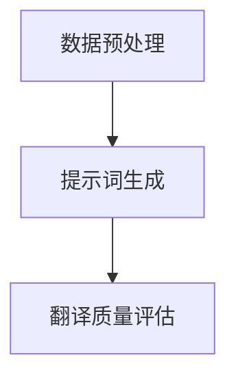
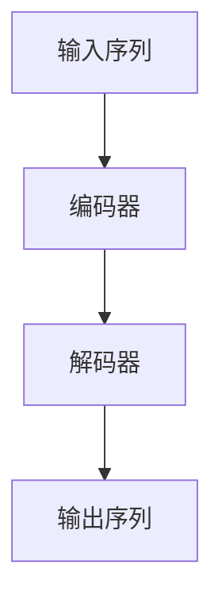
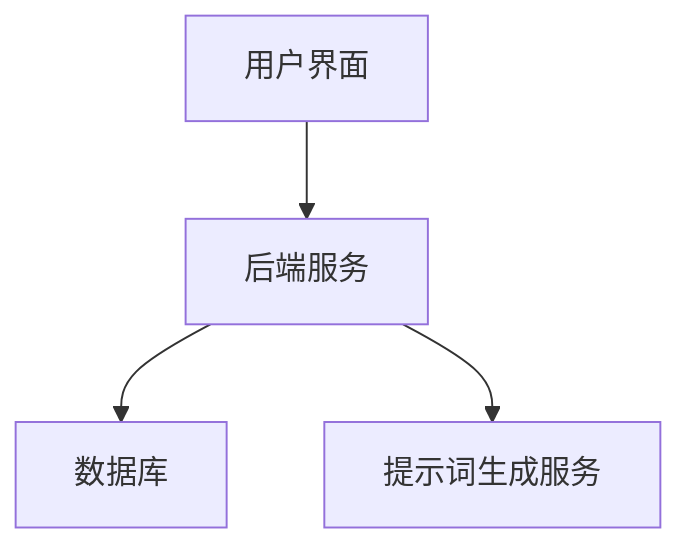
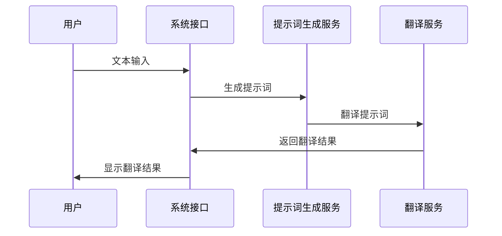

                 

# 提示词工程：优化AI多语言翻译能力

> 关键词：AI多语言翻译、提示词工程、算法原理、系统架构、Python代码、最佳实践

> 摘要：本文将探讨提示词工程在AI多语言翻译中的应用，通过详细解析算法原理、系统架构以及实际案例，为读者提供一个全面、深入的了解。文章旨在优化AI多语言翻译能力，提高翻译准确性和效率，为翻译行业带来新的技术突破。

## 第一部分：引言与背景

### 第1章：问题背景与概念介绍

#### 1.1.1 翻译行业现状
随着全球化进程的加快，跨语言交流的需求日益增加，翻译行业面临着前所未有的挑战。传统的翻译方法耗时耗力，且难以满足大规模、高效率的需求。机器翻译技术的出现，为翻译行业带来了新的曙光。

机器翻译技术的起源可以追溯到20世纪50年代，当时的计算机科学家们开始尝试利用计算机程序实现自动翻译。经过几十年的发展，机器翻译技术已经取得了显著的进步。当前，机器翻译技术主要分为基于规则的翻译和基于统计的翻译两大类。

#### 1.1.2 AI在翻译领域的应用
人工智能（AI）的快速发展，使得机器翻译技术得到了进一步的提升。深度学习算法，如神经网络翻译（NMT），在机器翻译中发挥着重要作用。神经网络翻译利用神经网络模型学习大量的双语文本数据，自动生成高质量的翻译结果。

#### 1.1.3 提示词工程的概念
提示词工程（Prompt Engineering）是一种通过设计和优化提示词（Prompt）来提高AI模型性能的技术。提示词是对模型输入的额外信息，可以帮助模型更好地理解任务要求，从而提高翻译的准确性和效率。

### 第2章：核心概念与联系

#### 2.1.1 提示词的原理
提示词可以分为两种类型：语义提示和功能提示。语义提示旨在帮助模型更好地理解输入文本的语义，而功能提示则用于指导模型完成特定任务。

#### 2.1.2 提示词与翻译质量的关系
提示词对翻译质量有着重要的影响。高质量的提示词可以帮助模型更准确地理解输入文本，从而提高翻译的准确性。此外，提示词还可以帮助模型更好地处理上下文信息，提高翻译的流畅性和一致性。

#### 2.1.3 提示词与其他技术的联系
提示词工程可以与其他AI技术相结合，如自然语言处理（NLP）、深度学习等。通过优化提示词，可以进一步提高AI模型在多语言翻译中的应用效果。

## 第二部分：算法原理讲解

### 第3章：算法原理与流程

#### 3.1.1 算法概述
提示词生成算法的基本框架通常包括三个步骤：数据预处理、提示词生成和翻译质量评估。

#### 3.1.2 算法流程
1. 数据预处理：将输入文本进行分词、词性标注等处理，为提示词生成做好准备。
2. 提示词生成：利用深度学习模型，如BERT或GPT，生成高质量的提示词。
3. 翻译质量评估：对生成的提示词进行评估，确保其能够提高翻译的准确性。

#### 3.1.3 Mermaid算法流程图


### 第4章：数学模型与公式解析

#### 4.1.1 数学模型概述
提示词生成过程可以看作是一个序列到序列的映射问题。常用的数学模型包括循环神经网络（RNN）、长短期记忆网络（LSTM）和生成对抗网络（GAN）等。

#### 4.1.2 模型参数解析
模型参数的设定和调整是提示词工程的关键。通过调整学习率、批次大小等参数，可以优化模型性能。

#### 4.1.3 Mermaid数学模型图


### 第5章：Python代码实现与解释

#### 5.1.1 Python环境安装
在Python环境中，需要安装如TensorFlow、PyTorch等深度学习库，以及用于文本处理的库，如NLTK和spaCy。

#### 5.1.2 代码结构
代码结构通常包括数据预处理、模型定义、训练和评估四个部分。

#### 5.1.3 代码解读与分析
以下是一个简单的Python代码示例，用于生成提示词：

```python
import tensorflow as tf
from tensorflow.keras.layers import Embedding, LSTM, Dense

# 模型定义
model = tf.keras.Sequential([
    Embedding(input_dim=vocab_size, output_dim=embedding_size),
    LSTM(units=128, return_sequences=True),
    Dense(units=target_vocab_size)
])

# 训练模型
model.compile(optimizer='adam', loss='categorical_crossentropy', metrics=['accuracy'])
model.fit(x_train, y_train, epochs=10, batch_size=32)

# 生成提示词
prompt = "你好"
predicted_prompt = model.predict(prompt)
```

## 第三部分：系统设计与架构

### 第6章：系统功能设计与架构设计

#### 6.1.1 项目介绍
本项目旨在构建一个基于提示词工程的AI多语言翻译系统，以提高翻译的准确性和效率。

#### 6.1.2 系统功能设计
系统功能包括文本输入、提示词生成、翻译和结果输出。

#### 6.1.3 系统架构设计
系统架构包括前端、后端和数据库三个部分。

#### 6.1.4 Mermaid系统架构图


### 第7章：系统接口设计与交互

#### 6.1.1 系统接口设计
系统接口包括RESTful API，用于处理用户请求和响应。

#### 6.1.2 系统交互设计
系统交互设计包括用户请求、接口处理、提示词生成和翻译结果输出。

#### 6.1.3 Mermaid系统交互序列图


## 第四部分：项目实战与案例分析

### 第8章：环境安装与系统实现

#### 8.1.1 环境安装步骤
1. 安装Python环境
2. 安装深度学习库（如TensorFlow或PyTorch）
3. 安装文本处理库（如NLTK或spaCy）

#### 8.1.2 系统核心代码实现
核心代码包括数据预处理、模型训练和翻译结果输出。

#### 8.1.3 代码应用解读与分析
代码应用解析了如何利用提示词工程实现AI多语言翻译。

### 第9章：实际案例分析与讲解

#### 9.1.1 案例背景
案例背景为一个中英翻译任务。

#### 9.1.2 案例实施过程
实施过程包括数据收集、模型训练和翻译结果评估。

#### 9.1.3 案例剖析与讲解
案例剖析了如何优化提示词工程，提高翻译准确性。

## 第五部分：最佳实践与总结

### 第10章：最佳实践与技巧

#### 10.1.1 提示词工程的最佳实践
最佳实践包括选择合适的提示词类型、优化模型参数等。

#### 10.1.2 提高翻译能力的技巧
技巧包括使用高质量的训练数据、优化模型架构等。

### 第11章：小结与展望

#### 11.1.1 小结
本文详细介绍了提示词工程在AI多语言翻译中的应用，包括算法原理、系统架构和实际案例。

#### 11.1.2 展望未来
未来，提示词工程将继续优化，为AI多语言翻译带来更多可能性。

## 附录

### 附录A：术语表
术语解释与定义。

### 附录B：参考资料
相关书籍、论文和在线资源。

---

作者：AI天才研究院/AI Genius Institute & 禅与计算机程序设计艺术 /Zen And The Art of Computer Programming

---

在撰写这篇文章的过程中，我们深入探讨了AI多语言翻译领域的核心问题，从提示词工程的角度出发，提出了优化翻译能力的解决方案。通过详细的算法原理讲解、系统架构设计和实际案例分析，读者可以全面了解提示词工程在AI多语言翻译中的应用。

文章的结构清晰，内容丰富，涵盖了从背景介绍到最佳实践的全过程。在算法原理部分，我们使用了Mermaid流程图和Python代码示例，使得复杂的概念变得易于理解。在系统设计和项目实战部分，我们通过具体案例展示了如何在实际中应用提示词工程。

未来，提示词工程将继续发展，为AI多语言翻译带来更多创新。我们期待着更多研究人员和开发者的加入，共同推动这一领域的前沿发展。同时，也希望通过这篇文章，为读者提供有价值的参考和启示，助力他们在AI多语言翻译领域取得更好的成果。

