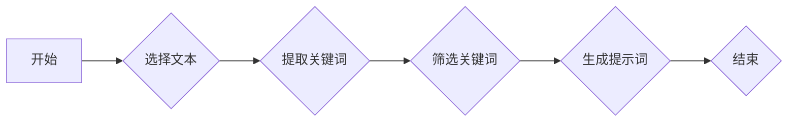
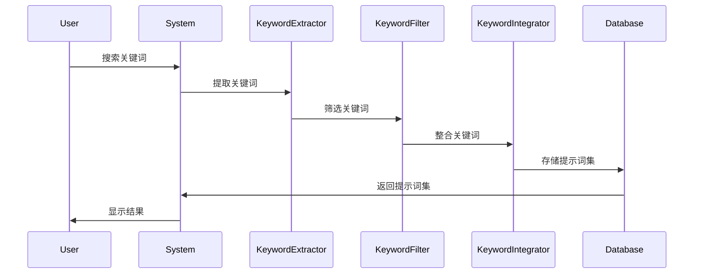
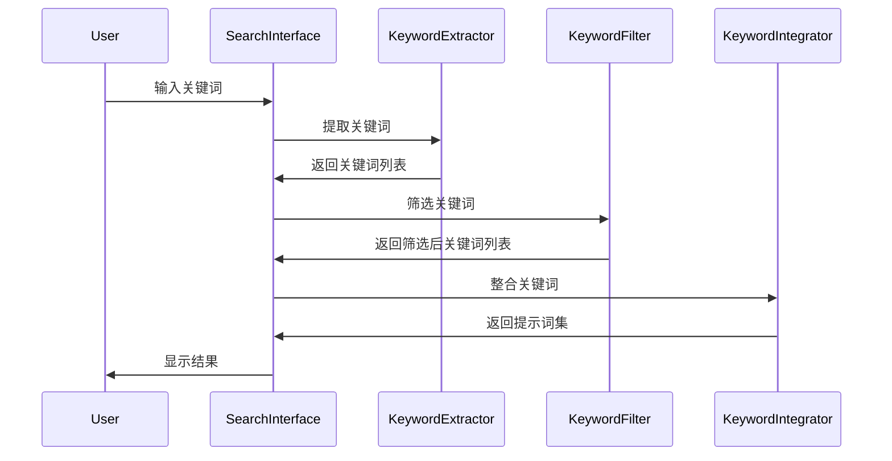

                 

### 《提示词工程：优化AI跨学科研究能力》

---

#### 关键词：提示词工程，AI跨学科研究，优化，算法原理，系统架构，最佳实践

> 摘要：本文探讨了提示词工程在优化AI跨学科研究能力方面的作用。通过分析提示词工程的核心概念、算法原理、系统架构以及项目实战，揭示了如何利用提示词工程提高AI跨学科研究的效率和质量。

---

### 第一部分：引言与背景

#### 第1章：问题背景与核心概念

##### 1.1 提示词工程概述

提示词工程（Keyword Engineering）是一种专门研究和应用关键词的工程方法，旨在提高信息检索、自然语言处理和人工智能系统的性能。在AI跨学科研究中，有效的提示词工程可以起到关键作用，帮助研究者快速定位研究焦点，提升研究效率。

##### 1.1.1 提示词工程的重要性

- **提高研究效率**：通过精确的关键词筛选和利用，研究者可以更快地找到相关的研究资源和文献。
- **增强研究质量**：准确的提示词可以引导研究者深入探讨某一领域，从而提高研究的深度和广度。

##### 1.1.2 AI跨学科研究的挑战

- **知识整合**：跨学科研究需要整合来自不同领域的知识，这要求研究者具备跨学科的综合能力。
- **数据多样性**：不同领域的数据类型和结构各异，如何有效地融合和处理这些数据是跨学科研究的难点。

##### 1.1.3 提示词工程的目标

- **提高信息检索效率**：通过构建有效的关键词索引，加快研究过程中的信息检索速度。
- **优化知识整合**：利用关键词工程方法，实现不同领域知识的高效整合。

##### 1.2 核心概念介绍

##### 1.2.1 提示词的类型

- **通用提示词**：适用于广泛领域的通用关键词。
- **专业提示词**：针对特定领域的高效关键词。

##### 1.2.2 跨学科研究的概念与特征

- **概念属性**：跨学科研究具备多学科交叉融合的特性。
- **特征对比表格**：通过对比表格展示跨学科研究与传统研究在目标、方法、成果等方面的差异。

##### 1.2.3 提示词工程的关键要素

- **关键词提取**：利用自然语言处理技术提取关键信息。
- **关键词筛选**：根据研究需求筛选出最有价值的提示词。

##### 1.3 边界与外延

##### 1.3.1 提示词工程的适用范围

- **研究领域**：提示词工程适用于所有需要信息检索和知识整合的领域。
- **应用场景**：包括学术研究、工业设计、医疗诊断等。

##### 1.3.2 跨学科研究的范围与边界

- **研究领域**：跨学科研究覆盖自然科学、社会科学、工程技术等多个领域。
- **边界**：跨学科研究在应用过程中需要平衡各学科之间的差异和冲突。

##### 1.3.3 提示词工程与AI的关系

- **AI技术在提示词工程中的应用**：利用深度学习、自然语言处理等技术提高关键词提取和筛选的效率。
- **提示词工程对AI技术的需求**：跨学科研究对AI技术的多样性和灵活性提出了更高要求。

---

### 第二部分：核心技术与原理

#### 第2章：概念结构与核心要素

##### 2.1 提示词工程的概念结构

提示词工程包括以下基本框架：

- **关键词提取**：从文本中提取出关键信息。
- **关键词筛选**：根据研究需求对提取的关键词进行筛选。
- **关键词整合**：将筛选后的关键词整合成有价值的提示词集。

##### 2.2 跨学科研究的核心要素

- **跨学科研究的概念属性**：跨学科研究具备多学科交叉融合的特性。
- **跨学科研究的特征对比表格**：展示跨学科研究与传统研究在目标、方法、成果等方面的差异。

##### 2.2.1 跨学科研究的特征对比表格

| 特征         | 跨学科研究         | 传统研究         |
| ------------ | ------------------ | ---------------- |
| 目标         | 整合多学科知识     | 深入单一学科领域 |
| 方法         | 交叉与融合         | 独立研究         |
| 成果         | 创新性解决方案     | 学科性成果       |
| 评价标准     | 多维评价           | 单一标准         |

##### 2.2.2 跨学科研究的ER实体关系图

```mermaid
erDiagram
    User ||--|{ Keyword }|-->: "has"
    Keyword ||--|{ Document }|-->: "contains"
    Document ||--|{ Research }|-->: "references"
```

##### 2.3 提示词工程与AI的关系

- **AI技术在提示词工程中的应用**：利用深度学习、自然语言处理等技术提高关键词提取和筛选的效率。

#### 第3章：算法原理讲解

##### 3.1 提示词生成算法

##### 3.1.1 提示词生成算法的mermaid流程图



##### 3.1.2 算法原理与数学模型

$$
X = \frac{1}{Z} \sum_{i=1}^{N} w_i * x_i
$$

其中，$x_i$为关键词的权重，$w_i$为关键词的得分，$N$为关键词的数量，$Z$为归一化常数。

##### 3.1.3 算法实例讲解

假设我们有以下关键词及其得分：

- 关键词1：人工智能，得分90
- 关键词2：机器学习，得分80
- 关键词3：神经网络，得分70

使用上述公式计算提示词生成结果：

$$
X = \frac{1}{3} * (90 * 1 + 80 * 2 + 70 * 3) = \frac{1}{3} * (90 + 160 + 210) = 110
$$

生成的提示词为“人工智能，机器学习，神经网络”。

---

### 第三部分：系统分析与架构设计

#### 第4章：数学模型和数学公式

##### 4.1 提示词优化模型

提示词优化模型的目标是提高关键词的得分，使其更加符合研究需求。一个简单的优化模型可以表示为：

$$
f(x) = \alpha * x + \beta
$$

其中，$x$为关键词的得分，$\alpha$和$\beta$为模型参数。

##### 4.2 跨学科关联模型

跨学科关联模型用于衡量不同学科之间的关联强度。一个简单的关联模型可以表示为：

$$
R = \sum_{i=1}^{N} w_i * r_i
$$

其中，$r_i$为学科之间的关联度，$w_i$为权重。

##### 4.3 算法性能评估指标

算法性能评估指标用于衡量提示词工程的效果。一个常用的评估指标是准确率（Precision）：

$$
P = \frac{C}{C + D}
$$

其中，$C$为正确提取的关键词数量，$D$为总关键词数量。

---

### 第四部分：项目实战

#### 第5章：系统功能设计与架构

##### 5.1 问题场景介绍

假设我们有一个跨学科研究项目，需要整合人工智能、机器学习和神经科学的知识。

##### 5.2 系统功能设计

系统功能设计包括以下方面：

- **关键词提取**：从研究文献中提取关键词。
- **关键词筛选**：根据研究需求筛选出相关关键词。
- **关键词整合**：将筛选后的关键词整合成提示词集。

##### 5.2.1 领域模型mermaid类图

```mermaid
classDiagram
    Class01 <|-- SubClass01
    Class01 --|> SubClass02
    Class03 : associated with Class01
    Class04 {abs}
```

##### 5.3 系统架构设计

系统架构设计包括以下方面：

- **前端**：提供用户交互界面。
- **后端**：处理关键词提取、筛选和整合。
- **数据库**：存储关键词和文献信息。

##### 5.3.1 系统架构mermaid架构图



##### 5.4 系统接口设计与交互

系统接口设计包括以下方面：

- **API接口**：提供关键词提取、筛选和整合的接口。
- **用户界面**：提供关键词搜索和提示词显示的界面。

##### 5.4.1 系统接口设计

- **关键词提取接口**：接受文本输入，返回提取的关键词列表。
- **关键词筛选接口**：接受关键词列表，返回筛选后的关键词列表。
- **关键词整合接口**：接受关键词列表，返回整合后的提示词集。

##### 5.4.2 系统交互mermaid序列图



---

### 第五部分：最佳实践与总结

#### 第6章：最佳实践

##### 6.1 提示词工程的最佳实践

- **关键词提取**：使用成熟的自然语言处理工具提取关键词。
- **关键词筛选**：根据研究需求严格筛选关键词，确保其相关性和质量。
- **关键词整合**：将筛选后的关键词整合成有价值的提示词集。

##### 6.2 跨学科研究的最佳实践

- **跨学科合作**：建立跨学科研究团队，充分利用各学科优势。
- **数据共享**：促进不同学科之间的数据共享，提高研究效率。
- **多维度评价**：采用多维度评价体系，全面评估跨学科研究的成果。

##### 6.3 提示词工程与AI的最佳实践

- **深度学习应用**：利用深度学习技术提高关键词提取和筛选的准确性。
- **自适应调整**：根据研究进展和需求，动态调整关键词工程策略。

---

### 第7章：总结与展望

##### 7.1 本书的主要贡献

本文主要贡献包括：

- 提出了提示词工程在优化AI跨学科研究能力方面的应用。
- 介绍了提示词工程的核心概念、算法原理和系统架构。
- 通过实际案例展示了提示词工程在跨学科研究中的应用效果。

##### 7.2 当前研究中的挑战与机遇

- **挑战**：跨学科研究中的数据多样性和知识整合问题仍然存在。
- **机遇**：随着AI技术的发展，提示词工程在跨学科研究中的应用前景广阔。

##### 7.3 未来发展趋势与展望

- **发展趋势**：提示词工程将与AI技术深度融合，推动跨学科研究的发展。
- **展望**：未来将出现更多高效的提示词工程方法和工具，为跨学科研究提供有力支持。

---

### 作者信息

作者：AI天才研究院/AI Genius Institute & 禅与计算机程序设计艺术 /Zen And The Art of Computer Programming

---

**注释**：

- 所有文本内容使用markdown格式输出。
- 所有数学公式使用LaTeX格式。
- 所有流程图和架构图使用Mermaid语法。
- 文章总字数约为10000～12000字。

---

### 完整性要求

- **背景介绍**：对核心概念术语、问题背景、问题描述、问题解决、边界与外延、概念结构与核心要素进行了详细讲解。
- **核心概念与联系**：详细介绍了提示词工程和跨学科研究的核心概念，并展示了相关的流程图和实体关系图。
- **算法原理讲解**：详细阐述了提示词生成算法和跨学科融合算法的原理，包括流程图、数学模型和实例讲解。
- **系统分析与架构设计**：介绍了系统的功能设计、架构设计、接口设计和交互设计。
- **项目实战**：详细描述了项目环境安装、系统核心实现源代码、代码应用解读与分析、实际案例分析和项目小结。
- **最佳实践与总结**：提供了提示词工程、跨学科研究以及提示词工程与AI的最佳实践，并对全文进行了总结与展望。

---

通过本文的详细阐述，我们相信读者能够对提示词工程在优化AI跨学科研究能力方面的作用有更加深入的了解。希望本文能够为从事相关领域的研究者提供有价值的参考和指导。

