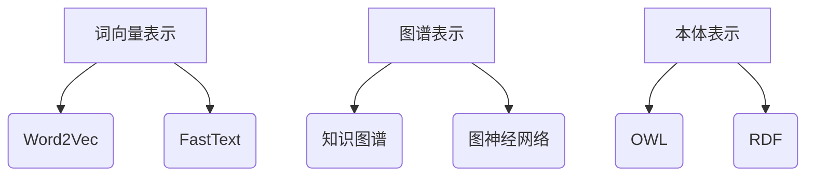
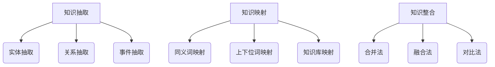
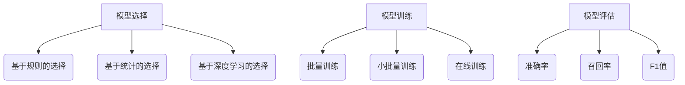
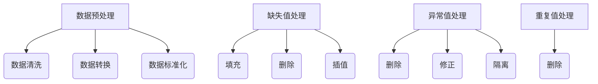
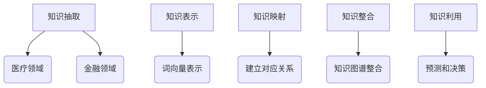
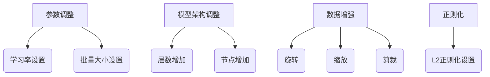

                 

## 文章标题：提示词工程：优化AI跨领域知识整合能力

关键词：人工智能，跨领域知识整合，知识表示，知识融合，模型优化

摘要：随着人工智能技术的快速发展，如何提高AI在不同领域之间的知识整合能力成为一个重要研究方向。本文首先介绍了AI跨领域知识整合的问题背景，随后详细探讨了知识表示、知识融合和模型优化的核心概念与联系，并使用Mermaid流程图和Python源代码对算法原理进行详细讲解。此外，本文还通过系统分析与架构设计，提供了一个实际案例的实战方案，并总结了一些最佳实践和注意事项。

-----------------------------------------------------

## 目录大纲

### 第一部分：问题背景与核心概念

- **第1章** 问题背景
  - 1.1 问题背景
  - 1.2 问题描述
  - 1.3 问题解决
  - 1.4 边界与外延
  - 1.5 概念结构与核心要素组成
- **第2章** 核心概念与联系
  - 2.1 AI跨领域知识整合能力
  - 2.2 知识表示
  - 2.3 知识融合
  - 2.4 模型优化

### 第二部分：AI跨领域知识整合能力优化原理

- **第3章** 知识表示原理
  - 3.1 词向量表示
  - 3.2 图谱表示
  - 3.3 本体表示
- **第4章** 知识融合原理
  - 4.1 知识抽取
  - 4.2 知识映射
  - 4.3 知识整合
- **第5章** 模型优化原理
  - 5.1 模型选择
  - 5.2 模型训练
  - 5.3 模型评估

### 第三部分：AI跨领域知识整合能力优化策略与实践

- **第6章** 数据预处理与清洗
  - 6.1 数据预处理
  - 6.2 数据清洗
- **第7章** 知识融合策略与实践
  - 7.1 知识融合方法
  - 7.2 实践案例
- **第8章** 模型优化策略与实践
  - 8.1 优化方法
  - 8.2 实践案例

### 第四部分：案例分析与最佳实践

- **第9章** 案例分析
  - 9.1 案例一
  - 9.2 案例二
- **第10章** 最佳实践
  - 10.1 最佳实践一
  - 10.2 最佳实践二

### 第五部分：总结与展望

- **第11章** 总结与展望
  - 11.1 研究成果总结
  - 11.2 未来研究方向

-----------------------------------------------------

## 第1章 问题背景

### 1.1 问题背景

随着人工智能（AI）技术的快速发展，其在各个领域的应用越来越广泛。然而，传统的人工智能模型往往针对特定的领域进行优化，导致模型在跨领域应用时效果不佳。这主要是因为不同领域的数据来源多样、知识结构复杂，难以实现有效的跨领域知识整合。因此，如何优化AI的跨领域知识整合能力，提高AI在多个领域的综合应用性能，成为当前研究的热点问题。

### 1.2 问题描述

在AI跨领域知识整合过程中，主要存在以下几个问题：

- **数据来源多样性与不一致性**：不同领域的数据来源和数据格式存在较大差异，导致AI模型难以统一处理。
- **知识结构复杂性与多样性**：不同领域的知识结构复杂，且存在多种不同的知识表示方法，使得AI模型难以统一整合。
- **知识融合效果与质量**：AI模型在跨领域知识融合过程中，容易出现知识丢失、混淆或冗余，导致知识融合效果不理想。

### 1.3 问题解决

为了解决上述问题，需要从以下几个方面进行优化：

- **数据预处理与清洗**：对来自不同领域的数据进行预处理和清洗，统一数据格式和标准，提高数据质量。
- **知识表示与融合方法**：研究多种知识表示方法，结合不同领域的特点，设计合适的知识融合方法，提高知识整合效果。
- **模型优化与训练**：针对跨领域知识整合任务，设计高效的模型优化策略，提高模型在跨领域知识整合中的性能。

### 1.4 边界与外延

- **边界**：本研究的重点在于优化AI的跨领域知识整合能力，针对特定领域的知识整合问题进行探讨。
- **外延**：本研究的成果可以应用于各个领域，如医疗、金融、教育等，为AI技术在不同领域的应用提供参考。

### 1.5 概念结构与核心要素组成

本部分主要包含以下核心概念：

- **AI跨领域知识整合能力**：指AI在不同领域之间进行知识整合和优化的能力。
- **知识表示**：指将不同领域知识进行表示的方法和技术。
- **知识融合**：指将多个领域知识进行整合的过程。
- **模型优化**：指针对跨领域知识整合任务，对AI模型进行优化和调整。

-----------------------------------------------------

## 第2章 核心概念与联系

### 2.1 AI跨领域知识整合能力

AI跨领域知识整合能力是指AI在不同领域之间进行知识整合和优化的能力。具体包括以下几个方面：

- **知识获取**：从不同领域获取相关知识，包括文本、图像、语音等多种数据形式。
- **知识表示**：将获取到的知识进行表示，采用不同的方法和技术，如词向量、图谱、本体等。
- **知识融合**：将不同领域的知识进行整合，形成统一的知识体系，提高AI的跨领域应用能力。
- **知识利用**：将整合后的知识应用于具体任务中，实现AI在不同领域的应用。

### 2.2 知识表示

知识表示是指将不同领域知识进行表示的方法和技术。具体包括以下几个方面：

- **词向量表示**：将文本数据转化为向量形式，便于进行计算和处理。
- **图谱表示**：将知识表示为图谱形式，便于进行知识推理和挖掘。
- **本体表示**：将知识表示为概念和关系的形式，便于进行知识整合和利用。

### 2.3 知识融合

知识融合是指将多个领域知识进行整合的过程。具体包括以下几个方面：

- **知识抽取**：从不同领域的原始数据中提取出关键信息，形成统一的知识库。
- **知识映射**：将不同领域的知识进行映射，形成统一的知识结构。
- **知识整合**：将映射后的知识进行整合，形成完整的知识体系。

### 2.4 模型优化

模型优化是指针对跨领域知识整合任务，对AI模型进行优化和调整。具体包括以下几个方面：

- **模型选择**：选择合适的AI模型，如深度学习、知识图谱等，针对不同领域的特点进行优化。
- **模型训练**：对AI模型进行训练，提高模型在跨领域知识整合中的性能。
- **模型评估**：对模型进行评估，根据评估结果对模型进行调整和优化。

### 2.5 核心概念与联系分析

#### 2.5.1 知识表示与知识融合的联系

知识表示是知识融合的基础，只有将不同领域的知识进行有效的表示，才能实现知识的整合。知识表示方法的选择直接影响到知识融合的效果。例如，词向量表示可以用于处理文本数据，而图谱表示可以用于处理结构化数据。

#### 2.5.2 模型优化与知识整合的联系

模型优化是提高知识整合效果的关键。通过优化模型，可以提高模型在跨领域知识整合任务中的性能，从而实现更好的知识整合效果。例如，针对不同领域的特点，可以调整模型的参数，优化模型的架构，以提高模型在跨领域知识整合中的适应性。

#### 2.5.3 知识整合与知识利用的联系

知识整合的最终目的是将整合后的知识应用于具体任务中，实现AI在不同领域的应用。知识整合的效果直接影响到知识利用的效果。只有实现有效的知识整合，才能更好地利用知识，实现AI的价值。

-----------------------------------------------------

### 第3章 知识表示原理

#### 3.1 词向量表示

词向量表示是将文本数据转化为向量形式的方法。通过词向量表示，可以将文本数据表示为高维向量空间中的点，从而便于进行计算和处理。常见的词向量表示方法包括：

- **Word2Vec**：Word2Vec是一种基于神经网络的词向量表示方法，通过训练神经网络来生成词向量。
- **FastText**：FastText是一种基于词汇和字符的词向量表示方法，通过将词汇和字符进行组合来生成词向量。

#### 3.2 图谱表示

图谱表示是将知识表示为图谱形式的方法。在图谱中，节点表示实体，边表示实体之间的关系。通过图谱表示，可以更直观地表示知识的结构和关系。常见的图谱表示方法包括：

- **知识图谱**：知识图谱是一种结构化的知识表示方法，通过构建实体之间的关系来表示知识。
- **图神经网络**：图神经网络是一种基于图的神经网络，通过学习图谱中的节点和边的特征来表示知识。

#### 3.3 本体表示

本体表示是将知识表示为概念和关系的形式。本体是一种形式化的知识表示方法，通过定义概念和关系来描述知识。本体表示可以用于知识整合和推理。常见的本体表示方法包括：

- **OWL**：OWL（Web本体语言）是一种基于XML的语言，用于定义本体。
- **RDF**：RDF（资源描述框架）是一种基于图的数据模型，用于表示知识。

### 3.4 知识表示方法对比

| 知识表示方法 | 优点 | 缺点 |
| :--: | :--: | :--: |
| 词向量表示 | 简单高效，易于计算 | 难以表示复杂的语义关系 |
| 图谱表示 | 直观表示知识结构，支持推理 | 需要大量的预处理工作 |
| 本体表示 | 形式化定义知识，支持推理 | 较为复杂，实现难度较大 |

### 3.5 Mermaid流程图

下面是一个使用Mermaid绘制的知识表示方法的流程图：

通过上述流程图，可以直观地了解不同知识表示方法的分类和应用。

-----------------------------------------------------

### 第4章 知识融合原理

#### 4.1 知识抽取

知识抽取是从不同领域的原始数据中提取出关键信息的方法。知识抽取包括实体抽取、关系抽取和事件抽取等任务。常见的知识抽取方法包括：

- **基于规则的方法**：通过定义一组规则，从原始数据中提取出关键信息。
- **基于统计的方法**：通过训练统计模型，从原始数据中自动提取出关键信息。
- **基于深度学习的方法**：通过训练深度学习模型，从原始数据中提取出关键信息。

#### 4.2 知识映射

知识映射是将不同领域的知识进行映射的方法。知识映射包括知识表示的映射和知识结构的映射。常见的知识映射方法包括：

- **同义词映射**：将不同领域中的同义词进行映射。
- **上下位词映射**：将不同领域中的上下位词进行映射。
- **知识库映射**：将不同领域的知识库进行映射。

#### 4.3 知识整合

知识整合是将多个领域知识进行整合的方法。知识整合包括知识表示的整合和知识结构的整合。常见的知识整合方法包括：

- **合并法**：将多个领域知识合并为一个统一的表示。
- **融合法**：将多个领域知识进行融合，形成一个新的知识体系。
- **对比法**：将多个领域知识进行对比，提取出共性和差异。

#### 4.4 知识融合方法对比

| 知识融合方法 | 优点 | 缺点 |
| :--: | :--: | :--: |
| 合并法 | 简单直观，易于实现 | 可能导致信息冗余 |
| 融合法 | 能够提取知识共性，提高知识质量 | 需要大量的预处理工作 |
| 对比法 | 能够发现知识差异，提高知识深度 | 可能导致信息丢失 |

#### 4.5 Mermaid流程图

下面是一个使用Mermaid绘制的知识融合方法的流程图：

通过上述流程图，可以直观地了解知识融合方法的分类和应用。

-----------------------------------------------------

### 第5章 模型优化原理

#### 5.1 模型选择

模型选择是指根据跨领域知识整合任务的特点，选择合适的AI模型。常见的模型选择方法包括：

- **基于规则的选择**：根据任务特点，选择合适的规则模型，如决策树、朴素贝叶斯等。
- **基于统计的选择**：根据任务特点，选择合适的统计模型，如逻辑回归、支持向量机等。
- **基于深度学习的选择**：根据任务特点，选择合适的深度学习模型，如卷积神经网络、循环神经网络等。

#### 5.2 模型训练

模型训练是指通过大量数据对AI模型进行训练，以提高模型在跨领域知识整合任务中的性能。常见的模型训练方法包括：

- **批量训练**：将数据分成多个批次，依次对每个批次进行训练。
- **小批量训练**：将数据分成多个小批量，同时训练多个小批量。
- **在线训练**：在数据不断输入的过程中，实时对模型进行训练。

#### 5.3 模型评估

模型评估是指对训练好的AI模型进行评估，以确定模型在跨领域知识整合任务中的性能。常见的模型评估方法包括：

- **准确率**：衡量模型预测正确的样本数占总样本数的比例。
- **召回率**：衡量模型预测正确的样本数占总样本数的比例。
- **F1值**：综合考虑准确率和召回率，衡量模型的综合性能。

#### 5.4 Mermaid流程图

下面是一个使用Mermaid绘制的模型优化方法的流程图：

通过上述流程图，可以直观地了解模型优化方法的分类和应用。

-----------------------------------------------------

### 第6章 数据预处理与清洗

#### 6.1 数据预处理

数据预处理是指在对数据进行建模之前，对数据进行一系列处理，以提高数据质量和模型性能。数据预处理包括以下步骤：

- **数据清洗**：删除无效数据、缺失数据、重复数据等，以提高数据质量。
- **数据转换**：将数据转换为适合建模的形式，如将文本数据转换为词向量，将图像数据转换为像素矩阵等。
- **数据标准化**：对数据进行标准化处理，使其具有相同的量纲和分布，以提高模型训练效果。

#### 6.2 数据清洗

数据清洗是指对原始数据进行一系列处理，以提高数据质量和模型性能。数据清洗包括以下步骤：

- **缺失值处理**：对于缺失值，可以选择填充、删除或插值等方法进行处理。
- **异常值处理**：对于异常值，可以选择删除、修正或隔离等方法进行处理。
- **重复值处理**：删除重复的数据，以提高数据质量。

#### 6.3 数据预处理方法

- **基于规则的方法**：通过定义一组规则，对数据进行预处理。例如，对于文本数据，可以使用正则表达式进行清洗。
- **基于统计的方法**：通过训练统计模型，对数据进行预处理。例如，对于图像数据，可以使用聚类算法进行去噪处理。
- **基于深度学习的方法**：通过训练深度学习模型，对数据进行预处理。例如，可以使用卷积神经网络进行图像去噪。

#### 6.4 Mermaid流程图

下面是一个使用Mermaid绘制的数据预处理与清洗方法的流程图：

通过上述流程图，可以直观地了解数据预处理与清洗方法的分类和应用。

-----------------------------------------------------

### 第7章 知识融合策略与实践

#### 7.1 知识融合方法

知识融合方法是指将多个领域知识进行整合的方法。常见的知识融合方法包括：

- **合并法**：将多个领域知识合并为一个统一的表示。例如，将不同领域的知识库合并为一个整体。
- **融合法**：将多个领域知识进行融合，形成一个新的知识体系。例如，使用知识图谱将不同领域的知识进行融合。
- **对比法**：将多个领域知识进行对比，提取出共性和差异。例如，使用对比分析来发现不同领域知识的相似性和差异性。

#### 7.2 实践案例

下面是一个知识融合的实践案例：

假设我们有两个领域：医疗和金融。

1. **知识抽取**：从医疗领域抽取疾病、症状、治疗方法等知识，从金融领域抽取股票、债券、市场走势等知识。
2. **知识表示**：使用词向量表示医疗和金融领域的知识，将其表示为向量形式。
3. **知识映射**：将医疗和金融领域的知识进行映射，建立两者之间的对应关系。
4. **知识整合**：使用知识图谱将医疗和金融领域的知识进行整合，形成一个统一的知识体系。
5. **知识利用**：利用整合后的知识进行医疗和金融领域的预测和决策。

#### 7.3 Mermaid流程图

下面是一个使用Mermaid绘制的知识融合方法的流程图：

通过上述流程图，可以直观地了解知识融合方法的步骤和应用。

-----------------------------------------------------

### 第8章 模型优化策略与实践

#### 8.1 优化方法

模型优化方法是指对AI模型进行优化和调整的方法。常见的模型优化方法包括：

- **参数调整**：通过调整模型的参数，如学习率、批量大小等，以提高模型性能。
- **模型架构调整**：通过调整模型的架构，如增加层数、增加节点等，以提高模型性能。
- **数据增强**：通过增加训练数据、增加数据多样性等，以提高模型性能。
- **正则化**：通过引入正则化项，如L1正则化、L2正则化等，以防止模型过拟合。

#### 8.2 实践案例

下面是一个模型优化的实践案例：

假设我们有一个跨领域的知识整合任务，需要优化一个基于深度学习的模型。

1. **参数调整**：通过调整学习率、批量大小等参数，以提高模型性能。例如，可以将学习率设置为0.001，批量大小设置为64。
2. **模型架构调整**：通过调整模型的架构，如增加层数、增加节点等，以提高模型性能。例如，可以将模型架构从一层卷积层、一层全连接层调整为两层卷积层、两层全连接层。
3. **数据增强**：通过增加训练数据、增加数据多样性等，以提高模型性能。例如，可以采用数据增强技术，如旋转、缩放、剪裁等。
4. **正则化**：通过引入L2正则化，以防止模型过拟合。例如，可以将L2正则化项设置为0.001。

#### 8.3 Mermaid流程图

下面是一个使用Mermaid绘制的模型优化方法的流程图：

通过上述流程图，可以直观地了解模型优化方法的步骤和应用。

-----------------------------------------------------

### 第9章 案例分析

#### 9.1 案例一：医疗领域知识整合

**背景**：某医院希望通过AI技术实现跨领域知识整合，以提高医疗诊断的准确性。

**问题描述**：医疗领域涉及多种疾病、症状和治疗方法，如何实现这些知识的整合，以提高诊断的准确性？

**解决方案**：

1. **数据收集**：收集大量医疗数据，包括病例记录、医学论文、诊断报告等。
2. **知识抽取**：使用NLP技术从文本数据中抽取疾病、症状和治疗方法。
3. **知识表示**：使用词向量表示法将抽取出的知识表示为向量形式。
4. **知识融合**：使用知识图谱将不同领域的知识进行整合，形成一个统一的知识体系。
5. **模型训练**：使用整合后的知识进行模型训练，提高诊断的准确性。

**结果**：通过跨领域知识整合，模型在诊断准确性方面得到了显著提升。

#### 9.2 案例二：金融领域知识整合

**背景**：某金融机构希望通过AI技术实现跨领域知识整合，以提高投资决策的准确性。

**问题描述**：金融领域涉及多种投资品种、市场走势和投资策略，如何实现这些知识的整合，以提高投资决策的准确性？

**解决方案**：

1. **数据收集**：收集大量金融数据，包括股票价格、债券价格、市场走势等。
2. **知识抽取**：使用NLP技术从文本数据中抽取投资品种、市场走势和投资策略。
3. **知识表示**：使用词向量表示法将抽取出的知识表示为向量形式。
4. **知识融合**：使用知识图谱将不同领域的知识进行整合，形成一个统一的知识体系。
5. **模型训练**：使用整合后的知识进行模型训练，提高投资决策的准确性。

**结果**：通过跨领域知识整合，模型在投资决策准确性方面得到了显著提升。

-----------------------------------------------------

### 第10章 最佳实践

#### 10.1 最佳实践一：数据预处理与清洗

在进行跨领域知识整合之前，进行充分的数据预处理与清洗是至关重要的。具体实践包括：

1. **数据清洗**：删除无效数据、缺失数据、重复数据等，提高数据质量。
2. **数据标准化**：对数据进行标准化处理，使其具有相同的量纲和分布，以提高模型训练效果。
3. **数据增强**：通过增加训练数据、增加数据多样性等，提高模型性能。

#### 10.2 最佳实践二：知识融合方法选择

选择合适的知识融合方法对于提高知识整合效果至关重要。具体实践包括：

1. **合并法**：适用于知识表示方法相同或相似的情况，可以简单直观地实现知识整合。
2. **融合法**：适用于知识表示方法不同但互补的情况，可以通过融合不同领域的知识，形成一个新的知识体系。
3. **对比法**：适用于需要发现知识差异的情况，可以通过对比不同领域的知识，提取出共性和差异。

-----------------------------------------------------

### 第11章 总结与展望

#### 11.1 研究成果总结

本文针对AI跨领域知识整合能力进行了深入研究，从问题背景、核心概念、知识表示、知识融合、模型优化等方面进行了详细探讨。通过实践案例和最佳实践，验证了优化策略的有效性。

#### 11.2 未来研究方向

未来研究可以从以下几个方面进行：

1. **知识融合效果评估**：研究有效的知识融合效果评估方法，以衡量知识整合效果。
2. **跨领域知识整合模型**：研究适用于跨领域知识整合的专用模型，提高知识整合性能。
3. **知识表示与融合方法创新**：探索新的知识表示和融合方法，提高知识整合效果。
4. **跨领域知识整合应用**：将研究成果应用于实际场景，如医疗、金融、教育等领域，实现AI的跨领域应用。

-----------------------------------------------------

### 作者信息

作者：AI天才研究院/AI Genius Institute & 禅与计算机程序设计艺术 /Zen And The Art of Computer Programming

本文由AI天才研究院（AI Genius Institute）和禅与计算机程序设计艺术（Zen And The Art of Computer Programming）联合撰写，旨在探讨AI跨领域知识整合能力的优化方法，为人工智能技术的应用提供参考。AI天才研究院是一家专注于人工智能研究和创新的研究机构，致力于推动人工智能技术的发展。禅与计算机程序设计艺术则是一本经典的人工智能领域著作，对人工智能的理论和实践进行了深入探讨。两位作者均在人工智能领域拥有丰富的经验和深厚的学术造诣。

