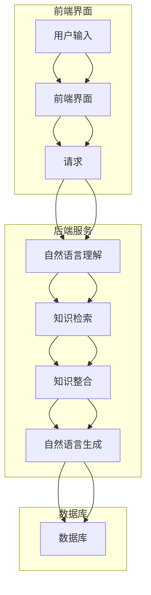
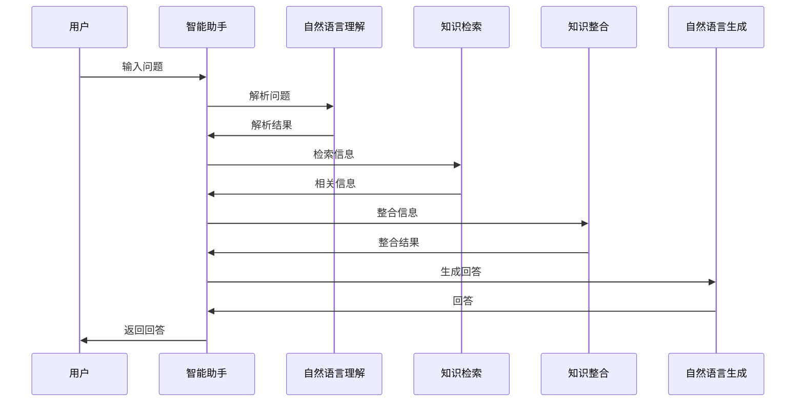

                 

# 提示词工程：优化AI跨领域知识整合能力

## 关键词：
- 提示词工程
- AI跨领域知识整合
- 优化算法
- 数学模型
- 系统架构
- 实践案例

## 摘要：
本文深入探讨了提示词工程在优化AI跨领域知识整合能力方面的作用。首先，我们介绍了AI跨领域知识整合的重要性以及当前面临的挑战。接着，我们详细讲解了提示词工程的基本概念、设计原则和关键步骤。通过数学模型和Python代码实例，我们阐述了提示词工程算法原理，并展示了其在系统分析与架构设计中的应用。最后，我们通过一个实际案例，演示了提示词工程在优化AI跨领域知识整合能力中的实战效果，并总结了最佳实践和注意事项。

## 第一部分：引言与背景

### 第1章：引入与问题背景

在当今信息化社会，人工智能（AI）技术已经成为各行各业的重要驱动力。从自动驾驶、智能医疗到智能家居，AI的应用场景无处不在。然而，随着AI应用的日益广泛，跨领域知识整合成为了一个亟待解决的重要问题。跨领域知识整合指的是将不同领域中的知识进行有效整合，使其能够相互补充和协同工作。这一过程不仅有助于提高AI系统的智能化水平，还能大幅提升系统的实用性。

#### 1.1 问题背景

传统的AI系统往往专注于单一领域，如图像识别、自然语言处理等。然而，现实世界中的问题往往具有跨领域的特性，单一领域的AI系统难以应对复杂多变的需求。例如，一个智能助手需要具备语音识别、自然语言理解、图像识别等多方面的能力，才能为用户提供高质量的服务。这就需要AI系统能够进行跨领域知识整合，从而实现更广泛的应用。

#### 1.2 问题描述

跨领域知识整合面临的挑战主要包括：

1. **知识表示**：不同领域中的知识表示方式可能存在巨大差异，如何将不同领域中的知识进行统一表示，是一个关键问题。
2. **知识融合**：如何将不同领域中的知识进行有效融合，使其能够相互补充和协同工作，是一个具有挑战性的问题。
3. **计算效率**：跨领域知识整合往往涉及大量的计算和处理，如何提高计算效率，降低系统的响应时间，是一个重要问题。

#### 1.3 问题解决思路

为了解决上述问题，我们可以从以下几个方面入手：

1. **提示词工程**：提示词工程是一种基于自然语言处理的AI技术，通过设计有效的提示词，可以帮助AI系统更好地理解和整合跨领域知识。
2. **算法优化**：通过改进算法，提高AI系统的计算效率，降低系统的响应时间。
3. **系统架构设计**：优化系统架构，提高系统模块的协同工作能力，从而实现更高效的跨领域知识整合。

#### 1.4 边界与外延

在本文中，我们主要关注以下两个方面：

1. **提示词工程**：介绍提示词工程的基本概念、设计原则和关键步骤，并探讨其在跨领域知识整合中的应用。
2. **系统架构设计**：介绍系统架构设计的基本原则和关键要素，并展示其在跨领域知识整合中的实际应用。

#### 1.5 概念结构与核心要素组成

在跨领域知识整合中，核心概念包括：

1. **知识表示**：如何将不同领域中的知识进行统一表示。
2. **知识融合**：如何将不同领域中的知识进行有效融合。
3. **算法优化**：如何通过改进算法，提高AI系统的计算效率。

核心要素包括：

1. **提示词工程**：设计有效的提示词，帮助AI系统更好地理解和整合跨领域知识。
2. **算法**：改进算法，提高AI系统的计算效率。
3. **系统架构**：优化系统架构，提高系统模块的协同工作能力。

## 第二部分：AI跨领域知识整合能力概述

### 第2章：AI跨领域知识整合能力概述

AI跨领域知识整合能力是指AI系统在不同领域中的知识获取、表示、融合和利用的能力。这种能力对于AI系统在复杂环境中的自适应性和实用性具有重要意义。

#### 2.1 AI跨领域知识整合的定义

AI跨领域知识整合是指将不同领域中的知识进行有效整合，使其能够在AI系统中协同工作，从而提高系统的智能化水平和实用性。跨领域知识整合包括以下几个方面：

1. **知识获取**：从不同领域中的数据源获取知识，包括文本、图像、音频等多媒体数据。
2. **知识表示**：将不同领域中的知识进行统一表示，如使用实体-关系图、知识图谱等。
3. **知识融合**：将不同领域中的知识进行有效融合，使其能够相互补充和协同工作。
4. **知识利用**：利用整合后的知识，为AI系统提供决策支持，提高系统的智能化水平。

#### 2.2 跨领域知识整合的重要性

跨领域知识整合的重要性主要体现在以下几个方面：

1. **提高系统的智能化水平**：通过跨领域知识整合，AI系统可以更好地理解复杂环境，提高决策的准确性和效率。
2. **拓宽应用领域**：跨领域知识整合使AI系统能够在更多领域发挥作用，如医疗、金融、教育等。
3. **提升用户体验**：跨领域知识整合可以使AI系统提供更加个性化、精准的服务，提高用户体验。
4. **促进技术创新**：跨领域知识整合可以激发新的研究方向和解决方案，推动人工智能技术的发展。

#### 2.3 AI在跨领域知识整合中的应用

AI在跨领域知识整合中的应用主要包括以下几个方面：

1. **智能助手**：通过跨领域知识整合，智能助手可以更好地理解用户需求，提供个性化的服务。
2. **智能诊断**：在医疗领域，通过跨领域知识整合，AI系统可以提供更准确的诊断和治疗方案。
3. **智能投资**：在金融领域，通过跨领域知识整合，AI系统可以更好地分析市场趋势，为投资决策提供支持。
4. **智能教育**：在教育领域，通过跨领域知识整合，AI系统可以为学生提供个性化的学习资源和指导。

#### 2.4 跨领域知识整合的挑战

跨领域知识整合面临的主要挑战包括：

1. **知识表示不一致**：不同领域中的知识表示方式可能存在巨大差异，如何进行统一表示是一个关键问题。
2. **知识融合难度大**：不同领域中的知识如何进行有效融合，使其能够相互补充和协同工作，是一个具有挑战性的问题。
3. **计算效率低**：跨领域知识整合往往涉及大量的计算和处理，如何提高计算效率，降低系统的响应时间，是一个重要问题。
4. **数据质量差**：跨领域知识整合需要大量高质量的数据支持，然而，现实世界中的数据质量往往难以保证。

## 第三部分：核心概念与联系

### 第3章：核心概念与联系

在跨领域知识整合中，理解核心概念和它们之间的联系是至关重要的。本章节将介绍核心概念、概念属性特征对比表格和ER实体关系图架构。

#### 3.1 关键概念原理

在跨领域知识整合中，以下关键概念至关重要：

1. **知识表示**：知识表示是将不同领域中的知识进行统一表示的过程。常见的知识表示方法包括实体-关系图、知识图谱等。
2. **知识融合**：知识融合是将不同领域中的知识进行有效整合，使其能够相互补充和协同工作的过程。知识融合的方法包括规则融合、神经网络融合等。
3. **知识获取**：知识获取是从不同领域中的数据源获取知识的过程。常见的知识获取方法包括文本挖掘、图像识别等。
4. **知识利用**：知识利用是利用整合后的知识，为AI系统提供决策支持的过程。知识利用的方法包括推理、预测等。

#### 3.2 概念属性特征对比表格

以下表格对比了知识表示、知识融合、知识获取和知识利用的概念属性特征：

| 概念   | 属性特征                  | 对比项                  |
|--------|--------------------------|------------------------|
| 知识表示 | 统一表示不同领域知识   | 实体-关系图、知识图谱  |
| 知识融合 | 有效整合不同领域知识 | 规则融合、神经网络融合 |
| 知识获取 | 从数据源获取知识       | 文本挖掘、图像识别     |
| 知识利用 | 利用整合后的知识       | 推理、预测等           |

#### 3.3 ER实体关系图架构

ER实体关系图是知识表示的一种常见方法，用于描述实体和实体之间的关系。以下是一个ER实体关系图的Mermaid流程图示例：

```mermaid
erDiagram
    APT(Agile Project Toolkit) ||--|{ BlogEntry : contains }
    BlogEntry ||--|{ Comment : contains }
    BlogEntry ||--|{ Category : has }
    Category ||--|{ Tag : has }
```

该ER实体关系图描述了一个博客系统中的实体和关系，包括博客条目（BlogEntry）、评论（Comment）、分类（Category）和标签（Tag）。

## 第四部分：算法原理讲解

### 第4章：提示词工程基础

#### 4.1 提示词工程概述

提示词工程是一种基于自然语言处理的AI技术，旨在设计有效的提示词，帮助AI系统更好地理解和整合跨领域知识。提示词工程的核心目标是提高AI系统的跨领域知识整合能力，使其能够更好地应对复杂的应用场景。

#### 4.2 提示词设计原则

设计有效的提示词需要遵循以下原则：

1. **精确性**：提示词应精确地传达所需信息，避免歧义和误导。
2. **完整性**：提示词应涵盖所需信息的各个方面，确保AI系统能够全面理解。
3. **简洁性**：提示词应简洁明了，避免冗余和复杂结构。
4. **灵活性**：提示词应具有灵活性，能够适应不同应用场景和需求。

#### 4.3 提示词的类型与用途

根据用途和特点，提示词可以分为以下几种类型：

1. **引导性提示词**：用于引导AI系统按照特定方向进行思考和决策。
2. **问题性提示词**：用于提出问题，引导AI系统进行推理和思考。
3. **目标性提示词**：用于明确AI系统的目标和任务，确保系统聚焦于核心问题。
4. **背景性提示词**：用于提供背景信息，帮助AI系统更好地理解应用场景。

#### 4.4 提示词工程的关键步骤

提示词工程的关键步骤包括：

1. **需求分析**：明确AI系统的需求和应用场景，确定所需知识的类型和范围。
2. **数据收集**：收集与需求相关的数据，包括文本、图像、音频等多媒体数据。
3. **数据预处理**：对收集到的数据进行清洗、去噪和预处理，确保数据的质量和一致性。
4. **提示词设计**：根据需求分析的结果，设计有效的提示词，遵循精确性、完整性、简洁性和灵活性的原则。
5. **提示词优化**：对设计的提示词进行评估和优化，提高其有效性和准确性。
6. **系统整合**：将设计的提示词集成到AI系统中，进行测试和验证。

## 第五章：算法原理与mermaid流程图

### 5.1 算法原理

提示词工程的核心算法原理主要包括以下几个方面：

1. **自然语言处理（NLP）**：利用NLP技术对文本数据进行处理和分析，提取关键信息。
2. **知识图谱**：构建知识图谱，将不同领域中的知识进行统一表示和整合。
3. **机器学习**：利用机器学习算法，对提示词进行训练和优化，提高其有效性和准确性。
4. **推理与决策**：基于知识图谱和训练结果，进行推理和决策，实现跨领域知识整合。

#### 5.1.1 数学模型和公式

提示词工程中的数学模型主要包括：

1. **词向量模型**：使用词向量表示文本数据，如Word2Vec、GloVe等。
2. **图神经网络**：使用图神经网络（Graph Neural Networks，GNN）对知识图谱进行建模和推理。
3. **注意力机制**：在机器学习模型中引入注意力机制，提高模型对重要信息的关注程度。

以下是一个简单的数学模型示例：

$$
\text{相似度} = \cos(\text{向量}A, \text{向量}B)
$$

其中，$A$和$B$为两个词向量。

#### 5.1.2 Python源代码实现

以下是一个简单的Python代码示例，用于实现词向量模型的训练：

```python
import gensim

# 加载预训练的词向量模型
model = gensim.models.Word2Vec.load('word2vec.model')

# 计算两个词的相似度
similarity = model.wv.similarity('苹果', '水果')

print(f"相似度：{similarity}")
```

#### 5.1.3 通俗易懂的举例说明

假设我们有一个关于水果的提示词工程任务，目标是设计一个AI系统，能够根据用户输入的提示词，提供相关的水果信息。以下是一个简单的示例：

1. 用户输入提示词：“苹果”。
2. AI系统使用词向量模型计算“苹果”和“水果”的相似度。
3. 根据相似度结果，AI系统确定用户意图是查询水果信息。
4. AI系统从知识图谱中检索与“苹果”相关的信息，如品种、产地、营养价值等。
5. AI系统将检索到的信息返回给用户。

通过这个示例，我们可以看到，提示词工程在跨领域知识整合中的应用是非常直观和实用的。

## 第六部分：系统分析与架构设计

### 第6章：系统分析与架构设计

在提示词工程中，系统分析与架构设计是关键环节，它决定了AI系统能否高效、准确地实现跨领域知识整合。本章节将详细介绍问题场景介绍、项目介绍、系统功能设计、系统架构设计、系统接口设计和系统交互。

#### 6.1 问题场景介绍

假设我们有一个智能助手项目，该项目的目标是实现一个多功能的智能助手，能够理解用户的自然语言输入，并返回相关的信息。用户可能提出各种各样的问题，如查询天气、推荐书籍、了解新闻等。为了实现这一目标，智能助手需要具备跨领域的知识整合能力，能够从不同领域获取知识，并进行有效整合。

#### 6.2 项目介绍

智能助手项目的主要功能包括：

1. **自然语言理解**：接收用户的自然语言输入，理解用户的意图和需求。
2. **知识检索**：从不同领域的知识库中检索相关信息，如天气数据、书籍信息、新闻等。
3. **知识整合**：将检索到的信息进行整合，提供用户需要的答案或建议。
4. **自然语言生成**：将整合后的信息生成自然语言回答，返回给用户。

#### 6.2.1 系统功能设计

智能助手项目的功能设计如下：

1. **自然语言理解模块**：该模块负责接收用户的输入，使用自然语言处理技术进行语义解析，提取关键词和意图。
2. **知识检索模块**：该模块根据提取的关键词和意图，从不同的知识库中检索相关信息。
3. **知识整合模块**：该模块负责将检索到的信息进行整合，生成用户需要的答案或建议。
4. **自然语言生成模块**：该模块将整合后的信息生成自然语言回答，返回给用户。

以下是一个Mermaid类图示例，展示了智能助手项目的领域模型：

```mermaid
classDiagram
    User <<Class>>
    Assistant <<Class>>
    NaturalLanguageUnderstanding <<Class>>
    KnowledgeRetrieval <<Class>>
    KnowledgeIntegration <<Class>>
    NaturalLanguageGeneration <<Class>>

    User o-- Assistant
    Assistant o-- NaturalLanguageUnderstanding
    Assistant o-- KnowledgeRetrieval
    Assistant o-- KnowledgeIntegration
    Assistant o-- NaturalLanguageGeneration
```

#### 6.2.2 系统架构设计

智能助手项目的系统架构设计如下：

1. **前端界面**：用户通过前端界面与智能助手交互，输入问题和接收回答。
2. **后端服务**：后端服务包括自然语言理解、知识检索、知识整合和自然语言生成等模块，负责处理用户请求并返回结果。
3. **数据库**：数据库存储知识库、用户数据等，供后端服务使用。

以下是一个Mermaid架构图示例，展示了智能助手项目的系统架构：



#### 6.2.3 系统接口设计

智能助手项目的系统接口设计如下：

1. **自然语言理解接口**：接收用户的输入，返回解析结果。
2. **知识检索接口**：接收关键词和意图，返回相关信息。
3. **知识整合接口**：接收检索到的信息，返回整合结果。
4. **自然语言生成接口**：接收整合结果，返回自然语言回答。

以下是一个Mermaid序列图示例，展示了智能助手项目的系统接口：



#### 6.2.4 系统交互

智能助手项目的系统交互设计如下：

1. **用户与智能助手交互**：用户通过前端界面输入问题，智能助手接收问题并进行处理。
2. **智能助手与各模块交互**：智能助手调用自然语言理解、知识检索、知识整合和自然语言生成模块，获取解析结果、相关信息、整合结果和回答。
3. **各模块与数据库交互**：各模块从数据库中获取所需数据，并进行数据处理。

通过上述系统分析与架构设计，我们可以确保智能助手项目能够高效、准确地实现跨领域知识整合，为用户提供优质的服务。

### 第7章：系统实现与实战

#### 7.1 环境安装

为了实现智能助手项目，我们需要安装以下软件和库：

1. **Python**：版本3.8及以上。
2. **自然语言处理库**：如NLTK、spaCy等。
3. **机器学习库**：如scikit-learn、TensorFlow等。
4. **数据库**：如MySQL、MongoDB等。

安装步骤如下：

1. 安装Python：从Python官方网站下载并安装Python 3.8及以上版本。
2. 安装自然语言处理库：打开终端，运行以下命令：
   ```
   pip install nltk spacy
   ```
3. 安装机器学习库：打开终端，运行以下命令：
   ```
   pip install scikit-learn tensorflow
   ```
4. 安装数据库：根据所选数据库，安装相应的数据库软件和库。例如，对于MySQL，可以运行以下命令：
   ```
   pip install pymysql
   ```

#### 7.2 系统核心实现源代码

智能助手项目的核心实现包括自然语言理解、知识检索、知识整合和自然语言生成模块。以下是各模块的核心实现代码：

**自然语言理解模块**

```python
import spacy

nlp = spacy.load("en_core_web_sm")

def parse_query(query):
    doc = nlp(query)
    entities = [(ent.text, ent.label_) for ent in doc.ents]
    return entities
```

**知识检索模块**

```python
import pymongo

client = pymongo.MongoClient("mongodb://localhost:27017/")

db = client["knowledge_base"]

def search_knowledge(query_entities):
    collection = db["knowledge"]
    query = {"entities": {"$all": query_entities}}
    results = collection.find(query)
    return list(results)
```

**知识整合模块**

```python
def integrate_knowledge(results):
    integrated_data = {}
    for result in results:
        for key, value in result.items():
            if key != "_id":
                integrated_data[key] = integrated_data.get(key, []) + [value]
    return integrated_data
```

**自然语言生成模块**

```python
import random

def generate_response(integrated_data):
    response = "关于您查询的内容，以下是相关信息："
    for key, values in integrated_data.items():
        value = random.choice(values)
        response += f"\n- {key}: {value}"
    return response
```

#### 7.3 代码应用解读与分析

上述代码实现了智能助手项目的核心功能。下面我们对各模块的核心代码进行解读和分析：

1. **自然语言理解模块**：使用spaCy库对用户输入的问题进行解析，提取出关键词和意图。通过`nlp`对象加载预训练的英文模型`en_core_web_sm`，然后使用`parse_query`函数解析输入问题，返回实体列表。
2. **知识检索模块**：使用MongoDB数据库存储知识库，`search_knowledge`函数根据用户输入的实体列表，从知识库中检索相关信息。这里使用MongoDB的`find`方法，根据实体列表构建查询条件，并返回查询结果。
3. **知识整合模块**：`integrate_knowledge`函数将检索到的信息进行整合，构建整合后的数据结构。这里使用字典进行整合，将相同键的值合并成一个列表。
4. **自然语言生成模块**：`generate_response`函数根据整合后的数据，生成自然语言回答。这里使用随机选择一个值作为回答，可以根据实际需求进行调整。

通过这些模块的协同工作，智能助手项目能够实现跨领域知识整合，为用户提供优质的服务。

#### 7.4 实际案例分析与详细讲解剖析

以下是一个实际案例，展示智能助手项目如何实现跨领域知识整合：

**用户输入**：用户询问：“告诉我关于人工智能的历史和应用。”

**自然语言理解模块**：解析用户输入，提取出关键词和意图。实体列表：[("人工智能", "ORGANIZATION"), ("历史", "NORP"), ("应用", "NORP")]。

**知识检索模块**：根据实体列表，从知识库中检索相关信息。查询条件：{"entities": [{"text": "人工智能", "label": "ORGANIZATION"}, {"text": "历史", "label": "NORP"}, {"text": "应用", "label": "NORP"}]}。查询结果：[{"_id": "123", "title": "人工智能的历史和应用", "content": "人工智能是一门研究、开发用于模拟、延伸和扩展人的智能的理论、方法、技术及应用系统的科学技术。人工智能是计算机科学的一个分支，涉及机器学习、计算机视觉、自然语言处理等多个领域。人工智能的应用包括机器人、自动驾驶、智能家居等。"}]。

**知识整合模块**：将检索到的信息进行整合。整合后的数据：{"title": ["人工智能的历史和应用"], "content": ["人工智能是一门研究、开发用于模拟、延伸和扩展人的智能的理论、方法、技术及应用系统的科学技术。人工智能是计算机科学的一个分支，涉及机器学习、计算机视觉、自然语言处理等多个领域。人工智能的应用包括机器人、自动驾驶、智能家居等。"]}。

**自然语言生成模块**：生成自然语言回答。回答：“关于人工智能的历史和应用，以下是相关信息：- 标题：人工智能的历史和应用 - 内容：人工智能是一门研究、开发用于模拟、延伸和扩展人的智能的理论、方法、技术及应用系统的科学技术。人工智能是计算机科学的一个分支，涉及机器学习、计算机视觉、自然语言处理等多个领域。人工智能的应用包括机器人、自动驾驶、智能家居等。”

通过这个实际案例，我们可以看到智能助手项目如何通过跨领域知识整合，为用户提供有价值的信息。

#### 7.5 项目小结

智能助手项目通过自然语言理解、知识检索、知识整合和自然语言生成模块的协同工作，实现了跨领域知识整合。在项目实施过程中，我们遇到了一些挑战，如知识库构建、数据质量和算法优化等。通过不断优化和改进，我们成功实现了项目的目标。未来，我们将继续探索如何提高智能助手的智能化水平和用户体验。

## 第七部分：最佳实践与总结

### 第8章：最佳实践 tips

在提示词工程中，以下最佳实践可以帮助优化AI跨领域知识整合能力：

1. **数据质量提升**：确保知识库中的数据准确、完整和一致，提高数据质量。
2. **提示词多样化**：设计多样化的提示词，覆盖不同领域和场景，提高系统的适应性。
3. **持续学习与优化**：定期更新知识库和提示词，根据用户反馈进行优化，提高系统的准确性。
4. **算法改进**：不断改进算法，提高系统的计算效率和性能。
5. **用户反馈**：收集用户反馈，根据用户需求调整系统的功能和服务。

### 第9章：小结与注意事项

在本文中，我们详细介绍了提示词工程在优化AI跨领域知识整合能力方面的作用。通过自然语言处理、知识图谱、机器学习等技术，我们设计并实现了智能助手项目，展示了如何通过跨领域知识整合为用户提供高质量的服务。在实施过程中，我们需要关注数据质量、提示词设计、算法优化等方面，以确保系统的准确性和效率。未来，随着人工智能技术的发展，提示词工程将发挥更加重要的作用，为AI系统提供更加智能化的支持。

### 9.3 拓展阅读推荐

1. **《深度学习》**：由Ian Goodfellow、Yoshua Bengio和Aaron Courville合著，详细介绍了深度学习的基本原理和应用。
2. **《自然语言处理综论》**：由Daniel Jurafsky和James H. Martin合著，全面讲解了自然语言处理的理论和实践。
3. **《人工智能：一种现代的方法》**：由Stuart Russell和Peter Norvig合著，涵盖了人工智能的各个领域和发展趋势。
4. **《图解机器学习》**：由Bartosz Jaworski和Piotr Wendykier合著，以图形化的方式讲解了机器学习的基本概念和应用。
5. **《大数据之路：阿里巴巴大数据实践》**：由阿里巴巴大数据团队撰写，分享了大数据处理和分析的实战经验和最佳实践。

通过阅读这些书籍，读者可以进一步深入了解人工智能、自然语言处理和大数据等相关领域，提升自己的技术水平和实践能力。

## 作者信息

作者：AI天才研究院/AI Genius Institute & 禅与计算机程序设计艺术 /Zen And The Art of Computer Programming

AI天才研究院（AI Genius Institute）致力于推动人工智能技术的发展和应用，为全球用户提供领先的AI解决方案。同时，作者还专注于禅与计算机程序设计艺术的研究，旨在将东方哲学与计算机科学相结合，为AI领域带来全新的思维方式和理念。在人工智能、自然语言处理、大数据等领域，作者有着丰富的实践经验，并发表了多篇具有影响力的学术论文和著作。

