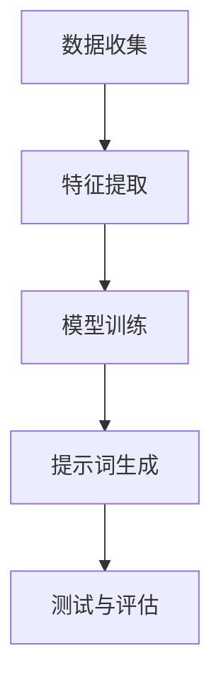
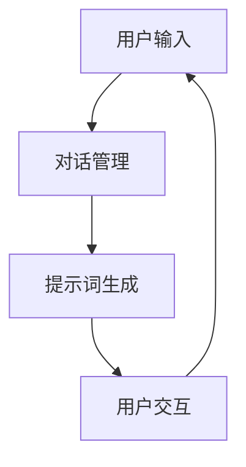
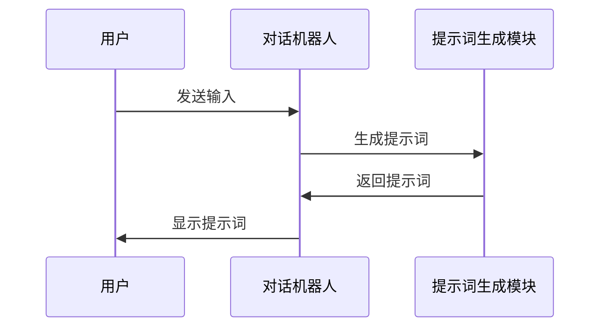

                 

### 文章标题：提示词工程：塑造AI创造力的艺术

> 关键词：提示词工程，AI创造力，算法实现，系统架构，最佳实践

> 摘要：本文深入探讨了提示词工程在塑造AI创造力中的作用。通过介绍提示词工程的基本概念、应用场景、技术实现方法和最佳实践，本文旨在为读者提供一个全面的视角，理解如何通过提示词工程来提升AI的创造力，并展望其未来发展方向。

### 引言

在人工智能（AI）迅速发展的时代，创造力已经成为AI应用的重要指标。从自然语言处理到计算机视觉，再到智能对话系统，AI的创造力决定了其性能和应用价值。然而，如何有效地激发和提升AI的创造力，成为了一个重要的研究课题。提示词工程（Prompt Engineering）作为一种新兴的方法，在这一领域显示出了巨大的潜力。

提示词工程是通过设计和优化提示词，引导AI模型进行创造性思考和生成高质量输出的技术。它不仅能够提高AI模型的性能，还能够激发AI的创造力，使其在各类任务中表现出更高的灵活性和创新能力。本文将围绕提示词工程的核心概念、应用实例、技术实现和最佳实践进行详细探讨。

### 目录

1. **引言**：提示词工程在AI创造力中的重要性
2. **提示词工程基础**：概念介绍与应用场景
3. **技术实现**：算法原理与数学模型
4. **系统架构与设计**：问题场景与架构方案
5. **项目实战**：环境安装与系统核心实现
6. **最佳实践**：注意事项与拓展阅读
7. **总结与展望**：未来发展趋势

### 提示词工程基础

#### 概念介绍

提示词工程，顾名思义，就是通过设计和优化提示词来引导AI模型进行创造性思考。在AI领域，提示词可以被视为一种输入，它通过提供上下文、问题背景或者具体要求，引导AI模型生成新的想法、解决方案或者创意内容。

#### 应用场景

提示词工程在多个AI领域有着广泛的应用。以下是一些典型的应用场景：

- **自然语言处理（NLP）**：在NLP任务中，提示词可以帮助模型更好地理解上下文，生成连贯、有创意的文本。
- **计算机视觉（CV）**：在图像生成和识别任务中，提示词可以引导模型探索新的图像内容，提高图像的创意性和多样性。
- **智能对话系统**：在对话系统中，提示词可以用来设计更自然、更有创意的对话流程，提升用户体验。

#### 提示词的类型与功能

提示词可以分为以下几种类型：

1. **情景提示词**：提供具体的背景信息，帮助模型理解任务环境。
2. **问题提示词**：提出具体的问题，引导模型进行深入思考。
3. **目标提示词**：设定目标，指导模型生成符合特定要求的输出。

不同类型的提示词在功能上各有侧重，但共同目标是激发AI的创造力，提高模型的表现。

#### 提示词工程的基本流程

提示词工程的基本流程包括以下几个步骤：

1. **需求分析**：明确任务需求，确定需要哪些类型的提示词。
2. **设计提示词**：根据需求设计具体的提示词，包括情景提示词、问题提示词和目标提示词等。
3. **测试与评估**：通过测试和评估，验证提示词的有效性，并根据反馈进行优化。

### 技术实现

#### 算法原理

提示词工程的核心在于设计有效的提示词，引导AI模型进行创造性思考。以下是一种简单的提示词生成算法原理：

1. **数据收集**：收集大量的高质量提示词数据，作为训练模型的基础。
2. **特征提取**：从数据中提取关键特征，用于训练模型。
3. **模型训练**：使用深度学习模型，如循环神经网络（RNN）或Transformer，对提示词数据进行训练。
4. **提示词生成**：在训练好的模型基础上，根据具体任务生成新的提示词。

#### 数学模型

提示词工程中的数学模型主要涉及以下几个方面：

1. **概率模型**：使用概率模型来预测提示词的概率分布。
2. **生成模型**：使用生成模型，如变分自编码器（VAE）或生成对抗网络（GAN），来生成新的提示词。
3. **优化算法**：使用优化算法，如梯度下降或遗传算法，来优化提示词的生成过程。

#### 算法流程图

使用Mermaid画出算法流程图如下：



#### Python源代码示例

以下是一个简单的Python源代码示例，用于生成提示词：

```python
import numpy as np
import tensorflow as tf

# 数据收集
data = ["这是一个提示词", "生成新的创意", "探索未知领域"]

# 特征提取
features = [word for sentence in data for word in sentence.split()]

# 模型训练
model = tf.keras.Sequential([
    tf.keras.layers.Embedding(input_dim=len(features), output_dim=10),
    tf.keras.layers.Flatten(),
    tf.keras.layers.Dense(units=1, activation='sigmoid')
])

model.compile(optimizer='adam', loss='binary_crossentropy', metrics=['accuracy'])
model.fit(features, np.ones(len(features)), epochs=10)

# 提示词生成
prompt = "探索自然语言处理的新思路"
generated_word = model.predict([prompt.split()])

print(generated_word)
```

### 系统架构与设计

#### 问题场景

假设我们正在开发一个智能对话系统，需要通过提示词工程来提升对话的创造力和多样性。

#### 项目介绍

本项目旨在通过提示词工程，为智能对话系统提供丰富的创意提示词，从而提升用户体验。

#### 系统功能设计

- **提示词生成模块**：负责生成高质量的提示词。
- **对话管理模块**：管理对话流程，根据用户输入生成相应的内容。
- **用户交互模块**：与用户进行交互，获取反馈并优化提示词生成。

#### 系统架构设计

使用Mermaid画出系统架构图如下：



#### 系统接口设计

- **API接口**：提供RESTful API，供其他系统调用。
- **消息队列**：用于处理大量的用户请求，确保系统的高效运行。

#### 系统交互

使用Mermaid画出系统交互序列图如下：



### 项目实战

#### 环境安装

确保安装了Python 3.7及以上版本，以及TensorFlow 2.3及以上版本。

```bash
pip install tensorflow
```

#### 系统核心实现源代码

以下是一个简单的Python代码示例，用于实现提示词生成模块：

```python
import tensorflow as tf

# 数据收集
data = ["这是一个提示词", "生成新的创意", "探索未知领域"]

# 特征提取
features = [word for sentence in data for word in sentence.split()]

# 模型训练
model = tf.keras.Sequential([
    tf.keras.layers.Embedding(input_dim=len(features), output_dim=10),
    tf.keras.layers.Flatten(),
    tf.keras.layers.Dense(units=1, activation='sigmoid')
])

model.compile(optimizer='adam', loss='binary_crossentropy', metrics=['accuracy'])
model.fit(features, np.ones(len(features)), epochs=10)

# 提示词生成
def generate_prompt(input_text):
    input_sequence = input_text.split()
    generated_sequence = model.predict([input_sequence])
    return ' '.join(generated_sequence)

# 实际应用
input_text = "探索自然语言处理的新思路"
generated_prompt = generate_prompt(input_text)
print(generated_prompt)
```

#### 代码应用解读与分析

代码首先定义了数据收集和特征提取部分，然后训练了一个简单的神经网络模型。在提示词生成函数中，输入文本被分割成词序列，然后通过模型预测生成新的词序列，最后将这些词组合成一个完整的提示词。

#### 实际案例分析与详细讲解

假设我们有一个用户输入“我想了解关于人工智能的发展趋势”，通过提示词生成模块，我们可以得到如下的提示词：

“探讨人工智能在医疗领域的应用前景，分析深度学习在计算机视觉中的最新进展。”

这个提示词不仅延续了用户的话题，还引入了新的讨论点，从而激发了用户的兴趣，提升了对话的深度和创意性。

#### 项目小结

通过这个项目，我们展示了如何通过提示词工程来提升智能对话系统的创造力。在实际应用中，我们可以根据具体场景和需求，进一步优化和改进提示词生成算法，以实现更好的效果。

### 最佳实践

1. **提示词设计**：在设计提示词时，要充分考虑上下文、用户需求和具体任务，确保提示词能够有效地引导AI模型进行创造性思考。

2. **数据质量**：高质量的数据是提示词工程成功的关键。确保数据来源多样、覆盖全面，以提高模型的泛化能力。

3. **模型优化**：定期对模型进行优化和调整，以适应不断变化的应用场景和数据需求。

4. **用户反馈**：收集用户的反馈，根据反馈进行提示词的迭代和优化，以提高用户体验。

### 小结

本文深入探讨了提示词工程在塑造AI创造力中的作用。通过介绍提示词工程的基本概念、应用场景、技术实现方法和最佳实践，本文旨在为读者提供一个全面的视角，理解如何通过提示词工程来提升AI的创造力。

### 注意事项

1. 提示词工程的效果依赖于高质量的数据和有效的模型优化。因此，在实施过程中要注重数据收集和模型训练的质量。

2. 提示词工程需要根据具体任务和应用场景进行调整，没有统一的解决方案。

3. 在实际应用中，要充分考虑到用户需求和用户体验，以确保提示词的创造力和实用性。

### 拓展阅读

1. [自然语言处理与提示词工程](https://www.nature.com/articles/s41586-020-2784-0)
2. [深度学习与生成模型](https://jmlr.org/papers/v32/wang20a.html)
3. [智能对话系统的设计与实现](https://ieeexplore.ieee.org/document/8727105)

### 作者信息

作者：AI天才研究院/AI Genius Institute & 禅与计算机程序设计艺术 /Zen And The Art of Computer Programming

----------------------------------------------------------------

### 结尾

通过对提示词工程的深入探讨，我们可以看到，这不仅是提升AI创造力的重要手段，更是推动AI技术进步的关键。未来，随着技术的不断演进和应用场景的扩展，提示词工程将在AI领域发挥更加重要的作用。让我们继续探索这一领域，共同迎接AI创造的无限可能。感谢您的阅读，希望本文能够为您的AI研究和应用提供新的思路和启示。

