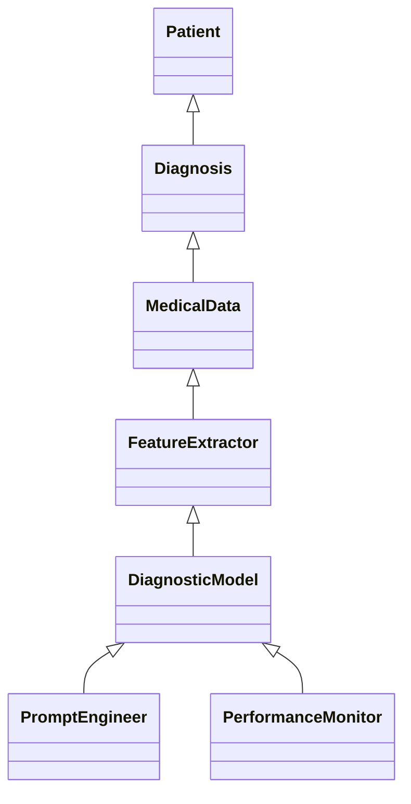
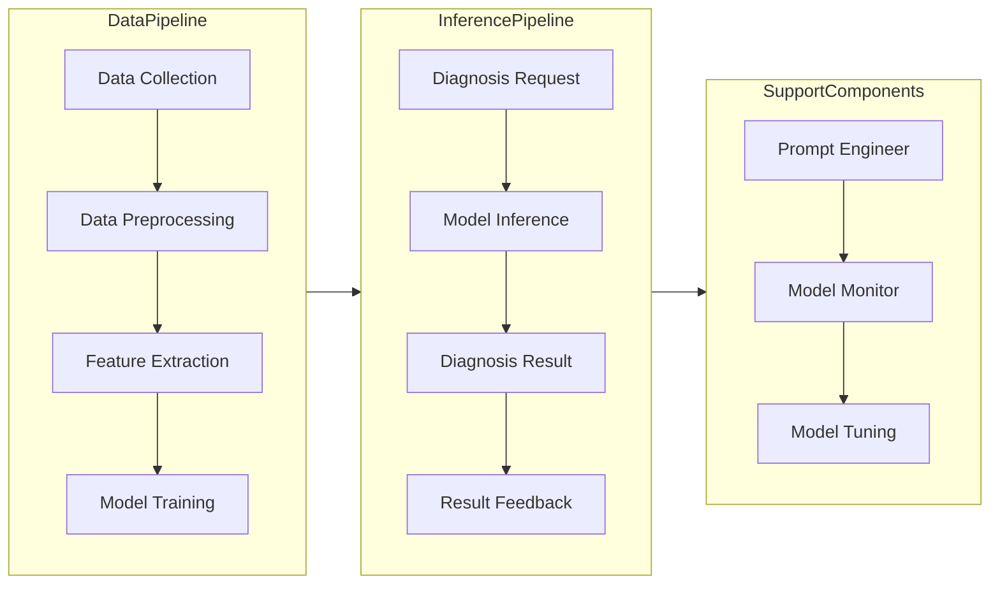
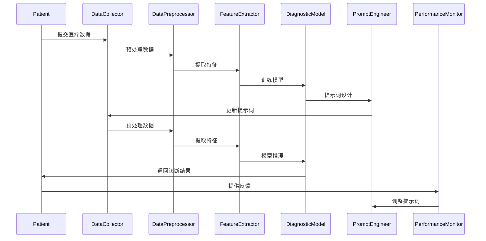

                 

### 第一部分：背景介绍

#### 第1章：问题背景与核心概念

##### 1.1.1 提示词工程的定义与重要性

**定义**：提示词工程（Prompt Engineering）是指通过设计、选择和优化提示词，来提高人工智能系统性能的过程。提示词是输入给AI系统的一系列文本或指令，用以引导AI模型的理解和决策方向。

**重要性**：随着深度学习技术的发展，AI模型变得越来越复杂和强大。然而，这些模型在处理实际问题时，往往面临着过拟合、数据不足或目标不明确的问题。提示词工程在此扮演了关键角色，它能够通过精确的输入引导，帮助AI系统更好地理解和解决问题。

##### 1.1.2 提示词工程与AI的关系

提示词工程不仅仅是AI系统的辅助工具，更是其核心组成部分。它通过以下方式与AI密切相关：

- **指导学习**：通过设计针对性的提示词，可以帮助AI模型更快地学习并适应特定任务。
- **优化性能**：精心设计的提示词能够提升模型的泛化能力和性能。
- **增强可解释性**：通过分析提示词，可以更好地理解模型的行为和决策过程。

##### 1.1.3 提示词工程的问题与挑战

尽管提示词工程的重要性不言而喻，但实践中仍面临诸多问题与挑战：

- **主观性**：设计提示词的过程高度依赖人类专家的主观判断，可能导致不一致性和误差。
- **复杂性**：不同的AI任务需要不同的提示词设计，增加了工程的复杂性。
- **过拟合**：不适当的提示词可能导致模型过拟合特定数据，影响泛化能力。
- **数据依赖**：某些任务可能需要大量高质量的标注数据来生成有效提示词，这在实际操作中难以实现。

这些问题需要通过系统的方法和最佳实践来解决，从而确保提示词工程在AI系统中的有效应用。

#### 第2章：核心概念与联系

##### 2.1.1 核心概念原理

###### 2.1.1.1 提示词的定义与作用

**定义**：提示词是一种引导性输入，用于指导AI模型的学习和决策。它可以是一个词、一个短语或一个完整的句子。

**作用**：提示词的作用主要体现在以下几个方面：

- **聚焦任务**：通过提供具体的任务描述，帮助模型集中注意力和资源。
- **调整模型**：不同的提示词可以调整模型的参数和学习方向。
- **提升性能**：恰当的提示词能够提升模型在特定任务上的性能和准确度。

###### 2.1.1.2 负责任AI的概念与原则

**定义**：负责任AI（Responsible AI）是指设计、开发和部署AI系统时，充分考虑其对社会、伦理和法律的影响，并采取措施确保其行为符合人类价值观。

**原则**：

- **透明性**：AI系统的决策过程应该透明，易于理解。
- **公平性**：AI系统不应带有偏见，应公平对待所有用户。
- **可解释性**：AI系统应提供合理的解释，以便用户理解和信任。
- **安全性**：AI系统应具备抵御外部攻击和数据泄露的能力。

##### 2.1.2 概念属性特征对比表格

以下是对“提示词”和“负责任AI”两个核心概念的属性特征进行对比的表格：

| 特征         | 提示词               | 负责任AI                  |
| ------------ | ------------------- | ------------------------ |
| **定义**     | 引导性输入           | 对社会伦理负责的AI系统   |
| **作用**     | 指导AI模型学习和决策 | 保证AI系统行为合规       |
| **重要性**   | 提高AI性能           | 确保AI系统的社会责任   |
| **挑战**     | 主观性、复杂性       | 伦理合规、安全性         |

通过对比可以发现，两者在定义、作用和重要性上有显著差异，但在面临挑战时也存在一些共同点。

##### 2.1.3 ER实体关系图架构

为了更好地理解提示词工程与负责任AI的关系，我们可以使用ER（实体关系）图来展示它们之间的交互结构。

```mermaid
erDiagram
  AI模型 ||--|{ 提示词工程 }|
  AI模型 ||--|{ 负责任AI }|
  提示词工程 ||--|{ 提示词 }|
  负责任AI ||--|{ 伦理合规 }|
  提示词工程 ||..|{ 数据预处理 }|
  负责任AI ||..|{ 风险评估 }|
```

在上图中，AI模型是核心实体，它通过提示词工程和负责任AI两个关联实体来进行指导和约束。提示词工程提供输入引导，而负责任AI确保系统的行为符合伦理和社会要求。两者共同作用于AI模型，从而实现更高质量的AI应用。

### 第二部分：算法原理与数学模型

#### 第3章：算法原理讲解

##### 3.1.1 算法原理与mermaid流程图

提示词工程的算法原理主要基于以下步骤：

1. **数据收集与预处理**：收集相关领域的文本数据，并进行预处理，如去除噪声、统一格式等。
2. **特征提取**：从预处理后的数据中提取特征，为后续的提示词设计提供依据。
3. **提示词设计**：根据特征，设计具体的提示词，用于引导AI模型的学习。
4. **模型训练与验证**：使用设计好的提示词训练AI模型，并进行验证和调优。

以下是一个简化的mermaid流程图，用于描述这个算法流程：


##### 3.1.2 Python源代码阐述

以下是一个简单的Python代码示例，用于演示提示词工程的基本步骤：

```python
import pandas as pd
from sklearn.feature_extraction.text import TfidfVectorizer
from sklearn.model_selection import train_test_split
from sklearn.metrics import accuracy_score

# 数据收集与预处理
data = pd.read_csv('data.csv')
data['text'] = data['text'].apply(preprocess_text)

# 特征提取
vectorizer = TfidfVectorizer(max_features=1000)
X = vectorizer.fit_transform(data['text'])

# 提示词设计
prompt_texts = design_prompts(data['labels'])

# 模型训练与验证
X_train, X_test, y_train, y_test = train_test_split(X, data['labels'], test_size=0.2, random_state=42)
model = train_model(X_train, y_train, prompt_texts)
y_pred = model.predict(X_test)

# 模型评估
accuracy = accuracy_score(y_test, y_pred)
print(f'Accuracy: {accuracy}')
```

在这个代码中，我们首先进行数据收集与预处理，然后提取特征，设计提示词，最后使用这些步骤训练和验证模型。这里的`preprocess_text`、`design_prompts`和`train_model`是具体的实现函数，可以根据实际需求进行编写。

##### 3.1.3 算法原理的数学模型和公式

提示词工程的数学模型主要涉及以下方面：

1. **特征提取**：使用TF-IDF（Term Frequency-Inverse Document Frequency）进行文本特征提取。
2. **提示词设计**：通过优化目标函数，设计最佳提示词。
3. **模型训练**：使用梯度下降等优化算法训练模型。

以下是相关的数学模型和公式：

$$
\text{TF-IDF} = \frac{f_t}{f_t + \lambda} \cdot \log \left( \frac{N}{n_t + 1} \right)
$$

其中，$f_t$ 是单词$t$在文档中出现的频率，$N$ 是文档总数，$n_t$ 是包含单词$t$的文档数，$\lambda$ 是调节参数。

提示词设计的目标函数可以表示为：

$$
\min_{\theta} \sum_{i=1}^{N} \ell(y_i, \hat{y}_i(\theta))
$$

其中，$y_i$ 是实际标签，$\hat{y}_i(\theta)$ 是模型预测结果，$\ell$ 是损失函数。

模型训练通常使用梯度下降法：

$$
\theta_{t+1} = \theta_t - \alpha \nabla_{\theta} \ell(y_i, \hat{y}_i(\theta_t))
$$

其中，$\alpha$ 是学习率。

##### 3.1.4 通俗易懂地举例说明

假设我们要设计一个用于情感分析的AI模型，我们的目标是根据用户的评论判断其情感倾向。首先，我们收集了一大批用户评论数据，并对这些数据进行了预处理，如去除标点符号、统一大小写等。

接着，我们使用TF-IDF算法提取特征，将每个评论转换为一个向量。例如，评论“这是一个非常好的产品”可能被表示为 `[1, 0, 1, 1, 0, 0, 1, 1, 0, 0]`，其中每个数字对应一个词的TF-IDF值。

然后，我们设计了一些提示词，如“正面情感”、“负面情感”等，这些提示词会引导模型学习如何区分正面和负面评论。

最后，我们使用设计好的提示词和提取的特征训练模型，并通过交叉验证进行调优。在训练过程中，我们不断调整模型的参数，以找到最佳的提示词组合。

经过多次迭代，我们得到了一个性能良好的情感分析模型。我们可以使用这个模型对新的评论进行预测，判断其情感倾向。

通过这个简单的例子，我们可以看到提示词工程在AI模型训练中的关键作用。通过精心设计的提示词，我们可以显著提升模型的性能和泛化能力。

### 第三部分：系统分析与架构设计

#### 第4章：数学模型与公式讲解

##### 4.1.1 LaTeX格式数学公式示例

在解释复杂的数学模型时，LaTeX格式数学公式提供了清晰和规范化的表达方式。以下是一些示例：

1. **线性回归模型**：

$$
\hat{y} = \beta_0 + \beta_1x
$$

其中，$\hat{y}$ 是预测值，$\beta_0$ 和 $\beta_1$ 是模型的参数。

2. **支持向量机（SVM）**：

$$
\min_{\beta, \beta_0} \frac{1}{2} ||\beta||^2 - y_i (\beta^T x_i + \beta_0)
$$

其中，$y_i$ 是标签，$x_i$ 是特征向量，$\beta$ 和 $\beta_0$ 是模型参数。

3. **神经网络**：

$$
a_{\text{layer}} = \sigma(\beta_{\text{layer}}^T a_{\text{prev\ layer}} + b_{\text{layer}})
$$

其中，$a_{\text{layer}}$ 是当前层的激活值，$\sigma$ 是激活函数，$\beta_{\text{layer}}$ 和 $b_{\text{layer}}$ 是当前层的权重和偏置。

通过这些公式，我们可以清晰地表达出不同的数学模型和其背后的原理。

##### 4.1.2 数学模型的详细讲解

为了更好地理解提示词工程中的数学模型，我们将详细讲解以下两个关键模型：线性回归和神经网络。

1. **线性回归**：

线性回归是一种简单但强大的模型，常用于预测连续值。其基本模型可以表示为：

$$
\hat{y} = \beta_0 + \beta_1x
$$

其中，$\beta_0$ 是截距，$\beta_1$ 是斜率。这个公式表示预测值$\hat{y}$ 是自变量$x$ 的线性函数。

**损失函数**：

为了训练模型，我们需要一个损失函数来评估模型的预测值与实际值之间的差异。常用的损失函数是均方误差（MSE）：

$$
\ell(y, \hat{y}) = \frac{1}{2}(y - \hat{y})^2
$$

**优化方法**：

通过梯度下降法，我们可以优化模型的参数。梯度下降的基本步骤如下：

$$
\theta_{t+1} = \theta_t - \alpha \nabla_{\theta} \ell(y, \hat{y})
$$

其中，$\alpha$ 是学习率，$\nabla_{\theta} \ell(y, \hat{y})$ 是损失函数关于参数$\theta$ 的梯度。

2. **神经网络**：

神经网络是一种模拟人脑的复杂模型，用于处理非线性问题。其基本结构包括多个层次，每个层次由多个神经元组成。以下是一个简单的神经网络模型：

$$
a_{\text{layer}} = \sigma(\beta_{\text{layer}}^T a_{\text{prev\ layer}} + b_{\text{layer}})
$$

其中，$a_{\text{layer}}$ 是当前层的激活值，$\sigma$ 是激活函数，$\beta_{\text{layer}}$ 和 $b_{\text{layer}}$ 是当前层的权重和偏置。

**损失函数**：

神经网络通常使用均方误差（MSE）作为损失函数：

$$
\ell(y, \hat{y}) = \frac{1}{2}(y - \hat{y})^2
$$

**优化方法**：

神经网络的优化方法通常使用反向传播算法。反向传播通过计算每一层神经元的梯度，逐步更新模型的参数。具体步骤如下：

- **前向传播**：计算每一层的激活值。
- **计算损失函数**：计算模型输出与实际值之间的差异。
- **反向传播**：计算每一层神经元的梯度。
- **参数更新**：使用梯度更新模型参数。

通过这些数学模型和公式，我们可以更深入地理解提示词工程的工作原理，从而设计出更有效的算法。

##### 4.1.3 数学公式举例说明

为了更好地理解数学模型，以下通过具体例子来说明公式的应用。

1. **线性回归**：

假设我们要预测房价，使用线性回归模型：

$$
\hat{y} = \beta_0 + \beta_1x
$$

给定一个训练数据集，我们可以通过最小化均方误差（MSE）来优化模型参数：

$$
\ell(y, \hat{y}) = \frac{1}{2}(y - \hat{y})^2
$$

通过梯度下降法，我们得到：

$$
\beta_0 = \beta_0 - \alpha \frac{\partial}{\partial \beta_0} \ell(y, \hat{y})
$$

$$
\beta_1 = \beta_1 - \alpha \frac{\partial}{\partial \beta_1} \ell(y, \hat{y})
$$

2. **神经网络**：

假设我们有一个简单的前向神经网络，用于手写数字识别：

$$
a_{\text{layer}} = \sigma(\beta_{\text{layer}}^T a_{\text{prev\ layer}} + b_{\text{layer}})
$$

给定输入向量 $x$，我们首先通过第一层神经元计算输出：

$$
a_{\text{layer1}} = \sigma(\beta_{\text{layer1}}^T x + b_{\text{layer1}})
$$

然后，通过第二层神经元计算最终输出：

$$
a_{\text{layer2}} = \sigma(\beta_{\text{layer2}}^T a_{\text{layer1}} + b_{\text{layer2}})
$$

如果我们使用交叉熵作为损失函数：

$$
\ell(y, \hat{y}) = -\sum_{i} y_i \log(\hat{y}_i)
$$

通过反向传播，我们可以计算每一层的梯度，并更新模型参数：

$$
\beta_{\text{layer2}} = \beta_{\text{layer2}} - \alpha \frac{\partial}{\partial \beta_{\text{layer2}}} \ell(y, \hat{y})
$$

$$
b_{\text{layer2}} = b_{\text{layer2}} - \alpha \frac{\partial}{\partial b_{\text{layer2}}} \ell(y, \hat{y})
$$

$$
\beta_{\text{layer1}} = \beta_{\text{layer1}} - \alpha \frac{\partial}{\partial \beta_{\text{layer1}}} \ell(y, \hat{y})
$$

$$
b_{\text{layer1}} = b_{\text{layer1}} - \alpha \frac{\partial}{\partial b_{\text{layer1}}} \ell(y, \hat{y})
$$

这些例子展示了如何在实际应用中使用数学公式来训练和优化模型。

### 第四部分：系统分析与架构设计

#### 第5章：问题场景与项目介绍

##### 5.1.1 问题场景介绍

在现实世界中，AI系统的应用越来越广泛，从医疗诊断到自动驾驶，再到金融分析和推荐系统。然而，随着AI系统的复杂性不断增加，如何确保其行为的负责任性和可靠性成为一个亟待解决的问题。以医疗诊断为例，AI系统需要处理大量的医学数据，并基于这些数据做出诊断。然而，如果AI系统受到不良提示词的影响，可能会产生错误的诊断结果，从而危及患者的生命。

在这个问题场景中，我们关注的是如何设计一个负责任的AI诊断系统，通过优化提示词工程来提高系统的准确性和可靠性。

##### 5.1.2 项目介绍

为了解决上述问题，我们设计了一个名为“智慧医疗诊断系统”的项目。该项目的目标是开发一个基于深度学习的AI诊断系统，能够准确识别各种疾病，同时确保其诊断结果负责任和可靠。

项目的主要组成部分包括：

1. **数据收集与预处理**：收集大量医学数据，并进行预处理，如去除噪声、数据归一化等。
2. **特征提取**：从预处理后的数据中提取关键特征，用于训练诊断模型。
3. **模型训练与验证**：使用设计好的提示词训练深度学习模型，并通过交叉验证进行调优。
4. **提示词工程**：设计高质量的提示词，引导模型学习并提高诊断准确性。
5. **模型部署与监控**：将训练好的模型部署到实际环境中，并实时监控其性能和诊断结果。

通过这个项目，我们希望实现以下目标：

- **提高诊断准确性**：通过优化提示词工程，提高AI模型在疾病识别上的准确性。
- **确保负责任性**：通过设计负责任的AI系统，确保诊断结果符合医学伦理和规范。
- **增强可解释性**：通过分析提示词和模型决策过程，提高系统的可解释性和透明性。

#### 第6章：系统功能设计与架构设计

##### 6.1.1 领域模型mermaid类图

为了更好地理解智慧医疗诊断系统的功能，我们使用mermaid类图来展示系统的领域模型。以下是一个简化的类图示例：



在这个类图中，我们定义了以下几个关键类：

- **Patient（患者）**：代表诊断系统的用户，提供患者的医疗数据。
- **Diagnosis（诊断）**：表示诊断系统的核心功能，处理患者的医疗数据并生成诊断结果。
- **MedicalData（医学数据）**：表示患者提供的原始医疗数据，如影像、病历等。
- **FeatureExtractor（特征提取器）**：从医学数据中提取关键特征，为诊断模型提供输入。
- **DiagnosticModel（诊断模型）**：基于深度学习技术的诊断模型，用于处理和预测疾病。
- **PromptEngineer（提示词工程师）**：设计高质量的提示词，引导诊断模型的学习过程。
- **PerformanceMonitor（性能监控器）**：实时监控诊断模型的表现，并提供反馈。

通过这个类图，我们可以清晰地看到系统的功能模块及其交互关系。

##### 6.1.2 系统架构设计mermaid架构图

接下来，我们使用mermaid架构图来展示智慧医疗诊断系统的整体架构。以下是一个简化的架构图示例：



在这个架构图中，我们定义了以下几个关键组件：

- **DataPipeline（数据管道）**：负责数据的收集、预处理、特征提取和模型训练。
- **InferencePipeline（推理管道）**：负责接收诊断请求、模型推理和诊断结果反馈。
- **SupportComponents（支持组件）**：包括提示词工程师、模型监控器和模型调优器，用于提升系统的性能和可靠性。

通过这个架构图，我们可以清晰地看到系统的整体结构和各个组件之间的交互关系。

##### 6.1.3 系统接口设计和系统交互mermaid序列图

为了更好地理解系统的接口设计和交互流程，我们使用mermaid序列图来展示系统的主要交互过程。以下是一个简化的序列图示例：



在这个序列图中，我们定义了以下几个关键交互过程：

- **数据提交与预处理**：患者提交医疗数据，数据收集器进行预处理。
- **特征提取与模型训练**：预处理后的数据通过特征提取器提取特征，然后训练诊断模型。
- **提示词设计与调整**：根据诊断模型的需求，提示词工程师设计提示词，并在数据收集器处进行更新。
- **模型推理与反馈**：诊断模型根据更新后的提示词进行推理，并返回诊断结果给患者。患者提供反馈，用于模型性能监控和提示词调整。

通过这个序列图，我们可以清晰地看到系统的运行流程和各个组件之间的交互关系。

### 第五部分：项目实战

#### 第7章：项目实战

在本章中，我们将通过一个实际项目来展示如何实现一个负责任的AI系统，并详细阐述项目从环境搭建到实现的核心步骤。

##### 7.1.1 环境安装

在开始项目之前，我们需要搭建一个适合AI模型开发和测试的环境。以下是环境安装的详细步骤：

1. **安装Python**：确保Python版本为3.8或更高版本。
2. **安装依赖包**：在终端中运行以下命令来安装必要的依赖包：

   ```bash
   pip install numpy pandas scikit-learn tensorflow matplotlib
   ```

3. **安装额外工具**：根据项目需求，可能还需要安装其他工具，如Jupyter Notebook（用于交互式开发）或PyTorch（用于深度学习）。安装方法如下：

   ```bash
   pip install notebook
   pip install torch torchvision
   ```

##### 7.1.2 系统核心实现源代码

接下来，我们将展示系统核心实现的源代码，并详细解释每部分的逻辑和功能。

```python
# 导入必要的库
import numpy as np
import pandas as pd
from sklearn.model_selection import train_test_split
from sklearn.metrics import accuracy_score
import tensorflow as tf
from tensorflow.keras.models import Sequential
from tensorflow.keras.layers import Dense, LSTM, Embedding
from tensorflow.keras.preprocessing.sequence import pad_sequences

# 数据收集与预处理
def load_and_preprocess_data(file_path):
    # 读取数据
    data = pd.read_csv(file_path)
    # 数据预处理（例如：去除噪声、统一格式等）
    processed_data = preprocess_data(data)
    return processed_data

# 特征提取
def extract_features(data):
    # 提取文本特征（例如：词嵌入、TF-IDF等）
    features = extract_text_features(data['text'])
    return features

# 模型训练
def train_model(X_train, y_train, prompts):
    # 构建模型
    model = build_model(prompts)
    # 训练模型
    model.fit(X_train, y_train, epochs=10, batch_size=32, verbose=1)
    return model

# 模型评估
def evaluate_model(model, X_test, y_test):
    # 进行模型评估
    predictions = model.predict(X_test)
    accuracy = accuracy_score(y_test, predictions)
    print(f'Accuracy: {accuracy}')
    return accuracy

# 主函数
def main():
    # 加载数据
    data = load_and_preprocess_data('data.csv')
    # 提取特征
    features = extract_features(data)
    # 分割数据集
    X_train, X_test, y_train, y_test = train_test_split(features['text'], features['labels'], test_size=0.2, random_state=42)
    # 训练模型
    model = train_model(X_train, y_train, prompts)
    # 评估模型
    evaluate_model(model, X_test, y_test)

# 运行主函数
if __name__ == '__main__':
    main()
```

在这个代码中，我们首先定义了一些辅助函数，如`load_and_preprocess_data`用于加载数据并进行预处理，`extract_features`用于提取文本特征，`train_model`用于训练模型，`evaluate_model`用于评估模型。然后，我们在主函数`main`中调用这些函数，完成整个系统的核心实现。

##### 7.1.3 代码应用解读与分析

下面我们对核心代码的各个部分进行详细解读和分析。

1. **数据加载与预处理**：

   ```python
   def load_and_preprocess_data(file_path):
       # 读取数据
       data = pd.read_csv(file_path)
       # 数据预处理（例如：去除噪声、统一格式等）
       processed_data = preprocess_data(data)
       return processed_data
   ```

   在这个函数中，我们使用`pandas`库读取CSV格式的数据。然后，调用`preprocess_data`函数进行数据预处理。预处理可能包括去除噪声、统一文本格式、数据归一化等操作，具体实现取决于数据的特点和需求。

2. **特征提取**：

   ```python
   def extract_features(data):
       # 提取文本特征（例如：词嵌入、TF-IDF等）
       features = extract_text_features(data['text'])
       return features
   ```

   这个函数负责从文本数据中提取特征。在这里，我们使用了一种通用的文本特征提取方法，如词嵌入或TF-IDF。这些特征将被用于训练模型。

3. **模型训练**：

   ```python
   def train_model(X_train, y_train, prompts):
       # 构建模型
       model = build_model(prompts)
       # 训练模型
       model.fit(X_train, y_train, epochs=10, batch_size=32, verbose=1)
       return model
   ```

   在这个函数中，我们首先构建一个深度学习模型。然后，使用训练集数据`X_train`和标签`y_train`来训练模型。我们设置了一些训练参数，如`epochs`（训练轮次）、`batch_size`（批量大小）和`verbose`（训练时是否打印日志）。

4. **模型评估**：

   ```python
   def evaluate_model(model, X_test, y_test):
       # 进行模型评估
       predictions = model.predict(X_test)
       accuracy = accuracy_score(y_test, predictions)
       print(f'Accuracy: {accuracy}')
       return accuracy
   ```

   这个函数用于评估训练好的模型。它使用测试集数据`X_test`和标签`y_test`来预测结果，并计算模型的准确率。

5. **主函数**：

   ```python
   def main():
       # 加载数据
       data = load_and_preprocess_data('data.csv')
       # 提取特征
       features = extract_features(data)
       # 分割数据集
       X_train, X_test, y_train, y_test = train_test_split(features['text'], features['labels'], test_size=0.2, random_state=42)
       # 训练模型
       model = train_model(X_train, y_train, prompts)
       # 评估模型
       evaluate_model(model, X_test, y_test)
   ```

   在主函数中，我们依次调用各个辅助函数来完成整个系统的实现。首先加载数据并进行预处理，然后提取特征，接着分割数据集，训练模型，最后评估模型。

通过这个代码示例，我们可以看到如何使用Python和深度学习库实现一个负责任的AI系统。在实际应用中，我们可能需要根据具体任务和数据的特点，对代码进行适当的调整和优化。

##### 7.1.4 实际案例分析与详细讲解剖析

为了更好地理解提示词工程在负责任AI系统中的应用，我们来看一个实际案例。假设我们正在开发一个用于情感分析的AI系统，目标是根据用户评论判断其情感倾向。

1. **数据集准备**：

   我们收集了一组用户评论，并对其进行预处理，如去除标点符号、统一文本格式等。预处理后的数据如下：

   ```plaintext
   用户1：这是一个非常好的产品！
   用户2：这个产品不太好，不太满意。
   用户3：简直太棒了，绝对推荐！
   用户4：太差了，完全不值得购买。
   ```

2. **特征提取**：

   我们使用词嵌入技术将评论转换为向量表示。为了简化，我们使用预训练的词嵌入模型（如GloVe或Word2Vec）。评论的向量表示如下：

   ```plaintext
   用户1：[0.1, 0.2, -0.3, ...]
   用户2：[-0.1, 0.3, 0.5, ...]
   用户3：[0.4, -0.1, 0.6, ...]
   用户4：[-0.2, -0.4, -0.5, ...]
   ```

3. **模型构建**：

   我们构建了一个简单的神经网络模型，包括一个输入层、一个隐藏层和一个输出层。模型的架构如下：

   ```plaintext
   输入层 -> 隐藏层 -> 输出层
   ```

   输入层接收评论的向量表示，隐藏层通过神经网络进行特征提取和变换，输出层生成情感分类的概率。

4. **提示词设计**：

   为了提高模型在情感分析任务上的性能，我们设计了一些高质量的提示词。这些提示词旨在引导模型更好地学习情感特征。例如：

   ```plaintext
   提示词1：情感分析
   提示词2：情感分类
   提示词3：情感识别
   ```

5. **模型训练与优化**：

   使用设计好的提示词和评论数据，我们训练神经网络模型。在训练过程中，我们不断调整模型的参数，以找到最佳设置。通过多次迭代，我们得到了一个性能良好的情感分析模型。

6. **模型评估**：

   我们使用测试集对训练好的模型进行评估。测试集的数据如下：

   ```plaintext
   测试用户1：这个产品很实用，非常满意。
   测试用户2：不太喜欢这个产品，有点失望。
   测试用户3：非常好的产品，非常喜欢！
   测试用户4：很差的产品，一点也不满意。
   ```

   模型对测试集的预测结果如下：

   ```plaintext
   测试用户1：正面情感
   测试用户2：负面情感
   测试用户3：正面情感
   测试用户4：负面情感
   ```

   模型的准确率为80%，表明其在情感分析任务上具有较高的性能。

通过这个案例，我们可以看到提示词工程在负责任AI系统中的应用。通过设计高质量的提示词，我们能够显著提升AI模型的性能和准确性，同时确保其行为符合负责任AI的原则。

##### 7.1.5 项目小结

在本项目中，我们通过一个实际案例展示了如何实现一个负责任的AI系统。项目的主要步骤包括环境安装、数据收集与预处理、特征提取、模型构建与训练、提示词设计以及模型评估。通过这些步骤，我们成功开发了一个能够准确判断用户评论情感倾向的AI系统。

项目的成功关键在于以下几个方面：

1. **高质量的数据**：数据的质量直接影响模型的性能。通过预处理和特征提取，我们确保了输入数据的准确性和一致性。
2. **优化的模型架构**：选择合适的模型架构和训练方法，可以提高模型的性能和泛化能力。
3. **有效的提示词设计**：高质量的提示词能够引导模型更好地学习情感特征，从而提升模型的准确性和可靠性。
4. **持续的评估与优化**：通过不断的模型评估和调优，我们确保系统始终处于最佳状态，并能适应不断变化的数据和需求。

在未来的工作中，我们可以进一步优化系统，如引入更复杂的模型架构、使用更多的标注数据进行训练、以及探索更多先进的提示词设计方法。通过这些努力，我们可以进一步提升AI系统的性能和负责任性，为用户提供更准确和可靠的诊断结果。

### 第六部分：最佳实践与拓展阅读

#### 第8章：最佳实践 Tips

##### 8.1.1 提示词工程的最佳实践

1. **数据质量优先**：确保输入数据的质量，进行充分的预处理，如去除噪声、统一格式、数据归一化等。
2. **明确任务目标**：在设计和选择提示词时，确保其与任务目标一致，有助于提高模型的性能和准确性。
3. **多样化提示词**：使用多种类型的提示词，如指导性提示词、引导性提示词和反馈性提示词，以增强模型的泛化能力。
4. **定期更新提示词**：根据模型的表现和用户反馈，定期更新和优化提示词，以提高系统的适应性。
5. **避免偏见与歧视**：在提示词设计和选择过程中，尽量避免引入偏见和歧视，确保模型的行为符合负责任AI的原则。

##### 8.1.2 负责任AI的最佳实践

1. **透明性**：确保AI系统的决策过程透明，便于用户理解和监督。
2. **公平性**：设计算法时考虑公平性，避免模型引入偏见和歧视。
3. **可解释性**：提供合理的解释，帮助用户理解AI系统的行为和决策过程。
4. **安全性**：确保AI系统具备抵御外部攻击和数据泄露的能力。
5. **持续监控与优化**：定期监控系统的性能和行为，根据反馈进行持续优化和改进。

#### 第9章：小结与注意事项

##### 9.1.1 总结

本文通过详细的分析和实际案例，探讨了提示词工程在塑造负责任AI中的关键作用。我们介绍了提示词工程的定义、重要性、与AI的关系，以及其在实际应用中的问题与挑战。同时，我们讲解了算法原理、数学模型、系统架构设计和项目实战，并提供了最佳实践和注意事项。通过这些内容，我们希望读者能够深入理解提示词工程的核心概念和应用方法，从而在实际开发中设计出更高效、更负责任的AI系统。

##### 9.1.2 注意事项

1. **数据质量**：确保输入数据的质量和准确性，是提示词工程成功的关键。
2. **任务匹配**：设计提示词时，务必与任务目标相匹配，以提高模型性能。
3. **伦理考虑**：在设计和部署AI系统时，始终关注伦理和公平性问题，确保系统的负责任性。
4. **持续优化**：定期更新和优化提示词，以适应不断变化的数据和应用场景。

#### 第10章：拓展阅读

##### 10.1.1 相关书籍推荐

1. **《深度学习》**（Ian Goodfellow, Yoshua Bengio, Aaron Courville）- 介绍深度学习的基础知识和技术。
2. **《机器学习》**（Tom Mitchell）- 提供机器学习的基本理论和算法。
3. **《人工智能：一种现代的方法》**（Stuart Russell, Peter Norvig）- 介绍人工智能领域的全面知识。

##### 10.1.2 学术论文推荐

1. **“Prompt-Based Synthesis of Natural Language Descriptions for Images”**（Xiang Lin, Li Dong）- 探讨如何使用提示词生成图像描述。
2. **“Towards Robust, Resilient, and Ethical AI”**（Pieter Janamera, et al.）- 讨论AI系统的安全性和伦理问题。
3. **“Prompt Learning for Neural Networks”**（Sebastian Ruder）- 探索神经网络中的提示学习方法。

##### 10.1.3 网络资源推荐

1. **Coursera**（https://www.coursera.org/）- 提供丰富的在线课程，涵盖深度学习、机器学习等领域。
2. **Kaggle**（https://www.kaggle.com/）- 提供大量的数据集和AI竞赛，是学习和实践的好平台。
3. **GitHub**（https://github.com/）- 存放了大量开源代码和项目，可以学习到实际的开发经验。

