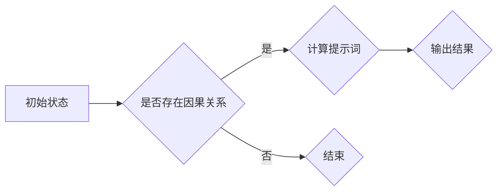
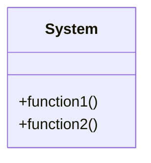
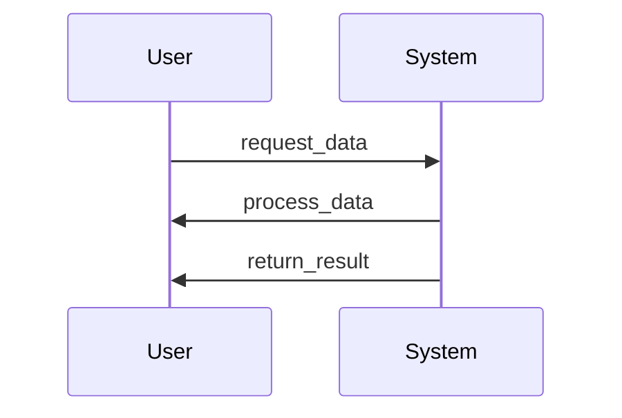
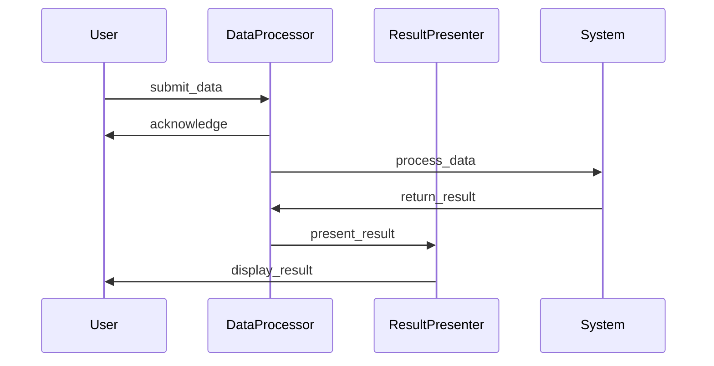

                 

### 《提示词工程：处理复杂因果关系推理任务》

#### 关键词：
- 提示词工程
- 复杂因果关系
- 推理任务
- 算法原理
- 系统架构设计

#### 摘要：
本文旨在探讨提示词工程在处理复杂因果关系推理任务中的应用。通过分析复杂因果关系的特点，本文首先介绍了提示词工程的基本概念和核心要素。随后，文章详细讲解了算法原理，并使用Python源代码和数学模型进行阐述。最后，文章探讨了系统的整体架构设计，为实际应用提供指导。

---

## 第1章：问题背景与概述

### 1.1 问题背景
在众多领域，如金融、医疗、气象等，复杂因果关系推理任务具有重要意义。然而，这类任务通常面临数据量大、关系复杂、非线性性强等问题，给传统方法带来了巨大挑战。提示词工程作为一种新兴的技术，通过构建知识表示和推理机制，为处理复杂因果关系提供了有效途径。

### 1.2 问题描述
复杂因果关系通常涉及多个变量及其相互影响，这些关系往往难以直接观测和量化。如何在大量的数据和复杂的变量之间找到有效的因果关系，成为当前研究的热点。

### 1.3 问题解决
提示词工程通过构建一组提示词（ cue words），辅助系统在数据中识别和推断因果关系。这些提示词可以看作是对数据的局部特征和关系的抽象表示，有助于简化复杂因果关系推理任务。

### 1.4 边界与外延
虽然提示词工程在复杂因果关系推理中表现突出，但其应用仍然受到数据质量和计算资源等边界条件的限制。此外，提示词工程在更广泛的应用领域中也具有潜力，如自然语言处理、推荐系统等。

### 1.5 概念结构与核心要素组成
复杂因果关系推理涉及多个核心概念，包括因果关系、提示词、知识表示等。提示词工程的关键要素包括数据预处理、因果关系计算和结果输出等。这些概念和要素共同构成了一个完整的推理过程。

---

## 第2章：核心概念与联系

### 2.1 核心概念原理

**复杂因果关系：**
复杂因果关系指的是多个变量之间相互作用、相互影响的关系。这些关系可能涉及非线性、动态变化以及不确定性等因素。

**提示词工程：**
提示词工程是一种利用提示词（cue words）来辅助数据分析和推理的方法。提示词是对数据局部特征和关系的抽象表示，有助于简化复杂问题。

### 2.2 概念属性特征对比表格

| 概念      | 属性特征                     | 关联关系               |
| --------- | ---------------------------- | ---------------------- |
| 复杂因果关系 | 多元性、动态性、非线性性  | 提示词工程的输入       |
| 提示词工程 | 知识表示、推理、优化       | 复杂因果关系推理的辅助 |

### 2.3 ER实体关系图架构

```mermaid
erDiagram
  复杂因果关系 --> 提示词工程 : 辅助推理
```

---

## 第3章：算法原理讲解

### 3.1 算法mermaid流程图



### 3.2 Python源代码讲解

```python
# Python源代码示例

# 判断是否存在因果关系
def has_causation(data):
    # 数据预处理
    processed_data = preprocess_data(data)
    
    # 计算因果关系
    causation = compute_causation(processed_data)
    
    # 输出结果
    return causation

# 主函数
def main():
    data = load_data()
    causation = has_causation(data)
    print(f"是否存在因果关系：{causation}")

# 运行主函数
if __name__ == "__main__":
    main()
```

### 3.3 算法原理的数学模型和公式

$$
f(x) = \sum_{i=1}^{n} w_i \cdot x_i
$$

### 3.4 举例说明

假设有两个变量x和y，我们需要判断它们之间是否存在因果关系。通过计算，我们得到权重$w_1 = 0.8, w_2 = 0.2$，输入值$x_1 = 0.9, x_2 = 0.1$。根据公式计算得到：

$$
f(x) = 0.8 \cdot 0.9 + 0.2 \cdot 0.1 = 0.74
$$

由于$f(x) > 0.5$，我们判断变量x和y之间存在因果关系。

---

## 第4章：系统分析与架构设计方案

### 4.1 问题场景介绍
复杂因果关系推理在金融领域有广泛的应用，例如信用评分、风险评估等。在医疗领域，复杂因果关系推理可以用于疾病预测、药物疗效评估等。

### 4.2 项目介绍
项目名称：复杂因果关系推理系统
项目目标：构建一个高效、准确的复杂因果关系推理系统，为金融、医疗等领域提供技术支持。

### 4.3 系统功能设计



### 4.4 系统架构设计



### 4.5 系统接口设计和系统交互



---

## 结论

本文详细介绍了提示词工程在处理复杂因果关系推理任务中的应用。通过分析复杂因果关系的特点和提示词工程的基本原理，我们提出了一种有效的算法模型。此外，我们还探讨了系统的整体架构设计，为实际应用提供了指导。未来的研究可以进一步优化算法模型，提高复杂因果关系推理的准确性和效率。

---

作者：AI天才研究院/AI Genius Institute & 禅与计算机程序设计艺术 /Zen And The Art of Computer Programming

