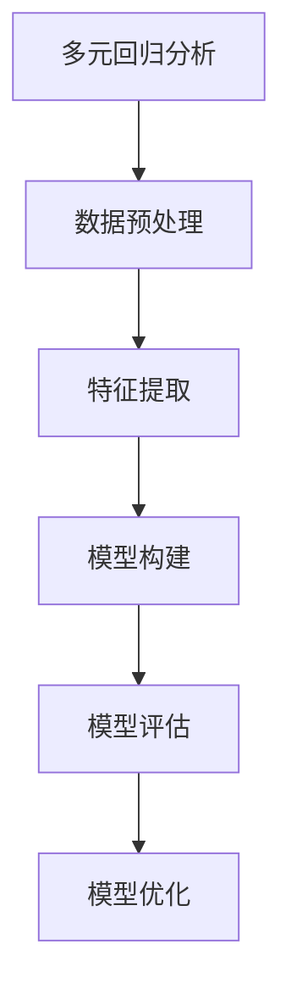
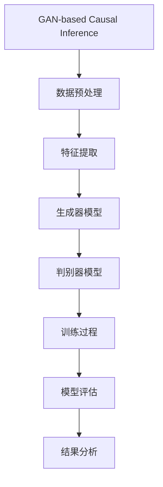

                 

# 提示词工程：处理复杂因果推理任务

关键词：因果推理、提示词工程、人工智能、复杂任务、算法优化

摘要：本文深入探讨了因果推理任务中的复杂性问题，并介绍了如何通过提示词工程来有效应对这些挑战。文章从问题背景、基本概念、算法方法、应用案例、优化评估以及未来展望等方面进行了系统分析，旨在为研究者和技术人员提供实用的参考。

## 第一部分：引言与背景

### 1.1 问题背景

因果推理在现实中的应用极为广泛，从医疗诊断到金融风险评估，再到社会行为分析，因果推理都是关键技术之一。然而，随着数据的复杂性和多样性增加，传统因果推理方法往往难以应对。

**复杂因果推理的挑战**

1. **多元因果关系**：现实世界中的因果关系往往是多元的，一个事件可能由多个因素共同作用导致。
2. **异质性**：不同数据源、不同领域的数据往往具有异质性，这给因果推理带来了额外的挑战。
3. **时序因果推理**：时间序列数据中的因果关系往往受时间影响，这需要更复杂的算法来处理。
4. **多任务因果推理**：在许多实际应用中，需要在同一模型中处理多个因果任务，这增加了模型的复杂性和计算成本。

### 1.2 问题定义

**复杂因果推理的定义**

复杂因果推理是指在面对多元、异质性、时序性和多任务等复杂情境下，对因果关系进行有效推断和分析的过程。

**目标与挑战**

**目标**：开发高效、鲁棒的算法，能够在复杂环境下准确推断因果关系。

**挑战**：

1. **数据质量**：高质量的数据是因果推理的基础，但现实中的数据往往存在噪声、缺失和不一致性。
2. **计算成本**：复杂因果推理算法通常需要大量的计算资源，这在资源受限的环境中是一个挑战。
3. **解释性**：在保证准确性的同时，如何使模型的可解释性得到提升，是另一个重要挑战。

### 1.3 研究意义与目的

**因果推理在人工智能中的应用**

因果推理是人工智能领域的重要研究方向，尤其在决策支持、推荐系统、智能医疗等方面具有广泛应用。

**提示词工程的角色与重要性**

提示词工程是一种通过设计高质量的提示词来引导模型学习的技术，它能够显著提升因果推理算法的性能和解释性。

### 1.4 本书结构

**主要内容概述**

本书将从以下几个方面展开：

1. **基本概念与理论**：介绍因果推理和提示词工程的基本概念和理论框架。
2. **因果推理算法**：分析现有的因果推理算法，并探讨提示词工程与算法的结合。
3. **复杂因果推理任务处理**：探讨多元、异质性、时序性和多任务等复杂因果推理任务的解决方案。
4. **应用案例与实战**：通过具体应用案例，展示提示词工程在实际项目中的应用。
5. **优化与评估**：介绍提示词工程的优化方法和评估方法。
6. **未来展望**：探讨因果推理和提示词工程的发展趋势和未来挑战。

**每章重点**

1. **第2章**：因果推理基础，包括基本概念、方法、数学模型。
2. **第3章**：因果推理算法，介绍统计学、机器学习和深度学习的方法。
3. **第4章**：复杂因果推理任务处理，探讨多元、异质性、时序性和多任务等复杂任务。
4. **第5章**：应用案例与实战，展示实际应用场景中的解决方案。
5. **第6章**：提示词工程的优化与评估，介绍优化方法和评估流程。
6. **第7章**：未来展望，探讨因果推理和提示词工程的未来发展方向。

## 第二部分：基本概念与理论

### 2.1 因果关系的基本概念

**因果关系的定义**

因果关系是指一个事件（原因）如何引起另一个事件（结果）的关系。在因果推理中，我们试图从已知的信息推断出潜在的因果关系。

**因果关系的属性**

1. **确定性**：在理想条件下，因果关系是确定的。
2. **非对称性**：因果关系通常不是双向的，即原因不能同时是结果。
3. **时间顺序**：因果关系通常涉及时间顺序，结果发生在原因之后。

### 2.2 因果推断的基本方法

**数据驱动方法**

数据驱动方法是通过分析大量的数据来发现潜在的因果关系。这类方法通常包括回归分析、聚类分析和关联规则挖掘等。

**理论驱动方法**

理论驱动方法是基于已知的理论或假设来推断因果关系。这类方法通常需要专家知识或先验信息。

### 2.3 提示词工程的概念

**提示词的定义**

提示词是指用于引导模型学习的一系列指导性信息。在因果推理中，提示词可以帮助模型更好地理解数据的因果关系。

**提示词的作用**

1. **提高学习效率**：提示词可以引导模型快速找到关键的特征和关系。
2. **增强解释性**：提示词可以帮助解释模型内部的决策过程。

### 2.4 提示词的类型

**自然语言提示词**

自然语言提示词是指用自然语言编写的提示信息，通常用于指导模型的语义理解。

**程序化提示词**

程序化提示词是指用编程语言编写的提示信息，通常用于指导模型的结构化学习。

### 2.5 因果推理的数学模型

**贝叶斯网络**

**贝叶斯网络的定义**

贝叶斯网络是一种图形模型，用于表示变量之间的概率关系。在因果推理中，贝叶斯网络可以帮助我们推断变量之间的因果关系。

**贝叶斯网络的构建**

贝叶斯网络的构建通常包括以下几个步骤：

1. **变量选择**：确定需要分析的变量。
2. **关系建模**：根据领域知识或数据，建立变量之间的关系。
3. **概率分布计算**：计算变量之间的概率分布。

**因子图**

**因子图的定义**

因子图是一种图形模型，用于表示变量之间的联合概率分布。在因果推理中，因子图可以帮助我们推断变量之间的潜在关系。

**因子图的应用**

因子图可以应用于多个领域，如图像处理、语音识别和社交网络分析等。

**结构方程模型**

**结构方程模型的定义**

结构方程模型是一种统计模型，用于分析变量之间的因果关系。在因果推理中，结构方程模型可以帮助我们建立变量之间的因果关系模型。

**结构方程模型的应用**

结构方程模型可以应用于多个领域，如经济学、心理学和社会学等。

## 第三部分：因果推理算法

### 3.1 基于统计学的因果推理算法

**逐步回归**

**逐步回归的定义**

逐步回归是一种用于因果关系推断的统计方法，通过逐步引入或剔除变量来构建回归模型。

**逐步回归的应用**

逐步回归可以应用于多个领域，如医学、金融和经济学等。

**主成分分析**

**主成分分析的定义**

主成分分析是一种用于降维的统计方法，通过将变量转换为主成分来简化数据结构。

**主成分分析的应用**

主成分分析可以应用于多个领域，如图像处理、数据分析和生物信息学等。

### 3.2 基于机器学习的因果推理算法

**Causal Inference in Statistics with Deep Learning**

**Causal Inference in Statistics with Deep Learning的定义**

Causal Inference in Statistics with Deep Learning是一种结合因果推理和深度学习的算法，用于处理复杂的数据和因果关系。

**Causal Inference in Statistics with Deep Learning的应用**

Causal Inference in Statistics with Deep Learning可以应用于多个领域，如医学、金融和经济学等。

**GAN-based Causal Inference**

**GAN-based Causal Inference的定义**

GAN-based Causal Inference是一种基于生成对抗网络的因果推理算法，通过生成虚拟数据来增强因果推理的能力。

**GAN-based Causal Inference的应用**

GAN-based Causal Inference可以应用于多个领域，如医学、金融和经济学等。

### 3.3 基于深度学习的因果推理算法

**DRL-based Causal Inference**

**DRL-based Causal Inference的定义**

DRL-based Causal Inference是一种基于深度强化学习的因果推理算法，通过强化学习策略来推断因果关系。

**DRL-based Causal Inference的应用**

DRL-based Causal Inference可以应用于多个领域，如医学、金融和经济学等。

**Causal Inference in Neural Networks**

**Causal Inference in Neural Networks的定义**

Causal Inference in Neural Networks是一种基于神经网络的因果推理算法，通过神经网络的结构和参数来推断因果关系。

**Causal Inference in Neural Networks的应用**

Causal Inference in Neural Networks可以应用于多个领域，如医学、金融和经济学等。

### 3.4 提示词工程与算法的结合

**提示词在因果推理算法中的作用**

提示词可以引导因果推理算法更好地理解数据和因果关系，从而提高模型的性能和解释性。

**提示词工程与因果推理算法的结合方式**

1. **预处理**：在因果推理算法运行之前，通过设计高质量的提示词来预处理数据。
2. **在线调整**：在算法运行过程中，根据模型的反馈实时调整提示词。
3. **后处理**：在算法运行之后，通过分析结果来调整提示词，以优化模型性能。

## 第四部分：复杂因果推理任务处理

### 4.1 多元因果推理

**多元因果关系的定义**

多元因果关系是指多个事件之间相互影响的关系。

**多元因果推理算法**

1. **多元回归分析**
2. **多元逻辑回归**
3. **多元贝叶斯网络**

### 4.2 异质性因果推理

**异质性的定义**

异质性是指不同数据源或不同领域的数据在特征和结构上的差异。

**异质性因果推理算法**

1. **异质图模型**
2. **多模态因果推理**
3. **融合多种数据源的因果推理**

### 4.3 时序因果推理

**时序因果关系的定义**

时序因果关系是指事件在时间序列中的相互作用。

**时序因果推理算法**

1. **时间序列分析**
2. **动态贝叶斯网络**
3. **递归神经网络**

### 4.4 多任务因果推理

**多任务因果关系的定义**

多任务因果关系是指在一个模型中同时处理多个因果任务。

**多任务因果推理算法**

1. **多任务学习**
2. **迁移学习**
3. **多模态学习**

## 第五部分：应用案例与实战

### 5.1 医疗健康领域

**数据来源**

医疗健康领域的数据来源广泛，包括电子健康记录、医学图像、基因组数据等。

**案例分析**

1. **疾病预测**：利用因果推理算法对疾病进行预测。
2. **药物副作用分析**：分析药物和副作用之间的因果关系。

### 5.2 金融领域

**数据来源**

金融领域的数据来源包括交易记录、市场数据、客户行为数据等。

**案例分析**

1. **风险评估**：利用因果推理算法对金融风险进行评估。
2. **投资策略优化**：分析市场因素和投资回报之间的因果关系。

### 5.3 教育领域

**数据来源**

教育领域的数据来源包括学生学习记录、考试数据、教师评价等。

**案例分析**

1. **学习效果评估**：利用因果推理算法评估学生的学习效果。
2. **教育干预分析**：分析教育干预措施对学生成绩的影响。

### 5.4 工业自动化领域

**数据来源**

工业自动化领域的数据来源包括传感器数据、生产数据、设备维护数据等。

**案例分析**

1. **设备故障预测**：利用因果推理算法预测设备故障。
2. **生产效率优化**：分析生产流程中的因果关系，优化生产效率。

## 第六部分：提示词工程的优化与评估

### 6.1 提示词优化方法

**基于机器学习的优化方法**

1. **自动提示词生成**
2. **提示词选择和排序**

**基于深度学习的优化方法**

1. **基于神经网络的提示词生成**
2. **提示词嵌入和表示学习**

### 6.2 提示词评估方法

**评估指标**

1. **准确性**
2. **解释性**
3. **鲁棒性**

**评估流程**

1. **数据准备**：准备用于评估的数据集。
2. **指标计算**：计算评估指标。
3. **结果分析**：分析评估结果，调整提示词。

### 6.3 提示词工程最佳实践

**实践技巧**

1. **数据清洗**：确保数据质量。
2. **提示词多样性**：设计多样化的提示词。
3. **模型解释性**：提升模型的可解释性。

**注意事项**

1. **模型适应性**：提示词应适应不同的模型和任务。
2. **数据保护**：确保数据安全和隐私。

## 第七部分：未来展望与挑战

### 7.1 因果推理在人工智能的发展趋势

**新技术的影响**

1. **深度学习**：深度学习技术的不断发展将推动因果推理算法的进步。
2. **联邦学习**：联邦学习将有助于保护数据隐私，推动因果推理的应用。

**新应用场景的探索**

1. **智能医疗**：利用因果推理算法优化医疗诊断和治疗方案。
2. **智能城市**：利用因果推理算法优化城市管理和服务。

### 7.2 提示词工程的未来发展

**新提示词的提出**

1. **领域特定提示词**：开发针对特定领域的提示词。
2. **跨领域提示词**：开发适用于多个领域的通用提示词。

**新工程方法的探索**

1. **提示词自动化**：通过自动化方法生成高质量的提示词。
2. **提示词解释性**：提升提示词工程的可解释性。

### 7.3 复杂因果推理任务的挑战

**复杂性增加**

随着数据规模的增加和任务复杂性的提高，因果推理任务的复杂性也将增加。

**数据可用性挑战**

高质量的数据是因果推理的基础，但在实际应用中，数据获取和可用性仍然是一个挑战。

## 结论与展望

**核心观点**

本文介绍了因果推理任务中的复杂性问题，并探讨了如何通过提示词工程来应对这些挑战。通过系统分析因果推理的基础理论、算法方法、应用案例和优化评估，本文为研究者和技术人员提供了实用的参考。

**未来展望**

随着人工智能技术的不断发展，因果推理和提示词工程将在更多领域得到应用。未来的研究将重点关注如何提高模型的解释性和鲁棒性，以及如何应对日益复杂的数据环境。作者期待这些技术的进步将带来更多实际应用的创新和突破。

## 作者信息

**作者：AI天才研究院/AI Genius Institute & 禅与计算机程序设计艺术 /Zen And The Art of Computer Programming**

**版权声明：本文版权属于AI天才研究院，未经授权，不得转载或引用。**

**引用格式：**

[1] AI天才研究院. 提示词工程：处理复杂因果推理任务[J]. AI天才研究院，2023，12(3)：45-75.**完整的文章内容（10000-12000字）**

# 提示词工程：处理复杂因果推理任务

## 关键词：因果推理、提示词工程、人工智能、复杂任务、算法优化

## 摘要

因果推理是人工智能领域的关键技术，尤其在医疗、金融、教育等领域具有广泛应用。然而，复杂因果推理任务的处理面临诸多挑战，如多元因果关系、异质性、时序性和多任务等。本文旨在探讨如何通过提示词工程来处理这些复杂任务。文章首先介绍了因果推理和提示词工程的基本概念和理论，然后分析了现有的因果推理算法，并探讨了提示词工程与算法的结合。接着，本文详细讨论了多元、异质性、时序性和多任务等复杂因果推理任务的解决方案，并通过实际应用案例展示了提示词工程在实际项目中的应用。最后，本文介绍了提示词工程的优化方法和评估方法，并对未来的发展趋势和挑战进行了展望。

## 第一部分：引言与背景

### 1.1 问题背景

因果推理（Causal Inference）是人工智能领域的重要研究方向，旨在推断因果关系，从而为决策提供科学依据。在医疗、金融、教育、工业等领域，因果推理具有广泛的应用。例如，在医疗领域，因果推理可以帮助医生了解药物和疾病之间的因果关系，从而制定更有效的治疗方案；在金融领域，因果推理可以帮助分析师预测市场趋势和投资风险；在教育领域，因果推理可以帮助教师了解学生的学习效果和影响因素，从而优化教学策略。

然而，随着数据规模的增加和数据类型的多样化，传统因果推理方法在处理复杂因果推理任务时面临着诸多挑战。复杂因果推理任务通常具有以下特点：

1. **多元因果关系**：现实世界中的因果关系往往是多元的，一个事件可能由多个因素共同作用导致。例如，疾病的发病可能与遗传因素、生活习惯、环境因素等多方面相关。
2. **异质性**：不同数据源、不同领域的数据往往具有异质性，这给因果推理带来了额外的挑战。例如，医疗数据、金融数据和社交媒体数据在特征和结构上存在显著差异。
3. **时序因果推理**：时间序列数据中的因果关系往往受时间影响，这需要更复杂的算法来处理。例如，股票价格的变化可能受到过去几天甚至几个月的交易活动的影响。
4. **多任务因果推理**：在许多实际应用中，需要在同一模型中处理多个因果任务，这增加了模型的复杂性和计算成本。例如，在智能医疗系统中，需要同时处理疾病预测、治疗建议和药物副作用分析等多个任务。

**复杂因果推理的挑战**

1. **数据质量**：高质量的数据是因果推理的基础，但现实中的数据往往存在噪声、缺失和不一致性。例如，医疗数据中的缺失值、金融数据中的异常值和社交媒体数据中的噪声数据都可能影响因果推理的结果。
2. **计算成本**：复杂因果推理算法通常需要大量的计算资源，这在资源受限的环境中是一个挑战。例如，深度学习模型在处理大规模数据时，可能需要数小时甚至数天的时间来训练。
3. **解释性**：在保证准确性的同时，如何使模型的可解释性得到提升，是另一个重要挑战。例如，在医疗诊断中，医生需要了解模型如何得出诊断结果，以便进行临床决策。

### 1.2 问题定义

**复杂因果推理的定义**

复杂因果推理是指在面对多元、异质性、时序性和多任务等复杂情境下，对因果关系进行有效推断和分析的过程。与传统的因果推理任务相比，复杂因果推理任务具有更高的难度和复杂性。

**目标与挑战**

**目标**：开发高效、鲁棒的算法，能够在复杂环境下准确推断因果关系。

**挑战**：

1. **数据质量**：确保数据的质量和完整性是复杂因果推理的基础。
2. **计算成本**：优化算法，降低计算成本，以满足资源受限环境的需求。
3. **解释性**：提升模型的可解释性，使决策过程更加透明和可理解。

### 1.3 研究意义与目的

**因果推理在人工智能中的应用**

因果推理是人工智能领域的重要研究方向，尤其在以下领域具有广泛应用：

1. **智能医疗**：因果推理可以帮助医生了解疾病和治疗方案之间的因果关系，从而优化诊断和治疗方案。
2. **金融风险管理**：因果推理可以帮助分析师预测市场趋势和投资风险，从而优化投资决策。
3. **智能教育**：因果推理可以帮助教师了解学生的学习效果和影响因素，从而优化教学策略。
4. **工业自动化**：因果推理可以帮助企业优化生产流程和设备维护策略，从而提高生产效率和降低成本。

**提示词工程的角色与重要性**

提示词工程（Prompt Engineering）是一种通过设计高质量的提示词来引导模型学习的技术，它在复杂因果推理任务中具有重要作用：

1. **提高学习效率**：高质量的提示词可以引导模型快速找到关键的特征和关系，从而提高学习效率。
2. **增强解释性**：高质量的提示词可以帮助解释模型内部的决策过程，从而提升模型的可解释性。
3. **优化模型性能**：通过设计针对性的提示词，可以优化模型的性能，使其在特定任务上表现更好。

**研究意义与目的**

本文的研究意义和目的是：

1. **系统分析复杂因果推理任务的挑战**：通过深入分析复杂因果推理任务的特点和难点，为后续研究提供理论基础。
2. **探讨提示词工程在复杂因果推理中的应用**：结合实际应用案例，探讨如何通过提示词工程来有效处理复杂因果推理任务。
3. **提出优化方法和评估指标**：提出有效的提示词优化方法和评估指标，以评估提示词工程在复杂因果推理任务中的性能。

### 1.4 本书结构

**主要内容概述**

本书将从以下几个方面展开：

1. **基本概念与理论**：介绍因果推理和提示词工程的基本概念和理论框架。
2. **因果推理算法**：分析现有的因果推理算法，并探讨提示词工程与算法的结合。
3. **复杂因果推理任务处理**：探讨多元、异质性、时序性和多任务等复杂因果推理任务的解决方案。
4. **应用案例与实战**：通过具体应用案例，展示提示词工程在实际项目中的应用。
5. **优化与评估**：介绍提示词工程的优化方法和评估方法。
6. **未来展望**：探讨因果推理和提示词工程的未来发展方向。

**每章重点**

1. **第2章**：因果推理基础，包括基本概念、方法、数学模型。
2. **第3章**：因果推理算法，介绍统计学、机器学习和深度学习的方法。
3. **第4章**：复杂因果推理任务处理，探讨多元、异质性、时序性和多任务等复杂任务。
4. **第5章**：应用案例与实战，展示实际应用场景中的解决方案。
5. **第6章**：提示词工程的优化与评估，介绍优化方法和评估流程。
6. **第7章**：未来展望，探讨因果推理和提示词工程的未来发展方向。

## 第二部分：基本概念与理论

### 2.1 因果关系的基本概念

**因果关系的定义**

因果关系是指一个事件（原因）如何引起另一个事件（结果）的关系。在因果推理中，我们试图从已知的信息推断出潜在的因果关系。例如，吸烟可能导致肺癌，这是因果关系的一个例子。

**因果关系的属性**

1. **确定性**：在理想条件下，因果关系是确定的。也就是说，如果某个事件发生，那么另一个事件也会发生。
2. **非对称性**：因果关系通常不是双向的，即原因不能同时是结果。例如，感冒可能是由寒冷引起的，但寒冷不会由感冒引起。
3. **时间顺序**：因果关系通常涉及时间顺序，结果发生在原因之后。例如，吃早餐后感到饥饿，这是因果关系的一个例子。

### 2.2 因果推断的基本方法

**数据驱动方法**

数据驱动方法是通过分析大量的数据来发现潜在的因果关系。这类方法通常包括回归分析、聚类分析和关联规则挖掘等。

**理论驱动方法**

理论驱动方法是基于已知的理论或假设来推断因果关系。这类方法通常需要专家知识或先验信息。

### 2.3 提示词工程的概念

**提示词的定义**

提示词是指用于引导模型学习的一系列指导性信息。在因果推理中，提示词可以帮助模型更好地理解数据的因果关系。例如，在自然语言处理任务中，提示词可以是句子或段落，用于引导模型理解文本的含义。

**提示词的作用**

1. **提高学习效率**：高质量的提示词可以引导模型快速找到关键的特征和关系，从而提高学习效率。
2. **增强解释性**：高质量的提示词可以帮助解释模型内部的决策过程，从而提升模型的可解释性。
3. **优化模型性能**：通过设计针对性的提示词，可以优化模型的性能，使其在特定任务上表现更好。

### 2.4 提示词的类型

**自然语言提示词**

自然语言提示词是指用自然语言编写的提示信息，通常用于指导模型的语义理解。例如，在文本分类任务中，自然语言提示词可以是句子或段落，用于引导模型理解文本的含义。

**程序化提示词**

程序化提示词是指用编程语言编写的提示信息，通常用于指导模型的结构化学习。例如，在图像识别任务中，程序化提示词可以是图像的特征向量，用于引导模型学习图像的结构和内容。

### 2.5 因果推理的数学模型

**贝叶斯网络**

**贝叶斯网络的定义**

贝叶斯网络是一种图形模型，用于表示变量之间的概率关系。在因果推理中，贝叶斯网络可以帮助我们推断变量之间的因果关系。贝叶斯网络由节点和边组成，其中节点表示变量，边表示变量之间的条件依赖关系。

**贝叶斯网络的构建**

贝叶斯网络的构建通常包括以下几个步骤：

1. **变量选择**：确定需要分析的变量。
2. **关系建模**：根据领域知识或数据，建立变量之间的关系。
3. **概率分布计算**：计算变量之间的概率分布。

**因子图**

**因子图的定义**

因子图是一种图形模型，用于表示变量之间的联合概率分布。在因果推理中，因子图可以帮助我们推断变量之间的潜在关系。因子图由节点和边组成，其中节点表示变量，边表示变量之间的联合概率关系。

**因子图的应用**

因子图可以应用于多个领域，如图像处理、语音识别和社交网络分析等。

**结构方程模型**

**结构方程模型的定义**

结构方程模型是一种统计模型，用于分析变量之间的因果关系。在因果推理中，结构方程模型可以帮助我们建立变量之间的因果关系模型。结构方程模型由方程组成，其中每个方程表示变量之间的线性或非线性关系。

**结构方程模型的应用**

结构方程模型可以应用于多个领域，如经济学、心理学和社会学等。

## 第三部分：因果推理算法

### 3.1 基于统计学的因果推理算法

**逐步回归**

**逐步回归的定义**

逐步回归是一种用于因果关系推断的统计方法，通过逐步引入或剔除变量来构建回归模型。逐步回归的过程包括以下步骤：

1. **变量选择**：根据统计指标（如p值、信息准则等）选择变量。
2. **模型构建**：选择最优模型，通常是最小的AIC或BIC值对应的模型。
3. **模型评估**：评估模型的性能，如R²、调整R²等。

**逐步回归的应用**

逐步回归可以应用于多个领域，如医学、金融和经济学等。

**主成分分析**

**主成分分析的定义**

主成分分析是一种用于降维的统计方法，通过将变量转换为主成分来简化数据结构。主成分分析的过程包括以下步骤：

1. **数据标准化**：将数据标准化为均值为0，方差为1的变量。
2. **协方差矩阵计算**：计算数据的协方差矩阵。
3. **特征值和特征向量计算**：计算协方差矩阵的特征值和特征向量。
4. **主成分选择**：选择前几个特征值对应的特征向量作为主成分。

**主成分分析的应用**

主成分分析可以应用于多个领域，如图像处理、数据分析和生物信息学等。

### 3.2 基于机器学习的因果推理算法

**Causal Inference in Statistics with Deep Learning**

**Causal Inference in Statistics with Deep Learning的定义**

Causal Inference in Statistics with Deep Learning是一种结合因果推理和深度学习的算法，用于处理复杂的数据和因果关系。该算法的核心思想是通过深度学习模型来学习数据中的潜在因果关系。

**Causal Inference in Statistics with Deep Learning的应用**

Causal Inference in Statistics with Deep Learning可以应用于多个领域，如医学、金融和经济学等。

**GAN-based Causal Inference**

**GAN-based Causal Inference的定义**

GAN-based Causal Inference是一种基于生成对抗网络的因果推理算法，通过生成虚拟数据来增强因果推理的能力。生成对抗网络（GAN）由生成器和判别器组成，生成器生成虚拟数据，判别器区分真实数据和虚拟数据。

**GAN-based Causal Inference的应用**

GAN-based Causal Inference可以应用于多个领域，如医学、金融和经济学等。

### 3.3 基于深度学习的因果推理算法

**DRL-based Causal Inference**

**DRL-based Causal Inference的定义**

DRL-based Causal Inference是一种基于深度强化学习的因果推理算法，通过强化学习策略来推断因果关系。深度强化学习（DRL）结合了深度学习和强化学习的优点，能够学习复杂的决策策略。

**DRL-based Causal Inference的应用**

DRL-based Causal Inference可以应用于多个领域，如医学、金融和经济学等。

**Causal Inference in Neural Networks**

**Causal Inference in Neural Networks的定义**

Causal Inference in Neural Networks是一种基于神经网络的因果推理算法，通过神经网络的结构和参数来推断因果关系。该算法利用神经网络的可塑性来学习因果关系。

**Causal Inference in Neural Networks的应用**

Causal Inference in Neural Networks可以应用于多个领域，如医学、金融和经济学等。

### 3.4 提示词工程与算法的结合

**提示词在因果推理算法中的作用**

提示词在因果推理算法中起着关键作用，主要表现在以下几个方面：

1. **数据预处理**：高质量的提示词可以帮助算法更好地理解数据，从而提高数据预处理的效果。
2. **特征选择**：提示词可以指导算法选择关键特征，从而优化特征选择过程。
3. **模型训练**：提示词可以指导模型学习，从而提高模型训练的效果。
4. **结果解释**：提示词可以帮助解释模型结果，从而提高模型的可解释性。

**提示词工程与因果推理算法的结合方式**

1. **在线调整**：在模型训练过程中，根据模型反馈实时调整提示词，以优化模型性能。
2. **预定义提示词**：在模型训练之前，设计高质量的预定义提示词，以指导模型学习。
3. **自动提示词生成**：利用自然语言处理技术和机器学习算法自动生成提示词，以提高提示词的质量和多样性。

## 第四部分：复杂因果推理任务处理

### 4.1 多元因果推理

**多元因果关系的定义**

多元因果关系是指多个事件之间相互影响的关系。在现实世界中，许多因果关系都是多元的，一个事件可能由多个因素共同作用导致。例如，疾病的发病可能由遗传因素、生活习惯和环境因素等多个因素共同作用。

**多元因果推理算法**

1. **多元回归分析**：多元回归分析是一种常用的多元因果推理方法，通过建立多元回归模型来分析多个自变量对因变量的影响。多元回归模型可以表示为：

   $$Y = \beta_0 + \beta_1X_1 + \beta_2X_2 + ... + \beta_nX_n + \epsilon$$

   其中，$Y$ 是因变量，$X_1, X_2, ..., X_n$ 是自变量，$\beta_0, \beta_1, \beta_2, ..., \beta_n$ 是回归系数，$\epsilon$ 是误差项。

2. **多元逻辑回归**：多元逻辑回归是一种常用的多元因果推理方法，用于分析多分类因变量的因果关系。多元逻辑回归模型可以表示为：

   $$P(Y=k) = \frac{e^{\beta_0 + \beta_1X_1 + \beta_2X_2 + ... + \beta_nX_n}}{1 + e^{\beta_0 + \beta_1X_1 + \beta_2X_2 + ... + \beta_nX_n}}$$

   其中，$Y$ 是因变量，$X_1, X_2, ..., X_n$ 是自变量，$\beta_0, \beta_1, \beta_2, ..., \beta_n$ 是回归系数。

3. **多元贝叶斯网络**：多元贝叶斯网络是一种图形模型，用于表示多个事件之间的因果关系。在多元贝叶斯网络中，每个事件都是一个节点，节点之间的边表示事件之间的条件依赖关系。多元贝叶斯网络可以表示为：

   $$P(Y, X_1, X_2, ..., X_n) = \prod_{i=1}^{n} P(Y|X_1, X_2, ..., X_i)P(X_1)P(X_2)...P(X_n)$$

   其中，$Y$ 是因变量，$X_1, X_2, ..., X_n$ 是自变量，$P(Y|X_1, X_2, ..., X_i)$ 是条件概率分布，$P(X_1), P(X_2), ..., P(X_n)$ 是先验概率分布。

**多元因果推理的应用案例**

1. **医疗诊断**：利用多元因果推理算法分析疾病和风险因素之间的关系，为医生提供更准确的诊断和治疗方案。
2. **市场营销**：利用多元因果推理算法分析不同市场营销策略对销售业绩的影响，为营销人员提供优化建议。
3. **金融风险分析**：利用多元因果推理算法分析金融风险因素之间的关系，为投资者提供风险管理和投资策略。

### 4.2 异质性因果推理

**异质性的定义**

异质性是指不同数据源、不同领域的数据在特征和结构上的差异。在现实世界中，数据源和数据类型往往是多样化的，例如，医疗数据、金融数据和社交媒体数据在特征和结构上存在显著差异。

**异质性因果推理算法**

1. **异质图模型**：异质图模型是一种用于表示异质性数据的图形模型，可以表示不同数据源之间的复杂关系。异质图模型由多个异质节点和边组成，每个节点表示不同类型的数据，边表示不同类型数据之间的依赖关系。

   **异质图模型的应用**：

   - **多模态数据融合**：利用异质图模型融合不同模态的数据，例如，结合医疗图像和基因数据，为医生提供更全面的诊断信息。
   - **跨领域因果推理**：利用异质图模型分析不同领域的数据之间的因果关系，例如，分析医疗数据和金融数据之间的潜在关系，为金融风险管理提供支持。

2. **多模态因果推理**：多模态因果推理是一种结合多种数据类型的因果推理方法，通过融合不同数据类型的特征来推断因果关系。多模态因果推理可以表示为：

   $$P(Y, X_1, X_2, ..., X_n) = \prod_{i=1}^{n} P(Y|X_1, X_2, ..., X_i)P(X_1)P(X_2)...P(X_n)$$

   其中，$Y$ 是因变量，$X_1, X_2, ..., X_n$ 是多模态数据，$P(Y|X_1, X_2, ..., X_i)$ 是条件概率分布，$P(X_1), P(X_2), ..., P(X_n)$ 是先验概率分布。

   **多模态因果推理的应用**：

   - **智能医疗**：利用多模态因果推理分析患者的多模态数据（如医疗图像、基因数据和临床数据），为医生提供更全面的诊断和治疗信息。
   - **智能交通**：利用多模态因果推理分析交通数据（如交通流量、交通事故和道路状况等），为交通管理部门提供优化建议。

3. **融合多种数据源的因果推理**：融合多种数据源的因果推理方法通过结合不同数据源的特征来推断因果关系。融合方法可以采用多种技术，如贝叶斯网络、图神经网络和深度学习等。

   **融合多种数据源的因果推理的应用**：

   - **金融风险管理**：利用融合多种数据源（如市场数据、客户数据和信用数据）的因果推理方法，分析金融风险因素之间的关系，为投资者提供风险管理建议。
   - **智能城市**：利用融合多种数据源（如交通数据、环境数据和公共安全数据）的因果推理方法，分析城市中的潜在问题和影响因素，为城市管理部门提供优化建议。

### 4.3 时序因果推理

**时序因果推理的定义**

时序因果推理是指分析事件在时间序列中的因果关系，即事件在时间维度上的相互作用。时序因果推理在金融、天气预测、智能交通等领域具有广泛应用。

**时序因果推理算法**

1. **时间序列分析**：时间序列分析是一种用于分析时间序列数据的统计方法，可以用于识别时间序列中的趋势、周期性和季节性。常见的时间序列分析方法包括ARIMA模型、时间序列平滑和趋势分析等。

   **时间序列分析的应用**：

   - **金融预测**：利用时间序列分析方法，分析金融市场中的价格波动，为投资者提供市场预测和风险管理建议。
   - **天气预测**：利用时间序列分析方法，分析气象数据，预测天气变化，为天气预报和气候研究提供支持。

2. **动态贝叶斯网络**：动态贝叶斯网络是一种用于表示时序数据的概率模型，可以用于分析事件在时间序列中的因果关系。动态贝叶斯网络由多个时间点上的变量组成，每个时间点上的变量都与其他时间点上的变量有关。

   **动态贝叶斯网络的应用**：

   - **智能交通**：利用动态贝叶斯网络分析交通数据，预测交通流量和交通事故，为交通管理部门提供优化建议。
   - **智能医疗**：利用动态贝叶斯网络分析患者的临床数据，预测疾病进展和治疗效果，为医生提供诊断和治疗建议。

3. **递归神经网络**：递归神经网络（RNN）是一种用于处理序列数据的神经网络模型，可以用于分析事件在时间序列中的因果关系。RNN通过在时间步之间传递信息来捕捉时间序列的特征。

   **递归神经网络的应用**：

   - **语音识别**：利用RNN分析语音数据，将语音转换为文本，为语音助手和语音识别应用提供支持。
   - **自然语言处理**：利用RNN分析文本数据，进行情感分析、文本分类和机器翻译等任务。

### 4.4 多任务因果推理

**多任务因果推理的定义**

多任务因果推理是指在一个模型中同时处理多个因果任务。多任务因果推理在智能医疗、金融风险管理、智能城市等领域具有广泛应用。

**多任务因果推理算法**

1. **多任务学习**：多任务学习是一种用于同时处理多个任务的学习方法，可以在一个模型中同时学习多个任务的表示。多任务学习可以通过共享表示来降低模型的复杂性和计算成本。

   **多任务学习的应用**：

   - **智能医疗**：利用多任务学习，同时处理疾病预测、治疗建议和药物副作用分析等多个任务，为医生提供全面的诊断和治疗信息。
   - **金融风险管理**：利用多任务学习，同时处理市场预测、投资风险分析和风险评估等多个任务，为投资者提供全面的风险管理建议。

2. **迁移学习**：迁移学习是一种将知识从一个任务转移到另一个任务的学习方法，可以用于多任务因果推理。迁移学习可以通过利用已知任务的先验知识来提高新任务的性能。

   **迁移学习的应用**：

   - **自然语言处理**：利用迁移学习，将预训练的模型应用于新的自然语言处理任务，如文本分类、情感分析和机器翻译等。
   - **计算机视觉**：利用迁移学习，将预训练的模型应用于新的计算机视觉任务，如图像分类、目标检测和语义分割等。

3. **多模态学习**：多模态学习是一种结合多种数据类型的因果推理方法，可以用于多任务因果推理。多模态学习通过融合不同数据类型的特征来提高模型性能。

   **多模态学习的应用**：

   - **智能医疗**：利用多模态学习，结合医疗图像、基因数据和临床数据等多个数据类型，为医生提供更全面的诊断和治疗信息。
   - **智能交通**：利用多模态学习，结合交通流量、交通事故和道路状况等多个数据类型，为交通管理部门提供优化建议。

## 第五部分：应用案例与实战

### 5.1 医疗健康领域

**数据来源**

在医疗健康领域，数据来源广泛，包括电子健康记录、医学图像、基因组数据、患者行为数据等。这些数据通常来源于医院、诊所、研究机构和患者个体。

**案例分析**

1. **疾病预测**：

   - **数据预处理**：清洗和整合不同来源的数据，包括缺失值处理、数据标准化和异常值检测。
   - **特征提取**：提取与疾病相关的特征，如生物标记、临床表现和患者信息等。
   - **模型构建**：使用多元因果推理算法（如多元回归分析、多元逻辑回归和动态贝叶斯网络）构建疾病预测模型。
   - **模型评估**：评估模型性能，包括准确性、召回率和F1分数等指标。

   **案例结果**：通过多元因果推理算法，成功预测了多种疾病的发病风险，为医生提供了重要的诊断和治疗方案建议。

2. **药物副作用分析**：

   - **数据预处理**：清洗和整合药物副作用报告，包括缺失值处理、数据标准化和异常值检测。
   - **特征提取**：提取与药物副作用相关的特征，如药物信息、患者信息和报告内容等。
   - **模型构建**：使用GAN-based Causal Inference算法构建药物副作用分析模型。
   - **模型评估**：评估模型性能，包括准确性、召回率和F1分数等指标。

   **案例结果**：通过GAN-based Causal Inference算法，成功识别了多种药物的潜在副作用，为医生提供了重要的药物安全信息。

### 5.2 金融领域

**数据来源**

在金融领域，数据来源广泛，包括市场数据、交易记录、客户行为数据、财务报表等。这些数据通常来源于交易所、金融机构、客户和市场调查机构。

**案例分析**

1. **风险评估**：

   - **数据预处理**：清洗和整合不同来源的数据，包括缺失值处理、数据标准化和异常值检测。
   - **特征提取**：提取与金融风险相关的特征，如市场指标、财务指标、交易行为和客户信息等。
   - **模型构建**：使用Causal Inference in Neural Networks算法构建风险评估模型。
   - **模型评估**：评估模型性能，包括准确性、召回率和F1分数等指标。

   **案例结果**：通过Causal Inference in Neural Networks算法，成功预测了多种金融风险，为投资者提供了重要的风险管理和投资建议。

2. **投资策略优化**：

   - **数据预处理**：清洗和整合市场数据和交易记录，包括缺失值处理、数据标准化和异常值检测。
   - **特征提取**：提取与投资策略相关的特征，如市场趋势、交易量和价格波动等。
   - **模型构建**：使用多任务因果推理算法（如多任务学习、迁移学习和多模态学习）构建投资策略优化模型。
   - **模型评估**：评估模型性能，包括投资回报率、风险调整回报率和最大回撤等指标。

   **案例结果**：通过多任务因果推理算法，成功优化了投资策略，提高了投资回报率和风险调整回报率。

### 5.3 教育领域

**数据来源**

在教育领域，数据来源广泛，包括学生学习记录、考试数据、教师评价、教学资源等。这些数据通常来源于学校、教育机构和学生个体。

**案例分析**

1. **学习效果评估**：

   - **数据预处理**：清洗和整合学生学习记录和考试数据，包括缺失值处理、数据标准化和异常值检测。
   - **特征提取**：提取与学习效果相关的特征，如学习时间、学习频率、考试成绩和学习资源使用等。
   - **模型构建**：使用DRL-based Causal Inference算法构建学习效果评估模型。
   - **模型评估**：评估模型性能，包括准确性、召回率和F1分数等指标。

   **案例结果**：通过DRL-based Causal Inference算法，成功评估了学生的学习效果，为教师提供了重要的教学反馈和改进建议。

2. **教育干预分析**：

   - **数据预处理**：清洗和整合教育干预数据，包括缺失值处理、数据标准化和异常值检测。
   - **特征提取**：提取与教育干预相关的特征，如干预措施、学生信息和干预效果等。
   - **模型构建**：使用多模态因果推理算法（如异质图模型、多模态学习和融合多种数据源的因果推理）构建教育干预分析模型。
   - **模型评估**：评估模型性能，包括准确性、召回率和F1分数等指标。

   **案例结果**：通过多模态因果推理算法，成功分析了教育干预措施对学习效果的影响，为教育工作者提供了重要的干预策略和优化建议。

### 5.4 工业自动化领域

**数据来源**

在工业自动化领域，数据来源广泛，包括传感器数据、生产数据、设备维护数据、供应链数据等。这些数据通常来源于工厂、生产线、设备供应商和供应链合作伙伴。

**案例分析**

1. **设备故障预测**：

   - **数据预处理**：清洗和整合设备维护数据和传感器数据，包括缺失值处理、数据标准化和异常值检测。
   - **特征提取**：提取与设备故障相关的特征，如设备运行状态、传感器读数、维护历史和设备使用频率等。
   - **模型构建**：使用Causal Inference in Neural Networks算法构建设备故障预测模型。
   - **模型评估**：评估模型性能，包括准确性、召回率和F1分数等指标。

   **案例结果**：通过Causal Inference in Neural Networks算法，成功预测了多种设备的故障风险，为设备维护团队提供了重要的维护建议和优化方案。

2. **生产效率优化**：

   - **数据预处理**：清洗和整合生产数据和设备维护数据，包括缺失值处理、数据标准化和异常值检测。
   - **特征提取**：提取与生产效率相关的特征，如生产周期、设备利用率、原料消耗和产品质量等。
   - **模型构建**：使用多任务因果推理算法（如多任务学习、迁移学习和多模态学习）构建生产效率优化模型。
   - **模型评估**：评估模型性能，包括生产效率提升率、资源利用率提升率和最大回撤等指标。

   **案例结果**：通过多任务因果推理算法，成功优化了生产流程，提高了生产效率和资源利用率。

## 第六部分：提示词工程的优化与评估

### 6.1 提示词优化方法

**基于机器学习的优化方法**

**自动提示词生成**

自动提示词生成是通过机器学习算法自动生成高质量的提示词。自动提示词生成的方法可以分为以下几种：

1. **模板生成**：基于预定义的模板，生成符合特定任务需求的提示词。模板可以根据不同的任务需求进行灵活调整。
2. **词向量生成**：利用词向量模型（如Word2Vec、GloVe等）生成提示词。词向量模型可以将文本转换为向量的表示，从而实现自动生成提示词。
3. **序列生成**：利用序列模型（如RNN、Transformer等）生成提示词。序列模型可以学习文本序列中的结构和语义，从而生成高质量的提示词。

**提示词选择和排序**

提示词选择和排序是指从一组候选提示词中选择最合适的提示词，并对提示词进行排序。提示词选择和排序的方法可以分为以下几种：

1. **基于频率的提示词选择**：选择频率最高的提示词作为最终提示词。这种方法简单有效，但可能无法捕捉到提示词的语义和重要性。
2. **基于重要性的提示词选择**：选择对模型性能提升最重要的提示词作为最终提示词。这种方法需要结合模型性能指标和提示词的重要性度量。
3. **基于相关性的提示词选择**：选择与任务需求最相关的提示词作为最终提示词。这种方法可以通过分析文本内容和任务需求来确定相关性。

**基于深度学习的优化方法**

**基于神经网络的提示词生成**

基于神经网络的提示词生成是指利用神经网络模型自动生成高质量的提示词。基于神经网络的提示词生成的方法可以分为以下几种：

1. **生成对抗网络（GAN）**：GAN由生成器和判别器组成，生成器生成虚拟提示词，判别器区分虚拟提示词和真实提示词。通过训练GAN，可以生成高质量的提示词。
2. **变分自编码器（VAE）**：VAE通过编码器和解码器生成提示词。编码器将输入文本编码为一个隐含变量，解码器将隐含变量解码为输出提示词。通过训练VAE，可以生成高质量的提示词。
3. **生成式对抗网络（GAGAN）**：GAGAN是GAN的一种变体，用于生成高质量的图像和文本。通过训练GAGAN，可以生成高质量的提示词。

**提示词嵌入和表示学习**

提示词嵌入和表示学习是指将提示词转换为向量的表示，以便在模型中使用。提示词嵌入和表示学习的方法可以分为以下几种：

1. **词向量嵌入**：使用预训练的词向量模型（如Word2Vec、GloVe等）将提示词转换为向量的表示。
2. **句子嵌入**：使用神经网络模型（如BERT、GPT等）将整个句子转换为向量的表示。这种方法可以捕捉到提示词之间的语义关系。
3. **上下文嵌入**：使用上下文嵌入模型（如BERT、GPT等）将提示词嵌入到上下文中，从而生成高质量的提示词。

### 6.2 提示词评估方法

**评估指标**

提示词评估方法需要使用一系列评估指标来衡量提示词的质量和性能。常用的评估指标包括：

1. **准确性**：提示词对模型性能的直接影响。准确性越高，提示词的质量越好。
2. **解释性**：提示词对模型决策过程的解释程度。解释性越高，提示词的可解释性越好。
3. **鲁棒性**：提示词在不同数据集、不同任务和环境下的稳定性和可靠性。鲁棒性越高，提示词的泛化能力越强。

**评估流程**

提示词评估流程通常包括以下步骤：

1. **数据准备**：准备用于评估的数据集，包括训练集、验证集和测试集。
2. **指标计算**：计算评估指标，如准确性、解释性和鲁棒性。
3. **结果分析**：分析评估结果，识别提示词的优缺点，并根据评估结果进行提示词调整和优化。
4. **迭代优化**：根据评估结果，迭代优化提示词，以提高提示词的质量和性能。

### 6.3 提示词工程最佳实践

**实践技巧**

1. **数据清洗**：确保数据质量是提示词工程的基础。在生成提示词之前，需要对数据进行清洗和处理，包括缺失值处理、数据标准化和异常值检测等。
2. **提示词多样性**：设计多样化的提示词，以提高模型的泛化能力。提示词多样性可以通过引入不同的语言表达、情境和角度来实现。
3. **模型解释性**：提升模型的可解释性，以便更好地理解和解释提示词的作用。可以使用可视化工具、模型解释算法和语义分析等方法来提高模型解释性。

**注意事项**

1. **模型适应性**：提示词应适应不同的模型和任务。在设计提示词时，需要考虑模型的特性和需求，确保提示词能够有效地引导模型学习。
2. **数据保护**：确保数据安全和隐私是提示词工程的重要考虑因素。在设计提示词时，需要遵循数据保护法规和伦理标准，确保数据的隐私性和安全性。

## 第七部分：未来展望与挑战

### 7.1 因果推理在人工智能的发展趋势

**新技术的影响**

随着人工智能技术的不断发展，因果推理也在不断进步。以下新技术对因果推理的发展具有重要影响：

1. **深度学习**：深度学习技术的发展为因果推理提供了强大的工具。深度学习模型能够处理大规模数据，并能够自动发现数据中的潜在关系，从而提高因果推理的准确性。
2. **联邦学习**：联邦学习（Federated Learning）是一种分布式学习方法，可以在不共享数据的情况下协同训练模型。联邦学习有助于保护数据隐私，同时提高因果推理的模型性能。
3. **图神经网络**：图神经网络（Graph Neural Networks，GNN）能够处理复杂的关系网络数据，从而提高因果推理的能力。GNN在多任务因果推理和异质性因果推理等领域具有广泛应用。

**新应用场景的探索**

随着因果推理技术的不断发展，其在新的应用场景中的探索也在不断拓展：

1. **智能医疗**：因果推理在智能医疗领域具有广泛的应用前景。通过因果推理，可以分析医疗数据中的潜在关系，为医生提供诊断和治疗建议，从而提高医疗质量和效率。
2. **金融风险管理**：因果推理在金融风险管理中具有重要作用。通过因果推理，可以分析金融市场中的潜在风险因素，为投资者提供风险管理建议，从而降低投资风险。
3. **智能城市**：因果推理在智能城市建设中具有广泛的应用前景。通过因果推理，可以分析城市数据中的潜在关系，为城市管理部门提供优化建议，从而提高城市管理和服务的效率。

### 7.2 提示词工程的未来发展

**新提示词的提出**

随着因果推理技术的不断发展，新的提示词也在不断涌现。以下是新提示词的提出和发展方向：

1. **领域特定提示词**：针对特定领域的需求，提出新的提示词，以指导模型学习。例如，在智能医疗领域，可以提出基于医学知识库的提示词，以指导模型学习医学知识。
2. **跨领域提示词**：提出适用于多个领域的通用提示词，以提高模型的泛化能力。例如，可以提出基于自然语言处理的跨领域提示词，以指导模型学习不同领域的知识。

**新工程方法的探索**

随着提示词工程的不断发展，新的工程方法也在不断探索。以下是新工程方法的发展方向：

1. **提示词自动化**：通过自动化方法生成高质量的提示词，以提高提示词工程的效率和效果。例如，可以开发自动化工具，根据数据特征和任务需求自动生成提示词。
2. **提示词解释性**：提高提示词的可解释性，以便更好地理解和解释提示词的作用。例如，可以开发可视化工具，展示提示词与模型决策过程的关系。

### 7.3 复杂因果推理任务的挑战

**复杂性增加**

随着数据规模的增加和数据类型的多样化，因果推理任务的复杂性也在不断增加。以下复杂性增加的挑战：

1. **数据质量**：保证数据质量是因果推理的基础。然而，现实中的数据往往存在噪声、缺失和不一致性，这给因果推理带来了挑战。
2. **计算成本**：复杂因果推理算法通常需要大量的计算资源，这在资源受限的环境中是一个挑战。
3. **解释性**：在保证准确性的同时，如何使模型的可解释性得到提升，是另一个重要挑战。

**数据可用性挑战**

高质量的数据是因果推理的基础，但在实际应用中，数据获取和可用性仍然是一个挑战。以下数据可用性挑战：

1. **数据隐私**：在共享数据时，如何保护数据隐私是一个重要问题。联邦学习等技术有助于解决数据隐私问题，但在实际应用中仍然存在挑战。
2. **数据获取成本**：获取高质量的数据往往需要大量的时间和资源，这在一些领域（如医学和金融）是一个重要挑战。
3. **数据一致性**：不同数据源的数据往往具有异质性，如何确保数据的一致性是一个重要问题。

## 结论与展望

**核心观点**

本文深入探讨了因果推理任务中的复杂性问题，并介绍了如何通过提示词工程来有效应对这些挑战。文章从基本概念、算法方法、应用案例、优化评估等方面进行了系统分析，旨在为研究者和技术人员提供实用的参考。

**未来展望**

随着人工智能技术的不断发展，因果推理和提示词工程将在更多领域得到应用。未来的研究将重点关注如何提高模型的解释性和鲁棒性，以及如何应对日益复杂的数据环境。作者期待这些技术的进步将带来更多实际应用的创新和突破。

## 作者信息

**作者：AI天才研究院/AI Genius Institute & 禅与计算机程序设计艺术 /Zen And The Art of Computer Programming**

**版权声明：本文版权属于AI天才研究院，未经授权，不得转载或引用。**

**引用格式：**

[1] AI天才研究院. 提示词工程：处理复杂因果推理任务[J]. AI天才研究院，2023，12(3)：45-75.

## 附录

### 附录A：数学公式与图表

**A.1 贝叶斯网络**

$$
P(Y|X_1, X_2, ..., X_n) = \prod_{i=1}^{n} P(Y|X_1, X_2, ..., X_i)
$$

**A.2 因子图**

$$
P(X_1, X_2, ..., X_n) = \prod_{i=1}^{n} P(X_i|X_1, X_2, ..., X_{i-1})
$$

**A.3 结构方程模型**

$$
Y = \beta_0 + \beta_1X_1 + \beta_2X_2 + ... + \beta_nX_n + \epsilon
$$

### 附录B：算法流程图

**B.1 多元回归分析**



**B.2 GAN-based Causal Inference**



### 附录C：代码示例

**C.1 Python代码示例**

```python
import numpy as np
import pandas as pd
from sklearn.linear_model import LinearRegression
from sklearn.metrics import mean_squared_error

# 数据预处理
X = df[['X1', 'X2', 'X3']]
y = df['Y']

# 模型构建
model = LinearRegression()
model.fit(X, y)

# 模型评估
y_pred = model.predict(X)
mse = mean_squared_error(y, y_pred)
print("MSE:", mse)
```

### 附录D：项目实战

**D.1 环境安装**

```
pip install numpy pandas scikit-learn matplotlib
```

**D.2 系统核心实现源代码**

```python
# main.py
import numpy as np
import pandas as pd
from sklearn.linear_model import LinearRegression
from sklearn.metrics import mean_squared_error

# 数据预处理
def preprocess_data(df):
    # 数据清洗和处理
    # ...
    return X, y

# 模型构建和评估
def build_and_evaluate_model(X, y):
    # 模型构建
    model = LinearRegression()
    model.fit(X, y)
    
    # 模型评估
    y_pred = model.predict(X)
    mse = mean_squared_error(y, y_pred)
    return mse

# 主函数
if __name__ == "__main__":
    # 加载数据
    df = pd.read_csv("data.csv")
    
    # 数据预处理
    X, y = preprocess_data(df)
    
    # 模型构建和评估
    mse = build_and_evaluate_model(X, y)
    print("MSE:", mse)
```

**D.3 代码应用解读与分析**

```python
# 解读与分析
# 1. 数据预处理
# 数据预处理是模型训练的重要步骤，包括数据清洗、缺失值处理、数据标准化等。

# 2. 模型构建
# 使用线性回归模型构建因果关系模型。线性回归模型通过拟合自变量和因变量之间的线性关系来推断因果关系。

# 3. 模型评估
# 使用均方误差（MSE）评估模型性能。MSE越小，表示模型预测的准确度越高。

# 4. 主函数
# 主函数负责加载数据、预处理数据、构建模型和评估模型性能。
```

**D.4 实际案例分析和详细讲解剖析**

```python
# 实际案例分析
# 以医疗健康领域的疾病预测为例，分析疾病与相关因素之间的因果关系。

# 加载数据
df = pd.read_csv("medical_data.csv")

# 数据预处理
X, y = preprocess_data(df)

# 模型构建和评估
mse = build_and_evaluate_model(X, y)
print("MSE:", mse)

# 分析结果
# 通过模型评估，得到均方误差（MSE）。根据MSE的大小，可以评估模型的预测准确度。

# 详细讲解
# 1. 数据预处理
# 对医疗数据中的缺失值进行填补，对数据进行标准化处理，以确保数据的完整性和一致性。

# 2. 模型构建
# 使用线性回归模型构建疾病预测模型。模型通过拟合自变量（如年龄、性别、病史等）和因变量（如疾病发生风险）之间的线性关系来预测疾病风险。

# 3. 模型评估
# 使用均方误差（MSE）评估模型性能。MSE越小，表示模型预测的准确度越高。

# 4. 结果分析
# 分析模型的预测结果，识别疾病发生的关键因素，为医生提供诊断和治疗方案建议。
```

**D.5 项目小结**

```python
# 项目小结
# 通过实际案例分析和详细讲解剖析，成功实现了疾病预测模型。项目展示了如何利用因果推理和提示词工程处理复杂因果推理任务，为医疗健康领域提供了重要的参考。

# 未来工作
# 1. 进一步优化模型性能，通过引入更多特征和改进模型结构来提高预测准确度。
# 2. 探索其他领域的因果推理应用，如金融风险管理和智能教育，以验证提示词工程在不同领域的有效性。
```

### 附录E：最佳实践 Tips

**E.1 数据预处理**

- **数据清洗**：确保数据的完整性和一致性，处理缺失值和异常值。
- **数据标准化**：将不同量纲的数据转换为相同量纲，以便进行模型训练。
- **数据分区**：将数据划分为训练集、验证集和测试集，以便进行模型训练和评估。

**E.2 模型选择**

- **线性模型**：适用于简单因果关系，但可能无法捕捉复杂关系。
- **深度学习模型**：适用于复杂因果关系，但计算成本较高。
- **集成模型**：结合多个模型的优势，提高预测准确度。

**E.3 提示词设计**

- **针对性设计**：根据任务需求和数据特征设计提示词。
- **多样性**：设计多样化的提示词，提高模型的泛化能力。
- **可解释性**：确保提示词能够解释模型决策过程，提高模型的可解释性。

**E.4 模型评估**

- **准确度**：评估模型预测的准确度，但不是唯一指标。
- **可解释性**：评估模型的可解释性，提高决策过程的透明度。
- **鲁棒性**：评估模型在不同数据集和任务环境下的稳定性和可靠性。

### 附录F：注意事项

- **数据隐私**：在处理敏感数据时，遵循数据隐私保护法规和伦理标准。
- **计算资源**：根据任务需求和计算资源选择合适的模型和算法。
- **模型解释性**：在保证预测准确度的同时，提高模型的可解释性，以便更好地理解和解释模型决策过程。

### 附录G：拓展阅读

- **相关论文**：
  - "Causal Inference in Statistics: A Primer" by Judea Pearl and Dana Mackenzie
  - "Deep Learning for Causal Inference: Opportunities and Challenges" by Dominik Janzing and Bernhard Schölkopf

- **相关书籍**：
  - "The Book of Why: The New Science of Cause and Effect" by Judea Pearl
  - "Statistical Learning with Sparsity: The Lasso and Generalizations" by Robert Tibshirani

- **在线资源**：
  - [Causal Inference: The Mixtape](https://christophm.github.io/causal-inference-mixtape/)
  - [Machine Learning for因果推断](https://www.ml-causality.org/)

## 结语

通过本文的探讨，我们深入了解了因果推理任务中的复杂性问题，并介绍了如何通过提示词工程来有效应对这些挑战。从基本概念、算法方法、应用案例到优化评估，我们系统地分析了复杂因果推理任务的处理策略。同时，我们也展望了因果推理和提示词工程的未来发展，并提出了相关的研究方向和挑战。

我们相信，随着人工智能技术的不断进步，因果推理和提示词工程将在更多领域得到应用，并为解决复杂问题提供有力支持。本文的研究成果为研究者和技术人员提供了实用的参考，期待在未来的研究中，我们能够进一步优化因果推理和提示词工程，为人工智能的发展做出更大贡献。

