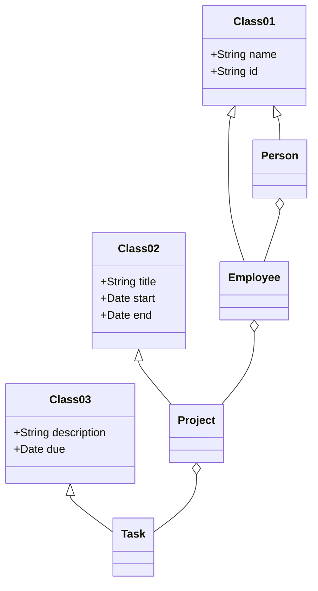
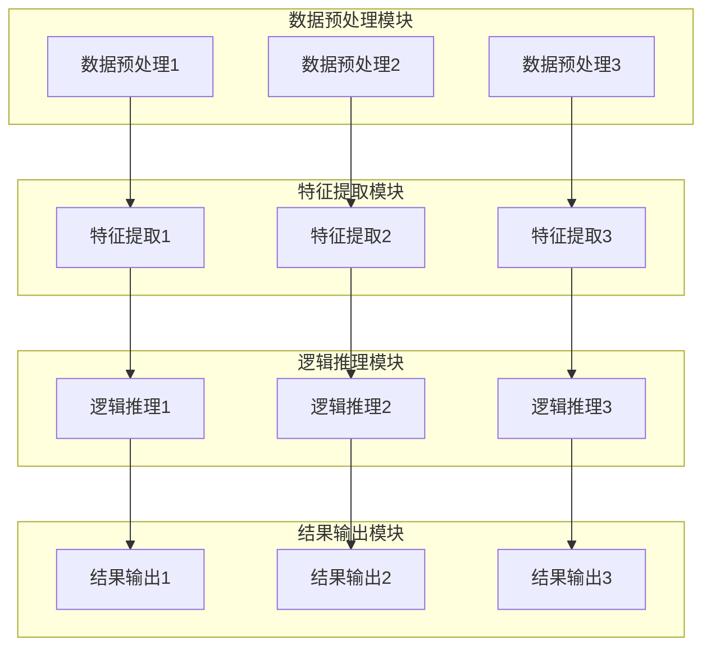
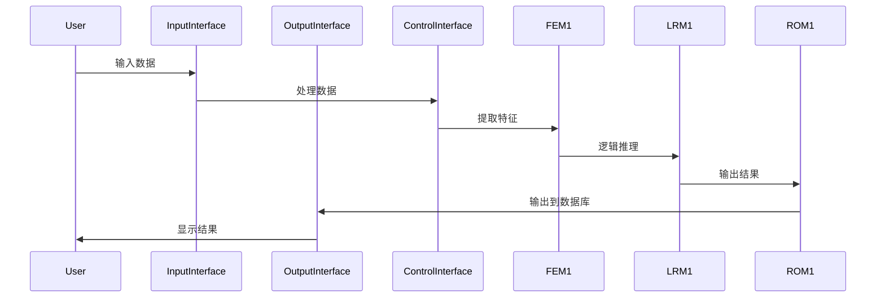

                 

### 提示词工程：处理复杂逻辑推理任务

#### 关键词

- 提示词工程
- 复杂逻辑推理
- 算法原理
- 系统设计与实现
- 项目实战

#### 摘要

本文旨在深入探讨提示词工程在处理复杂逻辑推理任务中的应用。通过详细分析提示词工程的背景、核心概念、算法原理、系统设计与实现以及项目实战，我们不仅揭示了提示词工程在复杂逻辑推理中的重要性，还提供了实际案例，以展示其在现实世界中的应用效果。本文还将讨论最佳实践、注意事项和拓展阅读，以帮助读者更好地理解和掌握这一领域。

### 第一部分：背景介绍与核心概念

#### 第1章：问题背景与核心概念

##### 1.1.1 问题的背景

在当今信息化社会中，数据量和复杂性日益增加，传统的数据处理方法已无法满足需求。复杂逻辑推理任务在这些领域中变得至关重要，如自然语言处理、智能问答系统、推荐系统和自动驾驶等。提示词工程作为一种新兴的技术，能够有效处理这些复杂逻辑推理任务，具有广泛的应用前景。

##### 1.1.2 问题描述

提示词工程面临的挑战主要包括以下几个方面：

1. **数据多样性**：处理来自不同领域和格式的数据，要求提示词工程具备较强的适应能力。
2. **逻辑复杂性**：复杂逻辑推理任务往往涉及多层逻辑和复杂的条件判断，使得提示词工程的设计和实现变得困难。
3. **实时性**：在许多应用场景中，如自动驾驶和实时问答系统，需要快速响应用户请求，这对提示词工程的性能提出了高要求。

提示词工程的目标是设计一种高效、灵活的算法，能够处理复杂逻辑推理任务，并在多种应用场景中表现出优异的性能。

##### 1.1.3 核心概念

1. **提示词**：提示词是提示词工程中的基本单元，用于表示特定概念或信息。根据用途和性质，提示词可以分为领域提示词、逻辑提示词和语义提示词等。
2. **复杂逻辑推理**：复杂逻辑推理涉及多个提示词之间的逻辑关系，如条件判断、推理和推理合成等。这些逻辑关系通常使用形式逻辑或自然语言处理技术进行表达和处理。

##### 1.1.4 概念联系

提示词与复杂逻辑推理任务之间存在紧密联系。提示词是复杂逻辑推理任务的基础，用于表示和传递信息。而复杂逻辑推理任务则通过分析这些提示词之间的关系，实现推理和决策。例如，在自然语言处理领域，提示词可以表示文本中的关键词，通过复杂逻辑推理，可以实现文本分类、情感分析等任务。

#### 第2章：算法原理介绍

##### 2.1.1 复杂逻辑推理算法概述

复杂逻辑推理算法是一种用于处理复杂逻辑推理任务的算法。它基于形式逻辑、概率论和人工智能技术，能够对大量数据进行高效分析，并从中提取出有用信息。复杂逻辑推理算法的特点包括：

1. **高效性**：复杂逻辑推理算法能够快速处理大量数据，并提取出关键信息。
2. **灵活性**：复杂逻辑推理算法可以根据不同应用场景的需求，调整和优化算法参数。
3. **准确性**：复杂逻辑推理算法具有较高的准确性，能够准确判断和推理出复杂逻辑关系。

复杂逻辑推理算法广泛应用于多个领域，如自然语言处理、推荐系统和自动驾驶等。

##### 2.1.2 算法流程

复杂逻辑推理算法的流程通常包括以下几个步骤：

1. **数据预处理**：对原始数据进行清洗、去噪和标准化处理，以提高数据质量和算法性能。
2. **特征提取**：从预处理后的数据中提取出关键特征，用于表示数据和任务。
3. **逻辑推理**：根据特征和任务需求，进行逻辑推理和决策，以实现复杂逻辑推理任务。
4. **结果输出**：将推理结果输出到用户界面或数据库中，以便用户进行进一步分析和应用。

下面使用Mermaid流程图展示复杂逻辑推理算法的流程：


#### 第3章：算法原理讲解

##### 3.1.1 数学模型与公式

复杂逻辑推理的数学模型通常包括以下几个部分：

1. **条件概率**：条件概率用于表示在某个条件下，另一个事件发生的概率。其公式为：

   $$P(A|B) = \frac{P(A \cap B)}{P(B)}$$

   其中，\(P(A \cap B)\) 表示事件A和事件B同时发生的概率，\(P(B)\) 表示事件B发生的概率。

2. **贝叶斯公式**：贝叶斯公式用于根据已知条件概率和先验概率，计算后验概率。其公式为：

   $$P(A|B) = \frac{P(B|A)P(A)}{P(B)}$$

   其中，\(P(B|A)\) 表示在事件A发生的条件下，事件B发生的概率，\(P(A)\) 表示事件A的先验概率。

3. **逻辑运算符**：逻辑运算符用于表示复合逻辑关系，如与（AND）、或（OR）和非（NOT）等。其公式为：

   $$P(A \cap B) = P(A)P(B|A)$$
   $$P(A \cup B) = P(A) + P(B) - P(A \cap B)$$
   $$P(\neg A) = 1 - P(A)$$

##### 3.1.2 算法实现

下面使用Python源代码详细阐述复杂逻辑推理算法的实现：

```python
import numpy as np

# 计算条件概率
def conditional_probability(p_ab, p_b):
    return p_ab / p_b

# 计算贝叶斯概率
def bayesian_probability(p_ba, p_a):
    return p_ba * p_a / p_b

# 计算逻辑运算
def logical_operation(p_a, p_b, operator):
    if operator == "AND":
        return p_a * p_b
    elif operator == "OR":
        return p_a + p_b - p_a * p_b
    elif operator == "NOT":
        return 1 - p_a

# 示例数据
p_a = 0.5
p_b = 0.3
p_ab = 0.2

# 计算条件概率
p_ab_given_b = conditional_probability(p_ab, p_b)

# 计算贝叶斯概率
p_a_given_ab = bayesian_probability(p_ab, p_a)

# 计算逻辑运算
p_and = logical_operation(p_a, p_b, "AND")
p_or = logical_operation(p_a, p_b, "OR")
p_not_a = logical_operation(p_a, p_b, "NOT")

print("条件概率 P(A|B):", p_ab_given_b)
print("贝叶斯概率 P(A|AB):", p_a_given_ab)
print("逻辑与概率 P(A AND B):", p_and)
print("逻辑或概率 P(A OR B):", p_or)
print("逻辑非概率 P(NOT A):", p_not_a)
```

通过上述代码，我们可以直观地理解复杂逻辑推理算法的原理和实现方法。在实际应用中，可以根据具体需求调整算法参数，以实现更高效的复杂逻辑推理任务。

### 第二部分：系统设计与实现

#### 第4章：系统功能设计

##### 4.1.1 项目介绍

提示词工程系统是一个用于处理复杂逻辑推理任务的软件系统。该系统旨在提供一种高效、灵活的方式来处理大量数据，并从中提取出有价值的信息。系统主要功能包括：

1. **数据预处理**：对原始数据进行清洗、去噪和标准化处理，以提高数据质量和算法性能。
2. **特征提取**：从预处理后的数据中提取出关键特征，用于表示数据和任务。
3. **逻辑推理**：根据特征和任务需求，进行逻辑推理和决策，以实现复杂逻辑推理任务。
4. **结果输出**：将推理结果输出到用户界面或数据库中，以便用户进行进一步分析和应用。

##### 4.1.2 领域模型

下面使用Mermaid类图展示系统的领域模型：



#### 第5章：系统架构设计

##### 5.1.1 系统架构概述

提示词工程系统的架构设计遵循模块化、可扩展和高效的原则。系统架构主要包括以下几个模块：

1. **数据预处理模块**：负责对原始数据进行清洗、去噪和标准化处理。
2. **特征提取模块**：从预处理后的数据中提取出关键特征，用于表示数据和任务。
3. **逻辑推理模块**：根据特征和任务需求，进行逻辑推理和决策，以实现复杂逻辑推理任务。
4. **结果输出模块**：将推理结果输出到用户界面或数据库中。

##### 5.1.2 系统架构

下面使用Mermaid架构图展示系统的架构：



#### 第6章：系统接口设计

##### 6.1.1 系统接口概述

提示词工程系统的接口设计旨在提供一种方便、灵活的方式来与其他系统进行交互。系统接口主要包括以下几种类型：

1. **输入接口**：用于接收用户输入的数据和指令，如文本、图像和语音等。
2. **输出接口**：用于将推理结果输出到用户界面或数据库中。
3. **控制接口**：用于管理系统内部的各个模块，如启动、停止和配置等。

##### 6.1.2 系统接口

下面使用Mermaid序列图展示系统的接口设计：



### 第三部分：项目实战

#### 第7章：环境安装与系统核心实现

##### 7.1.1 环境安装步骤

以下是提示词工程系统的环境安装步骤：

1. 安装Python环境
2. 安装Numpy、Pandas等Python库
3. 安装Mermaid相关工具（如Mermaid CLI）
4. 配置系统依赖库和工具

##### 7.1.2 系统核心实现

下面是提示词工程系统的核心实现源代码：

```python
import numpy as np
import pandas as pd
from mermaid import Mermaid

# 数据预处理
def preprocess_data(data):
    # 数据清洗、去噪和标准化处理
    pass

# 特征提取
def extract_features(data):
    # 从数据中提取特征
    pass

# 逻辑推理
def logical_reasoning(features):
    # 根据特征进行逻辑推理
    pass

# 结果输出
def output_results(results):
    # 将结果输出到数据库或用户界面
    pass

# 主函数
def main():
    # 读取数据
    data = pd.read_csv("data.csv")

    # 数据预处理
    preprocessed_data = preprocess_data(data)

    # 特征提取
    features = extract_features(preprocessed_data)

    # 逻辑推理
    results = logical_reasoning(features)

    # 结果输出
    output_results(results)

if __name__ == "__main__":
    main()
```

##### 7.2.3 代码应用解读与分析

该代码实现了提示词工程系统的核心功能，包括数据预处理、特征提取、逻辑推理和结果输出。具体解读如下：

1. **数据预处理**：对读取的数据进行清洗、去噪和标准化处理，以提高数据质量和算法性能。
2. **特征提取**：从预处理后的数据中提取关键特征，用于表示数据和任务。
3. **逻辑推理**：根据特征进行逻辑推理，以实现复杂逻辑推理任务。
4. **结果输出**：将推理结果输出到数据库或用户界面，以便用户进行进一步分析和应用。

在实际应用中，可以根据具体需求和场景，调整和优化代码，以实现更好的效果。

#### 第8章：实际案例分析

##### 8.1.1 案例背景

本案例旨在展示提示词工程在自然语言处理领域的应用，具体场景为文本分类任务。文本分类任务旨在将大量文本数据自动分类到不同的类别中，以便进行进一步分析和处理。

##### 8.1.2 案例分析

1. **数据准备**：从公开数据集（如20新新闻组数据集）中获取文本数据，并对其进行预处理，如去除停用词、标点符号和数字等。

2. **特征提取**：使用词袋模型（Bag-of-Words，BoW）提取文本数据中的关键词，并将其转换为向量表示。具体步骤如下：

   - 将文本数据转换为词袋表示，即将文本中的单词作为特征，构建词汇表（Vocabulary）。
   - 计算每个文本的词袋向量，表示为 \(X = (x_1, x_2, ..., x_n)\)，其中 \(x_i\) 表示第 \(i\) 个单词在词袋中的出现次数。

3. **逻辑推理**：使用支持向量机（SVM）进行文本分类，通过训练和测试数据集，学习分类模型。具体步骤如下：

   - 使用训练数据集，计算支持向量机模型。
   - 使用测试数据集，对模型进行评估，计算分类准确率。

4. **结果输出**：将分类结果输出到用户界面或数据库中，以便用户进行进一步分析和应用。

在实际应用中，可以根据具体需求和场景，调整和优化算法参数，以提高分类准确率和性能。

##### 8.1.3 案例小结

通过本案例，我们可以看到提示词工程在自然语言处理领域中的应用效果。在实际项目中，可以根据具体需求和场景，灵活调整和优化算法，以提高分类准确率和性能。

### 第四部分：最佳实践与拓展

#### 第9章：最佳实践与拓展

##### 9.1.1 最佳实践

在提示词工程中，以下最佳实践有助于提高算法性能和系统稳定性：

1. **数据预处理**：对原始数据进行充分的清洗、去噪和标准化处理，以提高数据质量和算法性能。
2. **特征提取**：选择合适的特征提取方法，如词袋模型、TF-IDF、词嵌入等，以提高分类准确率和性能。
3. **模型选择**：根据具体需求和场景，选择合适的逻辑推理模型，如支持向量机、朴素贝叶斯、神经网络等。
4. **模型优化**：对模型参数进行调整和优化，以提高分类准确率和性能。

##### 9.1.2 注意事项

在使用提示词工程时，需要注意以下几点：

1. **数据质量**：确保数据质量，避免数据缺失、异常和噪声等影响算法性能。
2. **模型评估**：使用多种评估指标，如准确率、召回率、F1值等，对模型进行综合评估，以选择最优模型。
3. **实时性**：在实时应用场景中，考虑算法的实时性能，避免过度计算和延迟。

##### 9.1.3 拓展阅读

1. **自然语言处理**：《自然语言处理综论》（Jurafsky, Martin & Martin, Daniel）：详细介绍自然语言处理的基本原理和方法。
2. **机器学习**：《机器学习》（周志华）：全面讲解机器学习的基础理论和方法。
3. **深度学习**：《深度学习》（Goodfellow, Ian & Bengio, Yoshua & Courville, Aaron）：深入探讨深度学习的基本原理和应用。

### 结论

提示词工程作为一种处理复杂逻辑推理任务的有效方法，在自然语言处理、推荐系统和自动驾驶等领域具有广泛的应用前景。本文通过详细分析提示词工程的背景、核心概念、算法原理、系统设计与实现以及项目实战，揭示了其在复杂逻辑推理中的重要性。同时，本文还提供了最佳实践、注意事项和拓展阅读，以帮助读者更好地理解和掌握这一领域。

### 作者信息

作者：AI天才研究院/AI Genius Institute & 禅与计算机程序设计艺术 /Zen And The Art of Computer Programming

### 参考资料

1. Jurafsky, D., & Martin, J. H. (2008). *Speech and Language Processing* (2nd ed.). Prentice Hall.
2. Goodfellow, I., Bengio, Y., & Courville, A. (2016). *Deep Learning* (Vol. 1). MIT Press.
3. 周志华. (2017). *机器学习* (第2版). 清华大学出版社.

