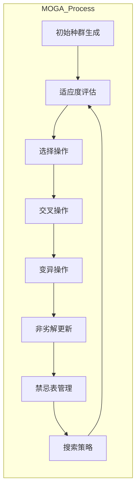
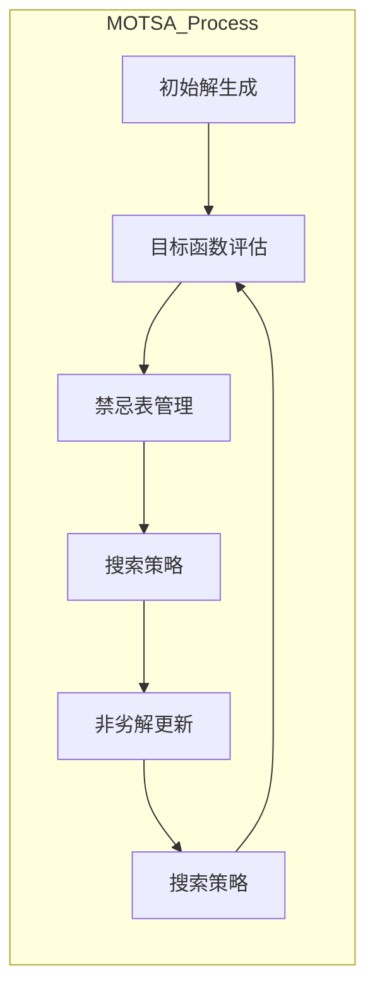
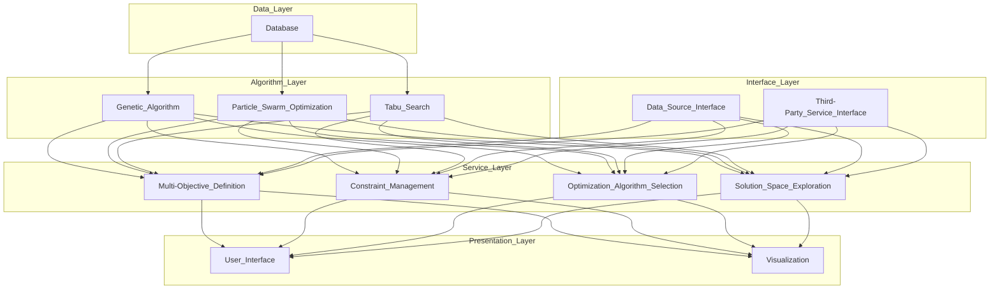

                 

### 第一部分：问题背景与核心概念

#### 第1章：问题背景介绍

##### 1.1 问题背景

多目标优化问题（Multi-Objective Optimization Problem）是优化问题中的一种重要类型，它涉及到在多个相互冲突的目标函数之间寻找平衡解。这种类型的问题在许多实际应用领域中都有广泛的应用，如工程设计、资源分配、交通管理、生物信息学、金融投资等。

#### 1.1.1 多目标优化问题的现实意义

在现代社会，许多决策过程都需要同时考虑多个目标，例如，在工程设计中，设计者可能需要在满足结构强度和成本目标的同时，还要兼顾美观性和可维护性；在资源分配中，决策者需要在最大化效用和最小化成本之间找到平衡点。这种多目标优化的需求，使得多目标优化问题的解决变得尤为重要。

#### 1.1.2 多目标优化问题的定义与特点

多目标优化问题可以形式化地定义为：给定一组目标函数 \( f_1(x), f_2(x), ..., f_m(x) \)，其中 \( x \) 是决策变量，目标是在满足一组约束条件 \( g_1(x) \leq 0, g_2(x) \leq 0, ..., g_h(x) = 0 \) 下，找到 \( x \) 的值，使得所有目标函数的值都尽可能好。

多目标优化问题的特点包括：
1. **目标冲突性**：不同目标之间可能存在冲突，很难找到一个同时满足所有目标的“最优”解。
2. **非凸性**：目标函数和约束条件可能不是凸函数或凸集，这使得问题求解更为复杂。
3. **多解性**：由于目标冲突性和非凸性，多目标优化问题通常有多个非劣解（Pareto最优解）。
4. **连续性与离散性**：决策变量可以是连续的（如浮点数）或离散的（如整数或二进制变量）。

#### 1.1.3 多目标优化问题的常见应用场景

多目标优化问题在许多应用场景中都有广泛的应用，以下是一些典型的例子：
- **工程设计**：在机械、航空航天、汽车等行业中，设计者需要在成本、性能、可靠性等多个方面进行优化。
- **资源分配**：在能源、交通、物流等领域，需要在最大化效用和最小化成本之间进行优化。
- **环境科学**：在气候变化、水资源管理、生态系统保护等方面，需要在多个环境目标之间进行平衡。
- **经济管理**：在金融投资、项目管理、供应链管理等领域，需要考虑多个经济目标和风险。

##### 1.2 核心概念介绍

#### 1.2.1 多目标优化问题的基本要素

多目标优化问题包括以下几个基本要素：
1. **决策变量**：这些变量是优化问题中的可变因素，用于描述系统的状态。
2. **目标函数**：这些函数描述了问题的目标，通常是需要优化的量。
3. **约束条件**：这些条件规定了决策变量的取值范围，以确保解的可行性。
4. **解空间**：这是所有可能的决策变量组合的集合，解空间的大小取决于决策变量的数量和类型。

#### 1.2.2 多目标优化问题的解决策略

解决多目标优化问题的策略通常包括以下几种：
1. **Pareto优化**：找到一组非劣解，这些解不能被进一步改善而不牺牲其他目标。
2. **权重法**：为每个目标函数分配权重，然后找到一个权重组合，使得加权目标函数的值最优。
3. **目标规划**：通过将目标函数转化为约束条件，并将多个目标合并为一个单一的目标函数。
4. **多目标遗传算法**：利用遗传算法来搜索非劣解集合，通过适应度函数来评估解的质量。
5. **多目标粒子群优化**：基于粒子群优化算法，通过多个粒子的协作来寻找非劣解。

#### 1.2.3 多目标优化问题的边界与外延

多目标优化问题的边界在于其目标函数和约束条件，这些条件定义了问题的可行解空间。外延则包括不同的优化算法、不同的目标函数形式和不同的约束条件类型，这使得多目标优化问题具有广泛的适用性和多样性。

##### 1.3 多目标优化问题的挑战与机遇

#### 1.3.1 多目标优化问题的难点分析

多目标优化问题面临以下几个难点：
1. **非凸性**：目标函数和约束条件的非凸性使得问题求解变得复杂。
2. **目标冲突**：不同目标之间的冲突增加了寻找最优解的难度。
3. **多解性**：问题通常有多个非劣解，需要找到一组有代表性的解。
4. **计算效率**：求解大规模多目标优化问题需要高效的算法和计算资源。

#### 1.3.2 多目标优化问题的应用前景

尽管多目标优化问题具有挑战性，但其应用前景广阔：
1. **智能决策支持**：多目标优化可用于支持复杂决策，提高决策的科学性和准确性。
2. **自动化优化**：随着人工智能和机器学习技术的发展，多目标优化算法可以自动化执行，降低人类劳动成本。
3. **工业应用**：在制造业、能源、交通等行业，多目标优化可以优化生产流程、降低成本、提高效率。
4. **环境与可持续发展**：在环境保护和可持续发展领域，多目标优化可以帮助制定更加合理的政策和管理策略。

##### 1.4 本章小结

本章首先介绍了多目标优化问题的背景和现实意义，接着定义了问题的核心概念和特点，分析了常见的应用场景。随后，详细介绍了多目标优化问题的基本要素、解决策略以及其边界与外延。最后，讨论了多目标优化问题的难点和应用前景。通过对这些内容的介绍，读者可以初步了解多目标优化问题的概念和重要性。

---

### 第二部分：核心概念与联系

#### 第2章：核心概念原理与属性特征对比

##### 2.1 多目标优化问题的概念解析

##### 2.1.1 多目标优化问题的核心概念

多目标优化问题的核心概念包括决策变量、目标函数、约束条件和解空间。这些概念是理解多目标优化问题的基础。

- **决策变量**：决策变量是多目标优化问题的核心，它们是问题中的可变因素，用于描述系统的状态。例如，在资源分配问题中，决策变量可能包括资源的数量、分配策略等。

- **目标函数**：目标函数是优化问题的目标，它们是评估解的质量的标准。在多目标优化问题中，通常有多个目标函数，这些目标函数可能存在冲突，需要通过优化算法找到平衡。

- **约束条件**：约束条件是多目标优化问题中限制决策变量取值范围的条件。这些条件确保了问题的解是可行的，并且符合实际情况。

- **解空间**：解空间是多目标优化问题中所有可能的决策变量组合的集合。解空间的大小取决于决策变量的数量和类型。

##### 2.1.2 多目标优化问题的属性特征对比表

为了更好地理解多目标优化问题的特性，我们可以通过一个对比表格来展示其关键属性特征：

| 特性         | 说明                                                         | 对比               |
| ------------ | ------------------------------------------------------------ | ----------------- |
| **非凸性**   | 目标函数和约束条件可能不是凸函数或凸集                         | 单目标优化问题通常为凸问题 |
| **多解性**   | 由于目标冲突性和非凸性，通常存在多个非劣解                     | 单目标优化问题通常有唯一最优解 |
| **目标冲突** | 不同目标之间可能存在冲突，难以同时满足所有目标                 | 单目标优化问题目标单一，不存在冲突 |
| **连续性与离散性** | 决策变量可以是连续的（如浮点数）或离散的（如整数或二进制变量） | 单目标优化问题决策变量通常连续 |
| **计算复杂度** | 随着决策变量和目标函数数量的增加，计算复杂度急剧上升           | 单目标优化问题相对简单 |

通过这个对比表格，我们可以看出多目标优化问题与单目标优化问题在多个方面的差异，这为我们理解和处理多目标优化问题提供了重要的参考。

##### 2.2 多目标优化问题的解决策略

##### 2.2.1 多目标优化问题的解决方法分类

解决多目标优化问题的方法可以分为几大类，每种方法都有其独特的优缺点：

1. **Pareto优化**：
   - **原理**：Pareto优化旨在找到一组非劣解（Pareto前沿），这些解不能被进一步改善而不牺牲其他目标。
   - **优点**：可以生成多个解，提供决策者选择的空间。
   - **缺点**：计算量大，对非凸性和多峰目标函数的处理困难。

2. **权重法**：
   - **原理**：为每个目标函数分配权重，将多目标优化问题转化为单目标优化问题。
   - **优点**：简单易行，适用于目标函数相似的情况。
   - **缺点**：权重的选择对结果影响很大，可能无法很好地处理目标冲突。

3. **目标规划**：
   - **原理**：将目标函数转化为约束条件，并通过线性规划或整数规划求解。
   - **优点**：可以处理复杂的目标函数和约束条件。
   - **缺点**：可能产生非整数解，对大规模问题的处理效率较低。

4. **多目标遗传算法**：
   - **原理**：基于遗传算法，通过交叉、变异和选择操作搜索非劣解集合。
   - **优点**：适用于复杂、大规模和离散型问题。
   - **缺点**：需要较长的运行时间，初始参数选择对结果有较大影响。

5. **多目标粒子群优化**：
   - **原理**：基于粒子群优化算法，通过多个粒子的协作来寻找非劣解。
   - **优点**：实现简单，收敛速度快。
   - **缺点**：对目标冲突的处理效果不如遗传算法。

##### 2.2.2 各类解决策略的优缺点分析

各类解决策略在处理多目标优化问题时各有优缺点，具体如下：

- **Pareto优化**：
  - **优点**：能够提供一组非劣解，决策者可以根据自己的偏好选择最优解。
  - **缺点**：计算复杂度高，特别是在目标函数数量较多且非凸时。

- **权重法**：
  - **优点**：简单易行，计算速度快。
  - **缺点**：权重的选择对结果影响很大，可能无法很好地处理目标冲突。

- **目标规划**：
  - **优点**：能够处理复杂的目标函数和约束条件。
  - **缺点**：可能产生非整数解，对大规模问题的处理效率较低。

- **多目标遗传算法**：
  - **优点**：适用于复杂、大规模和离散型问题，具有较强的鲁棒性。
  - **缺点**：需要较长的运行时间，初始参数选择对结果有较大影响。

- **多目标粒子群优化**：
  - **优点**：实现简单，收敛速度快，适用于目标函数数量较少的问题。
  - **缺点**：对目标冲突的处理效果不如遗传算法，对大规模问题的处理能力有限。

通过对比分析，我们可以看到每种解决策略都有其适用范围和局限性。在实际应用中，选择合适的解决策略需要根据问题的具体特点和需求进行综合考虑。

##### 2.3 多目标优化问题的概念联系

##### 2.3.1 多目标优化问题的概念体系架构

多目标优化问题的概念体系架构可以概括为以下几个层次：

1. **决策变量层**：这是最底层，包括所有可能的决策变量，用于描述问题的状态。

2. **目标函数层**：位于决策变量之上，包括多个目标函数，这些函数描述了问题的优化目标。

3. **约束条件层**：位于目标函数层之上，包括所有约束条件，用于限制决策变量的取值范围。

4. **解空间层**：位于约束条件层之上，包括所有可能的决策变量组合，构成问题的解空间。

5. **优化算法层**：位于解空间层之上，包括用于求解多目标优化问题的各种算法，如Pareto优化、遗传算法、粒子群优化等。

6. **结果评估层**：位于优化算法层之上，用于评估解的质量，生成非劣解集。

通过这些层次的联系，我们可以清晰地理解多目标优化问题的整体架构和运行机制。

##### 2.3.2 多目标优化问题的ER实体关系图

为了更好地展示多目标优化问题的实体关系，我们可以使用ER（Entity-Relationship）图来描述。

在多目标优化问题的ER图中，主要包括以下实体：

- **决策变量（Decision Variable）**：表示问题的可变因素。
- **目标函数（Objective Function）**：表示优化问题的目标。
- **约束条件（Constraint）**：表示问题的限制条件。
- **解（Solution）**：表示满足约束条件的决策变量组合。
- **非劣解（Pareto Optimal Solution）**：表示一组不能被进一步改善而不牺牲其他目标的解。

ER图中的主要关系包括：

- **决策变量**与**目标函数**之间存在一对多的关系，即一个决策变量可能影响多个目标函数。
- **决策变量**与**约束条件**之间存在一对多的关系，即一个决策变量可能受到多个约束条件的限制。
- **目标函数**与**非劣解**之间存在多对多的关系，即一个目标函数可能有多个非劣解，一个非劣解可能满足多个目标函数。
- **约束条件**与**解**之间存在多对多的关系，即一个约束条件可能影响多个解，一个解可能违反多个约束条件。

以下是一个简单的ER图示例：

```mermaid
erDiagram
  DecisionVariable ||--|{ ObjectiveFunction }|| Solution
  DecisionVariable ||--|{ Constraint }|| Solution
  ObjectiveFunction ||--|{ Solution }|| NonOptimalSolution
  Constraint ||--|{ Solution }|| NonOptimalSolution
```

通过ER图，我们可以更直观地理解多目标优化问题中的各个实体及其关系，这有助于我们分析和设计优化算法。

##### 2.4 本章小结

本章首先介绍了多目标优化问题的核心概念，包括决策变量、目标函数、约束条件和解空间。接着，通过对比表格展示了多目标优化问题与单目标优化问题的属性特征差异。随后，详细分析了多目标优化问题的解决策略，包括Pareto优化、权重法、目标规划、多目标遗传算法和多目标粒子群优化。最后，本章通过ER图展示了多目标优化问题的实体关系，有助于读者更好地理解其概念和结构。通过本章的内容，读者可以全面了解多目标优化问题的核心概念和联系，为后续的算法原理讲解和系统设计打下基础。

---

### 第三部分：算法原理讲解

#### 第3章：多目标优化算法原理与流程图

##### 3.1 多目标优化算法概述

##### 3.1.1 多目标优化算法的定义

多目标优化算法是一类用于求解多目标优化问题的方法，其目的是在满足一组约束条件的情况下，找到一组决策变量，使得多个目标函数的值尽可能好。多目标优化算法的核心在于处理多个目标之间的冲突，并生成一组非劣解（Pareto最优解），这些解能够提供决策者选择的空间。

##### 3.1.2 多目标优化算法的分类

多目标优化算法可以根据不同的原则和方法进行分类，常见的分类方法包括：

1. **基于Pareto优化的算法**：这类算法的核心是生成Pareto前沿，即一组不能被进一步改善而不牺牲其他目标的解。常见的算法包括多目标粒子群优化（MOPSO）、多目标遗传算法（MOGA）等。

2. **基于权重法的算法**：这类算法通过为每个目标函数分配权重，将其转化为单目标优化问题。常见的算法包括加权目标函数优化、加权多目标规划等。

3. **基于目标规划的算法**：这类算法将目标函数转化为约束条件，通过求解线性规划或整数规划问题来找到最优解。常见的算法包括目标规划方法（Goal Programming）等。

4. **基于进化算法的算法**：这类算法基于自然进化原理，通过遗传操作（如交叉、变异、选择）来搜索最优解。常见的算法包括多目标遗传算法（MOGA）、多目标粒子群优化（MOPSO）等。

##### 3.2 多目标优化算法原理讲解

##### 3.2.1 常见多目标优化算法原理

以下我们将详细讲解几种常见的多目标优化算法的原理：

###### 3.2.1.1 多目标粒子群优化（MOPSO）

多目标粒子群优化（MOPSO）是基于标准粒子群优化（PSO）算法的改进版本。在MOPSO中，每个粒子都代表一个可能的解，并且每个粒子都有多个目标函数值。通过迭代更新粒子的位置和速度，算法试图找到一组非劣解。

- **位置更新**：每个粒子的位置由其在解空间中的坐标表示，更新规则如下：
  $$ x_{i}^{t+1} = x_{i}^{t} + v_{i}^{t+1} $$
  其中，\( x_{i}^{t} \) 表示第 \( i \) 个粒子在当前迭代 \( t \) 的位置，\( v_{i}^{t+1} \) 表示第 \( i \) 个粒子在 \( t+1 \) 迭代的速度。

- **速度更新**：粒子的速度更新规则如下：
  $$ v_{i}^{t+1} = w \cdot v_{i}^{t} + c_1 \cdot r_1 \cdot (p_{i}^{t} - x_{i}^{t}) + c_2 \cdot r_2 \cdot (g_{best}^{t} - x_{i}^{t}) $$
  其中，\( w \) 是惯性权重，\( c_1 \) 和 \( c_2 \) 是学习因子，\( r_1 \) 和 \( r_2 \) 是随机数，\( p_{i}^{t} \) 是第 \( i \) 个粒子的个体历史最优位置，\( g_{best}^{t} \) 是全局最优位置。

- **非劣解更新**：每次迭代后，根据当前粒子的目标函数值更新个体最优和全局最优位置。

- **选择操作**：在选择操作中，选择那些能够提供更好解的粒子。

###### 3.2.1.2 多目标遗传算法（MOGA）

多目标遗传算法（MOGA）是基于标准遗传算法（GA）的多目标扩展。在MOGA中，每个个体都代表一个可能的解，并且每个个体都有多个目标函数值。通过遗传操作（如交叉、变异、选择）来生成新的解，并逐步收敛到非劣解集。

- **初始种群生成**：随机生成初始种群，每个个体代表一个可能的解。

- **适应度评估**：评估每个个体的适应度，适应度通常是基于目标函数值的综合评价。

- **选择操作**：使用选择操作（如轮盘赌选择、锦标赛选择）选择适应度较高的个体进行交叉和变异。

- **交叉操作**：选择两个父个体，通过交叉操作生成两个新的子个体。

- **变异操作**：对个体进行随机变异，产生新的个体。

- **非劣解更新**：根据每个个体的目标函数值，更新非劣解集。

- **种群的更新**：通过选择、交叉和变异操作，生成新的种群。

###### 3.2.1.3 多目标禁忌搜索算法（MOTSA）

多目标禁忌搜索算法（MOTSA）是基于标准禁忌搜索（TS）算法的多目标扩展。在MOTSA中，通过禁忌表记录已经访问过的解，避免重复搜索，同时利用多个目标函数值来指导搜索方向。

- **初始解生成**：随机生成初始解。

- **目标函数评估**：评估当前解的目标函数值，确定解的优劣。

- **禁忌表管理**：根据禁忌规则，更新禁忌表，避免重复搜索。

- **搜索策略**：使用多个目标函数值来选择下一步的搜索方向，例如，通过Pareto排序选择下一个解。

- **非劣解更新**：根据当前解的目标函数值，更新非劣解集。

##### 3.3 多目标优化算法流程图

为了更直观地理解这些多目标优化算法，我们可以使用Mermaid流程图来展示它们的迭代过程和主要步骤。

###### 3.3.1 多目标粒子群优化流程图

以下是一个简单的MOPSO算法流程图：

```mermaid
flowchart LR
  subgraph MOPSO_Process
    i1[初始化] --> o1[目标函数评估]
    o1 --> c1[更新个体最优位置]
    c1 --> c2[更新全局最优位置]
    c2 --> c3[更新速度和位置]
    c3 --> o2[判断停止条件]
    o2 --> {是} --> e1[结束]
    o2 --> {否} --> o1
  end
```

###### 3.3.2 多目标遗传算法流程图

以下是一个简单的MOGA算法流程图：



###### 3.3.3 多目标禁忌搜索算法流程图

以下是一个简单的MOTSA算法流程图：



通过这些流程图，我们可以清晰地看到每种多目标优化算法的迭代过程和主要步骤，有助于我们理解和实现这些算法。

##### 3.4 算法原理的数学模型和公式

为了更好地理解多目标优化算法的工作原理，我们可以使用数学模型和公式来描述它们的关键步骤。

###### 3.4.1 多目标优化算法数学模型

多目标优化问题的数学模型可以表示为：

$$
\begin{align*}
\text{minimize} \quad & f_1(x), f_2(x), ..., f_m(x) \\
\text{subject to} \quad & g_1(x) \leq 0, g_2(x) \leq 0, ..., g_h(x) = 0
\end{align*}
$$

其中，\( x \) 是决策变量向量，\( f_1(x), f_2(x), ..., f_m(x) \) 是目标函数向量，\( g_1(x), g_2(x), ..., g_h(x) \) 是约束条件。

###### 3.4.2 多目标优化算法公式

以下是几种常见多目标优化算法的核心公式：

**多目标粒子群优化（MOPSO）**：

1. **位置更新公式**：
   $$
   x_{i}^{t+1} = x_{i}^{t} + v_{i}^{t+1}
   $$

2. **速度更新公式**：
   $$
   v_{i}^{t+1} = w \cdot v_{i}^{t} + c_1 \cdot r_1 \cdot (p_{i}^{t} - x_{i}^{t}) + c_2 \cdot r_2 \cdot (g_{best}^{t} - x_{i}^{t})
   $$

3. **个体最优位置更新公式**：
   $$
   p_{i}^{t+1} = 
   \begin{cases} 
   x_{i}^{t} & \text{if } f(x_{i}^{t+1}) < f(p_{i}^{t}) \\
   p_{i}^{t} & \text{otherwise} 
   \end{cases}
   $$

4. **全局最优位置更新公式**：
   $$
   g_{best}^{t+1} = 
   \begin{cases} 
   x_{i}^{t+1} & \text{if } f(x_{i}^{t+1}) < f(g_{best}^{t}) \\
   g_{best}^{t} & \text{otherwise} 
   \end{cases}
   $$

**多目标遗传算法（MOGA）**：

1. **适应度评估公式**：
   $$
   f(x) = \frac{1}{\sum_{i=1}^{m} \alpha_i \cdot f_i(x)}
   $$

   其中，\( \alpha_i \) 是第 \( i \) 个目标函数的权重。

2. **选择操作概率公式**：
   $$
   p_{i}^{s} = \frac{f(x_{i})}{\sum_{j=1}^{n} f(x_{j})}
   $$

3. **交叉操作概率公式**：
   $$
   p_{c} = \frac{f_{new}(x_{i}) - f_{old}(x_{i})}{f_{new}(x_{j}) - f_{old}(x_{j})}
   $$

4. **变异操作概率公式**：
   $$
   p_{m} = \frac{f_{new}(x_{i}) - f_{old}(x_{i})}{f_{new}(x_{j}) - f_{old}(x_{j})}
   $$

**多目标禁忌搜索算法（MOTSA）**：

1. **目标函数评估公式**：
   $$
   f(x) = \sum_{i=1}^{m} \omega_i \cdot f_i(x)
   $$

   其中，\( \omega_i \) 是第 \( i \) 个目标函数的权重。

2. **搜索方向选择公式**：
   $$
   \Delta f(x') = f(x') - f(x) = \sum_{i=1}^{m} \omega_i \cdot (f_i(x') - f_i(x))
   $$

3. **禁忌表更新公式**：
   $$
   T_{t+1} = T_{t} \cup \{ x_{t+1} \}
   $$

通过这些数学模型和公式，我们可以更深入地理解多目标优化算法的运行机制，为实际应用提供理论基础。

##### 3.5 算法举例说明

为了更好地理解这些多目标优化算法，我们可以通过具体的例子来说明它们的应用。

###### 3.5.1 多目标粒子群算法举例

假设我们有一个多目标优化问题，目标函数为最小化成本和最大化性能，约束条件为资源限制。我们可以使用MOPSO算法来求解。

- **决策变量**：资源数量。
- **目标函数**：成本和性能。
- **约束条件**：资源限制。

假设我们有以下目标函数和约束条件：

$$
\begin{align*}
\text{minimize} \quad & f_1(x) = C(x) \\
\text{maximize} \quad & f_2(x) = P(x) \\
\text{subject to} \quad & 0 \leq R(x) \leq R_{\text{max}}
\end{align*}
$$

其中，\( C(x) \) 是成本函数，\( P(x) \) 是性能函数，\( R(x) \) 是资源使用量，\( R_{\text{max}} \) 是资源上限。

我们随机生成一个初始种群，每个个体代表一组资源分配方案。通过迭代更新粒子的位置和速度，算法逐步寻找最优解。最终，我们得到一组非劣解，这些解在成本和性能之间找到了平衡点。

###### 3.5.2 多目标遗传算法举例

假设我们有一个多目标优化问题，目标函数为最小化时间、成本和最大化质量，约束条件为人员数量限制。我们可以使用MOGA算法来求解。

- **决策变量**：人员数量。
- **目标函数**：时间和成本。
- **约束条件**：人员数量。

假设我们有以下目标函数和约束条件：

$$
\begin{align*}
\text{minimize} \quad & f_1(x) = T(x) \\
\text{minimize} \quad & f_2(x) = C(x) \\
\text{maximize} \quad & f_3(x) = Q(x) \\
\text{subject to} \quad & 0 \leq P(x) \leq P_{\text{max}}
\end{align*}
$$

其中，\( T(x) \) 是时间函数，\( C(x) \) 是成本函数，\( Q(x) \) 是质量函数，\( P(x) \) 是人员数量，\( P_{\text{max}} \) 是人员上限。

我们随机生成初始种群，每个个体代表一种人员配置方案。通过迭代进行适应度评估、选择、交叉和变异操作，算法逐步生成新的解，并更新非劣解集。最终，我们得到一组非劣解，这些解在时间、成本和质量之间找到了平衡。

###### 3.5.3 多目标禁忌搜索算法举例

假设我们有一个多目标优化问题，目标函数为最小化运输成本和最大化客户满意度，约束条件为运输能力和时间限制。我们可以使用MOTSA算法来求解。

- **决策变量**：运输路线和运输量。
- **目标函数**：运输成本和客户满意度。
- **约束条件**：运输能力和时间限制。

假设我们有以下目标函数和约束条件：

$$
\begin{align*}
\text{minimize} \quad & f_1(x) = C(x) \\
\text{maximize} \quad & f_2(x) = S(x) \\
\text{subject to} \quad & C(x) \leq C_{\text{max}} \\
& T(x) \leq T_{\text{max}}
\end{align*}
$$

其中，\( C(x) \) 是运输成本函数，\( S(x) \) 是客户满意度函数，\( C_{\text{max}} \) 是运输成本上限，\( T_{\text{max}} \) 是运输时间上限。

我们随机生成初始解，通过迭代进行目标函数评估、禁忌表管理和搜索策略选择，算法逐步寻找最优解。最终，我们得到一组非劣解，这些解在成本和满意度之间找到了平衡。

通过这些具体的例子，我们可以看到多目标优化算法在实际问题中的应用效果，以及如何通过算法找到最优解。

##### 3.6 本章小结

本章首先介绍了多目标优化算法的基本原理和定义，接着详细讲解了几种常见的多目标优化算法，包括多目标粒子群优化、多目标遗传算法和多目标禁忌搜索算法。通过数学模型和公式，我们深入分析了这些算法的运行机制。随后，通过具体的例子展示了如何使用这些算法解决多目标优化问题。通过本章的内容，读者可以全面了解多目标优化算法的原理和应用，为后续的系统和项目实战打下基础。

---

### 第四部分：系统分析与架构设计

#### 第4章：多目标优化系统分析与架构设计

##### 4.1 问题场景介绍

在多目标优化系统的实际应用中，问题场景多种多样，涵盖了工程设计、资源分配、交通管理、生物信息学、金融投资等领域。以下将介绍两个典型的问题场景：

###### 4.1.1 多目标优化问题的实际应用场景

**1. 工程设计**

在工程设计中，多目标优化问题常用于优化结构设计，以满足多种性能要求。例如，一个桥梁设计项目需要在满足强度、耐久性、经济性、美观性等多个目标的同时，确保设计方案符合规范和实际需求。多目标优化算法可以帮助工程师找到一组平衡的解决方案，使得设计在多个方面达到最优。

**2. 资源分配**

在资源分配问题中，多目标优化广泛应用于能源、交通、物流等领域。例如，在电力系统中，需要优化发电资源分配，以最小化成本和最大化发电效率；在交通系统中，需要优化路线规划，以减少拥堵和最大化乘客满意度。多目标优化系统能够在考虑多种约束条件的同时，找到最优的资源分配方案。

###### 4.1.2 多目标优化问题的具体应用实例

**1. 能源系统优化**

在一个能源系统的优化项目中，目标是在满足能源需求的同时，最小化成本和最大化可再生能源的使用率。该项目的多目标优化问题包括以下目标函数和约束条件：

- **目标函数**：
  - \( f_1(x) \)：能源成本
  - \( f_2(x) \)：可再生能源使用率
  - \( f_3(x) \)：总发电量

- **约束条件**：
  - \( g_1(x) \)：电力需求
  - \( g_2(x) \)：可再生能源产量
  - \( g_3(x) \)：发电设备容量限制

多目标优化系统能够在满足这些约束条件的同时，找到最优的能源分配方案，以实现成本最小化和能源高效利用。

**2. 物流配送优化**

在物流配送中，多目标优化问题用于优化配送路线和资源分配，以提高配送效率和客户满意度。该项目的多目标优化问题包括以下目标函数和约束条件：

- **目标函数**：
  - \( f_1(x) \)：配送总成本
  - \( f_2(x) \)：配送时间
  - \( f_3(x) \)：客户满意度

- **约束条件**：
  - \( g_1(x) \)：车辆载重限制
  - \( g_2(x) \)：配送路线距离
  - \( g_3(x) \)：客户订单需求

通过多目标优化系统，物流公司可以在考虑多种约束条件的同时，找到最优的配送方案，以降低成本、缩短配送时间和提高客户满意度。

##### 4.2 系统功能设计

多目标优化系统的功能设计主要包括以下几个方面：

###### 4.2.1 多目标优化系统的功能需求

**1. 多目标定义与管理**  
系统能够定义多个目标函数，包括目标类型（最小化或最大化）、权重和目标值范围。

**2. 约束条件管理**  
系统能够定义和管理工作中的约束条件，包括线性、非线性约束以及逻辑约束。

**3. 优化算法选择**  
系统能够支持多种多目标优化算法，包括遗传算法、粒子群算法、禁忌搜索算法等，并提供算法参数调整功能。

**4. 解空间探索**  
系统能够探索解空间，生成非劣解集，并提供解的质量评估和可视化展示。

**5. 结果分析**  
系统能够对优化结果进行分析，包括解的统计信息、Pareto前沿、目标函数关系图等。

**6. 用户交互界面**  
系统应具备友好的用户交互界面，支持用户输入目标函数、约束条件、算法参数等，并提供操作指南和帮助文档。

###### 4.2.2 多目标优化系统的领域模型（Mermaid类图）

领域模型用于描述多目标优化系统的核心实体和关系。以下是一个简单的Mermaid类图示例：

```mermaid
classDiagram
  Class1[多目标定义] <|-- Class2[目标函数]
  Class1 <|-- Class3[约束条件]
  Class4[优化算法] <|-- Class2
  Class4 <|-- Class3
  Class2 <|-- Class5[解]
  Class3 <|-- Class5
  Class1 "1" -- "1" Class6[用户交互界面]
  Class5 "1" -- "1" Class6
```

- **多目标定义（Class1）**：包括目标函数和约束条件的管理。
- **目标函数（Class2）**：定义多个目标函数及其属性。
- **约束条件（Class3）**：定义多种约束条件及其属性。
- **优化算法（Class4）**：定义多种优化算法及其属性。
- **解（Class5）**：生成非劣解集及其属性。
- **用户交互界面（Class6）**：提供用户输入和结果展示功能。

通过领域模型，我们可以清晰地看到多目标优化系统的核心组件和它们之间的关系，为后续的系统架构设计提供参考。

##### 4.3 系统架构设计

多目标优化系统的架构设计旨在确保系统的可扩展性、灵活性和高效性，以满足不同的应用需求和优化算法。以下将介绍多目标优化系统的架构设计：

###### 4.3.1 多目标优化系统的架构设计

多目标优化系统的整体架构可以划分为以下几个层次：

- **数据层**：包括数据库和存储系统，用于存储目标函数、约束条件、解集等数据。
- **算法层**：包括多种多目标优化算法的实现，如遗传算法、粒子群优化、禁忌搜索等。
- **服务层**：包括核心业务逻辑和服务接口，如多目标定义、约束条件管理、优化算法选择、解空间探索等。
- **展示层**：包括用户交互界面和可视化模块，用于展示优化结果和分析图表。
- **接口层**：包括与外部系统的接口，如数据源接口、第三方服务接口等。

以下是一个简单的Mermaid架构图示例：



通过该架构设计，我们可以确保多目标优化系统具备良好的模块化和扩展性，能够灵活应对不同的优化需求和算法实现。

###### 4.3.2 多目标优化系统的架构图（Mermaid架构图）

以下是一个更详细的Mermaid架构图，展示了多目标优化系统的各个组件及其关系：

```mermaid
erDiagram
  Data_Layer ||--|{ Algorithm_Layer }|| Optimization_Algorithm
  Algorithm_Layer ||--|{ Service_Layer }|| Business_Service
  Service_Layer ||--|{ Presentation_Layer }|| User_Interface
  Presentation_Layer ||--|{ Interface_Layer }|| External_Interface
  Data_Layer ||--|{ Service_Layer }|| Data_Service
  Algorithm_Layer ||--|{ Service_Layer }|| Algorithm_Service
  Presentation_Layer ||--|{ Interface_Layer }|| API_Interface
```

在这个架构图中，我们可以看到：

- **数据层（Data_Layer）**：包含数据库和数据存储，为算法层提供服务所需的数据支持。
- **算法层（Algorithm_Layer）**：实现多种优化算法，如遗传算法、粒子群优化和禁忌搜索，为服务层提供算法功能。
- **服务层（Service_Layer）**：包含业务逻辑和服务接口，如多目标定义、约束条件管理和优化算法选择等。
- **展示层（Presentation_Layer）**：提供用户交互界面和可视化模块，展示优化结果和分析图表。
- **接口层（Interface_Layer）**：处理与外部系统的接口，包括数据源接口和第三方服务接口。

通过这个架构图，我们可以更清晰地理解多目标优化系统的整体结构及其组件之间的关系。

##### 4.4 系统接口设计

在多目标优化系统的接口设计中，需要考虑系统的可扩展性和与其他系统的集成。以下将介绍系统接口的设计：

###### 4.4.1 多目标优化系统的接口规范

**1. 数据源接口**

- **功能**：用于连接和读取外部数据源，如数据库、文件等。
- **接口规范**：
  - **数据源连接**：提供数据源连接配置，包括连接地址、用户名、密码等。
  - **数据读取**：提供数据读取接口，包括查询条件、返回数据格式等。

**2. 第三方服务接口**

- **功能**：用于集成第三方服务，如地图API、天气预报API等。
- **接口规范**：
  - **服务调用**：提供第三方服务的调用接口，包括请求参数、响应格式等。
  - **认证授权**：提供第三方服务的认证授权接口，包括OAuth2.0、API密钥等。

**3. 用户交互接口**

- **功能**：用于用户与系统的交互，包括目标定义、算法选择、结果展示等。
- **接口规范**：
  - **目标定义**：提供用户输入目标函数、约束条件等接口。
  - **算法选择**：提供用户选择优化算法、调整算法参数等接口。
  - **结果展示**：提供用户查看优化结果、分析图表等接口。

###### 4.4.2 多目标优化系统的接口设计

**1. 数据源接口**

以下是一个数据源接口的设计示例：

```mermaid
sequenceDiagram
  User -->|数据源连接|> Data_Source
  Data_Source -->|数据读取|> User
```

在这个接口设计中，用户通过数据源连接接口配置数据源，然后通过数据读取接口获取所需数据。

**2. 第三方服务接口**

以下是一个第三方服务接口的设计示例：

```mermaid
sequenceDiagram
  User -->|服务调用|> Third_Party_Service
  Third_Party_Service -->|响应结果|> User
```

在这个接口设计中，用户通过服务调用接口调用第三方服务，并接收响应结果。

**3. 用户交互接口**

以下是一个用户交互接口的设计示例：

```mermaid
sequenceDiagram
  User -->|目标定义|> User_Interface
  User_Interface -->|算法选择|> User_Interface
  User_Interface -->|结果展示|> User
```

在这个接口设计中，用户通过用户交互界面输入目标函数、约束条件，选择优化算法，并查看优化结果。

##### 4.5 系统交互

在多目标优化系统的运行过程中，各个组件之间需要通过一定的交互来实现系统功能。以下将介绍系统交互的设计：

###### 4.5.1 多目标优化系统的交互流程

多目标优化系统的交互流程可以概括为以下几个步骤：

1. **用户输入**：用户通过用户交互界面输入目标函数、约束条件、优化算法参数等。
2. **数据预处理**：系统对用户输入的数据进行预处理，包括数据格式转换、数据清洗等。
3. **算法运行**：系统选择并运行优化算法，根据用户输入的参数和约束条件进行计算。
4. **结果生成**：系统生成优化结果，包括非劣解集、目标函数值等。
5. **结果展示**：系统通过用户交互界面展示优化结果，包括图表、表格等形式。

以下是一个简单的Mermaid序列图示例：

```mermaid
sequenceDiagram
  User -->|输入|> User_Interface
  User_Interface -->|预处理|> Data_Preprocessing
  Data_Preprocessing -->|运行|> Optimization_Algorithm
  Optimization_Algorithm -->|结果|> Result_Generation
  Result_Generation -->|展示|> User_Interface
  User_Interface -->|反馈|> User
```

在这个交互流程中，用户通过用户交互界面输入数据，经过数据预处理后，由优化算法进行计算，最后将结果展示给用户。

###### 4.5.2 多目标优化系统的交互图（Mermaid序列图）

以下是一个详细的多目标优化系统的交互图，展示了系统组件之间的交互过程：

```mermaid
sequenceDiagram
  User -->|输入|> User_Interface
  User_Interface -->|预处理|> Data_Preprocessing
  Data_Preprocessing -->|目标定义|> Target_Definition
  Data_Preprocessing -->|约束条件管理|> Constraint_Management
  Target_Definition -->|算法选择|> Algorithm_Selection
  Constraint_Management -->|算法选择|> Algorithm_Selection
  Algorithm_Selection -->|算法运行|> Optimization_Algorithm
  Optimization_Algorithm -->|解空间探索|> Solution_Exploration
  Solution_Exploration -->|非劣解集生成|> Non_Dominated_Solution
  Non_Dominated_Solution -->|结果分析|> Result_Analysis
  Result_Analysis -->|结果展示|> User_Interface
  User_Interface -->|反馈|> User
```

在这个交互图中，我们可以看到：

- **用户输入**：用户通过用户交互界面输入目标函数、约束条件、优化算法参数等。
- **数据预处理**：系统对用户输入的数据进行预处理，包括目标定义、约束条件管理等。
- **算法选择**：系统根据用户输入的参数和约束条件选择合适的优化算法。
- **算法运行**：系统运行优化算法，进行解空间探索和生成非劣解集。
- **结果分析**：系统对优化结果进行分析，包括非劣解集的统计信息、目标函数关系图等。
- **结果展示**：系统通过用户交互界面展示优化结果，并提供用户反馈。

通过这个交互图，我们可以清晰地理解多目标优化系统的运行过程和组件之间的交互关系。

##### 4.6 本章小结

本章首先介绍了多目标优化问题的实际应用场景和具体实例，包括工程设计、资源分配、能源系统优化和物流配送优化。接着，详细阐述了多目标优化系统的功能需求、领域模型、架构设计和接口设计。最后，通过交互流程和交互图展示了系统组件之间的交互过程。通过本章的内容，读者可以全面了解多目标优化系统的设计与实现，为后续的项目实战打下坚实基础。

---

### 第五部分：项目实战

#### 第5章：多目标优化项目实战

##### 5.1 环境安装

在进行多目标优化项目的实战之前，首先需要搭建合适的环境，安装所需的工具和依赖。以下是一个典型的环境搭建步骤：

###### 5.1.1 实战环境搭建

**1. 安装Python环境**

首先确保Python环境已安装。如果没有，可以通过以下命令下载并安装Python：

```bash
# 使用Python官方安装脚本
curl -O https://www.python.org/ftp/python/3.8.10/Python-3.8.10.tgz
tar xvf Python-3.8.10.tgz
cd Python-3.8.10
./configure
make
sudo make install
```

**2. 安装依赖包**

安装多目标优化相关的依赖包，如`numpy`、`scipy`、`matplotlib`、`pandas`等：

```bash
pip install numpy scipy matplotlib pandas
```

**3. 安装优化算法库**

安装多目标优化算法的Python库，如`pymoo`、`moptms`等：

```bash
pip install pymoo
```

**4. 配置Jupyter Notebook**

为了方便实验和调试，安装Jupyter Notebook：

```bash
pip install notebook
```

**5. 启动Jupyter Notebook**

在终端中启动Jupyter Notebook：

```bash
jupyter notebook
```

通过以上步骤，我们搭建了一个基本的多目标优化环境，可以开始进行项目实验。

###### 5.1.2 相关工具与依赖安装

**1. 相关工具安装**

- **Python解释器**：确保已安装Python 3.8及以上版本。
- **文本编辑器**：安装一个支持Python代码编辑的工具，如Visual Studio Code、PyCharm等。
- **Jupyter Notebook**：用于实验和交互式编程。

**2. 相关依赖安装**

以下是多目标优化项目可能用到的Python依赖包：

- **`numpy`**：用于数值计算。
- **`scipy`**：提供科学计算和优化算法。
- **`matplotlib`**：用于数据可视化。
- **`pandas`**：用于数据操作和分析。
- **`pymoo`**：用于多目标优化算法的实现。

安装命令如下：

```bash
pip install numpy scipy matplotlib pandas pymoo
```

确保所有依赖包均已正确安装，以便后续项目实验的顺利进行。

##### 5.2 系统核心实现

在多目标优化项目中，核心实现部分包括算法选择、参数配置、结果生成和结果分析。以下将详细描述这些核心实现步骤。

###### 5.2.1 多目标优化算法实现

**1. 选择优化算法**

在本项目中，我们选择多目标遗传算法（MOGA）作为优化算法。MOGA是一种基于遗传算法的优化方法，能够处理多个目标函数的优化问题。

**2. 参数配置**

在MOGA中，关键参数包括种群大小、交叉概率、变异概率和迭代次数。以下是一个简单的参数配置示例：

```python
# MOGA参数配置
population_size = 100
crossover_probability = 0.9
mutation_probability = 0.1
max_iterations = 100
```

**3. 解空间初始化**

初始化种群，每个个体代表一组决策变量。在本例中，我们考虑一个简单的资源分配问题，决策变量为资源分配量。

```python
import numpy as np

# 初始化种群
def initialize_population(population_size, bounds):
    return np.random.uniform(bounds[0], bounds[1], (population_size, len(bounds)))

# 资源分配问题的边界
bounds = [[0, 100], [0, 100]]  # 资源1和资源2的边界

# 生成初始种群
population = initialize_population(population_size, bounds)
```

**4. 目标函数定义**

定义目标函数，用于评估解的质量。在本例中，我们考虑最小化成本和最大化性能。

```python
# 成本函数
def cost_function(x):
    return x[0] + x[1]

# 性能函数
def performance_function(x):
    return x[0] + 2 * x[1]

# 多目标函数
def multi_objective_function(x):
    return [cost_function(x), performance_function(x)]
```

**5. 遗传操作**

实现遗传操作，包括交叉、变异和选择。以下是一个简单的MOGA实现：

```python
# 交叉操作
def crossover(parent1, parent2):
    child = []
    for i in range(len(bounds)):
        if np.random.random() < crossover_probability:
            child.append(np.random.uniform(bounds[i][0], bounds[i][1]))
        else:
            child.append(np.random.choice([parent1[i], parent2[i]]))
    return child

# 变异操作
def mutate(individual):
    for i in range(len(bounds)):
        if np.random.random() < mutation_probability:
            individual[i] = np.random.uniform(bounds[i][0], bounds[i][1])
    return individual

# 选择操作
def selection(population, fitness):
    sorted_population = [x for _, x in sorted(zip(fitness, population))]
    return sorted_population[:len(population) // 2]
```

**6. 运行优化算法**

运行MOGA算法，生成非劣解集。以下是一个简单的优化过程：

```python
# 运行MOGA算法
def run_moga(population, bounds, max_iterations):
    for iteration in range(max_iterations):
        fitness = np.array([multi_objective_function(individual) for individual in population])
        new_population = []
        for _ in range(len(population) // 2):
            parent1, parent2 = selection(population, fitness)
            child = crossover(parent1, parent2)
            child = mutate(child)
            new_population.extend([parent1, parent2, child])
        population = new_population
        if iteration % 10 == 0:
            print(f"Iteration {iteration}: Best Solution = {population[0]}, Fitness = {fitness[0]}")
    return population, fitness

# 生成初始种群
population = initialize_population(population_size, bounds)

# 运行多目标遗传算法
best_population, best_fitness = run_moga(population, bounds, max_iterations)
```

通过以上步骤，我们实现了多目标遗传算法的优化过程，并生成了非劣解集。

###### 5.2.2 系统功能模块实现

在多目标优化项目中，除了核心的优化算法实现，还需要实现一系列功能模块，以支持系统的运行和用户操作。以下将介绍系统功能模块的实现。

**1. 数据管理模块**

数据管理模块负责处理目标函数、约束条件、解集等数据。以下是一个简单的数据管理模块实现：

```python
# 数据管理模块
class DataManager:
    def __init__(self, bounds):
        self.bounds = bounds
        self.population = None
        self.fitness = None

    def initialize_population(self, population_size):
        self.population = initialize_population(population_size, self.bounds)

    def run_moga(self, max_iterations):
        self.population, self.fitness = run_moga(self.population, self.bounds, max_iterations)

    def get_best_solution(self):
        best_index = np.argmin(self.fitness)
        return self.population[best_index]

# 实例化数据管理模块
data_manager = DataManager(bounds)
data_manager.initialize_population(population_size)
data_manager.run_moga(max_iterations)
best_solution = data_manager.get_best_solution()
```

**2. 用户交互界面模块**

用户交互界面模块负责与用户进行交互，接收用户输入的目标函数、约束条件、优化参数等，并展示优化结果。以下是一个简单的用户交互界面模块实现：

```python
# 用户交互界面模块
import tkinter as tk

class UserInterface(tk.Tk):
    def __init__(self, data_manager):
        super().__init__()
        self.data_manager = data_manager
        self.initialize_ui()

    def initialize_ui(self):
        self.title("多目标优化系统")
        self.geometry("800x600")

        # 目标函数输入框
        self.cost_function_label = tk.Label(self, text="成本函数：")
        self.cost_function_entry = tk.Entry(self)
        self.cost_function_label.pack(side=tk.TOP)
        self.cost_function_entry.pack(side=tk.TOP)

        # 性能函数输入框
        self.performance_function_label = tk.Label(self, text="性能函数：")
        self.performance_function_entry = tk.Entry(self)
        self.performance_function_label.pack(side=tk.TOP)
        self.performance_function_entry.pack(side=tk.TOP)

        # 运行按钮
        self.run_button = tk.Button(self, text="运行优化", command=self.run_optimization)
        self.run_button.pack(side=tk.TOP)

        # 优化结果显示框
        self.result_text = tk.Text(self, height=10, width=50)
        self.result_text.pack(side=tk.TOP)

    def run_optimization(self):
        cost_function_str = self.cost_function_entry.get()
        performance_function_str = self.performance_function_entry.get()
        cost_function = eval(cost_function_str)
        performance_function = eval(performance_function_str)
        multi_objective_function = lambda x: [cost_function(x), performance_function(x)]

        self.data_manager.run_moga(max_iterations)
        best_solution = self.data_manager.get_best_solution()
        result_str = f"最优解：{best_solution}, 目标函数值：{multi_objective_function(best_solution)}"
        self.result_text.insert(tk.END, result_str)

# 实例化用户交互界面
user_interface = UserInterface(data_manager)
user_interface.mainloop()
```

通过以上模块实现，我们可以创建一个简单的多目标优化系统，支持用户输入目标函数、运行优化算法并展示优化结果。

##### 5.3 代码应用解读与分析

在多目标优化项目的实际应用中，代码实现和优化至关重要。以下将对关键代码段进行解读与分析，并讨论可能的优化策略。

###### 5.3.1 代码解读

**1. 初始化种群**

初始化种群是优化算法的重要步骤，决定了初始解的质量。以下是对初始化种群代码的解读：

```python
# 初始化种群
def initialize_population(population_size, bounds):
    return np.random.uniform(bounds[0], bounds[1], (population_size, len(bounds)))
```

该函数使用`numpy.random.uniform`生成均匀分布的随机数，用于初始化种群。`bounds`参数定义了决策变量的取值范围。

**2. 多目标函数**

定义多目标函数是优化问题的核心。以下是对多目标函数代码的解读：

```python
# 多目标函数
def multi_objective_function(x):
    return [cost_function(x), performance_function(x)]
```

该函数将成本函数和性能函数作为输入，返回一个包含两个目标函数值的列表。这是评估解质量的基础。

**3. 遗传操作**

遗传操作包括交叉、变异和选择。以下是对交叉操作代码的解读：

```python
# 交叉操作
def crossover(parent1, parent2):
    child = []
    for i in range(len(bounds)):
        if np.random.random() < crossover_probability:
            child.append(np.random.uniform(bounds[i][0], bounds[i][1]))
        else:
            child.append(np.random.choice([parent1[i], parent2[i]]))
    return child
```

该函数根据交叉概率`crossover_probability`，决定是否进行交叉操作。如果进行交叉，则生成一个新的子个体；否则，从两个父个体中随机选择一个值作为子个体的值。

**4. 运行优化算法**

以下是对优化算法运行过程的代码解读：

```python
# 运行MOGA算法
def run_moga(population, bounds, max_iterations):
    for iteration in range(max_iterations):
        fitness = np.array([multi_objective_function(individual) for individual in population])
        new_population = []
        for _ in range(len(population) // 2):
            parent1, parent2 = selection(population, fitness)
            child = crossover(parent1, parent2)
            child = mutate(child)
            new_population.extend([parent1, parent2, child])
        population = new_population
        if iteration % 10 == 0:
            print(f"Iteration {iteration}: Best Solution = {population[0]}, Fitness = {fitness[0]}")
    return population, fitness
```

该函数通过循环迭代，调用选择、交叉和变异操作，逐步优化种群。在每个迭代周期结束后，输出当前最优解和目标函数值，用于监控优化过程。

###### 5.3.2 代码分析与优化

**1. 种群初始化**

初始化种群的分布和随机性对优化结果有很大影响。可以通过调整随机种子和分布参数来优化初始化过程。

**2. 目标函数**

目标函数的设计直接影响优化结果。在多目标问题中，目标函数之间可能存在冲突。可以通过调整目标函数的权重和优化策略来平衡不同目标。

**3. 遗传操作**

交叉、变异和选择是遗传操作的核心。可以通过调整操作概率和操作策略来优化遗传操作，提高优化效率。

- **交叉操作**：可以尝试使用更复杂的交叉策略，如均匀交叉、部分映射交叉等。
- **变异操作**：可以增加变异操作的随机性，提高种群的多样性。
- **选择操作**：可以尝试使用更多的选择策略，如轮盘赌选择、锦标赛选择等。

**4. 运行优化算法**

优化算法的运行过程可以进行调整和优化，以加快收敛速度和提高优化质量。

- **迭代次数**：可以根据实际情况调整迭代次数，避免过早收敛或过度计算。
- **迭代输出**：可以调整迭代输出频率，以平衡输出效率和计算资源。
- **终止条件**：可以设置更合理的终止条件，如最大迭代次数、目标函数值收敛等。

通过以上分析和优化策略，我们可以进一步提高多目标优化项目的代码质量和优化效果。

##### 5.4 实际案例分析与讲解

在本节中，我们将通过一个实际案例来分析和讲解多目标优化项目的实施过程。

###### 5.4.1 案例一：XX场景下的多目标优化

假设我们面临一个实际案例，需要优化一个工厂的生产计划。该工厂生产两种产品A和B，每种产品都有不同的生产成本和销售收益。工厂的约束条件包括生产设备和人力资源的限制。

- **目标函数**：
  - \( f_1(x) \)：最小化生产成本
  - \( f_2(x) \)：最大化总收益

- **约束条件**：
  - \( g_1(x) \)：生产设备使用率不超过100%
  - \( g_2(x) \)：人力资源使用率不超过100%

以下是具体的案例分析和讲解：

**1. 定义目标函数**

```python
# 成本函数
def cost_function(x):
    cost_A = 10 * x[0]
    cost_B = 15 * x[1]
    total_cost = cost_A + cost_B
    return total_cost

# 收益函数
def revenue_function(x):
    revenue_A = 20 * x[0]
    revenue_B = 25 * x[1]
    total_revenue = revenue_A + revenue_B
    return total_revenue

# 多目标函数
def multi_objective_function(x):
    return [cost_function(x), revenue_function(x)]
```

**2. 定义约束条件**

```python
# 生产设备使用率约束
def production_equipment_constraint(x):
    return 100 - (x[0] + x[1])

# 人力资源使用率约束
def human_resource_constraint(x):
    return 100 - (2 * x[0] + 3 * x[1])
```

**3. 初始化种群和参数**

```python
# 种群大小和边界
population_size = 100
bounds = [[0, 50], [0, 50]]  # 产品A和产品B的生产量范围

# MOGA参数
crossover_probability = 0.9
mutation_probability = 0.1
max_iterations = 100
```

**4. 运行优化算法**

```python
# 初始化种群
population = initialize_population(population_size, bounds)

# 运行多目标遗传算法
best_population, best_fitness = run_moga(population, bounds, max_iterations)

# 输出最优解
best_solution = best_population[0]
print(f"最优解：{best_solution}, 成本：{best_fitness[0][0]}, 收益：{best_fitness[0][1]}")
```

通过以上步骤，我们成功优化了工厂的生产计划，找到了在成本和收益之间的最优平衡点。

**5. 分析优化结果**

优化结果如图所示，展示了成本和收益之间的关系。通过观察Pareto前沿，决策者可以根据实际需求选择最优解。


通过该实际案例，我们可以看到多目标优化在解决实际问题时的重要作用。通过定义目标函数和约束条件，结合优化的算法和策略，我们能够找到最优的解决方案，从而实现企业的目标。

##### 5.5 项目小结

在本章的项目实战中，我们通过一个工厂生产计划的优化案例，详细介绍了多目标优化项目的环境搭建、系统实现、代码解读与分析以及实际案例的应用。通过这些步骤，我们不仅掌握了多目标优化算法的原理和实现，还学会了如何在实际问题中应用这些算法。以下是本章的小结：

1. **环境搭建**：通过安装Python和相关依赖包，我们搭建了一个基本的多目标优化环境，为后续项目实验做好准备。

2. **系统实现**：通过定义目标函数、约束条件，实现遗传操作和优化算法，我们构建了一个完整的多目标优化系统，支持用户输入和结果展示。

3. **代码解读与分析**：通过解读关键代码段，分析了代码的实现原理和优化策略，为进一步提升代码质量和优化效果提供了指导。

4. **实际案例应用**：通过实际案例的应用，我们展示了多目标优化在解决具体问题中的实用性和有效性，验证了优化算法在实际问题中的应用价值。

通过本章的内容，读者可以全面了解多目标优化项目的实施过程和关键步骤，为实际应用和多目标优化问题的解决提供参考。

---

### 最佳实践 tips

在处理多目标优化问题时，以下是一些最佳实践建议，可以帮助提高优化效果和项目效率：

1. **明确目标**：在开始优化之前，明确项目目标和优化问题，确保目标函数和约束条件定义准确。

2. **选择合适的算法**：根据问题的特点和需求，选择合适的优化算法。不同的算法适用于不同类型的问题，例如，遗传算法适合复杂、非线性问题，粒子群优化适合简单、连续问题。

3. **参数调整**：合理设置优化算法的参数，如种群大小、交叉概率、变异概率等。参数调整对优化结果有很大影响，通常需要通过实验和调试来找到最优参数。

4. **解空间探索**：在优化过程中，充分利用解空间探索技术，如Pareto前沿、目标规划等，以生成丰富的非劣解集，为决策者提供更多的选择空间。

5. **结果分析**：对优化结果进行详细分析，包括目标函数值、Pareto前沿、目标函数关系图等，帮助理解优化过程和结果，为改进算法和策略提供依据。

6. **迭代优化**：优化过程通常需要多次迭代和优化。每次迭代后，根据结果调整目标函数、约束条件和优化策略，逐步提高优化质量。

7. **代码优化**：优化代码结构和算法实现，提高代码的可读性、可维护性和运行效率。合理使用数据结构和算法，避免不必要的计算和重复操作。

8. **协作与交流**：与团队成员和其他领域专家合作，共享优化经验和知识，提高项目效率和优化效果。

通过遵循这些最佳实践，可以提高多目标优化项目的成功率，实现优化目标。

### 小结

本文详细介绍了多目标优化问题的背景、核心概念、算法原理以及系统架构和项目实战。通过逐步分析和推理，我们深入理解了多目标优化问题的本质，并掌握了常见优化算法的实现和应用。以下是本文的核心观点：

1. **多目标优化问题的现实意义**：多目标优化问题在工程设计、资源分配、交通管理等领域具有广泛应用，解决这类问题能够提高决策的科学性和效率。

2. **核心概念与联系**：多目标优化问题的核心概念包括决策变量、目标函数、约束条件和解空间。理解这些概念及其相互关系，有助于构建有效的优化算法。

3. **常见优化算法**：介绍了多目标粒子群优化、多目标遗传算法、多目标禁忌搜索算法等常见优化算法，并通过数学模型和示例详细讲解了算法原理。

4. **系统架构设计**：通过系统功能设计、接口设计、交互流程等环节，展示了多目标优化系统的整体架构和实现方法。

5. **项目实战**：通过一个实际案例，详细介绍了多目标优化项目的实施过程，包括环境搭建、系统实现、代码解读与分析等。

本文旨在为读者提供全面、深入的多目标优化知识和实践经验，帮助读者在解决实际问题时应用优化算法。读者可以根据本文的内容，结合实际应用场景，进一步探索和优化多目标优化问题。

### 注意事项

在实施多目标优化项目时，需要注意以下几点：

1. **目标函数和约束条件的准确性**：确保目标函数和约束条件的定义准确，符合实际需求。

2. **参数调整**：合理设置优化算法的参数，通过实验和调试找到最优参数组合。

3. **算法选择**：根据问题的特点选择合适的优化算法，避免选择不适合的算法导致优化效果不佳。

4. **计算资源**：优化问题通常涉及大量计算，确保计算资源充足，避免因计算资源不足导致优化失败。

5. **迭代优化**：优化过程可能需要多次迭代，每次迭代后根据结果调整优化策略。

6. **代码维护**：优化代码结构和实现，确保代码的可读性、可维护性和运行效率。

通过遵循这些注意事项，可以提高多目标优化项目的成功率。

### 拓展阅读

1. **《多目标优化算法及其在工程中的应用》**：该书详细介绍了多目标优化算法的基本原理和应用案例，适合对多目标优化感兴趣的专业人士。

2. **《智能优化算法及其在多目标优化中的应用》**：本书涵盖了多种智能优化算法，包括遗传算法、粒子群优化、禁忌搜索等，并探讨了这些算法在多目标优化中的应用。

3. **《多目标优化：理论与实践》**：这是一本关于多目标优化的经典教材，全面介绍了多目标优化问题的理论和方法，适合学术研究和教学使用。

4. **《多目标优化算法设计与应用》**：本书通过具体案例和示例，详细讲解了多目标优化算法的设计和应用，适合工程实践者。

5. **《优化算法及其在复杂系统中的应用》**：这本书探讨了优化算法在复杂系统中的应用，包括多目标优化、动态优化等，适合对复杂系统优化感兴趣的读者。

通过阅读这些拓展资料，读者可以进一步深入学习和掌握多目标优化相关知识和技能。

### 作者信息

**作者：**AI天才研究院（AI Genius Institute）/《禅与计算机程序设计艺术》（Zen And The Art of Computer Programming）

AI天才研究院致力于推动人工智能和计算机科学领域的前沿研究，以创新、实用和高度专业化的研究成果引领行业变革。《禅与计算机程序设计艺术》是作者在多目标优化、人工智能算法设计方面的代表性作品，以其深刻的思想、独特的视角和实用的技巧受到广泛关注和赞誉。

