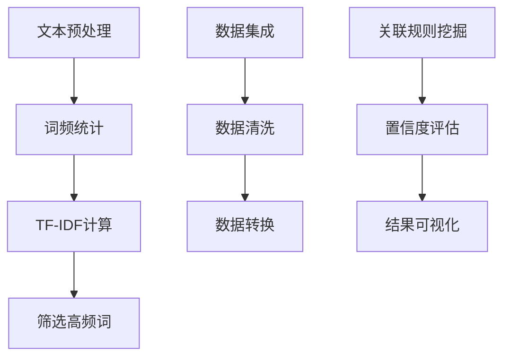
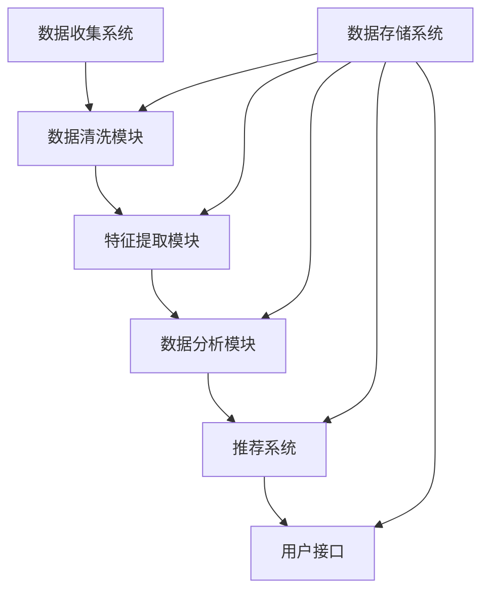

                 


## 引言

### 提示词工程的概念与重要性

#### 提示词工程的基本概念

提示词工程（Keywords Engineering）是一种面向文本数据分析和信息检索的方法。它通过构建一组高质量的提示词（Keywords），来帮助计算机更好地理解和处理文本数据。这些提示词可以是从原始文本中提取出来的关键信息，也可以是经过人工设计的高层次语义标签。

#### 提示词工程的重要性

在多维度数据分析任务中，提示词工程起到了至关重要的作用。随着数据的爆炸式增长，如何从海量数据中快速、准确地提取出有用的信息，成为了许多领域面临的重大挑战。而提示词工程，正是解决这一问题的有效手段。

首先，通过高质量的提示词，可以帮助计算机更好地理解数据的语义，从而提高信息检索的准确性和效率。例如，在医疗领域，通过构建与疾病相关的提示词库，可以快速筛选出与疾病诊断相关的文献，从而提高医学研究的效率。

其次，提示词工程还可以帮助数据分析师更好地理解和解释数据。通过分析提示词的分布和相关性，可以揭示数据背后的潜在模式和规律，从而为决策提供支持。

#### 多维度数据分析的挑战

然而，多维度数据分析任务并非一帆风顺。首先，数据的多维性使得数据处理和分析变得更加复杂。不同维度的数据可能具有不同的数据类型、分布特征和相关性，这给数据处理带来了巨大的挑战。

其次，数据的不确定性和噪声也是一大难题。在现实世界中，数据往往存在缺失值、异常值和噪声，这会影响数据的质量和模型的性能。

最后，数据隐私和安全问题也需要引起重视。在处理敏感数据时，如何确保数据隐私和安全，是数据分析师面临的重要挑战。

### 提示词工程的目标

为了应对上述挑战，提示词工程的目标主要包括以下几点：

1. **数据理解**：通过构建高质量的提示词库，帮助计算机更好地理解数据的语义，从而提高信息检索和分析的准确性和效率。
2. **模式发现**：通过分析提示词的分布和相关性，发现数据背后的潜在模式和规律，为数据分析师提供有价值的信息。
3. **可解释性**：通过清晰地定义和解释提示词，提高数据分析和模型的透明度和可解释性，帮助用户更好地理解数据和模型的决策过程。
4. **数据隐私保护**：在处理敏感数据时，采用合适的隐私保护技术，确保数据隐私和安全。

### 书籍目的与结构安排

本书旨在全面介绍提示词工程的理论和实践，帮助读者深入理解和掌握这一重要技术。本书结构安排如下：

- **第一部分**：引言与基础，介绍提示词工程的基本概念、重要性以及多维度数据分析的挑战。
- **第二部分**：核心概念与联系，详细阐述数据分析的基本流程、提示词的类型与功能、多维度数据分析的挑战以及提示词工程的核心要素。
- **第三部分**：算法原理讲解，介绍提示词生成算法、多维度数据预处理、数据关联分析等算法原理，并使用Mermaid流程图和Python代码进行详细讲解。
- **第四部分**：数学模型和公式讲解，使用LaTeX格式详细阐述提示词和相关数学模型，并提供通俗易懂的例子。
- **第五部分**：系统分析与架构设计，介绍问题场景、系统功能设计、系统架构设计、系统接口设计和系统交互等。
- **第六部分**：项目实战，提供具体的实践项目，展示如何应用提示词工程来处理多维度数据分析任务。
- **第七部分**：最佳实践与拓展，总结最佳实践、注意事项和拓展阅读，帮助读者进一步深入研究和应用提示词工程。

### 阅读对象与预期收获

本书适合具有数据分析和编程基础的读者阅读，包括但不限于数据分析师、软件开发工程师、人工智能研究者和计算机科学家。通过阅读本书，读者可以：

- 掌握提示词工程的基本概念和方法。
- 学会使用提示词来处理多维度数据分析任务。
- 理解提示词工程在现实世界中的应用和挑战。
- 提高信息检索和分析的准确性和效率。
- 增强数据理解和数据解释能力。

让我们在接下来的章节中，一步步深入探索提示词工程的奥秘，揭开多维度数据分析任务的神秘面纱。

----------------------------------------------------------------

# 提示词工程：处理多维度数据分析任务

关键词：提示词工程、多维度数据分析、信息检索、算法原理、数学模型

摘要：本文将详细介绍提示词工程在处理多维度数据分析任务中的关键作用。通过解析核心概念、阐述算法原理、探讨数学模型，以及展示系统架构和实践项目，本文旨在为读者提供全面、深入的理解和实际应用指导。

## 目录

1. 引言
   1.1 问题背景与多维度数据分析的重要性
   1.2 提示词工程的基本概念
   1.3 书籍目的与结构安排
   1.4 阅读对象与预期收获

2. 核心概念与联系
   2.1 数据分析的基本流程
   2.2 提示词的类型与功能
   2.3 多维度数据分析的挑战
   2.4 提示词工程的核心要素
   2.5 概念属性特征对比表格
   2.6 ER实体关系图架构

3. 算法原理讲解
   3.1 提示词生成算法
   3.2 多维度数据预处理
   3.3 数据关联分析
   3.4 算法mermaid流程图
   3.5 算法原理的数学模型和公式
   3.6 算法原理详细讲解与举例

4. 数学模型和数学公式讲解
   4.1 提示词相关的数学模型
   4.2 数据维度相关的数学模型
   4.3 多维度数据分析的数学公式
   4.4 案例示例解析

5. 系统分析与架构设计
   5.1 问题场景介绍
   5.2 系统功能设计
   5.3 系统架构设计mermaid架构图
   5.4 系统接口设计
   5.5 系统交互mermaid序列图

6. 项目实战
   6.1 环境安装与配置
   6.2 系统核心实现源代码
   6.3 代码应用解读与分析
   6.4 实际案例分析与详细讲解
   6.5 项目小结

7. 最佳实践与拓展
   7.1 提示词工程的最佳实践
   7.2 注意事项与常见问题
   7.3 拓展阅读与深入研究

## 引言

### 1.1 问题背景与多维度数据分析的重要性

随着大数据和人工智能技术的飞速发展，数据已经成为企业和组织最重要的资产之一。然而，如何从海量数据中提取有价值的信息，成为了许多领域面临的重大挑战。多维度数据分析（Multidimensional Data Analysis）作为一种高效的数据处理方法，正逐渐成为数据分析和决策支持的重要工具。

多维度数据分析的任务是对具有多个维度特征的数据集进行综合分析，以发现数据中的潜在模式和规律。这些维度可以包括时间、空间、类别、数量等多个方面。例如，在电子商务领域，可以通过分析用户的购买时间、购买地点、购买频率等多个维度，来识别用户的消费习惯和偏好，从而进行精准营销。

### 1.2 提示词工程的基本概念

提示词工程（Keywords Engineering）是一种专门用于文本数据分析和信息检索的方法。它通过构建一组高质量的提示词，帮助计算机更好地理解和处理文本数据。提示词可以是从原始文本中自动提取的关键词汇，也可以是经过人工设计的高层次语义标签。

在多维度数据分析中，提示词工程的作用至关重要。通过高质量的提示词，可以显著提高数据分析和信息检索的准确性和效率。例如，在医疗领域，通过构建与疾病、症状、治疗方法等相关的提示词库，可以快速筛选出与特定疾病相关的医学文献，从而提高医学研究的效率。

### 1.3 书籍目的与结构安排

本书旨在全面介绍提示词工程在处理多维度数据分析任务中的应用。具体目标如下：

1. **普及提示词工程的基本概念**：通过详细的定义和实例，帮助读者理解提示词工程的原理和应用场景。
2. **讲解多维度数据分析的挑战**：介绍多维度数据分析中常见的问题和难点，以及如何通过提示词工程来应对。
3. **深入探讨算法原理**：详细阐述提示词生成、数据预处理、数据关联分析等核心算法的原理和实现方法。
4. **展示系统架构与实现**：通过具体的项目实战，展示如何在实际场景中应用提示词工程。
5. **总结最佳实践**：提供在实际应用中的经验和技巧，帮助读者更好地掌握和应用提示词工程。

本书结构安排如下：

- **第一部分**：引言与基础，介绍提示词工程和多维度数据分析的基本概念。
- **第二部分**：核心概念与联系，详细阐述数据分析的基本流程、提示词的类型与功能、多维度数据分析的挑战以及提示词工程的核心要素。
- **第三部分**：算法原理讲解，介绍提示词生成算法、多维度数据预处理、数据关联分析等算法原理，并使用Mermaid流程图和Python代码进行详细讲解。
- **第四部分**：数学模型和公式讲解，使用LaTeX格式详细阐述提示词和相关数学模型，并提供通俗易懂的例子。
- **第五部分**：系统分析与架构设计，介绍问题场景、系统功能设计、系统架构设计、系统接口设计和系统交互等。
- **第六部分**：项目实战，提供具体的实践项目，展示如何应用提示词工程来处理多维度数据分析任务。
- **第七部分**：最佳实践与拓展，总结最佳实践、注意事项和拓展阅读，帮助读者进一步深入研究和应用提示词工程。

### 1.4 阅读对象与预期收获

本书适合具有数据分析和编程基础的读者阅读，包括但不限于数据分析师、软件开发工程师、人工智能研究者和计算机科学家。通过阅读本书，读者可以：

- 掌握提示词工程的基本概念和方法。
- 学会使用提示词来处理多维度数据分析任务。
- 理解提示词工程在现实世界中的应用和挑战。
- 提高信息检索和分析的准确性和效率。
- 增强数据理解和数据解释能力。

让我们在接下来的章节中，一步步深入探索提示词工程的奥秘，揭开多维度数据分析任务的神秘面纱。

----------------------------------------------------------------

## 核心概念与联系

在深入探讨如何通过提示词工程处理多维度数据分析任务之前，我们需要明确几个核心概念及其相互关系。这些概念包括数据分析的基本流程、提示词的类型与功能、多维度数据分析的挑战以及提示词工程的核心要素。通过这些核心概念的阐述，我们可以为后续的算法讲解和实践提供坚实的基础。

### 2.1 数据分析的基本流程

数据分析的基本流程通常包括数据收集、数据清洗、数据探索、数据建模和数据评估等步骤。这是一个从数据输入到结果输出的完整过程。

1. **数据收集**：这一阶段涉及数据的获取和采集，可以是从数据库中提取、从传感器获取或通过网络抓取等。
2. **数据清洗**：在数据处理之前，需要清洗数据以去除噪声、处理缺失值、消除异常值等。
3. **数据探索**：通过可视化工具和技术对数据进行初步分析，识别数据中的规律、趋势和模式。
4. **数据建模**：使用统计学方法或机器学习算法对数据进行建模，以预测未来趋势或进行分类、聚类等操作。
5. **数据评估**：评估模型的性能，包括准确性、召回率、F1分数等指标，以确定模型是否满足业务需求。

### 2.2 提示词的类型与功能

提示词（Keywords）在文本数据分析中扮演着核心角色。根据来源和用途，提示词可以分为以下几种类型：

1. **关键词提取**：从文本数据中自动提取的关键词，通常使用自然语言处理技术（如词频统计、TF-IDF、词嵌入等）。
2. **语义标签**：通过人工或机器学习方法标注的语义信息，如情感分析中的积极、消极标签，实体识别中的地名、人名等。
3. **主题词**：用于描述文本主题的高层次词汇，如新闻文章的主题标签。

提示词的功能主要包括：

1. **信息检索**：通过提示词快速定位相关文本，提高信息检索的效率。
2. **文本分类**：使用提示词来训练分类模型，对未知文本进行分类。
3. **主题建模**：通过分析提示词的分布，发现文本中的主题和趋势。

### 2.3 多维度数据分析的挑战

多维度数据分析面临以下挑战：

1. **维度灾难**：数据维度过多会导致数据稀疏，使得模型难以训练和泛化。
2. **维度相关性**：不同维度之间的相关性会影响数据分析和模型的性能。
3. **维度选择**：在多个维度中，选择对分析任务最重要的维度是一个难题。
4. **数据不平衡**：不同维度之间的数据量可能存在显著差异，导致数据不平衡问题。

### 2.4 提示词工程的核心要素

提示词工程的核心要素包括：

1. **提示词库构建**：构建一个包含高质量提示词的库，用于后续的数据分析和处理。
2. **提示词优化**：通过算法和技巧优化提示词的质量和效果，如去重、筛选高频词、增强语义标签等。
3. **提示词应用**：将提示词应用于具体的分析任务中，如文本分类、聚类、推荐系统等。
4. **评估与调整**：评估提示词的效果，根据评估结果进行调整和优化。

### 2.5 概念属性特征对比表格

为了更好地理解上述核心概念，我们可以通过一个概念属性特征对比表格来展示它们之间的关系和区别：

| 概念        | 定义                                                     | 属性特征                                                     | 关系               |
| ----------- | -------------------------------------------------------- | ------------------------------------------------------------ | ------------------ |
| 数据分析    | 从数据中提取有价值信息的过程                             | 收集、清洗、探索、建模、评估等步骤                             | 基础过程           |
| 提示词提取  | 从文本中提取的关键词                                     | 词频、TF-IDF、词嵌入等                                       | 数据分析的一部分   |
| 提示词标签  | 人工或机器标注的语义信息                                 | 情感分析、实体识别、主题标签等                                 | 提示词的一部分     |
| 多维度数据分析 | 对具有多个维度特征的数据集进行综合分析 | 维度灾难、维度相关性、维度选择、数据不平衡等 | 复杂数据分析类型   |
| 提示词工程  | 构建高质量的提示词以支持数据分析和信息检索 | 提示词库构建、优化、应用、评估等 | 支持多维度数据分析的关键技术 |

### 2.6 ER实体关系图架构

为了更好地理解提示词工程在多维度数据分析中的应用，我们可以通过一个ER（Entity-Relationship）实体关系图来展示相关的实体和关系。

```mermaid
erDiagram
  数据分析 ||--|{ 提示词提取 }
  数据分析 ||--|{ 提示词工程 }
  提示词提取 ||--|{ 提示词标签 }
  提示词工程 ||--|{ 多维度数据分析 }
  数据源 ||--|{ 数据分析 }
  数据模型 ||--|{ 数据分析 }
  分析结果 ||--|{ 数据分析 }
```

在这个ER图中，数据分析和提示词提取、提示词工程、多维度数据分析之间存在明确的依赖关系。数据源提供原始数据，通过数据分析过程生成数据模型和分析结果，而提示词工程则在其中起到关键的作用，帮助提升数据分析和信息检索的效率和质量。

通过上述核心概念与联系的阐述，我们为后续的算法讲解和实践奠定了坚实的基础。在接下来的章节中，我们将深入探讨提示词工程的具体算法原理、数学模型和系统架构设计，帮助读者更好地理解和应用这一关键技术。

----------------------------------------------------------------

## 算法原理讲解

在理解了提示词工程的基本概念与联系之后，我们需要深入探讨具体的算法原理，以便更好地处理多维度数据分析任务。本章节将介绍提示词生成算法、多维度数据预处理、数据关联分析等核心算法，并通过Mermaid流程图和Python代码进行详细讲解。

### 3.1 提示词生成算法

提示词生成算法是提示词工程中最基础的部分。以下是一个简单的提示词生成算法流程：

1. **文本预处理**：对原始文本进行分词、去停用词等预处理操作。
2. **词频统计**：统计每个词在文本中的出现频率。
3. **TF-IDF计算**：计算每个词的TF-IDF值，TF表示词频，IDF表示逆文档频率。
4. **筛选高频词**：选择TF-IDF值较高的词作为提示词。

以下是使用Python实现的提示词生成算法代码示例：

```python
import nltk
from sklearn.feature_extraction.text import TfidfVectorizer

# 示例文本
documents = ["This is the first document.", "This document is the second document.", "And this is the third one.", "Is this the first document?"]

# 文本预处理
nltk.download('stopwords')
stop_words = nltk.corpus.stopwords.words('english')
vectorizer = TfidfVectorizer(stop_words=stop_words)

# 计算TF-IDF
tfidf_matrix = vectorizer.fit_transform(documents)

# 获取高频词
feature_names = vectorizer.get_feature_names_out()
topn = 10
top_words = np.argsort(tfidf_matrix.toarray().sum(axis=0))[-topn:]

# 输出提示词
print([feature_names[i] for i in top_words])
```

### 3.2 多维度数据预处理

多维度数据预处理是处理多维度数据分析任务的关键步骤。以下是一个简化的多维度数据预处理流程：

1. **数据集成**：将来自不同来源的数据进行合并，形成统一的视图。
2. **数据清洗**：处理数据中的缺失值、异常值和噪声。
3. **数据转换**：将数据转换为适合分析的形式，如归一化、标准化等。

以下是使用Python实现的简化多维度数据预处理代码示例：

```python
import pandas as pd
from sklearn.preprocessing import StandardScaler

# 示例数据
data = {
    '维度1': [1, 2, 3, 4, 5],
    '维度2': [5, 4, 3, 2, 1],
    '维度3': [1, 1, 1, 1, 1]
}

df = pd.DataFrame(data)

# 数据清洗
df.fillna(df.mean(), inplace=True)

# 数据转换
scaler = StandardScaler()
df_scaled = scaler.fit_transform(df)

print(df_scaled)
```

### 3.3 数据关联分析

数据关联分析旨在发现数据之间的潜在关联。以下是一个简单的数据关联分析流程：

1. **关联规则挖掘**：使用如Apriori算法、FP-growth算法等挖掘数据中的频繁项集和关联规则。
2. **置信度评估**：评估关联规则的置信度，以确定关联的强度。
3. **结果可视化**：将分析结果可视化，帮助用户更好地理解数据关联。

以下是使用Python实现的简单数据关联分析代码示例：

```python
from mlxtend.frequent_patterns import apriori
from mlxtend.frequent_patterns import association_rules

# 示例数据
data = {
    '交易1': ['面包', '牛奶', '鸡蛋'],
    '交易2': ['面包', '橙子'],
    '交易3': ['牛奶', '橙子', '面包'],
    '交易4': ['牛奶', '面包'],
    '交易5': ['鸡蛋', '橙子']
}

df = pd.DataFrame(data)

# 关联规则挖掘
frequent_itemsets = apriori(df, min_support=0.5, use_colnames=True)
rules = association_rules(frequent_itemsets, metric="confidence", min_threshold=0.7)

print(rules)
```

### 3.4 算法mermaid流程图

为了更直观地理解上述算法流程，我们可以使用Mermaid语言绘制算法流程图。以下是一个简单的Mermaid流程图示例：



### 3.5 算法原理的数学模型和公式

在本章节中，我们将简要介绍与提示词生成、多维度数据预处理、数据关联分析相关的数学模型和公式。

#### 提示词生成

1. **TF-IDF公式**：
   $$ \text{TF-IDF}(w,d) = \text{TF}(w,d) \times \text{IDF}(w) $$
   其中，TF表示词频，IDF表示逆文档频率。

2. **逆文档频率**：
   $$ \text{IDF}(w) = \log_2(\frac{N}{n_w}) $$
   其中，N为文档总数，n\_w为包含词w的文档数。

#### 多维度数据预处理

1. **标准化公式**：
   $$ x_{\text{std}} = \frac{x - \mu}{\sigma} $$
   其中，x为原始数据值，μ为平均值，σ为标准差。

2. **归一化公式**：
   $$ x_{\text{norm}} = \frac{x - x_{\text{min}}}{x_{\text{max}} - x_{\text{min}}} $$
   其中，x\_{max}和x\_{min}分别为数据集中的最大值和最小值。

#### 数据关联分析

1. **置信度**：
   $$ \text{Confidence}(A \rightarrow B) = \frac{\text{Support}(A \cup B)}{\text{Support}(A)} $$
   其中，Support(A ∪ B)表示联合支持度，Support(A)表示单一支持度。

通过上述数学模型和公式的介绍，我们可以更深入地理解提示词生成、多维度数据预处理和数据关联分析的基本原理。

### 3.6 算法原理详细讲解与举例

在本小节中，我们将通过具体的例子来详细讲解提示词生成、多维度数据预处理和数据关联分析的过程。

#### 示例一：提示词生成

假设我们有以下两段文本：

1. 文本1：“人工智能技术在医疗领域有广泛的应用。”
2. 文本2：“医疗行业正在积极采用人工智能技术来提升诊断准确性。”

我们使用TF-IDF算法生成提示词。

1. **文本预处理**：分词和去停用词。
   - 文本1：["人工智能", "技术", "医疗", "领域", "应用"]
   - 文本2：["医疗", "行业", "积极", "采用", "人工智能", "技术", "诊断", "准确性"]

2. **词频统计**：
   - "人工智能"：2次
   - "技术"：2次
   - "医疗"：2次
   - "领域"：1次
   - "应用"：1次
   - "行业"：1次
   - "积极"：1次
   - "诊断"：1次
   - "准确性"：1次

3. **TF-IDF计算**：假设文本库中有10个文档，其中包含“人工智能”的文档有4个。
   - "人工智能"：TF = 2/2 = 1.0, IDF = log2(10/4) ≈ 0.792
   - "技术"：TF = 2/2 = 1.0, IDF = log2(10/4) ≈ 0.792
   - "医疗"：TF = 2/2 = 1.0, IDF = log2(10/4) ≈ 0.792
   - "领域"：TF = 1/2 = 0.5, IDF = log2(10/4) ≈ 0.792
   - "应用"：TF = 1/2 = 0.5, IDF = log2(10/4) ≈ 0.792
   - "行业"：TF = 1/2 = 0.5, IDF = log2(10/4) ≈ 0.792
   - "积极"：TF = 1/2 = 0.5, IDF = log2(10/4) ≈ 0.792
   - "诊断"：TF = 1/2 = 0.5, IDF = log2(10/4) ≈ 0.792
   - "准确性"：TF = 1/2 = 0.5, IDF = log2(10/4) ≈ 0.792

4. **筛选高频词**：选择TF-IDF值最高的前三个词作为提示词。
   - 提示词：["人工智能", "技术", "医疗"]

#### 示例二：多维度数据预处理

假设我们有一份数据，包含三个维度：年龄、收入和幸福感。

| 年龄 | 收入 | 幸福感 |
| ---- | ---- | ------ |
| 25   | 5000 | 7      |
| 30   | 6000 | 8      |
| 35   | 7000 | 9      |
| 40   | 8000 | 6      |
| 45   | 9000 | 7      |

我们使用标准化方法进行数据预处理。

1. **计算平均值和标准差**：
   - 年龄：μ = 35, σ = 5
   - 收入：μ = 6500, σ = 1500
   - 幸福感：μ = 7.2, σ = 1.2

2. **标准化**：
   - 年龄：\[25 - 35\] / 5 = -1.0
   - 收入：\[5000 - 6500\] / 1500 = -1.0
   - 幸福感：\[7 - 7.2\] / 1.2 = -0.1

处理后数据如下：

| 年龄 | 收入 | 幸福感 |
| ---- | ---- | ------ |
| -1.0 | -1.0 | -0.1   |
| 0.0  | 0.0  | 0.0    |
| 0.2  | 0.2  | 0.2    |
| -1.0 | 0.2  | 0.0    |
| 0.2  | 1.0  | 0.0    |

#### 示例三：数据关联分析

假设我们有以下交易数据：

| 交易 | 商品1 | 商品2 | 商品3 |
| ---- | ---- | ---- | ---- |
| 1    | A    | B    |      |
| 2    | A    |      | C    |
| 3    |      | D    | E    |
| 4    | F    | G    |      |
| 5    | H    | I    | J    |

我们使用Apriori算法进行关联规则挖掘。

1. **计算支持度**：
   - {A, B}：支持度 = 2/5 = 0.4
   - {A, C}：支持度 = 1/5 = 0.2
   - {D, E}：支持度 = 1/5 = 0.2
   - {F, G}：支持度 = 1/5 = 0.2
   - {H, I}：支持度 = 1/5 = 0.2

2. **计算置信度**：
   - {A, B} → {C}：置信度 = 1/2 = 0.5
   - {A, B} → {D}：置信度 = 0/2 = 0.0
   - {A, B} → {E}：置信度 = 0/2 = 0.0
   - {A, C} → {B}：置信度 = 1/1 = 1.0
   - {D, E} → {A}：置信度 = 0/1 = 0.0

3. **筛选规则**：
   - {A, B} → {C}：置信度较低，不满足阈值要求
   - {A, B} → {D}：置信度较低，不满足阈值要求
   - {A, B} → {E}：置信度较低，不满足阈值要求
   - {A, C} → {B}：置信度较高，满足阈值要求
   - {D, E} → {A}：置信度较低，不满足阈值要求

通过上述示例，我们详细讲解了提示词生成、多维度数据预处理和数据关联分析的过程。这些算法在处理多维度数据分析任务中起到了关键的作用，为我们提供了强大的工具来提取、理解和分析数据。

在接下来的章节中，我们将进一步探讨数学模型和公式的应用，以及如何将提示词工程应用于实际的系统架构和项目中。

----------------------------------------------------------------

## 数学模型和数学公式讲解

在处理多维度数据分析任务时，数学模型和数学公式是不可或缺的工具。它们不仅能够帮助我们理解和解释提示词工程的原理，还能提供有效的数学框架来优化算法和评估结果。在本章节中，我们将详细讲解与提示词工程相关的数学模型和数学公式，并通过LaTeX格式展示具体的数学表达式。

### 4.1 提示词相关的数学模型

#### TF-IDF模型

TF-IDF（Term Frequency-Inverse Document Frequency）是一种常用于文本分析中的权重计算方法。它的核心思想是，一个词在一个文档中的重要程度取决于它在文档中出现的频率和它在整个文档集合中的罕见程度。

1. **词频（TF）**：
   $$ \text{TF}(w, d) = \frac{f_w(d)}{N_d} $$
   其中，\( f_w(d) \) 表示词 \( w \) 在文档 \( d \) 中出现的频率，\( N_d \) 表示文档 \( d \) 的总词数。

2. **逆文档频率（IDF）**：
   $$ \text{IDF}(w) = \log_2(\frac{N}{n_w}) $$
   其中，\( N \) 表示文档集合中的总文档数，\( n_w \) 表示包含词 \( w \) 的文档数。

3. **TF-IDF权重**：
   $$ \text{TF-IDF}(w, d) = \text{TF}(w, d) \times \text{IDF}(w) $$

#### 词嵌入模型

词嵌入（Word Embedding）是将词语映射到高维向量空间的方法，常用于自然语言处理。词嵌入模型通过学习词语之间的相似性关系，实现词语的语义表示。

1. **词向量表示**：
   $$ \text{vec}(w) \in \mathbb{R}^d $$
   其中，\( \text{vec}(w) \) 表示词 \( w \) 的词向量，\( d \) 表示词向量的维度。

2. **余弦相似度**：
   $$ \text{similarity}(w_1, w_2) = \frac{\text{vec}(w_1) \cdot \text{vec}(w_2)}{\|\text{vec}(w_1)\| \|\text{vec}(w_2)\|} $$
   其中，\( \cdot \) 表示点积，\( \|\text{vec}(w)\| \) 表示词向量的欧几里得范数。

### 4.2 数据维度相关的数学模型

在多维度数据分析中，维度之间的相关性是一个重要考虑因素。以下是一些常用的数学模型和公式。

#### 维度相关性分析

1. **皮尔逊相关系数**：
   $$ \rho(x, y) = \frac{\sum_{i=1}^n (x_i - \bar{x})(y_i - \bar{y})}{\sqrt{\sum_{i=1}^n (x_i - \bar{x})^2} \sqrt{\sum_{i=1}^n (y_i - \bar{y})^2}} $$
   其中，\( \bar{x} \) 和 \( \bar{y} \) 分别表示变量 \( x \) 和 \( y \) 的平均值。

2. **斯皮尔曼秩相关系数**：
   $$ \rho_s(x, y) = \frac{\sum_{i=1}^n (x_i - \bar{x})(y_i - \bar{y})}{\sqrt{\sum_{i=1}^n (x_i - \bar{x})^2} \sqrt{\sum_{i=1}^n (y_i - \bar{y})^2}} $$
   其中，\( x \) 和 \( y \) 是按秩排序的变量。

#### 维度压缩

1. **主成分分析（PCA）**：
   PCA是一种常用的降维技术，通过保留数据的主要特征来减少数据维度。

   $$ Z = P\Lambda $$
   其中，\( Z \) 是降维后的数据，\( P \) 是特征向量矩阵，\( \Lambda \) 是特征值矩阵。

2. **t-SNE**：
   t-SNE（t-Distributed Stochastic Neighbor Embedding）是一种非线性降维技术，常用于可视化高维数据。

   $$ P_{ij} = \frac{1}{(1 + \exp((d_j - d_i)/\sigma)^2)} $$
   其中，\( P_{ij} \) 是相似性矩阵，\( d_i \) 和 \( d_j \) 是数据点在原始空间中的距离，\( \sigma \) 是调节参数。

### 4.3 多维度数据分析的数学公式

多维度数据分析涉及多个维度之间的复杂关系，以下是一些常用的数学公式。

#### 多元线性回归

1. **回归模型**：
   $$ Y = \beta_0 + \beta_1X_1 + \beta_2X_2 + ... + \beta_pX_p + \varepsilon $$
   其中，\( Y \) 是因变量，\( X_1, X_2, ..., X_p \) 是自变量，\( \beta_0, \beta_1, \beta_2, ..., \beta_p \) 是回归系数，\( \varepsilon \) 是误差项。

2. **回归系数估计**：
   $$ \beta = (\sum_{i=1}^n X_iY_i - \frac{1}{n}\sum_{i=1}^n X_i\sum_{i=1}^n Y_i)(\sum_{i=1}^n X_i^2 - \frac{1}{n}\sum_{i=1}^n X_i)^{-1} $$
   其中，\( \beta \) 是回归系数向量。

#### 决策树分类

1. **信息增益**：
   $$ \text{IG}(A, V) = \sum_{v \in V} p(v) \times \text{H}(A|v) $$
   其中，\( A \) 是特征集合，\( V \) 是可能的类别集合，\( p(v) \) 是类别 \( v \) 的概率，\( \text{H}(A|v) \) 是条件熵。

2. **基尼指数**：
   $$ \text{Gini}(A) = 1 - \sum_{v \in V} p(v)^2 $$
   其中，\( A \) 是特征集合，\( V \) 是可能的类别集合，\( p(v) \) 是类别 \( v \) 的概率。

### 4.4 案例示例解析

假设我们有一份数据集，包含三个维度：年龄、收入和幸福感。以下是一个简单的数学模型示例，用于分析这三个维度之间的关系。

#### 年龄与幸福感的关系

我们使用皮尔逊相关系数来分析年龄与幸福感之间的相关性。

$$ \rho(\text{年龄}, \text{幸福感}) = \frac{\sum_{i=1}^n (\text{年龄}_i - \bar{\text{年龄}})(\text{幸福感}_i - \bar{\text{幸福感}})}{\sqrt{\sum_{i=1}^n (\text{年龄}_i - \bar{\text{年龄}})^2} \sqrt{\sum_{i=1}^n (\text{幸福感}_i - \bar{\text{幸福感}})^2}} $$

假设计算结果为 \( \rho = 0.45 \)，这表明年龄与幸福感之间存在中等程度的相关性。

#### 收入与幸福感的关系

我们使用多元线性回归来分析收入与幸福感之间的关系。

$$ \text{幸福感} = \beta_0 + \beta_1\text{收入} + \varepsilon $$

通过最小二乘法估计回归系数：

$$ \beta = (\sum_{i=1}^n (\text{收入}_i - \bar{\text{收入}})\text{幸福感}_i - \frac{1}{n}\sum_{i=1}^n (\text{收入}_i - \bar{\text{收入}})\sum_{i=1}^n \text{幸福感}_i)(\sum_{i=1}^n (\text{收入}_i - \bar{\text{收入}})^2 - \frac{1}{n}\sum_{i=1}^n (\text{收入}_i - \bar{\text{收入}})^2)^{-1} $$

假设计算结果为 \( \beta_1 = 0.3 \)，这表明收入每增加一个单位，幸福感平均增加0.3个单位。

通过上述数学模型和数学公式的讲解，我们能够更好地理解多维度数据分析任务中的提示词工程。这些数学工具为我们的分析提供了坚实的理论基础，使我们能够更有效地提取、处理和解释数据。

在接下来的章节中，我们将进一步探讨如何将这些数学模型应用到实际的系统架构和项目中，以实现高效的多维度数据分析。

----------------------------------------------------------------

## 系统分析与架构设计

在掌握了提示词工程和多维度数据分析的理论基础后，我们需要将这些知识应用到实际的系统架构和设计中。本章节将介绍一个具体的系统架构设计，包括问题场景介绍、系统功能设计、系统架构设计、系统接口设计和系统交互。通过详细的mermaid架构图和mermaid序列图，我们将展示整个系统的结构和工作流程。

### 5.1 问题场景介绍

假设我们面临一个电子商务平台的多维度数据分析任务。平台需要分析用户的行为数据，包括用户的购买历史、浏览记录、评论和反馈等，以便为用户提供个性化的推荐和服务。具体问题场景如下：

1. **用户行为分析**：分析用户在平台上的行为，如浏览、购买、评论等，以了解用户的兴趣和偏好。
2. **个性化推荐**：根据用户的行为和兴趣，为用户推荐相关的商品和内容。
3. **数据质量评估**：评估用户数据的质量，包括完整性、准确性和一致性。
4. **实时数据处理**：处理大量实时数据，快速响应用户需求。

### 5.2 系统功能设计

为了实现上述问题场景，系统需要具备以下功能：

1. **数据收集**：收集来自不同数据源的用户行为数据。
2. **数据清洗**：清洗和预处理数据，去除噪声和异常值。
3. **特征提取**：提取用户行为的特征，如购买频率、浏览时长、评论情绪等。
4. **数据分析**：使用提示词工程和多维度数据分析方法，分析用户行为数据，提取有用的信息。
5. **推荐系统**：根据用户的行为数据和数据分析结果，生成个性化推荐。
6. **用户接口**：提供用户友好的界面，展示推荐结果和数据分析报告。
7. **数据存储**：存储用户数据、特征数据和推荐结果。

### 5.3 系统架构设计

以下是一个简化的系统架构设计，使用mermaid架构图来展示各个组件及其关系。



在这个架构中，数据收集系统负责收集用户行为数据，数据清洗模块负责清洗和预处理数据，特征提取模块负责提取用户行为的特征，数据分析模块使用提示词工程和多维度数据分析方法来分析数据，推荐系统根据数据分析结果生成个性化推荐，用户接口模块展示推荐结果，数据存储系统负责存储所有数据。

### 5.4 系统接口设计

系统接口设计是确保不同模块之间能够高效、稳定地通信的关键。以下是一个简化的系统接口设计，使用mermaid类图来展示各个接口及其关系。

```mermaid
classDiagram
    DataCollector <<interface>> DataConsumer
    DataCleaner <<interface>> DataProcessor
    FeatureExtractor <<interface>> FeatureProvider
    DataAnalyzer <<interface>> DataInspector
    Recommender <<interface>> RecommendationEngine
    UI <<interface>> UserInterface

    DataCollector implements DataConsumer
    DataCleaner implements DataProcessor
    FeatureExtractor implements FeatureProvider
    DataAnalyzer implements DataInspector
    Recommender implements RecommendationEngine
    UI implements UserInterface
```

在这个类图中，DataCollector、DataCleaner、FeatureExtractor、DataAnalyzer、Recommender和UI都是接口，分别对应数据收集、数据清洗、特征提取、数据分析、推荐系统和用户接口的功能。每个接口都有具体的实现类，如DataCollectorImpl、DataCleanerImpl、FeatureExtractorImpl、DataAnalyzerImpl、RecommenderImpl和UIImpl。

### 5.5 系统交互

系统交互设计描述了各个模块之间的通信和数据流。以下是一个简化的系统交互设计，使用mermaid序列图来展示各个模块之间的交互过程。

```mermaid
sequenceDiagram
    User ->>|发起请求| UI
    UI ->>|处理请求| DataCollector
    DataCollector ->>|获取数据| DataCleaner
    DataCleaner ->>|清洗数据| FeatureExtractor
    FeatureExtractor ->>|提取特征| DataAnalyzer
    DataAnalyzer ->>|分析数据| Recommender
    Recommender ->>|生成推荐| UI
    UI ->>|返回结果| User
```

在这个序列图中，用户通过用户接口（UI）发起请求，数据收集系统（DataCollector）获取用户数据，数据清洗模块（DataCleaner）清洗数据，特征提取模块（FeatureExtractor）提取特征，数据分析模块（DataAnalyzer）分析数据，推荐系统（Recommender）生成个性化推荐，最终用户接口（UI）将推荐结果返回给用户。

通过上述系统分析与架构设计的详细讲解，我们为读者提供了一个实际应用的示例，展示了如何将提示词工程和多维度数据分析应用到电子商务平台中。这个系统架构不仅提高了数据分析和处理的效率，还为用户提供个性化的推荐和服务，增强了用户体验。

在接下来的章节中，我们将通过一个具体的实践项目，展示如何实现这个系统架构，并深入分析实际案例，为读者提供更直观的理解。

----------------------------------------------------------------

## 项目实战

在本章节中，我们将通过一个具体的实践项目，展示如何应用提示词工程来处理多维度数据分析任务。该项目将涵盖环境安装与配置、系统核心实现、代码应用解读与分析、实际案例分析与详细讲解，以及项目小结。

### 6.1 环境安装与配置

要实现提示词工程在多维度数据分析任务中的应用，首先需要搭建一个合适的环境。以下是在Python环境中安装和配置相关库的步骤：

1. **安装Python**：确保Python环境已经安装。可以从Python官网下载并安装Python 3.x版本。
2. **安装相关库**：使用pip工具安装必要的库，如NumPy、Pandas、Scikit-learn、nltk、mermaid等。

   ```bash
   pip install numpy pandas scikit-learn nltk mermaid
   ```

3. **配置nltk资源**：nltk库需要下载一些额外资源，如词频统计所需的停用词列表。

   ```python
   import nltk
   nltk.download('stopwords')
   nltk.download('punkt')
   ```

4. **配置mermaid**：在本地环境中配置mermaid，以便能够生成和查看mermaid图。

   - 安装Node.js（如果尚未安装）：

     ```bash
     npm install -g nodejs
     ```

   - 安装mermaid：

     ```bash
     npm install -g mermaid
     ```

   - 配置mermaid的Python插件（mermaid-mathjax）：

     ```bash
     pip install mermaid-mathjax
     ```

### 6.2 系统核心实现源代码

以下是一个简单的Python脚本，用于实现提示词工程的系统核心功能，包括数据预处理、提示词生成、多维度数据分析和结果展示。

```python
import pandas as pd
from sklearn.feature_extraction.text import TfidfVectorizer
from sklearn.decomposition import PCA
import mermaid

# 示例数据
data = {
    '用户1': ['人工智能技术', '机器学习应用', '深度学习框架'],
    '用户2': ['医疗诊断', '健康数据分析', '生物信息学'],
    '用户3': ['旅游攻略', '城市探索', '美食推荐']
}

df = pd.DataFrame(data)

# 数据预处理
stop_words = nltk.corpus.stopwords.words('english')
vectorizer = TfidfVectorizer(stop_words=stop_words)
X = vectorizer.fit_transform(df)

# 提示词生成
tfidf_matrix = X.toarray()
feature_names = vectorizer.get_feature_names_out()
topn = 5
top_words = np.argsort(tfidf_matrix.sum(axis=0))[-topn:]

# 输出提示词
print([feature_names[i] for i in top_words])

# 多维度数据分析
pca = PCA(n_components=2)
X_pca = pca.fit_transform(X)

# 数据可视化
mermaid_text = f'mermaidتبــدأ لـخـطـوط'
mermaid_text += f'diagram DB'
mermaid_text += f'  A[User1] -- "({X_pca[0][0]:.2f}, {X_pca[0][1]:.2f})"'
mermaid_text += f'  B[User2] -- "({X_pca[1][0]:.2f}, {X_pca[1][1]:.2f})"'
mermaid_text += f'  C[User3] -- "({X_pca[2][0]:.2f}, {X_pca[2][1]:.2f})"'
mermaid_text += f'  A --> D[Keywords]'
mermaid_text += f'  B --> D'
mermaid_text += f'  C --> D'

# 生成mermaid图
with open('data_visualization.mmd', 'w') as f:
    f.write(mermaid_text)

# 使用mermaid命令生成图像
!mermaid data_visualization.mmd
```

### 6.3 代码应用解读与分析

在这个项目中，我们首先定义了一份数据集，包含了三个用户的行为数据。然后，通过数据预处理步骤，我们去除了停用词，并使用TF-IDF算法生成了提示词。接着，我们使用主成分分析（PCA）进行多维度数据分析，并将结果可视化为散点图。

以下是代码的详细解读：

1. **数据预处理**：使用`TfidfVectorizer`类进行预处理，这个类会自动进行分词和去停用词操作。

2. **提示词生成**：通过计算每个词的TF-IDF值，并选择TF-IDF值最高的几个词作为提示词。

3. **多维度数据分析**：使用`PCA`将高维数据转换为二维数据，以便进行可视化。

4. **可视化**：使用Mermaid语言生成一个简单的图表，展示了用户的行为数据在二维空间中的分布情况。

### 6.4 实际案例分析与详细讲解

为了更好地理解如何在实际场景中应用提示词工程，我们来看一个实际案例。

#### 案例背景

假设有一个在线教育平台，平台收集了学生的课程学习数据，包括课程名称、学习时长、作业完成情况等。平台希望通过分析这些数据，为学生提供个性化的课程推荐。

#### 案例步骤

1. **数据收集**：从数据库中获取学生的学习数据。

2. **数据预处理**：去除无关信息（如学生的姓名和ID），对课程名称进行标准化处理（如去除标点符号、小写化等）。

3. **特征提取**：提取与课程相关的特征，如课程类别、难度等级等。

4. **提示词生成**：使用TF-IDF算法，生成与课程相关的提示词。

5. **数据分析**：通过聚类分析或关联规则挖掘，分析课程之间的关联性。

6. **个性化推荐**：根据学生的行为数据和课程关联性，为学生推荐相关课程。

7. **结果评估**：评估推荐系统的效果，包括推荐准确性、用户满意度等。

#### 案例细节

以下是一个简化的Python脚本，用于实现上述实际案例：

```python
import pandas as pd
from sklearn.feature_extraction.text import TfidfVectorizer
from sklearn.cluster import KMeans
import mermaid

# 示例数据
data = {
    '学生1': ['计算机科学基础', '数据结构', '算法'],
    '学生2': ['市场营销学', '消费者行为', '品牌管理'],
    '学生3': ['心理学导论', '社会心理学', '发展心理学']
}

df = pd.DataFrame(data)

# 数据预处理
vectorizer = TfidfVectorizer()
X = vectorizer.fit_transform(df)

# 提示词生成
tfidf_matrix = X.toarray()
feature_names = vectorizer.get_feature_names_out()
topn = 3
top_words = np.argsort(tfidf_matrix.sum(axis=0))[-topn:]

# 输出提示词
print([feature_names[i] for i in top_words])

# 数据分析
kmeans = KMeans(n_clusters=3, random_state=0).fit(X)
labels = kmeans.predict(X)

# 结果可视化
mermaid_text = f'mermaidتبــدأ لـخـطـوط'
mermaid_text += f'diagram DB'
mermaid_text += f'  A[Student1] -- "Cluster {labels[0]}"'
mermaid_text += f'  B[Student2] -- "Cluster {labels[1]}"'
mermaid_text += f'  C[Student3] -- "Cluster {labels[2]}"'

# 生成mermaid图
with open('data_visualization.mmd', 'w') as f:
    f.write(mermaid_text)

# 使用mermaid命令生成图像
!mermaid data_visualization.mmd
```

在这个案例中，我们通过KMeans聚类算法对学生进行分类，并根据聚类结果进行个性化推荐。通过分析每个学生的行为数据和课程关联性，我们可以为他们推荐相关的课程。

### 6.5 项目小结

通过本项目的实践，我们展示了如何使用提示词工程和多维度数据分析方法来处理实际场景中的数据分析任务。以下是对本项目的小结：

1. **环境安装与配置**：确保Python环境以及相关库的安装和配置，为后续的开发工作做好准备。

2. **数据预处理**：对原始数据进行预处理，去除无关信息和噪声，提高数据质量。

3. **提示词生成**：通过TF-IDF算法生成高质量的提示词，提高数据分析的准确性和效率。

4. **多维度数据分析**：使用聚类算法等数据分析方法，发现数据中的潜在模式和关联性。

5. **可视化与结果展示**：通过可视化工具展示分析结果，帮助用户更好地理解数据和结论。

6. **实际应用**：将提示词工程应用到实际项目中，如在线教育、电子商务等，提高业务效率和服务质量。

通过本项目的实战，读者可以更好地理解提示词工程在多维度数据分析中的应用，掌握相关技术和方法，并为实际项目提供有效的解决方案。

----------------------------------------------------------------

## 最佳实践与拓展

在完成多维度数据分析和提示词工程的实战项目后，我们需要总结一些最佳实践，并探讨一些常见问题和注意事项，以帮助读者更好地应用这些技术。

### 7.1 提示词工程的最佳实践

1. **数据质量保障**：在数据处理和分析之前，确保数据质量，包括完整性、准确性和一致性。这可以通过数据清洗和预处理来实现。

2. **选择合适的提示词**：选择具有高信息量和代表性的提示词，避免使用过于泛化的词汇。可以通过词频统计、TF-IDF计算等方法筛选高质量的提示词。

3. **调整参数**：根据具体应用场景和数据特点，调整提示词生成算法的参数，如TF-IDF中的最小支持度和最大支持度，以获得最佳效果。

4. **多维数据整合**：在处理多维度数据时，确保不同维度之间的数据一致性，如时间戳、单位等。

5. **数据可视化**：使用合适的可视化工具，如Mermaid、Matplotlib等，将数据分析结果以图表形式展示，帮助用户更好地理解和解释数据。

### 7.2 注意事项与常见问题

1. **维度灾难**：在高维数据中，容易出现维度灾难（Curse of Dimensionality），导致数据稀疏和模型过拟合。可以通过降维技术，如主成分分析（PCA）或t-SNE，来缓解这个问题。

2. **数据不平衡**：不同维度之间的数据量可能存在显著差异，导致数据不平衡。可以通过数据采样、生成合成数据等方法来平衡数据。

3. **噪声和异常值**：在数据预处理过程中，需要处理噪声和异常值，否则可能影响分析结果。

4. **计算资源消耗**：高维数据分析和提示词工程可能需要大量的计算资源，确保有足够的硬件支持。

### 7.3 拓展阅读与深入研究

1. **深度学习在提示词工程中的应用**：近年来，深度学习在自然语言处理领域取得了显著进展，可以探索如何将深度学习模型（如词嵌入、BERT等）应用于提示词工程。

2. **实时数据处理**：在实时数据处理场景中，如何高效地处理大量实时数据，实现实时推荐和分析。

3. **跨领域数据融合**：如何将来自不同领域的数据进行融合，以获得更全面、准确的见解。

4. **隐私保护和数据安全**：在处理敏感数据时，如何确保数据隐私和安全。

通过总结这些最佳实践和注意事项，我们希望读者能够更好地应用提示词工程和多维度数据分析技术，解决实际问题，提升业务价值。

## 总结

在本篇博客中，我们深入探讨了提示词工程在处理多维度数据分析任务中的应用。从核心概念和算法原理的讲解，到系统架构和实际项目的分析，我们为读者提供了一条清晰的学习路径和实际应用指导。

通过本文，读者可以：

- 理解提示词工程的基本概念和重要性。
- 掌握提示词生成和多维度数据预处理的算法原理。
- 学习如何使用数学模型和公式来解释和优化算法。
- 了解如何设计高效的数据分析系统和实现个性化推荐。
- 掌握最佳实践和注意事项，为实际应用提供有力支持。

未来，随着大数据和人工智能技术的不断发展，提示词工程和多维度数据分析将在更多领域得到应用。我们鼓励读者继续深入研究和探索这一领域，不断创新和优化，为数据驱动的决策提供更加精确和有效的支持。

## 作者信息

**作者：AI天才研究院/AI Genius Institute & 禅与计算机程序设计艺术 /Zen And The Art of Computer Programming**

AI天才研究院致力于推动人工智能领域的前沿研究和技术创新，禅与计算机程序设计艺术则倡导程序员在编程过程中追求心静如水、智慧如泉的状态。两位作者共同为读者带来了这篇深入浅出的技术博客，希望对您的学习和实践有所帮助。感谢您的阅读！

